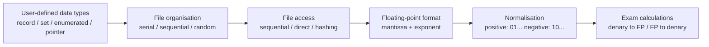
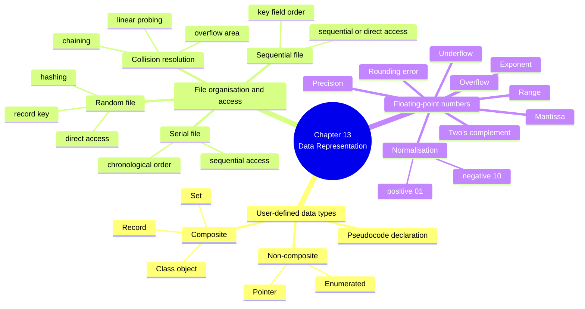
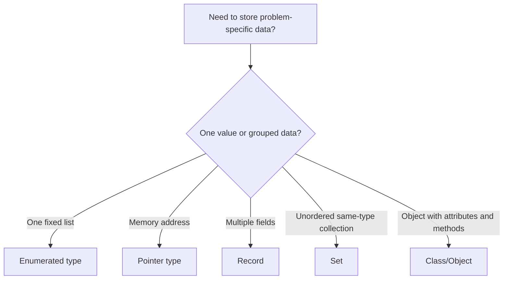
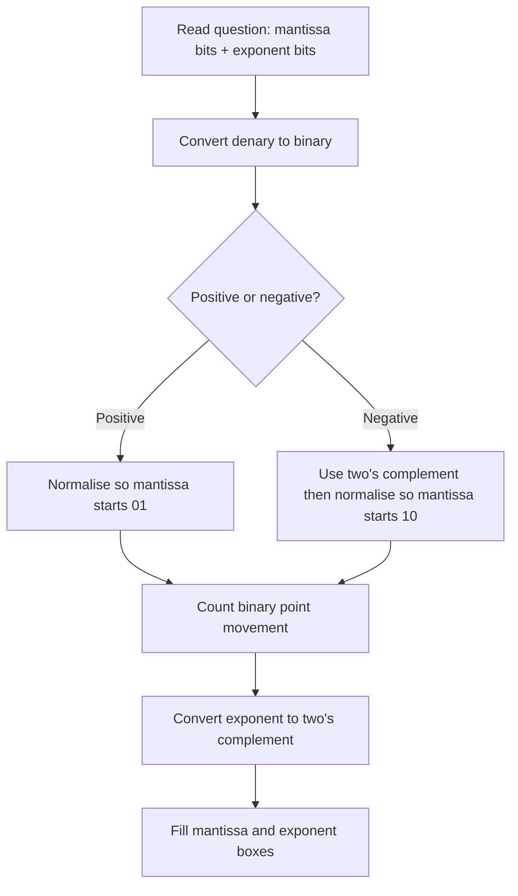

# A2 9618 Computer Science — Chapter 13 Updated Notes
## Data Representation｜Syllabus-Aligned Paper 3 Revision Sheet

> **Version:** Syllabus-aligned revision; informed by recent Paper 3 patterns  
> **Target:** Cambridge International AS & A Level Computer Science 9618 A2  
> **Chapter:** 13 Data Representation  
> **Main audience:** Students  
> **Style:** 中文解释 + English mark scheme keywords / pseudocode phrases  
> **Important update:** 本版不再使用 2023 past paper 作为趋势依据；趋势判断以 **2024 Paper 3 + 2025 May/June and Oct/Nov Paper 3** 为主。

---

# 0. How to Use This Sheet

Chapter 13 不是普通的“背定义”章节。2024 和 2025 的 Paper 3 很明显喜欢把本章拆成三种题型：

1. **User-defined data type pseudocode**：写 `TYPE ... ENDTYPE`、`SET OF ...`、enumerated type、record field assignment。  
2. **File organisation / access explanation**：serial / sequential / random、sequential access、hashing、collision resolution。  
3. **Floating-point calculation**：normalise、denary ↔ floating-point、two's complement mantissa / exponent、precision / range / overflow / underflow。

复习顺序建议：



---

# 1. Recent Paper 3 Pattern Map

| Area | Recent exam pattern | What students must practise |
| --- | --- | --- |
| Floating-point conversion | Very high frequency | Convert denary ↔ normalised binary floating-point; show working; handle negative values using two's complement; 2025 May/June and Oct/Nov both reinforced this |
| Mantissa / exponent allocation | High frequency | More mantissa bits = more precision; more exponent bits = greater range |
| User-defined records | Very high frequency | `TYPE ... ENDTYPE`, correct field names, correct data types, `DECLARE` used correctly |
| Enumerated type | Very high frequency | Fixed list of possible values; useful when a field has limited possible values; repeated in 2025 vehicle/gate/activity-style questions |
| Set data type | High frequency | Composite type, unordered elements, same data type, `SET OF`, set theory operations |
| Composite vs non-composite | High frequency | Composite refers to other data types / contains multiple elements; non-composite does not |
| File access and file organisation | Medium-high | Serial, sequential, random; sequential access; direct access; choose suitable method |
| Hashing algorithm | Medium-high | Hash key to location; collision; linear probing / overflow area / chaining |
| Pointer type | Medium | Stores memory address; indicates the type of data at that address |
| Very detailed binary file internal storage | Low | Know text vs binary and records/fields; avoid over-learning beyond mark scheme wording |

---

# 2. Content Update Decision

## 2.1 Keep and Strengthen

| Kept / strengthened content | Why |
| --- | --- |
| `TYPE ... ENDTYPE` record declaration | Appears directly in 2024 and 2025 Paper 3 |
| Enumerated type declaration | Tested repeatedly through vehicle/gate/video-format style questions |
| Set declaration with `SET OF` and `DEFINE` | 2024/2025 style asks both description and pseudocode |
| Composite vs non-composite definitions | Repeated short-answer definition topic |
| Sequential access and serial/sequential file explanation | 2024 Paper 3 tested exact wording |
| Hashing + collision resolution | 2024 Paper 3 tested hashing in file access; still syllabus core |
| Floating-point normalisation | Most stable high-frequency calculation topic |
| Negative floating-point using two's complement | High-risk calculation area; many students lose working marks |
| Precision / range / rounding / overflow / underflow | Common explanation marks around floating-point representation |

## 2.2 Downweight

| Downweighted content | Why |
| --- | --- |
| Long general explanation of why all data is binary | More AS-level; A2 questions expect specific data structure / file / floating-point answers |
| Too much theory on text files vs binary files | Usually not enough marks to justify very deep coverage |
| Detailed alternative hashing algorithms not named in syllabus | Students mainly need hashing, collisions, linear search/probing, overflow area, chaining |
| Excessive mathematical proof of floating-point precision | Cambridge expects practical explanation: fixed number of bits, truncation, rounding error |

## 2.3 Remove / Avoid

| Avoid | Reason |
| --- | --- |
| Saying a record is always a built-in type | In this syllabus record is treated as user-defined composite type |
| Saying set elements are ordered | Mark scheme expects unordered elements |
| Saying an enumerated value is a string | Enumerated values are identifiers / listed values, not quoted strings |
| Saying random access means “randomly chosen” | It means direct access using a relationship between key and storage location |
| Saying more exponent bits improves precision | More exponent bits improves range; more mantissa bits improves precision |

---

# 3. One-Page Mind Map



---

# 4. 13.1 User-Defined Data Types

## 4.1 Why user-defined data types are necessary

### Mark scheme answer
> User-defined data types allow the programmer to create data types that match the needs of a specific problem. They make the program easier to understand, less error-prone and allow related data items to be grouped together under one identifier.

### Must-have keywords
+ **user-defined**
+ **specific problem**
+ **group related data**
+ **single identifier**
+ **easier to understand**
+ **less error-prone**

### Common weak answer
> They are used because the programmer wants a new type.

Too vague. You need to explain **why** a built-in type is not enough.

---

## 4.2 Composite vs non-composite data types

| Type | Meaning | Examples |
| --- | --- | --- |
| Non-composite data type | Defined without referencing another data type / contains one data type | enumerated, pointer |
| Composite data type | Refers to other data types in its definition / contains multiple elements | record, set, class/object |

### Mark scheme style
> A non-composite data type can be defined without referencing another data type. A composite data type is a collection of data that may contain multiple elements of the same or different data types, grouped under one identifier.

### Common mistake
| Mistake | Correction |
| --- | --- |
| saying composite means “harder data type” | composite means it is made from / refers to other type(s) |
| saying non-composite cannot be user-defined | enumerated and pointer can be user-defined non-composite types |
| saying a record is non-composite | record is composite because it contains fields |

---

## 4.3 Enumerated type

### Definition
> An enumerated data type is a user-defined non-composite data type with a fixed list of possible values.

### Important exam points
+ Values are chosen from a **fixed list**.
+ It is useful when a field has a **limited range of possible values**.
+ The values should usually be written as identifiers, not strings.

### Pseudocode pattern
```text
TYPE <TypeName> = (<Value1>, <Value2>, <Value3>)
```

### Example 1: vehicle type
```text
TYPE Vehicle = (M100, M230, T101, T102, T120, T150)
```

### Example 2: gate type
```text
TYPE GateID = (N01, N02, N03, W01, W02, W03, W04)
DECLARE Gate : GateID
```

### When to choose enumerated type
| Scenario | Good enumerated field? | Why |
| --- | --- | --- |
| video format: DVD, BluRay, MP4, FourK | Yes | fixed range of possible values |
| student name | No | too many possible values |
| day of week | Yes | fixed list of seven values |
| telephone number | No | should be stored as string, not limited list |

---

## 4.4 Pointer type

### Definition
> A pointer data type is a user-defined non-composite data type that stores a memory address and indicates the type of data stored at that location.

### Pseudocode pattern
```text
TYPE <PointerType> = ^<DataType>
DECLARE <PointerVariable> : <PointerType>
```

### Example
```text
TYPE TNamePointer = ^STRING
DECLARE CurrentName : TNamePointer
```

### Mark scheme keywords
+ **stores address / memory location**
+ **points to data**
+ **indicates type of data stored at the memory location**
+ **dereference** means access the data at the address

---

## 4.5 Record type

### Definition
> A record is a user-defined composite data type that contains a fixed number of fields, where the fields may be of different data types.

### Pseudocode pattern
```text
TYPE <RecordName>
    DECLARE <Field1> : <DataType>
    DECLARE <Field2> : <DataType>
ENDTYPE
```

### Example: booking record
```text
TYPE Booking
    DECLARE BookingNumber : STRING
    DECLARE Destination : STRING
    DECLARE ClientName : STRING
    DECLARE ClientTelephone : STRING
    DECLARE DateOfDeparture : DATE
    DECLARE PickupAddress : STRING
    DECLARE TaxiUsed : Vehicle
ENDTYPE
```

### Example: video library record
```text
TYPE VideoLibrary
    DECLARE VideoID : STRING
    DECLARE Title : STRING
    DECLARE ReleaseYear : INTEGER
    DECLARE PurchaseDate : DATE
    DECLARE VideoFormat : STRING
    DECLARE RunningTime : INTEGER
ENDTYPE
```

### Field assignment pattern
```text
Flight1.FlightNumber ← "SB2789"
Flight1.Destination ← "Dublin"
Flight1.FlightDate ← 30/07/2025
Flight1.Gate ← "N03"
Flight1.Airline ← "Cambridge Airways"
```

### Exam warning
| Field | Better data type | Reason |
| --- | --- | --- |
| telephone number | STRING | may contain leading zero / spaces / + symbol; not used for arithmetic |
| ID code | STRING | may contain letters and numbers |
| year | INTEGER | whole number |
| price | REAL / CURRENCY | contains decimal value |
| date | DATE | date value |

---

## 4.6 Set type

### Definition
> A set is a user-defined composite data type that contains an unordered list of elements. Set theory operations such as union and intersection can be applied. All elements are of the same data type.

### Must-have keywords
+ **composite data type**
+ **unordered elements**
+ **same data type**
+ **set theory operations**
+ **union / intersection / difference**

### Pseudocode pattern
```text
TYPE <SetType> = SET OF <DataType>
DEFINE <VariableName> (<values>) : <SetType>
```

### Example: mathematical operators
```text
TYPE SymbolSet = SET OF CHAR
DEFINE Operators ('+', '–', '*', '/', '^') : SymbolSet
```

### Common mistake
| Mistake | Correction |
| --- | --- |
| writing `TYPE SymbolSet = ('+', '-', '*')` | that looks like an enumerated type, not a set |
| forgetting `SET OF CHAR` | set type needs the element data type |
| saying set elements are ordered | sets are unordered |
| mixing data types inside one set | all elements should be same data type |

---

# 5. 13.2 File Organisation and Access

## 5.1 File organisation overview

| File organisation | How records are stored | Common access method | Good for |
| --- | --- | --- | --- |
| Serial | no key order; often chronological order / order of arrival | sequential access | transaction logs, backup, batch processing |
| Sequential | ordered by a key field | sequential access or direct access | master files, sorted customer/account records |
| Random | record location based on record key / hashing | direct access | fast lookup, update, delete of individual records |

---

## 5.2 Serial file organisation

### Mark scheme answer
> In a serial file, records are stored in the order they are added, often chronological order. There is no ordering by key field, so records must be checked one after another until the required record is found or all records have been checked.

### Suitable uses
+ transaction file
+ log file
+ backup file
+ data collected before sorting

### Common mistake
> Serial means one record only.

Wrong. Serial means records are stored **without key order**.

---

## 5.3 Sequential file organisation

### Mark scheme answer
> In a sequential file, records are stored in order of a key field. The key field is compared as the file is searched, and the search can stop when the required key is found or when the current key is greater than the target key.

### Key points
+ Records are **ordered**.
+ Order is based on a **key field**.
+ Sequential access reads records from the start.
+ Updating may require creating a **new version of the file**.

### Serial vs sequential
| Point | Serial file | Sequential file |
| --- | --- | --- |
| Order | order of arrival / chronological | order of key field |
| Search | check every record until found / EOF | check until found or key exceeded |
| Key field | not required for order | required for order |
| Efficiency | usually slower for search | can stop earlier if key exceeded |

---

## 5.4 Random file organisation

### Mark scheme answer
> In a random file, records are stored in no particular sequence. There is a relationship between the record key and its location in the file, often using a hashing algorithm, so records can be accessed directly.

### Suitable uses
+ fast account lookup
+ stock item lookup
+ updating individual records
+ deleting / overwriting records

---

## 5.5 Sequential access

### Mark scheme answer
> Sequential access searches records one after another from the physical start of the file until the record is found or the end of file is reached.

### Pseudocode idea
```text
OPENFILE "Customer.dat" FOR READ
WHILE NOT EOF("Customer.dat") AND Found = FALSE
    READFILE "Customer.dat", CurrentRecord
    IF CurrentRecord.ID = SearchID THEN
        Found ← TRUE
    ENDIF
ENDWHILE
CLOSEFILE "Customer.dat"
```

---

## 5.6 Direct access

### Mark scheme answer
> Direct access allows a record to be accessed without reading every previous record. A calculation or index can be used to identify the likely record location.

### Typical pseudocode keywords
```text
OPENFILE "AccountRecords.dat" FOR RANDOM
Location ← Hash(AccountNumber)
SEEK "AccountRecords.dat", Location
GETRECORD "AccountRecords.dat", Customer
```

---

## 5.7 Hashing algorithm

### Definition
> A hashing algorithm takes a record key as input and calculates the storage location / address for that record in the file.

### Example
```text
Location ← AccountNumber MOD 1000
```

### Mark scheme keywords
+ **record key**
+ **hash value**
+ **storage location**
+ **same key gives same location**
+ **used for direct access**

---

## 5.8 Collision and collision resolution

### Definition
> A collision occurs when two different record keys are processed by the hashing algorithm and produce the same hash value / storage location.

### Methods of overcoming collisions
| Method | How it works |
| --- | --- |
| Linear probing / closed hashing | Start at original hash location, then check following locations until a free slot is found |
| Overflow area / open hashing | Store collided records in a separate overflow area and search it linearly |
| Chaining | Each storage location holds a reference to a chain / collection of records with the same hash value |

### Common mistake
| Weak answer | Better answer |
| --- | --- |
| collision means the file crashes | collision means two keys produce the same storage location |
| just “try another place” | search linearly from original hash location until first available slot |
| hashing guarantees unique addresses | hashing can produce collisions |

---

# 6. 13.3 Floating-Point Numbers

## 6.1 Format of floating-point representation

A binary floating-point number is stored using:

1. **Mantissa**: stores the significant digits / value.  
2. **Exponent**: stores how far the binary point is moved.  
3. **Two's complement**: used for both mantissa and exponent in this syllabus.

### General idea
```text
Number = Mantissa × 2^Exponent
```

### Important assumption
The binary point is normally placed immediately after the sign bit in the mantissa.

Example mantissa:
```text
0.101101...
```

---

## 6.2 Normalisation

### Rule
A normalised mantissa uses the available bits efficiently.

| Number type | Normalised mantissa starts with |
| --- | --- |
| Positive | `01` |
| Negative | `10` |

### Why normalise?
> Normalisation gives the maximum precision for the number of bits available in the mantissa.

### Mark scheme keywords
+ **maximum precision**
+ **full use of mantissa bits**
+ **two most significant bits are different**
+ positive starts **01**
+ negative starts **10**

---

## 6.3 Positive denary to floating-point

### Example: +54.8125 using 12-bit mantissa and 4-bit exponent

Step 1: Convert to binary.

```text
54 = 32 + 16 + 4 + 2 = 110110
0.8125 = 0.5 + 0.25 + 0.0625 = .1101
54.8125 = 110110.1101
```

Step 2: Move binary point to normalised form.

```text
110110.1101 = 0.1101101101 × 2^6
```

Step 3: Fill mantissa and exponent.

```text
Mantissa: 011011011010
Exponent: 0110
```

### Exam warning
If the question gives 10 mantissa bits, write 10 bits. If it gives 12 mantissa bits, write 12 bits.

---

## 6.4 Negative denary to floating-point

### Method
1. Convert the positive version to binary.  
2. Convert to negative using two's complement.  
3. Normalise.  
4. Write mantissa and exponent with the required number of bits.

### Example: –25.3125 using 10-bit mantissa and 6-bit exponent

Step 1: Positive version.

```text
25.3125 = 11001.0101
```

Step 2: Negative two's complement form.

```text
-25.3125 = 100110.1011
```

Step 3: Normalise.

```text
100110.1011 = 1.001101011 × 2^5
```

Step 4: Store in 10-bit mantissa and 6-bit exponent.

```text
Mantissa: 1001101011
Exponent: 000101
```

### Common mistake
| Mistake | Correction |
| --- | --- |
| normalising negative number as `01...` | negative normalised mantissa starts `10...` |
| converting exponent as unsigned when negative exponent needed | exponent is two's complement too |
| forgetting fractional bits | binary fractions use 1/2, 1/4, 1/8, 1/16... |

---

## 6.5 Floating-point to denary

### Method
1. Read the exponent. If MSB is 1, convert from two's complement.  
2. Move the binary point by the exponent value.  
3. Convert the mantissa value to denary.  
4. If mantissa starts with 1, treat it as negative two's complement.

### Example: 12-bit mantissa, 4-bit exponent

```text
Mantissa: 101000101011
Exponent: 0110
```

Exponent:
```text
0110 = 6
```

Move binary point 6 places right:
```text
1010001.01011
```

Convert as two's complement:
```text
= -64 + 16 + 1 + 0.25 + 0.0625 + 0.03125
= -46.65625
```

### Mark scheme answer structure
1. Show exponent conversion.  
2. Show binary point movement.  
3. Show denary calculation.  
4. Give final denary answer.

---

## 6.6 Precision, range, rounding, overflow and underflow

| Concept | Meaning | Exam phrase |
| --- | --- | --- |
| Precision | Accuracy / detail of the stored number | more mantissa bits gives greater precision |
| Range | Size of numbers that can be represented | more exponent bits gives greater range |
| Rounding error | Binary representation is an approximation | fixed bits means value may be rounded/truncated |
| Overflow | Number too large to be represented | exponent / storage range not enough |
| Underflow | Number too close to zero to be represented | very small value cannot be stored |

### Mark scheme style
> If the number of bits in the mantissa is increased, precision increases. If the number of bits in the exponent is increased, the range of possible numbers increases.

### Common mistake
| Student writes | Why weak |
| --- | --- |
| more exponent bits means more accurate | exponent affects range, not precision |
| rounding error only happens in denary | binary fractions often cannot exactly represent denary fractions |
| underflow means negative number | underflow means too small / too close to zero |
| overflow means syntax error | overflow means too large to store |

---

# 7. Mark Scheme Keywords

## 7.1 User-defined data types
+ **user-defined data type**
+ **non-composite**
+ **composite**
+ **does not refer to another data type**
+ **contains multiple elements**
+ **grouped under a single identifier**
+ **fixed list of possible values**
+ **fixed range of possible values**
+ **stores addresses / memory locations**
+ **record contains fields**
+ **fields may be of different data types**
+ **set is unordered**
+ **set theory operations**

## 7.2 File organisation and access
+ **records stored in chronological order**
+ **records stored in order of a key field**
+ **sequential access searches records one after another**
+ **from the physical start of the file**
+ **until the record is found / EOF**
+ **direct access**
+ **record key**
+ **hashing algorithm**
+ **hash value / storage location**
+ **collision**
+ **linear probing**
+ **overflow area**
+ **chaining**

## 7.3 Floating-point
+ **mantissa**
+ **exponent**
+ **two's complement**
+ **normalised**
+ **binary point moved**
+ **positive starts 01**
+ **negative starts 10**
+ **precision**
+ **range**
+ **rounding error / truncation**
+ **overflow**
+ **underflow**

---

# 8. Common Mistakes

| Topic | Common mistake | Correction |
| --- | --- | --- |
| Record | Missing `ENDTYPE` | Always close a record declaration |
| Record | Wrong data type for phone number | Use `STRING`, not `INTEGER` |
| Enumerated type | Quoting enum values as strings | Use identifiers like `DVD`, `MP4`, `BluRay` |
| Set | Forgetting `SET OF` | A set type must state element type |
| Set | Saying elements are ordered | Sets are unordered |
| Composite | Saying all composite fields must be same type | Record fields may be different types; set elements are same type |
| Sequential file | Saying sequential file means random order | Sequential file is ordered by key field |
| Serial file | Saying serial file is sorted | Serial file is stored in order of arrival / chronological order |
| Hashing | Saying no collisions occur | Collisions can occur and must be handled |
| Floating-point | Forgetting to show working | Marks often require binary conversion / point movement |
| Floating-point | Wrong normalisation pattern | Positive starts `01`, negative starts `10` |
| Mantissa/exponent | Mixing precision and range | Mantissa → precision; exponent → range |

---

# 9. Scenario Answer Bank

## 9.1 Describe a record data type
> A record is a user-defined composite data type. It contains a fixed number of fields, and the fields can be of different data types. The fields are grouped under one identifier.

## 9.2 Declare a record
```text
TYPE Order
    DECLARE AccountNumber : STRING
    DECLARE OrderNumber : STRING
    DECLARE OrderPrice : REAL
    DECLARE OrderDate : DATE
ENDTYPE
```

## 9.3 Explain why a field should be enumerated
> This field has a fixed range of possible values, so an enumerated type would restrict the values to valid options and make the program less error-prone.

## 9.4 Describe a set
> A set is a user-defined composite data type containing unordered elements of the same data type. Set theory operations such as union, intersection and difference can be applied.

## 9.5 Describe sequential access
> Sequential access searches records one after another from the physical start of the file until the required record is found or the end of file is reached.

## 9.6 Explain serial vs sequential file search
> In a serial file, records are stored in chronological order, so every record may need to be checked. In a sequential file, records are stored in order of a key field, so the key can be compared and the search can stop when the current key exceeds the target key.

## 9.7 Explain hashing
> A hashing algorithm takes a record key and calculates a hash value that gives the storage location of the record. It is used to provide direct access to records in a random or sequential file.

## 9.8 Explain collision resolution
> A collision occurs when two record keys generate the same hash value. It can be resolved by linear probing, by searching an overflow area, or by using a chain of records from the hashed location.

## 9.9 Explain precision and range
> Increasing the number of bits in the mantissa increases precision. Increasing the number of bits in the exponent increases the range of numbers that can be represented.

## 9.10 Explain rounding error
> Some denary fractions cannot be represented exactly in binary. Because the number of bits is fixed, the value may be rounded or truncated, causing a loss of precision.

---

# 10. Process Diagrams

## 10.1 Choosing a user-defined type



## 10.2 Floating-point conversion process



---

# 11. 10 Marks Quick Check

## Questions

1. State the difference between composite and non-composite data types. [2]  
2. Write an enumerated type called `Day` for Monday, Tuesday and Wednesday. [2]  
3. State why `TelephoneNumber` should usually be stored as `STRING`. [1]  
4. Describe sequential access. [2]  
5. State what a collision is in hashing. [1]  
6. In floating-point representation, what is the effect of increasing mantissa bits? [1]  
7. What should the first two bits of a normalised positive mantissa be? [1]

## Answers

1. Composite data type refers to other data types / contains multiple elements [1]; non-composite does not refer to another data type / contains one type [1].  
2. `TYPE Day = (Monday, Tuesday, Wednesday)` [2].  
3. It may contain leading zeros / symbols / spaces and is not used for arithmetic [1].  
4. Records are searched one after another [1] from the physical start of the file until found / EOF [1].  
5. When two different keys produce the same hash value / storage location [1].  
6. Precision / accuracy increases [1].  
7. `01` [1].

---

# 12. 20 Marks Exam-Style Practice

## Question 1: User-defined data types [8]

A travel company stores booking data. Each booking has:

+ booking number
+ destination
+ client name
+ client telephone number
+ departure date
+ taxi vehicle type, chosen from `M100`, `M230`, `T101`, `T102`

(a) Define an enumerated type `Vehicle` for the taxi vehicle type. [2]  
(b) Define a record type `Booking` for the booking data. [4]  
(c) Explain why `Vehicle` is suitable as an enumerated type. [2]

### Mark scheme

(a)
```text
TYPE Vehicle = (M100, M230, T101, T102)
```
`TYPE Vehicle =` [1], correct list of values [1]

(b)
```text
TYPE Booking
    DECLARE BookingNumber : STRING
    DECLARE Destination : STRING
    DECLARE ClientName : STRING
    DECLARE ClientTelephone : STRING
    DECLARE DepartureDate : DATE
    DECLARE TaxiUsed : Vehicle
ENDTYPE
```
`TYPE Booking` and `ENDTYPE` [1], `DECLARE` used correctly [1], four fields correct [1], remaining fields correct [1]

(c) Fixed range/list of possible values [1]; restricts values to valid options / makes program less error-prone [1]

---

## Question 2: File organisation and hashing [6]

A stock file stores 100 000 records. Each stock item has a unique stock code. The system often needs to find and update one individual record.

(a) State the most suitable file organisation. [1]  
(b) Explain how a hashing algorithm can be used to access a stock record. [3]  
(c) Describe one way to deal with a collision. [2]

### Mark scheme

(a) Random file organisation / direct access file [1]

(b) The stock code / record key is input to the hashing algorithm [1]; the algorithm calculates a hash value / location [1]; `SEEK` / direct access is used to go to that location and read/update the record [1]

(c) Linear probing: start at the original hash location [1], then search following locations until an empty slot / matching record is found [1]

Alternative: overflow area / chaining accepted with correct explanation.

---

## Question 3: Floating-point representation [6]

A number is stored using:

+ 10 bits for the mantissa
+ 6 bits for the exponent
+ two's complement for both mantissa and exponent

(a) Convert `+26.5` into normalised floating-point representation. Show working. [4]  
(b) Explain the effect of using fewer mantissa bits. [2]

### Mark scheme

(a)
```text
26.5 = 11010.1
11010.1 = 0.110101 × 2^5
Mantissa = 0110101000
Exponent = 000101
```
Convert to binary [1], correct normalisation / exponent 5 [1], correct mantissa [1], correct exponent [1]

(b) Fewer mantissa bits reduce precision / accuracy [1]; this may cause truncation / rounding error / loss of precision [1]

---

