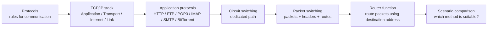
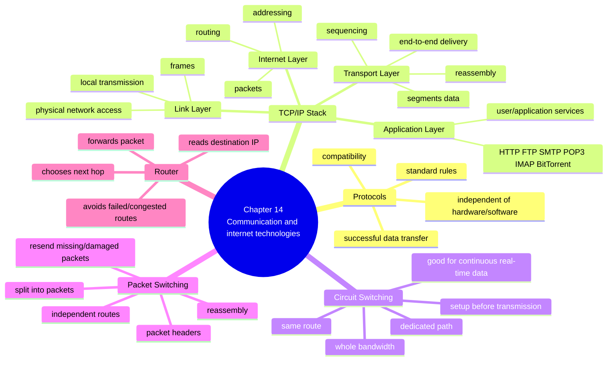
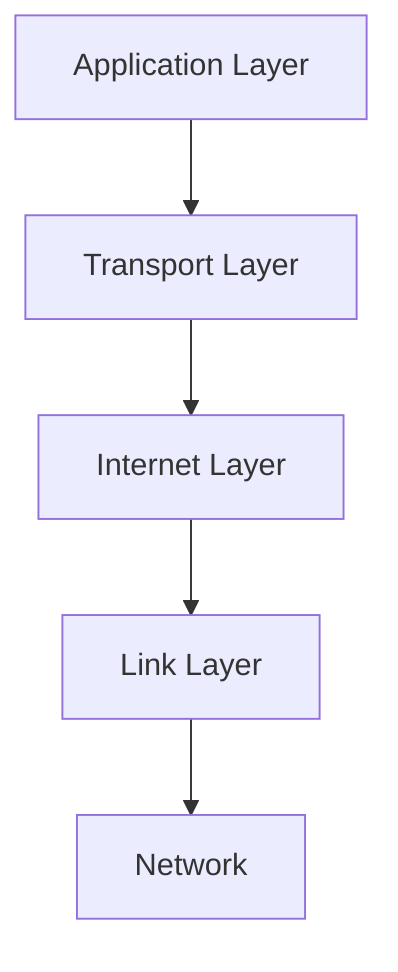
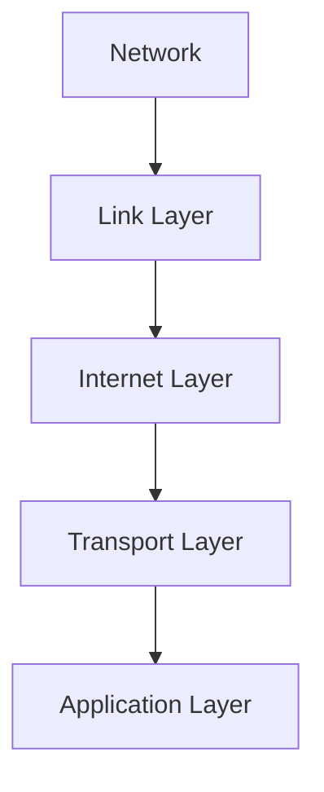
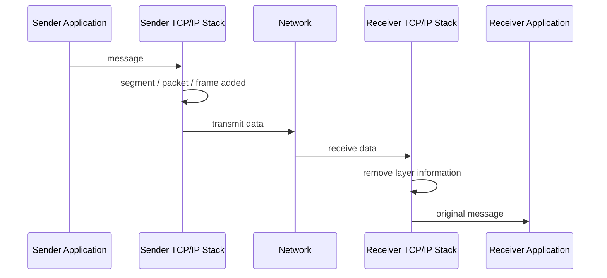
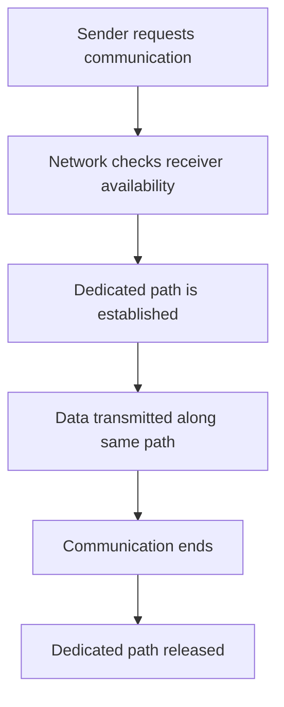
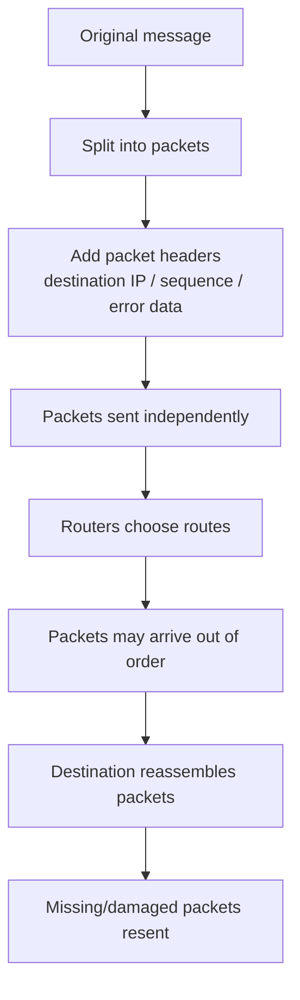
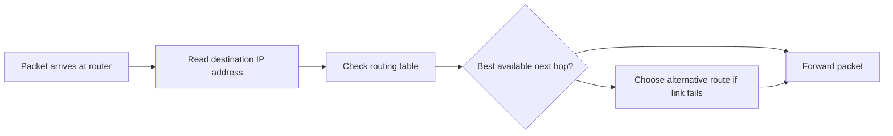

# A2 9618 Computer Science — Chapter 14 Updated Notes
## Communication and Internet Technologies｜Syllabus-Aligned Paper 3 Revision Sheet
> **Version:** Syllabus-aligned revision; informed by recent Paper 3 mark-scheme patterns  
> **Target:** Cambridge International AS & A Level Computer Science 9618 — A2  
> **Syllabus chapter:** 14 Communication and internet technologies  
> **Main audience:** Students  
> **Style:** 中文解释 + English mark scheme keywords / phrases  
>

---

# 0. How to Use This Sheet
Chapter 14 表面上是“网络通信”，但考试不是让你随便解释互联网。2024–2025 Paper 3 更喜欢考：

1. **TCP/IP protocol stack 四层的顺序和作用**  
2. **Application Layer / Transport Layer 的 purpose and function**  
3. **HTTP, FTP, POP3, IMAP, SMTP, BitTorrent 的用途**  
4. **packet switching 的过程、优点、缺点、router 的作用**  
5. **circuit switching 的过程、优点、缺点、适用场景**  
6. **比较 circuit switching 和 packet switching**

复习顺序建议如下：

---

# 1. Recent Paper 3 Pattern Map
| Area | Recent exam pattern | What students must practise |
| --- | --- | --- |
| Why protocols are needed | High | standard set of rules, successful data transfer, compatibility between devices/platforms |
| TCP/IP four layers | Very high | Application, Transport, Internet, Link; correct order and role of each layer |
| Protocol stack interaction | Very high | adjacent layers, message passed down when sent, passed up when received |
| Application Layer | High | interface/services for user applications; email/file transfer/network access; protocols used for communication |
| Transport Layer | High | end-to-end delivery, segmentation, sequencing, error-free delivery, reassembly |
| Application protocols | Very high | HTTP(S), FTP, POP3, IMAP, SMTP, BitTorrent and their exact purposes |
| BitTorrent | Medium-high | peer-to-peer file sharing; users share directly; no central web server for file transfer |
| Packet switching process | Very high | message split into packets, headers, independent routing, reassembly, resend lost/damaged packets |
| Circuit switching benefits/drawbacks | Very high | dedicated path, whole bandwidth, same route, setup delay, inefficient bandwidth use |
| Router function | Medium-high | reads destination IP address, selects next hop / best available route, forwards packet |
| Over-detailed OSI model | Low | not needed beyond TCP/IP four-layer model |
| Very detailed BitTorrent vocabulary | Low-medium | know peer-to-peer sharing; do not over-learn torrent jargon unless asked |

---

# 2. Content Update Decision
## 2.1 Keep and Strengthen
| Kept content | Reason |
| --- | --- |
| protocol definition | Repeated short-answer question; easy marks if exact wording is used |
| TCP/IP four layers | Directly tested in 2024 and 2025 |
| Application / Transport / Internet / Link functions | Mark schemes reward layer-specific phrases |
| HTTP, FTP, POP3, IMAP, SMTP, BitTorrent | Syllabus names these protocols directly |
| packet switching process | High-frequency explanation question |
| circuit switching benefits and drawbacks | Direct 4-mark style question in 2025 |
| router function in packet switching | Explicit syllabus requirement |
| circuit vs packet comparison | Common scenario / compare question |

## 2.2 Downweight
| Downweighted content | Why |
| --- | --- |
| full OSI seven-layer model | 9618 Chapter 14 asks for TCP/IP four-layer suite, not OSI detail |
| exact packet header field list beyond IP / sequence / error-checking idea | Usually not required in detail |
| BitTorrent tracker / swarm / seeder / leecher vocabulary | Useful extension but not the main mark scheme focus |
| physical cable / signal-level explanations | More AS communication background; Chapter 14 focus is protocol stack and switching |
| detailed TCP vs UDP comparison | Not central unless question specifically asks |

## 2.3 Delete / Avoid
| Avoid | Reason |
| --- | --- |
| saying “protocol = software” only | Too vague; protocol is a set of rules |
| saying “Application Layer is where apps are installed” | Not enough; must mention services/interface/protocols for communication |
| saying “packet switching is faster” without reason | Not always true; marks require packet behaviour or bandwidth/routing reason |
| saying “router sends internet” | Too vague; must mention destination address / route / forwarding |

---

# 3. One-Page Mind Map

---

# 4. 14.1 Protocols
## 4.1 What is a protocol?
### Mark scheme answer
> A protocol is a standard set of rules that enables successful communication / data transfer between devices.

### Must-have keywords
+ **standard set of rules**
+ **communication**
+ **data transfer**
+ **sender and receiver**
+ **compatibility**
+ **different devices / platforms**

### Why protocols are essential
没有 protocol，不同设备可能会用不同格式、不同顺序、不同错误检查方法传数据。这样接收方就无法正确解释数据。

### Recent exam-style answer
> Protocols establish a standard set of rules for communication, so devices from different manufacturers or platforms can send and receive data successfully.

### Common weak answer
> Protocols help computers connect.

This is too vague. You need to say **rules** and **successful data transfer / communication**.

---

## 4.2 Protocol suite
### Definition
> A protocol suite is a collection of related protocols used together to enable communication across a network.

### TCP/IP protocol suite
TCP/IP 是互联网通信中最重要的 protocol suite。A2 9618 只要求掌握四层：

| Layer | Chinese meaning | Main idea |
| --- | --- | --- |
| Application | 应用层 | services / protocols used by applications |
| Transport | 传输层 | end-to-end delivery, segmentation, sequencing |
| Internet | 网络互联层 | addressing and routing packets |
| Link | 链路层 | physical network access / local delivery |

### Correct order
发送时从上到下：

接收时从下到上：

---

# 5. TCP/IP Four Layers
## 5.1 Application Layer
### Main purpose
Application Layer 是用户和网络服务最接近的一层。它为应用程序提供通信服务，比如网页访问、文件传输、电子邮件、peer-to-peer file sharing。

### Mark scheme phrases
+ **provides services / interface with the user**
+ **access to applications**
+ **file transfer / email / network file access**
+ **defines protocols used to exchange data**
+ **contains programs that exchange data**
+ **may provide mechanisms for securing communication**

### Strong answer
> The Application Layer provides services and protocols used by applications to exchange data, such as web access, email and file transfer. It is the layer closest to the user.

### Common mistake
| Weak answer | Better answer |
| --- | --- |
| “It runs applications.” | “It provides services / protocols used by applications to exchange data.” |
| “It sends emails.” | “SMTP sends email; POP3/IMAP receive email; these are Application Layer protocols.” |

---

## 5.2 Transport Layer
### Main purpose
Transport Layer 负责 source host 到 destination host 之间的数据传输管理。它不关心网页内容是什么，而是关心数据如何可靠地送到正确的 application process。

### Mark scheme phrases
+ **end-to-end delivery**
+ **logical communication between applications running on different hosts**
+ **breaks data into segments / packets**
+ **adds sequence numbers**
+ **reassembles segments at destination**
+ **error-free delivery**
+ **flow control**
+ **retransmits lost packets**

### Strong answer
> The Transport Layer provides end-to-end communication between applications on different hosts. It breaks data into segments, adds sequencing information, checks for errors and reassembles the data at the destination.

---

## 5.3 Internet Layer
### Main purpose
Internet Layer 负责 IP addressing 和 routing。它决定 packet 应该往哪里走。

### Mark scheme phrases
+ **adds source and destination IP addresses**
+ **routes packets across networks**
+ **selects route / next hop**
+ **passes packets between networks**

### Strong answer
> The Internet Layer is responsible for addressing and routing packets across networks using IP addresses.

---

## 5.4 Link Layer
### Main purpose
Link Layer 负责数据在本地网络中的传输，和实际 network hardware / physical medium 接口。

### Mark scheme phrases
+ **interfaces directly with the network**
+ **sends / receives data over the physical medium**
+ **formats data into frames**
+ **local network segment**
+ **MAC / physical addressing**

### Strong answer
> The Link Layer interfaces directly with the network and handles local transmission of data over the physical medium.

---

## 5.5 How the layers interact
### Recent exam-style answer
> The TCP/IP suite can be viewed as layers within a stack. Each layer accepts input from the layer above or below it. When a message is sent, it passes from the Application Layer down to the Link Layer. When received, it passes from the Link Layer up to the Application Layer.

### Diagram

### Common mistake
| Mistake | Correction |
| --- | --- |
| listing layers only | explain movement down/up the stack |
| saying all layers talk directly to all other layers | each layer communicates with adjacent layers |
| saying router uses all layers | routers mainly work with lower layers; do not treat router like an end-user application |

---

# 6. Application Layer Protocols
## 6.1 Protocol table
| Protocol | Full name | Purpose / mark scheme phrase |
| --- | --- | --- |
| HTTP / HTTPS | Hypertext Transfer Protocol / Secure | transfers web pages / hypertext documents on the World Wide Web |
| FTP | File Transfer Protocol | transfers files between a client and a server across a network |
| SMTP | Simple Mail Transfer Protocol | sends email messages to a mail server / between mail servers |
| POP3 | Post Office Protocol 3 | receives / downloads email messages from a mail server |
| IMAP | Internet Message Access Protocol | allows email to be accessed and synchronised across devices without removing it from the server |
| BitTorrent | BitTorrent protocol | provides peer-to-peer file sharing |

---

## 6.2 SMTP vs POP3 vs IMAP
### SMTP
SMTP is for **sending** email.

> SMTP is used to send emails from a computer to a mail server or between mail servers.

### POP3
POP3 is for **receiving / downloading** email.

> POP3 handles receiving email messages from a mail server.

### IMAP
IMAP is also for receiving email, but it keeps messages on the server and synchronises across devices.

> IMAP allows users to access emails from different devices without removing the message from the mail server.

### Easy memory
| Task | Protocol |
| --- | --- |
| Send email | SMTP |
| Receive/download email | POP3 |
| Access/synchronise email on multiple devices | IMAP |

---

## 6.3 BitTorrent
### Mark scheme answer
> BitTorrent provides peer-to-peer file sharing, allowing users to share files directly with each other over the internet without relying on one central web server.

### Important ideas
+ users act as **peers**
+ users can download and upload parts of a file
+ no single central server has to provide the whole file
+ suitable for sharing large files with many users

### Downweighted extension vocabulary
| Term | Simple meaning |
| --- | --- |
| peer | a user/device sharing the file |
| swarm | group of peers sharing the file |
| seeding | uploading file parts to others |
| leeching | downloading without uploading enough |

For exam revision, the main phrase is still: **peer-to-peer file sharing**.

---

# 7. 14.2 Circuit Switching
## 7.1 What is circuit switching?
Circuit switching 是在通信开始前，先建立一条 dedicated path / dedicated channel。传输期间，数据都沿着同一路径传输，直到通信结束。

### Mark scheme answer
> Circuit switching establishes a dedicated communication path between sender and receiver before data transmission begins. The same path is used for the whole communication until the connection is ended.

### Process

---

## 7.2 Benefits of circuit switching
| Benefit | Mark scheme phrase |
| --- | --- |
| stable communication | suitable for long continuous transmission |
| high / steady rate | whole bandwidth is available |
| ordered delivery | data follows same path and arrives in order |
| little/no packet management | no need to reorder packets |
| real-time suitability | good for voice / video where continuous stream matters |

### Strong answer
> Circuit switching is suitable for long continuous communication because a dedicated path is available for the whole transmission, giving a steady data rate and ordered delivery.

---

## 7.3 Drawbacks of circuit switching
| Drawback | Mark scheme phrase |
| --- | --- |
| setup delay | dedicated connection must be established before transmission starts |
| inefficient bandwidth | bandwidth cannot be shared while the circuit is reserved |
| not flexible | no alternative route if a line fails |
| resource waste | circuit remains reserved even when little/no data is being sent |
| difficult to scale | many dedicated circuits are costly / hard to manage |

### Strong answer
> A drawback is that the dedicated connection must be set up before data transfer begins. Also, the reserved bandwidth cannot be used by other transmissions, so resources may be wasted.

---

## 7.4 Suitable uses
| Scenario | Why circuit switching may be suitable |
| --- | --- |
| traditional telephone call | continuous real-time communication |
| live voice call | steady rate, ordered data |
| leased line between two sites | dedicated reliable connection |
| private long continuous communication | same path and reserved bandwidth |

---

# 8. Packet Switching
## 8.1 What is packet switching?
Packet switching 是把 message 拆成很多 packets，每个 packet 有 header。Packets 可以独立走不同路线，到达后再重新组合。

### Mark scheme answer
> In packet switching, data are broken into packets. Each packet has a header containing information such as the sender and receiver IP addresses. Packets are sent independently and may take different routes. They are reassembled in the correct order at the destination, and missing or damaged packets can be resent.

---

## 8.2 Packet switching process

### Key packet header data
| Header information | Why it matters |
| --- | --- |
| destination IP address | router knows where packet should go |
| source IP address | response / resend request can be sent back |
| sequence number | destination can reorder packets |
| error-checking data | damaged packets can be detected |
| hop count / TTL | prevents packets circulating forever |

---

## 8.3 Benefits of packet switching
| Benefit | Mark scheme phrase |
| --- | --- |
| efficient bandwidth use | bandwidth can be shared between transmissions |
| flexible routing | packets can take different routes |
| fault tolerance | if a route fails, packets can be rerouted |
| resending possible | missing/damaged packets can be resent |
| suitable for internet data | good for emails, files, web pages, messages |

### Strong answer
> Packet switching uses bandwidth efficiently because packets from different messages can share the same network links. It is also more fault tolerant because packets can be rerouted if a route is unavailable.

---

## 8.4 Drawbacks of packet switching
| Drawback | Mark scheme phrase |
| --- | --- |
| variable delay | packets may take different routes and arrive at different times |
| reassembly needed | packets can arrive out of order and must be reconstructed |
| overhead | each packet needs a header |
| congestion possible | packets may be delayed or lost in busy networks |
| less predictable for real-time | delay/jitter can affect live audio/video |

### Strong answer
> A drawback is that packets may arrive out of order or be delayed, so they must be reassembled at the destination. Packet headers also add extra overhead.

---

# 9. Function of a Router in Packet Switching
## 9.1 What does a router do?
A router receives packets, examines the destination address in the packet header, chooses a suitable next hop / route, and forwards the packet.

### Mark scheme answer
> A router reads the destination IP address in the packet header, uses its routing table to choose the next hop / best available route, and forwards the packet towards the destination.

### Router decision factors
+ destination IP address
+ routing table
+ network congestion
+ failed / unavailable links
+ hop count / TTL
+ best available route, not always physically shortest

### Diagram

### Common weak answer
> Router sends data to the internet.

Better:
> Router forwards packets by using the destination IP address and routing table to choose the next hop.

---

# 10. Circuit Switching vs Packet Switching
| Feature | Circuit switching | Packet switching |
| --- | --- | --- |
| Path | dedicated path established first | no dedicated path needed |
| Data format | message usually remains as a stream | data split into packets |
| Route | all data follows same route | packets may take different routes |
| Bandwidth | whole bandwidth reserved | bandwidth shared |
| Order | data arrives in same order | packets may arrive out of order |
| Fault tolerance | failure may break connection | packets may be rerouted / resent |
| Setup time | setup needed before transmission | no dedicated setup path required |
| Best for | continuous real-time communication | internet data, file transfer, email, web traffic |

### 4-mark compare answer
> Circuit switching establishes a dedicated path before data transfer begins, whereas packet switching does not require a dedicated path. In circuit switching, all data follows the same route, but in packet switching, packets may take different routes. Circuit switching reserves the whole bandwidth, whereas packet switching shares bandwidth. Packet switching may require packets to be reassembled at the destination.

---

# 11. Mark Scheme Keywords
## 11.1 Protocols
+ **standard set of rules**
+ **successful data transfer**
+ **communication between devices**
+ **compatibility between devices / platforms**
+ **independent of hardware / software**

## 11.2 TCP/IP Stack
+ **layers within a stack**
+ **adjacent layer**
+ **Application, Transport, Internet, Link**
+ **message passes down the stack when sent**
+ **message passes up the stack when received**
+ **Link Layer interfaces directly with the network**

## 11.3 Application Layer
+ **services / interface with the user**
+ **access to applications**
+ **file transfer / email / network file access**
+ **protocols used to exchange data**

## 11.4 Transport Layer
+ **end-to-end delivery**
+ **logical communication between applications**
+ **breaks data into segments**
+ **sequence numbers**
+ **reassembles data at destination**
+ **error-free delivery**
+ **retransmits lost packets**

## 11.5 Packet Switching
+ **data broken into packets**
+ **packet header**
+ **source and destination IP address**
+ **sent independently**
+ **different routes**
+ **optimum path**
+ **arrive out of order**
+ **reassembled at destination**
+ **missing / damaged packets resent**

## 11.6 Circuit Switching
+ **dedicated path / channel**
+ **established before transmission**
+ **same path for whole communication**
+ **whole bandwidth available**
+ **bandwidth cannot be shared**
+ **setup delay**
+ **no alternative route if failure occurs**

## 11.7 Router
+ **reads destination IP address**
+ **uses routing table**
+ **selects next hop**
+ **best available route**
+ **forwards packet**

---

# 12. Common Mistakes — Must Read
| Question type | Weak answer | Better answer |
| --- | --- | --- |
| Define protocol | “a connection method” | “a standard set of rules for communication / data transfer” |
| Why protocols needed | “so internet works” | “so devices using different hardware/software/platforms can communicate successfully” |
| TCP/IP layers | wrong order | Application → Transport → Internet → Link |
| Layer interaction | “all layers communicate together” | “each layer accepts input from adjacent higher/lower layer” |
| Application Layer | “the layer with apps” | “provides services/protocols used by applications to exchange data” |
| Transport Layer | “moves data” | “provides end-to-end delivery, breaks data into segments, sequences and reassembles” |
| SMTP/POP3/IMAP | mixing send/receive | SMTP sends; POP3/IMAP receive; IMAP synchronises across devices |
| BitTorrent | “downloads files” | “peer-to-peer file sharing; users share directly” |
| Packet switching | “data goes different ways” | “message split into packets with headers; packets sent independently and reassembled” |
| Circuit switching | “uses one route” | “dedicated path established before transmission and used for whole communication” |
| Router | “connects internet” | “reads destination IP and forwards packet using routing table” |
| Benefits | generic “faster” | state exact reason: shared bandwidth / rerouting / steady rate / ordered delivery |

---

# 13. Scenario Answer Bank
| Scenario | Best answer direction |
| --- | --- |
| A company wants stable long continuous voice communication | circuit switching; dedicated path; steady rate; same route |
| A website sends pages over the internet | packet switching; data split into packets; routed independently; reassembled |
| A route between two networks fails | packet switching better; packets can be rerouted / resent |
| Live call needs predictable delay | circuit switching may be suitable; whole bandwidth and same route |
| Many users share network bandwidth | packet switching; bandwidth can be shared efficiently |
| Email client sends email | SMTP |
| Email client receives and downloads email | POP3 |
| User wants emails synchronised on phone and laptop | IMAP |
| User downloads a web page | HTTP / HTTPS |
| Client transfers files to server | FTP |
| Users share a large file directly with each other | BitTorrent; peer-to-peer sharing |
| A packet reaches a router | router reads destination IP, checks routing table, forwards to next hop |

---

# 14. 10 Marks Quick Check
## Questions
1. Define the term protocol. [1]  
2. State the four layers of the TCP/IP protocol stack in order from top to bottom. [2]  
3. State the purpose of SMTP. [1]  
4. State one difference between POP3 and IMAP. [1]  
5. Describe one function of the Transport Layer. [1]  
6. State what is meant by packet switching. [2]  
7. Give one drawback of circuit switching. [1]  
8. State one function of a router in packet switching. [1]

## Answers
1. A standard set of rules for communication / data transfer. [1]  
2. Application, Transport, Internet, Link. Award [1] for two/three in correct relative order, [2] for all four.  
3. SMTP sends email messages / transfers email to or between mail servers. [1]  
4. POP3 downloads/receives email; IMAP allows email to be accessed/synchronised across devices without removing it from server. [1]  
5. Breaks data into segments / adds sequence numbers / provides end-to-end delivery / reassembles data / retransmits lost packets. [1]  
6. Data is split into packets [1], packets are sent independently and reassembled at destination [1].  
7. Dedicated path must be set up first / bandwidth cannot be shared / no alternative route if line fails / inefficient use of resources. [1]  
8. Reads destination IP address and forwards packet using routing table / chooses next hop. [1]

---

# 15. 20 Marks Exam-Style Practice
## Question 1: TCP/IP stack and protocols [7]
(a) Explain why protocols are essential for communication between computers. [2]  
(b) State the four layers of the TCP/IP stack in correct order from top to bottom. [2]  
(c) Describe the purpose of the Transport Layer. [2]  
(d) Name the protocol used to send email. [1]

### Mark scheme
(a) Protocols establish a standard set of rules [1] so devices on different platforms / from different manufacturers can communicate successfully [1].  
(b) Application → Transport → Internet → Link. [2] Award [1] for two or three layers in correct order.  
(c) Provides end-to-end delivery / logical communication between hosts [1]; breaks data into segments / adds sequence numbers / reassembles data / retransmits lost packets [1].  
(d) SMTP. [1]

---

## Question 2: Packet switching [7]
A student sends a large file across the internet.

(a) Describe how packet switching is used to transmit the file. [4]  
(b) State two benefits of using packet switching. [2]  
(c) State one drawback of packet switching. [1]

### Mark scheme
(a) File/data is split into packets [1]. Each packet has a header containing information such as source/destination IP address or sequence number [1]. Packets are sent independently and may take different routes [1]. Packets are reassembled in the correct order at the destination / missing or damaged packets are resent [1].  
(b) Any two: bandwidth can be shared; packets can be rerouted if a link fails; efficient for high-volume internet data; missing/damaged packets can be resent. [2]  
(c) Packets may arrive out of order / variable delay / headers add overhead / packets may be lost or delayed. [1]

---

## Question 3: Circuit switching and routers [6]
(a) Describe circuit switching. [3]  
(b) Give one benefit and one drawback of circuit switching. [2]  
(c) Describe the function of a router in packet switching. [1]

### Mark scheme
(a) A dedicated path/channel is established before data transmission begins [1]. The same path is used for the whole communication [1]. The path is released when communication ends [1].  
(b) Benefit: steady data rate / whole bandwidth available / data follows same path / suitable for continuous real-time communication. [1] Drawback: setup delay / bandwidth cannot be shared / inefficient if not fully used / no alternative route if line fails. [1]  
(c) Router reads destination IP address and forwards packet to next hop / best available route using routing table. [1]

---

