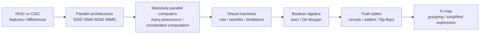
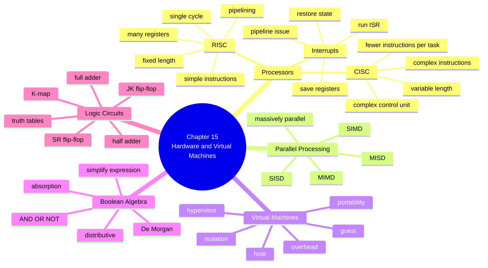
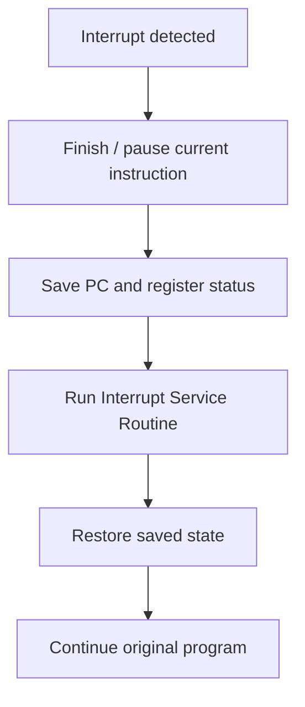
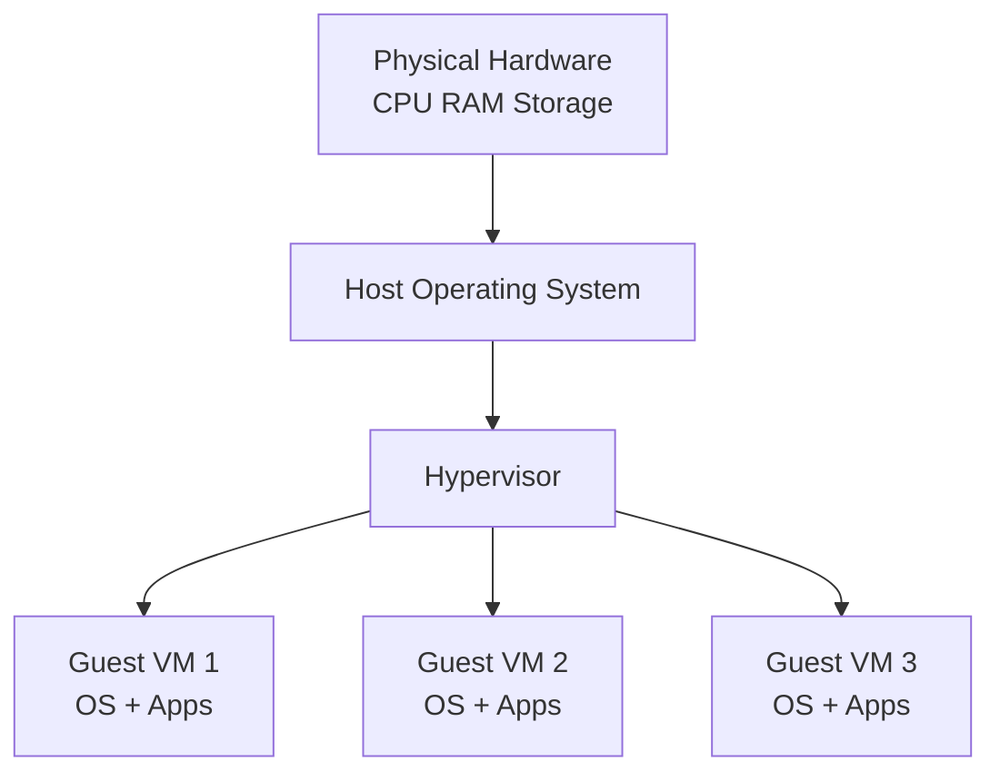

# A2 9618 Computer Science — Chapter 15 Updated Notes
## Hardware and Virtual Machines｜2024–2025 Paper 3 Trend-Based Student Revision Sheet
> **Version:** Updated after 2024 + 2025 Paper 3 trend review  
> **Target:** Cambridge International AS & A Level Computer Science 9618 — A2  
> **Chapter:** 15 Hardware and Virtual Machines  
> **Main audience:** Students preparing for Paper 3 Advanced Theory  
> **Teacher Notes:** included at the end  
> **Style:** 中文解释 + English mark scheme keywords  
>

---

# 0. How to Use This Sheet

Chapter 15 看起来内容很多，但考试不是平均考所有内容。2024–2025 Paper 3 的趋势很明显：

1. **Boolean algebra / truth table / K-map** 是最稳定的高频区  
2. **RISC features / interrupt handling / pipelining** 常以短答形式出现  
3. **SISD / SIMD / MISD / MIMD** 常考定义和对比  
4. **Virtual machine** 不一定每年考，但一旦考，通常要写 benefits and limitations  
5. **Flip-flop / half adder / full adder** 属于 syllabus 明确要求，不能删除，但复习时不用过度扩展到电子工程细节

建议复习顺序：



---

# 1. 2024–2025 Paper 3 Trend Map

| Area | 2024–2025 Trend | What students must practise |
| --- | --- | --- |
| RISC features | High | few/simple instructions, fixed length, single-cycle, registers, pipelining |
| CISC vs RISC | Medium-high | compare instruction set, cycles, hardware/software emphasis |
| Interrupt handling | Medium | save registers/status, ISR, restore state, pipeline issue |
| SISD / SIMD / MISD / MIMD | Medium-high | expand acronym + describe data/instruction streams |
| Massively parallel computers | Medium | many processors/computers, coordinated computation, message interface |
| Virtual machines | Medium | concept, examples, benefits, limitations |
| Truth tables from circuits | Very high | work through intermediate columns carefully |
| Sum-of-products | Very high | write minterms only where output = 1 |
| Boolean algebra simplification | Very high | De Morgan, distributive, absorption, idempotent |
| K-map | Very high | Gray code order, group 1s in powers of 2, wrap-around |
| Flip-flops | Medium | SR/JK truth table, storage of one bit |
| Half/full adders | Medium | sum/carry truth table and circuit idea |

---

# 2. Content Update Decision

## 2.1 Keep and Strengthen

| Kept content | Reason |
| --- | --- |
| RISC features | 2024 Paper 3 asked directly for RISC features |
| interrupt handling and pipelining | Short-answer mark scheme rewards exact sequence phrases |
| SISD, SIMD, MISD, MIMD | Repeated 2023–2024 and still syllabus core |
| massively parallel computers | Often appears as definition/description |
| virtual machines | syllabus explicit and scenario-friendly |
| Boolean algebra laws | 2025 mark scheme rewards law names and correct application |
| De Morgan's laws | 2025 directly rewarded correct De Morgan application |
| truth tables | 2024–2025 Paper 3 repeatedly tests intermediate columns and final output |
| sum-of-products | frequent bridge between truth tables and simplification |
| K-map | 2024–2025 very high-value skill |
| SR/JK flip-flops | syllabus explicit; useful for data storage questions |
| half adder / full adder | syllabus explicit; linked to truth tables and logic circuits |

## 2.2 Downweight

| Downweighted content | Why |
| --- | --- |
| transistor-level explanation of RISC/CISC | not needed for CAIE mark scheme |
| detailed CPU microarchitecture | only high-level features are usually rewarded |
| complex electronic timing diagrams for flip-flops | beyond syllabus depth |
| excessive Boolean law memorisation without use | students need application more than a long law list |
| drawing perfect circuit diagrams for every expression | Paper 3 more often rewards truth table, expression and simplification |
| commercial virtualisation product names | brand names are not awarded |

## 2.3 Delete / Avoid

| Avoid | Reason |
| --- | --- |
| saying RISC is always faster than CISC | too absolute; depends on design and task |
| saying virtual machines are "fake computers" only | too vague |
| using normal binary order in K-map columns | K-map uses Gray code order |
| grouping K-map 1s in groups of 3 or 6 | groups must be powers of 2 |
| applying De Morgan by only changing AND/OR but not complementing terms | loses marks |
| using `+` as arithmetic addition in Boolean algebra | in Boolean algebra, `+` means OR |

---

# 3. One-Page Mind Map



---

# 4. 15.1 Processors, Parallel Processing and Virtual Machines

## 4.1 RISC processors

### Core idea
RISC means **Reduced Instruction Set Computer**.

RISC processor 的设计思想是：  
用较少、较简单、格式较固定的指令，让 CPU 更容易快速执行和流水线处理。

### Mark scheme answer
> A RISC processor uses a relatively small number of simple instructions, often fixed length and fixed format. Instructions usually use a single cycle, make use of general-purpose registers, and pipelining is easier to apply.
>

### Must-have keywords
+ **Reduced Instruction Set Computer**
+ **few instructions**
+ **simple instructions**
+ **fixed length / fixed format**
+ **single-cycle instructions**
+ **general-purpose registers**
+ **pipelining**
+ **hard-wired control unit**

### 2024–2025 style features
| Feature | Explanation |
| --- | --- |
| Few instructions | instruction set is reduced |
| Simple instructions | each instruction does a small operation |
| Fixed length / fixed format | easier to fetch and decode |
| Single-cycle execution | many instructions can complete in one clock cycle |
| Many registers | less need to access main memory |
| Easier pipelining | regular instructions fit pipeline stages better |
| Software emphasis | compiler may do more work |

### Common weak answer
> RISC is faster and simpler.
>

This is too vague. You need features such as **fixed length instructions**, **few/simple instructions**, **single cycle**, **registers**, or **pipelining**.

---

## 4.2 CISC processors

CISC means **Complex Instruction Set Computer**.

CISC processor 的设计思想是：  
一条指令可以完成更复杂的操作，因此程序可能需要更少的指令，但 CPU 解码和执行会更复杂。

### Mark scheme answer
> A CISC processor has a larger instruction set with more complex instructions. Instructions may be variable length and may take several clock cycles to execute. The design emphasis is more on hardware.
>

### RISC vs CISC comparison

| Area | RISC | CISC |
| --- | --- | --- |
| Full name | Reduced Instruction Set Computer | Complex Instruction Set Computer |
| Number of instructions | fewer | more |
| Instruction complexity | simple | complex |
| Instruction length | usually fixed | may be variable |
| Clock cycles | often single-cycle | may take several cycles |
| Registers | many general-purpose registers | may use fewer registers |
| Pipelining | easier to apply | more difficult because instructions vary |
| Design emphasis | software / compiler | hardware |
| Program length | may need more instructions | may need fewer instructions |

### Exam sentence
> RISC uses simpler fixed-length instructions, so pipelining is easier. CISC uses more complex instructions that may take several cycles, so decoding and pipelining are more complex.
>

---

## 4.3 Interrupt handling on RISC and CISC processors

### Basic interrupt sequence
Interrupt handling 的核心不是“CPU stop”，而是：

1. interrupt is detected  
2. current process/program is temporarily stopped  
3. registers / program counter / status are saved  
4. Interrupt Service Routine (**ISR**) is executed  
5. saved register values are restored  
6. original program continues

### Mark scheme answer
> When an interrupt is detected, the current program is temporarily stopped and the status of registers / program counter is stored on the stack. The Interrupt Service Routine is executed. After the interrupt has been serviced, the saved register values are restored and the original program continues.
>

### Pipeline issue
Pipelining 会让 interrupt handling 更复杂，因为 pipeline 里可能已经有多条 instruction 正在不同 stage 中执行。

### 2024-style phrase
> There may be a number of instructions still in the pipeline when the interrupt is received, so some instructions may need to be discarded or the processor must restart from the correct next instruction after the ISR.
>

### Common mistake
| Mistake | Correction |
| --- | --- |
| saying "CPU deletes the current program" | current state is saved, not deleted |
| forgetting ISR | must mention **Interrupt Service Routine** |
| saying registers are saved in RAM only | mark scheme often accepts stack / saved state |
| ignoring pipeline issue | for RISC/pipelining questions, mention instructions already in pipeline |

---

## 4.4 Pipelining in RISC processors

### Core idea
Pipelining means different instructions can be at different stages of execution at the same time.

Example stages:


### Why RISC works well with pipelining
RISC instructions are usually:

+ simple
+ fixed length
+ fixed format
+ often single-cycle

This makes pipeline stages more regular.

### Mark scheme answer
> Pipelining allows several instructions to be processed at the same time, with each instruction at a different stage. RISC processors are suitable for pipelining because instructions are simple and fixed length.
>

### Benefits
+ improves instruction throughput
+ less idle time in CPU stages
+ multiple instructions are in progress at once

### Limitation
+ branch / jump instructions may disrupt pipeline
+ interrupts can cause pipeline flushing
+ dependencies between instructions can create hazards

---

# 5. Parallel Processing Architectures

## 5.1 Flynn's four architectures

The four basic computer architectures are:

+ **SISD**
+ **SIMD**
+ **MISD**
+ **MIMD**

The key exam skill is:  
**Instruction stream** 和 **data stream** 分别是 single 还是 multiple。

---

## 5.2 SISD

### Full name
**Single Instruction, Single Data**

### Mark scheme answer
> SISD has one processor executing one instruction stream on one data stream. Instructions are executed sequentially.
>

### Example
A traditional single-core computer running one instruction at a time.

### Keywords
+ **single instruction**
+ **single data**
+ **one processor**
+ **sequential execution**

---

## 5.3 SIMD

### Full name
**Single Instruction, Multiple Data**

### Mark scheme answer
> SIMD performs the same instruction on multiple data items at the same time.
>

### Example
Applying the same image filter to many pixels at once.

### Keywords
+ **same instruction**
+ **multiple data streams**
+ **simultaneously**
+ **parallel processing**

### Common mistake
> SIMD means many instructions happen at once.
>

Wrong. SIMD = one instruction, many data items.

---

## 5.4 MISD

### Full name
**Multiple Instruction, Single Data**

### Mark scheme answer
> MISD performs different instructions on the same data stream.
>

### Example
A fault-tolerant system where the same data is processed by different processors using different operations.

### Keywords
+ **multiple instructions**
+ **single data stream**
+ **same data**
+ **independent processors**

### Exam warning
MISD is less common in real systems, but it is still syllabus content.

---

## 5.5 MIMD

### Full name
**Multiple Instruction, Multiple Data**

### Mark scheme answer
> MIMD has multiple processors that can execute different instructions on different data streams independently or asynchronously.
>

### Example
A multi-core computer running different tasks on different cores.

### Keywords
+ **multiple instructions**
+ **multiple data streams**
+ **many processors**
+ **independent / asynchronous**

---

## 5.6 Quick comparison table

| Architecture | Instructions | Data | Simple exam phrase |
| --- | --- | --- | --- |
| SISD | single | single | one processor runs one instruction on one data item |
| SIMD | single | multiple | same operation applied to many data items |
| MISD | multiple | single | different operations applied to same data |
| MIMD | multiple | multiple | different processors run different instructions on different data |

---

# 6. Massively Parallel Computers

## 6.1 Definition
A massively parallel computer uses a large number of processors or separate computers to perform coordinated computations at the same time.

### Mark scheme answer
> A massively parallel computer contains a large number of processors / computers connected together, simultaneously performing coordinated computations and communicating using messages.
>

### Must-have keywords
+ **large number of processors**
+ **separate computers connected together**
+ **simultaneously**
+ **coordinated computations**
+ **message interface**
+ **network infrastructure**

### Uses
| Use | Why massively parallel is suitable |
| --- | --- |
| weather forecasting | huge number of repeated calculations |
| scientific simulation | can divide problem into smaller parts |
| AI training | many matrix/vector operations |
| image/video rendering | independent frames/pixels can be processed |
| cryptography research | many possible keys can be tested |

### Common mistake
> It is just a very fast computer.
>

Too vague. You must mention **many processors** and **parallel coordinated processing**.

---

# 7. Virtual Machines

## 7.1 Concept of a virtual machine

A **virtual machine (VM)** is a software-based emulation of a computer system. It runs on a physical computer but behaves like a separate computer.

### Key terms
| Term | Meaning |
| --- | --- |
| Host machine | physical computer that provides resources |
| Guest machine | virtual machine running on the host |
| Hypervisor | software that creates and manages VMs |
| Emulation / virtualisation | making software behave like hardware |

### Mark scheme answer
> A virtual machine is a software implementation / emulation of a computer system that runs on a host computer and allows a guest operating system or program to run as if it had its own hardware.
>

---

## 7.2 Roles / examples of virtual machines

| Role | Example |
| --- | --- |
| running different OS | running Linux on a Windows host |
| testing software safely | test malware or unstable programs in isolated VM |
| server consolidation | several virtual servers on one physical server |
| legacy software | run old software on a modern machine |
| cloud computing | cloud providers allocate virtual servers |
| education | students practise OS/network setup safely |

### Scenario answer
> A VM allows the company to run several virtual servers on one physical server, reducing hardware cost and making better use of resources.
>

---

## 7.3 Benefits of virtual machines

| Benefit | Explanation |
| --- | --- |
| Isolation | software inside one VM is separated from host/other VMs |
| Portability | VM can be moved or copied more easily than physical machine |
| Cost saving | fewer physical machines needed |
| Resource sharing | host resources can be divided among VMs |
| Testing safety | risky software can be tested without damaging host |
| Legacy support | old OS/software can still run |
| Easy backup | VM image can be snapshotted or restored |

### Mark scheme answer
> Virtual machines allow several operating systems or servers to run on one physical machine. They provide isolation, make testing safer, reduce hardware costs, and allow VM images to be backed up or moved easily.
>

---

## 7.4 Limitations of virtual machines

| Limitation | Explanation |
| --- | --- |
| Performance overhead | VM uses extra processing because hypervisor is needed |
| Resource competition | multiple VMs share CPU/RAM/storage |
| Single point of failure | if host fails, all VMs on it may fail |
| Security risk | misconfigured VM can still be attacked |
| Management complexity | many VMs can be hard to maintain |
| Licensing cost | some OS/software licences may still be needed |

### Mark scheme answer
> Virtual machines can reduce performance because resources are shared and the hypervisor adds overhead. If the host machine fails, all virtual machines on that host may be affected.
>

---

# 8. 15.2 Boolean Algebra and Logic Circuits

## 8.1 Boolean algebra notation

| Symbol | Meaning | Logic gate |
| --- | --- | --- |
| `.` | AND | AND |
| `+` | OR | OR |
| overbar / `'` / NOT | NOT | NOT |

Example:

```text
A.B + C
```

means:

```text
(A AND B) OR C
```

### Common mistake
`+` does not mean arithmetic addition in Boolean algebra.  
It means **OR**.

---

## 8.2 Core Boolean laws

| Law | AND form | OR form |
| --- | --- | --- |
| Identity | `A.1 = A` | `A + 0 = A` |
| Null | `A.0 = 0` | `A + 1 = 1` |
| Idempotent | `A.A = A` | `A + A = A` |
| Complement | `A.A' = 0` | `A + A' = 1` |
| Commutative | `A.B = B.A` | `A + B = B + A` |
| Distributive | `A.(B + C) = A.B + A.C` | `A + B.C = (A + B).(A + C)` |
| Absorption | `A.(A + B) = A` | `A + A.B = A` |
| Double complement | `(A')' = A` | — |

### 2025 trend
2025 mark schemes reward not only the final answer but also correct application of laws such as:

+ **De Morgan's laws**
+ **Idempotent law**
+ **Distributive law**
+ **Absorption law**

So when showing working, write the law name if possible.

---

## 8.3 De Morgan's laws

### Law 1
```text
(A.B)' = A' + B'
```

Meaning:

> NOT(A AND B) = NOT A OR NOT B

### Law 2
```text
(A + B)' = A'.B'
```

Meaning:

> NOT(A OR B) = NOT A AND NOT B

### Exam method
When applying De Morgan:

1. change AND ↔ OR  
2. complement each term  
3. remove the outer NOT

### Common mistake
| Wrong | Why wrong |
| --- | --- |
| `(A + B)' = A' + B'` | forgot to change OR to AND |
| `(A.B)' = A'.B` | forgot to complement every term |
| `(A + B.C)' = A'.B' + C'` | must treat grouped expression carefully |

### Example
Simplify:

```text
(A + B)' . B
```

Step:

```text
(A + B)' . B
= A'.B'.B       De Morgan
= A'.0          Complement
= 0             Null
```

---

# 9. Truth Tables

## 9.1 Truth table method

For Paper 3, when a circuit or expression is given, do not jump straight to the answer. Make working columns.

Example expression:

```text
Z = (A + B).C'
```

Truth table:

| A | B | C | A + B | C' | Z |
| --- | --- | --- | --- | --- | --- |
| 0 | 0 | 0 | 0 | 1 | 0 |
| 0 | 0 | 1 | 0 | 0 | 0 |
| 0 | 1 | 0 | 1 | 1 | 1 |
| 0 | 1 | 1 | 1 | 0 | 0 |
| 1 | 0 | 0 | 1 | 1 | 1 |
| 1 | 0 | 1 | 1 | 0 | 0 |
| 1 | 1 | 0 | 1 | 1 | 1 |
| 1 | 1 | 1 | 1 | 0 | 0 |

### Mark scheme advice
2024–2025 mark schemes often award marks for:

+ intermediate working columns
+ first half of output rows
+ second half of output rows
+ correct final output

So always show working columns.

---

## 9.2 Sum-of-products

A **sum-of-products** expression is made by OR-ing together product terms.

### Method
1. Find rows where output = 1  
2. For each row, write one AND term  
3. If input is 1, write normal variable  
4. If input is 0, write complemented variable  
5. OR all terms together

### Example
| A | B | C | Z |
| --- | --- | --- | --- |
| 0 | 0 | 0 | 0 |
| 0 | 0 | 1 | 1 |
| 0 | 1 | 0 | 0 |
| 0 | 1 | 1 | 1 |
| 1 | 0 | 0 | 0 |
| 1 | 0 | 1 | 1 |
| 1 | 1 | 0 | 0 |
| 1 | 1 | 1 | 1 |

Rows with `Z = 1`:

```text
001, 011, 101, 111
```

Expression:

```text
Z = A'.B'.C + A'.B.C + A.B'.C + A.B.C
```

This simplifies to:

```text
Z = C
```

### Common mistake
| Mistake | Correction |
| --- | --- |
| using rows where output = 0 | sum-of-products uses rows where output = 1 |
| forgetting complements | 0 means complemented variable |
| missing one minterm | check every row with output 1 |
| writing `A+B+C` for a row | each row gives an AND term, not OR |

---

# 10. Half Adders and Full Adders

## 10.1 Half adder

A half adder adds two one-bit inputs.

Inputs:

+ `A`
+ `B`

Outputs:

+ `S` = Sum
+ `C` = Carry

### Truth table
| A | B | Sum S | Carry C |
| --- | --- | --- | --- |
| 0 | 0 | 0 | 0 |
| 0 | 1 | 1 | 0 |
| 1 | 0 | 1 | 0 |
| 1 | 1 | 0 | 1 |

### Expressions
```text
S = A XOR B
C = A.B
```

### Exam phrase
> A half adder adds two binary bits and produces a sum bit and a carry bit.
>

---

## 10.2 Full adder

A full adder adds three one-bit inputs:

+ `A`
+ `B`
+ `Cin`

Outputs:

+ `S`
+ `Cout`

### Truth table
| A | B | Cin | Sum S | Carry Cout |
| --- | --- | --- | --- | --- |
| 0 | 0 | 0 | 0 | 0 |
| 0 | 0 | 1 | 1 | 0 |
| 0 | 1 | 0 | 1 | 0 |
| 0 | 1 | 1 | 0 | 1 |
| 1 | 0 | 0 | 1 | 0 |
| 1 | 0 | 1 | 0 | 1 |
| 1 | 1 | 0 | 0 | 1 |
| 1 | 1 | 1 | 1 | 1 |

### Expressions
```text
S = A XOR B XOR Cin
Cout = A.B + A.Cin + B.Cin
```

### Exam phrase
> A full adder adds two input bits and an incoming carry, producing a sum output and an outgoing carry.
>

---

# 11. Flip-Flops

## 11.1 What is a flip-flop?

A flip-flop is a logic circuit that can store one bit of data.

### Mark scheme answer
> A flip-flop is a bistable circuit that can store one bit. Its output remains in the same state until the input causes it to change.
>

### Must-have keywords
+ **bistable**
+ **stores one bit**
+ **data storage element**
+ **state**
+ **output retained**

---

## 11.2 SR flip-flop

SR means:

+ `S` = Set
+ `R` = Reset

### Basic SR truth table
| S | R | Q next | Meaning |
| --- | --- | --- | --- |
| 0 | 0 | Q | no change |
| 0 | 1 | 0 | reset |
| 1 | 0 | 1 | set |
| 1 | 1 | invalid / not allowed | undefined |

### Key point
SR flip-flop can store a bit because when `S = 0` and `R = 0`, the output stays the same.

---

## 11.3 JK flip-flop

JK flip-flop solves the invalid state problem of SR.

### JK truth table
| J | K | Q next | Meaning |
| --- | --- | --- | --- |
| 0 | 0 | Q | no change |
| 0 | 1 | 0 | reset |
| 1 | 0 | 1 | set |
| 1 | 1 | Q' | toggle |

### Exam phrase
> A JK flip-flop has no invalid state; when both inputs are 1, the output toggles.
>

---

# 12. Karnaugh Maps

## 12.1 What is a K-map?

A Karnaugh map is a visual method for simplifying Boolean expressions.

### Mark scheme answer
> A Karnaugh map represents a truth table in a grid so adjacent 1s can be grouped to produce a simplified Boolean expression.
>

### Benefit
+ reduces errors compared with long Boolean algebra
+ makes simplification easier
+ visually groups adjacent minterms
+ can produce a minimal sum-of-products expression

---

## 12.2 K-map order

For two variables:

| A\B | 0 | 1 |
| --- | --- | --- |
| 0 |  |  |
| 1 |  |  |

For three variables:

| A\BC | 00 | 01 | 11 | 10 |
| --- | --- | --- | --- | --- |
| 0 |  |  |  |  |
| 1 |  |  |  |  |

For four variables:

| AB\CD | 00 | 01 | 11 | 10 |
| --- | --- | --- | --- | --- |
| 00 |  |  |  |  |
| 01 |  |  |  |  |
| 11 |  |  |  |  |
| 10 |  |  |  |  |

### Important
K-map order is **Gray code**:

```text
00, 01, 11, 10
```

Not:

```text
00, 01, 10, 11
```

---

## 12.3 Grouping rules

| Rule | Explanation |
| --- | --- |
| group only 1s | for sum-of-products simplification |
| group size must be powers of 2 | 1, 2, 4, 8, 16 |
| make groups as large as possible | larger group = simpler term |
| groups can overlap | allowed if it simplifies |
| wrap-around is allowed | left/right and top/bottom edges are adjacent |
| no groups of 3, 5, 6 | not powers of 2 |

### Common mistake
| Mistake | Correction |
| --- | --- |
| grouping three 1s | group 2 or 4, not 3 |
| not using wrap-around | edge cells can be adjacent |
| using normal binary order | use Gray code |
| leaving an isolated 1 when it can join a group | make largest possible groups |
| including 0s in a group | only group 1s for SOP |

---

## 12.4 Reading a group

When reading a group:

+ keep variables that stay the same
+ remove variables that change

Example:

| A\BC | 00 | 01 | 11 | 10 |
| --- | --- | --- | --- | --- |
| 0 | 0 | 1 | 1 | 0 |
| 1 | 0 | 1 | 1 | 0 |

The four 1s are in columns `01` and `11`.

+ A changes → remove A
+ B changes from 0 to 1 → remove B
+ C stays 1 → keep C

So:

```text
Z = C
```

---

# 13. Mark Scheme Keywords

## 13.1 RISC / CISC
+ **Reduced Instruction Set Computer**
+ **Complex Instruction Set Computer**
+ **few instructions**
+ **simple instructions**
+ **fixed length / fixed format**
+ **single cycle**
+ **general-purpose registers**
+ **pipelining**
+ **hard-wired control unit**
+ **variable length instructions**
+ **several clock cycles**

## 13.2 Interrupts
+ **interrupt detected**
+ **fetch-execute cycle**
+ **temporarily stopped**
+ **register status saved**
+ **program counter saved**
+ **stack**
+ **Interrupt Service Routine / ISR**
+ **registers restored**
+ **pipeline flushed / discarded instructions**

## 13.3 Parallel processing
+ **SISD**
+ **SIMD**
+ **MISD**
+ **MIMD**
+ **single / multiple instruction stream**
+ **single / multiple data stream**
+ **many processors**
+ **asynchronously / independently**
+ **simultaneously**
+ **coordinated computations**
+ **message interface**

## 13.4 Virtual machines
+ **software emulation**
+ **host**
+ **guest**
+ **hypervisor**
+ **isolation**
+ **portability**
+ **resource sharing**
+ **performance overhead**
+ **single point of failure**

## 13.5 Boolean / K-map
+ **truth table**
+ **intermediate columns**
+ **sum-of-products**
+ **minterm**
+ **De Morgan's laws**
+ **Idempotent law**
+ **Distributive law**
+ **Absorption law**
+ **Karnaugh map / K-map**
+ **Gray code**
+ **group adjacent 1s**
+ **powers of two**
+ **wrap-around**
+ **simplified expression**

## 13.6 Flip-flops and adders
+ **half adder**
+ **full adder**
+ **sum**
+ **carry**
+ **carry in / carry out**
+ **SR flip-flop**
+ **JK flip-flop**
+ **bistable**
+ **stores one bit**
+ **toggle**

---

# 14. Common Mistakes 易错表

| Mistake | Why it loses marks | Correct version |
| --- | --- | --- |
| RISC = fast, CISC = slow | too vague and too absolute | compare instruction set, length, cycles, pipelining |
| forgetting fixed length for RISC | common mark scheme point missed | RISC often uses fixed-length instructions |
| saying SIMD has many instructions | wrong acronym | SIMD = one instruction, multiple data |
| confusing MIMD and SIMD | loses definition marks | MIMD = multiple instructions and multiple data |
| saying VM is another physical computer | concept wrong | VM is software emulation running on host |
| only saying VM saves money | insufficient | explain reduced hardware / multiple guests on one host |
| using binary order in K-map | wrong map placement | use Gray code: 00, 01, 11, 10 |
| grouping 3 cells in K-map | invalid group size | groups must be 1, 2, 4, 8... |
| forgetting complements in SOP | wrong expression | 0 = complemented variable, 1 = normal variable |
| applying De Morgan incompletely | common loss | change AND/OR and complement every term |
| saying flip-flop stores many bits | wrong | one flip-flop stores one bit |
| treating half adder as full adder | missing Cin | half adder has no carry-in |

---

# 15. Scenario Answer Bank

## Scenario 1: A CPU designer chooses RISC for a new embedded processor.
### Answer template
> RISC is suitable because it uses fewer and simpler instructions. These instructions are often fixed length and can be executed in a single cycle, making pipelining easier. This can improve instruction throughput and reduce hardware complexity.
>

## Scenario 2: A graphics program applies the same filter to many pixels.
### Answer template
> SIMD is suitable because the same instruction can be applied to multiple data items at the same time. Each pixel is a separate data item, so the operation can be parallelised.
>

## Scenario 3: A cloud provider hosts many servers on one physical machine.
### Answer template
> Virtual machines are suitable because several guest operating systems can run on one host machine. This reduces hardware cost, allows resources to be shared, and provides isolation between servers.
>

## Scenario 4: A student is asked why a VM may be slower than a physical machine.
### Answer template
> A VM may be slower because the hypervisor adds overhead and the VM shares CPU, memory and storage with other VMs on the same host.
>

## Scenario 5: A truth table has many output 1s.
### Answer template
> A K-map can be used to group adjacent 1s and produce a simplified Boolean expression. This is faster and less error-prone than simplifying a long sum-of-products expression manually.
>

## Scenario 6: A circuit must store one binary digit.
### Answer template
> A flip-flop can be used because it is a bistable circuit that stores one bit. Its output remains in the same state until the inputs cause it to change.
>

## Scenario 7: An interrupt occurs during pipelining.
### Answer template
> Interrupt handling is more complex because several instructions may already be in different pipeline stages. Some instructions may need to be discarded, the current state saved, the ISR executed, and the processor restarted from the correct instruction.
>

---

# 16. Mermaid Process Diagrams

## 16.1 Interrupt handling process



## 16.2 VM structure



## 16.3 K-map simplification process


---

# 17. 10 Marks Quick Check

## Questions

1. State two features of a RISC processor. `[2]`  
2. Give one difference between RISC and CISC. `[1]`  
3. What does SIMD stand for? `[1]`  
4. Describe MIMD. `[2]`  
5. State one benefit of a virtual machine. `[1]`  
6. State one limitation of a virtual machine. `[1]`  
7. Write De Morgan's law for `(A + B)'`. `[1]`  
8. In a K-map, why is the order `00, 01, 11, 10` used? `[1]`

## Answers

1. Any two: few/simple instructions; fixed length instructions; single-cycle instructions; many registers; easier pipelining.  
2. RISC has fewer/simple instructions, while CISC has more/complex instructions.  
3. Single Instruction, Multiple Data.  
4. Multiple processors execute different instruction streams on different data streams independently/asynchronously.  
5. Isolation / cost saving / portability / allows different OS / safer testing.  
6. Performance overhead / resource sharing / host failure affects VMs / management complexity.  
7. `(A + B)' = A'.B'`  
8. It is Gray code, so only one bit changes between adjacent cells.

---

# 18. 20 Marks Exam-Style Practice with Mark Scheme

## Question 1: RISC, interrupts and pipelining `[6]`

(a) Identify four features of a RISC processor. `[4]`  
(b) Explain why interrupt handling can be more complex when pipelining is used. `[2]`

### Mark scheme
(a) One mark each, max 4:

+ uses few instructions  
+ uses simple instructions  
+ fixed length / fixed format instructions  
+ instructions often execute in a single cycle  
+ uses general-purpose registers  
+ pipelining is easier to apply  
+ hard-wired control unit  
+ design emphasis on software / compiler  

(b)

+ several instructions may already be in the pipeline when the interrupt is detected `[1]`  
+ instructions may need to be discarded / pipeline flushed / processor restarts at correct next instruction after ISR `[1]`

---

## Question 2: Parallel architectures `[4]`

Complete the table.

| Architecture | Full name | Description |
| --- | --- | --- |
| SISD |  |  |
| SIMD |  |  |
| MISD |  |  |
| MIMD |  |  |

### Mark scheme
One mark per correct row, max 4:

+ SISD = Single Instruction, Single Data; one instruction stream on one data stream / sequential execution  
+ SIMD = Single Instruction, Multiple Data; same instruction applied to multiple data items  
+ MISD = Multiple Instruction, Single Data; different instructions applied to same data stream  
+ MIMD = Multiple Instruction, Multiple Data; different processors execute different instructions on different data streams  

---

## Question 3: Virtual machines `[4]`

A school wants students to test different operating systems without changing the computers in the classroom.

Explain two benefits and two limitations of using virtual machines. `[4]`

### Mark scheme
Benefits, max 2:

+ different operating systems can run on one host machine  
+ isolated from the host / other VMs  
+ safer testing environment  
+ VM can be restored from snapshot / backup  
+ reduces need for extra physical machines  

Limitations, max 2:

+ performance overhead due to hypervisor  
+ VMs share CPU/RAM/storage resources  
+ if host fails, VMs are affected  
+ extra management complexity  
+ security risk if poorly configured  

---

## Question 4: Boolean algebra `[3]`

Simplify the expression:

```text
(A + B)'.B + A.B
```

Show working.

### Mark scheme

```text
(A + B)'.B + A.B
= A'.B'.B + A.B      De Morgan
= A'.0 + A.B         Complement
= 0 + A.B            Null
= A.B                Identity
```

Marks:

+ correct De Morgan application `[1]`
+ correct use of complement/null law `[1]`
+ final answer `A.B` `[1]`

---

## Question 5: K-map and sum-of-products `[3]`

A logic function has output 1 for:

```text
A B C
0 0 1
0 1 1
1 0 1
1 1 1
```

(a) Write the full sum-of-products expression. `[2]`  
(b) Simplify the expression. `[1]`

### Mark scheme

(a)

```text
Z = A'.B'.C + A'.B.C + A.B'.C + A.B.C
```

Award:

+ any two correct minterms `[1]`
+ all four correct minterms and OR operators `[1]`

(b)

```text
Z = C
```

---

# 19. Teacher Notes

## 19.1 Suggested teaching order

1. Start with RISC vs CISC short-answer drills.  
2. Teach interrupt handling using one fixed sequence: save state → ISR → restore state.  
3. Teach SISD/SIMD/MISD/MIMD using the instruction/data stream table.  
4. Teach VM with real school/cloud/server examples.  
5. Move to Boolean algebra only after students remember AND/OR/NOT notation.  
6. Practise truth tables with intermediate columns before K-map.  
7. Teach K-map as a visual simplification method, not as pure memorisation.  
8. Finish with mixed Paper 3 style questions: truth table → SOP → K-map → simplified expression.

## 19.2 What to remove from old lesson focus

+ Do not over-teach transistor-level details of RISC/CISC.
+ Do not spend too long on hardware virtualisation brand names.
+ Do not require advanced electronic timing diagrams for JK flip-flops.
+ Do not make students memorise every Boolean law name if they cannot apply them.
+ Do not turn K-map into a drawing-only task; students must write the expression.

## 19.3 High-value classroom activities

| Activity | Purpose |
| --- | --- |
| RISC feature flashcards | prepare for 2–4 mark short-answer questions |
| Architecture sorting game | stop confusion between SIMD and MIMD |
| VM scenario writing | train benefits/limitations answers |
| Truth table relay | improve speed and accuracy |
| K-map grouping practice | reduce grouping errors |
| De Morgan correction task | fix common algebra mistakes |

## 19.4 Marking guidance for students

Train students to write:

+ not just **"RISC has fewer things"**, but **"RISC has fewer/simple fixed-length instructions"**
+ not just **"pipelining makes it faster"**, but **"several instructions are processed at different stages at the same time"**
+ not just **"VM saves money"**, but **"several guest systems can run on one physical host, reducing hardware cost"**
+ not just **"K-map simplifies"**, but **"adjacent 1s are grouped to produce a simplified Boolean expression"**
+ not just **"De Morgan changes signs"**, but **"AND changes to OR / OR changes to AND and each term is complemented"**

---

# 20. Final One-Page Exam Sheet

## RISC
+ Reduced Instruction Set Computer  
+ few/simple instructions  
+ fixed length / fixed format  
+ often single-cycle  
+ many general-purpose registers  
+ easier pipelining  
+ software/compiler emphasis  

## CISC
+ Complex Instruction Set Computer  
+ more/complex instructions  
+ variable length possible  
+ may take several cycles  
+ hardware emphasis  

## Interrupt handling
1. interrupt detected  
2. current program paused  
3. PC/register status saved  
4. ISR executed  
5. saved state restored  
6. program continues  

## Parallel architectures
| Type | Meaning |
| --- | --- |
| SISD | Single Instruction, Single Data |
| SIMD | Single Instruction, Multiple Data |
| MISD | Multiple Instruction, Single Data |
| MIMD | Multiple Instruction, Multiple Data |

## Massively parallel computers
+ many processors/computers  
+ coordinated computation  
+ simultaneous processing  
+ communicate using message interface  

## Virtual machines
+ software emulation of a computer  
+ host = physical machine  
+ guest = VM  
+ hypervisor = manages VMs  
+ benefits: isolation, portability, cost saving, testing  
+ limitations: overhead, resource sharing, host failure risk  

## Boolean algebra
+ `.` = AND  
+ `+` = OR  
+ `'` = NOT  
+ `(A.B)' = A' + B'`  
+ `(A + B)' = A'.B'`  
+ `A + A = A`  
+ `A.A = A`  
+ `A + A.B = A`  

## Sum-of-products
+ use rows where output = 1  
+ 0 input = complemented variable  
+ 1 input = normal variable  
+ AND variables in each row  
+ OR all minterms  

## K-map
+ order = `00, 01, 11, 10`  
+ group 1s only  
+ group sizes = 1, 2, 4, 8, 16  
+ wrap-around allowed  
+ largest groups preferred  
+ remove variables that change  

## Flip-flops
+ store one bit  
+ SR: set/reset/no change/invalid  
+ JK: set/reset/no change/toggle  

## Adders
+ half adder: adds A and B  
+ full adder: adds A, B and Cin  
+ outputs: Sum and Carry  
