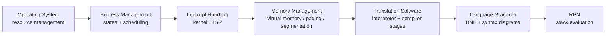
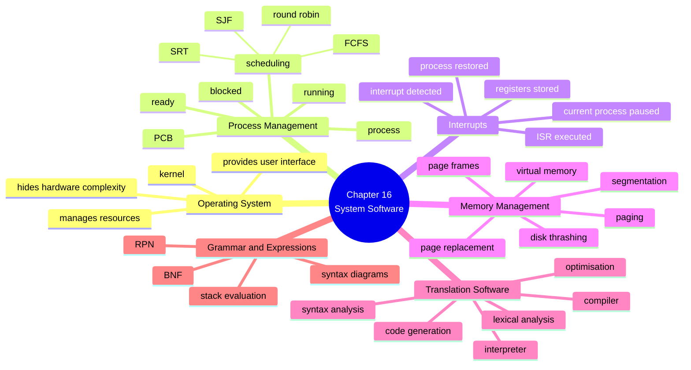
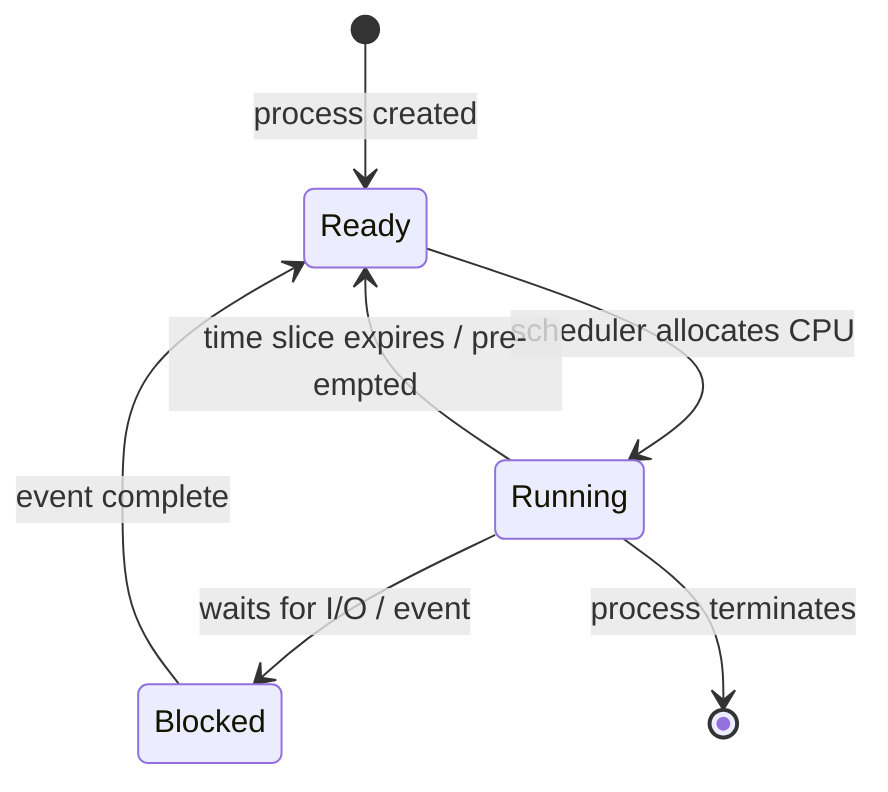
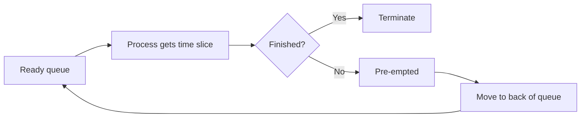
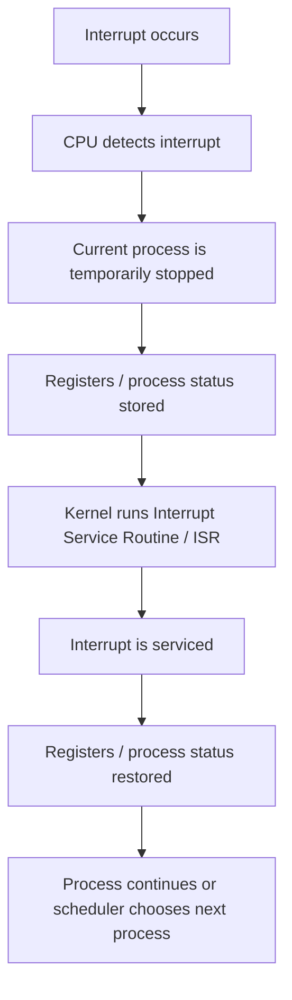
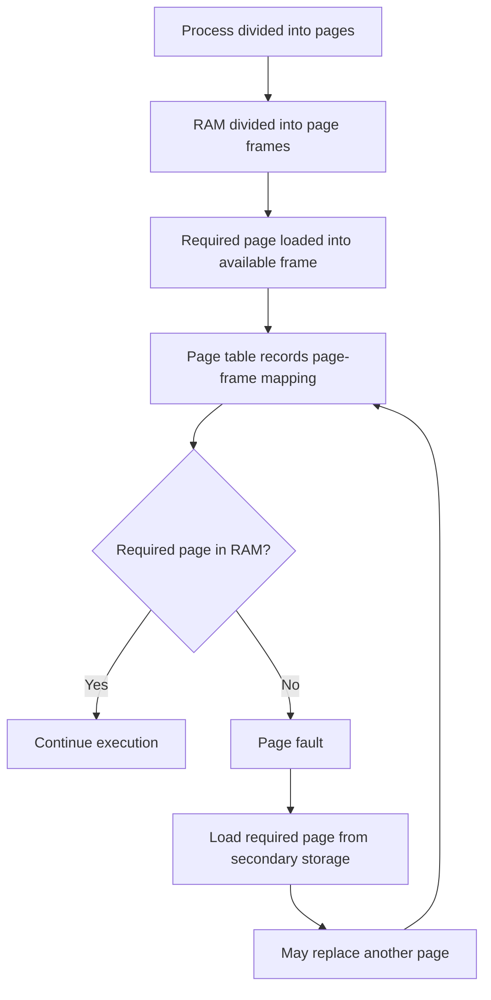
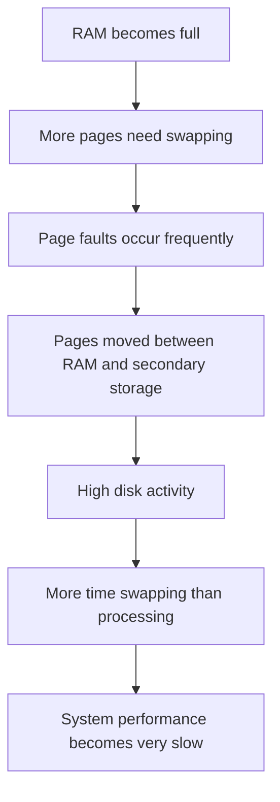
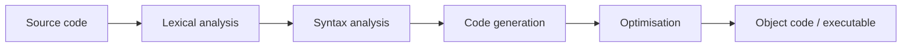

# A2 9618 Computer Science — Chapter 16 Updated Notes
## System Software｜Syllabus-Aligned Paper 3 Revision Sheet

> **Version:** Syllabus-aligned revision; informed by recent Paper 3 patterns  
> **Target:** Cambridge International AS & A Level Computer Science 9618  
> **Chapter:** 16 System Software  
> **Main audience:** A2 students  
> **Style:** Chinese explanation + English mark scheme keywords  
> **Docsify:** ready  
>

---

# 0. How to Use This Sheet

Chapter 16 不是简单背“OS 是什么”的章节。2024–2025 Paper 3 更喜欢考：

1. **process management / scheduling** 的精确描述  
2. **virtual memory / paging / segmentation / disk thrashing** 的因果关系  
3. **interpreter / compiler stages** 的 mark scheme 句子  
4. **BNF / syntax diagram / RPN** 的规则转换与操作步骤  

所以复习时不要只背关键词，要能写出 **cause → process → result**。



---

# 1. Recent Paper 3 Pattern Map

| Area | Recent exam pattern | What students must practise |
| --- | --- | --- |
| Process states | Medium-high | running / ready / blocked, reason for transition |
| Scheduling routines | High | FCFS, round robin, shortest job first, shortest remaining time |
| Interrupt handling | Medium-high | kernel detects interrupt, current process paused, registers / status stored, ISR run, restored |
| Virtual memory | High | used when RAM is insufficient, pages moved between RAM and secondary storage |
| Paging vs segmentation | High | fixed-size pages vs variable-size logical segments |
| Disk thrashing | Very high | frequent swapping, more time swapping than processing |
| Interpreter | High in 2025 | translates one line at a time, executes if no syntax error, no executable produced |
| Compiler stages | Medium-high | lexical analysis, syntax analysis, code generation, optimisation |
| BNF / syntax diagrams | Very high | convert diagram ↔ BNF, recognise valid/invalid strings |
| RPN | Very high | convert infix ↔ RPN, evaluate with stack |

---

# 2. Content Update Decision

## 2.1 Keep and Strengthen

| Kept content | Reason |
| --- | --- |
| OS resource management | Syllabus core; often appears inside scenario questions |
| process states and scheduling | 2025 mark scheme directly rewards scheduling vocabulary |
| round robin / FCFS / SJF / SRT | Must compare and explain benefits / drawbacks |
| interrupt handling | Common short-answer topic and links to CPU / process management |
| virtual memory, paging, segmentation | 2024–2025 style questions like asking exact process / definition |
| disk thrashing | Very common 3-mark explanation topic |
| interpreter / compiler | 2025 explicitly tested interpreter operation |
| lexical analysis / syntax analysis / code generation / optimisation | Standard compiler-stage marks |
| BNF and syntax diagrams | Repeated Paper 3 high-frequency skill |
| RPN with stack | Repeated Paper 3 high-frequency skill |

## 2.2 Downweight

| Downweighted content | Why |
| --- | --- |
| very deep OS architecture beyond kernel/user mode | Usually not needed for marks |
| complex page replacement algorithms beyond FIFO / usage idea | Cambridge normally expects concept, not full algorithm design |
| linker / loader detail | Useful background but not central to Chapter 16 syllabus wording |
| advanced compiler theory such as parse trees in detail | BNF / syntax diagrams are more frequently rewarded |
| complex RPN expressions with too many operators | Students need method first; exams usually reward step-by-step stack use |

## 2.3 Remove / Avoid

| Avoid | Reason |
| --- | --- |
| memorising brand-name operating systems | No marks awarded for brand names |
| saying "virtual memory is RAM" | Virtual memory uses secondary storage as if it were main memory |
| saying "interpreter compiles line by line" | Interpreter translates and executes; it does not produce a stored executable |
| saying "round robin is always fastest" | It is fair, but context decides efficiency |
| saying "disk thrashing means disk is broken" | It is excessive swapping between RAM and secondary storage |

---

# 3. One-Page Mind Map



---

# 4. 16.1 Purposes of an Operating System

## 4.1 What the OS does

### Mark scheme answer
> An operating system manages the computer system resources, provides a user interface, hides the complexity of the hardware, and provides a platform for programs to run.
>

### Must-have keywords
+ **manages resources**
+ **user interface**
+ **hides hardware complexity**
+ **process management**
+ **memory management**
+ **file management**
+ **hardware / I/O management**
+ **security management**

### Chinese explanation
OS 可以理解为用户、应用程序和硬件之间的“中间层”。用户不需要知道 CPU register、memory address、device driver 怎么工作，也可以通过 GUI / CLI 使用电脑。

---

## 4.2 How the user interface hides hardware complexity

| User action | Hidden complexity |
| --- | --- |
| clicking an icon | no need to type machine-level commands |
| opening a file | no need to know disk sector / physical address |
| printing a document | no need to control printer hardware directly |
| using a GUI | no need to understand memory locations, buses or CPU instructions |

### Mark scheme answer
> The user interface hides the complexities of the hardware by allowing the user to perform tasks using commands, menus, icons or windows instead of directly controlling memory locations, buses, devices or processor instructions.
>

### Common weak answer
> The OS makes the computer easier to use.
>

This is true but too vague. Say **what is hidden** and **how the user interacts instead**.

---

# 5. Process Management

## 5.1 Process

### Definition
> A process is a program that is currently being executed.
>

A process is not just the program file. It includes:

+ program code
+ current state
+ values in registers
+ memory location
+ program counter
+ process priority
+ data in the Process Control Block / PCB

---

## 5.2 Process states

| State | Meaning | Example |
| --- | --- | --- |
| Running | currently using the CPU | a process is executing instructions |
| Ready | able to run but waiting for CPU time | waiting in ready queue |
| Blocked | cannot continue until an event happens | waiting for input / file read / printer / network response |

### Mark scheme phrases
+ **running process has access to the CPU**
+ **ready process is waiting to be allocated CPU time**
+ **blocked process is waiting for an event / I/O operation**
+ **scheduler decides which process runs next**

---

## 5.3 State transition diagram



### Exam warning
Blocked 通常不是“坏了”，而是 **waiting for an event**。比如正在等用户输入、文件读取、网络响应。

---

# 6. Scheduling

## 6.1 Why scheduling is needed

### Mark scheme answer
> Scheduling is needed because several processes may be ready to use the CPU, but only one process can use the CPU at a time. The scheduler decides which process is allocated CPU time next.
>

### Benefits
+ improves CPU utilisation
+ reduces waiting time
+ gives fair access to CPU
+ supports multi-tasking
+ improves response time for interactive systems

---

## 6.2 First Come First Served / FCFS

### How it works
> Processes are executed in the order they arrive in the ready queue.
>

| Benefit | Drawback |
| --- | --- |
| simple to implement | short jobs may wait behind long jobs |
| fair by arrival order | poor response time if first process is long |
| low overhead | not suitable for highly interactive systems |

### Mark scheme phrase
> Processes are queued as they arrive and are executed in that order.
>

---

## 6.3 Round Robin

### How it works
> Each process is given a fixed time slice. When the time slice expires, the process is pre-empted and moved to the back of the ready queue if it has not finished.
>



| Benefit | Drawback |
| --- | --- |
| fair access to CPU | too small time slice causes many context switches |
| good for time-sharing systems | too large time slice behaves like FCFS |
| avoids one process holding CPU forever | overhead from switching processes |

### Common mistake
> Round robin means all processes run at the same time.
>

Wrong. Only one process uses a single CPU at a time. Round robin just switches quickly between them.

---

## 6.4 Shortest Job First / SJF

### How it works
> The process with the shortest estimated total burst time is executed first.
>

| Benefit | Drawback |
| --- | --- |
| short jobs finish quickly | long jobs may starve |
| can reduce average waiting time | needs estimated burst time |
| efficient for batch systems | not always fair |

---

## 6.5 Shortest Remaining Time / SRT

### How it works
> The process with the shortest remaining burst time is executed first. It is pre-emptive, so a running process can be replaced if a new process with a shorter remaining time arrives.
>

### Mark scheme phrases
+ **pre-emptive scheduling**
+ **shortest burst time / shortest remaining time**
+ **current process may be replaced**
+ **waiting time is minimised**
+ **longer jobs can suffer starvation**

---

# 7. Interrupt Handling

## 7.1 What is an interrupt?

### Definition
> An interrupt is a signal sent to the processor that requires immediate attention and may cause the current process to be temporarily stopped.
>

### Common sources
+ I/O completed
+ keyboard input
+ hardware error
+ timer interrupt
+ software error
+ higher priority process needs CPU

---

## 7.2 Interrupt handling process



### Mark scheme answer
> When an interrupt is detected, the current process is temporarily stopped and the contents of registers / process status are stored. The kernel runs the interrupt service routine. After the interrupt is serviced, the saved register values / process status can be restored.
>

### Common mistake
| Mistake | Correction |
| --- | --- |
| "interrupt deletes the program" | it usually pauses the current process |
| "CPU ignores current work" | current state must be stored first |
| "ISR is the same as scheduler" | ISR services interrupt; scheduler may then choose next process |

---

# 8. Memory Management

## 8.1 Virtual memory

### Definition
> Virtual memory uses secondary storage as an extension of main memory so that programs can run even when there is not enough RAM to hold all required pages at once.
>

### Why it is used
+ RAM is running low
+ many processes are running
+ a program is too large to fit fully into RAM
+ not all parts of a program are needed at the same time

### Mark scheme answer
> Virtual memory is used when RAM is running low. Pages that are not immediately needed can be moved from RAM to secondary storage, allowing other pages / processes to use main memory.
>

---

## 8.2 Paging

### Key idea
> Paging divides a process into fixed-size pages and divides memory into fixed-size page frames. Pages can be loaded into any available frame.
>

| Term | Meaning |
| --- | --- |
| Page | fixed-size block of a process / virtual memory |
| Frame | fixed-size block of physical RAM |
| Page table | maps pages to frames |
| Page fault | occurs when a required page is not currently in RAM |

### Paging process


---

## 8.3 Page replacement

### Why replacement is needed
If RAM is full and a required page is not in RAM, the OS must remove / replace a page to make room.

### Simple mark scheme answer
> A page that is not currently needed is moved from RAM to secondary storage. The required page is then loaded into the freed page frame.
>

### Possible replacement methods
| Method | Simple idea |
| --- | --- |
| FIFO | replace the page that has been in memory the longest |
| least recently used idea | replace a page that has not been used recently |

Do not over-learn advanced algorithms unless your course specifically requires them.

---

## 8.4 Segmentation

### Key idea
> Segmentation divides a program into variable-sized logical sections called segments.
>

Examples of segments:

+ code segment
+ data segment
+ stack segment
+ procedure / function segment
+ module segment

### Mark scheme answer
> In segmented memory, the logical / virtual address space is broken into varying-sized blocks called segments. Each segment represents a logical part of the program and can be stored in memory separately.
>

---

## 8.5 Paging vs segmentation

| Feature | Paging | Segmentation |
| --- | --- | --- |
| Size | fixed-size blocks | variable-size blocks |
| Unit | page / frame | logical segment |
| Based on | physical memory management | program logic |
| Main benefit | easier allocation of memory frames | matches logical structure of program |
| Main issue | page faults / page replacement | external fragmentation can occur |

### Exam phrase
> Pages are fixed-size blocks, while segments are variable-sized logical divisions of a program.
>

---

## 8.6 Disk thrashing

### Definition
> Disk thrashing occurs when the system spends more time swapping pages between RAM and secondary storage than executing useful instructions.
>

### Cause and effect


### Mark scheme answer
> Disk thrashing occurs when frequent transfers between main memory and secondary storage take place. As main memory fills up, pages are repeatedly swapped in and out, so more time is spent swapping pages than processing data.
>

### Common mistake
| Mistake | Correction |
| --- | --- |
| "disk thrashing means hard disk failure" | it means excessive swapping |
| "more virtual memory always improves performance" | too much swapping can reduce performance |
| "page fault is always bad" | occasional page faults are normal; frequent page faults cause problems |

---

# 9. 16.2 Translation Software

## 9.1 Interpreter

### What an interpreter does
> An interpreter translates and executes a high-level language program one statement / line at a time without producing a stored executable file.
>

### Recent exam-style mark scheme answer
> The interpreter translates the source code one line at a time. If the line is syntax error free, it is executed. The translated code is not stored in executable format. If an error is found, the program halts with an error message. Each line must be translated every time it is run.
>

### Benefits
| Benefit | Explanation |
| --- | --- |
| easier debugging | stops when error is found |
| good during development | programmer can fix errors immediately |
| portable if interpreter exists | same source may run on different systems |

### Drawbacks
| Drawback | Explanation |
| --- | --- |
| slower execution | line is translated every time it runs |
| source code needed | user may need access to source |
| errors may appear later | code path not executed may still contain errors |

---

## 9.2 Compiler

### What a compiler does
> A compiler translates the whole source code into object code / executable code before the program is run.
>

### Benefits
| Benefit | Explanation |
| --- | --- |
| faster execution | translated once before running |
| source code hidden | executable can be distributed without source |
| errors can be reported together | compiler analyses whole program |

### Drawbacks
| Drawback | Explanation |
| --- | --- |
| slower development cycle | must compile before running |
| executable is platform dependent | different machine / OS may need different compilation |
| error messages may be less immediate | not line-by-line during execution |

---

## 9.3 Compiler stages



## 9.4 Lexical analysis

### What happens
+ removes unnecessary spaces / comments
+ groups characters into tokens
+ identifies keywords, identifiers, operators, constants
+ may build / update symbol table

### Mark scheme phrase
> Lexical analysis breaks the source code into tokens and removes unnecessary characters such as spaces and comments.
>

---

## 9.5 Syntax analysis

### What happens
+ checks tokens against grammar rules
+ detects syntax errors
+ checks statement structure
+ may build a parse structure

### Mark scheme phrase
> Syntax analysis checks that the sequence of tokens follows the grammar rules of the programming language.
>

---

## 9.6 Code generation

### What happens
+ produces machine code / object code
+ converts analysed source into instructions for the processor
+ allocates registers / memory where needed

### Mark scheme phrase
> Code generation produces object code / machine code from the analysed source program.
>

---

## 9.7 Optimisation

### What happens
+ improves efficiency of object code
+ may reduce execution time
+ may reduce memory use
+ may remove redundant instructions

### Mark scheme phrase
> Optimisation improves the object code so that it runs faster and / or uses fewer resources.
>

---

# 10. BNF and Syntax Diagrams

## 10.1 What BNF is

### Definition
> Backus-Naur Form / BNF is a notation used to describe the grammar rules of a programming language.
>

### Common symbols
| Symbol | Meaning |
| --- | --- |
| `::=` | is defined as |
| `|` | OR / alternative |
| `<digit>` | non-terminal symbol |
| `A` or `+` | terminal symbol |

---

## 10.2 BNF examples

```bnf
<digit> ::= 0 | 1 | 2 | 3 | 4 | 5 | 6 | 7 | 8 | 9

<letter> ::= A | B | C | D

<identifier> ::= <letter> | <letter><identifier> | <identifier><digit>
```

### How to read
+ `<digit>` can be any single digit.
+ `<letter>` can be A, B, C or D.
+ `<identifier>` begins with a letter and can continue with letters or digits.

---

## 10.3 Syntax diagram rules

A syntax diagram is a visual way to show the same grammar.

| Diagram feature | Meaning |
| --- | --- |
| path splits | alternatives / OR |
| loop arrow | repetition |
| sequence of boxes | items must appear in order |
| terminal box | actual character / symbol |
| non-terminal box | another rule is used |

### Exam strategy
When checking if a string is valid:

1. Start at the left of the diagram.
2. Follow arrows exactly.
3. Check every character in order.
4. If a character cannot follow any path, it is invalid.
5. Make sure the string ends at the diagram exit.

---

# 11. Reverse Polish Notation / RPN

## 11.1 What RPN is

### Definition
> Reverse Polish Notation writes the operator after the operands.
>

| Infix | RPN |
| --- | --- |
| `A + B` | `A B +` |
| `(A + B) * C` | `A B + C *` |
| `(5 - 2) * (5 + 4) / 9` | `5 2 - 5 4 + * 9 /` |

---

## 11.2 Why stack is used

RPN is normally evaluated using a stack because the most recent operands are used first.

### Stack evaluation method
1. Read the RPN expression from left to right.
2. Push operands onto the stack.
3. When an operator is found, pop the last two operands.
4. Apply the operator.
5. Push the result back onto the stack.
6. Repeat until one final value remains.

### Mark scheme answer
> The RPN expression is read from left to right. Values are pushed onto a stack until an operator is found. The last two values are popped, the operator is applied, and the result is pushed back onto the stack. This repeats until a single value remains.
>

---

## 11.3 Worked RPN example

Evaluate:

```text
5 2 - 5 4 + * 9 /
```

| Step | Token | Stack |
| --- | --- | --- |
| 1 | 5 | 5 |
| 2 | 2 | 5, 2 |
| 3 | - | 3 |
| 4 | 5 | 3, 5 |
| 5 | 4 | 3, 5, 4 |
| 6 | + | 3, 9 |
| 7 | * | 27 |
| 8 | 9 | 27, 9 |
| 9 | / | 3 |

Answer:

```text
3
```

---

# 12. Mark Scheme Keywords

## 12.1 Operating system
+ **manages resources**
+ **hides complexity of hardware**
+ **provides user interface**
+ **process management**
+ **memory management**
+ **file management**
+ **I/O management**
+ **security management**

## 12.2 Process management
+ **process**
+ **running / ready / blocked**
+ **ready queue**
+ **scheduler**
+ **CPU time**
+ **time slice**
+ **pre-empted**
+ **context switch**
+ **starvation**

## 12.3 Interrupts
+ **interrupt detected**
+ **current process temporarily stopped**
+ **registers stored**
+ **process status saved**
+ **interrupt service routine / ISR**
+ **registers restored**

## 12.4 Memory management
+ **virtual memory**
+ **secondary storage**
+ **page**
+ **frame**
+ **page table**
+ **page fault**
+ **page replacement**
+ **segmentation**
+ **disk thrashing**
+ **more time swapping than processing**

## 12.5 Translation software
+ **source code**
+ **object code**
+ **executable**
+ **line by line**
+ **syntax error**
+ **lexical analysis**
+ **syntax analysis**
+ **code generation**
+ **optimisation**
+ **tokens**
+ **grammar rules**

## 12.6 Grammar and RPN
+ **Backus-Naur Form / BNF**
+ **syntax diagram**
+ **terminal / non-terminal**
+ **operator after operands**
+ **stack**
+ **push / pop**

---

# 13. Common Mistakes 易错表

| Mistake | Why it loses marks | Better answer |
| --- | --- | --- |
| OS only means GUI | OS does much more than interface | OS manages resources and provides an interface |
| blocked means crashed | blocked is a valid process state | blocked means waiting for I/O or an event |
| round robin runs all processes simultaneously | only one process gets CPU at a time | each process gets a time slice |
| SJF is always best | long jobs may starve | SJF reduces waiting time for short jobs but may starve long jobs |
| interrupt deletes current process | current state is saved | process is paused, state stored, ISR runs |
| virtual memory is RAM | it uses secondary storage | secondary storage is used as extension of RAM |
| paging and segmentation are the same | size and purpose differ | pages fixed size; segments variable logical sections |
| disk thrashing means disk is damaged | it is a performance issue | frequent swapping causes slowdown |
| interpreter creates executable | it does not store executable | translates and executes line by line |
| compiler runs source line by line | that is interpreter behaviour | compiler translates whole program before running |
| BNF `|` means AND | it means OR | choose one alternative |
| RPN is read right to left | it is read left to right | operands pushed, operators applied using stack |

---

# 14. Scenario Answer Bank

## 14.1 User says the computer can run many apps at once
> This is multi-tasking. The OS stores several processes in memory and the scheduler allocates CPU time to one process at a time. Processes may move between ready, running and blocked states.

## 14.2 A running process is waiting for printer output
> The process becomes blocked because it cannot continue until the I/O operation is complete. When the event occurs, it can return to the ready queue.

## 14.3 A system needs fair CPU access for many users
> Round robin is suitable because each process is given a fixed time slice. If a process does not finish, it is pre-empted and moved to the back of the queue.

## 14.4 Short tasks should finish quickly
> Shortest job first or shortest remaining time can be suitable because processes with short burst times are executed first, reducing waiting time. However, long jobs may suffer starvation.

## 14.5 RAM is full but a program still runs
> Virtual memory is used. Pages not immediately needed are moved to secondary storage and required pages are loaded into RAM when needed.

## 14.6 Computer becomes very slow with many programs open
> Disk thrashing may occur because pages are frequently swapped between RAM and secondary storage. More time is spent swapping pages than processing data.

## 14.7 Programmer is debugging a program
> An interpreter may be useful because it translates and executes one line at a time and stops with an error message when an error is found.

## 14.8 Finished software is distributed to users
> A compiler may be better because it produces executable object code. The program can run faster and the source code does not need to be distributed.

## 14.9 A grammar rule must describe valid strings
> BNF or a syntax diagram can be used. BNF uses symbols such as `::=` to define rules and `|` to show alternatives.

## 14.10 An expression must be evaluated without brackets
> Reverse Polish Notation can be used. Operands are written before the operator and the expression is evaluated using a stack.

---

# 15. 10 Marks Quick Check

## Questions

1. State two purposes of an operating system. [2]  
2. Name the three process states in the syllabus. [3]  
3. Explain why a blocked process cannot continue. [1]  
4. Give one benefit of round robin scheduling. [1]  
5. Define virtual memory. [1]  
6. State one difference between paging and segmentation. [1]  
7. What does an interpreter do? [1]

## Answers

1. Any two: manages resources, provides user interface, hides hardware complexity, process management, memory management, file management, I/O management.  
2. Running, ready, blocked.  
3. It is waiting for an event / I/O operation to complete.  
4. It gives fair CPU access / each process gets a time slice / supports time-sharing.  
5. Secondary storage is used as an extension of main memory / RAM.  
6. Paging uses fixed-size pages; segmentation uses variable-sized logical segments.  
7. It translates and executes source code one line at a time without producing a stored executable.

---

# 16. 20 Marks Exam-Style Practice

## Question 1: OS process management and scheduling [7]

A computer is running several processes at the same time.

(a) Explain what is meant by a process. [1]  
(b) Describe the difference between the ready and blocked states. [2]  
(c) Describe how round robin scheduling works. [2]  
(d) State one benefit and one drawback of shortest job first scheduling. [2]

### Mark scheme

(a) A process is a program currently being executed. [1]

(b)  
+ Ready: process can run but is waiting for CPU time. [1]  
+ Blocked: process cannot continue until an event / I/O operation occurs. [1]

(c)  
+ Each process is given a fixed time slice. [1]  
+ If it does not finish, it is pre-empted and moved to the back of the ready queue. [1]

(d)  
+ Benefit: short jobs finish quickly / average waiting time reduced. [1]  
+ Drawback: long jobs may suffer starvation / needs burst-time estimate. [1]

---

## Question 2: Memory management [6]

A student opens many large programs at the same time. The computer becomes very slow.

(a) Explain how virtual memory allows programs to run when RAM is low. [2]  
(b) State one difference between paging and segmentation. [2]  
(c) Explain what is meant by disk thrashing. [2]

### Mark scheme

(a)  
+ Secondary storage is used as an extension of RAM. [1]  
+ Pages not immediately needed are moved out of RAM / required pages are loaded into RAM when needed. [1]

(b)  
+ Paging divides memory / processes into fixed-size pages / frames. [1]  
+ Segmentation divides a program into variable-sized logical sections. [1]

(c)  
+ Frequent swapping of pages occurs between RAM and secondary storage. [1]  
+ More time is spent swapping pages than processing data, so performance falls. [1]

---

## Question 3: Translation software, BNF and RPN [7]

(a) Describe how an interpreter executes a program. [3]  
(b) Name two stages of compilation and describe one of them. [2]  
(c) Convert the infix expression `(A + B) * C` into RPN. [1]  
(d) State the data structure normally used to evaluate RPN expressions. [1]

### Mark scheme

(a)  
+ Translates source code one line / statement at a time. [1]  
+ Executes the line if it has no syntax error. [1]  
+ Does not produce / store an executable file, and translation is repeated each time it runs. [1]

(b) Any two stages: lexical analysis, syntax analysis, code generation, optimisation. [1]  
Description example: lexical analysis breaks code into tokens / syntax analysis checks grammar rules / code generation produces object code / optimisation improves efficiency. [1]

(c) `A B + C *` [1]  
(d) Stack. [1]

---
