# A2 9618 Computer Science — Chapter 17 Updated Notes
## Security｜Syllabus-Aligned Paper 3 Revision Sheet

> **Version:** Syllabus-aligned revision; informed by recent Paper 3 patterns  
> **Target:** Cambridge International AS & A Level Computer Science 9618  
> **Chapter:** 17 Security  
> **Main audience:** A2 students  
> **Style:** Chinese explanation + English mark scheme keywords  
> **Docsify:** ready  
>

---

# 0. How to Use This Sheet

Chapter 17 不是“网络安全常识”章节，而是一个非常典型的 **mark scheme keyword chapter**。2024–2025 Paper 3 更喜欢考：

1. **symmetric vs asymmetric cryptography** 的过程对比  
2. **public key / private key** 在不同场景中的使用方向  
3. **SSL/TLS handshake** 的大致流程与目的  
4. **digital certificate / certificate authority / digital signature** 的作用  
5. **quantum cryptography** 的 purpose, benefit, drawback  

复习时要记住：

> 安全题不是写“it is secure”就能拿分，必须写出 **how / why / which key / who owns the key / what is verified**。

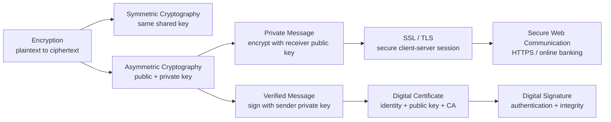

---

# 1. Recent Paper 3 Pattern Map

| Area | Recent exam pattern | What students must practise |
| --- | --- | --- |
| Symmetric cryptography | High | one shared key, encrypt and decrypt, fast but key distribution risk |
| Asymmetric cryptography | Very high | public/private key pair, one key encrypts and matching key decrypts |
| Public/private key use | Very high | private message vs verified message; do not mix up direction |
| SSL/TLS | High | purpose, handshake idea, session key, secure client-server communication |
| Digital certificate | Very high | identifies website/organisation, contains public key, issued by CA |
| Digital signature | High | proves sender identity and message integrity |
| Quantum cryptography | Medium-high | purpose, benefits and drawbacks, eavesdropping detection |
| Plaintext/ciphertext terminology | High | precise definitions often earn easy marks |
| HTTPS / online banking scenario | High | explain why SSL/TLS is appropriate |
| Malware / firewall detail | Low for Chapter 17 | Mostly not this chapter; avoid spending too much time |

---

# 2. Content Update Decision

## 2.1 Keep and Strengthen

| Kept content | Reason |
| --- | --- |
| plaintext, ciphertext, encryption, decryption | Core vocabulary; common low-mark questions |
| symmetric key cryptography | Required by syllabus and easy comparison marks |
| asymmetric key cryptography | Very high-frequency Paper 3 concept |
| public/private key pair | Most common source of student mistakes |
| private message process | Mark schemes reward correct key direction |
| verified/public message process | Often confused with private message process |
| digital certificates | 2024–2025 trend remains strong |
| Certificate Authority (CA) | Needed for digital certificate explanation |
| digital signatures | Required link between private key and verification |
| SSL/TLS | Required by syllabus; common client-server scenario |
| quantum cryptography | Often appears as benefits/drawbacks short answer |

## 2.2 Downweight

| Downweighted content | Why |
| --- | --- |
| detailed mathematical encryption algorithms | Syllabus asks understanding, not RSA maths |
| very deep SSL/TLS packet-level detail | Need purpose and handshake idea, not full protocol engineering |
| malware types in detail | More AS security / general security, not the A2 Chapter 17 focus |
| long history of SSL vs TLS | Only need know TLS is newer / more secure version idea |
| certificate chain technical depth | Useful extension, but exam usually wants CA + public key + identity |

## 2.3 Remove / Avoid

| Avoid | Reason |
| --- | --- |
| saying “public key is secret” | Public key is shared openly |
| saying “private key is sent to receiver” | Private key must be kept secret |
| saying “digital certificate is the same as digital signature” | They are related but different |
| saying “SSL/TLS only encrypts passwords” | It secures client-server communication generally |
| saying “quantum cryptography means quantum computer encryption” | It mainly uses quantum properties for secure key exchange / detecting eavesdropping |

---

# 3. One-Page Mind Map

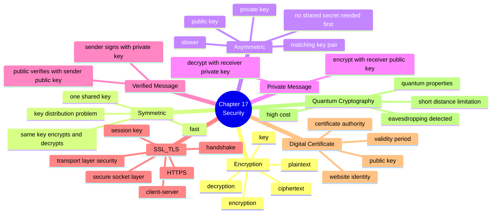

---

# 4. 17.1 Encryption, Encryption Protocols and Digital Certificates

## 4.1 Core encryption vocabulary

| Term | Chinese explanation | Mark scheme style phrase |
| --- | --- | --- |
| Plaintext | 原始可读信息 | original readable message/data |
| Ciphertext | 加密后的不可读信息 | encrypted unreadable message/data |
| Encryption | 把明文变成密文 | converting plaintext into ciphertext using an algorithm and key |
| Decryption | 把密文还原成明文 | converting ciphertext back into plaintext using a key |
| Key | 控制加密/解密过程的数据 | value used by the encryption/decryption algorithm |
| Cryptography | 加密通信的方法 | method of protecting data using encryption techniques |

### Mark scheme answer

> Encryption is the process of converting plaintext into ciphertext using an encryption algorithm and a key, so that the data cannot be understood if intercepted.

### Must-have keywords

+ **plaintext**
+ **ciphertext**
+ **algorithm**
+ **key**
+ **encrypted / decrypted**
+ **intercepted data cannot be read**

### Common weak answer

> Encryption makes data secure.

This is too vague. You must say **how**: plaintext becomes ciphertext using a key.

---

## 4.2 Symmetric key cryptography

### Definition

> Symmetric cryptography uses the same shared secret key to encrypt and decrypt data.

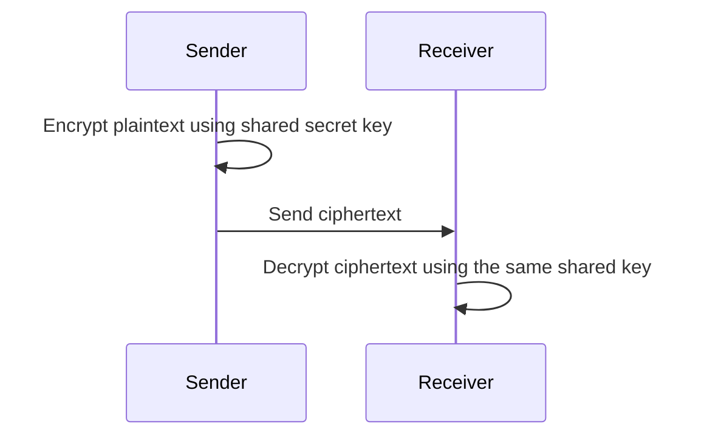

### Key points

| Feature | Explanation |
| --- | --- |
| Number of keys | one shared secret key |
| Encryption | sender uses the shared key |
| Decryption | receiver uses the same shared key |
| Speed | usually faster than asymmetric encryption |
| Main problem | key must be shared securely before communication |

### Benefit

> Symmetric encryption is fast and efficient, so it is suitable for encrypting large amounts of data.

### Drawback

> The shared key must be sent or agreed securely; if the key is intercepted, the encrypted data can be decrypted.

### Exam sentence bank

| Question style | Answer template |
| --- | --- |
| Describe symmetric cryptography | It uses the same key for both encryption and decryption. Both sender and receiver must know the shared secret key. |
| Give a benefit | It is faster / requires less processing power, so it is suitable for large data transfers. |
| Give a drawback | The key distribution problem: the shared key must be sent securely before communication. |
| Compare with asymmetric | Symmetric uses one shared key, while asymmetric uses a public/private key pair. |

---

## 4.3 Asymmetric key cryptography

### Definition

> Asymmetric cryptography uses a matching pair of keys: a public key and a private key. Data encrypted with one key can only be decrypted with the matching key.

| Key | Who can access it? | Role |
| --- | --- | --- |
| Public key | can be shared openly | used by others to encrypt data or verify signatures |
| Private key | kept secret by owner | used by owner to decrypt data or create digital signatures |

### Important rule

> The public key and private key are mathematically linked, but the private key should not be derivable from the public key.

### Benefit

> The sender does not need to share a secret key before sending a private message.

### Drawback

> Asymmetric encryption is usually slower and needs more processing than symmetric encryption.

---

# 5. Two Different Uses of Public and Private Keys

This is the most important part of Chapter 17. Students lose marks because they mix up these two cases.

---

## 5.1 Case 1: Sending a private message to an individual / organisation

### Scenario

Fred wants to send a private message to Sheila. Only Sheila should be able to read it.

### Correct key direction

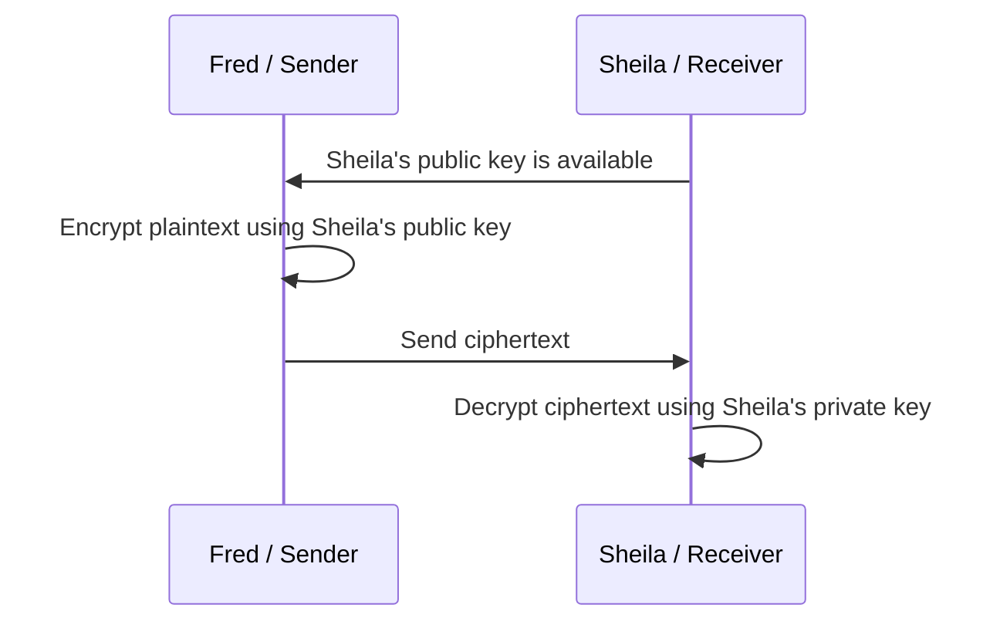

### Mark scheme answer

> The sender encrypts the plaintext using the receiver's public key. The ciphertext is sent to the receiver. Only the receiver can decrypt it using the receiver's private key.

### Why this works

+ Everyone may know Sheila's **public key**.
+ Only Sheila has Sheila's **private key**.
+ Therefore only Sheila can decrypt the ciphertext.

### Common mistake

| Mistake | Correction |
| --- | --- |
| encrypt with sender's public key | use receiver's public key for privacy |
| receiver decrypts with public key | receiver decrypts with their private key |
| private key is sent to sender | private key is never sent |
| public key must be hidden | public key can be shared openly |

---

## 5.2 Case 2: Sending a verified message to the public

### Scenario

A school wants to publish a message and prove that the message really came from the school.

This is not mainly about secrecy. It is about:

+ **authentication**: proving who sent it
+ **integrity**: showing the message has not been changed
+ **non-repudiation**: sender cannot easily deny sending it

### Correct key direction

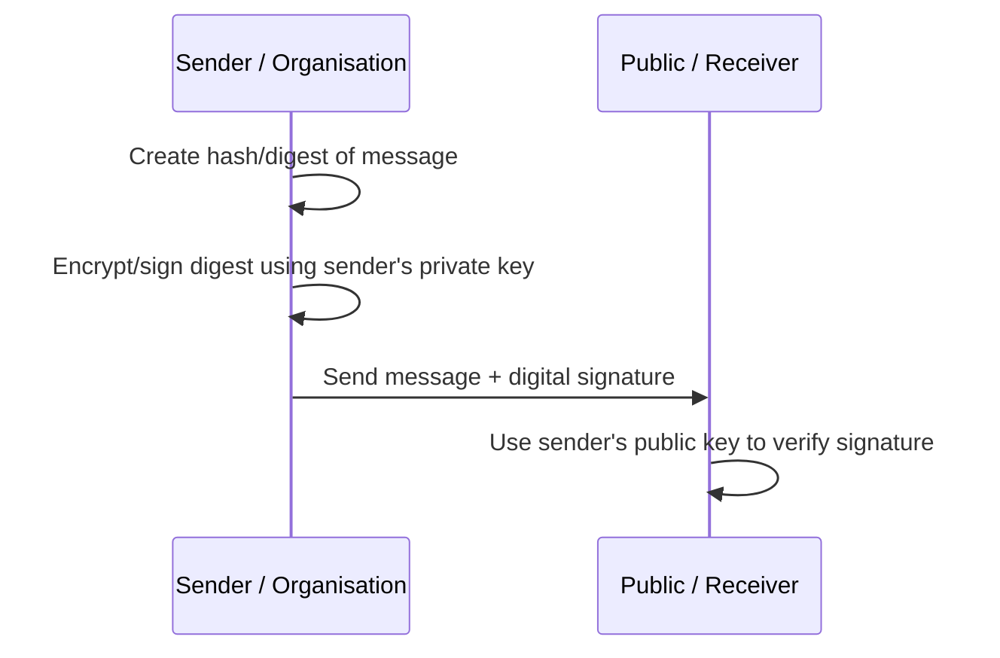

### Mark scheme answer

> The sender creates a digital signature using their private key. The receiver uses the sender's public key to check the signature. If the check is successful, the receiver can verify the sender's identity and that the message has not been altered.

### Why this works

+ Only the sender has the sender's **private key**.
+ Anyone can use the sender's **public key** to check the signature.
+ If verification succeeds, the message can be linked to the sender.

### Common mistake

| Mistake | Correction |
| --- | --- |
| using receiver's public key for signature | sender signs using sender's private key |
| saying digital signature hides the message | digital signature verifies identity / integrity |
| saying public key decrypts the whole private message | public key verifies the signature, not necessarily the whole message |

---

# 6. Symmetric vs Asymmetric Cryptography

| Feature | Symmetric cryptography | Asymmetric cryptography |
| --- | --- | --- |
| Keys used | one shared secret key | public key + private key pair |
| Encryption/decryption | same key | matching key pair |
| Speed | faster | slower |
| Key distribution | difficult because shared key must be exchanged securely | easier because public key can be shared |
| Main use | bulk data encryption / session data | key exchange, digital signatures, secure initial communication |
| Risk | if shared key is intercepted, messages can be read | if private key is stolen, identity/security is compromised |

### Recent exam-style comparison

> Symmetric cryptography uses a single shared key to encrypt and decrypt data, while asymmetric cryptography uses a public/private key pair. Symmetric cryptography is faster, but the shared key must be distributed securely. Asymmetric cryptography avoids sending a shared secret key first, but it is slower and requires more processing.

---

# 7. SSL / TLS

## 7.1 Purpose of SSL/TLS

SSL means **Secure Socket Layer**. TLS means **Transport Layer Security**.

In modern wording, TLS is the newer and more secure protocol, but exam answers often accept SSL/TLS together.

### Mark scheme answer

> SSL/TLS provides secure client-server communication over a network by encrypting data, authenticating the server, and helping maintain data integrity.

### Must-have keywords

+ **secure communication**
+ **client-server**
+ **encryption**
+ **authentication**
+ **data integrity**
+ **digital certificate**
+ **session key**
+ **HTTPS**

---

## 7.2 Where SSL/TLS is appropriate

| Situation | Why SSL/TLS is suitable |
| --- | --- |
| online banking | protects account and transaction details |
| online shopping | protects card/payment details |
| login page | protects username and password |
| sending personal data | keeps confidential data encrypted |
| webmail | protects message content and login details |
| API communication | protects data between client and server |

### Scenario answer

> SSL/TLS is appropriate for online banking because confidential data such as login details and transaction information is transmitted between a client and a server. SSL/TLS encrypts the data, authenticates the server using a digital certificate, and helps protect the data from being altered during transmission.

---

## 7.3 Simplified TLS handshake process

You do not need full industry-level TLS detail, but you should know the logic.

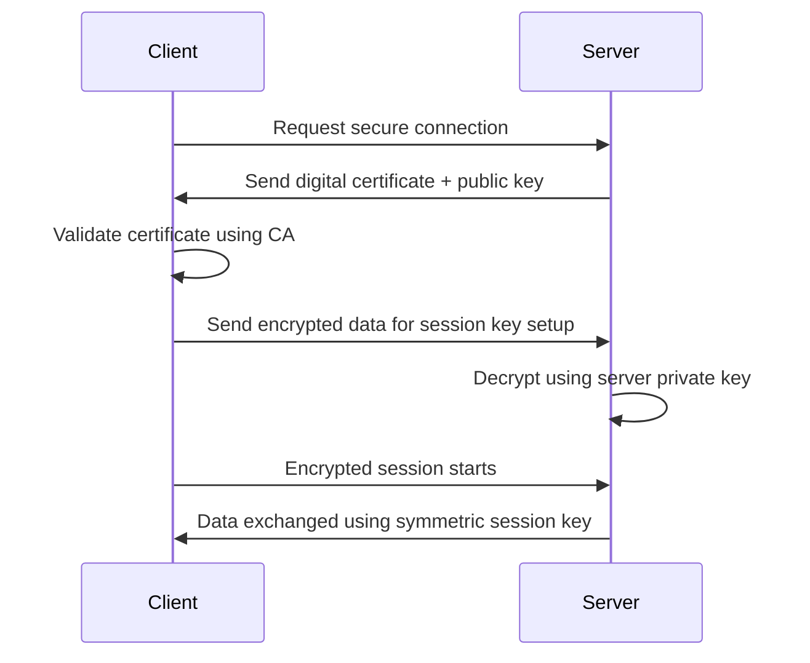

### Step-by-step version

1. Client connects to server and requests a secure session.
2. Server sends a **digital certificate** containing the server's public key.
3. Client checks / validates the certificate using a **Certificate Authority**.
4. Client and server establish a **session key**.
5. The session key is used for symmetric encryption during the session.
6. Encrypted data is exchanged.

### Why both asymmetric and symmetric are used

| Stage | Method | Reason |
| --- | --- | --- |
| initial handshake | asymmetric | allows secure key exchange and server authentication |
| data transfer | symmetric session key | faster for large amounts of data |

### Common mistake

| Mistake | Correction |
| --- | --- |
| SSL/TLS only uses asymmetric encryption | it normally uses asymmetric for setup and symmetric for session data |
| certificate encrypts the data | certificate helps authenticate identity and provide public key |
| TLS only checks password | TLS secures communication, not just passwords |

---

# 8. Digital Certificates

## 8.1 What is a digital certificate?

A digital certificate is an electronic document used to prove the identity of a website, person or organisation.

It normally contains:

+ owner's identity / domain name
+ owner's public key
+ certificate issuer / Certificate Authority
+ validity period
+ digital signature of the CA

### Mark scheme answer

> A digital certificate is an electronic document issued by a Certificate Authority that links an entity's identity to its public key.

---

## 8.2 Certificate Authority (CA)

A **Certificate Authority** is a trusted organisation that issues digital certificates.

### What the CA does

1. checks the identity of the website / organisation
2. issues a digital certificate
3. digitally signs the certificate
4. allows users/browsers to verify that the certificate is trusted

### Mark scheme answer

> A Certificate Authority verifies the identity of an organisation and issues a digital certificate containing the organisation's public key.

---

## 8.3 How a digital certificate is acquired

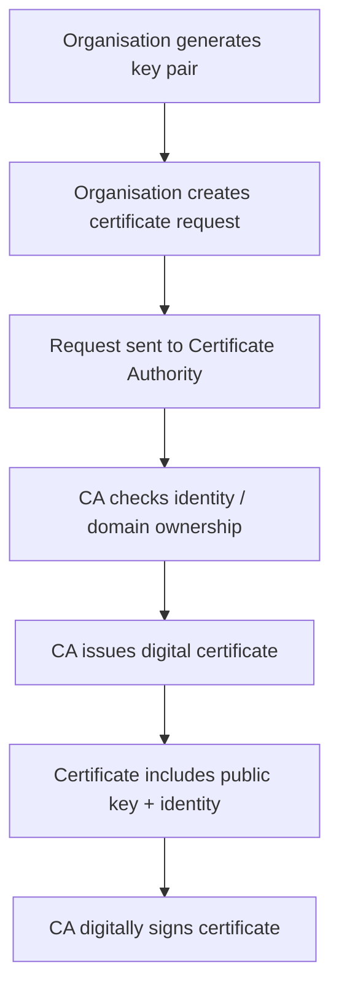

### Exam answer

> The organisation generates a public/private key pair and sends a certificate request to a Certificate Authority. The CA checks the organisation's identity or domain ownership. If valid, the CA issues a digital certificate containing the organisation's public key and identity details, signed by the CA.

---

## 8.4 How a digital certificate is used in TLS

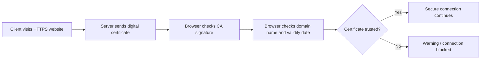

### Mark scheme phrases

+ **authenticate the identity of a website**
+ **contains the public key**
+ **issued by a Certificate Authority**
+ **CA signature can be checked**
+ **used to establish secure communication**

---

# 9. Digital Signatures

## 9.1 Purpose

A digital signature is used to prove:

1. **authentication** — who sent the message
2. **integrity** — message has not been changed
3. **non-repudiation** — sender cannot easily deny sending it

## 9.2 How a digital signature is produced

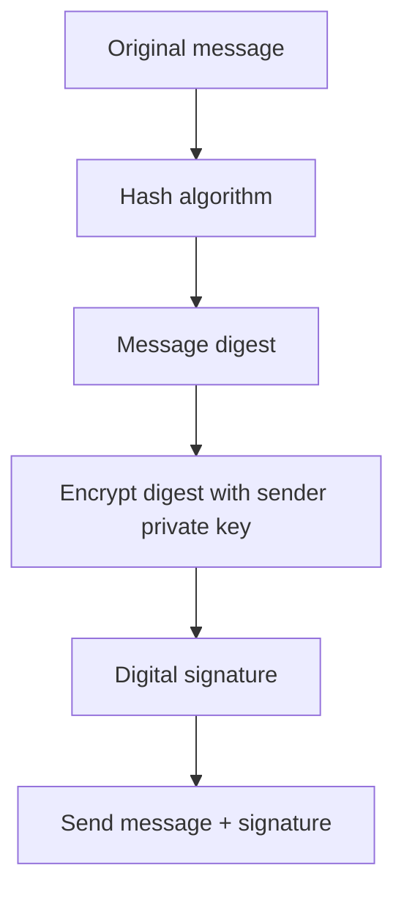

## 9.3 How a digital signature is verified

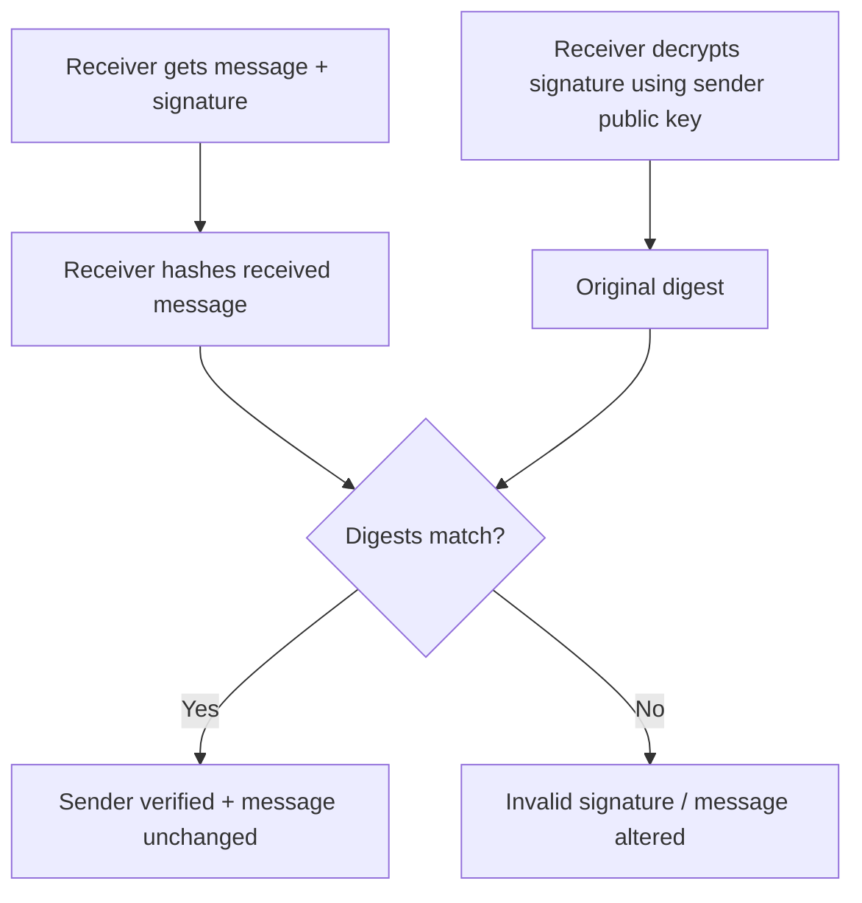

### Mark scheme answer

> The sender creates a hash of the message and encrypts the hash using their private key to create a digital signature. The receiver decrypts the signature using the sender's public key and compares the result with a newly calculated hash of the received message. If they match, the message has not been changed and the sender is verified.

### Common mistakes

| Mistake | Why wrong |
| --- | --- |
| digital signature encrypts the whole message | usually signs a hash/digest, not necessarily the whole message |
| digital signature keeps message secret | it proves identity/integrity; encryption gives secrecy |
| receiver uses receiver's public key | receiver uses sender's public key to verify |

---

# 10. Quantum Cryptography

## 10.1 Purpose

Quantum cryptography is used to create highly secure communication, especially for key exchange.

### Mark scheme answer

> Quantum cryptography uses the principles of quantum mechanics / properties of photons to provide secure communication and detect eavesdropping.

## 10.2 Benefits

| Benefit | Mark scheme style explanation |
| --- | --- |
| eavesdropping can be detected | observing quantum states changes them, so interception can be noticed |
| very high security | security is based on physics rather than only mathematical difficulty |
| useful for sensitive data | suitable for government / financial / military data |
| supports secure key exchange | keys can be exchanged with detection of interception |

## 10.3 Drawbacks

| Drawback | Explanation |
| --- | --- |
| expensive | specialist equipment is required |
| limited distance | current systems may work only over limited distances without trusted nodes/repeaters |
| still developing | not as widely deployed as conventional cryptography |
| does not solve every security issue | endpoints can still be attacked |
| high error rates / environmental sensitivity | transmission can be affected by noise or fibre conditions |

### Exam answer: benefit and drawback

> A benefit of quantum cryptography is that eavesdropping can be detected because measuring quantum states changes them. A drawback is that it requires expensive specialist equipment and is not yet widely practical over long distances.

---

# 11. Mark Scheme Keywords

## 11.1 Encryption

+ **plaintext**
+ **ciphertext**
+ **algorithm**
+ **key**
+ **encrypt**
+ **decrypt**
+ **intercepted data cannot be understood**

## 11.2 Symmetric cryptography

+ **same key**
+ **shared secret key**
+ **encrypt and decrypt**
+ **fast / efficient**
+ **key distribution problem**
+ **key must be kept secret**

## 11.3 Asymmetric cryptography

+ **public key**
+ **private key**
+ **key pair**
+ **matching key**
+ **public key can be shared**
+ **private key kept secret**
+ **encrypted with one key, decrypted with the other**

## 11.4 SSL/TLS

+ **secure communication**
+ **client-server**
+ **digital certificate**
+ **server authentication**
+ **session key**
+ **encrypted session**
+ **data integrity**
+ **HTTPS**

## 11.5 Digital certificate

+ **electronic document**
+ **Certificate Authority / CA**
+ **identity of website / organisation**
+ **public key**
+ **CA digital signature**
+ **validity period**
+ **authenticate**

## 11.6 Digital signature

+ **hash / message digest**
+ **sender's private key**
+ **sender's public key**
+ **authentication**
+ **integrity**
+ **non-repudiation**
+ **message has not been altered**

## 11.7 Quantum cryptography

+ **quantum mechanics**
+ **photons**
+ **eavesdropping detected**
+ **properties change when observed**
+ **high cost**
+ **limited distance**
+ **specialist equipment**

---

# 12. Common Mistakes 易错表

| Mistake | Why it loses marks | Correct answer |
| --- | --- | --- |
| Public key is secret | Public key is designed to be shared | Private key is secret |
| Private key is sent to receiver | Private key must never be shared | Send/use public key instead |
| Symmetric uses two keys | That is asymmetric | Symmetric uses one shared key |
| Asymmetric is always used for all data | Too slow for bulk data | Often used to exchange session key, then symmetric used |
| Digital certificate = digital signature | They are different concepts | Certificate links identity to public key; signature verifies message/sender |
| Digital signature hides the message | Signature verifies, not hides | Encryption hides content |
| TLS is just encryption | Too narrow | TLS also authenticates and helps protect integrity |
| CA encrypts all web traffic | CA issues/signs certificates | Session encryption is done by client/server |
| Quantum cryptography means quantum computer | Not exactly | It uses quantum properties for security/key exchange |
| Saying “more secure” without reason | Vague | Explain eavesdropping detection / private key / CA authentication |

---

# 13. Scenario Answer Bank

## 13.1 Online banking uses HTTPS

> HTTPS uses SSL/TLS to create a secure client-server session. The bank server sends a digital certificate containing its public key. The browser checks that the certificate is trusted and issued by a Certificate Authority. A session key is established and used to encrypt data such as passwords and transaction details. This helps provide confidentiality, authentication and data integrity.

---

## 13.2 A customer sends a private message to a company

> The customer obtains the company's public key, often from a digital certificate. The customer encrypts the plaintext using the company's public key to produce ciphertext. The ciphertext is sent to the company. Only the company can decrypt the message because only the company has the matching private key.

---

## 13.3 A software company signs an update

> The software company creates a hash of the update and encrypts the hash using its private key to create a digital signature. The user's computer uses the company's public key to verify the signature. If the calculated hash matches the decrypted hash, the update is verified as coming from the company and not being altered.

---

## 13.4 A school wants to prove its website is genuine

> The school applies to a Certificate Authority for a digital certificate. The CA checks the school's identity or domain ownership and issues a certificate containing the school's public key. When users visit the website, their browser checks the CA signature and certificate details to authenticate the website.

---

## 13.5 A government department considers quantum cryptography

> Quantum cryptography may be suitable because it can detect eavesdropping and offers very high security for sensitive data. However, it can be expensive, requires specialist equipment and may have distance limitations, so it may not be suitable for every network.

---

# 14. Process Diagrams

## 14.1 Private message using asymmetric cryptography

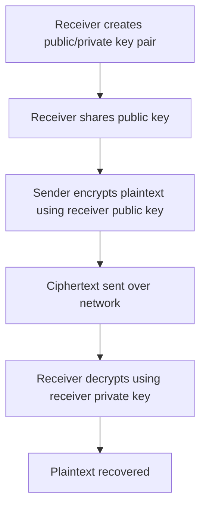

## 14.2 Digital signature process

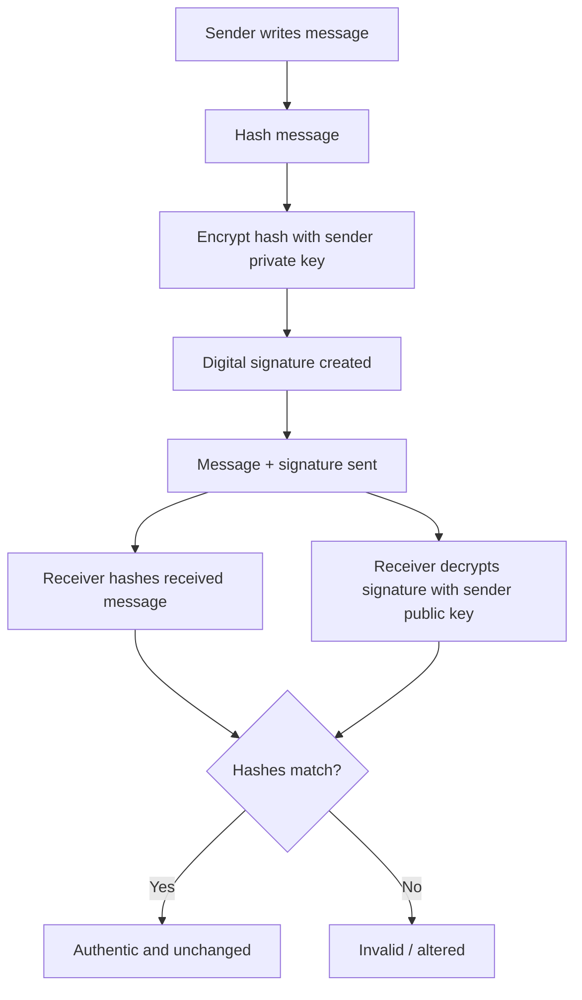

## 14.3 TLS simplified process

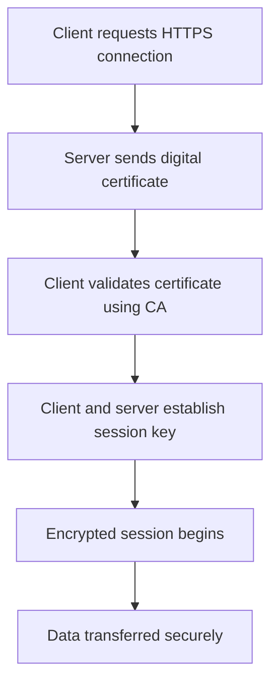

---

# 15. 10 Marks Quick Check

## Questions

1. Define plaintext and ciphertext. [2]  
2. State one difference between symmetric and asymmetric cryptography. [1]  
3. A user wants to send a private message to a company. Which key should be used to encrypt the message? [1]  
4. State two items that may be contained in a digital certificate. [2]  
5. Give one purpose of SSL/TLS. [1]  
6. Give one benefit of quantum cryptography. [1]  
7. Explain why a digital signature can show that a message has not been changed. [2]

## Answers

1. Plaintext is the original readable message/data. Ciphertext is the encrypted unreadable message/data. [2]  
2. Symmetric uses one shared key; asymmetric uses a public/private key pair. [1]  
3. The company's / receiver's public key. [1]  
4. Any two: owner's identity/domain name, public key, issuer/CA, validity period, CA digital signature. [2]  
5. To provide secure encrypted client-server communication / authenticate a server / protect data integrity. [1]  
6. Eavesdropping can be detected / very high security / based on quantum properties. [1]  
7. The sender signs a hash of the message. The receiver recalculates the hash and compares it with the decrypted signature; if they match, the message has not changed. [2]

---

# 16. 20 Marks Exam-Style Practice

## Question 1 — Asymmetric cryptography and private messages [5]

A hospital wants patients to send confidential medical information through a web portal.

Explain how asymmetric cryptography can be used so that only the hospital can read the message.

### Mark scheme

One mark per point, max 5:

+ Hospital has a public/private key pair.  
+ The public key is made available to the patient / through a certificate.  
+ The patient encrypts the plaintext using the hospital's public key.  
+ The encrypted message / ciphertext is sent to the hospital.  
+ Only the hospital can decrypt it using the hospital's private key.  
+ The private key is kept secret by the hospital.  

---

## Question 2 — Symmetric vs asymmetric cryptography [4]

Compare symmetric key cryptography and asymmetric key cryptography.

### Mark scheme

One mark per comparison, max 4:

+ Symmetric uses the same shared key for encryption and decryption, whereas asymmetric uses a public/private key pair.  
+ Symmetric is usually faster / more efficient, whereas asymmetric is slower / needs more processing.  
+ Symmetric has a key distribution problem, whereas asymmetric allows the public key to be shared openly.  
+ Symmetric requires both parties to know the shared secret key, whereas asymmetric requires the private key to be kept only by the owner.  
+ Symmetric is often used for bulk/session data, while asymmetric is often used for key exchange or digital signatures.  

---

## Question 3 — SSL/TLS [4]

A user logs in to an online banking website using HTTPS.

Explain how SSL/TLS helps protect the communication.

### Mark scheme

One mark per point, max 4:

+ SSL/TLS provides secure client-server communication.  
+ The server sends a digital certificate / proves its identity.  
+ The certificate is checked using a Certificate Authority.  
+ A session key is established.  
+ Data is encrypted during transmission.  
+ It helps maintain data integrity / detect alteration.  
+ It protects confidential data such as login or transaction details.  

---

## Question 4 — Digital certificates and signatures [4]

Explain the difference between a digital certificate and a digital signature.

### Mark scheme

One mark per point, max 4:

+ A digital certificate is an electronic document linking an entity's identity to its public key.  
+ It is issued / signed by a Certificate Authority.  
+ A digital signature is created using the sender's private key.  
+ A digital signature can verify the sender's identity.  
+ A digital signature can show that a message has not been altered.  
+ A certificate helps the receiver know which public key belongs to the sender/website.  

---

## Question 5 — Quantum cryptography [3]

State one benefit and two drawbacks of quantum cryptography.

### Mark scheme

Max 3:

Benefit, one mark:

+ Eavesdropping can be detected because measuring quantum states changes them.  
+ Very secure / based on laws of physics rather than mathematical difficulty.  

Drawbacks, one mark each:

+ Expensive specialist equipment is required.  
+ Limited distance / not yet widely practical over long distances.  
+ Technology is still developing / not widely available.  
+ High error rate / affected by transmission conditions.  

---

