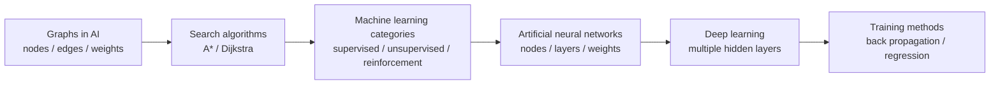
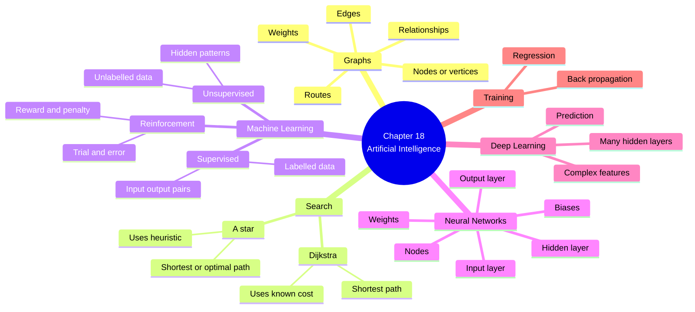
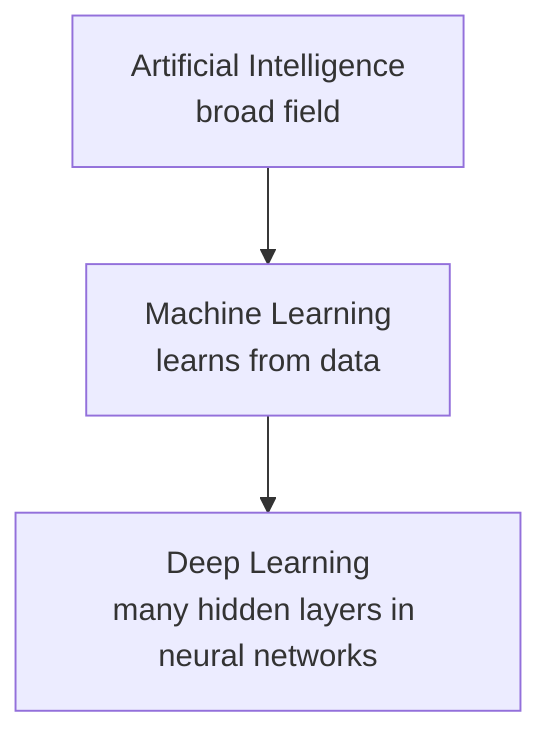
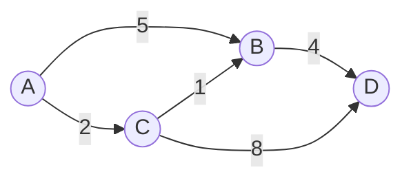
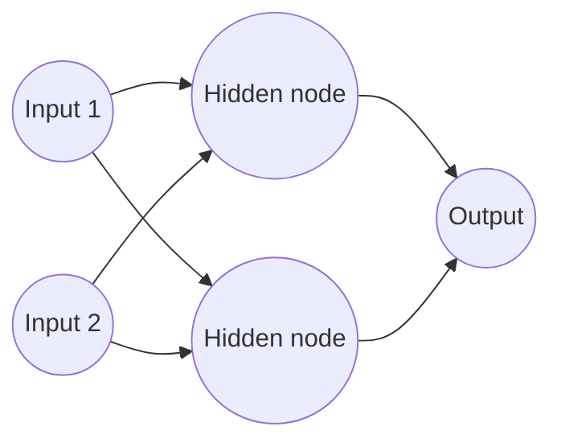
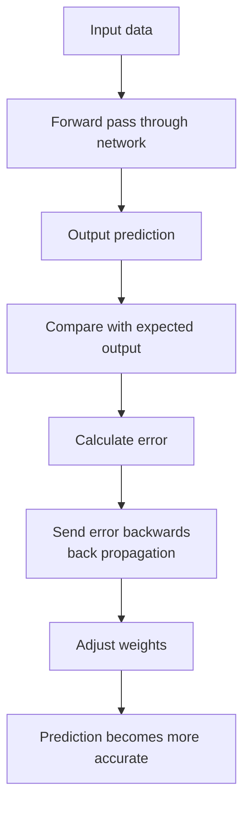
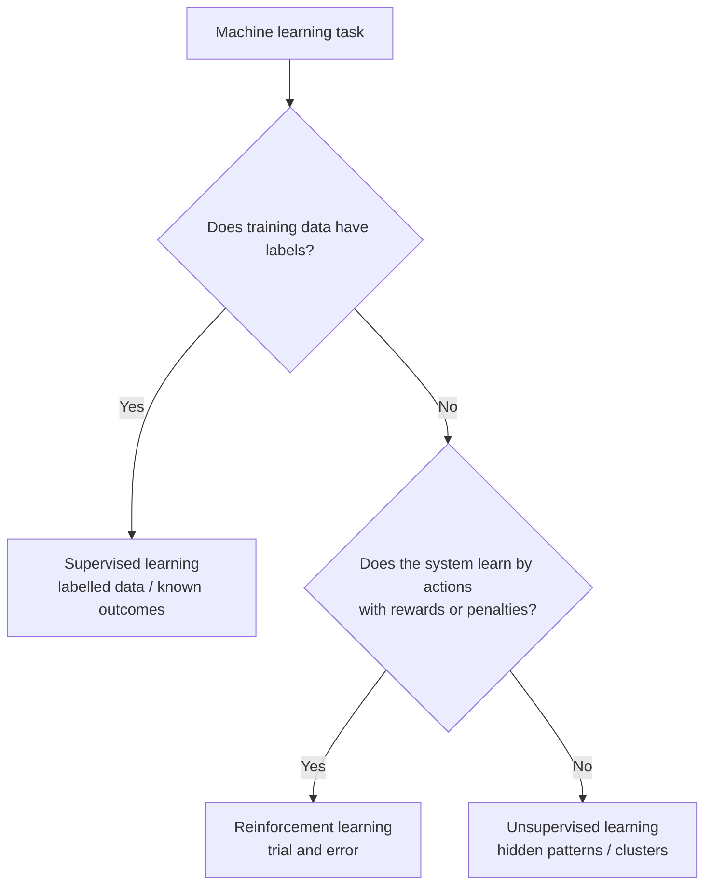
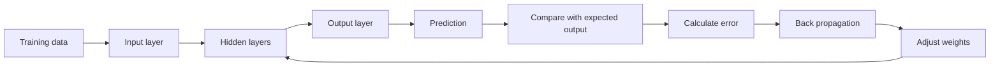
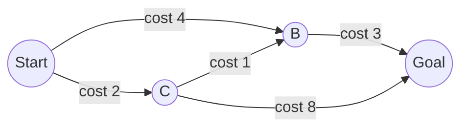

# A2 9618 Computer Science — Chapter 18 Updated Notes
## Artificial Intelligence (AI)｜Syllabus-Aligned Paper 3 Revision Sheet
> **Version:** Syllabus-aligned revision; informed by recent Paper 3 patterns  
> **Target:** Cambridge International AS & A Level Computer Science 9618 — A2  
> **Chapter:** 18 Artificial Intelligence (AI)  
> **Main audience:** Students  
> **Style:** 中文解释 + English mark scheme keywords  
> **Docsify:** ready  
>

---

# 0. How to Use This Sheet

本章是 A2 Paper 3 中比较新的章节，但近年考试已经形成明显规律：

1. **graphs in AI** 经常考定义、结构、用途  
2. **A* / Dijkstra's algorithm** 不要求写完整算法，但要会解释用途和做简单路径判断  
3. **machine learning categories** 很喜欢考 matching / describe / compare  
4. **artificial neural networks / deep learning** 要写出 mark scheme phrase  
5. **back propagation / regression** 不要求大学级数学，但要能解释训练目的  

所以复习顺序建议：



---

# 1. Recent Paper 3 Pattern Map

| Area | Recent exam pattern | What students must practise |
| --- | --- | --- |
| Graph structure | High | nodes / vertices, edges, weights, relationships between entities |
| Graph use in AI | High | maps, route finding, shortest route, cost / distance / time |
| A* and Dijkstra | Medium-high | purpose: find shortest / optimal / lowest-cost route between nodes |
| Supervised learning | High | labelled data, input-output pairs, known outcomes |
| Unsupervised learning | High | unlabelled data, hidden patterns / clusters |
| Reinforcement learning | High | trial and error, reward / penalty, interactive environment |
| Deep learning | High | multiple hidden layers, complex features, predictions |
| Artificial neural networks | High | brain-like structure, connected nodes, layers, weights adjusted during training |
| Back propagation | Medium | error is passed backwards, weights adjusted to reduce error |
| Regression | Medium | predicts continuous numeric values / finds relationship between variables |
| Over-detailed AI ethics | Low for this chapter | Useful background, but not the core 9618 Chapter 18 mark focus |
| Coding AI algorithms | Low / not required | Syllabus says students are not required to write graph search algorithms |

---

# 2. Content Update Decision

## 2.1 Keep and Strengthen

| Kept content | Reason |
| --- | --- |
| purpose and structure of graphs | Direct syllabus item and tested in 2025 |
| nodes / vertices / edges / weights | Required mark scheme keywords |
| A* and Dijkstra route-search purpose | Often tested as short-answer |
| supervised vs unsupervised comparison | Recent exam-style explain/compare question |
| reinforcement learning definition | 2024-style direct short-answer |
| deep learning definition | 2024 and 2025 high-frequency short-answer |
| artificial neural network structure | 2025 mark schemes reward nodes, layers, weights |
| back propagation of errors | Syllabus item; usually concept-based |
| regression methods | Syllabus item; likely short-answer / application-based |


## 2.2 Downweight

| Downweighted content | Why |
| --- | --- |
| detailed mathematical formulae for neural networks | Not needed for 9618 Paper 3 |
| implementation code for A* / Dijkstra | Syllabus says candidates do not need to write graph search algorithms |
| detailed calculus behind back propagation | Too advanced and unlikely to gain marks |
| many real-world AI examples without keywords | Students lose marks if examples replace definitions |
| generative AI / LLM detail | Interesting but not core 2024–2025 syllabus wording |
| ethical AI essay content | More useful as context; Chapter 18 questions focus on technical definitions and methods |


---

# 3. One-Page Mind Map



---

# 4. 18.1 Artificial Intelligence Overview

## 4.1 What is Artificial Intelligence?

### Student-friendly explanation
Artificial Intelligence means using computer systems to carry out tasks that normally need human intelligence.  
For example, recognising patterns, making decisions, finding routes, making predictions, or learning from data.

### Mark scheme style answer
> Artificial intelligence is the use of computer systems to perform tasks that normally require human intelligence, such as learning, reasoning, recognising patterns, making predictions, or making decisions.

### Must-have keywords
+ **learning**
+ **reasoning**
+ **decision-making**
+ **pattern recognition**
+ **prediction**
+ **data**

### Common weak answer
> AI means computers are smart.

This is too vague. You need to explain **what the computer does**.

---

## 4.2 AI vs Machine Learning vs Deep Learning

| Term | Meaning | Exam focus |
| --- | --- | --- |
| Artificial Intelligence | broad area where computers perform intelligent tasks | general definition |
| Machine Learning | AI system learns from data instead of being explicitly programmed for every rule | categories and training |
| Deep Learning | type of machine learning using neural networks with many hidden layers | layers, features, predictions |


### Simple relationship



### Mark scheme style phrase
> Machine learning is a subset of AI where the system improves by learning from data. Deep learning is a subset of machine learning that uses artificial neural networks with multiple hidden layers.

---

# 5. Graphs in Artificial Intelligence

## 5.1 What is a graph?

A graph is a data structure used to show relationships between items.

| Graph part | Meaning | Example |
| --- | --- | --- |
| Node / vertex | an entity / point | city, person, web page, game location |
| Edge | a connection between nodes | road, relationship, link |
| Weight | cost of moving along an edge | distance, time, cost, risk |
| Path | a sequence of connected nodes | A → B → C |
| Cycle | a path that returns to the starting node | A → B → C → A |


### Mark scheme answer
> A graph uses vertices / nodes to represent entities and edges to represent connections or relationships between them. Edges can be weighted to represent cost, distance, time, or another value.

### Must-have keywords
+ **nodes / vertices**
+ **edges**
+ **relationships**
+ **weights**
+ **cost / distance / time**

---

## 5.2 Why graphs are useful in AI

Graphs help AI represent a problem as connected possibilities.

Examples:

| Scenario | Nodes represent | Edges represent | Weight may represent |
| --- | --- | --- | --- |
| route planning | towns / cities | roads | distance / time |
| game AI | map positions | possible moves | movement cost |
| social network | people | friendships / follows | strength of connection |
| web search | webpages | hyperlinks | page importance |
| recommendation system | users / items | similarity | similarity score |


### Mark scheme style answer
> Graphs are used in AI to record relationships between entities using nodes and edges. For example, places on a map can be represented as nodes, with edges showing routes and weights showing distance or cost.

---

## 5.3 Directed and undirected graphs

| Type | Meaning | Example |
| --- | --- | --- |
| Undirected graph | edge works both ways | two-way road |
| Directed graph | edge has direction | one-way road / hyperlink |


### Exam tip
如果题目没有特别强调 directed graph，不要主动写太复杂。通常写 **nodes, edges, weights, shortest route** 已经足够。

---

## 5.4 Weighted graph

A weighted graph has values on edges.

Example:



In this graph:

+ A to B directly costs 5
+ A to C to B costs 2 + 1 = 3
+ Therefore A → C → B is cheaper than A → B

### Mark scheme phrase
> A weight on an edge can represent the cost of travelling between two nodes.

---

# 6. A* and Dijkstra's Algorithms

## 6.1 What these algorithms are used for

A* and Dijkstra's algorithm are graph search algorithms.  
They are used to find the best route through a graph.

### Mark scheme answer
> A* and Dijkstra's algorithms are used to find the shortest / optimal / lowest-cost route between two nodes in a graph, based on distance, cost, or time.

### Must-have keywords
+ **shortest route**
+ **optimal route**
+ **lowest cost**
+ **between two nodes**
+ **graph**
+ **distance / cost / time**

---

## 6.2 Dijkstra's algorithm

### Student-friendly explanation
Dijkstra looks for the shortest path from a starting node by repeatedly choosing the unvisited node with the smallest known cost so far.

### What students need to know
+ It finds the shortest path in a weighted graph.
+ It uses known edge weights.
+ It does not use a heuristic.
+ It guarantees the shortest path when edge weights are non-negative.
+ In 9618, you normally need to **use / describe purpose**, not write full code.

### Mark scheme style answer
> Dijkstra's algorithm finds the shortest path from a start node to other nodes in a weighted graph by using the known cost / distance of edges.

---

## 6.3 A* algorithm

### Student-friendly explanation
A* also finds a route, but it uses both:

1. the cost already travelled  
2. an estimated cost to the goal

This estimate is called a **heuristic**.

### What students need to know
+ It is used to find an optimal route.
+ It uses a heuristic estimate.
+ It can be faster than Dijkstra when a good heuristic is used.
+ It is common in game AI and route planning.

### Mark scheme style answer
> A* is used to find the optimal path between nodes in a graph. It uses the cost so far and a heuristic estimate of the remaining cost to guide the search.

---

## 6.4 Dijkstra vs A*

| Feature | Dijkstra | A* |
| --- | --- | --- |
| Main purpose | shortest path | shortest / optimal path |
| Uses edge weights | yes | yes |
| Uses heuristic | no | yes |
| Typical strength | guaranteed shortest path with non-negative weights | can be faster if heuristic is good |
| Exam wording | shortest / lowest-cost route | optimal route using heuristic |


### Common mistake
| Mistake | Correction |
| --- | --- |
| saying A* is only for games | It can be used for any suitable graph pathfinding problem |
| saying Dijkstra uses trial and error | It systematically selects smallest known cost |
| forgetting graph keywords | Always mention **nodes / edges / weights** |
| writing full code | Not required by syllabus |

---

# 7. Machine Learning

## 7.1 What is machine learning?

### Student-friendly explanation
Machine learning means the computer learns from data. Instead of manually programming every rule, the system finds patterns and improves its predictions or decisions.

### Mark scheme answer
> Machine learning is a component of AI where a system learns from data and improves its performance or predictions without being explicitly programmed for every rule.

### Must-have keywords
+ **learns from data**
+ **patterns**
+ **training**
+ **prediction**
+ **improves performance**
+ **not explicitly programmed for every rule**

---

## 7.2 Why use machine learning?

Machine learning is useful when:

+ rules are too complex to write manually
+ there is a lot of data
+ patterns are hidden or difficult for humans to identify
+ the system needs to improve from experience
+ predictions are needed from previous examples

### Scenario answer
> Machine learning is suitable because the system can learn patterns from large amounts of data and use these patterns to make predictions or decisions.

---

# 8. Supervised Learning

## 8.1 Definition

Supervised learning uses labelled training data.

A label is the correct answer already attached to an example.

### Example
| Input data | Label |
| --- | --- |
| email text | spam / not spam |
| house size, location | house price |
| image of animal | cat / dog |
| symptoms | disease type |


### Mark scheme answer
> Supervised learning uses labelled data, where known outcomes are applied to specific inputs so that the AI can learn to predict outcomes for new data.

### Must-have keywords
+ **labelled data**
+ **known outcomes**
+ **input-output pairs**
+ **training data**
+ **predict outcomes**

---

## 8.2 When to use supervised learning

Use supervised learning when:

+ you already have many examples with correct answers
+ the task is classification or prediction
+ the system should learn the mapping from input to output

### Example answer
> Supervised learning would be suitable because historical examples already include the correct outcome, so the model can learn from labelled input-output pairs.

---

# 9. Unsupervised Learning

## 9.1 Definition

Unsupervised learning uses unlabelled data.  
The system has to find patterns by itself.

### Example
| Input data | What AI may find |
| --- | --- |
| customer shopping history | groups of similar customers |
| website behaviour | user behaviour patterns |
| image dataset | similar image clusters |
| network traffic | unusual patterns |


### Mark scheme answer
> Unsupervised learning uses unlabelled data. The system searches for hidden patterns, structures, or clusters within the data without known outcomes.

### Must-have keywords
+ **unlabelled data**
+ **no known outcomes**
+ **hidden patterns**
+ **structures**
+ **clusters**
+ **no initial human labelling**

---

## 9.2 Supervised vs unsupervised learning

| Feature | Supervised learning | Unsupervised learning |
| --- | --- | --- |
| Data type | labelled data | unlabelled data |
| Output known during training? | yes | no |
| Human input | labels are provided | labels are not provided |
| Main purpose | predict known output | discover hidden patterns |
| Example | classify emails as spam/not spam | group customers by behaviour |


### Mark scheme style comparison
> Supervised learning uses labelled data with known outcomes, while unsupervised learning uses unlabelled data where outcomes are not known. Unsupervised learning searches for hidden patterns or clusters in the data.

---

# 10. Reinforcement Learning

## 10.1 Definition

Reinforcement learning is learning by trial and error.

The AI interacts with an environment, takes actions, and receives rewards or penalties.

### Example
| Scenario | Action | Reward / penalty |
| --- | --- | --- |
| game AI | move left/right/attack | win points / lose health |
| robot navigation | choose direction | closer to target / collision |
| self-driving simulation | accelerate / brake | safe travel / crash |
| trading bot | buy / sell | profit / loss |


### Mark scheme answer
> Reinforcement learning enables learning in an interactive environment by trial and error using rewards and penalties from its own experiences.

### Must-have keywords
+ **interactive environment**
+ **trial and error**
+ **actions**
+ **reward**
+ **penalty**
+ **experience**
+ **maximise reward**

---

## 10.2 Why use reinforcement learning?

Use reinforcement learning when:

+ the system must make a sequence of decisions
+ there is no simple labelled answer for every action
+ the AI can learn by receiving feedback
+ the best action depends on the current state
+ the goal is to maximise reward over time

### Scenario answer
> Reinforcement learning is suitable because the agent can try different actions in an environment and improve by using rewards or penalties as feedback.

---

## 10.3 Common mistake

| Mistake | Correction |
| --- | --- |
| saying reinforcement learning uses labelled examples | It learns from reward / penalty feedback, not labelled input-output pairs |
| saying it is the same as unsupervised learning | Reinforcement learning uses interaction with an environment |
| forgetting reward | Reward / penalty is the key phrase |
| writing only "trial and error" | Add **interactive environment** and **rewards / penalties** |

---

# 11. Artificial Neural Networks (ANNs)

## 11.1 What is an artificial neural network?

An artificial neural network is a computer model inspired by the human brain.  
It uses many connected processing units called nodes / neurons.

### Mark scheme answer
> An artificial neural network is designed to work in a similar way to the human brain. It has many connected processing units / nodes arranged in layers that work together to process data and learn from data.

### Must-have keywords
+ **human brain**
+ **connected processing units**
+ **nodes / neurons**
+ **layers**
+ **weights**
+ **learn from data**
+ **process data**

---

## 11.2 Structure of an ANN



| Layer | Purpose |
| --- | --- |
| Input layer | receives input data |
| Hidden layer | processes data and extracts features |
| Output layer | gives prediction / classification |


### Mark scheme phrase
> Artificial neural networks have input, hidden and output layers, with nodes connected by weighted links.

---

## 11.3 Weights and biases

Each connection can have a **weight**.  
The weight controls how strongly one node affects another node.

During training:

+ the network makes a prediction
+ the prediction is compared with the correct output
+ an error is calculated
+ weights are adjusted
+ the model becomes more accurate

### Mark scheme phrase
> Weights are adjusted through training to reduce error and give a more accurate result.

---

# 12. Deep Learning

## 12.1 Definition

Deep learning is a type of machine learning that uses artificial neural networks with many hidden layers.

### Mark scheme answer
> Deep learning uses artificial neural networks with multiple hidden layers to extract complex features from data and make predictions or decisions.

### Must-have keywords
+ **artificial neural network**
+ **multiple hidden layers**
+ **complex features**
+ **learn from data**
+ **predictions**
+ **large amounts of data**

---

## 12.2 Why deep learning is useful

Deep learning is useful when:

+ the problem is complex
+ there is a large amount of data
+ useful features are difficult for humans to define manually
+ the system needs to identify hidden patterns
+ tasks involve images, speech, language, or complex prediction

### Example
| Task | Why deep learning helps |
| --- | --- |
| image recognition | detects complex visual features |
| speech recognition | finds patterns in audio signals |
| medical scan analysis | detects subtle image patterns |
| natural language processing | identifies meaning and relationships in text |


### Mark scheme style answer
> Deep learning is useful because multiple hidden layers allow the model to extract complex features from large amounts of data and make more accurate predictions.

---

## 12.3 Deep learning vs normal machine learning

| Feature | Machine learning | Deep learning |
| --- | --- | --- |
| Broadness | wider category | subset of machine learning |
| Model | many possible models | neural networks with many layers |
| Feature extraction | may need human-designed features | can learn features automatically |
| Data need | can work with smaller datasets | usually needs large datasets |
| Processing | often less demanding | usually more processing power |


---

# 13. Back Propagation of Errors

## 13.1 What is back propagation?

Back propagation is a training method used in neural networks.

The network:

1. makes an output prediction  
2. compares the prediction with the expected output  
3. calculates the error  
4. sends the error backwards through the network  
5. adjusts weights to reduce future error  

### Mermaid process



### Mark scheme answer
> Back propagation is where the error between the predicted output and expected output is passed backwards through the network so that weights can be adjusted to reduce the error.

### Must-have keywords
+ **predicted output**
+ **expected output**
+ **error**
+ **passed backwards**
+ **adjust weights**
+ **reduce error**
+ **training**

---

## 13.2 Common mistake

| Mistake | Correction |
| --- | --- |
| saying "it sends data backwards" | It sends **error information** backwards |
| saying "it fixes the answer" | It adjusts weights to reduce future error |
| giving calculus explanation | Not needed for 9618 |
| missing weights | Weight adjustment is central |

---

# 14. Regression Methods in Machine Learning

## 14.1 What is regression?

Regression is used to predict a continuous numeric value.

### Examples
| Data | Predicted value |
| --- | --- |
| house size, location | house price |
| hours studied | exam score |
| temperature, humidity | energy demand |
| previous sales | future sales |


### Mark scheme style answer
> Regression is a machine learning method used to model the relationship between variables and predict a continuous numerical value.

### Must-have keywords
+ **relationship between variables**
+ **predict**
+ **continuous value**
+ **numeric output**
+ **trend / pattern**

---

## 14.2 Classification vs regression

| Feature | Classification | Regression |
| --- | --- | --- |
| Output type | category / class | continuous number |
| Example output | spam / not spam | price = 250000 |
| Question type | "Which class?" | "How much / how many?" |
| Example | disease type | blood pressure value |


### Exam tip
如果题目是预测 **price, score, temperature, distance, time, demand**，通常是 regression。  
如果题目是预测 **cat/dog, spam/not spam, pass/fail**，通常是 classification。

---

# 15. Mark Scheme Keywords

## 15.1 Graphs in AI
+ **nodes / vertices**
+ **edges**
+ **relationships**
+ **weighted edges**
+ **cost / distance / time**
+ **shortest route**
+ **optimal path**

## 15.2 A* and Dijkstra
+ **shortest path**
+ **lowest-cost path**
+ **between two nodes**
+ **weighted graph**
+ **heuristic** for A*
+ **known edge costs** for Dijkstra

## 15.3 Supervised learning
+ **labelled data**
+ **known outcomes**
+ **input-output pairs**
+ **training data**
+ **predict outcomes**

## 15.4 Unsupervised learning
+ **unlabelled data**
+ **unknown outcomes**
+ **hidden patterns**
+ **clusters**
+ **structures in data**

## 15.5 Reinforcement learning
+ **trial and error**
+ **interactive environment**
+ **agent**
+ **actions**
+ **reward**
+ **penalty**
+ **learns from experience**

## 15.6 Artificial neural networks
+ **human brain**
+ **connected processing units**
+ **nodes / neurons**
+ **input layer**
+ **hidden layers**
+ **output layer**
+ **weights**
+ **biases**
+ **training**

## 15.7 Deep learning
+ **multiple hidden layers**
+ **extract complex features**
+ **large amounts of data**
+ **make predictions**
+ **adjust weights**

## 15.8 Back propagation
+ **error**
+ **predicted output**
+ **expected output**
+ **passed backwards**
+ **adjust weights**
+ **reduce error**

## 15.9 Regression
+ **relationship between variables**
+ **continuous numerical value**
+ **prediction**
+ **trend**
+ **model**

---

# 16. Common Mistakes 易错表

| Mistake | Why it loses marks | Better answer |
| --- | --- | --- |
| AI = robot | Too narrow | AI performs tasks requiring human intelligence |
| graph = chart | Wrong meaning in CS | graph = nodes and edges |
| edge = node | Confuses graph structure | node = entity, edge = connection |
| A* and Dijkstra are sorting algorithms | Wrong topic | They find shortest / optimal routes in graphs |
| supervised learning = someone gives the computer answers | Too vague | supervised learning uses labelled data |
| unsupervised learning = no training | Wrong | it uses unlabelled data and finds hidden patterns |
| reinforcement learning = repeating practice | Too vague | trial and error with rewards/penalties |
| deep learning = AI learns deeply | Not technical | neural network with multiple hidden layers |
| ANN = normal program | Wrong | connected nodes arranged in layers, weights adjusted |
| back propagation = data goes backward | Incomplete | error is passed backward to adjust weights |
| regression = going backwards | Wrong English interpretation | predicts continuous numeric values |

---

# 17. Scenario Answer Bank

## 17.1 Route-finding AI
### Scenario
A delivery company wants to find the fastest route between warehouses.

### Answer template
> A graph can be used because the warehouses can be represented as nodes and roads can be represented as edges. The edges can be weighted using distance or travel time. A* or Dijkstra's algorithm can then be used to find the shortest / lowest-cost route between two nodes.

---

## 17.2 Game character movement
### Scenario
A game enemy needs to move from its current position to the player.

### Answer template
> The map can be represented as a graph, with positions as nodes and possible movements as edges. Weights can represent distance or movement cost. A* is suitable because it can use a heuristic estimate of the remaining distance to guide the search towards the target.

---

## 17.3 Email spam detection
### Scenario
A company has thousands of emails already labelled as spam or not spam.

### Answer template
> Supervised learning is suitable because the training data is labelled with known outcomes. The model can learn the relationship between email features and the correct label, then predict whether new emails are spam.

---

## 17.4 Customer grouping
### Scenario
A shop has customer purchase data but no pre-defined customer categories.

### Answer template
> Unsupervised learning is suitable because the data is unlabelled. The AI can search for hidden patterns or clusters in the customer behaviour and group similar customers together.

---

## 17.5 Robot learning to navigate
### Scenario
A robot learns to move through a maze.

### Answer template
> Reinforcement learning is suitable because the robot can learn by trial and error in an interactive environment. It receives rewards for moving closer to the goal and penalties for hitting walls or taking inefficient routes.

---

## 17.6 Predicting house prices
### Scenario
A model predicts a house price from size, location and number of bedrooms.

### Answer template
> Regression is suitable because the output is a continuous numerical value. The model can learn the relationship between input variables and house price from training data.

---

## 17.7 Medical image recognition
### Scenario
A system analyses medical scans to detect signs of disease.

### Answer template
> Deep learning is suitable because artificial neural networks with multiple hidden layers can extract complex features from image data. The model can learn patterns that may be difficult for humans to define manually.

---

# 18. Mermaid Process Diagrams

## 18.1 Machine learning category decision



## 18.2 ANN training process



## 18.3 Graph search idea



Best path by cost:

```text
A → C → B → D = 2 + 1 + 3 = 6
A → B → D = 4 + 3 = 7
A → C → D = 2 + 8 = 10
```

---

# 19. 10 Marks Quick Check

## Questions
1. State two components of a graph. [2]  
2. State what a weight on an edge may represent. [1]  
3. State the purpose of Dijkstra's algorithm. [1]  
4. Give one difference between supervised and unsupervised learning. [2]  
5. State what reinforcement learning uses to improve behaviour. [1]  
6. State the three main layers of an artificial neural network. [3]

## Answers
1. Nodes / vertices [1], edges [1]  
2. Cost / distance / time / risk [1]  
3. To find the shortest / lowest-cost path between nodes in a graph [1]  
4. Supervised learning uses labelled data / known outcomes [1], unsupervised learning uses unlabelled data / finds hidden patterns [1]  
5. Rewards and penalties / trial and error feedback [1]  
6. Input layer [1], hidden layer(s) [1], output layer [1]

---

# 20. 20 Marks Exam-Style Practice

## Question 1: Graphs and route searching [6]
A delivery company uses an AI system to find routes between towns.

(a) Explain how a graph can represent the towns and roads. [3]  
(b) State the purpose of A* and Dijkstra's algorithms. [2]  
(c) State one reason why a weighted graph is useful in this scenario. [1]

### Mark scheme
(a)
+ towns represented as nodes / vertices [1]  
+ roads represented as edges [1]  
+ weights can represent distance / time / cost [1]  

(b)
+ to find the shortest / optimal / lowest-cost route [1]  
+ between two nodes in a graph [1]  

(c)
+ allows AI to compare possible routes by distance / time / cost [1]  

---

## Question 2: Machine learning categories [6]
A website wants to recommend products to users. It has a large amount of shopping data but no pre-defined customer categories.

(a) Identify the most suitable machine learning category. [1]  
(b) Explain your answer. [3]  
(c) Explain why supervised learning may not be suitable. [2]

### Mark scheme
(a) Unsupervised learning [1]

(b)
+ data is unlabelled / categories are not already known [1]  
+ system can find hidden patterns / structures [1]  
+ customers can be grouped into clusters based on behaviour [1]  

(c)
+ supervised learning needs labelled data / known outcomes [1]  
+ there are no pre-defined correct customer categories / labels [1]  

---

## Question 3: Neural networks and deep learning [8]
A hospital uses an AI system to analyse medical images.

(a) Describe the structure of an artificial neural network. [3]  
(b) Explain what is meant by deep learning. [3]  
(c) Explain how back propagation helps the model improve. [2]

### Mark scheme
(a)
+ has connected processing units / nodes / neurons [1]  
+ arranged in layers: input, hidden and output [1]  
+ connections have weights / weights affect output [1]  

(b)
+ uses artificial neural networks [1]  
+ with multiple hidden layers [1]  
+ to extract complex features / make predictions from data [1]  

(c)
+ error between predicted and expected output is calculated and passed backwards [1]  
+ weights are adjusted to reduce future error / improve accuracy [1]  

---
