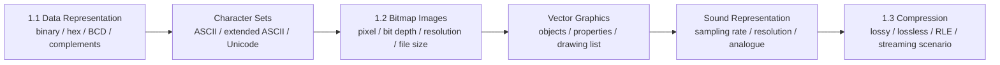
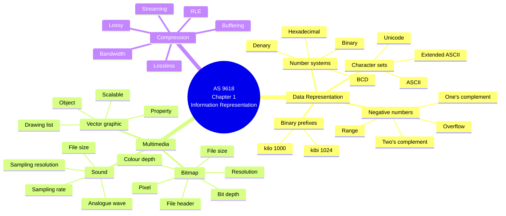
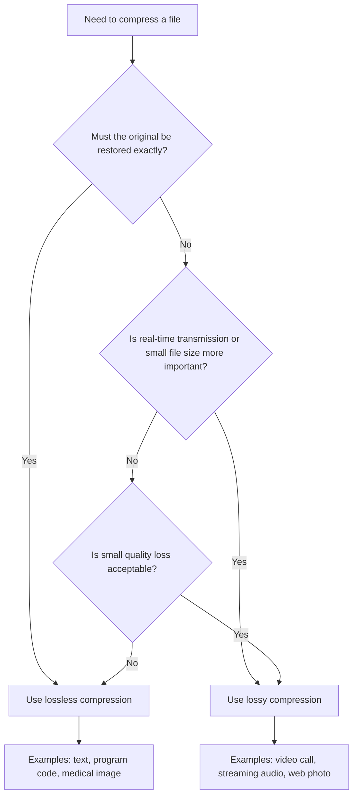
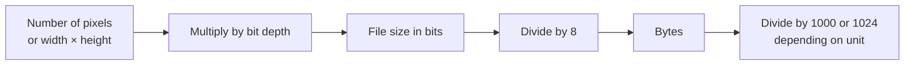
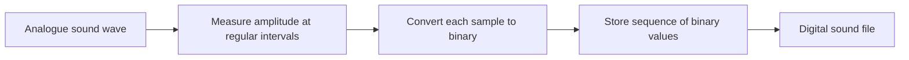

# AS 9618 Computer Science — Chapter 1 Updated Notes
## Information Representation｜Syllabus-Aligned Paper 1 Revision Sheet

> **Version:** Syllabus-aligned revision; informed by recent Paper 1 patterns  
> **Target:** Cambridge International AS & A Level Computer Science 9618  
> **Chapter:** 1 Information representation  
> **Main audience:** Students  
> **Style:** 中文解释 + English keywords / mark scheme style phrases  
> **Docsify:** ready for static webpage display  
> **File:** `chapter-1.md`

---

# 0. How to Use This Sheet

AS 9618 Chapter 1 比 IGCSE Chapter 1 更深一点。它不是只考“binary / image / sound / compression”的基础定义，而是更喜欢把这些内容放进 **calculation + exact terminology + scenario explanation** 里面。

2024 和 2025 的 Paper 1 趋势很明显：

1. **number systems conversion** 仍然高频，但更常见 12-bit / two's complement / BCD / Unicode code conversion  
2. **bitmap / bit depth / colour depth / file size** 是高频计算和解释题  
3. **Unicode / ASCII / extended ASCII** 会考特点、优点和转换  
4. **sound representation** 重点是 sampling rate / sampling resolution / analogue wave  
5. **compression** 不只考定义，还会考 real-time bit streaming / lossy vs lossless choice  
6. **vector graphics** 仍要掌握 property / drawing list / scalability，但 2024–2025 中比 bitmap 稍低频

建议复习顺序：



---

# 1. Recent Paper 1 Pattern Map

| Area | Recent exam pattern | What students must practise |
| --- | --- | --- |
| Binary prefixes vs decimal prefixes | High | kibi/kilo, mebi/mega, gibi/giga, tebi/tera; 1024 vs 1000 |
| Binary ↔ denary ↔ hexadecimal | Very high | 8-bit and 12-bit conversion, hex grouping into nibbles |
| Two's complement | Very high | binary to denary, smallest/largest 8-bit values, subtraction by adding two's complement |
| BCD | High | BCD to denary, applications such as financial calculations, date/time, displays, barcode systems |
| Character sets | High | ASCII, extended ASCII, Unicode, bits per character, languages/symbols/emojis |
| Bitmap image | Very high | pixel, bit depth, colour depth, screen resolution / dpi, file size calculation |
| Effect of lowering bit depth | Very high in 2025 | fewer colours/shades, less detail, smaller file size |
| Sound representation | High in 2025 | sampling rate, sampling resolution, analogue wave, effect on quality/file size |
| Vector graphics | Medium | drawing list, property, scalable without quality loss |
| Compression | Very high | why compress, lossy vs lossless, RLE, streaming scenario justification |
| Detailed compression algorithms | Low-medium | know principles; avoid over-learning MP3/JPEG internal detail unless needed for scenario |

---

# 2. Content Update Decision

## 2.1 Keep and Strengthen

| Kept / strengthened content | Reason |
| --- | --- |
| binary and decimal prefixes | 2024 directly tested tebibyte / gigabyte and binary vs decimal prefix |
| binary, denary, hexadecimal conversion | 2025 tested 558 to 12-bit binary and hexadecimal; Unicode/ASCII code conversion also relies on this |
| two's complement | 2024 and 2025 both tested two's complement conversion / range |
| BCD | 2024 tested BCD conversion; 2025 tested BCD application and justification |
| ASCII / extended ASCII / Unicode | 2025 tested Unicode characteristics and extended ASCII conversion table |
| bitmap file size | 2024 and 2025 both tested image file size calculation |
| bit depth / colour depth | 2025 tested effect of decreasing bit depth on image and file |
| sound terms | 2025 directly tested sampling rate, sampling resolution and analogue wave |
| compression scenarios | 2025 tested video compression for real-time bit streaming and lossy/lossless choice |
| mark scheme phrases | Paper 1 awards marks for precise phrases such as “fewer bits per pixel”, “less bandwidth”, “original can be restored” |

## 2.2 Downweight

| Downweighted content | Why |
| --- | --- |
| long history of ASCII / Unicode | Exams reward features and differences, not history |
| very detailed memory dump explanation | Syllabus includes hex uses, but recent questions focus more on conversion and representation |
| advanced JPEG / MP3 algorithm detail | Useful background, but Paper 1 usually rewards simple lossy / lossless reasoning |
| memorising every storage unit beyond TiB | Keep to kilo/kibi, mega/mebi, giga/gibi, tera/tebi |
| excessive vector drawing syntax | Students need concept: objects, properties, drawing list, scaling |
| overlong sound physics | Only need analogue wave, amplitude sampling, sample rate/resolution |

## 2.3 Delete / Avoid

| Avoid learning as exam fact | Better version |
| --- | --- |
| “Unicode is always 16-bit” | Unicode may use more bits than ASCII; syllabus examples often use 16/32 bits |
| “compression always improves quality” | Compression reduces file size; lossy may reduce quality |
| “RLE always makes files smaller” | RLE works well when there are long runs of repeated data; it can increase file size otherwise |
| “right shift always divides exactly” | Bits shifted out are lost; result may be rounded down |
| “overflow just means there is a carry” | Overflow means the result is outside the range that can be represented using the available bits |

---

# 3. One-Page Mind Map



---

# 4. 1.1 Data Representation

## 4.1 Binary prefixes vs decimal prefixes

### Core idea

计算机中有两套常见单位：

| Type | Example | Meaning | Used for |
| --- | --- | ---: | --- |
| Decimal prefix | KB, MB, GB, TB | powers of 1000 | storage devices, file size in many exam calculations |
| Binary prefix | KiB, MiB, GiB, TiB | powers of 1024 | memory / RAM / exact binary measurement |

### Must-know table

| Unit | Value |
| --- | ---: |
| 1 kilobyte / KB | 1000 bytes |
| 1 kibibyte / KiB | 1024 bytes |
| 1 megabyte / MB | 1000 KB = 1 000 000 bytes |
| 1 mebibyte / MiB | 1024 KiB = 1 048 576 bytes |
| 1 gigabyte / GB | 1000 MB |
| 1 gibibyte / GiB | 1024 MiB |
| 1 terabyte / TB | 1000 GB |
| 1 tebibyte / TiB | 1024 GiB |

### Mark scheme style phrase

> A binary prefix uses powers of 2 / 1024, while a decimal prefix uses powers of 10 / 1000.

### Common mistake

| Mistake | Correction |
| --- | --- |
| saying 1 KB = 1024 bytes | In Cambridge wording, **KiB = 1024**, **KB = 1000** |
| mixing MB and MiB in calculation | Use the unit given in the question |
| writing “bigger” without numbers | Say 1024 vs 1000 |

---

## 4.2 Number systems

| Number system | Base | Digits used | Key exam point |
| --- | ---: | --- | --- |
| Binary | 2 | 0, 1 | used by computer systems |
| Denary / decimal | 10 | 0–9 | normal human number system |
| Hexadecimal | 16 | 0–9, A–F | compact representation of binary |
| BCD | digit-based | 4 bits per denary digit | useful for exact decimal digits |

### Hex table

| Denary | Binary | Hex | Denary | Binary | Hex |
| ---: | --- | --- | ---: | --- | --- |
| 0 | 0000 | 0 | 8 | 1000 | 8 |
| 1 | 0001 | 1 | 9 | 1001 | 9 |
| 2 | 0010 | 2 | 10 | 1010 | A |
| 3 | 0011 | 3 | 11 | 1011 | B |
| 4 | 0100 | 4 | 12 | 1100 | C |
| 5 | 0101 | 5 | 13 | 1101 | D |
| 6 | 0110 | 6 | 14 | 1110 | E |
| 7 | 0111 | 7 | 15 | 1111 | F |

---

## 4.3 Binary ↔ denary

### Binary to denary example

Convert `10010110` to denary.

```text
128 64 32 16 8 4 2 1
 1   0  0  1 0 1 1 0

= 128 + 16 + 4 + 2
= 150
```

### Denary to binary example

Convert 558 to 12-bit binary.

```text
558 = 512 + 32 + 8 + 4 + 2

2048 1024 512 256 128 64 32 16 8 4 2 1
  0    0   1   0   0  0  1  0 1 1 1 0

Answer = 0010 0010 1110
```

### Recent exam-style note

AS Paper 1 may ask for **12-bit binary**, not only 8-bit. Always count the required number of bits.

---

## 4.4 Binary ↔ hexadecimal

### Binary to hexadecimal

Convert `110001100111` to hexadecimal.

```text
Split into nibbles:
1100 0110 0111

1100 = C
0110 = 6
0111 = 7

Answer = C67
```

### Hexadecimal to binary

Convert `22E` to binary.

```text
2 = 0010
2 = 0010
E = 1110

Answer = 0010 0010 1110
```

### Hexadecimal to denary

Convert `2140` to denary.

```text
2 × 16^3 + 1 × 16^2 + 4 × 16^1 + 0
= 8192 + 256 + 64
= 8512
```

### Common mistake

| Mistake | Correction |
| --- | --- |
| not grouping binary into 4-bit nibbles | Hex conversion must use groups of 4 bits |
| forgetting leading zeros | One hex digit = exactly 4 bits |
| treating A–F as letters only | A=10, B=11, C=12, D=13, E=14, F=15 |

---

## 4.5 One's complement and two's complement

### One's complement

One's complement reverses every bit.

```text
01011010
becomes
10100101
```

For AS 9618, understand it, but **two's complement is more exam-heavy**.

---

## 4.6 Two's complement

### 8-bit range

| Representation | Range |
| --- | --- |
| 8-bit unsigned | 0 to 255 |
| 8-bit two's complement | -128 to +127 |

### Two's complement column values

```text
-128 64 32 16 8 4 2 1
```

### Binary to denary example

Convert `11100010` to denary.

```text
-128 64 32 16 8 4 2 1
  1   1  1  0 0 0 1 0

= -128 + 64 + 32 + 2
= -30
```

### Smallest and largest 8-bit two's complement

```text
Smallest = 1000 0000 = -128
Largest  = 0111 1111 = +127
```

### Denary negative to two's complement

Convert -23 to 8-bit two's complement.

Step 1: write +23.

```text
00010111
```

Step 2: invert bits.

```text
11101000
```

Step 3: add 1.

```text
11101001
```

So:

```text
-23 = 11101001
```

---

## 4.7 Binary subtraction using two's complement

Example: subtract denary 23 from `01001010`.

`01001010` = 74.

Need:

```text
74 - 23
```

Write -23 in two's complement:

```text
+23 = 00010111
invert = 11101000
add 1 = 11101001
```

Add:

```text
  01001010
+ 11101001
=1 00110011
```

Ignore the 9th carry bit:

```text
00110011 = 51
```

### Mark scheme style phrase

> Convert the number being subtracted into its two's complement, then add it to the first binary number. Ignore any carry beyond the fixed number of bits if the result is within range.

---

## 4.8 Overflow

### Definition

> Overflow occurs when the result of a calculation is too large or too small to be represented using the available number of bits.

### Important distinction

| Weak answer | Better answer |
| --- | --- |
| overflow happens because there is a carry | overflow happens because the result is outside the representable range |
| answer is too big | answer is too long to be represented in the same number of bits |
| 8-bit result has a 9th bit | good for unsigned, but also mention available bits / range |

### For two's complement

Overflow can occur when:

+ adding two positive numbers gives a negative result
+ adding two negative numbers gives a positive result
+ result is outside -128 to +127 for 8-bit two's complement

---

## 4.9 Binary Coded Decimal (BCD)

### What BCD does

BCD stores each denary digit separately using 4 bits.

Example:

```text
573

5 = 0101
7 = 0111
3 = 0011

BCD = 0101 0111 0011
```

### BCD to denary example

```text
0101 0111 0011
= 5 7 3
= 573
```

### BCD is not normal binary

| Representation | Meaning |
| --- | --- |
| `0101 0111 0011` as BCD | 573 |
| `010101110011` as binary | 1395 |

### BCD applications

| Application | Why BCD is suitable |
| --- | --- |
| financial / banking calculations | exact decimal values, avoids accumulating rounding errors |
| electronic display | each denary digit can be displayed separately |
| date/time in BIOS | straightforward conversion to displayed decimal digits |
| barcode systems | decimal digits can be represented accurately |

### Mark scheme style phrase

> BCD is used where exact decimal digits are needed, because normal binary may not represent decimal fractions exactly and this could cause rounding errors.

---

## 4.10 Character sets

### Character set definition

> A character set is a set/list of characters and the binary codes used to represent them.

### How text is stored

> Each character has a unique binary code, and the codes are stored in sequence.

---

## 4.11 ASCII, extended ASCII and Unicode

| Character set | Typical bits | Key point |
| --- | ---: | --- |
| ASCII | 7 bits | 128 characters |
| Extended ASCII | 8 bits | 256 characters |
| Unicode | often 16 or 32 bits in syllabus examples | much wider range of languages and symbols |

### Unicode advantages over ASCII

+ wider range of characters
+ more languages can be represented
+ symbols / emojis can be represented
+ suitable for global systems

### Mark scheme style phrase

> Unicode can represent a wider range of characters, including more languages and symbols such as emojis.

### Unicode drawback

+ may use more bits per character
+ file size may be larger

---

## 4.12 Character code conversion

### Binary Unicode to denary

Convert:

```text
0010 0111 0110 1110
```

```text
= 8192 + 1024 + 512 + 256 + 64 + 32 + 8 + 4 + 2
= 10094
```

### Extended ASCII conversion example

| Character | Denary | 8-bit Binary | Hex |
| --- | ---: | --- | --- |
| ! | 33 | 0010 0001 | 21 |
| L | 76 | 0100 1100 | 4C |
| ü | 252 | 1111 1100 | FC |

---

# 5. 1.2 Multimedia — Bitmap Images

## 5.1 Bitmap image keywords

| Term | Meaning |
| --- | --- |
| Bitmap image | image made from pixels |
| Pixel | smallest element / dot / square of an image |
| Image resolution | number of pixels in the image |
| Screen resolution | number of pixels displayed on a screen / dots per inch in display context |
| Colour depth / bit depth | number of bits used to store the colour of one pixel |
| File header | metadata about the image file |
| Pixel density | number of pixels per unit area, such as ppi or dpi |

---

## 5.2 Bit depth / colour depth

### Formula

```text
Number of colours = 2 ^ bit depth
```

Examples:

| Bit depth | Number of colours |
| ---: | ---: |
| 1 bit | 2 |
| 4 bits | 16 |
| 8 bits | 256 |
| 16 bits | 65 536 |
| 24 bits | 16 777 216 |

### Recent exam-style answer: effect of decreasing bit depth

| Effect on image | Effect on file |
| --- | --- |
| fewer colours / shades available | fewer bits used to store each pixel |
| image may not match original as well | less data stored |
| detail may be lost | file size is reduced |

### Mark scheme style phrase

> Decreasing bit depth means fewer bits are used to store each pixel, so fewer colours or shades can be represented and the file size is reduced.

---

## 5.3 Image file size calculation

### Formula

```text
Image file size in bits = number of pixels × bit depth
```

or

```text
Image file size in bits = width × height × bit depth
```

Convert:

```text
bytes = bits / 8
KB or MB = divide by 1000
KiB or MiB = divide by 1024
```

### Recent exam-style example

A camera creates an image with **2 million pixels** and **16-bit depth**. Calculate the file size in MB.

```text
2 000 000 × 16 = 32 000 000 bits
32 000 000 / 8 = 4 000 000 bytes
4 000 000 / 1 000 000 = 4 MB
```

### 2024-style example

An image has 4000 × 3000 pixels and 4 bits per pixel.

```text
4000 × 3000 × 4 = 48 000 000 bits
48 000 000 / 8 = 6 000 000 bytes
= 6 MB
```

> 注意：如果题目或 mark scheme 用 MB，通常按 decimal 1 MB = 1 000 000 bytes。题目写 MiB 才用 1024。

---

## 5.4 File header

A bitmap file header may store:

+ file type
+ file size
+ image dimensions / resolution
+ bit depth / colour depth
+ compression type
+ location / offset of image data

### Mark scheme phrase

> The file header stores metadata about the image, such as file type, file size, resolution, bit depth and compression method.

---

# 6. Vector Graphics

## 6.1 Vector graphic idea

Vector graphics do not store every pixel. They store objects / shapes mathematically.

Examples of objects:

+ line
+ rectangle
+ circle
+ ellipse
+ polygon
+ text object

## 6.2 Property

> A property is an attribute of a vector object, such as position, line colour, fill colour, line thickness, radius or coordinates.

## 6.3 Drawing list

> A drawing list stores the objects / commands needed to draw the image and the properties of each object.

### Example drawing list

```text
CIRCLE centre(50,50), radius 20, fill red
LINE from(10,10) to(90,10), thickness 2
RECTANGLE top-left(20,20), width 40, height 30
```

## 6.4 Vector vs bitmap

| Feature | Bitmap | Vector |
| --- | --- | --- |
| Made from | pixels | objects / shapes |
| File stores | colour of each pixel | drawing list + properties |
| Best for | photographs | logos, diagrams, maps |
| Scaling | may become pixelated | can scale without loss of quality |
| Editing | edit pixels | edit objects/properties |
| File size | can be large for high resolution | often smaller for simple diagrams |

### Scenario answer

> A vector graphic is suitable for a logo because it can be resized without loss of quality, and the image is stored as objects with properties rather than as individual pixels.

---

# 7. Sound Representation

## 7.1 Analogue sound

Sound is naturally analogue. This means it changes continuously.

A computer must convert it into digital data by sampling.

## 7.2 Sampling

### Mark scheme style answer

> The amplitude of the sound wave is measured at regular time intervals. Each sample is converted into a binary value.

## 7.3 Key terms

| Term | Meaning |
| --- | --- |
| Sampling rate | number of times the amplitude is measured per time interval / per second |
| Sampling resolution / bit depth | number of bits used to store each amplitude measurement |
| Analogue | continuously changing sound wave before being recorded by a computer |

## 7.4 Effect of increasing sample rate / resolution

| Increase in... | Effect on sound | Effect on file |
| --- | --- | --- |
| sampling rate | more measurements per second, more accurate digital copy | larger file size |
| sampling resolution | amplitude stored with more precision | larger file size |

### Sound file size formula

```text
Sound file size in bits =
sample rate × sampling resolution × duration × number of channels
```

### Example

A 30-second stereo sound has sample rate 44 100 Hz and sampling resolution 16 bits.

```text
44 100 × 16 × 30 × 2 = 42 336 000 bits
42 336 000 / 8 = 5 292 000 bytes
```

---

# 8. 1.3 Compression

## 8.1 Why compression is needed

Compression reduces file size.

Benefits:

+ less storage space needed
+ less bandwidth needed
+ faster upload / download / transmission
+ less buffering in streaming
+ lower data allowance used

### Mark scheme style phrase

> Compression reduces the file size so less bandwidth is needed and the file can be transmitted faster.

---

## 8.2 Lossy compression

### Definition

> Lossy compression reduces file size by permanently removing some data, so the original file cannot be fully reconstructed.

### Suitable for

+ video streaming
+ music streaming
+ web photos
+ situations where small loss of quality is acceptable

### 2025 real-time streaming justification

For real-time video conferences, lossy compression is usually more appropriate because:

+ it reduces file size more than lossless
+ less bandwidth / data is needed
+ buffering is reduced
+ the video can stay closer to real time
+ some removed data may not be noticed by the user
+ resolution / audio sample rate can be reduced without destroying the communication

---

## 8.3 Lossless compression

### Definition

> Lossless compression reduces file size without permanently removing data, so the original file can be restored exactly.

### Suitable for

+ text files
+ program code
+ spreadsheets
+ legal / medical / scientific data
+ images where exact detail must not be lost

### Mark scheme phrase

> The original file can be reconstructed exactly.

---

## 8.4 Run-length encoding (RLE)

### What RLE does

> RLE stores a run of repeated adjacent data as the value and the number of times it occurs.

Example:

```text
Original:
AAAAA BBB CC

RLE:
5A 3B 2C
```

For bitmap images:

```text
red red red red blue blue
becomes
4 red, 2 blue
```

### When RLE works well

+ long runs of repeated values
+ simple graphics
+ flat-colour bitmap images

### When RLE works badly

+ photographs
+ noisy images
+ text with few repeated characters
+ alternating patterns like `ABABABAB`

### Common exam warning

> RLE can increase file size if there are few repeated adjacent values, because count information also has to be stored.

---

# 9. Mark Scheme Keywords

## 9.1 Data representation

+ **binary prefix**
+ **decimal prefix**
+ **powers of 2 / powers of 10**
+ **1024 / 1000**
+ **base 2 / base 10 / base 16**
+ **nibble**
+ **4 bits**
+ **two's complement**
+ **representable range**
+ **overflow**
+ **BCD**
+ **exact decimal digits**
+ **rounding errors**

## 9.2 Character sets

+ **character set**
+ **unique binary code**
+ **stored in sequence**
+ **ASCII**
+ **extended ASCII**
+ **Unicode**
+ **wider range of characters**
+ **more languages**
+ **symbols / emojis**
+ **more bits per character**

## 9.3 Bitmap / vector / sound

+ **pixel**
+ **bit depth**
+ **colour depth**
+ **resolution**
+ **screen resolution**
+ **file header**
+ **metadata**
+ **drawing list**
+ **property**
+ **object**
+ **sampling rate**
+ **sampling resolution**
+ **analogue**
+ **amplitude**

## 9.4 Compression

+ **reduces file size**
+ **less storage**
+ **less bandwidth**
+ **faster transmission**
+ **less buffering**
+ **lossy**
+ **permanently removing data**
+ **lossless**
+ **original restored exactly**
+ **run-length encoding**
+ **repeated adjacent data**
+ **value and count**

---

# 10. Common Mistakes 易错表

| Mistake | Why it loses marks | Correct version |
| --- | --- | --- |
| using 1024 for MB when question says MB | MB is decimal unless question says MiB | MB = 1 000 000 bytes |
| writing `110101` when 8-bit asked | not enough bits | write `00110101` |
| treating two's complement as unsigned | negative values wrong | use `-128 64 32 16 8 4 2 1` |
| saying overflow is “a carry” only | too vague | result cannot be represented in available bits |
| confusing BCD with binary | BCD stores each digit separately | split into 4-bit groups |
| saying Unicode only has “more letters” | too narrow | more characters, languages, symbols/emojis |
| saying higher bit depth means higher resolution | different terms | bit depth = bits per pixel; resolution = number of pixels |
| forgetting to divide bits by 8 | answer too large | bytes = bits / 8 |
| saying compression makes streaming “better” | vague | less bandwidth and less buffering |
| saying lossless is best for video call | not usually scenario-appropriate | lossy is often better for real-time streaming |
| saying RLE always compresses | false | only effective with repeated adjacent data |
| confusing sampling rate and sampling resolution | common sound mistake | rate = samples per second; resolution = bits per sample |

---

# 11. Scenario Answer Bank 场景迁移答题模板

## 11.1 Explain why Unicode is used for a global app

> Unicode is suitable because it can represent a wider range of characters than ASCII. This includes characters from more languages and symbols such as emojis, so users from different countries can use the app.

## 11.2 Explain why decreasing bit depth reduces image file size

> Decreasing bit depth means fewer bits are used to store each pixel. This reduces the amount of data stored, so the file size becomes smaller. However, fewer colours or shades can be represented, so image detail may be lost.

## 11.3 Explain why a bitmap image becomes pixelated when enlarged

> A bitmap image is made from a fixed number of pixels. When the image is enlarged, the same pixels cover a larger area, so individual pixels become more visible and the image appears less sharp.

## 11.4 Explain why vector graphics are suitable for logos

> Vector graphics store objects and their properties rather than individual pixels. This means the image can be resized without losing quality, which is useful for a logo that may be used at different sizes.

## 11.5 Explain how sound is sampled

> The amplitude of the analogue sound wave is measured at regular time intervals. Each measurement is converted into a binary value. A higher sampling rate or sampling resolution gives a more accurate digital representation but increases file size.

## 11.6 Justify lossy compression for a video conference

> Lossy compression is suitable because a video is data-intensive and must be transmitted in real time. Lossy compression reduces the file size more than lossless compression, so less bandwidth is needed and buffering is reduced. Some loss of quality is acceptable because users can still understand the video and audio.

## 11.7 Justify lossless compression for program code

> Lossless compression is suitable because the original file can be restored exactly. Program code must not lose any characters or instructions, otherwise the program may not run correctly.

## 11.8 Explain BCD use in financial systems

> BCD is suitable because each decimal digit is stored separately. This helps represent decimal values accurately and avoids accumulating rounding errors that may occur when decimal fractions are stored in normal binary.

## 11.9 Explain RLE using an image

> RLE identifies adjacent pixels with the same colour. It stores the colour and the number of times it is repeated. This reduces file size when the image contains long runs of the same colour.

---

# 12. Process Diagrams

## 12.1 Choosing a compression method



## 12.2 Bitmap file size calculation



## 12.3 Sound sampling process



---

# 13. 10 Marks Quick Check

## Questions

1. State the difference between a kilobyte and a kibibyte. [1]  
2. Convert `110001100111` to hexadecimal. [1]  
3. Convert `11100010` from 8-bit two's complement to denary. [1]  
4. Write the smallest 8-bit two's complement binary value. [1]  
5. Convert BCD `0101 0111 0011` to denary. [1]  
6. State one advantage of Unicode over ASCII. [1]  
7. State the formula for bitmap file size in bits. [1]  
8. Give the term for the number of bits used to store each sound amplitude measurement. [1]  
9. Name one lossless compression method. [1]  
10. State why lossy compression may be suitable for real-time video streaming. [1]

## Answers

1. KB = 1000 bytes; KiB = 1024 bytes.  
2. `C67`  
3. `-30`  
4. `10000000`  
5. `573`  
6. Unicode represents more characters/languages/symbols/emojis.  
7. `number of pixels × bit depth` or `width × height × bit depth`  
8. Sampling resolution / bit depth.  
9. Run-length encoding / RLE.  
10. It reduces file size more, so less bandwidth is needed and buffering is reduced.

---

# 14. 20 Marks Exam-Style Practice with Mark Scheme

## Question 1: Number systems and character sets [8]

(a) State one difference between a tebibyte and a terabyte. [1]  
(b) Convert the denary integer 558 into 12-bit binary. [1]  
(c) Convert your answer in part (b) into hexadecimal. [1]  
(d) Convert the 8-bit two's complement binary integer `11100010` into denary. [1]  
(e) Write the smallest and largest 8-bit two's complement binary integers. [2]  
(f) Give one advantage of Unicode over ASCII. [1]  
(g) Explain one reason why BCD is used in financial calculations. [1]

### Mark scheme

(a) Tebibyte uses binary prefix / powers of 2 / 1024, terabyte uses decimal prefix / powers of 10 / 1000. [1]  
(b) `0010 0010 1110` [1]  
(c) `22E` [1]  
(d) `-30` [1]  
(e) Smallest `10000000` [1], largest `01111111` [1]  
(f) Unicode can represent more characters / more languages / symbols / emojis. [1]  
(g) Decimal values must be accurate / avoids rounding errors / stores each denary digit separately. [1]

---

## Question 2: Bitmap image and sound [7]

A digital camera creates an image with 2 000 000 pixels and a bit depth of 16 bits.

(a) Calculate the file size in MB. Show working. [2]  
(b) Explain the effect of decreasing the bit depth on the image and on the image file. [4]  
(c) Give the term for the number of times the amplitude of a sound wave is measured per second. [1]

### Mark scheme

(a)

```text
2 000 000 × 16 = 32 000 000 bits
32 000 000 / 8 = 4 000 000 bytes
4 000 000 / 1 000 000 = 4 MB
```

Award [1] for correct working, [1] for `4 MB`.

(b)

+ fewer colours / shades available [1]
+ image may not match original / detail is lost [1]
+ fewer bits used to store each pixel [1]
+ less data stored / file size reduced [1]

(c) Sampling rate. [1]

---

## Question 3: Compression scenario [5]

A school uses live video conferencing. The video is compressed before being transmitted using real-time bit streaming.

(a) Explain why the video is compressed before transmission. [2]  
(b) Identify whether lossy or lossless compression is more appropriate. Justify your answer. [3]

### Mark scheme

(a)

+ video is data-intensive / large file size [1]
+ reducing file size reduces bandwidth / reduces buffering / allows faster transmission [1]

(b)

+ lossy compression is more appropriate [choice itself may not be awarded separately, but answer must be consistent]
+ reduces file size more than lossless [1]
+ less bandwidth / data is needed, so buffering is reduced [1]
+ some data can be removed without noticeably affecting user experience / resolution or audio sample rate can be reduced [1]

---
