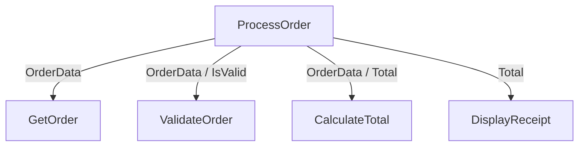
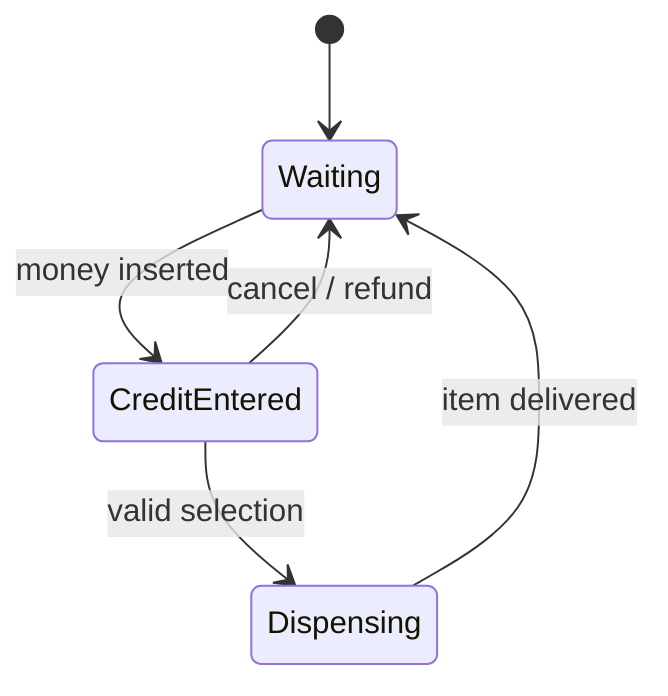

# AS 9618 Chapter 12: Software Development

<div class="chapter-meta"><strong>AS 9618 · Paper 2</strong><span>9618 · 2027–2029 · Version 2</span></div>

## Official Syllabus Checklist

Revise: development life cycles; structure charts and state diagrams; testing, faults and maintenance.

> The checklist paraphrases the syllabus for revision. Use the official syllabus as the final authority.

## Core Knowledge

Use the topic sections below to connect definitions, processes, comparisons and calculations.

> **Paper 2 focus:** select a suitable development life cycle, document modular designs, plan effective testing, correct faults and classify maintenance.

---

## Syllabus Map

| Syllabus objective | Where it is covered |
|---|---|
| Explain the purpose of a program development life cycle | Purpose of a Development Life Cycle |
| Choose between waterfall, iterative and RAD | Development Life Cycles |
| Explain principles, benefits and drawbacks of each life cycle | Development Life Cycles and Worked Example 1 |
| Understand analysis, design, coding, testing and maintenance | Life-Cycle Stages |
| Describe and construct structure charts with parameters | Structure Charts |
| Derive pseudocode from a structure chart | Structure Charts and Worked Example 2 |
| Explain and use state-transition diagrams | State-Transition Diagrams |
| Identify syntax, logic and run-time errors | Program Faults |
| Correct identified errors | Program Faults and Worked Example 3 |
| Select testing methods | Testing Methods |
| Explain test strategies and test plans | Test Strategy, Test Plan and Test Data |
| Choose normal, abnormal and extreme/boundary data | Test Strategy, Test Plan and Test Data |
| Distinguish corrective, adaptive and perfective maintenance | Maintenance |
| Amend an existing program to enhance functionality | Enhancing Existing Programs |

---

## Purpose of a Development Life Cycle

A **program development life cycle** provides an organised process for moving from a problem to a working, maintainable solution.

It helps a team:

- understand requirements before committing to code
- choose and document a design
- coordinate people and stages
- find faults systematically
- judge progress against planned outputs
- manage later changes

Different projects need different life cycles because requirements, risk, deadlines, user availability and the need for early prototypes vary.

---

## Development Life Cycles

### Waterfall

Waterfall completes defined stages mainly in sequence.

| Benefits | Drawbacks |
|---|---|
| clear milestones and documentation | changes are expensive after a stage is completed |
| easier to plan stable requirements | working software appears relatively late |
| formal review before moving on | users may not recognise misunderstandings until late |

Suitable when:

- requirements are stable and well understood
- formal approval/documentation is important
- technology and scope are predictable

### Iterative

Iterative development builds a version, reviews it and improves it through repeated cycles.

| Benefits | Drawbacks |
|---|---|
| feedback arrives earlier | scope can keep changing |
| faults and misunderstandings appear sooner | repeated revisions complicate scheduling |
| changing requirements can be incorporated | architecture may weaken without control |

Suitable when requirements can evolve and users can provide regular feedback.

### Rapid Application Development (RAD)

RAD uses rapid prototyping, frequent user involvement, reusable components and time-boxed development to produce usable parts quickly.

| Benefits | Drawbacks |
|---|---|
| prototypes clarify requirements | requires frequent access to suitable users |
| useful components appear quickly | less suitable for very large or safety-critical systems |
| reuse and tools can reduce development time | speed may reduce documentation or architectural quality |

Suitable for a modular, interface-heavy system with a short deadline and available users.

### Selection rule

Do not claim one life cycle is always best. Link the choice to the scenario:

- stable vs changing requirements
- formal control vs frequent feedback
- safety/scale
- deadline
- modularity
- user availability

---

## Life-Cycle Stages

| Stage | Main work | Typical output |
|---|---|---|
| Analysis | establish problem, requirements, constraints, inputs and outputs | requirements specification |
| Design | plan algorithms, modules, interfaces, data and tests | pseudocode, structure chart, test plan |
| Coding | translate design into source code | working modules/source |
| Testing | expose faults and compare results with requirements | test evidence and corrected code |
| Maintenance | correct, adapt or improve after release | revised program/version |

These are stages of work, not necessarily one-directional steps. Iterative and RAD approaches revisit them.

---

## Structure Charts

A structure chart shows:

- hierarchical decomposition into modules
- which module calls another
- parameters passed between modules
- selection or repetition annotations where relevant

It does not show the detailed instructions inside each module.

Example:



Possible equivalent pseudocode:

```text
OrderData <- GetOrder()
IsValid <- ValidateOrder(OrderData)

IF IsValid = TRUE THEN
    Total <- CalculateTotal(OrderData)
    CALL DisplayReceipt(Total)
ENDIF
```

### Constructing a structure chart

1. place the controlling module at the top
2. decompose it into direct sub-tasks
3. add lower-level modules only where needed
4. name modules with clear actions
5. label data passed down and results returned
6. check that every required task appears once

---

## State-Transition Diagrams

A state-transition diagram documents:

- possible states
- events or conditions that trigger a transition
- the next state

Example vending-machine model:



This representation is suitable when behaviour depends strongly on the current state.

When constructing one:

- give every state a distinct name
- label transitions with the triggering event/condition
- include all valid exits from each state
- avoid transitions that the rules do not allow

---

## Program Faults

| Error type | Meaning | Example |
|---|---|---|
| Syntax | breaks the language/pseudocode rules | missing `ENDIF` |
| Logic | executes but produces an incorrect result | uses `>` instead of `<` |
| Run-time | fails during execution | division by zero or invalid array index |

Correction process:

1. reproduce the fault with a small input
2. identify the first incorrect state or output
3. locate the instruction responsible
4. make the smallest correction
5. rerun the original test
6. run related normal and boundary tests

Avoiding faults:

- refine the algorithm before coding
- use meaningful identifiers and modules
- validate input
- use walkthroughs and dry runs
- test modules and interfaces early

---

## Testing Methods

| Method | What it does |
|---|---|
| Dry run | manually follows an algorithm using test data and a trace table |
| Walkthrough | one or more people inspect the design/code step by step |
| White-box testing | selects tests from internal paths, branches and loops |
| Black-box testing | checks inputs and outputs against requirements without using internal code structure |
| Integration testing | checks modules and their interfaces when combined |
| Alpha testing | controlled testing by/with the developer before wider release |
| Beta testing | selected external users test in realistic environments before final release |
| Acceptance testing | customer/user checks whether agreed requirements are satisfied |
| Stub | temporary replacement that simulates a module not yet available |

Selection examples:

- test every branch of a validation routine: white-box
- confirm the entire program meets the specification: acceptance
- test data passed from login module to account module: integration
- continue development while a payment service is unfinished: stub

---

## Test Strategy, Test Plan and Test Data

### Test strategy

A test strategy is the high-level approach:

- what levels and methods will be used
- responsibilities
- environments and tools
- entry/exit criteria
- how faults and retests will be recorded

### Test plan

A test plan contains specific cases.

| Test ID | Purpose | Data | Type | Expected result | Actual result | Pass/fail |
|---|---|---|---|---|---|---|
| T01 | lower valid limit | 1 | extreme/boundary | accepted | | |
| T02 | below lower limit | 0 | abnormal/boundary | rejected | | |

### Test-data types

For valid range 1–100 inclusive:

| Type | Example | Meaning |
|---|---|---|
| normal | 47 | ordinary valid data |
| extreme | 1 or 100 | valid endpoint |
| boundary | 0, 1, 2 and 99, 100, 101 | values on and immediately around limits |
| abnormal | 0, 101 or wrong type | invalid data |

An expected result must be specific enough to decide pass/fail.

---

## Maintenance

| Type | Purpose | Example |
|---|---|---|
| Corrective | fix an identified fault | repair incorrect tax calculation |
| Adaptive | keep the program working in a changed environment | support a new operating system or file format |
| Perfective | improve functionality, usability or performance | add filtering or reduce response time |

One change may have several effects, but classify it by its primary reason.

Maintenance needs:

- controlled requirements
- regression testing
- updated documentation
- version tracking
- checks that unchanged functions still work

---

## Enhancing Existing Programs

When asked to amend a program:

1. state the current behaviour
2. identify the exact new requirement
3. find the smallest affected module/data structure
4. preserve existing correct behaviour
5. add or change logic
6. test the new path
7. rerun existing tests for regression

Example enhancement:

Existing:

```text
IF Total >= 100 THEN
    Discount <- Total * 0.10
ELSE
    Discount <- 0
ENDIF
```

New requirement: members receive 5% discount below $100.

```text
IF Total >= 100 THEN
    Discount <- Total * 0.10
ELSE
    IF IsMember = TRUE THEN
        Discount <- Total * 0.05
    ELSE
        Discount <- 0
    ENDIF
ENDIF
```

Regression checks must confirm that the original $100 threshold still behaves correctly.

---

## Worked Example 1 — Choose a Life Cycle

A hospital replaces a medicine-calculation component. Requirements are formally approved, safety evidence is required and late uncontrolled changes are unacceptable.

Best-supported choice: **waterfall**.

Reasoning:

- requirements are stable and formally controlled
- each stage can be reviewed before proceeding
- documentation and traceability support safety evidence

Trade-off:

- if a requirement changes late, revisiting completed stages is expensive

RAD would be weak here because speed and rapid prototyping do not outweigh formal control and safety requirements.

By contrast, an internal event-booking interface with available users and a short deadline may suit RAD or iterative development.

---

## Worked Example 2 — Structure Chart to Pseudocode

Structure:

```text
CreateReport
├── ReadScores -> Scores, Count
├── CalculateStatistics(Scores, Count) -> Average, Highest
└── DisplayReport(Average, Highest)
```

Equivalent control logic:

```text
CALL ReadScores(Scores, Count)
CALL CalculateStatistics(Scores, Count, Average, Highest)
CALL DisplayReport(Average, Highest)
```

Possible interfaces:

```text
PROCEDURE ReadScores(
    BYREF Scores : ARRAY[1:100] OF INTEGER,
    BYREF Count : INTEGER
)
PROCEDURE CalculateStatistics(
    BYVAL Scores : ARRAY[1:100] OF INTEGER,
    BYVAL Count : INTEGER,
    BYREF Average : REAL,
    BYREF Highest : INTEGER
)
PROCEDURE DisplayReport(BYVAL Average : REAL, BYVAL Highest : INTEGER)
```

The structure chart determines call relationships and data flow; internal algorithms are refined separately.

---

## Worked Example 3 — Expose and Correct a Fault

Faulty average algorithm:

```text
Total <- 0
FOR Index <- 1 TO 5
    Total <- Total + Score[Index]
NEXT Index
Average <- Total / (Index - 1)
```

Depending on the loop convention, `Index` after the loop is easy to misinterpret. The count is already known.

Correction:

```text
Average <- Total / 5
```

Tests:

| Data | Purpose | Expected average |
|---|---|---:|
| 10, 20, 30, 40, 50 | normal | 30 |
| 0, 0, 0, 0, 0 | extreme valid values | 0 |
| 100, 100, 100, 100, 100 | extreme valid values | 100 |

A white-box review confirms the loop totals five elements. Black-box tests confirm the observable averages.

---

## Required Ideas and Exam Language

Use technical terms as part of a complete statement: identify the component or method, state what it does, then link its effect to the question context. A keyword without a correct relationship is not a complete marking point.

## Common Confusions

- [ ] I link life-cycle choice to scenario evidence.
- [ ] I do not describe waterfall as automatically superior.
- [ ] I keep the official stages distinct.
- [ ] I label structure-chart parameter flow.
- [ ] I distinguish a structure chart from a flowchart.
- [ ] I label state transitions with events/conditions.
- [ ] I distinguish syntax, logic and run-time errors.
- [ ] I select a testing method for a stated reason.
- [ ] I distinguish a strategy from individual test cases.
- [ ] I give expected results in a test plan.
- [ ] I distinguish corrective, adaptive and perfective maintenance.
- [ ] I regression-test unchanged behaviour after an enhancement.

---

## Worked Examples

The worked calculations, process templates and scenario answers above model the chain of reasoning expected in examination responses. Rework each example before reading its answer.

## 10-Mark Quick Check

1. State one benefit and one drawback of waterfall. **[2]**
2. State one difference between iterative development and RAD. **[2]**
3. State the purpose of a structure chart and the purpose of a state-transition diagram. **[2]**
4. Distinguish white-box testing from black-box testing. **[2]**
5. Name the three maintenance types. **[2]**

**Total: 10 marks**

## Quick Check Answers

1. Any linked pair, such as clear staged control/documentation **[1]** but costly late changes or late working software **[1]**. **[2]**
2. Iterative is the general repeated improvement of versions; RAD specifically emphasises rapid/time-boxed prototyping, strong user involvement and reuse/tools. **[2]**
3. A structure chart documents modular hierarchy and parameter flow **[1]**; a state-transition diagram documents states and event-triggered changes **[1]**. **[2]**
4. White-box derives tests from internal paths/logic; black-box tests required input-output behaviour without relying on the internal implementation. **[2]**
5. Corrective, adaptive and perfective. Award one mark for any two correct and two marks for all three correct. **[2]**

---

## 20-Mark Exam Practice

A sports centre is developing an appointment app. Users are available weekly to review prototypes, the interface is modular and the first usable version is needed quickly.

1. Select a suitable development life cycle and justify it with three scenario details. **[4]**
2. Describe a structure chart containing a controlling module and three submodules. Name one parameter/result passed for each submodule. **[4]**
3. Select a suitable testing method for each purpose:
   - exercise every branch of the validation module
   - test data passed between booking and payment modules
   - selected customers use the near-final app
   - centre management checks agreed requirements. **[4]**
4. A booking quantity must be from 1 to 6 inclusive. Give one normal value, both extreme values and one abnormal boundary value, with expected outcomes. **[4]**
5. Classify each change: fix a duplicate-booking fault; support a new mobile operating system; add appointment filtering. **[3]**
6. The condition `IF Quantity > 1 AND Quantity < 6` is intended to accept the full valid range. State the corrected condition. **[1]**

**Total: 20 marks**

### 20 Marks Practice Mark Scheme

1. RAD or iterative **[1]**; justification linked to any three of weekly users/feedback, modular interface, rapid prototype/short deadline **[3]**. RAD is the strongest answer when all details are used. **[4]**
2. Controlling module such as `ProcessBooking` **[1]**; three suitable submodules **[1]**; suitable parameter/result for at least two modules **[1]**; clear hierarchy/data flow **[1]**. Example: `GetBooking -> BookingData`, `ValidateBooking(BookingData) -> IsValid`, `SaveBooking(BookingData)`. **[4]**
3. White-box; integration; beta; acceptance. **[4]**
4. Normal such as 3, accepted **[1]**; lower extreme 1, accepted **[1]**; upper extreme 6, accepted **[1]**; abnormal boundary 0 or 7, rejected **[1]**. **[4]**
5. Corrective; adaptive; perfective. **[3]**
6. `IF Quantity >= 1 AND Quantity <= 6`. **[1]**

---

## Final Revision Checklist

- [ ] I can choose and evaluate waterfall, iterative and RAD.
- [ ] I can explain the five program-development stages.
- [ ] I can construct and interpret structure charts with parameters.
- [ ] I can construct and interpret state-transition diagrams.
- [ ] I can select every required testing method.
- [ ] I can produce a test strategy and specific test-plan rows.
- [ ] I can identify/correct errors and classify maintenance.
- [ ] I can enhance a program without breaking existing behaviour.
- [ ] I completed both practice sets before checking the answers.
