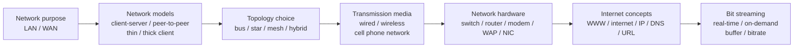
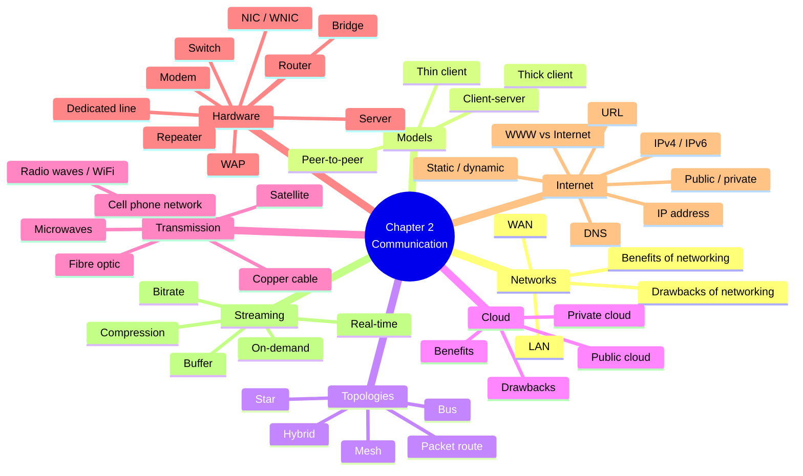
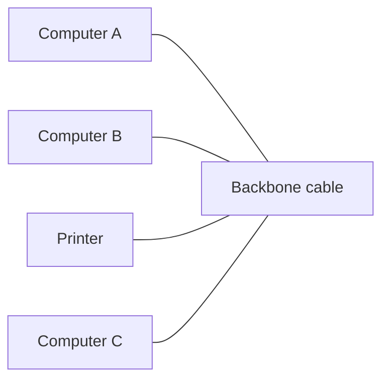
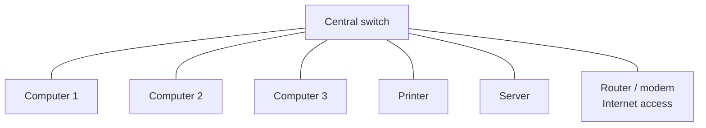
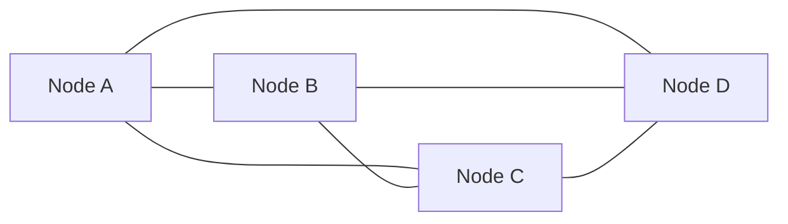
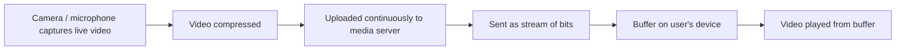
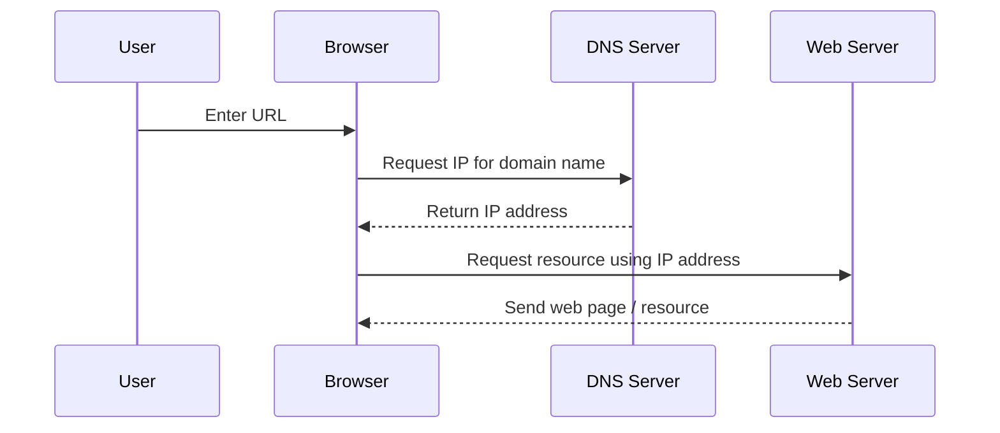
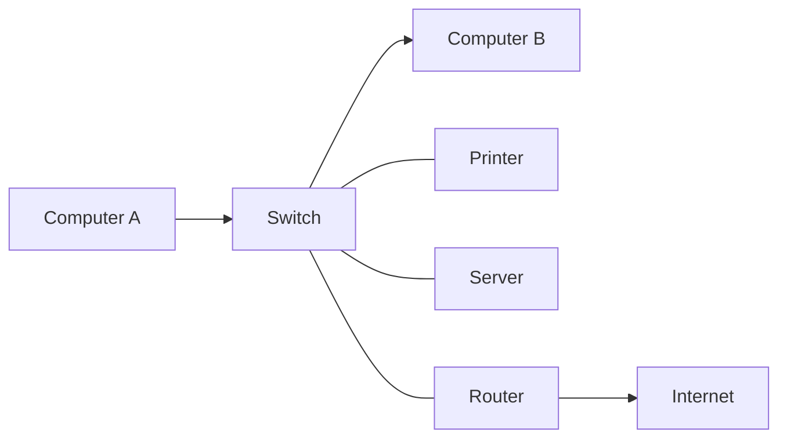

# AS 9618 Computer Science — Chapter 2 Updated Notes
## Communication｜Syllabus-Aligned Paper 1 Revision Sheet

> **Version:** Syllabus-aligned revision; informed by recent Paper 1 patterns  
> **Target:** Cambridge International AS & A Level Computer Science 9618  
> **Chapter:** 2 Communication  
> **Syllabus section:** 2.1 Networks including the internet  
> **Main audience:** Students  
> **Style:** 中文解释 + English mark scheme keywords  

---

# 0. How to Use This Sheet

Chapter 2 不应该只背很多网络名词。2024 和 2025 的 Paper 1 更喜欢把网络知识放进一个具体场景里考：公司 LAN、WAN、smartphone 连接、video conference、star topology diagram、IP address 填空、switch/router/modem 用途等。

复习时请按下面顺序：



---

# 1. Recent Paper 1 Pattern Map

| Area | Recent exam pattern | What students must practise |
| --- | --- | --- |
| Topologies | Very high | Identify bus / star / mesh; justify choice; draw labelled star topology |
| LAN vs WAN | High | Compare geographical area, ownership of hardware/media, private/external infrastructure |
| IP addresses | Very high | IPv4 vs IPv6, static vs dynamic, public vs private, subnetting basics |
| Network hardware | Very high | Switch, router, modem, dedicated line, WAP, NIC/WNIC, server |
| Cell phone network | High in 2025 | Cells, towers, wireless low-power radio signals, smartphone to tower communication |
| Bit streaming | High in 2025 | Real-time streaming, media server, buffer, bandwidth, compression, latency |
| Switch role | High in 2025 | MAC address table, receives packets, forwards directly to intended device |
| Router/public IP | High in 2024 | Router connects LAN to internet; public IP is accessible/visible on internet |
| Cloud computing | Medium | Public/private cloud, benefits/drawbacks, scenario justification |
| DNS / URL / WWW vs internet | Medium | Definitions and process, but less calculation-heavy than IP/topology |
| Ethernet / CSMA-CD | Medium-low | Know collision detection/avoidance, but not too deep beyond syllabus wording |

---

# 2. Content Update Decision

## 2.1 Keep and Strengthen

| Content | Decision | Reason |
| --- | --- | --- |
| LAN vs WAN | Strengthen | 2025 asked direct comparison in a company WAN scenario |
| Star topology | Strengthen | 2025 asked students to draw a star topology with labelled devices |
| Bus / star / mesh | Strengthen | 2024 tested topology identification from statements |
| Switch role | Strengthen | 2025 mark scheme rewards MAC address + direct forwarding language |
| IP address formats | Strengthen | 2024/2025 both reward exact IPv4/IPv6 facts |
| Public/private/static/dynamic IP | Strengthen | Common short-answer and fill-in area |
| Bit streaming | Strengthen | 2025 tested real-time bit streaming, buffer and compression together |
| Modem / dedicated line | Strengthen | 2025 tested their use during internet transmission |
| Cell phone network | Strengthen | 2025 tested data transmission using smartphone/cell network |
| Router | Keep strong | 2024 tested public IPv6 address and internet connection |

## 2.2 Downweight

| Content | Why downweight |
| --- | --- |
| Very detailed OSI/TCP/IP layers | Not required in AS Chapter 2 syllabus at this depth |
| Deep cryptography for networks | Mainly Chapter 6/17, not Chapter 2 core |
| Bluetooth details beyond simple comparison | Not strongly represented in 2024/2025 Paper 1 Chapter 2 questions |
| Excessive Ethernet frame structure | Syllabus asks Ethernet and CSMA/CD concept, not low-level frame memorisation |
| MAN/PAN/CAN network types | Not central to current 9618 Chapter 2 syllabus wording |
| Detailed DNS record types | Students need DNS role/process, not A/AAAA/CNAME detail |

## 2.3 Delete from student revision focus

| Delete / avoid | Reason |
| --- | --- |
| Vendor-specific router/switch brand features | Brand names do not receive marks |
| IPv6 subnet planning in professional CIDR depth | Too far beyond AS Paper 1 expectation |
| Long historical development of internet | Low exam value |
| WiFi standards such as 802.11ax speed tables | Too detailed and likely not mark-bearing |

---

# 3. One-Page Mind Map



---

# 4. 2.1 Networks including the Internet

## 4.1 Purpose and benefits of networking devices

### Core idea

A network connects computers and devices so that they can communicate and share resources.

### Benefits of networking

| Benefit | Student-friendly explanation | Mark scheme phrase |
| --- | --- | --- |
| Share hardware | 多台电脑可以共用 printers / storage | **share resources / peripherals** |
| Share data | 用户可以访问共同文件 | **share files / data** |
| Central backup | 数据可统一备份 | **centralised backup** |
| Central security | 管理员可统一设置权限 | **centralised access rights / permissions** |
| Communication | 用户可发送 messages / email / video calls | **communication between users** |
| Software management | 可以集中安装或更新软件 | **centralised software update / management** |

### Drawbacks of networking

| Drawback | Explanation |
| --- | --- |
| Initial cost | cables, switches, servers, WAPs cost money |
| Management complexity | large network needs trained network manager |
| Security risk | malware/hacking can spread through network |
| Server failure | if central server fails, many users may be affected |
| Dependency | users may lose access when network connection fails |

### Mark scheme answer

> A network allows devices to share resources, share data and communicate. It can also allow centralised backup, centralised security and centralised software management.

---

# 5. LAN and WAN

## 5.1 LAN — Local Area Network

### Definition

> A LAN is a network that covers a small geographical area, usually one site, building, school or office.

### Key features

+ Covers a **small area**
+ Hardware is usually **owned by one organisation**
+ Transmission media is often **private / dedicated**
+ Can use wired Ethernet or wireless WiFi
+ Usually easier to manage than a WAN

## 5.2 WAN — Wide Area Network

### Definition

> A WAN is a network that covers a large geographical area and connects LANs across cities, countries or continents.

### Key features

+ Covers a **large geographical area**
+ Often connects multiple LANs
+ May use **external / public / leased transmission media**
+ May use the internet, cell phone network, satellite, fibre links, dedicated lines
+ More complex and more expensive to manage

## 5.3 LAN vs WAN comparison

| Point | LAN | WAN |
| --- | --- | --- |
| Geographical area | small area | large area |
| Ownership | usually owned by one organisation | may use external / third-party infrastructure |
| Transmission media | usually dedicated/private | may use public/external/leased media |
| Cost | lower for one site | higher due to large area/infrastructure |
| Speed/latency | usually faster/lower latency | may be slower/higher latency |
| Example | school network | company network across cities |

### Recent exam-style answer

> A WAN covers a larger geographical area than a LAN. A WAN may use external or non-company-owned transmission media, while a LAN usually uses dedicated hardware and media owned by the organisation.

### Common mistake

| Weak answer | Why weak | Better answer |
| --- | --- | --- |
| WAN is wireless and LAN is wired | Not always true | WAN covers larger area; LAN covers smaller area |
| WAN is just the internet | Too narrow | WAN can use internet or other long-distance infrastructure |
| LAN is faster | Sometimes true, but needs reason | LAN often has lower latency because devices are closer and media is local |

---

# 6. Network Models

## 6.1 Client-server model

### Meaning

A **server** provides services or resources. A **client** requests and uses those services.

### Examples

+ File server stores shared files
+ Web server sends web pages
+ Email server handles email
+ Print server manages printer jobs
+ Authentication server checks usernames/passwords

### Benefits

| Benefit | Explanation |
| --- | --- |
| Centralised management | easier to control users, files and permissions |
| Centralised backup | important data can be backed up from one place |
| Better security | access rights can be managed centrally |
| Easier updates | software/data can be maintained centrally |

### Drawbacks

| Drawback | Explanation |
| --- | --- |
| Server cost | dedicated server hardware/software can be expensive |
| Server failure | many clients lose access if server fails |
| Network manager needed | needs specialist maintenance |
| Bottleneck | server may become overloaded |

### Mark scheme answer

> In a client-server network, clients request services or data from a central server. This allows centralised management, backup and security, but the server can be expensive and may become a single point of failure.

---

## 6.2 Peer-to-peer model

### Meaning

In a **peer-to-peer network**, each computer can act as both client and server. There is no central server controlling the network.

### Benefits

+ Cheaper because no dedicated server is needed
+ Simple to set up for small networks
+ Users can share files directly
+ No single central server dependency

### Drawbacks

+ Harder to manage security
+ Backups are not centralised
+ Files may be duplicated or inconsistent
+ Performance depends on individual peers
+ Not suitable for large organisations

### Scenario choice

| Scenario | Better model | Reason |
| --- | --- | --- |
| Small home network | peer-to-peer | cheap and simple |
| School network | client-server | needs central login, access rights and backup |
| Business with sensitive data | client-server | better central security |
| Temporary file sharing between two laptops | peer-to-peer | direct sharing is enough |

---

## 6.3 Thin client and thick client

### Thin client

A **thin client** depends heavily on a server for processing and storage.

+ Less local processing
+ Less local storage
+ Cheaper/simple client device
+ Needs reliable network/server connection
+ If server/network fails, client may not work properly

### Thick client

A **thick client** can process and store more data locally.

+ More local processing
+ More local storage
+ Can work with less server dependency
+ More expensive hardware
+ Harder to update/security-manage individually

### Comparison table

| Feature | Thin client | Thick client |
| --- | --- | --- |
| Processing | mostly server-side | mostly local/client-side |
| Storage | server-side | local + server possible |
| Hardware cost | lower | higher |
| Network dependency | high | lower |
| Central management | easier | harder |
| Offline use | poor | better |

### Mark scheme answer

> A thin client relies on the server for most processing and storage. A thick client performs more processing locally and can store more data locally.

---

# 7. Network Topologies

## 7.1 Bus topology

### Structure

All devices connect to one central cable called the **backbone**.



### Benefits

+ Cheap for small networks
+ Uses less cable than star
+ Simple basic layout

### Drawbacks

+ Central cable failure can bring down network
+ Collisions likely when many devices transmit
+ Performance decreases with more devices
+ Harder to isolate faults

### 2024-style clue

> all devices connect to a central cable  
> most likely to lose data through collisions

These describe **bus topology**.

---

## 7.2 Star topology

### Structure

All devices connect to one central device, usually a **switch**.



### Benefits

+ Easy to add/remove devices
+ If one cable fails, only that device is affected
+ Fewer collisions when using a switch
+ Easier to identify faults
+ Good for office/school LANs

### Drawbacks

+ Central switch failure affects whole network
+ More cable than bus
+ Switch adds cost

### 2025 drawing exam tip

When asked to draw a star topology:

+ Put **switch** in the centre.
+ Connect each device directly to the switch.
+ Label every device.
+ If internet access is mentioned, connect **router/modem** to the switch.
+ Do not connect computers in a chain.

---

## 7.3 Mesh topology

### Structure

Devices have multiple connections to other devices, giving packets multiple possible paths.



### Benefits

+ Very robust
+ Multiple paths for packets
+ If one link fails, data can use another route
+ Good fault tolerance

### Drawbacks

+ Expensive because many connections are needed
+ Complex to install/manage
+ More cabling/wireless links required

### 2024-style clue

> multiple paths for packets  
> robust against damage because if any line fails, the rest of the network retains functionality

These describe **mesh topology**.

---

## 7.4 Hybrid topology

A **hybrid topology** combines two or more topologies, such as star-bus or star-mesh.

### Use

Large real networks often use hybrid layouts because one topology may not fit all parts of the organisation.

---

## 7.5 Topology choice scenario bank

| Scenario | Best topology | Why |
| --- | --- | --- |
| Small temporary network, very low cost | bus | uses little cable, cheap |
| Office LAN with computers, printers, server | star | central switch, easy management, fewer collisions |
| Critical network needing high reliability | mesh | multiple paths, robust if link fails |
| Large company with different departments | hybrid | combines suitable layouts for different areas |

---

# 8. Packets and Transmission between Hosts

## 8.1 Packet basics

Data is split into **packets** before being transmitted across a network.

Each packet commonly contains:

+ source address
+ destination address
+ packet number / sequence number
+ payload/data
+ error checking data

## 8.2 Why packets are used

+ Large data can be split into manageable parts
+ Different packets can take different routes
+ Lost/corrupt packets can be resent
+ Network bandwidth can be shared by many users

## 8.3 Packets in topologies

| Topology | Packet route idea |
| --- | --- |
| Bus | packets travel along backbone; devices check if packet is for them |
| Star | device sends packet to switch; switch forwards to intended device |
| Mesh | packets can use different routes; alternative path if a link fails |

### Mark scheme wording

> Packets include a destination address. Network devices use the destination address to forward the packet to the correct device or next network.

---

# 9. Cloud Computing

## 9.1 Meaning

Cloud computing means using remote servers over a network/internet to store, process or manage data instead of relying only on local hardware.

## 9.2 Public cloud vs private cloud

| Type | Meaning | Example scenario |
| --- | --- | --- |
| Public cloud | shared cloud infrastructure provided by a third-party provider | small business uses online storage |
| Private cloud | cloud infrastructure dedicated to one organisation | bank stores sensitive internal data |

## 9.3 Benefits

+ Data can be accessed from different locations
+ Less need to buy local servers
+ Scalable storage/processing
+ Provider may handle maintenance and updates
+ Easier collaboration
+ Backup/disaster recovery can be improved

## 9.4 Drawbacks

+ Requires reliable internet connection
+ Ongoing subscription cost
+ Security/privacy concerns
+ Less control over infrastructure
+ Provider downtime can affect users
+ Possible data transfer delay/latency

### Scenario answer

> A public cloud may be suitable when a small business wants scalable storage without buying servers. A private cloud may be more suitable when sensitive data must stay under the organisation’s control.

---

# 10. Wired and Wireless Networks

## 10.1 Wired networks

### Copper cable

| Feature | Explanation |
| --- | --- |
| Cost | usually cheaper than fibre |
| Speed | acceptable for many LANs |
| Interference | affected by electromagnetic interference more than fibre |
| Distance | shorter effective distance than fibre |

### Fibre-optic cable

| Feature | Explanation |
| --- | --- |
| Speed | very high bandwidth |
| Distance | can transmit over long distances |
| Interference | not affected by electromagnetic interference |
| Cost | more expensive and harder to install |
| Security | harder to tap without detection |

## 10.2 Wireless networks

### Radio waves / WiFi

+ Used for wireless LANs
+ Devices connect through a WAP or wireless router
+ Convenient because no physical cable is needed
+ Can suffer from interference, weaker signal, security issues

### Microwaves

+ Used for line-of-sight communication
+ Can be used between buildings or with satellites
+ Requires clear path
+ Weather/obstacles may affect signal

### Satellites

+ Useful for remote areas
+ Covers wide geographical areas
+ Higher latency because signal travels long distances
+ Can be affected by weather

## 10.3 Wired vs wireless comparison

| Point | Wired | Wireless |
| --- | --- | --- |
| Mobility | poor | good |
| Installation | cables needed | easier where cabling is difficult |
| Speed/stability | usually faster/more stable | can be affected by signal/interference |
| Security | harder to intercept physically | easier to intercept if not secured |
| Cost | cabling can cost more initially | fewer cables, but WAPs/security needed |

### Mark scheme answer

> Wired networks usually provide faster and more reliable transmission, but cabling can be expensive and limits mobility. Wireless networks allow mobile devices to connect more easily, but may suffer from interference and security risks.

---

# 11. Cell Phone Network

## 11.1 2025 Paper 1 focus

2025 tested smartphone access to a company WAN using the cell phone network.

### How data is transmitted

1. The land area is divided into **cells**.
2. Each cell has a **tower / base station / antenna**.
3. The smartphone sends and receives data wirelessly using **low-power radio signals**.
4. The tower receives and transmits data between the phone and the wider network.
5. Multiple devices can communicate with the same tower at the same time.
6. As the user moves, connection can be handed over to another cell/tower.

### Mark scheme answer

> The area is divided into cells. Each cell has a tower with an antenna. The smartphone communicates wirelessly with the tower using low-power radio signals. The tower transmits the data to the wider network.

### Common mistake

| Mistake | Correction |
| --- | --- |
| saying “the phone connects directly to the WAN” | mention tower/base station/cell phone network |
| saying “satellite” for every mobile connection | normal smartphone data usually uses cell towers |
| forgetting wireless signal | say radio signals/frequencies |

---

# 12. LAN Hardware

## 12.1 Switch

### Role

A switch connects devices in a LAN and forwards frames/packets to the correct device.

### 2025 mark scheme wording

+ stores MAC addresses of connected devices
+ receives packets/frames from devices
+ forwards packets directly to intended recipient
+ provides a central point of connection
+ enables connected devices to communicate

### Student answer

> A switch connects devices in a LAN. It stores the MAC addresses of connected devices and forwards data only to the intended recipient rather than broadcasting to every device.

---

## 12.2 Router

### Role

A router connects different networks and forwards packets between networks.

### Key points

+ Connects LAN to WAN/internet
+ Uses IP addresses to decide where to send packets
+ Can act as default gateway
+ Can choose a route for packets
+ Usually has a public IP address on the internet side
+ Can use NAT to allow private LAN devices to access internet

### 2024-style answer

> The router has a public IP address so that it can be identified, accessed and communicated with by other devices on the internet.

---

## 12.3 Modem

### Role

A modem converts signals so data can be sent over transmission media such as phone lines.

### 2025 mark scheme wording

> Converts digital data into analogue for transmission down phone lines, or converts analogue data into digital after transmission.

### Exam warning

Modern network devices often combine router and modem in one box, but in answers keep the roles separate:

+ **router**: forwards packets between networks
+ **modem**: converts signal form for transmission medium

---

## 12.4 Dedicated lines

A dedicated line is a private/direct connection between sites.

### Benefits

+ faster transmission
+ more reliable connection
+ not shared with general public traffic in the same way
+ can improve security/control

### Recent exam-style answer

> A dedicated line provides a direct/private connection, which can provide faster and more reliable transmission.

---

## 12.5 Other LAN hardware

| Hardware | Role |
| --- | --- |
| Server | provides services/resources to clients |
| NIC | allows a device to connect to wired network |
| WNIC | allows a device to connect wirelessly |
| WAP | allows wireless devices to connect to a wired/wireless LAN |
| Bridge | connects two LAN segments using same protocol |
| Repeater | regenerates/amplifies signal to extend range |
| Cables | carry data in wired network |

---

# 13. Ethernet and CSMA/CD

## 13.1 Ethernet

Ethernet is a set of standards/protocols used for wired LAN communication.

## 13.2 Collision

A collision happens when two devices transmit on the same shared medium at the same time, causing data to interfere.

## 13.3 CSMA/CD

**CSMA/CD** = Carrier Sense Multiple Access / Collision Detection

### Process

1. Device listens to check if the transmission medium is free.
2. If free, it transmits data.
3. If another device transmits at the same time, a collision is detected.
4. Devices stop transmitting.
5. Each waits a random time.
6. Devices try again.

### Mark scheme answer

> A device checks whether the medium is free before transmitting. If a collision is detected, devices stop transmitting, wait for a random time and retransmit.

### Downweight warning

Do not spend too long on Ethernet frame fields unless your course specifically requires it. For AS Paper 1, the high-value answer is usually about **checking medium, detecting collision, random wait, retransmission**.

---

# 14. Bit Streaming

## 14.1 Meaning

Bit streaming is transmitting media as a continuous stream of bits so the user can start watching/listening before the whole file has downloaded.

## 14.2 Real-time bit streaming

Used for live events, video calls and live conferences.

### Features

+ Data is transmitted continuously
+ Usually uploaded to a media server
+ Users download from the media server
+ Data is stored briefly in a buffer
+ User views/listens from the buffer
+ Delay must be small because it is live

### 2025 answer

> The video is transmitted continuously as a series of bits. The video is uploaded to a media server and downloaded by users. The data is sent to a buffer on the user’s device and the user views the stream from the buffer.

## 14.3 On-demand bit streaming

Used for videos/music available at any time.

### Features

+ File is stored on a server before the user requests it
+ User can pause/rewind/fast-forward more easily
+ Less time pressure than live streaming
+ Buffering can occur before playback

## 14.4 Buffer in streaming

A buffer temporarily stores data before playback.

### Why needed

+ Transmission speed may vary
+ Receiving/processing speed may differ from sending speed
+ Buffer reduces playback interruption
+ Allows smooth streaming

## 14.5 Importance of bit rate and broadband speed

| Term | Meaning | Effect |
| --- | --- | --- |
| Bit rate | amount of data needed per second for the stream | higher quality usually needs higher bit rate |
| Broadband speed | rate at which user can receive data | must be high enough for smooth streaming |
| Buffering | waiting while enough data is collected | happens when speed is too low/unstable |

## 14.6 Compression and real-time streaming

2025 tested compression in video conferencing.

### Why compress video before real-time streaming?

+ Video is data-intensive
+ File size/data rate is reduced
+ Less bandwidth is needed
+ Buffering is reduced
+ People with lower bandwidth can still participate
+ In live conversation, lower buffering reduces delay and prevents users being behind

### Lossy vs lossless for real-time streaming

For real-time video streaming, **lossy** is usually more appropriate.

### Justification

+ Reduces file size more than lossless
+ Requires less bandwidth
+ Reduces buffering more
+ Some removed data may not be noticed by users
+ Slight quality reduction is acceptable in video calls
+ Example: reduce video resolution or audio sample rate

---

# 15. WWW, Internet, URL and DNS

## 15.1 Internet vs World Wide Web

| Term | Meaning |
| --- | --- |
| Internet | global network of interconnected networks using TCP/IP |
| World Wide Web | collection of web pages/websites accessed using the internet |

### Mark scheme answer

> The internet is the physical/global network infrastructure. The WWW is a service that runs on the internet and consists of websites and web pages.

### Common mistake

| Mistake | Correction |
| --- | --- |
| Internet and WWW are the same | WWW uses the internet; it is not the whole internet |
| WWW is hardware | WWW is a service/resource system, not physical cables |

---

## 15.2 Hardware supporting the internet

| Hardware / infrastructure | Use |
| --- | --- |
| Modem | converts signals for transmission over lines |
| Router | forwards packets between networks |
| Dedicated lines | private/direct high-speed link |
| PSTN | traditional telephone network infrastructure |
| Cell phone network | mobile data using cells/towers/radio signals |
| Servers | store and provide web/data services |
| Fibre/copper/satellite links | carry data over distance |

---

## 15.3 IP addresses

An IP address identifies a device/interface on a network so packets can be routed.

### IPv4

+ 32 bits
+ four groups
+ each group is 8 bits
+ groups shown in denary
+ separated by full stops
+ example: `192.168.1.10`

### IPv6

+ 128 bits
+ eight groups
+ each group has 4 hexadecimal digits
+ separated by colons
+ consecutive groups of zeros can be replaced by `::` once
+ example: `2001:0DB8:0000:0000:0000:FF00:0042:8329`

### IPv4 vs IPv6 table

| Feature | IPv4 | IPv6 |
| --- | --- | --- |
| Total bits | 32 bits | 128 bits |
| Groups | 4 groups | 8 groups |
| Group size | 8 bits | 4 hexadecimal digits / 16 bits |
| Separator | full stops | colons |
| Address space | smaller | much larger |
| Example | `192.168.1.1` | `2001:DB8::1` |

---

## 15.4 Public vs private IP address

| Type | Meaning | Security implication |
| --- | --- | --- |
| Public IP | reachable/identifiable on the internet | exposed to internet, needs protection |
| Private IP | used inside a LAN, assigned by router | not directly accessible from internet |

### 2024-style answer

> A public IP address allows the router to be visible and accessible by other devices on the internet.

### Recent exam-style answer

> A private IP address can only be accessed by devices in the same LAN and is assigned by the router within the LAN.

---

## 15.5 Static vs dynamic IP address

| Type | Meaning | Use |
| --- | --- | --- |
| Static IP | does not change each time the device connects | useful for servers, printers, remote access |
| Dynamic IP | can change when device connects | common for normal client devices |

### Mark scheme phrase

> A dynamic IP address can change each time the computer connects to a network.

---

## 15.6 Subnetting

Subnetting divides a network into smaller subnetworks.

### Benefits

+ Reduces network traffic within each subnet
+ Improves performance
+ Improves security by separating groups/devices
+ Easier management
+ Faults can be isolated

### Student answer

> Subnetting divides a network into smaller subnetworks. This reduces traffic because data can stay within its subnet and improves security because access can be controlled between subnetworks.

---

## 15.7 URL

A **URL** identifies the location of a resource on the World Wide Web.

Example:

```text
https://www.example.com/revision/chapter2.html
```

| Part | Meaning |
| --- | --- |
| `https` | protocol |
| `www.example.com` | domain name / host |
| `/revision/chapter2.html` | path/resource |

## 15.8 DNS

DNS = **Domain Name Service / Domain Name System**

### Role

DNS translates a human-readable domain name into an IP address.

### Process

1. User enters a URL/domain name in the browser.
2. Browser/computer checks local cache.
3. If not found, a DNS server is queried.
4. DNS server returns the matching IP address.
5. Browser uses the IP address to contact the web server.
6. Web server sends the requested web page/resource.

### Mark scheme answer

> DNS resolves/translates a domain name into the corresponding IP address so the browser can locate and request the resource from the correct web server.

---

# 16. Mark Scheme Keywords

| Topic | Keywords / phrases to memorise |
| --- | --- |
| LAN | small geographical area; one site/building; dedicated hardware |
| WAN | large geographical area; connects LANs; external/non-company-owned media |
| Client-server | central server; clients request services; centralised backup/security |
| Peer-to-peer | no central server; each computer can act as client and server |
| Thin client | relies on server for processing/storage |
| Thick client | performs processing locally; local storage |
| Bus | central cable/backbone; collisions; cheap; cable failure affects network |
| Star | central switch; all devices connected directly; easy fault isolation |
| Mesh | multiple paths; robust; expensive/complex |
| Switch | stores MAC addresses; forwards packets to intended recipient |
| Router | connects networks; uses IP address; forwards packets; default gateway |
| Modem | converts digital to analogue / analogue to digital |
| Dedicated line | direct/private connection; faster transmission |
| Cell network | cells; tower/antenna; low-power radio signals |
| Real-time streaming | continuous bits; media server; buffer; live/low delay |
| Compression | reduce file size; less bandwidth; less buffering |
| IPv4 | 32 bits; four 8-bit groups; full stops |
| IPv6 | 128 bits; eight groups; hexadecimal; colons; `::` for zeros |
| Public IP | accessible/visible on internet |
| Private IP | only accessible within LAN; assigned by router |
| Dynamic IP | can change when reconnecting |
| DNS | translates domain name to IP address |
| URL | locates resource on WWW |

---

# 17. Common Mistakes 易错表

| Mistake | Why it loses marks | Correct exam wording |
| --- | --- | --- |
| Saying WAN is always wireless | WAN can be wired/wireless | WAN covers large geographical area |
| Saying LAN is always one room | too narrow | LAN covers small area such as building/site |
| Drawing star topology as a chain | wrong topology | every device connects directly to central switch |
| Saying switch sends data to all devices | confused with hub | switch forwards to intended recipient using MAC address |
| Saying router connects devices in same LAN | incomplete | router connects different networks / LAN to internet |
| Saying modem “gives internet” only | too vague | converts digital/analogue signals for transmission |
| Saying IPv6 is just “newer” | no marks for detail | 128 bits, 8 groups, hex, colons |
| Saying private IP is safer only | vague | private IP is only accessible within same LAN |
| Saying DNS “stores websites” | wrong | DNS maps domain names to IP addresses |
| Saying streaming downloads whole file first | wrong | data is played from a continuous stream/buffer |
| Saying lossless is best for video calls | usually wrong | lossy reduces file size more and lowers bandwidth/buffering |

---

# 18. Scenario Answer Bank

## 18.1 Company with multiple city offices

> A WAN is suitable because the company has multiple sites in different cities. A WAN covers a large geographical area and can connect LANs at different sites. It may use external transmission media or the internet/cell phone network.

## 18.2 Office LAN with computers, printers and server

> A star topology is suitable because all devices can connect directly to a central switch. If one cable fails, only that device is affected. The switch can forward data directly to the intended recipient.

## 18.3 Critical network where link failure cannot stop communication

> A mesh topology is suitable because there are multiple paths for packets. If one link fails, packets can be routed through another path, so the network is more robust.

## 18.4 Smartphone driver connecting to company WAN

> The phone communicates wirelessly with a cell tower using low-power radio signals. The land is divided into cells and each cell has a tower/antenna that receives and transmits data to the wider network.

## 18.5 Video conference using real-time streaming

> Real-time bit streaming sends video continuously as a series of bits. The stream is uploaded to a media server and users download it. Data is stored in a buffer so the user can view the stream smoothly even if transmission speed varies.

## 18.6 Why compress video conference data?

> Video is data-intensive, so compression reduces the file size/data rate. This reduces bandwidth use and buffering, allowing people with lower bandwidth to take part and reducing delay in the conversation.

## 18.7 Why use lossy compression for real-time streaming?

> Lossy compression is suitable because it reduces file size more than lossless, so less bandwidth is needed and buffering is reduced. Some data can be removed without noticeably affecting the user experience.

## 18.8 Router has public IP address

> The router needs a public IP address so that it can be identified and accessed by other devices on the internet. It allows packets from the internet to be routed to the correct network.

## 18.9 DNS used when entering a URL

> The user enters a URL containing a domain name. DNS translates the domain name into its IP address so the browser can contact the correct web server and request the resource.

---

# 19. Process Diagrams

## 19.1 Real-time bit streaming



## 19.2 DNS lookup



## 19.3 Packet transmission in a star LAN



---

# 20. 10 Marks Quick Check

## Questions

1. State one difference between a LAN and a WAN. [1]
2. Give one benefit of using a client-server network. [1]
3. State one drawback of a peer-to-peer network. [1]
4. Identify the topology where all devices connect to a central switch. [1]
5. State one benefit of a mesh topology. [1]
6. State the role of a switch. [1]
7. State the role of a router. [1]
8. State one difference between IPv4 and IPv6. [1]
9. What does DNS do? [1]
10. Why is a buffer used in bit streaming? [1]

## Answers

1. A WAN covers a larger geographical area / may use external transmission media.
2. Centralised backup/security/management.
3. Harder to manage security / no central backup / not suitable for large networks.
4. Star topology.
5. Multiple paths / robust if a link fails.
6. Stores MAC addresses and forwards data to intended recipient.
7. Connects networks and forwards packets using IP addresses.
8. IPv4 is 32 bits; IPv6 is 128 bits / IPv4 uses full stops; IPv6 uses colons.
9. Translates domain names into IP addresses.
10. Temporarily stores data to allow smooth playback when transmission speed varies.

---

# 21. 20 Marks Exam-Style Practice with Mark Scheme

## Question 1 — WAN and cell phone network [6]

A delivery company has offices in three cities. Drivers use smartphones to connect to the company network while travelling.

**(a)** State two ways a WAN is different from a LAN. [2]  
**(b)** Explain how data is transmitted from a smartphone using the cell phone network. [4]

### Mark scheme

**(a)** Award 1 mark each:

+ WAN covers larger geographical area; LAN covers smaller area.
+ WAN may use external / non-company-owned transmission media; LAN usually uses dedicated / company-owned hardware or media.
+ WAN may connect several LANs.

**(b)** Award up to 4 marks:

+ Land/area is divided into cells.
+ Each cell has a tower/base station/antenna.
+ Smartphone communicates wirelessly with the tower.
+ Low-power radio signals/frequencies are used.
+ Tower receives/transmits data to wider network.
+ Multiple devices can communicate with the tower.

---

## Question 2 — Star topology and switch [7]

A school office has six computers, one server, two printers and one router for internet access. The network uses a star topology.

**(a)** Describe how the devices are connected in this topology. [3]  
**(b)** Describe the role of the switch in this network. [3]  
**(c)** Give one drawback of using a star topology. [1]

### Mark scheme

**(a)** Award up to 3 marks:

+ Switch is central device.
+ Each computer connects directly to the switch.
+ Server/printers connect directly to switch or server/computer as appropriate.
+ Router/modem connects to switch/server for internet access.

**(b)** Award up to 3 marks:

+ Stores MAC addresses of connected devices.
+ Receives packets/frames from devices.
+ Forwards packets directly to intended recipient.
+ Provides central point of connection.
+ Allows connected devices to communicate.

**(c)** Award 1 mark:

+ If central switch fails, the network is affected.
+ More cable/cost than bus.

---

## Question 3 — IP addresses, DNS and URL [4]

**(a)** Complete the following statements. [3]

IPv4 is made of four groups separated by __________.  
IPv6 is made of eight groups of __________ numbers.  
A __________ IP address can change each time a device connects to a network.

**(b)** Explain the role of DNS when a user enters a URL. [1]

### Mark scheme

**(a)** Award 1 mark each:

+ full stops
+ hexadecimal
+ dynamic

**(b)** Award 1 mark:

+ DNS translates/resolves the domain name into an IP address.

---

## Question 4 — Real-time bit streaming [3]

A video conference uses real-time bit streaming. Explain why lossy compression is suitable for the video conference.

### Mark scheme

Award up to 3 marks:

+ Lossy compression reduces file size more than lossless.
+ Less bandwidth/data is needed.
+ Buffering/delay is reduced.
+ Some removed data may not be noticed by users.
+ Quality reduction is acceptable for video conference.

---
