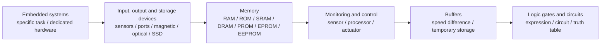
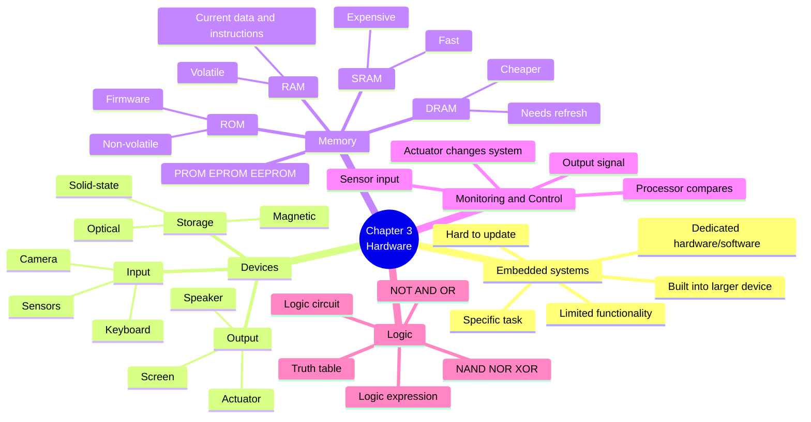
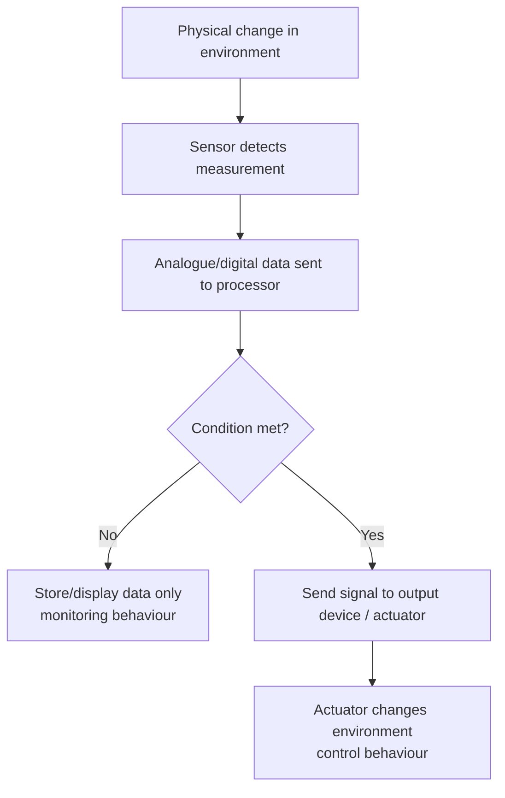

# AS 9618 Computer Science — Chapter 3 Updated Notes
## Hardware｜Syllabus-Aligned Paper 1 Revision Sheet

> **Version:** Syllabus-aligned revision; informed by recent Paper 1 patterns  
> **Target:** Cambridge International AS & A Level Computer Science 9618  
> **Chapter:** 3 Hardware  
> **Main audience:** Students  
> **Style:** 中文解释 + English keywords / mark scheme style phrases  
> **Docsify:** ready  
> **File name:** `chapter-3.md`

---

# 0. How to Use This Sheet

本章是 AS Paper 1 里面非常容易“看起来会，写出来不给分”的章节。  
2024 和 2025 的考法都说明：Chapter 3 不是只背硬件名字，而是要会把硬件知识放进 **scenario 场景题** 里解释。

本章复习顺序建议：



---

# 1. Recent Paper 1 Pattern Map

| Area | Recent exam pattern | What students must practise |
| --- | --- | --- |
| Logic gates / circuits | Very high | Write expressions from circuits, complete truth tables, recognise NOT / AND / OR / NAND / NOR / XOR |
| Embedded systems | High | Explain why a device is embedded; describe drawbacks, firmware update difficulty, limited function |
| Sensors + monitoring/control | High | Choose correct sensor; explain whether system is monitoring or control |
| RAM / ROM / flash memory | High | Current data/instructions, firmware/start-up instructions, solid-state storage, NAND/NOR/floating/control gates |
| SRAM vs DRAM | Medium-high | Cost, density, refresh, speed; explain advantages/disadvantages |
| PROM / EPROM / EEPROM | Medium | One-time write, UV erasing, electrical erasing, in-circuit update |
| Secondary storage operation | High | Magnetic hard disk, optical disc, SSD/flash principles |
| Buffer use | High | Temporary storage between devices/processes with different speeds |
| Ports and peripheral connection | Medium | USB automatic connection / HDMI benefits |
| Monitoring/control system wording | Medium-high | Input → processing → output; actuator changes environment |
| Detailed electronics beyond syllabus | Low | Do not over-teach transistor-level circuits except required SSD flash gate terms |
| Multi-input / simplified Boolean algebra | Low for AS Chapter 3 | Keep as awareness only; deeper simplification is more A2/Chapter 15 style |

---

# 2. Content Update Decision

## 2.1 Keep and Strengthen

| Kept content | Reason |
| --- | --- |
| Embedded system definition and drawbacks | 2024 tested doorbell / embedded system features; 2025 still uses scenario-based hardware |
| Sensors and actuators | 2024 and 2025 use security/shop systems with real-world sensors |
| Monitoring vs control | Repeated scenario distinction; students often write too vaguely |
| RAM / ROM / SRAM / DRAM | 2024 tested DRAM vs SRAM and ROM/storage in embedded context; 2025 tested RAM effect on performance |
| PROM / EPROM / EEPROM | 2024 tested EPROM vs EEPROM directly |
| Magnetic, optical, solid-state storage | 2024/2025 tested principal operation of storage devices |
| Buffers | 2024 and 2025 mark schemes reward “speed difference” and “temporary storage” wording |
| Logic gates, expressions, circuits, truth tables | 2025 Paper 1 opened with logic expressions/truth tables; very high frequency |
| Port examples: USB, HDMI | 2024/2025 tested automatic connection and HDMI/peripheral connection |

## 2.2 Downweight

| Downweighted content | Why |
| --- | --- |
| Very detailed electronic circuit design | Usually not needed for AS Paper 1 answers |
| Long lists of obscure sensors | Students need common sensor-choice vocabulary, not memorising every possible sensor |
| Detailed SSD wear-levelling algorithms | Not commonly rewarded in Paper 1 |
| Multi-input gate theory | AS usually uses two-input logic gates and drawn circuits |
| Deep Boolean algebra simplification | More relevant to A2 Boolean algebra; AS focuses expression/circuit/truth table |

## 2.3 Remove / Avoid

| Avoid this | Reason |
| --- | --- |
| Saying “monitoring system has outputs so it is control” automatically | Wrong. Need whether output affects the environment/input |
| Saying “RAM stores everything permanently” | RAM is volatile |
| Saying “ROM is main working memory” | ROM stores firmware/start-up instructions |
| Saying “buffer makes CPU faster” | Buffer handles speed mismatch / temporary storage |
| Using brand names for ports or devices | Cambridge gives no marks for brand names |

---

# 3. One-Page Mind Map



---

# 4. Syllabus Checklist

| Syllabus area | What to know | Revision priority |
| --- | --- | --- |
| 3.1 Computers and their components | Input/output/storage devices, embedded systems, main memory, secondary storage, ports, buffers, monitoring/control | Very high |
| 3.2 Logic Gates and Logic Circuits | Logic gate symbols, truth tables, logic expressions, logic circuits | Very high |

---

# 5. 3.1 Computers and Their Components

## 5.1 Embedded systems

### Definition

> An embedded system is a computer system built into a larger device, designed to perform a specific / dedicated task.

中文理解：  
嵌入式系统不是一台“通用电脑”，而是放在某个设备里面，只负责几个固定任务。比如 smart doorbell、washing machine、car braking system、microwave controller。

### Mark scheme keywords

+ **built into a larger device**
+ **specific task**
+ **dedicated hardware**
+ **dedicated software / firmware**
+ **limited processing requirements**
+ **limited functionality**

### Good answer structure

> The device is an embedded system because the processor, memory and software are built into the device and are dedicated to a specific task, such as detecting motion / recording video / controlling the device.

### Drawbacks of embedded systems

| Drawback | Mark scheme style explanation |
| --- | --- |
| difficult to update | firmware cannot be easily changed by the user |
| difficult to repair | troubleshooting may need a specialist |
| limited functionality | designed for one task, not easily adapted |
| may become e-waste | faulty/outdated devices are often thrown away |
| security issue | if not updated, vulnerabilities may remain |

### Common weak answer

> It is small and cheap.

This may be true in some cases, but it does not prove “embedded”. Use **specific task / built-in / dedicated**.

---

## 5.2 Input, output and storage devices

### Input devices

| Device | Data captured |
| --- | --- |
| Keyboard | key presses / text |
| Mouse / touchpad | pointer movement / selection |
| Camera | image / video |
| Microphone | sound |
| Scanner | image of a document |
| Sensor | physical measurement from environment |

### Output devices

| Device | Output |
| --- | --- |
| Monitor / screen | visual output |
| Speaker | sound |
| Printer | hard copy |
| Actuator | physical movement / action |
| Light / LED | visual signal |

### Storage devices

| Device type | Examples | Main idea |
| --- | --- | --- |
| Magnetic | HDD | uses magnetised areas on platters |
| Optical | CD / DVD / Blu-ray | uses laser and reflective surface |
| Solid-state | SSD / flash drive | uses electronic circuits, no moving parts |

---

## 5.3 Sensors

### Common sensors and uses

| Scenario | Suitable sensor | Why |
| --- | --- | --- |
| Door is open / closed | contact / magnetic sensor | detects whether contact is broken |
| Light level is low | light sensor | measures brightness / light intensity |
| Person detected nearby | infrared / motion / proximity sensor | detects movement or distance |
| Item removed from shelf | pressure sensor | detects change in weight / pressure |
| Beam broken by object | infrared sensor | detects interruption of beam |
| Temperature changes | temperature sensor | measures heat / temperature |
| Sound level too high | sound sensor / microphone | detects sound amplitude |

### Exam answer pattern

> A **pressure sensor** can be used because when the item is removed, the pressure / weight on the shelf decreases. The system can use this change to identify that an item has been taken.

---

## 5.4 Monitoring systems vs control systems

### Monitoring system

> A monitoring system collects data from sensors and may store, display or transmit the data, but it does not automatically change the environment being measured.

### Control system

> A control system collects data from sensors, processes it, and sends a signal to an actuator / output device to change the environment or system.

### Key difference

| Type | What happens |
| --- | --- |
| Monitoring | sensor data is observed / stored / transmitted |
| Control | sensor data causes an action that changes something |

### Mark scheme style

> This is a control system because the sensor data is processed and used to send a signal to an output device / actuator, such as turning on a light or sounding an alarm.

### Common mistake

| Student writes | Why weak |
| --- | --- |
| “It has sensors, so it is monitoring.” | Control systems also use sensors. |
| “It has output, so it is control.” | Need to say the output changes the system/environment. |
| “It analyses data.” | Both monitoring and control may process data. |

---

## 5.5 Actuators

### Definition

> An actuator is an output device that converts a control signal into physical movement or action.

### Examples

| Actuator / output | Action |
| --- | --- |
| motor | opens door / turns fan |
| heater | increases temperature |
| valve | controls water/gas flow |
| speaker / alarm | sounds warning |
| light | turns on/off |

---

## 5.6 Buffers

### Definition

> A buffer is an area of memory used to temporarily store data while it is being transferred between devices or processes.

### Why buffers are used

Buffers are used when:

+ devices work at different speeds
+ data arrives faster than it can be processed
+ data must be written in blocks
+ streaming needs temporary data before playback

### Mark scheme answer

> The buffer temporarily stores data because the sending device and receiving device work at different speeds. Data can be stored in the buffer until the receiving device is ready to process / write / display it.

### Examples

| Scenario | Buffer use |
| --- | --- |
| Writing to optical disc | stores data until the disc writer is ready |
| Video streaming | stores received video data before it is displayed |
| Sensor system | stores readings until processor can process them |
| Printer | stores print data while printer prints slowly |

### Common mistake

> A buffer stores data permanently.

Wrong. A buffer is **temporary storage**.

---

# 6. Memory

## 6.1 RAM and ROM

| Feature | RAM | ROM |
| --- | --- | --- |
| Full name | Random Access Memory | Read Only Memory |
| Volatile? | volatile | non-volatile |
| Stores | current data, instructions, running programs | firmware, bootstrap/start-up instructions |
| Can be changed? | read/write | normally read-only / difficult to change |
| Used for | active processing | start-up and fixed instructions |

### RAM mark scheme phrases

+ **currently running data and instructions**
+ **programs in use**
+ **volatile**
+ **faster access than secondary storage**
+ **more RAM reduces need for virtual memory**

### ROM mark scheme phrases

+ **firmware**
+ **bootstrap program**
+ **start-up instructions**
+ **non-volatile**
+ **retains contents without power**

---

## 6.2 Effect of RAM on performance

### Good answer

> More RAM allows more currently running data and instructions to be stored in main memory. This reduces the need to use virtual memory or fetch data from slower secondary storage, so there is less delay / latency.

### Weak answer

> More RAM makes the computer faster.

This is too vague. Say **why**.

---

## 6.3 SRAM vs DRAM

| Feature | SRAM | DRAM |
| --- | --- | --- |
| Full name | Static RAM | Dynamic RAM |
| Refresh needed? | no refresh needed | needs refreshing |
| Speed | faster | slower |
| Cost | more expensive | cheaper |
| Density | lower density | higher density |
| Common use | cache memory | main memory |

### DRAM advantages

+ cheaper to manufacture
+ higher density per chip
+ can store more data per chip

### DRAM disadvantages

+ needs refreshing
+ slower than SRAM
+ more power may be used due to refreshing

### SRAM advantages

+ faster access
+ no refresh needed
+ suitable for cache

### SRAM disadvantages

+ expensive
+ lower storage density

---

## 6.4 PROM, EPROM and EEPROM

| Memory type | Meaning | Key point |
| --- | --- | --- |
| PROM | Programmable ROM | programmed once only |
| EPROM | Erasable Programmable ROM | erased using ultraviolet light |
| EEPROM | Electrically Erasable Programmable ROM | erased/written using electrical signals |

### EPROM vs EEPROM

| EPROM | EEPROM |
| --- | --- |
| erased using ultraviolet light | erased using electrical signal |
| often must be removed from circuit | can usually remain in circuit |
| usually erases all data | can erase selected parts |
| less convenient | more convenient |

---

# 7. Secondary Storage

## 7.1 Magnetic hard disk

### Principal operation

A magnetic hard disk:

1. has one or more **platters**
2. platters are mounted on a **spindle**
3. platters rotate at high speed
4. a **read/write head** moves across the surface
5. data is stored using changes in **magnetic field / magnetised areas**
6. when reading, changes in magnetic field produce a change in electric current

### Mark scheme keywords

+ **platters**
+ **spindle**
+ **read/write head**
+ **magnetic field**
+ **magnetised surface**
+ **rotates at high speed**

### Advantages

+ large capacity
+ low cost per GB
+ suitable for long-term storage of large files

### Disadvantages

+ moving parts
+ slower than SSD
+ can be damaged by shock
+ more power/noise/heat

---

## 7.2 Optical storage

### Principal operation

An optical disc reader/writer:

1. uses a **laser**
2. the laser is directed onto the disc surface
3. the disc has areas with different reflectivity / pits and lands
4. reflected light is detected by a sensor
5. differences in reflection are interpreted as binary data

### Mark scheme keywords

+ **laser**
+ **reflected light**
+ **pits and lands**
+ **sensor detects reflection**
+ **binary data**

### Buffer with optical disc

> A buffer stores data temporarily before it is written to the optical disc because the computer may send data faster than the disc can write it.

---

## 7.3 Solid-state storage / flash memory

### Key features

+ no moving parts
+ faster access than magnetic storage
+ more durable
+ silent
+ lower power use
+ more expensive per GB

### Flash memory gate terms

| Term | Meaning |
| --- | --- |
| NAND / NOR gates | used to create solid-state memory devices |
| floating gate | retains electrons without power |
| control gate | allows or stops current from passing |
| cell | stores a bit / value |

### Mark scheme style

> Flash memory is non-volatile because the floating gate can retain electrons even when power is removed.

---

# 8. Ports and Peripheral Connection

## 8.1 USB

### Why USB is useful

+ widely used for peripherals
+ supports plug-and-play
+ can provide power
+ can transfer data
+ device can be automatically recognised

### Mark scheme answer

> USB supports plug-and-play. When the device is connected, the OS detects it and loads / installs the appropriate driver so it can be used automatically.

---

## 8.2 HDMI

### Why HDMI may be better than VGA

| HDMI | VGA |
| --- | --- |
| digital | analogue |
| carries video and audio | video only |
| supports higher resolution | lower quality for modern high-res displays |
| less interference | more prone to signal degradation |
| no need for separate audio cable | needs separate audio cable |

### Mark scheme style

> HDMI can transmit both video and audio, so a separate sound cable is not needed. It is a digital interface, so there is no analogue conversion loss and it can support high-resolution displays.

---

# 9. Processor-related Hardware Performance

Although detailed CPU architecture is mainly Chapter 4, recent Paper 1 questions often mix hardware performance into Chapter 3-style device comparison questions.

## 9.1 Number of cores

| More cores can help when... | Why |
| --- | --- |
| software supports parallel processing | different cores can process different tasks |
| multitasking | several processes can run at the same time |
| suitable workload | tasks can be divided between cores |

### Warning

More cores do not always mean faster performance if the software cannot use them.

---

## 9.2 Clock speed

> Clock speed is the number of cycles per second. Higher clock speed may allow more instructions to be processed per second.

### Weak answer

> Higher GHz is better.

Better:

> A higher clock speed means more clock cycles per second, so the processor may fetch/decode/execute instructions more quickly.

---

## 9.3 Bus width

| Bus | Effect |
| --- | --- |
| Data bus | wider data bus transfers more data at one time |
| Address bus | wider address bus allows more memory locations to be directly addressed |
| Control bus | carries control signals |

### Recent exam-style answer

> A wider data bus means more data can be transferred between components at one time, reducing delay. A wider address bus means more memory locations can be addressed directly.

---

# 10. 3.2 Logic Gates and Logic Circuits

## 10.1 Basic gates

| Gate | Meaning | Output is 1 when... |
| --- | --- | --- |
| NOT | inversion | input is 0 |
| AND | both conditions | both inputs are 1 |
| OR | at least one | one or both inputs are 1 |
| NAND | NOT AND | not both inputs are 1 |
| NOR | NOT OR | both inputs are 0 |
| XOR | exclusive OR | inputs are different |

---

## 10.2 Truth tables

### NOT

| A | X |
| --- | --- |
| 0 | 1 |
| 1 | 0 |

### AND

| A | B | X |
| --- | --- | --- |
| 0 | 0 | 0 |
| 0 | 1 | 0 |
| 1 | 0 | 0 |
| 1 | 1 | 1 |

### OR

| A | B | X |
| --- | --- | --- |
| 0 | 0 | 0 |
| 0 | 1 | 1 |
| 1 | 0 | 1 |
| 1 | 1 | 1 |

### NAND

| A | B | X |
| --- | --- | --- |
| 0 | 0 | 1 |
| 0 | 1 | 1 |
| 1 | 0 | 1 |
| 1 | 1 | 0 |

### NOR

| A | B | X |
| --- | --- | --- |
| 0 | 0 | 1 |
| 0 | 1 | 0 |
| 1 | 0 | 0 |
| 1 | 1 | 0 |

### XOR

| A | B | X |
| --- | --- | --- |
| 0 | 0 | 0 |
| 0 | 1 | 1 |
| 1 | 0 | 1 |
| 1 | 1 | 0 |

---

## 10.3 Writing logic expressions from a circuit

### Method

1. Label each gate output.
2. Work from left to right.
3. Write the expression for each intermediate output.
4. Combine carefully using brackets.
5. Do not ignore NOT bubbles.

### Example

If:

```text
X = A AND (NOT B OR C)
```

Then write:

```text
X = A AND (NOT B OR C)
```

or in symbolic form:

```text
X = A . (B̅ + C)
```

### Mark scheme style

Cambridge accepts word-form expressions such as:

+ `A AND B`
+ `A OR NOT B`
+ `(A XOR B) NAND C`

---

## 10.4 Completing truth tables for complex expressions

Example:

```text
X = (A OR B) XOR (B OR C)
```

Recommended working columns:

| A | B | C | A OR B | B OR C | X |
| --- | --- | --- | --- | --- | --- |
| 0 | 0 | 0 | 0 | 0 | 0 |
| 0 | 0 | 1 | 0 | 1 | 1 |
| 0 | 1 | 0 | 1 | 1 | 0 |
| 0 | 1 | 1 | 1 | 1 | 0 |
| 1 | 0 | 0 | 1 | 0 | 1 |
| 1 | 0 | 1 | 1 | 1 | 0 |
| 1 | 1 | 0 | 1 | 1 | 0 |
| 1 | 1 | 1 | 1 | 1 | 0 |

### Common method error

Students often calculate `XOR` as normal `OR`.  
Remember:

```text
XOR = 1 only when inputs are different
```

---

## 10.5 Drawing logic circuits from expressions

### Method

For:

```text
X = (A AND B) OR (NOT C)
```

Draw:

1. A and B into AND gate.
2. C into NOT gate.
3. Outputs of AND and NOT into OR gate.
4. Output is X.

### Exam warning

+ Use the correct gate symbol.
+ Connect all inputs.
+ Put NOT before the correct variable.
+ Use brackets to decide gate order.

---

# 11. Mark Scheme Keywords

## Embedded systems

+ built into a larger device
+ dedicated task
+ specific task
+ dedicated processor / memory / software
+ limited functionality
+ firmware difficult to update
+ specialist repair

## Sensors and control

+ sensor detects / measures
+ data is input to processor
+ processor compares with stored value
+ signal sent to output device / actuator
+ changes the environment / system
+ monitoring does not affect input/environment

## Memory

+ RAM stores current data and instructions
+ volatile
+ ROM stores firmware / bootstrap / start-up instructions
+ non-volatile
+ SRAM faster / more expensive / no refresh
+ DRAM cheaper / higher density / needs refresh

## Storage

+ magnetic platters
+ spindle
+ read/write head
+ magnetic field
+ laser
+ reflected light
+ pits and lands
+ floating gate
+ control gate
+ NAND / NOR

## Buffers

+ temporary storage
+ different speeds
+ stores data until device/process is ready
+ prevents data loss / reduces waiting

## Logic

+ AND / OR / NOT / NAND / NOR / XOR
+ NOT means invert
+ XOR means inputs are different
+ truth table
+ intermediate working columns
+ brackets show order

---

# 12. Common Mistakes 易错表

| Mistake | Why it loses marks | Correct version |
| --- | --- | --- |
| “Embedded system is a small computer.” | Too vague | built into a larger device and performs a specific task |
| “RAM stores files permanently.” | RAM is volatile | RAM stores current data/instructions while in use |
| “ROM is same as RAM but cannot be changed.” | Not enough | ROM is non-volatile and stores firmware/start-up instructions |
| “DRAM is better because it has dynamic.” | Meaningless | DRAM is cheaper/higher density but needs refresh and is slower |
| “Buffer speeds up the computer.” | Too vague | buffer stores data temporarily when devices work at different speeds |
| “Monitoring system controls sensors.” | Wrong | monitoring collects/stores/displays data; control changes environment |
| “XOR is same as OR.” | Wrong truth table | XOR outputs 1 only when inputs are different |
| Missing brackets in logic expression | Can change meaning | write brackets around each sub-expression |
| “SSD stores data magnetically.” | Wrong storage principle | SSD uses flash memory/electronic circuits |
| “Optical disc uses magnetism.” | Wrong | optical disc uses laser/reflected light |

---

# 13. Scenario Answer Bank

## 13.1 Embedded smart doorbell

> This is an embedded system because the processor, memory and software are built into the doorbell and are dedicated to specific tasks such as motion detection, video recording and sending notifications. It is not a general-purpose computer.

## 13.2 Security light system

> This is a control system because sensor readings are processed and used to send a signal to turn on the floodlight. The output changes the environment by increasing the light level.

## 13.3 Temperature monitoring system

> This is a monitoring system if it only records or displays the temperature readings. It becomes a control system if the processor uses the readings to switch on a fan/heater through an actuator.

## 13.4 Buffer for optical writing

> The buffer temporarily stores data before it is written to the optical disc because the computer may send data faster than the disc writer can write it. The data remains in the buffer until the writer is ready.

## 13.5 More RAM

> More RAM allows more currently running programs, data and instructions to be stored in main memory. This reduces the need to use virtual memory or access slower secondary storage, reducing delay.

## 13.6 Wider data bus

> A wider data bus allows more data to be transferred between components at one time, so there may be less delay when data is fetched or transferred.

## 13.7 USB automatic connection

> USB supports plug-and-play. When the device is connected, the OS detects it and loads the required driver, allowing the device to be used automatically.

## 13.8 HDMI instead of VGA

> HDMI is digital and can carry both video and audio. It supports high-resolution displays and does not need a separate audio cable, unlike VGA.

## 13.9 Sensor on shop shelf

> A pressure sensor can detect that the pressure/weight on the shelf has decreased when an item is removed. This data is sent to the system so it can identify the item taken.

## 13.10 Logic expression answer

> Work from left to right. Give each gate an intermediate expression, then combine them with brackets. For example: `X = (A AND NOT B) OR C`.

---

# 14. Process Diagram



---

# 15. Logic Circuit Working Process


---

# 16. 10 Marks Quick Check

## Questions

1. Define an embedded system. [2]  
2. Give one drawback of an embedded system. [1]  
3. State what RAM stores while a program is running. [1]  
4. Give one difference between SRAM and DRAM. [1]  
5. State why a buffer is used when writing data to a slow storage device. [1]  
6. Identify a suitable sensor to detect whether a door is open. [1]  
7. State the output of `1 XOR 1`. [1]  
8. State the output of `1 NAND 1`. [1]  
9. Explain why HDMI can be better than VGA for a monitor with speakers. [1]

## Answers

1. Built into a larger device [1], performs a specific/dedicated task [1].  
2. Difficult to update / limited functionality / specialist repair / e-waste [1].  
3. Current data and instructions / currently running programs [1].  
4. SRAM is faster / more expensive / no refresh; DRAM is cheaper / higher density / needs refresh [1].  
5. It temporarily stores data because devices work at different speeds [1].  
6. Contact sensor / magnetic sensor [1].  
7. `0` [1].  
8. `0` [1].  
9. HDMI can carry audio and video / is digital / supports high resolution [1].

---

# 17. 20 Marks Exam-Style Practice with Mark Scheme

## Question 1: Embedded system and sensors [6]

A smart security doorbell has a camera, motion sensor, speaker and network connection. It detects movement and sends a video notification to a user’s phone.

(a) Explain why the smart doorbell is an embedded system. [2]  
(b) Identify a suitable sensor for detecting movement near the door. [1]  
(c) Explain whether the doorbell is a monitoring system or a control system. [3]

### Mark scheme

(a) Built into a larger device / doorbell [1], performs specific tasks such as motion detection / video recording / notification [1].  
(b) Infrared / motion / proximity sensor [1].  
(c) Award up to [3]:  
+ monitoring if it records/transmits video without affecting the sensor input [1]  
+ control if it processes data and sends a signal to an output device such as speaker/light [1]  
+ must justify using the given scenario: data from sensor causes output/action or only records/transmits [1]

---

## Question 2: Memory and storage [6]

A computer has 2 GB RAM, ROM, a magnetic hard disk and a USB flash drive.

(a) Explain how more RAM can improve performance. [3]  
(b) Describe the principal operation of a magnetic hard disk. [3]

### Mark scheme

(a) Award up to [3]:  
+ more current data/instructions/programs can be stored in main memory [1]  
+ less need for virtual memory / secondary storage access [1]  
+ secondary storage has slower access time, so there is less delay/latency [1]

(b) Award up to [3]:  
+ platters are magnetised and rotate on a spindle [1]  
+ read/write head moves across the surface [1]  
+ changes in magnetic field are detected / used to read binary data [1]

---

## Question 3: Buffers and ports [4]

A computer writes sensor readings to an optical disc. The computer also connects to a monitor with built-in speakers.

(a) Explain why a buffer may be used when writing to the optical disc. [2]  
(b) Explain one benefit of using HDMI to connect the monitor instead of VGA. [2]

### Mark scheme

(a) Temporary storage [1] because the computer and optical disc writer work at different speeds / data is stored until writer is ready [1].  
(b) HDMI carries audio and video so no separate audio cable is needed [1] OR HDMI is digital / supports higher resolution [1], with a clear comparison to VGA [1].

---

## Question 4: Logic gates [4]

Complete the truth table for:

```text
X = (A AND NOT B) OR (B XOR C)
```

| A | B | C | X |
| --- | --- | --- | --- |
| 0 | 0 | 0 |   |
| 0 | 0 | 1 |   |
| 0 | 1 | 0 |   |
| 0 | 1 | 1 |   |
| 1 | 0 | 0 |   |
| 1 | 0 | 1 |   |
| 1 | 1 | 0 |   |
| 1 | 1 | 1 |   |

### Mark scheme

| A | B | C | X |
| --- | --- | --- | --- |
| 0 | 0 | 0 | 0 |
| 0 | 0 | 1 | 1 |
| 0 | 1 | 0 | 1 |
| 0 | 1 | 1 | 0 |
| 1 | 0 | 0 | 1 |
| 1 | 0 | 1 | 1 |
| 1 | 1 | 0 | 1 |
| 1 | 1 | 1 | 0 |

Award [2] for first four rows correct and [2] for second four rows correct.

---

