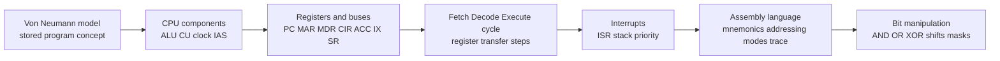
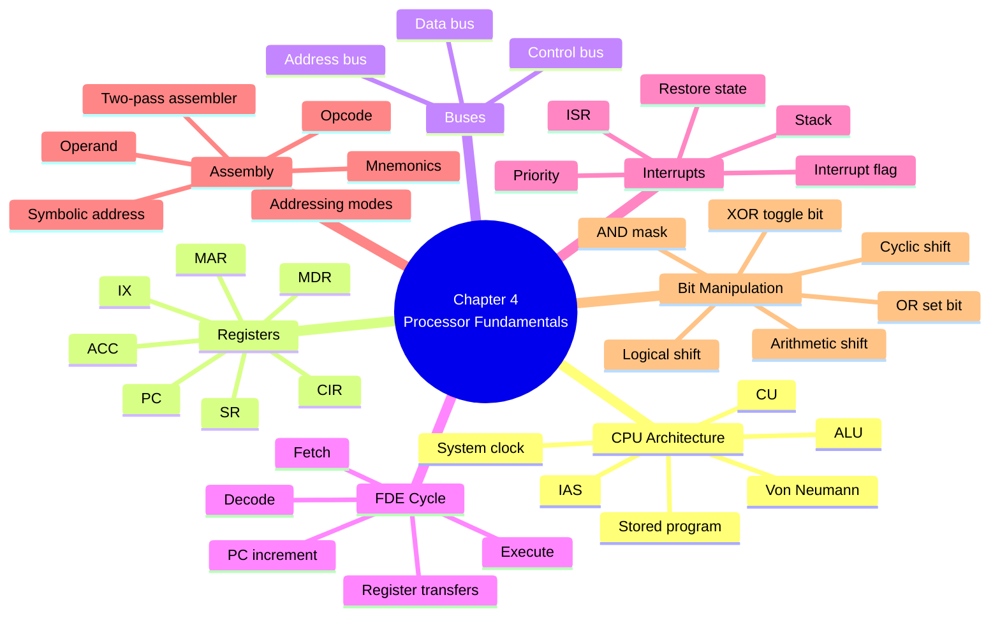
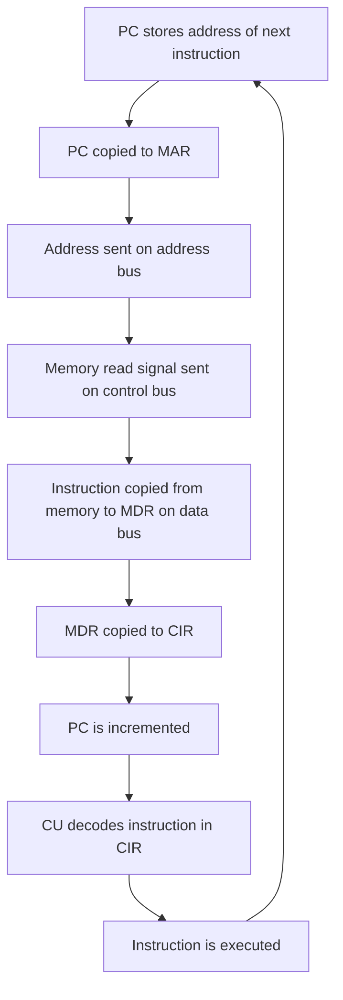
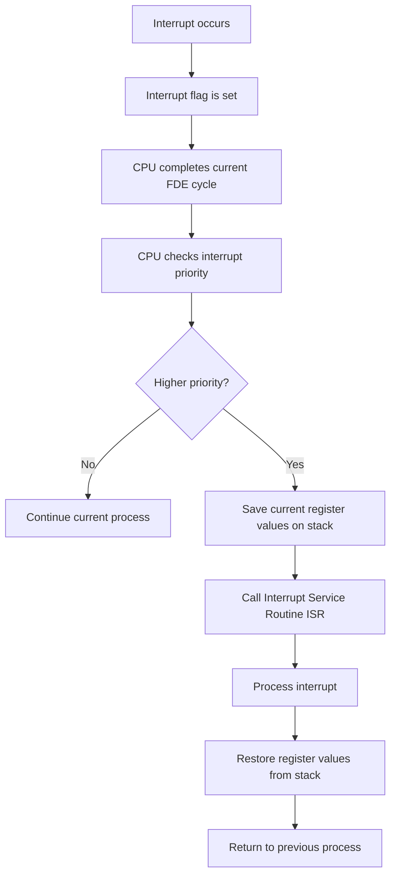
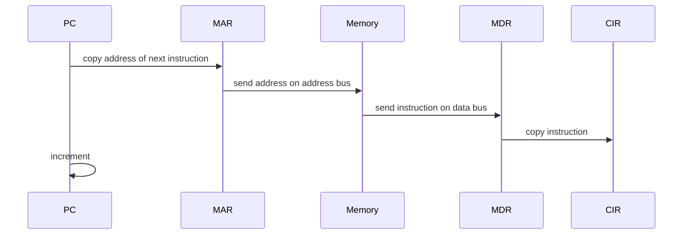
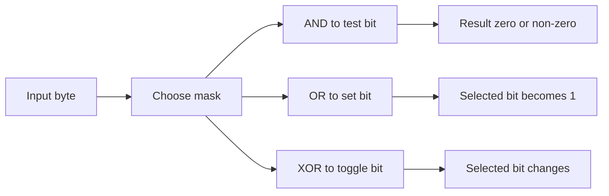

# AS 9618 Chapter 4: Processor Fundamentals
## Processor Fundamentals｜Syllabus-Aligned Paper 1 Revision Sheet

> **Version:** Syllabus-aligned revision; informed by recent Paper 1 patterns  
> **Target:** Cambridge International AS & A Level Computer Science 9618  
> **Main audience:** AS students preparing for Paper 1 Theory Fundamentals  
> **Style:** 中文解释 + English keywords / mark scheme phrases  
> **Docsify:** ready for static webpage display  
> **Local images:** not required  

---

# 0. How to Use This Sheet

Chapter 4 是 AS 9618 Paper 1 里非常容易“看起来会、实际丢分”的章节。  
本章不是只背 CPU 名词，而是要会：

1. **说清楚 register 的 role**  
2. **按顺序写 fetch-decode-execute cycle**  
3. **区分 address bus / data bus / control bus**  
4. **trace assembly code**  
5. **判断 addressing mode**  
6. **做 bit manipulation / masking / shifting**

建议复习顺序：



---

# 1. Recent Paper 1 Pattern Map

| Area | Recent exam pattern | What students must practise |
| --- | --- | --- |
| Assembly trace table | Very high | Follow instruction addresses, update ACC / memory after each instruction, handle jumps correctly |
| Bit manipulation instructions | Very high in 2025 | Use OR to set bits, AND to clear/test bits, XOR to toggle bits, LSL/LSR shifts |
| Addressing modes | Very high | Immediate `#n`, direct `<address>`, indirect `LDI`, indexed `LDX`, relative branch/jump |
| CPU registers | High | PC, MAR, MDR, CIR, ACC, IX, SR roles; avoid vague definitions |
| Status Register | High | Status flags / bits such as zero, carry, overflow, negative; do not only say “stores status” |
| General vs special purpose registers | High in 2024 | Explain fixed CPU role vs general temporary storage |
| Buses and bus width | High in 2025 | Wider data bus transfers more data at once; wider address bus accesses more memory locations |
| Processor performance | High | clock speed, cores, cache, bus width, RAM; explain performance effect, not just list |
| Fetch-decode-execute cycle | Medium-high | Register transfer notation, PC increment, MAR/MDR/CIR sequence |
| Interrupts | Medium | interrupt flag, priority check, stack/register saving, ISR, restore previous state |
| Two-pass assembler | Medium | symbol table, addresses, opcodes, syntax/error checking |
| Peripheral ports | Medium | USB, HDMI, VGA; link features to scenario |
| Deep electronics inside ALU | Low | Know purpose only; detailed circuit design rarely gains marks in Chapter 4 |

## 1.1 2024–2025 exam evidence used

| Paper trend | What changed in this regenerated version |
| --- | --- |
| 2024 Paper 1 used register purpose / Status Register / general-purpose vs special-purpose register style questions | Register definitions now use exact mark-scheme phrases and weak-answer warnings |
| 2024 Paper 1 used instruction-set questions with `ACC` and `IX` | Assembly trace section is kept as a core skill, not an optional extension |
| 2025 Paper 1 Question 8 used an instruction-set trace table with `LDD`, `INC`, `STO`, `LDI`, `CMP`, `JPE`, `ADD`, `JMP`, `DEC` | Added stronger trace-table method and jump/compare warning |
| 2025 Paper 1 Question 8 also tested bit manipulation instructions: set least significant bit, `XOR &FE`, `LSR #5` | Bit manipulation is upgraded to very high priority |
| 2025 Paper 1 tested bus width and performance | Bus-width explanation now focuses on data bus vs address bus effect |

---

# 2. Content Update Decision

## 2.1 Keep and Strengthen

| Content | Why it must stay |
| --- | --- |
| Von Neumann model | Core architecture concept; links to stored program and FDE |
| PC, MAR, MDR, CIR, ACC, IX, SR | Very common short-answer / table completion topic |
| ALU, CU, system clock, IAS | Repeated CPU component definitions |
| Address bus, data bus, control bus | Frequently confused; needed for FDE explanations |
| FDE cycle register transfers | High-frequency sequence question |
| Interrupt handling | Mark schemes reward exact sequence and ISR terminology |
| Processor performance factors | Common “explain why” question |
| Assembly instruction tracing | Very high recent Paper 1 trend |
| Addressing modes | Appears through instruction-set questions |
| Bitwise AND/OR/XOR and shifts | Can be tested as calculation and control-device scenario |

## 2.2 Downweight

| Downweighted content | Why |
| --- | --- |
| Very detailed CPU manufacturing / transistor-level design | Not needed for AS Paper 1 marks |
| Long history of Von Neumann architecture | Only stored-program idea matters |
| Memorising uncommon real assembly instruction names | Use exam-provided instruction set |
| Deep compiler theory inside assembly chapter | Language translators are mainly Chapter 5 |
| Complex Boolean algebra simplification beyond AS scope | Logic gates are Chapter 3; Chapter 4 focuses bit manipulation |
| Overly advanced pipeline / branch prediction detail | A Level processors go deeper later; AS expects performance factors only |

## 2.3 Delete / Avoid

| Avoid learning as core | Reason |
| --- | --- |
| “CPU speed = clock speed only” | Wrong. Cores, cache, bus width, architecture also matter |
| “A dual-core CPU is always twice as fast” | False; depends on software, parallelism, OS scheduling |
| “Status register just stores status” | Too vague; must mention flags / bits |
| “General purpose register is for general things” | Examiner reports dislike name-repeating answers |
| “Assembly is the same as machine code” | Assembly uses mnemonics; machine code is binary |

---

# 3. One-Page Mind Map



---

# 4. 4.1 Central Processing Unit Architecture

## 4.1 Von Neumann model

### Core idea

Von Neumann architecture 的核心是 **stored program concept**：

> Program instructions and data are stored in the same main memory and are fetched, decoded and executed by the CPU.

中文理解：

+ 程序指令和数据都放在 main memory / IAS 中。
+ CPU 一条一条取出指令。
+ 每条指令经过 fetch → decode → execute。
+ 同一套 buses 用来传输地址、数据和控制信号。

### Mark scheme keywords

+ **stored program concept**
+ **instructions and data stored in memory**
+ **main memory / IAS**
+ **fetched, decoded and executed**
+ **CPU**
+ **buses**

### Common weak answer

> Von Neumann is a computer model.

Too vague. 必须说出 **stored program** 和 **instructions/data in same memory**。

---

## 4.2 CPU main components

| Component | Chinese explanation | Mark scheme style phrase |
| --- | --- | --- |
| ALU | 进行算术和逻辑运算 | carries out arithmetic and logical operations |
| CU | 控制 CPU 内部数据流和指令执行 | controls and coordinates the operation of the CPU |
| System clock | 产生 timing signals，让操作同步 | provides timing signals to synchronise CPU operations |
| IAS / main memory | 存放当前正在使用的程序和数据 | stores programs and data currently in use |
| Registers | CPU 内部非常快的小存储位置 | small high-speed storage locations inside the CPU |

### ALU

ALU = **Arithmetic Logic Unit**

It carries out:

+ arithmetic operations: `ADD`, `SUBTRACT`, increment, decrement
+ logical operations: `AND`, `OR`, `XOR`, `NOT`
+ comparisons: greater than, equal to, less than

### CU

CU = **Control Unit**

Mark scheme answer:

> The control unit decodes instructions and sends control signals to coordinate the movement of data and the execution of instructions.

### System clock

Mark scheme answer:

> The system clock generates timing pulses / timing signals used to synchronise processor operations.

Do not write:

> The clock tells the time.

That is not computer science meaning.

---

# 5. Registers

## 5.1 Register summary table

| Register | Full name | Main role |
| --- | --- | --- |
| PC | Program Counter | stores the address of the next instruction to be fetched |
| MAR | Memory Address Register | stores the address of the memory location being accessed |
| MDR | Memory Data Register | stores data/instruction being transferred to or from memory |
| CIR | Current Instruction Register | stores the current instruction being decoded/executed |
| ACC | Accumulator | stores results of calculations / intermediate values |
| IX | Index Register | stores an offset used in indexed addressing |
| SR | Status Register | stores status flags as individual bits |
| IR / Interrupt Register | Interrupt Register | stores interrupt flags / identifies interrupt requests |

---

## 5.2 PC — Program Counter

### Role

> The PC stores the address of the next instruction to be fetched.

### During FDE

1. PC holds address of next instruction.
2. Address is copied from PC to MAR.
3. PC is incremented so it points to the next instruction.

### Common mistake

| Wrong answer | Why weak |
| --- | --- |
| PC stores the current instruction | That is CIR |
| PC stores the program | Program is in memory |
| PC counts programs | Too vague |

---

## 5.3 MAR — Memory Address Register

### Role

> The MAR stores the address of the memory location that is about to be read from or written to.

### Bus link

+ MAR sends the address onto the **address bus**.
+ Address bus is usually **one-directional** from CPU to memory.

---

## 5.4 MDR — Memory Data Register

### Role

> The MDR stores the data or instruction being transferred between the CPU and memory.

### Bus link

+ MDR is connected to the **data bus**.
+ Data bus is **bi-directional** because data can move CPU → memory or memory → CPU.

---

## 5.5 CIR — Current Instruction Register

### Role

> The CIR stores the instruction currently being decoded and executed.

### Common mistake

Do not confuse:

| Register | Stores |
| --- | --- |
| PC | address of next instruction |
| MAR | memory address being accessed |
| MDR | data/instruction transferred |
| CIR | current instruction |

---

## 5.6 ACC — Accumulator

### Role

> The accumulator stores intermediate results and results of arithmetic or logical operations.

Example:

```text
LDM #10
ADD #5
```

After this code, ACC = 15.

---

## 5.7 IX — Index Register

### Role

> The index register stores an offset used to calculate an effective address in indexed addressing.

Example:

```text
IX = 2
LDX 14
```

If `LDX 14` means load from address `14 + IX`, then effective address = 16.

---

## 5.8 SR — Status Register

### Role

> The status register stores status flags as individual bits that show the result of an operation.

### Important flags

| Flag | Meaning |
| --- | --- |
| Zero flag | result is zero |
| Carry flag | carry produced from calculation |
| Overflow flag | result too large/small for available bits |
| Negative flag | result is negative |
| Interrupt flag | interrupt has occurred / interrupt requested |

### Mark scheme style answer

> The SR stores flags, where each flag is represented by an individual bit. These bits indicate conditions such as zero, carry, overflow, negative or interrupt status.

### Common weak answer

> The SR stores the status of the CPU.

This usually loses marks because it repeats the name. Add **flags** and **individual bits**.

---

## 5.9 General purpose vs special purpose registers

| Type | Meaning | Examples |
| --- | --- | --- |
| General purpose register | used by programmers/instructions to temporarily store different data values | R1, R2, R3 |
| Special purpose register | has a fixed role in CPU operation | PC, MAR, MDR, CIR, ACC, IX, SR |

### Mark scheme distinction

A strong answer says:

+ special purpose registers have **specific predefined roles**
+ they are used for **specific CPU functions**
+ general purpose registers can be used more flexibly to hold temporary data during program execution

Weak answer:

> General purpose is general and special purpose is special.

No marks / very weak.

---

# 6. Buses

## 6.1 Bus overview

A bus is a set of parallel wires / communication pathways used to transfer data, addresses or control signals.

| Bus | Direction | Carries | Example |
| --- | --- | --- | --- |
| Address bus | CPU → memory / I/O | address of memory location | MAR sends address 105 |
| Data bus | both directions | data or instruction | instruction copied from memory to MDR |
| Control bus | both directions | control signals | read, write, interrupt, clock signal |

---

## 6.2 Address bus

### Mark scheme answer

> The address bus carries the address of the memory location or I/O device to be accessed.

### Key points

+ Usually one-way from CPU to memory / I/O.
+ Width affects maximum addressable memory.

Example:

```text
16-bit address bus → 2^16 addresses = 65536 addresses
```

---

## 6.3 Data bus

### Mark scheme answer

> The data bus carries data or instructions between CPU, memory and I/O devices.

### Key points

+ Bi-directional.
+ Width affects how much data can be transferred at once.
+ Wider data bus can improve performance.

---

## 6.4 Control bus

### Mark scheme answer

> The control bus carries control signals used to coordinate operations, such as read, write, interrupt and clock signals.

### Common control signals

+ Memory read
+ Memory write
+ Interrupt request
+ Clock / timing signals
+ Reset

---

# 7. Fetch-Decode-Execute Cycle

## 7.1 Basic sequence

The fetch-decode-execute cycle is the repeated process used by the CPU to process instructions.



---

## 7.2 Fetch stage

### Step-by-step

1. The address of the next instruction is copied from **PC to MAR**.
2. The address is placed on the **address bus**.
3. A **memory read signal** is sent on the **control bus**.
4. The instruction is copied from memory into the **MDR** using the **data bus**.
5. The instruction is copied from **MDR to CIR**.
6. The **PC is incremented**.

### Mark scheme style phrase

> The address in the PC is copied to the MAR. The instruction at that address is fetched from memory into the MDR and then copied to the CIR. The PC is incremented.

---

## 7.3 Decode stage

The CU decodes the instruction stored in the CIR.

It identifies:

+ opcode
+ operand
+ addressing mode
+ required operation
+ registers / memory locations needed

### Example

```text
ADD #5
```

+ opcode = `ADD`
+ operand = `#5`
+ addressing mode = immediate
+ operation = add 5 to ACC

---

## 7.4 Execute stage

The CPU performs the instruction.

Examples:

| Instruction | Execute action |
| --- | --- |
| `LDM #7` | load 7 into ACC |
| `LDD 20` | copy contents of memory address 20 into ACC |
| `ADD #3` | add 3 to ACC |
| `SUB 10` | subtract contents of address 10 from ACC |
| `STO 30` | store ACC into memory address 30 |
| `JMP label` | change PC to address of label |

---

## 7.5 FDE common mistake table

| Mistake | Correction |
| --- | --- |
| Saying instruction goes directly from PC to CIR | PC stores address, not instruction |
| Forgetting MAR | MAR stores memory address for access |
| Forgetting MDR | MDR stores instruction/data transferred from memory |
| Saying PC increments before copying to MAR | Usually PC address is used first, then incremented |
| Mixing data bus and address bus | address bus carries address; data bus carries instruction/data |

---

# 8. Interrupts

## 8.1 What is an interrupt?

An interrupt is a signal that tells the processor that an event needs attention.

Examples:

+ key pressed
+ mouse clicked
+ printer needs data
+ disk operation completed
+ error occurred
+ timer event

---

## 8.2 Interrupt handling sequence



---

## 8.3 Mark scheme answer

> An interrupt flag is raised. At the end of the current fetch-execute cycle, the processor checks whether the interrupt has higher priority. If it does, the current contents of registers are saved on the stack. The appropriate ISR is called. After the interrupt is processed, the register contents are restored and control returns to the previous process.

### Must-have keywords

+ **interrupt flag**
+ **at end of current FDE cycle**
+ **priority**
+ **stack**
+ **register contents saved**
+ **ISR / interrupt service routine**
+ **restore registers**
+ **return to previous process**

---

# 9. Processor Performance

## 9.1 Factors affecting performance

| Factor | How it affects performance |
| --- | --- |
| Clock speed | more cycles per second, so more instructions may be processed per second |
| Number of cores | can process more tasks in parallel if software supports it |
| Cache size | more frequently used data/instructions stored close to CPU |
| Cache speed | faster access than RAM |
| Bus width | more bits transferred at once |
| Word length | more bits processed in one operation |
| Processor architecture | more efficient instruction execution |
| RAM size | less need to use slower secondary storage / virtual memory |

---

## 9.2 Clock speed

Clock speed is measured in Hz.

Example:

```text
2.1 GHz = 2.1 billion cycles per second
4.0 GHz = 4.0 billion cycles per second
```

### Mark scheme answer

> A higher clock speed means more clock cycles per second, so more instructions can be fetched/decoded/executed per second.

---

## 9.3 Multiple cores

A core is an independent processing unit inside the CPU.

### Why dual-core is not always twice as fast

Strong answer:

> A dual-core processor can run tasks in parallel, but the program must be written to use multiple cores. Some tasks are sequential and cannot be split. The operating system and other processes also create overhead, so performance is not exactly doubled.

### Mark scheme keywords

+ **parallel processing**
+ **software must support multiple cores**
+ **tasks may be sequential**
+ **overhead**
+ **operating system scheduling**
+ **shared resources**

---

# 10. Assembly Language

## 10.1 Assembly language vs machine code

| Feature | Assembly language | Machine code |
| --- | --- | --- |
| Form | mnemonics and labels | binary instructions |
| Readability | easier for humans | directly executed by processor |
| Translation | needs assembler | no translation needed |
| Example | `LDM #10` | binary opcode + operand |

### Mark scheme answer

> Assembly language uses mnemonics and symbolic addresses. It must be translated by an assembler into machine code, which is binary and can be executed by the processor.

---

## 10.2 Instruction format

Most assembly instructions contain:

```text
OPCODE OPERAND
```

| Part | Meaning |
| --- | --- |
| Opcode | operation to perform |
| Operand | value, register or address used by the operation |

Example:

```text
ADD #5
```

+ opcode = `ADD`
+ operand = `#5`

---

## 10.3 Common instruction groups

| Group | Examples | Meaning |
| --- | --- | --- |
| Data movement | LDM, LDD, LDI, LDX, STO | move data between memory/registers |
| Arithmetic | ADD, SUB, INC, DEC | calculations |
| Logic / bitwise | AND, OR, XOR, NOT | bit manipulation |
| Branching | JMP, JPN, JPZ | change flow of execution |
| Compare | CMP | compare values |
| Input/output | IN, OUT | communicate with I/O devices |

---

# 11. Addressing Modes

## 11.1 Immediate addressing

### Example

```text
LDM #10
```

### Meaning

The operand is the actual value.

> Load the value 10 into ACC.

### Keyword

+ **literal value**
+ **actual value**
+ `#`

---

## 11.2 Direct addressing

### Example

```text
LDD 10
```

### Meaning

The operand is the memory address.

> Load the contents of memory address 10 into ACC.

If memory address 10 contains 45, then ACC becomes 45.

---

## 11.3 Indirect addressing

### Example

```text
LDI 10
```

### Meaning

The operand gives an address that stores another address.

If:

```text
Memory[10] = 25
Memory[25] = 99
```

Then:

```text
LDI 10
```

loads `99` into ACC.

### Mark scheme phrase

> The address to be used is stored at the given address.

---

## 11.4 Indexed addressing

### Example

```text
IX = 3
LDX 20
```

### Meaning

Effective address = base address + index register.

```text
20 + 3 = 23
```

The contents of memory address 23 are loaded into ACC.

### Used for

+ arrays
+ tables
+ repeated data structures

---

## 11.5 Relative addressing

### Meaning

The operand gives an offset from the current PC value.

Example:

```text
JMP +4
```

means jump to an address relative to current program counter.

### Used for

+ branch instructions
+ loops
+ position-independent code

---

## 11.6 Addressing mode comparison table

| Mode | Operand represents | Example | Final action |
| --- | --- | --- | --- |
| Immediate | actual value | `LDM #5` | ACC = 5 |
| Direct | memory address | `LDD 20` | ACC = Memory[20] |
| Indirect | address containing another address | `LDI 20` | ACC = Memory[Memory[20]] |
| Indexed | base address + IX | `LDX 20` | ACC = Memory[20 + IX] |
| Relative | offset from PC | `JMP +4` | PC = PC + 4 |

---

# 12. Assembly Trace Method

## 12.1 How to trace ACC / IX questions

Use this checklist:

1. Identify starting ACC and IX.
2. Read the instruction set carefully.
3. For each instruction, decide if operand is:
   + value
   + address
   + address of address
   + address + IX
4. Update ACC or IX.
5. Do not change memory unless instruction stores data.
6. Write final ACC / IX.

---

## 12.2 Worked example

Memory:

| Address | Data |
| ---: | ---: |
| 10 | 1 |
| 11 | 3 |
| 12 | 5 |
| 13 | 11 |
| 14 | 10 |
| 15 | 16 |
| 16 | 12 |

Initial:

```text
ACC = 10
IX = 0
```

Program:

```text
LDR #2
LDX 14
ADD #2
```

Step-by-step:

| Instruction | Meaning | ACC | IX |
| --- | --- | ---: | ---: |
| Start | initial values | 10 | 0 |
| `LDR #2` | load 2 into IX | 10 | 2 |
| `LDX 14` | load Memory[14 + IX] = Memory[16] | 12 | 2 |
| `ADD #2` | ACC = 12 + 2 | 14 | 2 |

Answer:

```text
ACC = 14
IX = 2
```

---

# 13. Two-Pass Assembler

## 13.1 Why two passes?

Assembly language uses labels and symbolic addresses.  
The assembler may not know the address of a label when it first sees it.

So it uses two passes:

+ **Pass 1:** build symbol table
+ **Pass 2:** generate machine code

---

## 13.2 Pass 1

Pass 1 usually:

+ scans the source code
+ removes comments / spaces
+ records labels and their addresses
+ creates a symbol table
+ calculates addresses
+ reports some syntax errors

### Mark scheme phrase

> Pass 1 builds the symbol table by storing labels and their corresponding memory addresses.

---

## 13.3 Pass 2

Pass 2 usually:

+ replaces mnemonics with binary opcodes
+ replaces labels with addresses
+ converts operands into binary
+ generates object code / machine code
+ reports remaining errors

### Mark scheme phrase

> Pass 2 uses the symbol table to translate mnemonics and symbolic addresses into machine code.

---

# 14. Bit Manipulation

## 14.1 Why bit manipulation is used

Bit manipulation means working directly with individual bits.

It is used to:

+ check sensor states
+ set control bits
+ clear bits
+ toggle bits
+ pack multiple Boolean values into one byte
+ control hardware devices

Example:

```text
Bit 0 = door sensor
Bit 1 = light sensor
Bit 2 = motion sensor
Bit 3 = alarm output
```

---

## 14.2 Bitwise AND

### Purpose

AND is often used to **check / mask** whether a bit is 1.

Rule:

| A | B | A AND B |
| --- | --- | --- |
| 0 | 0 | 0 |
| 0 | 1 | 0 |
| 1 | 0 | 0 |
| 1 | 1 | 1 |

Example:

```text
ACC  = 10110110
Mask = 00000100
AND  = 00000100
```

Result is not zero, so bit 2 was set.

### Mark scheme phrase

> AND with a mask is used to isolate/check a specific bit.

---

## 14.3 Bitwise OR

### Purpose

OR is often used to **set a bit to 1**.

Rule:

| A | B | A OR B |
| --- | --- | --- |
| 0 | 0 | 0 |
| 0 | 1 | 1 |
| 1 | 0 | 1 |
| 1 | 1 | 1 |

Example:

```text
ACC  = 10110000
Mask = 00000100
OR   = 10110100
```

Bit 2 is set to 1.

---

## 14.4 Bitwise XOR

### Purpose

XOR is often used to **toggle** a bit.

Rule:

| A | B | A XOR B |
| --- | --- | --- |
| 0 | 0 | 0 |
| 0 | 1 | 1 |
| 1 | 0 | 1 |
| 1 | 1 | 0 |

Example:

```text
ACC  = 10110100
Mask = 00000100
XOR  = 10110000
```

Bit 2 changed from 1 to 0.

---

## 14.5 Logical shift

### Rules

| Shift | What happens |
| --- | --- |
| Logical left shift | bits move left; zeros enter on right |
| Logical right shift | bits move right; zeros enter on left |
| Bits shifted out | lost |

Example:

```text
Original: 00110110
Logical left shift 2:
11011000
```

---

## 14.6 Arithmetic shift

Arithmetic shift preserves the sign bit when shifting right.

Example:

```text
Original: 11110100
Arithmetic right shift 2:
11111101
```

The leftmost sign bit remains 1, so the number stays negative.

### Difference from logical right shift

```text
Original: 11110100

Logical right shift 2:     00111101
Arithmetic right shift 2:  11111101
```

---

## 14.7 Cyclic shift / rotate

In a cyclic shift, bits shifted out at one end re-enter at the other end.

Example:

```text
Original: 10110010
Cyclic left shift 1:
01100101
```

The leftmost `1` moves to the rightmost position.

---

# 15. Mark Scheme Keywords

## 15.1 CPU / architecture

+ **stored program concept**
+ **instructions and data stored in memory**
+ **fetch-decode-execute cycle**
+ **ALU carries out arithmetic and logical operations**
+ **CU coordinates operations / sends control signals**
+ **system clock synchronises operations**
+ **IAS stores programs and data currently in use**

## 15.2 Registers

+ **PC stores address of next instruction**
+ **MAR stores memory address being accessed**
+ **MDR stores data/instruction transferred to/from memory**
+ **CIR stores current instruction**
+ **ACC stores intermediate/result of calculation**
+ **IX stores offset for indexed addressing**
+ **SR stores status flags as individual bits**

## 15.3 Buses

+ **address bus carries memory address**
+ **data bus carries data/instructions**
+ **control bus carries control signals**
+ **read/write signal**
+ **bi-directional data bus**
+ **bus width affects amount transferred**

## 15.4 Interrupts

+ **interrupt flag is raised**
+ **checked at end of current FDE cycle**
+ **priority**
+ **register contents saved on stack**
+ **ISR called**
+ **registers restored**
+ **returns to previous process**

## 15.5 Assembly

+ **mnemonic**
+ **opcode**
+ **operand**
+ **assembler**
+ **machine code**
+ **symbol table**
+ **immediate / direct / indirect / indexed / relative addressing**

## 15.6 Bit manipulation

+ **mask**
+ **isolate a bit**
+ **set a bit**
+ **toggle a bit**
+ **logical shift**
+ **arithmetic shift**
+ **cyclic shift**
+ **bits shifted out are lost**
+ **zeros shifted in**

---

# 16. Common Mistakes 易错表

| Mistake | Why it loses marks | Correct version |
| --- | --- | --- |
| PC stores the instruction | PC stores address, not instruction | PC stores address of next instruction |
| MDR stores memory address | That is MAR | MDR stores data/instruction transferred |
| SR stores “status” only | Too vague | SR stores flags as individual bits |
| CU does calculations | ALU does calculations | CU coordinates and sends control signals |
| Data bus carries addresses | Address bus does | Data bus carries data/instructions |
| Address bus is bi-directional | Usually one-way CPU to memory | address bus carries address from CPU |
| Dual-core always twice as fast | Depends on software/tasks | can run parallel tasks if supported |
| Assembly = machine code | Assembly needs translation | assembler converts mnemonics to binary |
| `#5` means address 5 | In this syllabus, `#` usually immediate value | `#5` means literal value 5 |
| Indirect = direct | Not same | indirect uses address stored at given address |
| Indexed uses address only | Missing IX | effective address = base + IX |
| Logical right shift preserves sign | That is arithmetic right shift | logical shift inserts zeros |
| XOR sets a bit | XOR toggles if mask bit is 1 | OR sets; XOR toggles |

---

# 17. Scenario Answer Bank 场景迁移答题模板

## 17.1 “Describe the role of register X”

Template:

> The [register] stores [specific item]. It is used during [specific CPU process] to [specific action].

Example:

> The MAR stores the address of the memory location being accessed. During the fetch stage, the address from the PC is copied into the MAR and sent on the address bus.

---

## 17.2 “Explain why a dual-core CPU is not always twice as fast”

Template:

> Multiple cores allow some tasks to be processed in parallel. However, the program must be designed to split work across cores. Some tasks are sequential and cannot be parallelised. There is also OS scheduling overhead and shared resources, so performance is not exactly doubled.

---

## 17.3 “Describe the FDE cycle”

Template:

> The address of the next instruction is copied from the PC to the MAR. The address is sent on the address bus and a memory read signal is sent on the control bus. The instruction is copied from memory to the MDR using the data bus, then copied to the CIR. The PC is incremented. The CU decodes the instruction and the CPU executes it.

---

## 17.4 “Describe how an interrupt is handled”

Template:

> An interrupt flag is raised. At the end of the current fetch-execute cycle, the CPU checks the interrupt register and priority. If the interrupt has higher priority, the current register contents are saved on the stack. The relevant ISR is called. After it has run, the register contents are restored and execution returns to the previous process.

---

## 17.5 “Identify the addressing mode”

Template:

| Clue | Addressing mode |
| --- | --- |
| operand starts with `#` | immediate |
| operand is a memory address | direct |
| operand points to address that stores another address | indirect |
| operand + IX | indexed |
| operand is offset from PC | relative |

---

## 17.6 “Explain use of bitwise AND with a mask”

Template:

> A mask is chosen with 1 in the bit position to be tested. The value is ANDed with the mask. If the result is non-zero, that bit was set. If the result is zero, that bit was not set.

---

# 18. Mermaid Process Diagrams

## 18.1 Register transfer in fetch stage



## 18.2 Assembly addressing modes

```mermaid
flowchart TD
A[Operand] --> B{Starts with #?}
B -- Yes --> C[Immediate addressing<br/>operand is actual value]
B -- No --> D{Uses IX?}
D -- Yes --> E[Indexed addressing<br/>address = operand + IX]
D -- No --> F{Operand stores another address?}
F -- Yes --> G[Indirect addressing<br/>ACC = Memory[Memory[address]]]
F -- No --> H[Direct addressing<br/>ACC = Memory[address]]
```

## 18.3 Bit mask selection



---

# 19. 10 Marks Quick Check

## Questions

1. State the role of the PC. [1]  
2. State the role of the MAR. [1]  
3. Give one difference between the address bus and the data bus. [1]  
4. Name the CPU component that carries out arithmetic operations. [1]  
5. What does the system clock do? [1]  
6. In `LDM #12`, identify the addressing mode. [1]  
7. In `LDX 20`, if IX = 3, what effective address is used? [1]  
8. State one use of the status register. [1]  
9. What bitwise operation is commonly used to test a bit using a mask? [1]  
10. What is the role of an ISR? [1]

## Answers

1. Stores address of next instruction.  
2. Stores memory address being accessed.  
3. Address bus carries addresses and is usually one-way; data bus carries data/instructions and is bi-directional.  
4. ALU.  
5. Generates timing signals / synchronises CPU operations.  
6. Immediate addressing.  
7. 23.  
8. Stores status flags such as zero/carry/overflow/negative as individual bits.  
9. AND.  
10. Handles/processes an interrupt.

---

# 20. 20 Marks Exam-Style Practice with Mark Scheme

## Question 1: Registers and FDE cycle [7]

(a) State the role of each register. [3]

| Register | Role |
| --- | --- |
| PC | |
| MDR | |
| CIR | |

(b) Describe the fetch stage of the fetch-decode-execute cycle. [4]

### Mark scheme

(a)

+ PC stores address of next instruction [1]
+ MDR stores data/instruction being transferred to/from memory [1]
+ CIR stores current instruction being decoded/executed [1]

(b)

+ PC copied to MAR [1]
+ address sent to memory / on address bus and memory read signal sent [1]
+ instruction copied from memory to MDR / on data bus [1]
+ instruction copied from MDR to CIR and PC incremented [1]

---

## Question 2: Assembly trace [6]

Memory:

| Address | Data |
| ---: | ---: |
| 20 | 4 |
| 21 | 7 |
| 22 | 12 |
| 23 | 21 |
| 24 | 8 |
| 25 | 3 |

Initial values:

```text
ACC = 0
IX = 0
```

Instruction set:

| Instruction | Meaning |
| --- | --- |
| `LDM #n` | load value n into ACC |
| `LDD address` | load contents of address into ACC |
| `LDI address` | load contents of second address stored at given address into ACC |
| `LDR #n` | load value n into IX |
| `LDX address` | load contents of address + IX into ACC |
| `ADD #n` | add value n to ACC |
| `ADD address` | add contents of address to ACC |
| `SUB #n` | subtract value n from ACC |

Complete the final ACC for each program.

| Program | Code | ACC |
| --- | --- | --- |
| 1 | `LDM #20`<br>`ADD #5` | |
| 2 | `LDD 22`<br>`SUB #2` | |
| 3 | `LDI 23`<br>`ADD #1` | |
| 4 | `LDR #2`<br>`LDX 20`<br>`ADD 25` | |

### Mark scheme

Program 1:

```text
LDM #20 → ACC = 20
ADD #5 → ACC = 25
```

ACC = 25 [1]

Program 2:

```text
LDD 22 → ACC = Memory[22] = 12
SUB #2 → ACC = 10
```

ACC = 10 [1]

Program 3:

```text
LDI 23 → Memory[23] = 21, Memory[21] = 7
ACC = 7
ADD #1 → ACC = 8
```

ACC = 8 [2]

Program 4:

```text
LDR #2 → IX = 2
LDX 20 → Memory[20 + 2] = Memory[22] = 12
ADD 25 → ACC = 12 + Memory[25] = 15
```

ACC = 15 [2]

---

## Question 3: Interrupts and bit manipulation [7]

(a) A keyboard interrupt occurs while the CPU is running another process. Describe how the interrupt is handled. [5]

(b) A sensor byte is stored in ACC:

```text
ACC = 10110110
```

Bit 2 represents whether a door is open. A value of 1 means open.  
Use the mask:

```text
00000100
```

Explain how the system can test whether the door is open. [2]

### Mark scheme

(a)

+ interrupt flag is raised [1]
+ CPU completes current FDE cycle / checks at end of cycle [1]
+ checks priority / interrupt register [1]
+ saves current register contents on stack [1]
+ calls ISR and later restores register contents / returns to previous process [1]

(b)

+ AND ACC with mask `00000100` to isolate bit 2 [1]
+ result is non-zero / `00000100`, so bit 2 is 1 and the door is open [1]

---
