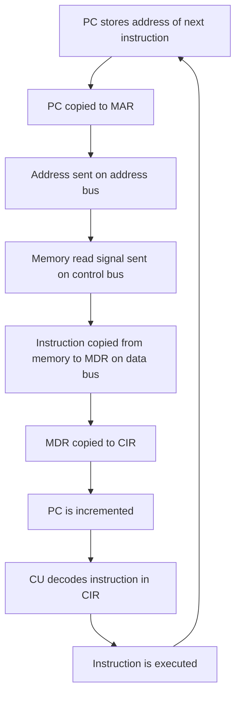
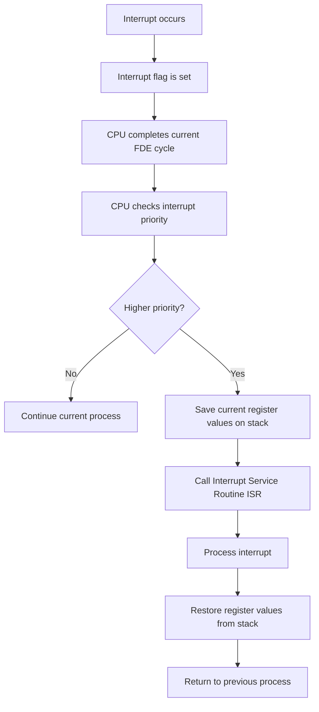
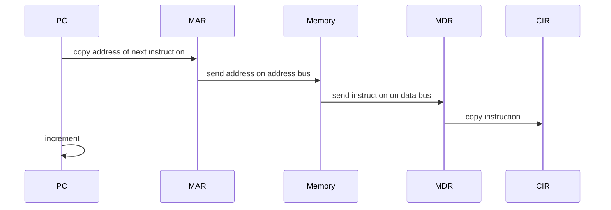
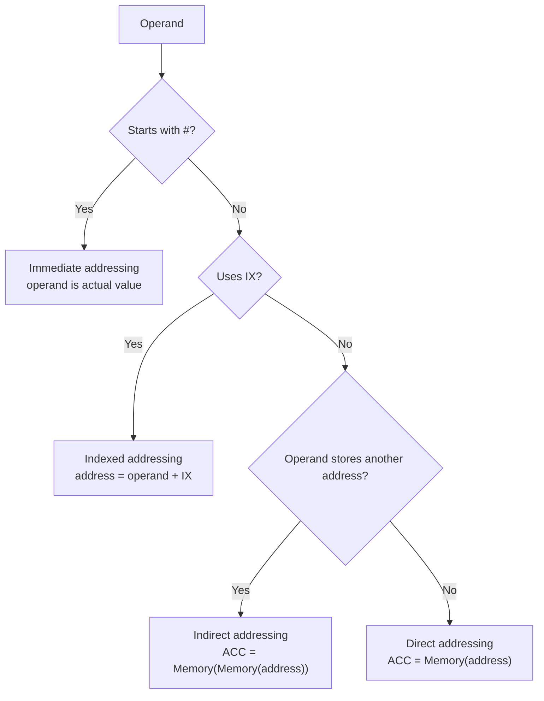
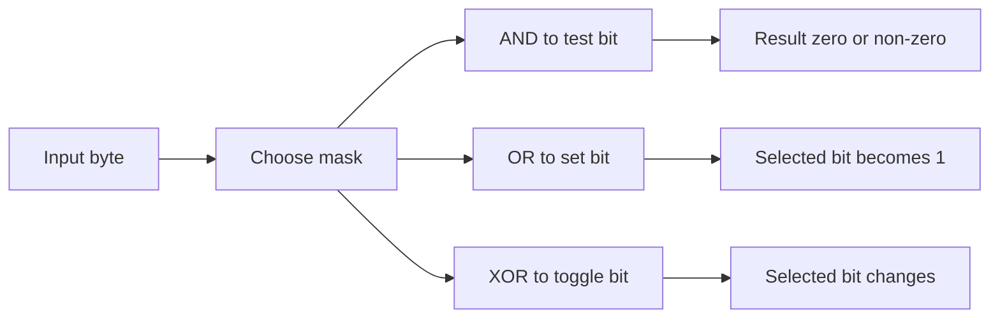

# AS 9618 Chapter 4: Processor Fundamentals

<div class="chapter-meta"><strong>AS 9618 · Paper 1</strong><span>9618 · 2027–2029 · Version 2</span></div>

## Official Syllabus Checklist

Revise: CPU architecture; registers and buses; instruction cycle; assembly language and addressing modes.

> The checklist paraphrases the syllabus for revision. Use the official syllabus as the final authority.

## Core Knowledge

Use the topic sections below to connect definitions, processes, comparisons and calculations.


<span id="_3-one-page-mind-map" class="legacy-anchor" aria-hidden="true"></span>

## Chapter at a Glance

Use this overview to trace instructions, move data, handle interrupts and read assembly code.

### Trace fetch-decode-execute

<span lang="zh-CN">把每一步的寄存器传送和总线方向写清楚。</span>

- Fetch the next instruction using the PC, MAR, memory, MDR and CIR.
- Increment the PC so it identifies the following instruction.
- Decode the opcode, then execute the operation using the required data and registers.

**Exam cue:** State each register transfer in the correct order.

### Use registers and buses

<span lang="zh-CN">寄存器保存什么，与哪条总线传输什么必须对应。</span>

- The address bus carries locations, while the data bus carries instructions or data.
- The control bus carries timing and command signals between components.
- PC, MAR, MDR, CIR, ACC, IX and SR each hold a specific value during processing.

**Exam cue:** Name the register or bus and describe the value it carries.

### Handle interrupts

<span lang="zh-CN">中断答案要包含优先级判断、保存状态和恢复执行。</span>

- The processor checks for enabled interrupt requests and compares their priorities.
- It saves the current processor state before executing the interrupt service routine.
- The saved state is restored so the original process resumes correctly.

**Exam cue:** Include the interrupt flag, stack and ISR where the question requires them.

### Read assembly code

<span lang="zh-CN">先分辨操作码、操作数和寻址方式，再跟踪数据变化。</span>

- Separate each mnemonic into its opcode and operand.
- Apply immediate, direct, indirect, indexed or relative addressing correctly.
- Use masks and shifts to clear, set, toggle or reposition selected bits.

**Exam cue:** Trace register and memory values after every instruction.

---

## 4.1 Central Processing Unit Architecture

### Von Neumann model

#### Core idea

Von Neumann architecture <span lang="zh-CN">的核心是</span> **stored program concept**：

> Program instructions and data are stored in the same main memory and are fetched, decoded and executed by the CPU.

<span lang="zh-CN">中文理解</span>：

+ <span lang="zh-CN">程序指令和数据都放在</span> main memory / IAS <span lang="zh-CN">中</span>。
+ CPU <span lang="zh-CN">一条一条取出指令</span>。
+ <span lang="zh-CN">每条指令经过</span> fetch → decode → execute。
+ <span lang="zh-CN">同一套</span> buses <span lang="zh-CN">用来传输地址</span>、<span lang="zh-CN">数据和控制信号</span>。

#### Mark scheme keywords

+ **stored program concept**
+ **instructions and data stored in memory**
+ **main memory / IAS**
+ **fetched, decoded and executed**
+ **CPU**
+ **buses**

#### Common weak answer

> Von Neumann is a computer model.

Too vague. <span lang="zh-CN">必须说出</span> **stored program** <span lang="zh-CN">和</span> **instructions/data in same memory**。

---

### CPU main components

| Component | Chinese explanation | Mark scheme style phrase |
| --- | --- | --- |
| ALU | <span lang="zh-CN">进行算术和逻辑运算</span> | carries out arithmetic and logical operations |
| CU | <span lang="zh-CN">控制</span> CPU <span lang="zh-CN">内部数据流和指令执行</span> | controls and coordinates the operation of the CPU |
| System clock | <span lang="zh-CN">产生</span> timing signals，<span lang="zh-CN">让操作同步</span> | provides timing signals to synchronise CPU operations |
| IAS / main memory | <span lang="zh-CN">存放当前正在使用的程序和数据</span> | stores programs and data currently in use |
| Registers | CPU <span lang="zh-CN">内部非常快的小存储位置</span> | small high-speed storage locations inside the CPU |

#### ALU

ALU = **Arithmetic Logic Unit**

It carries out:

+ arithmetic operations: `ADD`, `SUBTRACT`, increment, decrement
+ logical operations: `AND`, `OR`, `XOR`, `NOT`
+ comparisons: greater than, equal to, less than

#### CU

CU = **Control Unit**

Mark scheme answer:

> The control unit decodes instructions and sends control signals to coordinate the movement of data and the execution of instructions.

#### System clock

Mark scheme answer:

> The system clock generates timing pulses / timing signals used to synchronise processor operations.

Do not write:

> The clock tells the time.

That is not computer science meaning.

---

## Registers

### Register summary table

| Register | Full name | Main role |
| --- | --- | --- |
| PC | Program Counter | stores the address of the next instruction to be fetched |
| MAR | Memory Address Register | stores the address of the memory location being accessed |
| MDR | Memory Data Register | stores data/instruction being transferred to or from memory |
| CIR | Current Instruction Register | stores the current instruction being decoded/executed |
| ACC | Accumulator | stores results of calculations / intermediate values |
| IX | Index Register | stores an offset used in indexed addressing |
| SR | Status Register | stores status flags as individual bits |
| IR / Interrupt Register | Interrupt Register | stores interrupt flags / identifies interrupt requests |

---

### PC — Program Counter

#### Role

> The PC stores the address of the next instruction to be fetched.

#### During FDE

1. PC holds address of next instruction.
2. Address is copied from PC to MAR.
3. PC is incremented so it points to the next instruction.

#### Common mistake

| Wrong answer | Why weak |
| --- | --- |
| PC stores the current instruction | That is CIR |
| PC stores the program | Program is in memory |
| PC counts programs | Too vague |

---

### MAR — Memory Address Register

#### Role

> The MAR stores the address of the memory location that is about to be read from or written to.

#### Bus link

+ MAR sends the address onto the **address bus**.
+ Address bus is usually **one-directional** from CPU to memory.

---

### MDR — Memory Data Register

#### Role

> The MDR stores the data or instruction being transferred between the CPU and memory.

#### Bus link

+ MDR is connected to the **data bus**.
+ Data bus is **bi-directional** because data can move CPU → memory or memory → CPU.

---

### CIR — Current Instruction Register

#### Role

> The CIR stores the instruction currently being decoded and executed.

#### Common mistake

Do not confuse:

| Register | Stores |
| --- | --- |
| PC | address of next instruction |
| MAR | memory address being accessed |
| MDR | data/instruction transferred |
| CIR | current instruction |

---

### ACC — Accumulator

#### Role

> The accumulator stores intermediate results and results of arithmetic or logical operations.

Example:

```text
LDM #10
ADD #5
```

After this code, ACC = 15.

---

### IX — Index Register

#### Role

> The index register stores an offset used to calculate an effective address in indexed addressing.

Example:

```text
IX = 2
LDX 14
```

If `LDX 14` means load from address `14 + IX`, then effective address = 16.

---

### SR — Status Register

#### Role

> The status register stores status flags as individual bits that show the result of an operation.

#### Important flags

| Flag | Meaning |
| --- | --- |
| Zero flag | result is zero |
| Carry flag | carry produced from calculation |
| Overflow flag | result too large/small for available bits |
| Negative flag | result is negative |
| Interrupt flag | interrupt has occurred / interrupt requested |

#### Mark scheme style answer

> The SR stores flags, where each flag is represented by an individual bit. These bits indicate conditions such as zero, carry, overflow, negative or interrupt status.

#### Common weak answer

> The SR stores the status of the CPU.

This usually loses marks because it repeats the name. Add **flags** and **individual bits**.

---

### General purpose vs special purpose registers

| Type | Meaning | Examples |
| --- | --- | --- |
| General purpose register | used by programmers/instructions to temporarily store different data values | R1, R2, R3 |
| Special purpose register | has a fixed role in CPU operation | PC, MAR, MDR, CIR, ACC, IX, SR |

#### Mark scheme distinction

A strong answer says:

+ special purpose registers have **specific predefined roles**
+ they are used for **specific CPU functions**
+ general purpose registers can be used more flexibly to hold temporary data during program execution

Weak answer:

> General purpose is general and special purpose is special.

No marks / very weak.

---

## Buses

### Bus overview

A bus is a set of parallel wires / communication pathways used to transfer data, addresses or control signals.

| Bus | Direction | Carries | Example |
| --- | --- | --- | --- |
| Address bus | CPU → memory / I/O | address of memory location | MAR sends address 105 |
| Data bus | both directions | data or instruction | instruction copied from memory to MDR |
| Control bus | both directions | control signals | read, write, interrupt, clock signal |

---

### Address bus

#### Mark scheme answer

> The address bus carries the address of the memory location or I/O device to be accessed.

#### Key points

+ Usually one-way from CPU to memory / I/O.
+ Width affects maximum addressable memory.

Example:

```text
16-bit address bus → 2^16 addresses = 65536 addresses
```

---

### Data bus

#### Mark scheme answer

> The data bus carries data or instructions between CPU, memory and I/O devices.

#### Key points

+ Bi-directional.
+ Width affects how much data can be transferred at once.
+ Wider data bus can improve performance.

---

### Control bus

#### Mark scheme answer

> The control bus carries control signals used to coordinate operations, such as read, write, interrupt and clock signals.

#### Common control signals

+ Memory read
+ Memory write
+ Interrupt request
+ Clock / timing signals
+ Reset

---

## Fetch-Decode-Execute Cycle

### Basic sequence

The fetch-decode-execute cycle is the repeated process used by the CPU to process instructions.


```mermaid
flowchart TD
A[PC stores address of next instruction] --> B[PC copied to MAR]
B --> C[Address sent on address bus]
C --> D[Memory read signal sent on control bus]
D --> E[Instruction copied from memory to MDR on data bus]
E --> F[MDR copied to CIR]
F --> G[PC is incremented]
G --> H[CU decodes instruction in CIR]
H --> I[Instruction is executed]
I --> A
```

---

### Fetch stage

#### Step-by-step

1. The address of the next instruction is copied from **PC to MAR**.
2. The address is placed on the **address bus**.
3. A **memory read signal** is sent on the **control bus**.
4. The instruction is copied from memory into the **MDR** using the **data bus**.
5. The instruction is copied from **MDR to CIR**.
6. The **PC is incremented**.

#### Mark scheme style phrase

> The address in the PC is copied to the MAR. The instruction at that address is fetched from memory into the MDR and then copied to the CIR. The PC is incremented.

---

### Decode stage

The CU decodes the instruction stored in the CIR.

It identifies:

+ opcode
+ operand
+ addressing mode
+ required operation
+ registers / memory locations needed

#### Example

```text
ADD #5
```

+ opcode = `ADD`
+ operand = `#5`
+ addressing mode = immediate
+ operation = add 5 to ACC

---

### Execute stage

The CPU performs the instruction.

Examples:

| Instruction | Execute action |
| --- | --- |
| `LDM #7` | load 7 into ACC |
| `LDD 20` | copy contents of memory address 20 into ACC |
| `ADD #3` | add 3 to ACC |
| `SUB 10` | subtract contents of address 10 from ACC |
| `STO 30` | store ACC into memory address 30 |
| `JMP label` | change PC to address of label |

---

### FDE common mistake table

| Mistake | Correction |
| --- | --- |
| Saying instruction goes directly from PC to CIR | PC stores address, not instruction |
| Forgetting MAR | MAR stores memory address for access |
| Forgetting MDR | MDR stores instruction/data transferred from memory |
| Saying PC increments before copying to MAR | Usually PC address is used first, then incremented |
| Mixing data bus and address bus | address bus carries address; data bus carries instruction/data |

---

## Interrupts

### What is an interrupt?

An interrupt is a signal that tells the processor that an event needs attention.

Examples:

+ key pressed
+ mouse clicked
+ printer needs data
+ disk operation completed
+ error occurred
+ timer event

---

### Interrupt handling sequence


```mermaid
flowchart TD
A[Interrupt occurs] --> B[Interrupt flag is set]
B --> C[CPU completes current FDE cycle]
C --> D[CPU checks interrupt priority]
D --> E{Higher priority?}
E -- No --> F[Continue current process]
E -- Yes --> G[Save current register values on stack]
G --> H[Call Interrupt Service Routine ISR]
H --> I[Process interrupt]
I --> J[Restore register values from stack]
J --> K[Return to previous process]
```

---

### Mark scheme answer

> An interrupt flag is raised. At the end of the current fetch-execute cycle, the processor checks whether the interrupt has higher priority. If it does, the current contents of registers are saved on the stack. The appropriate ISR is called. After the interrupt is processed, the register contents are restored and control returns to the previous process.

#### Required ideas / marking points

+ **interrupt flag**
+ **at end of current FDE cycle**
+ **priority**
+ **stack**
+ **register contents saved**
+ **ISR / interrupt service routine**
+ **restore registers**
+ **return to previous process**

---

## Processor Performance

### Factors affecting performance

| Factor | How it affects performance |
| --- | --- |
| Clock speed | more cycles per second, so more instructions may be processed per second |
| Number of cores | can process more tasks in parallel if software supports it |
| Cache size | more frequently used data/instructions stored close to CPU |
| Cache speed | faster access than RAM |
| Bus width | more bits transferred at once |
| Word length | more bits processed in one operation |
| Processor architecture | more efficient instruction execution |
| RAM size | less need to use slower secondary storage / virtual memory |

---

### Clock speed

Clock speed is measured in Hz.

Example:

```text
2.1 GHz = 2.1 billion cycles per second
4.0 GHz = 4.0 billion cycles per second
```

#### Mark scheme answer

> A higher clock speed means more clock cycles per second, so more instructions can be fetched/decoded/executed per second.

---

### Multiple cores

A core is an independent processing unit inside the CPU.

#### Why dual-core is not always twice as fast

Strong answer:

> A dual-core processor can run tasks in parallel, but the program must be written to use multiple cores. Some tasks are sequential and cannot be split. The operating system and other processes also create overhead, so performance is not exactly doubled.

#### Mark scheme keywords

+ **parallel processing**
+ **software must support multiple cores**
+ **tasks may be sequential**
+ **overhead**
+ **operating system scheduling**
+ **shared resources**

---

## Assembly Language

### Assembly language vs machine code

| Feature | Assembly language | Machine code |
| --- | --- | --- |
| Form | mnemonics and labels | binary instructions |
| Readability | easier for humans | directly executed by processor |
| Translation | needs assembler | no translation needed |
| Example | `LDM #10` | binary opcode + operand |

#### Mark scheme answer

> Assembly language uses mnemonics and symbolic addresses. It must be translated by an assembler into machine code, which is binary and can be executed by the processor.

---

### Instruction format

Most assembly instructions contain:

```text
OPCODE OPERAND
```

| Part | Meaning |
| --- | --- |
| Opcode | operation to perform |
| Operand | value, register or address used by the operation |

Example:

```text
ADD #5
```

+ opcode = `ADD`
+ operand = `#5`

---

### Common instruction groups

| Group | Examples | Meaning |
| --- | --- | --- |
| Data movement | LDM, LDD, LDI, LDX, STO | move data between memory/registers |
| Arithmetic | ADD, SUB, INC, DEC | calculations |
| Logic / bitwise | AND, OR, XOR, NOT | bit manipulation |
| Branching | JMP, JPN, JPZ | change flow of execution |
| Compare | CMP | compare values |
| Input/output | IN, OUT | communicate with I/O devices |

---

## Addressing Modes

### Immediate addressing

#### Example

```text
LDM #10
```

#### Meaning

The operand is the actual value.

> Load the value 10 into ACC.

#### Keyword

+ **literal value**
+ **actual value**
+ `#`

---

### Direct addressing

#### Example

```text
LDD 10
```

#### Meaning

The operand is the memory address.

> Load the contents of memory address 10 into ACC.

If memory address 10 contains 45, then ACC becomes 45.

---

### Indirect addressing

#### Example

```text
LDI 10
```

#### Meaning

The operand gives an address that stores another address.

If:

```text
Memory[10] = 25
Memory[25] = 99
```

Then:

```text
LDI 10
```

loads `99` into ACC.

#### Mark scheme phrase

> The address to be used is stored at the given address.

---

### Indexed addressing

#### Example

```text
IX = 3
LDX 20
```

#### Meaning

Effective address = base address + index register.

```text
20 + 3 = 23
```

The contents of memory address 23 are loaded into ACC.

#### Used for

+ arrays
+ tables
+ repeated data structures

---

### Relative addressing

#### Meaning

The operand gives an offset from the current PC value.

Example:

```text
JMP +4
```

means jump to an address relative to current program counter.

#### Used for

+ branch instructions
+ loops
+ position-independent code

---

### Addressing mode comparison table

| Mode | Operand represents | Example | Final action |
| --- | --- | --- | --- |
| Immediate | actual value | `LDM #5` | ACC = 5 |
| Direct | memory address | `LDD 20` | ACC = Memory[20] |
| Indirect | address containing another address | `LDI 20` | ACC = Memory[Memory[20]] |
| Indexed | base address + IX | `LDX 20` | ACC = Memory[20 + IX] |
| Relative | offset from PC | `JMP +4` | PC = PC + 4 |

---

## Assembly Trace Method

### How to trace ACC / IX questions

Use this checklist:

1. Identify starting ACC and IX.
2. Read the instruction set carefully.
3. For each instruction, decide if operand is:
   + value
   + address
   + address of address
   + address + IX
4. Update ACC or IX.
5. Do not change memory unless instruction stores data.
6. Write final ACC / IX.

---

### Worked example

Memory:

| Address | Data |
| ---: | ---: |
| 10 | 1 |
| 11 | 3 |
| 12 | 5 |
| 13 | 11 |
| 14 | 10 |
| 15 | 16 |
| 16 | 12 |

Initial:

```text
ACC = 10
IX = 0
```

Program:

```text
LDR #2
LDX 14
ADD #2
```

Step-by-step:

| Instruction | Meaning | ACC | IX |
| --- | --- | ---: | ---: |
| Start | initial values | 10 | 0 |
| `LDR #2` | load 2 into IX | 10 | 2 |
| `LDX 14` | load Memory[14 + IX] = Memory[16] | 12 | 2 |
| `ADD #2` | ACC = 12 + 2 | 14 | 2 |

Answer:

```text
ACC = 14
IX = 2
```

---

## Two-Pass Assembler

### Why two passes?

Assembly language uses labels and symbolic addresses.  
The assembler may not know the address of a label when it first sees it.

So it uses two passes:

+ **Pass 1:** build symbol table
+ **Pass 2:** generate machine code

---

### Pass 1

Pass 1 usually:

+ scans the source code
+ removes comments / spaces
+ records labels and their addresses
+ creates a symbol table
+ calculates addresses
+ reports some syntax errors

#### Mark scheme phrase

> Pass 1 builds the symbol table by storing labels and their corresponding memory addresses.

---

### Pass 2

Pass 2 usually:

+ replaces mnemonics with binary opcodes
+ replaces labels with addresses
+ converts operands into binary
+ generates object code / machine code
+ reports remaining errors

#### Mark scheme phrase

> Pass 2 uses the symbol table to translate mnemonics and symbolic addresses into machine code.

---

## Bit Manipulation

### Why bit manipulation is used

Bit manipulation means working directly with individual bits.

It is used to:

+ check sensor states
+ set control bits
+ clear bits
+ toggle bits
+ pack multiple Boolean values into one byte
+ control hardware devices

Example:

```text
Bit 0 = door sensor
Bit 1 = light sensor
Bit 2 = motion sensor
Bit 3 = alarm output
```

---

### Bitwise AND

#### Purpose

AND is often used to **check / mask** whether a bit is 1.

Rule:

| A | B | A AND B |
| --- | --- | --- |
| 0 | 0 | 0 |
| 0 | 1 | 0 |
| 1 | 0 | 0 |
| 1 | 1 | 1 |

Example:

```text
ACC  = 10110110
Mask = 00000100
AND  = 00000100
```

Result is not zero, so bit 2 was set.

#### Mark scheme phrase

> AND with a mask is used to isolate/check a specific bit.

---

### Bitwise OR

#### Purpose

OR is often used to **set a bit to 1**.

Rule:

| A | B | A OR B |
| --- | --- | --- |
| 0 | 0 | 0 |
| 0 | 1 | 1 |
| 1 | 0 | 1 |
| 1 | 1 | 1 |

Example:

```text
ACC  = 10110000
Mask = 00000100
OR   = 10110100
```

Bit 2 is set to 1.

---

### Bitwise XOR

#### Purpose

XOR is often used to **toggle** a bit.

Rule:

| A | B | A XOR B |
| --- | --- | --- |
| 0 | 0 | 0 |
| 0 | 1 | 1 |
| 1 | 0 | 1 |
| 1 | 1 | 0 |

Example:

```text
ACC  = 10110100
Mask = 00000100
XOR  = 10110000
```

Bit 2 changed from 1 to 0.

---

### Logical shift

#### Rules

| Shift | What happens |
| --- | --- |
| Logical left shift | bits move left; zeros enter on right |
| Logical right shift | bits move right; zeros enter on left |
| Bits shifted out | lost |

Example:

```text
Original: 00110110
Logical left shift 2:
11011000
```

---

### Arithmetic shift

Arithmetic shift preserves the sign bit when shifting right.

Example:

```text
Original: 11110100
Arithmetic right shift 2:
11111101
```

The leftmost sign bit remains 1, so the number stays negative.

#### Difference from logical right shift

```text
Original: 11110100

Logical right shift 2:     00111101
Arithmetic right shift 2:  11111101
```

---

### Cyclic shift / rotate

In a cyclic shift, bits shifted out at one end re-enter at the other end.

Example:

```text
Original: 10110010
Cyclic left shift 1:
01100101
```

The leftmost `1` moves to the rightmost position.

---

## Mark Scheme Keywords

### CPU / architecture

+ **stored program concept**
+ **instructions and data stored in memory**
+ **fetch-decode-execute cycle**
+ **ALU carries out arithmetic and logical operations**
+ **CU coordinates operations / sends control signals**
+ **system clock synchronises operations**
+ **IAS stores programs and data currently in use**

### Registers

+ **PC stores address of next instruction**
+ **MAR stores memory address being accessed**
+ **MDR stores data/instruction transferred to/from memory**
+ **CIR stores current instruction**
+ **ACC stores intermediate/result of calculation**
+ **IX stores offset for indexed addressing**
+ **SR stores status flags as individual bits**

### Buses

+ **address bus carries memory address**
+ **data bus carries data/instructions**
+ **control bus carries control signals**
+ **read/write signal**
+ **bi-directional data bus**
+ **bus width affects amount transferred**

### Interrupts

+ **interrupt flag is raised**
+ **checked at end of current FDE cycle**
+ **priority**
+ **register contents saved on stack**
+ **ISR called**
+ **registers restored**
+ **returns to previous process**

### Assembly

+ **mnemonic**
+ **opcode**
+ **operand**
+ **assembler**
+ **machine code**
+ **symbol table**
+ **immediate / direct / indirect / indexed / relative addressing**

### Bit manipulation

+ **mask**
+ **isolate a bit**
+ **set a bit**
+ **toggle a bit**
+ **logical shift**
+ **arithmetic shift**
+ **cyclic shift**
+ **bits shifted out are lost**
+ **zeros shifted in**

---

## Topic-Specific Common Confusions

| Mistake | Why it loses marks | Correct version |
| --- | --- | --- |
| PC stores the instruction | PC stores address, not instruction | PC stores address of next instruction |
| MDR stores memory address | That is MAR | MDR stores data/instruction transferred |
| SR stores “status” only | Too vague | SR stores flags as individual bits |
| CU does calculations | ALU does calculations | CU coordinates and sends control signals |
| Data bus carries addresses | Address bus does | Data bus carries data/instructions |
| Address bus is bi-directional | Usually one-way CPU to memory | address bus carries address from CPU |
| Dual-core always twice as fast | Depends on software/tasks | can run parallel tasks if supported |
| Assembly = machine code | Assembly needs translation | assembler converts mnemonics to binary |
| `#5` means address 5 | In this syllabus, `#` usually immediate value | `#5` means literal value 5 |
| Indirect = direct | Not same | indirect uses address stored at given address |
| Indexed uses address only | Missing IX | effective address = base + IX |
| Logical right shift preserves sign | That is arithmetic right shift | logical shift inserts zeros |
| XOR sets a bit | XOR toggles if mask bit is 1 | OR sets; XOR toggles |

---

## Scenario Answer Bank

### “Describe the role of register X”

Template:

> The [register] stores [specific item]. It is used during [specific CPU process] to [specific action].

Example:

> The MAR stores the address of the memory location being accessed. During the fetch stage, the address from the PC is copied into the MAR and sent on the address bus.

---

### “Explain why a dual-core CPU is not always twice as fast”

Template:

> Multiple cores allow some tasks to be processed in parallel. However, the program must be designed to split work across cores. Some tasks are sequential and cannot be parallelised. There is also OS scheduling overhead and shared resources, so performance is not exactly doubled.

---

### “Describe the FDE cycle”

Template:

> The address of the next instruction is copied from the PC to the MAR. The address is sent on the address bus and a memory read signal is sent on the control bus. The instruction is copied from memory to the MDR using the data bus, then copied to the CIR. The PC is incremented. The CU decodes the instruction and the CPU executes it.

---

### “Describe how an interrupt is handled”

Template:

> An interrupt flag is raised. At the end of the current fetch-execute cycle, the CPU checks the interrupt register and priority. If the interrupt has higher priority, the current register contents are saved on the stack. The relevant ISR is called. After it has run, the register contents are restored and execution returns to the previous process.

---

### “Identify the addressing mode”

Template:

| Clue | Addressing mode |
| --- | --- |
| operand starts with `#` | immediate |
| operand is a memory address | direct |
| operand points to address that stores another address | indirect |
| operand + IX | indexed |
| operand is offset from PC | relative |

---

### “Explain use of bitwise AND with a mask”

Template:

> A mask is chosen with 1 in the bit position to be tested. The value is ANDed with the mask. If the result is non-zero, that bit was set. If the result is zero, that bit was not set.

---

## Mermaid Process Diagrams

### Register transfer in fetch stage


```mermaid
sequenceDiagram
participant PC
participant MAR
participant Memory
participant MDR
participant CIR
PC->>MAR: copy address of next instruction
MAR->>Memory: send address on address bus
Memory->>MDR: send instruction on data bus
MDR->>CIR: copy instruction
PC->>PC: increment
```

### Assembly addressing modes


```mermaid
flowchart TD
A["Operand"] --> B{"Starts with #?"}
B -- Yes --> C["Immediate addressing<br/>operand is actual value"]
B -- No --> D{"Uses IX?"}
D -- Yes --> E["Indexed addressing<br/>address = operand + IX"]
D -- No --> F{"Operand stores another address?"}
F -- Yes --> G["Indirect addressing<br/>ACC = Memory(Memory(address))"]
F -- No --> H["Direct addressing<br/>ACC = Memory(address)"]
```

### Bit mask selection


```mermaid
flowchart LR
A[Input byte] --> B[Choose mask]
B --> C[AND to test bit]
B --> D[OR to set bit]
B --> E[XOR to toggle bit]
C --> F[Result zero or non-zero]
D --> G[Selected bit becomes 1]
E --> H[Selected bit changes]
```

---

## Required Ideas and Exam Language

Use technical terms as part of a complete statement: identify the component or method, state what it does, then link its effect to the question context. A keyword without a correct relationship is not a complete marking point.

## Common Confusions

- Do not substitute a related term for the process named in the question.
- Do not list advantages or definitions without linking them to the stated context.

## Worked Examples

The worked calculations, process templates and scenario answers above model the chain of reasoning expected in examination responses. Rework each example before reading its answer.

## 10-Mark Quick Check

**Total: 10 marks**

### Questions

1. State the role of the PC. [1]  
2. State the role of the MAR. [1]  
3. Give one difference between the address bus and the data bus. [1]  
4. Name the CPU component that carries out arithmetic operations. [1]  
5. What does the system clock do? [1]  
6. In `LDM #12`, identify the addressing mode. [1]  
7. In `LDX 20`, if IX = 3, what effective address is used? [1]  
8. State one use of the status register. [1]  
9. What bitwise operation is commonly used to test a bit using a mask? [1]  
10. What is the role of an ISR? [1]

## Quick Check Answers

1. Stores address of next instruction.  
2. Stores memory address being accessed.  
3. Address bus carries addresses and is usually one-way; data bus carries data/instructions and is bi-directional.  
4. ALU.  
5. Generates timing signals / synchronises CPU operations.  
6. Immediate addressing.  
7. 23.  
8. Stores status flags such as zero/carry/overflow/negative as individual bits.  
9. AND.  
10. Handles/processes an interrupt.

---

## 20-Mark Exam Practice

**Total: 20 marks**

### Question 1: Registers and FDE cycle [7]

(a) State the role of each register. [3]

| Register | Role |
| --- | --- |
| PC | |
| MDR | |
| CIR | |

(b) Describe the fetch stage of the fetch-decode-execute cycle. [4]

#### Mark scheme

(a)

+ PC stores address of next instruction [1]
+ MDR stores data/instruction being transferred to/from memory [1]
+ CIR stores current instruction being decoded/executed [1]

(b)

+ PC copied to MAR [1]
+ address sent to memory / on address bus and memory read signal sent [1]
+ instruction copied from memory to MDR / on data bus [1]
+ instruction copied from MDR to CIR and PC incremented [1]

---

### Question 2: Assembly trace [6]

Memory:

| Address | Data |
| ---: | ---: |
| 20 | 4 |
| 21 | 7 |
| 22 | 12 |
| 23 | 21 |
| 24 | 8 |
| 25 | 3 |

Initial values:

```text
ACC = 0
IX = 0
```

Instruction set:

| Instruction | Meaning |
| --- | --- |
| `LDM #n` | load value n into ACC |
| `LDD address` | load contents of address into ACC |
| `LDI address` | load contents of second address stored at given address into ACC |
| `LDR #n` | load value n into IX |
| `LDX address` | load contents of address + IX into ACC |
| `ADD #n` | add value n to ACC |
| `ADD address` | add contents of address to ACC |
| `SUB #n` | subtract value n from ACC |

Complete the final ACC for each program.

| Program | Code | ACC |
| --- | --- | --- |
| 1 | `LDM #20`<br>`ADD #5` | |
| 2 | `LDD 22`<br>`SUB #2` | |
| 3 | `LDI 23`<br>`ADD #1` | |
| 4 | `LDR #2`<br>`LDX 20`<br>`ADD 25` | |

#### Mark scheme

Program 1:

```text
LDM #20 → ACC = 20
ADD #5 → ACC = 25
```

ACC = 25 [1]

Program 2:

```text
LDD 22 → ACC = Memory[22] = 12
SUB #2 → ACC = 10
```

ACC = 10 [1]

Program 3:

```text
LDI 23 → Memory[23] = 21, Memory[21] = 7
ACC = 7
ADD #1 → ACC = 8
```

ACC = 8 [2]

Program 4:

```text
LDR #2 → IX = 2
LDX 20 → Memory[20 + 2] = Memory[22] = 12
ADD 25 → ACC = 12 + Memory[25] = 15
```

ACC = 15 [2]

---

### Question 3: Interrupts and bit manipulation [7]

(a) A keyboard interrupt occurs while the CPU is running another process. Describe how the interrupt is handled. [5]

(b) A sensor byte is stored in ACC:

```text
ACC = 10110110
```

Bit 2 represents whether a door is open. A value of 1 means open.  
Use the mask:

```text
00000100
```

Explain how the system can test whether the door is open. [2]

#### Mark scheme

(a)

+ interrupt flag is raised [1]
+ CPU completes current FDE cycle / checks at end of cycle [1]
+ checks priority / interrupt register [1]
+ saves current register contents on stack [1]
+ calls ISR and later restores register contents / returns to previous process [1]

(b)

+ AND ACC with mask `00000100` to isolate bit 2 [1]
+ result is non-zero / `00000100`, so bit 2 is 1 and the door is open [1]

---

## Final Revision Checklist

- I can define the required terms precisely.
- I can explain each process in the correct order.
- I can apply the ideas to an unfamiliar scenario.
- I can complete the 10-mark check without notes.
- I can complete and self-mark the 20-mark practice.
