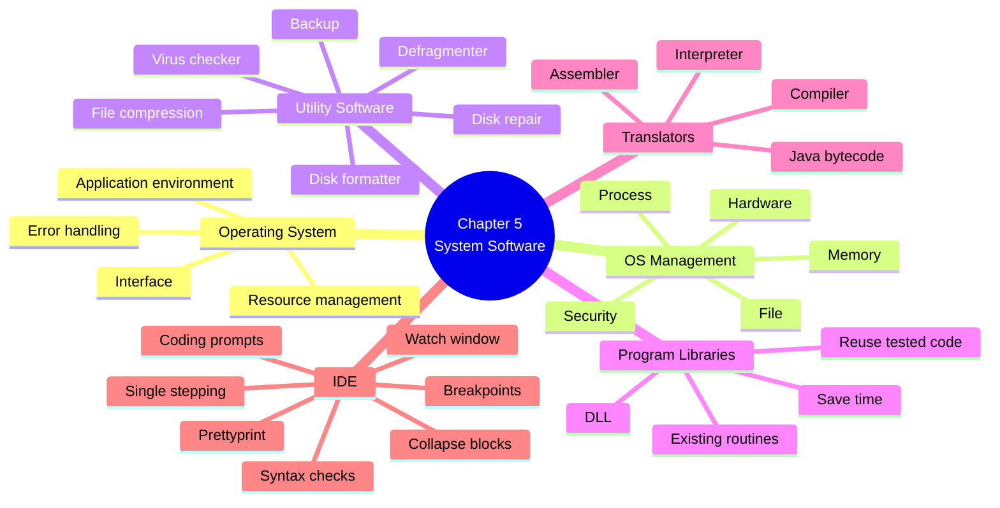
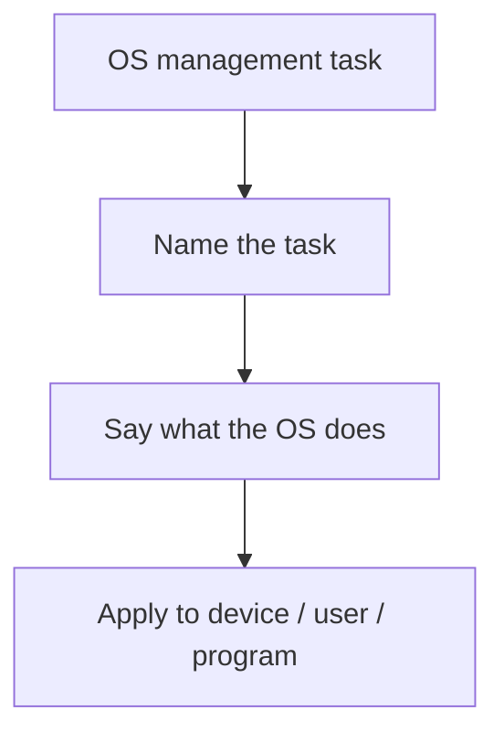
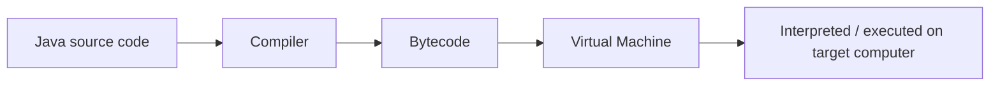
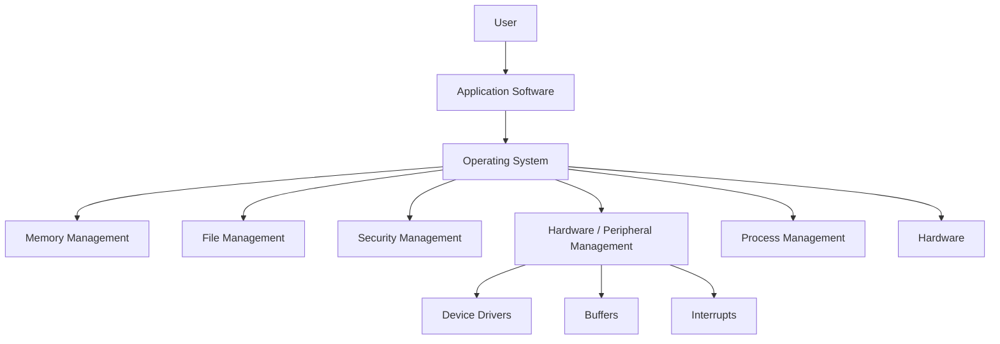
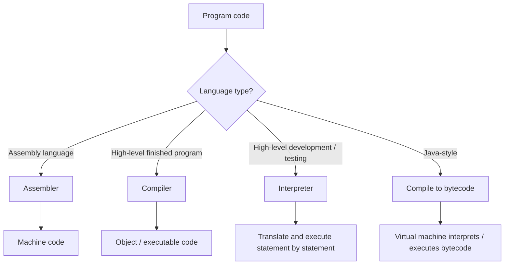

# AS 9618 Computer Science — Chapter 5 Updated Notes
## System Software｜Syllabus-Aligned Paper 1 Revision Sheet

> **Version:** Syllabus-aligned revision; informed by recent Paper 1 patterns focus  
> **Target:** Cambridge International AS & A Level Computer Science 9618  
> **Chapter:** 5 System Software  
> **Main audience:** Students  
> **Style:** 中文解释 + English mark scheme keywords  
> **Docsify:** no local image dependency; Mermaid supported  
>

---

# 0. How to Use This Sheet

Chapter 5 不是单纯背定义的章节。2024–2025 的趋势更喜欢把 **Operating System / utility software / libraries / IDE / translators** 放进真实场景中问：

1. **Explain purpose / need**：为什么需要 OS、utility、translator、IDE feature  
2. **Describe management task**：file / memory / security / hardware / process management  
3. **Apply to scenario**：学生写程序、发文件、多人开发、安装/维护软件  
4. **Compare / justify**：compiler vs interpreter, why library, why backup, why compression  
5. **Feature + description**：IDE presentation feature、debugging feature，不能只写名称  

复习顺序建议：

---

# 1. Recent Paper 1 Pattern Map

| Area | Recent exam pattern | What students must practise |
| --- | --- | --- |
| Purpose of OS | High | OS provides interface, manages hardware/resources, allows applications to run |
| File management | High | create / delete / move / rename / organise / store / retrieve files and directories |
| Process management | High | schedule processes, allocate CPU time, manage multitasking, handle process states |
| Hardware / peripheral management | Medium-high | device drivers, buffers, interrupts, input/output communication |
| Security management | Medium | user accounts, passwords, access rights, updates, protection from unauthorised access |
| Utility software | High | backup, file compression, virus checker, defragmenter, disk formatter, disk repair |
| Back-up software | High | restore data after loss, corruption, hardware failure, accidental deletion |
| Program libraries | High | reuse tested code, save development time, reduce errors, modular development |
| DLL files | Medium | loaded at runtime, shared by multiple programs, saves memory/storage, easier updates |
| Assembler / compiler / interpreter | High | know what each translates and why needed |
| Compiler vs interpreter | High | compare speed, error reporting, portability, executable/object code |
| Java partial compilation | Medium | source code compiled to bytecode, bytecode interpreted/executed by VM |
| IDE coding/error/presentation/debugging features | Very high | context-sensitive prompts, dynamic syntax checks, prettyprint, collapse blocks, breakpoints, watch/report window |

---

# 2. Content Update Decision

## 2.1 Keep and Strengthen

| Kept content | Reason |
| --- | --- |
| OS purpose | 2025 Paper 1 directly asks purpose of OS-style question |
| file / memory / security / hardware / process management | Core syllabus and common short-answer area |
| utility software examples | 2024 Paper 1 asks backup / compression style questions |
| program libraries and DLL | 2024 Paper 1 asks benefits of library files |
| IDE features | 2024 Paper 1 asks presentation and debugging features directly |
| compiler / interpreter comparison | Classic high-frequency translator topic |
| Java partial compilation and interpretation | Explicit syllabus point and easy 2–3 mark answer |
| scenario wording | Mark schemes reward applied answers, not vague textbook phrases |

## 2.2 Downweight

| Downweighted content | Why |
| --- | --- |
| detailed history of operating systems | Rarely gives marks |
| long GUI vs CLI discussion | Useful background but not central to current Chapter 5 trend |
| very deep virtual memory algorithms | Mention as memory management only; AS does not require OS-level paging detail here |
| exact vendor examples / brand names | Cambridge says no marks for brand names |
| low-level compiler phases | Lexical/syntax/semantic analysis detail is more than needed for AS Chapter 5 |
| detailed JVM implementation | Only need source code → bytecode → virtual machine/interpreter idea |

## 2.3 Delete / Avoid

| Avoid | Reason |
| --- | --- |
| “compiler checks one line at a time” | Wrong; interpreter usually works line-by-line |
| “interpreter creates an executable file” | Wrong |
| “DLL is only for Windows” | Do not rely on brand/platform-specific wording |
| “backup prevents data loss completely” | Weak; backup allows recovery after loss |
| “file compression always loses data” | Wrong; file compression may be lossless |

---

# 3. One-Page Mind Map

---

# 4. 5.1 Operating Systems

## 4.1 Why a computer system requires an OS

### Student-friendly explanation

Operating System 就像电脑的“总管”。没有 OS，普通用户和 application software 很难直接控制硬件。OS 提供一个环境，让程序可以运行，也帮用户和硬件之间进行沟通。

### Mark scheme answer

> An operating system is needed to provide an interface between the user/application software and the hardware, to manage hardware and system resources, and to provide an environment in which applications can run.

### Must-have keywords

+ **interface**
+ **user**
+ **application software**
+ **hardware**
+ **resources**
+ **manage**
+ **environment**
+ **run applications**

### Common weak answer

> The OS controls the computer.

This is too vague. You need to say **what it controls / manages** and **why it is needed**.

---

## 4.2 Key OS management tasks

### Exam structure

If the question asks “Describe management tasks carried out by the OS”, use this structure:

---

## 4.3 Memory management

### Meaning

Memory management 是 OS 管理 main memory / RAM 的过程。它决定哪些 programs 和 data 放进 RAM，分配多少 memory，并防止程序互相破坏数据。

### Mark scheme phrases

> The OS allocates memory to programs and data.  
> It keeps track of which memory locations are in use.  
> It prevents one process from accessing memory allocated to another process.  
> It may use virtual memory when RAM is insufficient.

### What to remember

| Point | Student explanation |
| --- | --- |
| Allocate memory | 给正在运行的程序分配 RAM |
| Deallocate memory | 程序结束后释放 RAM |
| Track memory | 记录哪些 memory locations 正在被用 |
| Memory protection | 防止一个 program 改到另一个 program 的 memory |
| Virtual memory | RAM 不够时，用 secondary storage 的一部分临时代替 |

### Common mistake

| Mistake | Correction |
| --- | --- |
| “Memory management stores files permanently.” | Permanent files are stored on secondary storage; memory management mainly controls RAM. |
| “RAM is unlimited.” | RAM is limited; OS must allocate it carefully. |
| “Virtual memory makes computer faster.” | Not always. It allows more programs to run but is slower than RAM. |

---

## 4.4 File management

### Meaning

File management 是 OS 管理 files 和 folders/directories 的功能。2024 Paper 1 特别喜欢问这个。

### Mark scheme answer

> The OS manages files and directories by allowing files to be created, named, opened, saved, copied, moved, deleted and organised. It keeps track of file locations and controls access permissions.

### Keywords

+ **create**
+ **open**
+ **save**
+ **copy**
+ **move**
+ **rename**
+ **delete**
+ **directories / folders**
+ **file location**
+ **permissions / access rights**

### 2024-style answer bank

| Question wording | Strong answer |
| --- | --- |
| Describe file management tasks | Creates, deletes, moves and renames files/folders; stores file metadata and file locations |
| How does OS help user organise files? | Allows directories/folders and paths to group related files |
| How can OS protect files? | Uses permissions/access rights so only authorised users can read/write/delete files |

### Common mistake

> “File management backs up files.”

Backup is usually **utility software**, not the core meaning of file management.

---

## 4.5 Security management

### Meaning

Security management 是 OS 防止 unauthorised access，保护 data 和 resources。

### Mark scheme phrases

> The OS manages user accounts and passwords.  
> It controls access rights / permissions.  
> It prevents unauthorised access to files and resources.  
> It may support security updates and system protection.

### Examples

| Method | How it protects |
| --- | --- |
| User account | Identifies each user |
| Password / authentication | Checks the user is allowed to access the system |
| Access rights | Controls what files/resources a user can read/write/delete |
| Automatic updates | Fixes security vulnerabilities |
| Lock screen / timeout | Stops unauthorised access when user leaves device |

### Weak vs strong answer

| Weak | Strong |
| --- | --- |
| “The OS keeps it safe.” | “The OS uses user accounts, passwords and access rights to prevent unauthorised access.” |

---

## 4.6 Hardware / peripheral management

### Meaning

The OS manages input/output devices and peripherals. It allows communication between hardware and software.

### Mark scheme phrases

> The OS uses device drivers to allow communication with peripheral devices.  
> It sends data to output devices and receives data from input devices.  
> It uses buffers to manage different data transfer speeds.  
> It handles interrupts from devices.

### Important terms

| Term | Meaning |
| --- | --- |
| Device driver | Software that allows OS to communicate with a hardware device |
| Buffer | Temporary storage used when two devices work at different speeds |
| Interrupt | Signal sent to CPU/OS when a device needs attention |
| Spooling | Storing print jobs in a queue before sending them to printer |

### Scenario example

A printer is much slower than the CPU.

> The OS sends print data to a buffer/spool. The printer takes data from the buffer at its own speed. This allows the CPU/program to continue with other tasks.

---

## 4.7 Process management

### Meaning

Process management 是 OS 管理正在运行的 programs/processes。它决定哪个 process 使用 CPU，什么时候运行，以及如何切换。

### Mark scheme answer

> The OS schedules processes, allocates processor time, manages multitasking, changes process states and ensures that processes do not interfere with each other.

### Key ideas

| Concept | Explanation |
| --- | --- |
| Process | A program currently running |
| Scheduling | Deciding which process uses CPU next |
| Processor time | CPU time allocated to each process |
| Multitasking | More than one process appears to run at the same time |
| Process state | ready / running / blocked / waiting |
| Context switching | Saving one process state and loading another |

### Common mistake

> “Process management means writing programs.”

No. It means managing **running programs**.

---

# 5. Utility Software

## 5.1 What is utility software?

Utility software 是 system software 的一种，用来维护、保护、优化或管理 computer system。

### Mark scheme answer

> Utility software is system software used to maintain, protect, analyse or improve the operation of a computer system.

### Syllabus examples

+ **disk formatter**
+ **virus checker**
+ **defragmentation software**
+ **disk contents analysis / disk repair software**
+ **file compression**
+ **back-up software**

---

## 5.2 Back-up software

### Meaning

Back-up software creates copies of files/data so they can be restored if the original is lost or damaged.

### Mark scheme phrases

> It creates a copy of data/files.  
> The copy can be used to restore data after accidental deletion, corruption, hardware failure or malware attack.

### 2024-style answer

> Back-up software is needed because the file may be accidentally deleted, corrupted or lost due to hardware failure. A backup copy can be restored so the user does not need to recreate the file.

### Common mistake

| Mistake | Correction |
| --- | --- |
| “Backup stops data being deleted.” | Backup does not stop deletion; it allows recovery. |
| “Backup is the same as archive.” | Backup is for recovery; archive is long-term storage. |
| “Backup always stores everything.” | It may be full, incremental or differential, but AS usually only needs general recovery idea. |

---

## 5.3 File compression utility

### Meaning

File compression software reduces file size.

### Benefits

| Benefit | Explanation |
| --- | --- |
| Less storage | File takes up less space |
| Faster upload/download | Less data needs to be transferred |
| Less bandwidth | Useful when emailing/transmitting files |
| Easier to send as attachment | May fit within file size limit |

### Mark scheme answer

> Compression reduces the file size, so the file needs less storage space and can be transmitted/downloaded faster using less bandwidth.

### Exam warning

Do not say “compression makes the file better quality”. It usually reduces size, not improve quality.

---

## 5.4 Virus checker / anti-virus utility

### Meaning

A virus checker scans files/programs for malware.

### Mark scheme phrases

> It scans files for known malware signatures.  
> It can quarantine/delete infected files.  
> It can prevent malware from running.  
> It needs regular updates to detect new threats.

### Common mistake

> “A virus checker guarantees no virus.”

No. It reduces risk but cannot guarantee perfect protection.

---

## 5.5 Defragmentation software

### Meaning

Defragmentation reorganises file fragments on a magnetic hard disk so parts of a file are stored contiguously.

### Mark scheme phrases

> It rearranges file fragments so each file is stored in contiguous blocks.  
> This reduces disk head movement and can improve access speed on an HDD.

### Important limitation

Defragmentation is mainly relevant to **magnetic hard disks**, not SSDs.

---

## 5.6 Disk formatter

### Meaning

Disk formatter prepares a storage device for use.

### Mark scheme phrases

> It prepares the disk for storing files.  
> It creates a file system / directory structure.  
> It may erase existing data.

---

## 5.7 Disk contents analysis / disk repair

### Meaning

Disk analysis checks storage usage and errors. Disk repair attempts to fix file system errors or mark bad sectors.

### Mark scheme phrases

> It analyses how storage space is used.  
> It checks the disk for errors.  
> It attempts to repair file system errors or prevent use of damaged areas.

---

# 6. Program Libraries and DLL Files

## 6.1 What is a program library?

A program library is a collection of pre-written routines/modules that programmers can use in their own software.

### Mark scheme answer

> A program library contains existing code/routines that can be reused by programmers when developing software.

### Benefits to developer

| Benefit | Explanation |
| --- | --- |
| Saves time | Developer does not need to write common code again |
| Reduces errors | Library routines may already be tested |
| Allows reuse | Same routine can be used in many programs |
| Modular design | Program can be built from smaller parts |
| Specialist functions | Developer can use complex functions written by experts |
| Easier maintenance | Library routine can be updated instead of rewriting every program |

### 2024-style answer

> Using library files saves development time because the student can reuse existing routines. The routines may already have been tested, so there are fewer errors. It also allows the program to be developed in modules.

---

## 6.2 Dynamic Link Library (DLL)

### Meaning

A DLL is a library file that is linked/loaded when the program runs, not permanently copied into every executable.

### Mark scheme phrases

> A DLL can be shared by several programs.  
> It is loaded at run time when required.  
> It reduces memory/storage use because the same library code is not copied into every program.  
> Updating the DLL can update the shared routine for programs that use it.

### Common mistake

| Mistake | Correction |
| --- | --- |
| “DLL means the code is rewritten each time.” | DLL means shared code can be reused/loaded when needed. |
| “DLL is part of source code only.” | It is a linked library file used by executable programs. |
| “DLL always makes program faster.” | It mainly saves memory/storage and supports shared updates. |

---

# 7. 5.2 Language Translators

## 7.1 Why translators are needed

Computers execute machine code. Programmers usually write high-level language or assembly language. Translators convert code into a form the processor can execute.

### Mark scheme answer

> A translator converts a program written in assembly language or a high-level language into machine code/object code so it can be executed by the processor.

---

## 7.2 Assembler

### Meaning

Assembler translates assembly language into machine code.

### Mark scheme answer

> An assembler translates assembly language instructions into machine code.

### Exam warning

Do not say assembler translates Java/Python/C++ high-level code. It translates **assembly language**.

---

## 7.3 Compiler

### Meaning

Compiler translates the whole high-level language program into object code / executable code before it is run.

### Mark scheme phrases

> Translates the whole program before execution.  
> Produces object code / executable code.  
> The executable can be run without translating the source code again.  
> Lists errors after compilation.

### Benefits

| Benefit | Explanation |
| --- | --- |
| Faster execution after translation | Object code runs directly |
| Source code not needed by user | Helps protect source code |
| Errors can be listed together | Developer can fix many errors |
| Program can be distributed as executable | End user does not need compiler/source |

### Drawbacks

| Drawback | Explanation |
| --- | --- |
| Compilation can take time | Whole program translated first |
| Harder to debug line-by-line | Errors are not found interactively during execution |
| Object code may be platform dependent | May need recompilation for different processor/OS |

---

## 7.4 Interpreter

### Meaning

Interpreter translates and executes high-level language instructions one statement at a time.

### Mark scheme phrases

> Translates and executes one line/statement at a time.  
> Stops when it finds an error.  
> No separate executable/object code is produced.  
> Useful during development and debugging.

### Benefits

| Benefit | Explanation |
| --- | --- |
| Easier debugging | Stops at the line with an error |
| Good for testing | Program can be run quickly during development |
| More portable if interpreter exists | Source can run on any system with suitable interpreter |

### Drawbacks

| Drawback | Explanation |
| --- | --- |
| Slower execution | Each statement is translated during execution |
| Source code needed | User may need access to source code |
| Error later in program not found until reached | It stops when execution reaches the error |

---

## 7.5 Compiler vs interpreter exam comparison

| Feature | Compiler | Interpreter |
| --- | --- | --- |
| Translation | Whole program before execution | One statement at a time |
| Output | Object/executable code | Usually no separate executable |
| Execution speed after translation | Faster | Slower |
| Error reporting | Many errors after compilation | Stops at first error encountered |
| Source code needed to run | Not usually | Usually yes |
| Good for | Final distributed program | Development/testing/debugging |

### Mark scheme style answer

> A compiler is suitable for a finished program because it produces executable code that runs faster and can be distributed without source code. An interpreter is suitable during development because it executes code statement by statement and stops at the line where an error occurs, making debugging easier.

---

## 7.6 Java partial compilation and interpretation

### What AS students need

Java-style execution is often described as partly compiled and partly interpreted.

### Mark scheme answer

> A Java program may be compiled into bytecode. The bytecode is then interpreted/executed by a virtual machine on the target computer.

### Benefits

| Benefit | Explanation |
| --- | --- |
| Portable | Same bytecode can run on different systems with a suitable virtual machine |
| Some speed benefit | Bytecode is partly translated before execution |
| Easier distribution | Bytecode can be distributed instead of source code |

### Common mistake

> “Java is only compiled” or “Java is only interpreted.”

For AS 9618, remember: **partially compiled and partially interpreted**.

---

# 8. Integrated Development Environment (IDE)

## 8.1 What is an IDE?

An IDE is software that provides tools to help programmers write, test, debug and maintain programs.

### Mark scheme answer

> An IDE provides tools for coding, error detection, presentation and debugging when developing programs.

---

## 8.2 Coding feature: context-sensitive prompts

### Meaning

Context-sensitive prompts suggest possible commands, variables, functions or parameters depending on where the programmer is typing.

### Mark scheme phrases

> Suggests valid keywords/functions/variables while code is being typed.  
> Reduces typing errors and speeds up coding.

### Example

If a programmer types `print`, the IDE may suggest the correct function syntax or available variables.

---

## 8.3 Initial error detection: dynamic syntax checks

### Meaning

Dynamic syntax checking checks code while it is being typed or before full execution.

### Mark scheme phrases

> Highlights syntax errors as code is typed.  
> Identifies missing brackets, incorrect keywords or invalid punctuation.  
> Allows programmer to correct errors earlier.

### Common mistake

> “Dynamic syntax check finds all logic errors.”

No. It mainly finds **syntax errors**, not all logical errors.

---

## 8.4 Presentation features

2024 Paper 1 asked students to identify and describe presentation features. You need **feature + description**.

| Feature | Description |
| --- | --- |
| Prettyprint | Automatically formats code using indentation, spacing and layout |
| Expand / collapse code blocks | Hides or shows sections of code such as procedures or loops |
| Line numbering | Displays line numbers to help locate code/errors |
| Colour coding / syntax highlighting | Shows keywords, strings, comments in different colours/styles |

### Mark scheme style

> Prettyprint formats code with indentation and spacing so the program is easier to read.  
> Collapse code blocks hides sections of code so the programmer can focus on one part of the program.

---

## 8.5 Debugging features

2024 Paper 1 also asked students to identify and describe debugging features.

| Feature | Description |
| --- | --- |
| Single stepping | Executes one line/instruction at a time |
| Breakpoint | Stops execution at a selected line |
| Watch window / variable report | Shows current values of variables/expressions |
| Error report window | Displays error messages and sometimes line numbers |
| Trace | Shows sequence of statements executed |

### Mark scheme style

> A breakpoint stops the program at a chosen line so the programmer can inspect variable values at that point.  
> A watch window displays the value of selected variables or expressions while the program is running.

### Common mistake

| Mistake | Correction |
| --- | --- |
| Only naming “breakpoint” | Add what it does |
| Saying “prettyprint finds errors” | Prettyprint is presentation, not debugging |
| Saying “single stepping runs the whole program” | It executes one line at a time |
| Saying “watch window changes variable automatically” | It displays values; it does not necessarily change them |

---

# 9. Mark Scheme Keywords

## 9.1 Operating System

+ **interface between user/application and hardware**
+ **manages resources**
+ **allows applications to run**
+ **memory management**
+ **file management**
+ **security management**
+ **hardware/peripheral management**
+ **process management**
+ **device drivers**
+ **buffers**
+ **interrupts**
+ **allocates processor time**
+ **schedules processes**

## 9.2 Utility Software

+ **maintain / protect / optimise**
+ **backup copy**
+ **restore data**
+ **accidental deletion**
+ **corruption**
+ **hardware failure**
+ **reduces file size**
+ **less storage**
+ **less bandwidth**
+ **faster transmission**
+ **scan / quarantine / delete malware**
+ **defragment / contiguous blocks**
+ **disk formatter / file system**

## 9.3 Program Libraries

+ **existing code**
+ **pre-written routines**
+ **reusable**
+ **tested**
+ **save development time**
+ **reduce errors**
+ **modular**
+ **Dynamic Link Library**
+ **loaded at runtime**
+ **shared by multiple programs**

## 9.4 Language Translators

+ **source code**
+ **object code**
+ **machine code**
+ **assembler**
+ **compiler**
+ **interpreter**
+ **whole program**
+ **one statement at a time**
+ **executable**
+ **error reporting**
+ **bytecode**
+ **virtual machine**

## 9.5 IDE

+ **context-sensitive prompts**
+ **dynamic syntax checks**
+ **prettyprint**
+ **expand / collapse code blocks**
+ **single stepping**
+ **breakpoints**
+ **watch window**
+ **variables / expressions report window**

---

# 10. Common Mistakes 易错表

| Mistake | Why it loses marks | Correct version |
| --- | --- | --- |
| OS is “software that controls computer” only | Too vague | Say interface + manages resources + lets applications run |
| Confusing file management with backup | Different syllabus areas | File management organises files; backup copies/restores data |
| Saying defragmentation is for all storage | Not precise | Mainly for magnetic hard disks |
| Saying backup prevents data loss | Too absolute | Backup allows recovery after loss/corruption |
| Saying library means “internet library” | Wrong context | Program library = reusable code/routines |
| Saying compiler runs one line at a time | Wrong | Interpreter translates/executes one statement at a time |
| Saying interpreter produces executable file | Usually wrong | Compiler produces object/executable code |
| Naming IDE feature without description | Often only half answer | Give feature + what it does |
| Saying syntax check finds logic errors | Wrong | Syntax check finds grammar/structure errors |
| Mixing presentation and debugging features | Common Paper 1 error | Prettyprint = presentation; breakpoint = debugging |

---

# 11. Scenario Answer Bank

## Scenario 1: Student writes a program in an IDE

**Question:** Explain how IDE debugging features help the student.

**Answer template:**

> The student can use **single stepping** to execute the program one line at a time, so they can see where the error occurs. They can set a **breakpoint** to pause the program at a chosen line. They can use a **watch window** to view the current values of variables and expressions while the program is running.

---

## Scenario 2: Program code is emailed as an attachment

**Question:** Explain benefits of compressing the file.

**Answer template:**

> Compression reduces the file size, so the attachment uses less storage and less bandwidth. It can be uploaded and downloaded faster, and it is more likely to fit within an email attachment size limit.

---

## Scenario 3: Laptop stores important coursework

**Question:** Explain need for backup software.

**Answer template:**

> Backup software creates a copy of the coursework files. If the original file is accidentally deleted, corrupted, lost due to hardware failure, or affected by malware, the student can restore the file from the backup.

---

## Scenario 4: Team creates a program library

**Question:** Explain benefits to programmers.

**Answer template:**

> A program library allows programmers to reuse existing routines, so they do not need to write the same code again. The routines may already be tested, reducing errors. It also supports modular development because different parts of the program can use the same shared routines.

---

## Scenario 5: Finished commercial program

**Question:** Justify compiler rather than interpreter.

**Answer template:**

> A compiler is suitable because it translates the whole program into executable/object code. The finished program runs faster because it does not need to be translated line-by-line during execution. The source code does not need to be distributed to users, which helps protect the developer's code.

---

## Scenario 6: Program is still being developed

**Question:** Justify interpreter rather than compiler.

**Answer template:**

> An interpreter is suitable during development because it translates and executes one statement at a time. It stops when it finds an error, making it easier for the programmer to locate and fix errors during testing.

---

# 12. Process Diagram: OS + Application + Hardware

---

# 13. Process Diagram: Translator Choice

---

# 14. 10 Marks Quick Check

## Questions

1. State two reasons why a computer system requires an OS. **[2]**
2. Give two file management tasks carried out by an OS. **[2]**
3. Explain why backup software is needed. **[2]**
4. State one benefit of using a program library. **[1]**
5. Identify one presentation feature of an IDE and describe it. **[2]**
6. State the purpose of an assembler. **[1]**

## Mark Scheme

1. Any two:
   + provides interface between user/application and hardware
   + manages system resources
   + allows applications to run
   + manages hardware/peripherals/files/memory/processes/security  
2. Any two:
   + create / open / save / copy / move / rename / delete files
   + organise files into directories/folders
   + keep track of file locations
   + manage file permissions  
3. Creates copies of files/data; can restore data after accidental deletion / corruption / hardware failure / malware attack.  
4. Reuses existing tested code / saves development time / reduces errors / supports modular development.  
5. Example:
   + Prettyprint: automatically formats code with indentation and spacing.
   + Expand/collapse: hides or shows code blocks to make code easier to navigate.
   + Line numbering: shows line numbers to help find errors.  
6. Translates assembly language into machine code.

---

# 15. 20 Marks Exam-Style Practice

## Question 1: Operating System and Utility Software **[8]**

A student uses a laptop to write a program. The laptop has an Operating System and several utility programs.

### (a) Explain why the laptop requires an Operating System. **[3]**

### (b) Describe two file management tasks carried out by the Operating System. **[2]**

### (c) The student uses backup software. Explain why backup software is needed. **[3]**

---

## Question 2: Program Libraries and IDE **[7]**

A team of programmers is developing a large program using an IDE. They decide to create and use program libraries.

### (a) Explain three benefits of using program libraries. **[3]**

### (b) Identify and describe one coding feature of an IDE. **[2]**

### (c) Identify and describe one debugging feature of an IDE. **[2]**

---

## Question 3: Language Translators **[5]**

A programmer writes a high-level language program.

### (a) Explain one benefit of using a compiler instead of an interpreter for the finished program. **[2]**

### (b) Explain one benefit of using an interpreter during development. **[2]**

### (c) State what is meant by Java being partially compiled and partially interpreted. **[1]**

---

# 16. 20 Marks Practice Mark Scheme

## Question 1 Mark Scheme **[8]**

### (a) OS purpose **[3]**

Award 1 mark each:

+ provides an interface between user/application software and hardware
+ manages system resources / hardware / memory / files / processes
+ provides an environment for applications to run
+ hides hardware complexity from user/programs
+ handles input/output/peripherals

### (b) File management **[2]**

Award 1 mark each:

+ create / open / save / copy / move / rename / delete files
+ organise files into directories/folders
+ keep track of file locations / paths
+ manage file permissions/access rights

### (c) Backup software **[3]**

Award 1 mark each:

+ creates copies of files/data
+ backup copy can be restored
+ after accidental deletion / corruption / hardware failure / malware attack / loss of original

---

## Question 2 Mark Scheme **[7]**

### (a) Program libraries **[3]**

Award 1 mark each:

+ reuse existing code/routines
+ saves development time
+ routines may already be tested, reducing errors
+ supports modular development
+ allows specialist routines to be used
+ easier maintenance/update of shared code

### (b) IDE coding feature **[2]**

1 mark for feature, 1 mark for description:

+ context-sensitive prompts suggest valid commands/variables/functions depending on code context
+ auto-completion completes keywords/identifiers to reduce typing errors

### (c) IDE debugging feature **[2]**

1 mark for feature, 1 mark for description:

+ breakpoint stops program at a chosen line
+ single stepping executes one line at a time
+ watch window/report window displays variable/expression values
+ trace shows statements executed

---

## Question 3 Mark Scheme **[5]**

### (a) Compiler benefit **[2]**

Award 1 mark each:

+ produces object/executable code
+ executable runs faster because it does not need statement-by-statement translation
+ source code does not need to be distributed
+ suitable for final distribution

### (b) Interpreter benefit **[2]**

Award 1 mark each:

+ translates/executes one statement at a time
+ stops at line with error
+ easier to debug/test during development
+ no need to compile whole program before testing

### (c) Java partial compilation/interpreting **[1]**

+ Source code is compiled into bytecode, then bytecode is interpreted/executed by a virtual machine.

---
