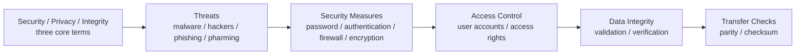
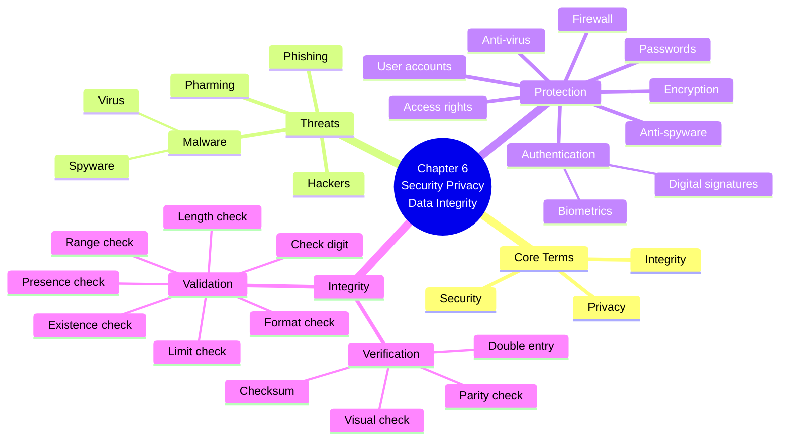
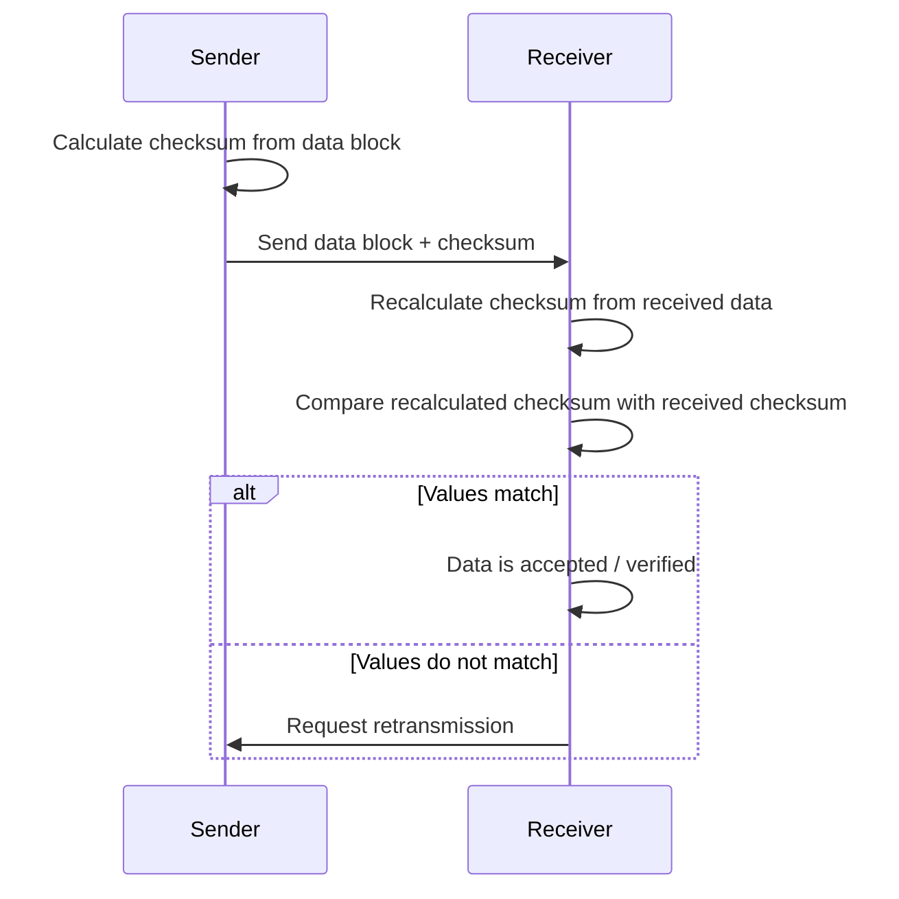

# AS 9618 Chapter 6: Security, Privacy and Data Integrity
## Security, Privacy and Data Integrity｜Syllabus-Aligned Paper 1 Revision Sheet

> **Version:** Syllabus-aligned revision; informed by recent Paper 1 patterns  
> **Target:** Cambridge International AS & A Level Computer Science 9618  
> **Chapter:** 6 Security, Privacy and Data Integrity  
> **Main audience:** Students  
> **Style:** 中文解释 + English mark scheme keywords  
> **Docsify:** ready  
> **No local image dependency**

---

# 0. How to Use This Sheet

Chapter 6 不是单纯背定义的章节。2024 和 2025 的 Paper 1 更喜欢把本章放进真实场景，例如：

- bank / online account / app / customer data
- data transfer between organisations
- website account creation
- personal data protection
- checksum / parity check 的过程解释
- firewall / encryption / biometric authentication 的保护作用

本章复习顺序建议：



---

# 1. Recent Paper 1 Pattern Map

| Area | Recent exam pattern | What students must practise |
| --- | --- | --- |
| Security / privacy / integrity definitions | Medium-high | 区分三者，不要混写 |
| Firewall | High | Explain filtering, blocking unauthorised access, rules, packet/source/destination checking |
| Encryption | High | Scrambles/encodes data; needs key; protects intercepted data |
| Biometric authentication | Medium-high | Face/fingerprint/iris; verifies identity using unique biological feature |
| Malware / virus / spyware | Medium | Threat + mitigation, not just definition |
| Phishing / pharming | Medium | Identify fake email/website redirection and explain risk |
| Access rights | Medium | Limit users to data/files they are allowed to access |
| Validation checks | High | range, limit, length, format, presence, existence, check digit |
| Verification during data entry | Medium | visual check and double entry |
| Parity check | Very high in 2024 | even/odd parity, parity bit, byte/block parity, parity byte |
| Checksum | Very high in 2025 | sender calculates checksum; sends with data; receiver recalculates; compare |
| Long cyber-security essays | Low | Cambridge normally rewards concise, specific mark scheme points |

---

# 2. Content Update Decision

## 2.1 Keep and Strengthen

| Kept content | Reason |
| --- | --- |
| security / privacy / integrity difference | Syllabus core and common definition question |
| firewall | 2024 banking scenario tested direct explanation |
| encryption | Frequently appears as data protection method |
| authentication, especially biometric | Bank/account scenarios are common |
| malware, hackers, phishing, pharming | Syllabus-listed threats |
| validation types | Easy marks if students know examples |
| verification: visual check, double entry | Common contrast with validation |
| parity byte and parity block | 2024 Paper 1 directly tested parity description |
| checksum | 2025 Paper 1 directly tested checksum process |
| access rights | Strong scenario answer for protecting data |

## 2.2 Downweight

| Downweighted content | Why |
| --- | --- |
| very deep cryptography algorithms | AS Chapter 6 only needs general encryption concept |
| detailed biometric AI model training | AI facial recognition belongs more naturally to Chapter 7; here focus on authentication |
| rare malware types beyond syllabus | virus and spyware are named; worms/trojans useful but not central |
| long legal/privacy legislation discussion | Chapter 7 handles ethics/ownership; Chapter 6 focuses technical protection |
| complex checksum arithmetic | Paper 1 usually asks process, not advanced checksum calculation |

## 2.3 Delete / Avoid

| Avoid | Reason |
| --- | --- |
| saying validation proves data is correct | Validation only checks reasonableness |
| saying parity can always correct all errors | Single-byte parity detects error but cannot locate bit; block parity may locate one bit only |
| saying encryption stops data being intercepted | It does not stop interception; it stops understanding without key |
| saying firewall removes all viruses | Firewall filters traffic; anti-virus handles malware files/programs |
| using brand names | Cambridge says no marks for brand names |

---

# 3. Syllabus Checklist

Chapter 6 contains two syllabus sections.

## 6.1 Data Security

Students must be able to:

- explain the difference between **security**, **privacy** and **integrity**
- understand the need for data security and computer system security
- describe protection methods:
  - **user accounts**
  - **passwords**
  - **authentication**
  - **digital signatures**
  - **biometrics**
  - **firewall**
  - **anti-virus**
  - **anti-spyware**
  - **encryption**
  - **access rights**
- understand threats:
  - **malware**
  - **virus**
  - **spyware**
  - **hackers**
  - **phishing**
  - **pharming**

## 6.2 Data Integrity

Students must be able to:

- describe how **validation** and **verification** help protect data integrity
- describe and use validation methods:
  - **range check**
  - **format check**
  - **length check**
  - **presence check**
  - **existence check**
  - **limit check**
  - **check digit**
- describe verification during data entry:
  - **visual check**
  - **double entry**
- describe verification during data transfer:
  - **parity check**
  - **byte parity**
  - **block parity**
  - **checksum**

---

# 4. One-Page Mind Map



---

# 5. 6.1 Data Security

## 5.1 Security vs Privacy vs Integrity

| Term | Meaning | Simple student version |
| --- | --- | --- |
| **Security** | protecting data/system from unauthorised access, damage or misuse | 防止别人乱进、乱改、乱偷 |
| **Privacy** | controlling who can see personal/sensitive data | 个人信息不要被不该看的人看到 |
| **Integrity** | data remains accurate, complete and unchanged unless authorised | 数据是准确、完整、没有被乱改的 |

### Mark scheme style phrases

> **Security** protects data and computer systems from unauthorised access / damage / misuse.

> **Privacy** ensures personal or sensitive data is only accessed by authorised people.

> **Integrity** means data is accurate, complete and has not been altered accidentally or maliciously.

### Common weak answer

> Security means data is safe.

Too vague. You must say **safe from what**: unauthorised access, damage, alteration, misuse.

---

## 5.2 Why data security is needed

Data security protects:

- personal data
- financial data
- passwords
- business documents
- exam records
- medical records
- system files
- network resources

### High-value answer structure

When asked "why is data security needed?", write:

1. To prevent **unauthorised access**
2. To prevent **data being changed / deleted**
3. To protect **privacy / confidential data**
4. To prevent **financial loss / identity theft**
5. To maintain **trust / legal compliance**

---

## 5.3 User accounts

A **user account** identifies a user on a system.

It can store:

- username / user ID
- password hash
- user role
- access rights
- login history
- account status

### Why user accounts help security

- each user can be identified
- different users can have different access rights
- actions can be logged / audited
- accounts can be disabled if suspicious activity happens

### Mark scheme style answer

> User accounts identify individual users and allow the system to apply access rights, so users can only access the files or functions they are authorised to use.

---

## 5.4 Passwords

A password is a secret value used to prove a user’s identity.

### Strong password features

| Feature | Example |
| --- | --- |
| long enough | 12+ characters is usually stronger |
| mixture of upper/lowercase | `a` and `A` |
| numbers | `7`, `38` |
| symbols | `@`, `#`, `!` |
| not personal | not birthday / pet name |
| not dictionary word | not `password`, `football` |

### Password security practices

- do not share passwords
- do not reuse passwords
- change password if compromised
- store passwords as hashes, not plain text
- use multi-factor authentication where possible

### Common exam trap

If the question gives a weak password like `John2008`, explain:

- uses personal information
- easy to guess
- may be found from social media
- too predictable

---

## 5.5 Authentication

Authentication checks that a user is who they claim to be.

### Common authentication methods

| Method | Explanation |
| --- | --- |
| password | user enters secret text |
| biometric | uses unique biological feature |
| token / OTP | code generated or sent to user |
| digital signature | verifies sender identity and message integrity |
| two-factor authentication | uses two different methods |

### Biometric authentication

Examples:

- fingerprint
- facial recognition
- iris scan
- voice recognition

### Advantages

- difficult to guess
- cannot easily be forgotten
- linked to a unique physical feature

### Disadvantages

- false acceptance / false rejection
- biometric data is sensitive
- expensive hardware may be needed
- if biometric data is stolen, it cannot be changed like a password

### Mark scheme style phrase

> Biometric authentication compares a captured biological feature with a stored template to verify the identity of the user.

---

## 5.6 Digital signatures

A digital signature can be used to:

- verify the sender
- show that data has not been altered
- provide non-repudiation

### Student-friendly explanation

Digital signature 不等于手写签名图片。它是用加密相关方法生成的一段数据，用来证明：

1. message really came from the claimed sender  
2. message has not been changed after signing  

### Mark scheme style phrase

> A digital signature verifies the identity of the sender and can show whether the data has been altered after signing.

---

## 5.7 Firewall

A firewall controls traffic between a private network and external networks.

### What a firewall can do

- monitor incoming and outgoing traffic
- apply rules to allow or block traffic
- block unauthorised access
- filter by IP address / port / protocol
- stop suspicious packets
- log network activity

### What a firewall cannot do

- it cannot guarantee all malware is removed
- it cannot stop users giving passwords away
- it cannot decrypt every encrypted threat
- it cannot replace good authentication

### Mark scheme answer for bank/customer data scenario

> A firewall monitors traffic entering and leaving the network. It applies rules to allow or block packets based on source, destination, port or protocol. This helps prevent unauthorised access to the bank network and protects customer data from external attackers.

---

## 5.8 Anti-virus and anti-spyware

### Anti-virus software

Used to detect, quarantine and remove viruses / malware.

Methods include:

- scanning files
- comparing with known malware signatures
- checking suspicious behaviour
- quarantining infected files
- updating virus definitions

### Anti-spyware software

Used to detect and remove spyware.

Spyware may:

- monitor user activity
- collect personal information
- steal passwords
- send data to attacker

---

## 5.9 Encryption

Encryption converts readable data into unreadable data.

| Term | Meaning |
| --- | --- |
| Plaintext | original readable data |
| Ciphertext | encrypted unreadable data |
| Encryption key | value used to encrypt data |
| Decryption key | value used to decrypt data |

### Mark scheme style answer

> Encryption encodes / scrambles data so that if it is intercepted it cannot be understood without the correct key.

### Important exam warning

Encryption does **not** stop interception.

Better wording:

> If the data is intercepted, the attacker cannot understand it without the decryption key.

---

## 5.10 Access rights

Access rights control what a user can do.

Examples:

- read only
- read/write
- delete
- execute
- admin access
- no access

### Why access rights protect data

- users only see data they need
- prevents unauthorised modification
- reduces damage if one account is compromised
- supports privacy and confidentiality

### Mark scheme style phrase

> Access rights restrict users to only the files, data or functions they are authorised to access.

---

# 6. Threats to Computer and Data Security

## 6.1 Malware

**Malware** means malicious software.

Examples:

- virus
- spyware
- ransomware
- worm
- Trojan horse

For AS 9618, focus mainly on **virus** and **spyware**, because they are directly listed in the syllabus.

---

## 6.2 Virus

A virus is malware that can replicate and attach itself to files/programs.

### Possible effects

- corrupt files
- delete data
- slow down system
- spread to other files/devices
- make system unstable

### Mitigation

- anti-virus software
- update virus definitions
- avoid unknown attachments
- restrict downloads
- keep backups

---

## 6.3 Spyware

Spyware secretly monitors user activity or collects data.

### Possible data stolen

- passwords
- browsing history
- card details
- personal information
- login credentials

### Mitigation

- anti-spyware software
- avoid suspicious downloads
- keep system updated
- check app permissions

---

## 6.4 Hackers

A hacker may try to gain unauthorised access to a system.

### Risks

- stealing data
- changing data
- deleting data
- installing malware
- disrupting service

### Mitigation

- strong authentication
- firewall
- access rights
- encryption
- software updates
- monitoring logs

---

## 6.5 Phishing

Phishing uses fake messages to trick users into giving personal information.

### Common signs

- urgent language
- suspicious link
- asks for password/card details
- fake sender address
- spelling/grammar mistakes
- unexpected attachment

### Mark scheme style answer

> Phishing is when a user is tricked by a fake email/message into giving confidential information such as usernames, passwords or bank details.

---

## 6.6 Pharming

Pharming redirects users to a fake website, often even when the correct URL is typed.

### Key difference

| Threat | Key idea |
| --- | --- |
| Phishing | fake message/link tricks user |
| Pharming | user is redirected to fake website |

### Mark scheme style phrase

> Pharming redirects a user to a fake website so that personal data entered by the user can be captured.

---

# 7. 6.2 Data Integrity

## 7.1 What is data integrity?

Data integrity means data is:

- accurate
- complete
- consistent
- unchanged unless authorised

### Mark scheme style answer

> Data integrity means data remains accurate, complete and consistent, and has not been changed accidentally or maliciously.

---

## 7.2 Validation vs Verification

| Method | Main purpose | Done by | Can prove data is correct? |
| --- | --- | --- | --- |
| **Validation** | checks data is reasonable / follows rules | computer/software | No |
| **Verification** | checks data was copied/transferred accurately | human or computer | Helps, but not perfect |

### Must-remember line

> Validation checks whether data is **reasonable**, not whether it is definitely **correct**.

Example:

If age `26` is typed as `62`, range check may accept it because `62` is still reasonable.

---

# 8. Validation Methods

## 8.1 Range check

Checks data is within a lower and upper boundary.

Example:

```text
Age must be between 16 and 100.
```

### Mark scheme phrase

> Checks that a value lies between an upper and lower limit.

---

## 8.2 Limit check

Checks data does not go beyond one boundary.

Example:

```text
Score must be no more than 100.
```

### Difference from range check

| Check | Boundaries |
| --- | --- |
| Range check | lower and upper |
| Limit check | one limit only |

---

## 8.3 Length check

Checks the number of characters.

Example:

```text
Password must be at least 8 characters.
Student ID must be exactly 6 characters.
```

---

## 8.4 Format check

Checks the pattern of data.

Example:

```text
Email must contain @ and a domain.
Date must be in DD/MM/YYYY format.
Postcode must follow a required pattern.
```

---

## 8.5 Presence check

Checks that data has been entered.

Example:

```text
Username field cannot be blank.
```

---

## 8.6 Existence check

Checks that data exists in a stored list/file/database.

Example:

```text
CustomerID entered must already exist in CUSTOMER table.
```

---

## 8.7 Check digit

A check digit is an extra digit calculated from the other digits in a code.

Used for:

- ISBN
- barcodes
- account numbers
- product codes

### What it detects

- mistyped digit
- missing digit
- extra digit
- transposition error in some systems

### Mark scheme style answer

> A check digit is calculated from the other digits and appended to the number. When the number is entered, the check digit is recalculated and compared with the entered check digit.

---

# 9. Verification During Data Entry

## 9.1 Visual check

A person compares entered data with the original source.

Example:

```text
Compare the typed passport number with the passport document.
```

### Pros

- simple
- can catch obvious typing errors

### Cons

- human error
- slow
- not suitable for huge data volumes

---

## 9.2 Double entry

Data is entered twice and the two entries are compared.

Example:

```text
Enter email address twice.
Enter password twice.
```

### Mark scheme style answer

> Data is entered twice and the two versions are compared. If they do not match, an error is flagged.

---

# 10. Verification During Data Transfer

## 10.1 Parity check overview

A parity check adds a **parity bit** to make the number of `1` bits odd or even.

### Even parity

Total number of 1s should be even.

Example:

```text
Data: 1011000
Number of 1s = 3
Parity bit = 1
Transmitted byte = 10110001
Total 1s = 4 even
```

### Odd parity

Total number of 1s should be odd.

Example:

```text
Data: 1011000
Number of 1s = 3
Parity bit = 0
Transmitted byte = 10110000
Total 1s = 3 odd
```

---

## 10.2 Byte parity

Byte parity checks each byte separately.

### Process

1. Sender and receiver agree on even or odd parity.
2. Sender counts number of 1s in each byte.
3. Sender appends a parity bit.
4. Receiver counts number of 1s again.
5. If parity does not match, an error is detected.

### Limitation

- can detect some errors
- cannot identify exactly which bit is wrong
- may miss errors if two bits change

---

## 10.3 Block parity

Block parity checks both rows and columns.

### Process

1. Bytes are arranged in a block / grid.
2. Horizontal parity is calculated for each row.
3. Vertical parity is calculated for each column.
4. The vertical parity bits form a **parity byte**.
5. Receiver recalculates parity and compares.
6. For a single-bit error, the row and column can locate the incorrect bit.

### Mark scheme style phrase

> In block parity, parity is calculated horizontally and vertically. A parity byte is sent with the data. The receiver recalculates the parity and can identify the position of a single incorrect bit.

---

## 10.4 Checksum

A checksum is a value calculated from a block of data and sent with the data.

### Process



### Mark scheme answer

> The sender calculates a checksum from the data and sends it with the data. The receiver performs the same calculation on the received data. The receiver compares the calculated checksum with the transmitted checksum. If they match, the data is verified; if they differ, an error is detected and the data may be retransmitted.

---

# 11. Mark Scheme Keywords

## 11.1 Data security

| Topic | Keywords / phrases |
| --- | --- |
| Security | unauthorised access, damage, misuse, protect system/data |
| Privacy | personal data, sensitive data, authorised users only |
| Integrity | accurate, complete, consistent, not altered |
| Authentication | verifies identity, user is who they claim to be |
| Biometrics | fingerprint, face, iris, biological feature, stored template |
| Firewall | monitors traffic, filters packets, rules, blocks unauthorised access |
| Encryption | encodes, scrambles, ciphertext, key, cannot be understood if intercepted |
| Access rights | restrict access, authorised files/functions only |
| Anti-virus | scans, detects, quarantines, removes malware |
| Phishing | fake email/message, tricks user, confidential information |
| Pharming | redirects to fake website, captures personal data |

## 11.2 Data integrity

| Topic | Keywords / phrases |
| --- | --- |
| Validation | reasonable, meets rules/criteria, computer check |
| Verification | copied accurately, transferred accurately |
| Range check | between lower and upper limit |
| Limit check | one boundary / maximum or minimum |
| Length check | number of characters |
| Format check | required pattern |
| Presence check | field not blank |
| Existence check | exists in list/file/database |
| Check digit | calculated from digits, appended, recalculated and compared |
| Visual check | compare with source document |
| Double entry | entered twice, compared |
| Parity bit | extra bit, makes number of 1s odd/even |
| Parity block | horizontal and vertical parity, parity byte |
| Checksum | calculation from data block, sent with data, recalculated, compared |

---

# 12. Common Mistakes — Must Read

| Question type | Weak answer | Better answer |
| --- | --- | --- |
| Security definition | "data is safe" | "data/system protected from unauthorised access, damage or misuse" |
| Privacy definition | "secure data" | "personal/sensitive data only accessed by authorised users" |
| Integrity definition | "data is private" | "data is accurate, complete, consistent and not altered" |
| Firewall | "stops viruses" | "monitors/filter traffic and blocks unauthorised access using rules" |
| Encryption | "stops hackers getting data" | "scrambles data so intercepted data cannot be understood without key" |
| Authentication | "logs in" | "verifies identity of user" |
| Biometrics | "uses face" | "compares captured biological feature with stored template" |
| Validation | "checks data is correct" | "checks data is reasonable / follows rules" |
| Verification | "same as validation" | "checks data was copied or transferred accurately" |
| Range vs limit | "both same" | "range has lower and upper; limit has one boundary" |
| Parity | "finds all errors" | "detects some transmission errors; may miss even number of bit changes" |
| Block parity | "same as byte parity" | "checks rows and columns; sends parity byte; may locate one-bit error" |
| Checksum | "adds parity bit" | "calculates value from data block; receiver recalculates and compares" |
| Check digit | "checks any data" | "calculated from digits and appended to detect input errors" |

---

# 13. Scenario Answer Bank

| Scenario | Answer direction |
| --- | --- |
| Bank protects customer data from outside attackers | firewall filters traffic, blocks unauthorised access, encryption protects intercepted data |
| User logs into online account | username identifies user; password/biometric authenticates user |
| Staff should not see all customer records | use access rights; users only access data needed for their role |
| Data sent between banks | use checksum / parity check to verify transfer; use encryption for confidentiality |
| Email asks user to click link and enter card details | phishing; fake email; steals confidential information |
| User types correct URL but reaches fake site | pharming; redirection; captures data |
| A form requires age over 16 | range check / limit check |
| Email must contain `@` | format check |
| UserID must exist before adding score | existence check |
| Password field cannot be blank | presence check |
| Product barcode number entered | check digit detects input error |
| User enters email twice | double entry verification |
| Data copied from paper form | visual check compares entered data with source |
| A file is transmitted over network | checksum calculated, sent, recalculated and compared |
| One bit changed in a block of transmitted data | block parity may identify row/column of incorrect bit |

---

# 14. 10 Marks Quick Check

## Questions

1. Define data security. [1]  
2. Define data privacy. [1]  
3. State one difference between validation and verification. [1]  
4. Give one example of biometric authentication. [1]  
5. Explain how a firewall helps protect a network. [2]  
6. State one threat caused by phishing. [1]  
7. Identify the validation check used to ensure a field is not left blank. [1]  
8. Explain how double entry verification works. [1]  
9. State what a checksum is used for. [1]

## Answers

1. Protecting data/systems from unauthorised access, damage or misuse.  
2. Ensuring personal/sensitive data is only accessed by authorised users.  
3. Validation checks data is reasonable / follows rules; verification checks data was copied/transferred accurately.  
4. Fingerprint / face recognition / iris scan / voice recognition.  
5. It monitors incoming/outgoing traffic [1] and blocks unauthorised/suspicious traffic using rules [1].  
6. User may give away passwords / card details / confidential data.  
7. Presence check.  
8. Data is entered twice and the two entries are compared.  
9. To detect whether data has been changed/corrupted during transfer.

---

# 15. 20 Marks Exam-Style Practice with Mark Scheme

## Question 1: Bank data security and integrity [10]

A bank allows customers to access accounts using a mobile application. Customer data is transferred between the bank and other banks.

(a) Explain the difference between security, privacy and integrity of data. [3]  
(b) Explain how a firewall can help protect the bank’s network. [3]  
(c) Explain how encryption protects customer data during transfer. [2]  
(d) The bank verifies transferred data using a checksum. Describe how this works. [2]

### Mark scheme

(a)  
- Security protects data/system from unauthorised access / damage / misuse. [1]  
- Privacy ensures personal/sensitive data is only accessed by authorised users. [1]  
- Integrity means data is accurate / complete / consistent / not altered. [1]

(b)  
- Monitors incoming and outgoing network traffic. [1]  
- Applies rules / filters packets by IP/port/protocol/source/destination. [1]  
- Blocks unauthorised / suspicious traffic to protect customer data. [1]

(c)  
- Data is encoded / scrambled / converted into ciphertext. [1]  
- If intercepted, it cannot be understood without the correct key. [1]

(d)  
- Sender calculates checksum from data and sends checksum with data. [1]  
- Receiver recalculates checksum and compares; if different, error detected / retransmission requested. [1]

---

## Question 2: Validation and verification [10]

A website lets users create accounts and play quizzes. A user must enter:

- username
- password
- email address
- age
- quiz score

(a) Identify a suitable validation check for each item. [5]

| Data item | Validation check |
| --- | --- |
| age must be over 16 | |
| email must contain `@` and domain | |
| username must not be blank | |
| password must be at least 8 characters | |
| quiz score must be 0 to 100 | |

(b) Explain why validation cannot guarantee that entered data is correct. [2]  
(c) Describe two verification methods used during data entry. [2]  
(d) Give one benefit of using access rights for this website database. [1]

### Mark scheme

(a)  
- age over 16: limit check / range check. [1]  
- email pattern: format check. [1]  
- username not blank: presence check. [1]  
- password at least 8 characters: length check. [1]  
- score 0 to 100: range check. [1]

(b)  
- Validation only checks data is reasonable / follows rules. [1]  
- Incorrect but reasonable data may still be accepted, e.g. age 62 instead of 26. [1]

(c) Any two:
- Visual check: compare entered data with original source. [1]
- Double entry: enter data twice and compare both entries. [1]

(d)  
- Users/staff can only access data/functions they are authorised to use. [1]

---
