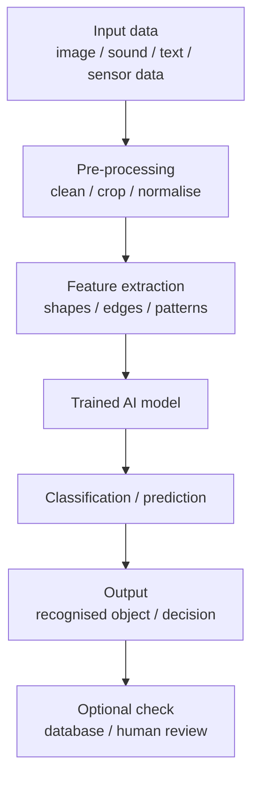

# AS 9618 Chapter 7: Ethics and Ownership

<strong>AS 9618 · Paper 1</strong>9618 · 2027–2029 · Version 2

## Official Syllabus Checklist

Revise: professional ethics; copyright; software licences; artificial intelligence and its impacts.

> The checklist paraphrases the syllabus for revision. Use the official syllabus as the final authority.

## Core Knowledge

Use the topic sections below to connect definitions, processes, comparisons and calculations.

## Chapter at a Glance

Use this overview to apply ethical principles, explain ownership, evaluate AI and balance impacts.

### Apply ethical principles

根据公众利益、安全、公平和保密要求判断行为。

- Computing professionals should act honestly, protect confidentiality and avoid preventable harm.
- A code of conduct turns broad ethical principles into expected professional behaviour.
- Bodies such as BCS and IEEE provide standards, guidance and accountability.

**Exam cue:** Identify the affected stakeholder and explain the likely consequence.

### Explain ownership and licensing

区分作品所有权、使用许可和源代码开放程度。

- Copyright protects intellectual property and controls copying, distribution and modification.
- Free software, open-source, shareware and commercial licences grant different rights.
- The suitable licence depends on cost, source access, modification, support and distribution needs.

**Exam cue:** Justify the licence using the user or organisation's requirements.

### Evaluate AI uses

先说明人工智能执行的任务，再评价结果。

- AI can recognise images, text or speech and produce recommendations.
- Expert systems apply stored knowledge and rules to a user's data.
- Autonomous systems use sensor data to make and carry out decisions.

**Exam cue:** Explain the AI process instead of stating that it is “smart”.

### Balance impacts

完整评价必须同时考虑收益、风险和不同利益相关者。

- AI can improve speed, consistency, access to services and decision support.
- Bias, privacy loss and unsafe decisions can harm individuals or groups.
- Automation changes jobs, costs, energy use and environmental impact.

**Exam cue:** Develop both sides and finish with a scenario-based judgement.

---

## Syllabus Map

By the end of this chapter, students should be able to:

| Syllabus requirement | Student-friendly meaning |
| --- | --- |
| Show understanding of the need for and purpose of ethics as a computing professional | 解释为什么程序员/IT 专业人员必须负责任地工作 |
| Understand the importance of joining a professional ethical body including BCS and IEEE | 知道 BCS / IEEE 提供 code of conduct、professional standards 和 guidance |
| Show understanding of acting ethically or unethically in a given situation | 能根据场景判断行为是否 ethical，并解释影响 |
| Show understanding of copyright legislation | 解释 copyright 如何保护软件、代码、图像、音乐等 intellectual property |
| Show understanding of different types of software licensing | 比较 free software、open source、shareware、commercial software |
| Justify the use of a licence for a given situation | 根据 business/user/programmer 的需求选择 licence |
| Show understanding of AI | 解释 AI 是什么，以及它如何用于真实系统 |
| Understand applications and impacts of AI | 能写出 AI 的 social / economic / environmental impact |

---

## Ethics in Computing

### What is ethics?

#### Student explanation

**Ethics** means moral principles that guide people to decide what is right or wrong. In computer science, ethics is about using computing skills responsibly so that software and computer systems do not harm users, colleagues, organisations, or the public.

#### Mark scheme style definition

> Ethics are moral principles / a code of conduct that guide professional behaviour and help computing professionals act responsibly.

#### Required ideas / marking points

- **moral principles**
- **code of conduct**
- **professional behaviour**
- **responsibility**
- **public interest**
- **avoid harm**
- **trust**

---

### Why ethics matters for computing professionals

Computing professionals often work with:

- personal data
- private company information
- security systems
- medical / financial / transport systems
- AI decision-making systems
- software that many people depend on

如果程序员不 ethical，后果可能很严重：data leak、unsafe software、biased AI、unfair treatment、financial loss，甚至 physical harm。

#### Mark scheme style answer

> Computing professionals need to act ethically because their work can affect users, colleagues, organisations and the public. Ethical behaviour helps protect privacy, safety, security and trust, and reduces the risk of harm caused by software or data misuse.

---

### Ethical behaviour towards colleagues

A strong response should recognise that 不仅问 “what is ethics”，而是问 programmer 为什么要对 **colleagues** 和 **the public** 负责。

#### Good points for colleagues

A programmer should:

- treat colleagues fairly
- avoid discrimination
- respect other people's work
- give credit for contributions
- share knowledge / help train others
- accept and give constructive criticism
- not steal code from colleagues
- not hide mistakes that affect team work

#### Mark scheme style phrases

> The programmer should treat colleagues fairly and avoid discrimination.

> The programmer should credit the contributions of colleagues so that they feel valued and respected.

> The programmer should accept feedback so that technical work can be improved.

---

### Ethical behaviour towards the public

#### Good points for the public

A programmer should:

- protect users' personal data
- avoid releasing unsafe software
- be honest about software limitations
- avoid misleading claims
- prevent harm to health/safety/welfare
- consider accessibility
- reduce bias in systems
- report serious security risks responsibly

#### Mark scheme style phrases

> The programmer should maintain the health, safety and welfare of the public.

> The programmer should be honest about what the software can do so that public trust is maintained.

> The programmer should protect the security and privacy of the public's data.

---

### Ethical vs legal vs moral

| Term | Meaning | Example |
| --- | --- | --- |
| Legal | follows the law | buying software with a valid licence |
| Illegal | breaks the law | copying paid software without permission |
| Ethical | follows moral/professional standards | reporting a serious bug before release |
| Unethical | morally wrong / irresponsible | hiding a security flaw from users |
| Moral | personal or social idea of right/wrong | feeling that user data should not be sold without consent |

#### Exam warning

不要写：

> Ethics is the same as law.

更好的写法：

> Laws are formal rules enforced by the legal system, while ethics are moral/professional principles. An action may be legal but still unethical.

---

## Professional Ethical Bodies

### BCS and IEEE

The syllabus specifically names:

| Professional body | Full name | What students need to know |
| --- | --- | --- |
| BCS | British Computer Society | professional body for computing professionals |
| IEEE | Institute of Electrical and Electronics Engineers | professional body that provides standards and ethical guidance |

---

### Why join a professional ethical body?

#### Main purposes

Professional bodies help computing professionals by providing:

- code of conduct
- ethical guidance
- professional standards
- training / continuing professional development
- accountability
- recognition of professional status
- public trust

#### Mark scheme style answer

> A professional body provides a code of conduct and ethical guidance. This helps computing professionals make responsible decisions, follow professional standards, and maintain public trust.

---

### Common weak answer

Weak:

> BCS and IEEE help programmers do computer science.

Better:

> BCS and IEEE provide professional standards and codes of conduct so that computing professionals can act ethically and be accountable for their work.

---

## Copyright

### What is copyright?

#### Student explanation

**Copyright** is a legal protection for original work. In computer science, it can protect source code, software, documentation, images, music, videos and other digital content.

#### Mark scheme style definition

> Copyright is legal protection for original work / intellectual property, giving the owner control over copying, distribution, modification and use.

#### Required ideas / marking points

- **legal protection**
- **original work**
- **intellectual property**
- **owner / author**
- **permission**
- **copy / distribute / modify**
- **legal action**

---

### Why copyright legislation is needed

Copyright legislation is needed to:

- identify the owner / author
- protect intellectual property
- stop others copying software without permission
- stop illegal distribution
- protect income / revenue
- encourage creativity and software development
- allow legal action if work is stolen

#### Mark scheme style answer

> Copyright is needed to identify the programmer as the owner of the software and give legal protection if someone copies, steals or distributes it without permission.

---

### Copyright in software scenarios

| Scenario | Good answer direction |
| --- | --- |
| Programmer creates an app | copyright protects the programmer's ownership and income |
| Company sells software | copyright stops unauthorised copying and distribution |
| Student uses code from internet | must check licence / permission / attribution |
| Employee copies company code into own product | unethical and may breach copyright / contract |
| AI-generated content is used | check ownership, licence and permission; avoid claiming another person's work |

---

### Common mistakes

| Weak answer | Why weak | Better answer |
| --- | --- | --- |
| Copyright means no one can use it | Too absolute | Others may use it with permission / licence |
| Copyright protects hardware | Wrong focus | It protects original work / intellectual property such as code |
| Copyright is just a password | Confuses security and legal protection | Copyright gives legal rights to owner |
| Copyright is only for music | Too narrow | It can protect software, code, documents, images, etc. |

---

## Software Licences

### What is a software licence?

#### Definition

> A software licence is an agreement that states how software can be used, copied, modified and distributed.

#### What a licence controls

A licence may define:

- whether the user can install the software
- whether the user can copy it
- whether the source code can be viewed
- whether the source code can be modified
- whether the software can be redistributed
- whether payment is required
- whether support / updates are included

---

### Licence comparison table

| Licence type | Main idea | Source code? | Payment? | Best scenario |
| --- | --- | --- | --- | --- |
| Free Software Foundation | users have freedom to run, study, modify and share software | usually available | may be free or paid | community / freedom / modification needed |
| Open Source Initiative | source code is available and can be inspected/modified/redistributed under licence | available | may be free or paid | business needs to adapt source code |
| Shareware | trial / limited version first; payment needed later or for full features | usually not available | usually pay after trial | user wants to try before buying |
| Commercial software | sold for profit with restrictions on copying/modification | usually not available | paid | company wants income, support, controlled distribution |

---

### Free Software Foundation licence

#### Key idea

Free software is about **freedom**, not always price.

It normally gives users the freedom to:

- run the software
- study how it works
- modify it
- share copies

#### Mark scheme style phrases

> Users can run, study, modify and redistribute the software.

> The source code is available so that users can adapt the software.

#### Common mistake

Weak:

> Free software means the software has no copyright.

Better:

> Free software can still be copyrighted, but the licence gives users freedoms to use, study, modify and share it.

---

### Open Source Initiative licence

#### Key idea

Open source means the **source code is available** and can be examined and modified under the licence terms.

#### Why it is useful

Open source is suitable when:

- the business needs to modify source code
- programmers need to inspect code for security or quality
- a community can improve the software
- the software needs to be adapted to local needs

#### Mark scheme style answer

> An open source licence is suitable because the source code can be examined and modified, so the business can adapt the program to meet its needs.

---

### Shareware licence

#### Key idea

Shareware lets users try the software before paying.

It may be:

- free for a limited time
- free with limited features
- free for non-commercial use
- paid after trial period

#### Benefits to user

- can test the software before paying
- can check if it meets their needs
- lower risk before purchase

#### Benefits to distributor / developer

- more users may try the software
- users may later pay for full version
- acts as marketing / promotion

#### Mark scheme style answer

> Shareware is beneficial because users can try the software before paying, and the developer can still earn income if users pay for continued use or extra features.

#### 2024 exam warning

Do not only write:

> It is a trial version.

The question may ask for **benefits**. You must explain why that is useful.

---

### Commercial software licence

#### Key idea

Commercial software is sold for profit. Users usually pay for a licence, and there are restrictions on copying, modifying and redistributing the software.

#### Benefits to developer / company

- earns income / profit
- controls copying and distribution
- protects intellectual property
- can fund support and updates
- can use licence keys / subscriptions

#### Benefits to user / business

- may receive technical support
- may receive updates / patches
- may have warranty / service agreement
- clear legal right to use software

#### Mark scheme style answer

> A commercial licence is beneficial because the developer can earn income and control distribution, while users may receive support, updates and a legal right to use the software.

---

### Licence choice scenario bank

| Scenario | Best licence | Why |
| --- | --- | --- |
| Business wants to modify source code | Open source / Free software | source code can be examined and adapted |
| Developer wants users to try app before buying | Shareware | trial encourages users to test before paying |
| Company wants to sell software for profit | Commercial | protects income and restricts copying |
| School wants students to inspect code | Open source | source code can be studied |
| Community project wants people to improve software | Free software / Open source | users can modify and redistribute improvements |
| Business pays programmer for maintenance/security updates | Open source / Free software can be suitable | client can modify code while programmer earns from services |

---

## Artificial Intelligence \(AI\)

### What is AI?

#### Student explanation

**Artificial Intelligence (AI)** means computer systems performing tasks that normally need human intelligence, such as recognising images, understanding speech, making decisions, learning from data, or solving problems.

#### Mark scheme style definition

> AI is the ability of a computer system to perform tasks that normally require human intelligence, such as learning, recognising patterns, making decisions or solving problems.

#### Required ideas / marking points

- **human intelligence**
- **learning from data**
- **pattern recognition**
- **decision making**
- **classification**
- **trained model**
- **prediction**

---

### AI applications

| Application | How AI is used |
| --- | --- |
| Image recognition | identifies objects / faces / number plates from images |
| OCR | recognises text or characters from an image |
| Speech recognition | converts spoken words into text or commands |
| Expert system | uses rules/knowledge base to give advice/diagnosis |
| Recommendation system | suggests products/videos/music based on user behaviour |
| Autonomous vehicles | uses sensors and AI to make driving decisions |
| Fraud detection | finds unusual transaction patterns |
| Medical diagnosis support | identifies patterns in scans or patient data |
| Chatbots / virtual assistants | interpret user input and generate responses |
| Robotics | helps robots respond to environment and make decisions |

---

### How AI identifies a car registration number

This is a very important 2024-style scenario. Many students lose marks by describing only a database search.

#### Strong answer structure

1. Camera captures an image of the car / registration plate.  
2. Image is processed to locate the number plate area.  
3. AI / OCR model recognises characters on the plate.  
4. The model compares shapes/features/patterns with training data.  
5. It outputs the most likely registration number.  
6. The result may be checked against stored records.

#### Mark scheme style answer

> The camera captures an image of the number plate. Image recognition / OCR is used to locate the plate and identify the characters. The AI system compares the shapes and patterns in the image with a trained model / training data and outputs the most likely registration number.

#### Weak answer

> The camera takes a picture and checks the database.

Why weak?

- It does not explain AI.
- It does not mention image recognition / OCR / pattern recognition.
- It only describes storage or lookup.

---

### AI recognition process diagram

```mermaid
flowchart TD
A[Input data<br/>image / sound / text / sensor data] --> B[Pre-processing<br/>clean / crop / normalise]
B --> C[Feature extraction<br/>shapes / edges / patterns]
C --> D[Trained AI model]
D --> E[Classification / prediction]
E --> F[Output<br/>recognised object / decision]
F --> G[Optional check<br/>database / human review]
```

---

## Impacts of AI

### Social impacts

| Positive social impact | Explanation |
| --- | --- |
| Better accessibility | speech recognition, text-to-speech and translation help users with disabilities |
| Better healthcare | AI can support diagnosis and detect patterns in scans |
| Improved services | chatbots can answer user questions quickly |
| Increased safety | AI can detect fraud, danger or unusual behaviour |

| Negative social impact | Explanation |
| --- | --- |
| Privacy risk | AI may collect/analyse personal data or images |
| Surveillance | facial recognition and tracking can monitor people without consent |
| Bias / unfair decisions | biased training data can produce unfair outcomes |
| Loss of human contact | services may replace human interaction with automated systems |
| Over-reliance | people may trust AI decisions without checking them |

#### Mark scheme phrase

> A social impact of AI is that it can improve accessibility, but it may also reduce privacy if personal data or images are collected and analysed.

---

### Economic impacts

| Positive economic impact | Explanation |
| --- | --- |
| Higher productivity | AI can automate repetitive tasks |
| Lower long-term costs | fewer human hours may be needed for routine work |
| New jobs | creates roles in AI development, data analysis and system maintenance |
| Better decision making | businesses can analyse large amounts of data |

| Negative economic impact | Explanation |
| --- | --- |
| Job loss | workers doing routine tasks may be replaced |
| Retraining cost | employees need new skills |
| High setup cost | AI systems need hardware, data, software and experts |
| Market inequality | large companies may benefit more because they can afford AI |

#### Mark scheme phrase

> An economic impact of AI is that it can reduce labour costs by automating tasks, but it may cause job losses and require workers to retrain.

---

### Environmental impacts

| Positive environmental impact | Explanation |
| --- | --- |
| Energy optimisation | AI can reduce energy use in buildings or data centres |
| Better transport routing | AI can reduce fuel use and congestion |
| Resource monitoring | AI can detect pollution, crop disease or waste |

| Negative environmental impact | Explanation |
| --- | --- |
| High energy use | training/running AI models can use large amounts of electricity |
| Cooling requirements | data centres need cooling systems |
| E-waste | more hardware may be replaced or discarded |
| Carbon emissions | electricity use may increase emissions if energy source is not clean |

#### Mark scheme phrase

> An environmental impact of AI is that large AI systems may use a lot of electricity and require cooling, but AI can also optimise energy use and reduce waste in other systems.

---

## Mark Scheme Keywords

### Ethics keywords

- **moral principles**
- **code of conduct**
- **professional standards**
- **public interest**
- **health, safety and welfare**
- **privacy**
- **confidentiality**
- **trust**
- **fairness**
- **accountability**

### Copyright keywords

- **legal protection**
- **intellectual property**
- **owner / author**
- **permission**
- **copying**
- **distribution**
- **modification**
- **income / revenue**
- **legal action**

### Licence keywords

- **source code available**
- **modify / adapt**
- **redistribute**
- **trial period**
- **limited features**
- **pay for full version**
- **commercial profit**
- **restrict copying**
- **support and updates**

### AI keywords

- **training data**
- **trained model**
- **pattern recognition**
- **classification**
- **prediction**
- **image recognition**
- **OCR**
- **speech recognition**
- **bias**
- **privacy**

---

## Topic-Specific Common Confusions

| Question type | Weak answer | Better answer |
| --- | --- | --- |
| Define ethics | “Doing good things” | “Moral principles / code of conduct guiding professional behaviour” |
| Professional body | “It helps programmers get jobs” | “Provides code of conduct, standards, guidance and accountability” |
| Ethics vs law | “They are the same” | “Law is enforced by legal system; ethics is moral/professional judgement” |
| Ethical impact | “It is bad” | “It may harm users / reduce public trust / expose private data” |
| Copyright | “Stops everyone using it” | “Gives owner legal control over copying/distribution/use” |
| Free software | “No cost and no owner” | “Users have freedom to run, study, modify and share; copyright may still exist” |
| Open source | “It is free” | “Source code is available and can be examined/modified under licence” |
| Shareware benefit | “It is a trial” | “Users can try before paying; developer may gain paying customers” |
| Commercial benefit | “It is expensive” | “Developer earns income and controls distribution; user may get support/updates” |
| AI recognition | “Checks database” | “Uses OCR/image recognition and trained model to identify patterns/characters” |
| AI impact | “AI takes jobs” | “AI can automate routine work, reducing labour demand and causing retraining needs” |

---

## Scenario Answer Bank

### Programmer ethics scenarios

| Scenario | Answer direction |
| --- | --- |
| Programmer finds a security flaw before release | report/fix it; protects public data and safety; maintains trust |
| Programmer copies colleague's code without credit | unethical; does not credit contribution; may damage trust/teamwork |
| Programmer knows software claim is unrealistic | should be honest; avoids misleading public/client |
| Company collects user data secretly | privacy issue; unethical if no informed consent |
| Programmer releases untested safety software | unethical; may harm public health/safety/welfare |

#### Template

> The programmer should act ethically by ________. This protects ________ because ________. If they do not, it could cause ________ and reduce trust in the software/company.

---

### Copyright scenarios

| Scenario | Answer direction |
| --- | --- |
| Developer wants to protect an app | copyright identifies owner and allows legal action if copied |
| Someone uploads paid software for free | breaches copyright; unauthorised distribution; loss of income |
| Student uses image in project | check permission/licence; give attribution if required |
| Employee reuses company code in own app | may be unethical/illegal; code belongs to employer |

#### Template

> Copyright is needed because it identifies ________ as the owner and gives legal protection if someone ________ without permission.

---

### Licence choice scenarios

| Scenario | Suitable licence | Answer direction |
| --- | --- | --- |
| User wants to try software before paying | Shareware | trial/limited version reduces risk before purchase |
| Company wants to sell software and restrict copying | Commercial | earns income, protects IP, controls distribution |
| Business needs to change source code | Open source | source code can be examined and modified |
| Programmer wants community improvements | Open source / free software | others can modify and redistribute under licence |
| Client pays for maintenance but wants modifiable code | Open source / free software style | source can be changed; programmer earns from support/updates |

#### Template

> A suitable licence is ________ because ________. This matches the scenario because the user/business needs ________.

---

### AI scenarios

| Scenario | AI application | Answer direction |
| --- | --- | --- |
| Car park identifies registration numbers | OCR / image recognition | camera image, locate plate, recognise characters, trained model |
| Hospital scans patient images | image recognition | identify patterns that may show disease |
| Bank detects fraud | pattern recognition | compare transaction behaviour with normal patterns |
| Website suggests videos | recommendation system | uses previous user behaviour to predict interest |
| Smart speaker responds to voice | speech recognition | converts speech to text/commands |

#### Template

> AI is used by taking input data from ________. The system uses ________ recognition and compares patterns with a trained model. It then outputs ________.

---

## Required Ideas and Exam Language

Use technical terms as part of a complete statement: identify the component or method, state what it does, then link its effect to the question context. A keyword without a correct relationship is not a complete marking point.

## Common Confusions

- Do not substitute a related term for the process named in the question.
- Do not list advantages or definitions without linking them to the stated context.

## Worked Examples

The worked calculations, process templates and scenario answers above model the chain of reasoning expected in examination responses. Rework each example before reading its answer.

## 10-Mark Quick Check

**Total: 10 marks**

1. Define ethics in the context of computing. **[1]**
2. Give one reason why a programmer may join BCS or IEEE. **[1]**
3. Explain two ways copyright can protect the author of a new game. **[2]**
4. A company wants users to try a limited version before paying. Identify a suitable licence and give two reasons for the choice. **[3]**
5. Explain how an AI car-park system can identify a registration number from a camera image. **[3]**

## Quick Check Answers

1. Moral principles or a code of conduct that guides professional behaviour. **[1]**
2. It provides ethical guidance, professional standards, accountability or a recognised code of conduct. **[1]**
3. Copyright identifies the author/owner **[1]** and supports action against unauthorised copying or distribution / protects income **[1]**. **[2]**
4. Shareware **[1]**; users can try a limited version or trial before paying **[1]**; the company may convert trial users into paying users **[1]**. **[3]**
5. The camera captures the plate **[1]**; OCR/image recognition locates and identifies characters **[1]**; the model compares patterns with training data and outputs the most likely registration **[1]**. **[3]**

## 20-Mark Exam Practice

**Total: 20 marks**

### Question 1: Ethics in software development [5]

A programmer is developing software for a hospital. The software stores patient data and helps doctors view patient records.

Explain why the programmer needs to act ethically towards:

(a) colleagues working on the project [2]  
(b) the public / patients who use the hospital service [3]

#### Mark scheme

(a) Award up to [2]:

- Treat colleagues fairly / avoid discrimination. [1]
- Credit colleagues' contributions / respect their work. [1]
- Accept or give constructive feedback so software can be improved. [1]
- Share information / help train colleagues. [1]

(b) Award up to [3]:

- Protect patients' personal/private data. [1]
- Maintain health, safety and welfare of patients/public. [1]
- Be honest about system limitations / avoid misleading claims. [1]
- Ensure software is properly tested to avoid harm/errors. [1]
- Maintain public trust in hospital systems. [1]

---

### Question 2: Copyright and software ownership [4]

A programmer creates an application and sells it online. Another person copies the application and offers it as a free download.

Explain why copyright legislation is needed in this situation. [4]

#### Mark scheme

Award up to [4]:

- Copyright identifies the programmer as the owner/author. [1]
- Protects the programmer's intellectual property / original work. [1]
- Prevents unauthorised copying/distribution. [1]
- Allows legal action against the person copying it. [1]
- Protects the programmer's income/revenue. [1]
- Encourages software development/creativity by protecting work. [1]

---

### Question 3: Software licence choice [5]

A small business pays a programmer to create a program for its internal use. The business wants to be able to modify the source code later. The programmer will be paid to provide maintenance and security updates.

Identify a suitable type of licence and justify your choice. [5]

#### Mark scheme

Award marks as follows:

- Open Source Initiative / Free Software Foundation style licence. [1]
- Source code can be examined / accessed. [1]
- Source code can be modified/adapted by the business. [1]
- Suitable because the business may need to change the program later. [1]
- Programmer can still earn money from maintenance/security updates. [1]

Accept well-justified alternatives if linked clearly to the scenario.

---

### Question 4: AI application and impact [6]

A city uses AI cameras to identify vehicles entering a restricted traffic zone.

(a) Describe how AI can identify a vehicle registration number from a camera image. [3]  
(b) Explain one social impact and one economic impact of using this AI system. [3]

#### Mark scheme

(a) Award up to [3]:

- Camera captures an image/video of the vehicle/plate. [1]
- Image recognition / OCR locates plate and recognises characters. [1]
- AI compares features/patterns with training data/trained model. [1]
- Outputs predicted registration number / confidence score. [1]

(b) Award up to [3]:

Social impact:

- Improved traffic control / safer streets / fewer illegal vehicles. [1]
- Privacy/surveillance concern because vehicles and people may be tracked. [1]
- Bias/errors may wrongly identify vehicles and affect drivers. [1]

Economic impact:

- Reduces staff cost because checks are automated. [1]
- High setup/maintenance cost for cameras, servers and software. [1]
- May generate revenue from fines / improve traffic efficiency. [1]

Need at least one social and one economic point for full marks.

---

## Final Revision Checklist

- I can define the required terms precisely.
- I can explain each process in the correct order.
- I can apply the ideas to an unfamiliar scenario.
- I can complete the 10-mark check without notes.
- I can complete and self-mark the 20-mark practice.
