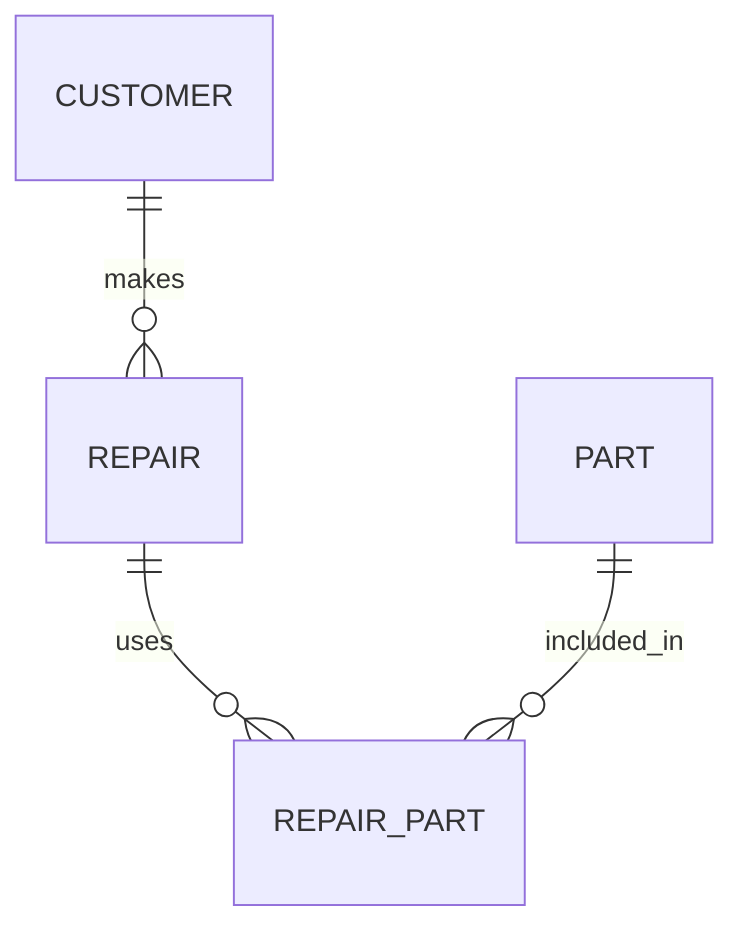
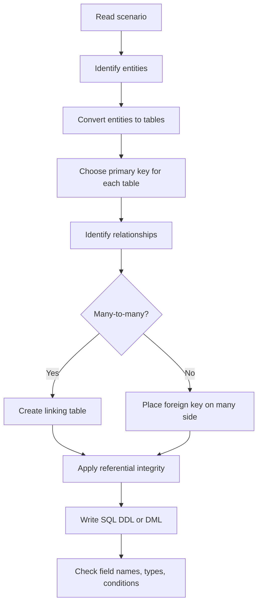

# AS 9618 Chapter 8: Databases

<div class="chapter-meta"><strong>AS 9618 · Paper 1</strong><span>9618 · 2027–2029 · Version 2</span></div>

## Official Syllabus Checklist

Revise: relational database concepts; normalisation; DBMS features; DDL and DML.

> The checklist paraphrases the syllabus for revision. Use the official syllabus as the final authority.

## Core Knowledge

Use the topic sections below to connect definitions, processes, comparisons and calculations.


## Syllabus Map

Chapter 8 contains three syllabus sections:

| Syllabus section | Main focus |
| --- | --- |
| **8.1 Database Concepts** | file-based approach, relational model, keys, E-R diagrams, normalisation |
| **8.2 Database Management Systems** | DBMS features, data dictionary, data security, data integrity, query processor |
| **8.3 DDL and DML** | SQL as DDL and DML, `CREATE TABLE`, `ALTER TABLE`, `SELECT`, `INSERT`, `DELETE`, `UPDATE` |

---

<span id="_4-one-page-mind-map" class="legacy-anchor" aria-hidden="true"></span>

## Chapter at a Glance

Use this overview to model data, normalise relations, explain the DBMS and write SQL.

### Model the database

<span lang="zh-CN">从实体、属性和键建立表之间的准确关系。</span>

- Represent each entity as a table containing attributes and tuples.
- Choose a primary key that uniquely identifies each record.
- Use foreign keys and linking tables to implement relationships and referential integrity.

**Exam cue:** Label keys and cardinality clearly on an entity-relationship model.

### Normalise to 3NF

<span lang="zh-CN">逐级消除重复组、部分依赖和传递依赖。</span>

- First normal form removes repeating groups and gives fields atomic values.
- Second normal form removes partial dependency on a composite key.
- Third normal form removes non-key dependency on another non-key attribute.

**Exam cue:** Show the new relations, primary keys and foreign keys at every stage.

### Explain DBMS functions

<span lang="zh-CN">数据库管理系统的功能要与集中控制数据联系起来。</span>

- A data dictionary stores metadata about tables, fields, types and constraints.
- Access rights, validation and backup support security, integrity and recovery.
- A query processor, logical schema and developer interface provide controlled data access.

**Exam cue:** State the DBMS feature and the specific benefit it provides.

### Write SQL

<span lang="zh-CN">先判断题目要求定义结构还是查询与修改数据。</span>

- Use DDL such as `CREATE TABLE` and `ALTER TABLE` to define database structures.
- Use `SELECT`, `WHERE`, `ORDER BY`, grouping and joins to retrieve required data.
- Use `INSERT`, `UPDATE` and `DELETE` to change records safely.

**Exam cue:** Check table names, join fields, conditions and required output columns.

---

## 8.1 Database Concepts

### File-based approach

#### Meaning

A **file-based approach** stores data in separate files, usually created for one specific application.

<span lang="zh-CN">中文理解</span>：
<span lang="zh-CN">就是每个程序自己管自己的文件</span>。<span lang="zh-CN">比如</span> repair data <span lang="zh-CN">一个文件</span>，customer data <span lang="zh-CN">一个文件</span>，invoice data <span lang="zh-CN">又一个文件</span>。<span lang="zh-CN">这样简单</span>，<span lang="zh-CN">但容易重复</span>、<span lang="zh-CN">难维护</span>。

#### Limitations

| Limitation | Brief Chinese Support | Mark scheme phrase |
| --- | --- | --- |
| Data duplication / redundancy | <span lang="zh-CN">同一数据在多个文件重复存储</span> | same data stored more than once |
| Data inconsistency | <span lang="zh-CN">一个文件更新了</span>，<span lang="zh-CN">另一个没更新</span> | data may become inconsistent |
| Data isolation | <span lang="zh-CN">数据分散在不同文件中</span> | data stored in separate files |
| Program-data dependence | <span lang="zh-CN">文件结构变了</span>，<span lang="zh-CN">程序也要改</span> | file structure is dependent on program |
| Difficult to query | <span lang="zh-CN">很难跨文件查找复杂信息</span> | difficult to search / retrieve related data |
| Poor security | <span lang="zh-CN">权限不好统一控制</span> | difficult to control access rights |
| Poor integrity | <span lang="zh-CN">不容易统一验证数据正确性</span> | difficult to maintain data integrity |

#### 2024-style answer

> A file-based approach can cause data redundancy because the same customer data may be stored in several files. A relational database reduces redundancy by storing customer data once in a CUSTOMER table and linking it to other tables using a foreign key.

---

### Relational database

#### Definition

> A relational database stores data in tables. Tables are linked using primary keys and foreign keys.

<span lang="zh-CN">中文理解</span>：
relational database <span lang="zh-CN">的核心就是</span> **<span lang="zh-CN">分表</span> + <span lang="zh-CN">关联</span>**。<span lang="zh-CN">不是把所有数据塞进一个大表</span>，<span lang="zh-CN">而是把</span> customer、repair、part、invoice <span lang="zh-CN">等分开放</span>，<span lang="zh-CN">再用</span> key <span lang="zh-CN">连接</span>。

#### Core terms

| Term | Meaning | Brief Chinese Support |
| --- | --- | --- |
| Entity | something about which data is stored | <span lang="zh-CN">要存储的对象</span>，<span lang="zh-CN">如</span> CUSTOMER / REPAIR |
| Table / relation | a set of records about one entity | <span lang="zh-CN">表</span> |
| Attribute / field | one item of data stored for an entity | <span lang="zh-CN">字段</span> / <span lang="zh-CN">列</span> |
| Tuple / record | one row in a table | <span lang="zh-CN">一条记录</span> / <span lang="zh-CN">一行</span> |
| Domain | set of allowed values for an attribute | <span lang="zh-CN">一个字段允许的值范围</span> |
| Primary key | attribute(s) that uniquely identify a record | <span lang="zh-CN">主键</span>，<span lang="zh-CN">唯一识别一行</span> |
| Candidate key | attribute(s) that could be chosen as primary key | <span lang="zh-CN">候选键</span>，<span lang="zh-CN">可以当主键</span> |
| Secondary key | attribute used to retrieve a group of records; it does not have to be unique | <span lang="zh-CN">辅助检索键</span>，<span lang="zh-CN">可以重复</span> |
| Foreign key | attribute that references primary key in another table | <span lang="zh-CN">外键</span>，<span lang="zh-CN">连接另一张表</span> |
| Referential integrity | foreign key values must match existing primary key values or be null | <span lang="zh-CN">外键必须引用真实存在的主键</span> |
| Indexing | a separate ordered structure of key values and record pointers | <span lang="zh-CN">用键值和记录位置加快检索</span> |

---

### Primary key

#### Mark scheme answer

> A primary key is an attribute or set of attributes that uniquely identifies each record in a table.

#### Important points

+ must be **unique**
+ cannot normally be **NULL**
+ each table should have a primary key
+ can be one field or a **composite key**

#### Example

```sql
CUSTOMER(CustomerID, FirstName, LastName, ContactNumber)
```

`CustomerID` is suitable because each customer has a different ID.

---

### Candidate key

#### Mark scheme answer

> A candidate key is an attribute or set of attributes that could be used as the primary key because it uniquely identifies each record.

#### Example

In a table:

```text
STUDENT(StudentID, Email, PassportNumber, FirstName, LastName)
```

Possible candidate keys:

+ `StudentID`
+ `Email`
+ `PassportNumber`

Only one is chosen as the **primary key**, but all three could uniquely identify a student.

---

### Secondary key

#### Mark scheme answer

> A secondary key is an attribute used to find a group of records and does not have to contain unique values.

For example, `ClassCode` can retrieve every student in one class. Several students may have the same `ClassCode`, so it is not suitable as the primary key.

Do not define a secondary key as “the second candidate key”. Its purpose is retrieval, and duplicate values are allowed.

---

### Foreign key

#### Mark scheme answer

> A foreign key is an attribute in one table that refers to the primary key in another table.

#### Example

```text
REPAIR(RepairNumber, StartDate, EndDate, CustomerID, Device)
CUSTOMER(CustomerID, FirstName, LastName, ContactNumber)
```

`CustomerID` in `REPAIR` is a foreign key because it references `CustomerID` in `CUSTOMER`.

#### Common 2024-style task

Given:

```text
SALE(SaleID, BatchID, CustomerID, Quantity, Date)
BATCH(BatchID, Type, Flavour, Size, SellingPrice, EndDate)
CUSTOMER(CustomerID, CompanyName, EmailAddress, TelephoneNumber)
```

Foreign keys in `SALE`:

| Foreign key | References table |
| --- | --- |
| `BatchID` | `BATCH` |
| `CustomerID` | `CUSTOMER` |

---

### Referential integrity

#### Mark scheme answer

> Referential integrity ensures that a foreign key value in one table must match an existing primary key value in the referenced table.

#### Brief Chinese Support

<span lang="zh-CN">如果</span> `REPAIR.CustomerID = "C102"`，<span lang="zh-CN">那么</span> `CUSTOMER` <span lang="zh-CN">表里必须真的有</span> `CustomerID = "C102"`。
<span lang="zh-CN">不能出现</span> repair <span lang="zh-CN">记录属于一个不存在的</span> customer。

#### Why it matters

+ prevents orphan records
+ keeps relationships valid
+ improves data consistency
+ prevents invalid foreign key values

---

### Indexing

An **index** stores selected key values in an ordered structure together with pointers to the corresponding records.

#### Benefits

+ a query can search the smaller ordered index instead of scanning every record
+ records matching a secondary key, such as one postcode or class, can be located more quickly

#### Costs

+ the index requires additional storage
+ inserts, deletes and key updates must also update the index

Example: an index on `CustomerID` can point directly to one customer, while an index on the secondary key `Town` can point to every customer in the selected town.

---

### Relationships

#### One-to-one

One record in table A links to one record in table B.

Example:

```text
EMPLOYEE ---- LOGIN_DATA
```

Each employee has one login record; each login record belongs to one employee.

#### One-to-many

One record in table A links to many records in table B.

Example:

```text
CUSTOMER ---- REPAIR
```

One customer can have many repairs, but each repair belongs to one customer.

#### Many-to-many

Many records in table A link to many records in table B.

Example:

```text
REPAIR ---- PART
```

One repair can use many parts.
One part can be used in many repairs.

This is implemented using a **linking table**:

```text
REPAIR_PART(PartID, RepairNumber, Quantity)
```

#### Mark scheme style

> A many-to-many relationship is implemented by creating a linking table that contains the primary keys from both tables as foreign keys.

---

### E-R diagrams

#### What to show

An E-R diagram normally shows:

+ entities / tables
+ relationships between entities
+ one-to-many / many-to-many relationships
+ linking tables where needed

#### Example


```mermaid
erDiagram
    CUSTOMER ||--o{ REPAIR : makes
    REPAIR ||--o{ REPAIR_PART : uses
    PART ||--o{ REPAIR_PART : included_in
```

#### Exam advice

If you see a table like:

```text
REPAIR_PART(PartID, RepairNumber, Quantity)
```

that usually means it is a **linking table** between `REPAIR` and `PART`.

---

## Normalisation

### Why normalise?

#### Mark scheme answer

> Normalisation reduces data redundancy and helps avoid update, insert and delete anomalies.

<span lang="zh-CN">中文理解</span>：
normalisation <span lang="zh-CN">就是把</span>“<span lang="zh-CN">乱的大表</span>”<span lang="zh-CN">拆成</span>“<span lang="zh-CN">结构清楚的小表</span>”，<span lang="zh-CN">减少重复</span>，<span lang="zh-CN">避免数据改一处漏一处</span>。

#### Benefits

| Benefit | Brief Chinese Support | Mark scheme phrase |
| --- | --- | --- |
| Reduces redundancy | <span lang="zh-CN">减少重复数据</span> | reduces data duplication |
| Improves consistency | <span lang="zh-CN">数据更一致</span> | improves data consistency |
| Avoids update anomaly | <span lang="zh-CN">修改数据时不用改很多地方</span> | avoids update anomalies |
| Avoids insert anomaly | <span lang="zh-CN">可以插入某类数据而不依赖其他数据</span> | avoids insert anomalies |
| Avoids delete anomaly | <span lang="zh-CN">删除一条记录不会误删其他重要信息</span> | avoids delete anomalies |
| Improves integrity | <span lang="zh-CN">数据更准确完整</span> | improves data integrity |

---

### First Normal Form: 1NF

#### Rule

> A table is in 1NF if it has no repeating groups and each field contains atomic values.

<span lang="zh-CN">中文理解</span>：
<span lang="zh-CN">一格里面只能放一个值</span>，<span lang="zh-CN">不能放列表</span>。

#### Bad example

| StudentID | Name | Subjects |
| --- | --- | --- |
| S01 | Amy | Maths, CS, Physics |

Problem: `Subjects` contains a repeating group.

#### Better design

| StudentID | Name |
| --- | --- |
| S01 | Amy |

| StudentID | Subject |
| --- | --- |
| S01 | Maths |
| S01 | CS |
| S01 | Physics |

---

### Second Normal Form: 2NF

#### Rule

> A table is in 2NF if it is in 1NF and every non-key attribute is fully dependent on the whole primary key.

<span lang="zh-CN">中文理解</span>：
<span lang="zh-CN">如果主键是</span> composite key，<span lang="zh-CN">那么非主键字段必须依赖整个主键</span>，<span lang="zh-CN">而不能只依赖其中一部分</span>。

#### Example

```text
ORDER_ITEM(OrderID, ProductID, ProductName, Quantity)
```

Composite key: `(OrderID, ProductID)`

Problem:

+ `Quantity` depends on both `OrderID` and `ProductID`
+ `ProductName` only depends on `ProductID`

So `ProductName` should be moved to `PRODUCT`.

---

### Third Normal Form: 3NF

#### Rule

> A table is in 3NF if it is in 2NF and has no non-key attribute depending on another non-key attribute.

<span lang="zh-CN">中文理解</span>：
<span lang="zh-CN">非主键字段不能依赖另一个非主键字段</span>。

#### Example

```text
STUDENT(StudentID, Name, TutorID, TutorName)
```

Problem:

+ `TutorName` depends on `TutorID`
+ `TutorID` is not the primary key of `STUDENT`

Better design:

```text
STUDENT(StudentID, Name, TutorID)
TUTOR(TutorID, TutorName)
```

---

### Normalisation quick exam wording

| Question asks | Best answer structure |
| --- | --- |
| “Give one benefit of normalisation” | reduces redundancy + improves consistency |
| “Why is this table not in 1NF?” | repeating group / non-atomic values |
| “How to remove many-to-many?” | create linking table with foreign keys |
| “Why split table?” | remove partial/transitive dependency |
| “What problem can occur without normalisation?” | update / insert / delete anomaly |

---

## 8.2 Database Management Systems DBMS

### DBMS definition

#### Mark scheme answer

> A DBMS is software used to define, create, maintain and control access to a database.

<span lang="zh-CN">中文理解</span>：
DBMS <span lang="zh-CN">就是管理数据库的软件层</span>。<span lang="zh-CN">它不是数据本身</span>，<span lang="zh-CN">而是用来创建表</span>、<span lang="zh-CN">修改数据</span>、<span lang="zh-CN">查询数据</span>、<span lang="zh-CN">控制权限</span>、<span lang="zh-CN">备份数据的软件系统</span>。

---

### DBMS features

| Feature | What it does | Mark scheme phrase |
| --- | --- | --- |
| Data dictionary | stores metadata about database structure | stores data about data |
| Data management | maintains data in tables | stores / updates / deletes data |
| Data modelling | helps design database structure | produces E-R model / logical schema |
| Logical schema | overall logical structure of database | independent of physical storage |
| Data integrity | keeps data accurate and consistent | validation / referential integrity |
| Data security | protects data from unauthorised access | access rights / passwords / encryption |
| Backup and recovery | makes copies and restores data | recover after data loss |
| Developer interface | allows developers to write commands / SQL | interface for database development |
| Query processor | processes SQL queries | interprets / optimises / executes queries |

---

### Data dictionary

#### Definition

> A data dictionary stores metadata about the database, such as table names, field names, data types, relationships and validation rules.

#### Examples of metadata

+ table names
+ field / attribute names
+ data types
+ field lengths
+ primary keys
+ foreign keys
+ relationships
+ validation rules
+ access rights

#### Common weak answer

> A data dictionary stores data.

Too vague. It stores **data about data**, not normal user records.

---

### Data integrity in DBMS

DBMS can improve integrity by:

+ enforcing data types
+ applying validation rules
+ enforcing referential integrity
+ preventing invalid foreign keys
+ using constraints such as `NOT NULL`
+ controlling concurrent updates

#### Mark scheme phrase

> The DBMS can enforce validation rules and referential integrity to ensure data remains accurate, complete and consistent.

---

### Data security in DBMS

DBMS can improve security by:

+ username and password
+ access rights
+ user groups
+ different permissions for read/write/delete
+ encryption
+ audit logs
+ backup procedures

#### Example answer

> A DBMS can use access rights so that different users can only view or modify the data they are authorised to access.

---

### Developer interface

#### Meaning

A developer interface lets developers create and modify database structures and write SQL queries.

#### Mark scheme style

> The developer interface allows a developer to write SQL commands to define, query and maintain the database.

---

### Query processor

#### Meaning

A query processor deals with SQL queries.

It may:

+ parse the query
+ check syntax
+ optimise the query
+ execute the query
+ return results

#### Mark scheme style

> The query processor interprets and executes SQL queries and may optimise them before execution.

---

## 8.3 DDL and DML

### DDL vs DML

| Type | Full name | Purpose | Examples |
| --- | --- | --- | --- |
| DDL | Data Definition Language | create / change database structure | `CREATE DATABASE`, `CREATE TABLE`, `ALTER TABLE` |
| DML | Data Manipulation Language | query / insert / update / delete data | `SELECT`, `INSERT`, `UPDATE`, `DELETE` |

#### Mark scheme answer

> DDL is used to define or modify the structure of a database. DML is used to query and maintain the data stored in the database.

---

### SQL data types

| Data type | Use | Example |
| --- | --- | --- |
| `CHARACTER` | fixed-length text | code with fixed length |
| `VARCHAR(n)` | variable-length text up to n characters | names, emails |
| `BOOLEAN` | true/false value | paid / active |
| `INTEGER` | whole number | quantity |
| `REAL` | decimal number | price |
| `DATE` | date value | start date |
| `TIME` | time value | appointment time |

#### Exam advice

Use sensible types:

| Field | Good type |
| --- | --- |
| ID with letters/numbers | `VARCHAR(n)` or `CHARACTER(n)` |
| price / amount | `REAL` |
| quantity | `INTEGER` |
| paid true/false | `BOOLEAN` |
| date sent / end date | `DATE` |
| contact number | `VARCHAR(n)`, not integer |

Contact numbers should not be `INTEGER` because they may start with `0` and are not used for arithmetic.

---

### SQL DDL: `CREATE TABLE`

#### General structure

```sql
CREATE TABLE TableName (
    Field1 DataType NOT NULL,
    Field2 DataType,
    PRIMARY KEY (Field1)
);
```

#### With foreign key

```sql
CREATE TABLE REPAIR (
    RepairNumber VARCHAR(6) NOT NULL,
    StartDate DATE,
    EndDate DATE,
    CustomerID VARCHAR(6),
    Device VARCHAR(30),
    PRIMARY KEY (RepairNumber),
    FOREIGN KEY (CustomerID) REFERENCES CUSTOMER(CustomerID)
);
```

---

### 2024-style DDL example: linking table

Given:

```text
REPAIR_PART(PartID, RepairNumber, Quantity)
```

A good answer:

```sql
CREATE TABLE REPAIR_PART (
    PartID VARCHAR(10) NOT NULL,
    RepairNumber VARCHAR(4) NOT NULL,
    Quantity INTEGER,
    PRIMARY KEY (PartID, RepairNumber),
    FOREIGN KEY (PartID) REFERENCES PART(PartID),
    FOREIGN KEY (RepairNumber) REFERENCES REPAIR(RepairNumber)
);
```

#### Why this is strong

| Part | Why it gets marks |
| --- | --- |
| `CREATE TABLE REPAIR_PART` | correct table creation |
| `PartID VARCHAR(...)` | text ID with letters/numbers |
| `RepairNumber VARCHAR(...)` | leading zero possible, so not integer |
| `Quantity INTEGER` | quantity is whole number |
| `PRIMARY KEY (PartID, RepairNumber)` | composite key for linking table |
| two `FOREIGN KEY` lines | correctly links to parent tables |

---

### SQL DML: `SELECT`

#### Basic structure

```sql
SELECT FieldName
FROM TableName
WHERE condition;
```

#### Example

```sql
SELECT FirstName, LastName
FROM CUSTOMER
WHERE CustomerID = 'C102';
```

---

### `SUM`, `COUNT`, `AVG`

| Function | Purpose | Example use |
| --- | --- | --- |
| `SUM` | total of numeric values | total amount due |
| `COUNT` | number of records | number of customers |
| `AVG` | average of numeric values | average price |

#### Example: total unpaid invoices

```sql
SELECT SUM(AmountDue)
FROM INVOICE
WHERE SupplierID = 'JK675'
AND Paid = FALSE;
```

This is a very common Paper 1 style: **aggregate function + WHERE condition**.

---

### Date conditions

Different SQL systems format dates slightly differently. In Cambridge answers, focus on logic.

Example:

```sql
SELECT SUM(Quantity)
FROM SALE
WHERE CustomerID = '0034E'
AND Date >= '2023-01-01'
AND Date <= '2023-12-31';
```

Alternative accepted style may use:

```sql
AND Date BETWEEN '2023-01-01' AND '2023-12-31'
```

#### Exam warning

If the field is called `Date`, keep it exactly as shown in the question unless the question uses another name such as `DateSent`.

---

### `GROUP BY`

Use `GROUP BY` when the question asks for totals/counts **for each group**.

#### Example

Show number of birds for each size:

```sql
SELECT Size, COUNT(BirdID)
FROM BIRD_TYPE
GROUP BY Size;
```

#### Common mistake

Writing `COUNT(Size)` when the question wants count of records.
Usually safer: `COUNT(*)` or `COUNT(PrimaryKey)`.

---

### `INNER JOIN`

Use `INNER JOIN` when data is needed from two tables.

#### Example

```sql
SELECT CUSTOMER.FirstName, REPAIR.Device
FROM CUSTOMER
INNER JOIN REPAIR
ON CUSTOMER.CustomerID = REPAIR.CustomerID;
```

#### Mark scheme style

You can also see comma-style join:

```sql
SELECT CUSTOMER.FirstName, REPAIR.Device
FROM CUSTOMER, REPAIR
WHERE CUSTOMER.CustomerID = REPAIR.CustomerID;
```

Both express the same basic relationship.

---

### DML maintenance commands

#### `INSERT INTO`

```sql
INSERT INTO CUSTOMER(CustomerID, FirstName, LastName)
VALUES('C105', 'Amy', 'Chen');
```

#### `UPDATE`

```sql
UPDATE INVOICE
SET Paid = TRUE
WHERE InvoiceID = '000002';
```

#### `DELETE FROM`

```sql
DELETE FROM INVOICE
WHERE InvoiceID = '000003';
```

#### Exam warning

Never write:

```sql
DELETE FROM INVOICE;
```

unless you want to delete every row.

---

## Mark Scheme Keywords

### Database concept keywords

| Concept | Required ideas / marking points |
| --- | --- |
| Primary key | uniquely identifies each record |
| Candidate key | could be used as primary key |
| Foreign key | references primary key in another table |
| Referential integrity | foreign key matches existing primary key |
| Tuple | row / record |
| Attribute | field / column |
| Entity | object about which data is stored |
| Relational database | data stored in linked tables |
| File-based limitation | redundancy / inconsistency / difficult access |
| Normalisation | reduces redundancy / removes anomalies |
| 1NF | no repeating groups / atomic values |
| 2NF | full dependency on whole key |
| 3NF | no non-key dependency |
| DBMS | define / create / maintain / control database |
| Data dictionary | metadata / data about data |
| Query processor | processes / optimises / executes SQL |
| Developer interface | allows developer to write SQL commands |

### SQL keywords

| SQL task | Keywords to include |
| --- | --- |
| Create table | `CREATE TABLE`, field names, data types |
| Primary key | `PRIMARY KEY(field)` |
| Foreign key | `FOREIGN KEY(field) REFERENCES Table(field)` |
| Query table | `SELECT ... FROM ...` |
| Filter rows | `WHERE` |
| Total | `SUM(field)` |
| Count | `COUNT(field)` / `COUNT(*)` |
| Average | `AVG(field)` |
| Sort | `ORDER BY` |
| Group | `GROUP BY` |
| Join tables | `INNER JOIN ... ON ...` |
| Add data | `INSERT INTO ... VALUES` |
| Change data | `UPDATE ... SET ... WHERE` |
| Remove data | `DELETE FROM ... WHERE` |

---

## Topic-Specific Common Confusions

| Mistake | Why it loses marks | Correct version |
| --- | --- | --- |
| saying primary key is “important field” | too vague | uniquely identifies each record |
| saying foreign key is “another primary key” | not precise | references primary key in another table |
| using `INTEGER` for IDs like `0022` | leading zero may be lost | use `VARCHAR` / `CHARACTER` |
| forgetting `PRIMARY KEY` in `CREATE TABLE` | loses DDL constraint mark | add `PRIMARY KEY(...)` |
| forgetting foreign key references | table not linked | add `FOREIGN KEY(...) REFERENCES ...` |
| using `SUM(*)` | invalid for total field | use `SUM(AmountDue)` |
| using `COUNT(Price)` for total price | count counts rows, not sum | use `SUM(Price)` |
| missing `WHERE` in update/delete | changes all rows | always include condition |
| confusing tuple and attribute | row vs column confusion | tuple = row, attribute = field |
| saying normalisation “makes database faster” only | weak and not always true | reduces redundancy and anomalies |
| drawing many-to-many directly without linking table | implementation missing | use linking table |
| saying data dictionary stores “words” | wrong context | stores metadata |

---

## Scenario Answer Bank

### Scenario 1: File-based approach limitation

**Question:**
A shop stores repair data using separate files. Give one limitation and explain how a relational database addresses it.

**Answer template:**

> A file-based approach can cause **data redundancy**, because the same customer details may be stored in several files. A relational database can store customer details once in a CUSTOMER table and link the data to repair records using a **foreign key**, reducing duplication and improving consistency.

---

### Scenario 2: Identify foreign keys

**Question:**
Given:

```text
SALE(SaleID, BatchID, CustomerID, Quantity, Date)
BATCH(BatchID, Type, Flavour)
CUSTOMER(CustomerID, CompanyName)
```

**Answer template:**

> `BatchID` in `SALE` is a foreign key referencing `BATCH(BatchID)`.
> `CustomerID` in `SALE` is a foreign key referencing `CUSTOMER(CustomerID)`.

---

### Scenario 3: Many-to-many relationship

**Question:**
A repair can use many parts. A part can be used in many repairs. Explain how this relationship is implemented.

**Answer template:**

> This is a many-to-many relationship. It can be implemented using a linking table, such as `REPAIR_PART`, which stores `RepairNumber` and `PartID` as foreign keys. These two fields can also form a composite primary key.

---

### Scenario 4: Normalisation benefit

**Question:**
Explain one benefit of normalisation.

**Answer template:**

> Normalisation reduces data redundancy because repeated data is moved into separate linked tables. This also improves data consistency because a value only needs to be updated in one place.

---

### Scenario 5: Write total SQL query

**Question:**
Return the total amount due for supplier `JK675` for unpaid invoices.

**Answer template:**

```sql
SELECT SUM(AmountDue)
FROM INVOICE
WHERE SupplierID = 'JK675'
AND Paid = FALSE;
```

---

### Scenario 6: Create linking table SQL

**Question:**
Write SQL to create `REPAIR_PART(PartID, RepairNumber, Quantity)`.

**Answer template:**

```sql
CREATE TABLE REPAIR_PART (
    PartID VARCHAR(10) NOT NULL,
    RepairNumber VARCHAR(4) NOT NULL,
    Quantity INTEGER,
    PRIMARY KEY (PartID, RepairNumber),
    FOREIGN KEY (PartID) REFERENCES PART(PartID),
    FOREIGN KEY (RepairNumber) REFERENCES REPAIR(RepairNumber)
);
```

---

### Scenario 7: DBMS security

**Question:**
Explain how a DBMS can protect data.

**Answer template:**

> A DBMS can use usernames and passwords to authenticate users. It can also use access rights so that each user can only read or modify the data they are authorised to access.

---

### Scenario 8: Data dictionary

**Question:**
Describe the purpose of a data dictionary.

**Answer template:**

> A data dictionary stores metadata about the database, such as table names, field names, data types, primary keys, foreign keys, relationships and validation rules.

---

## Mermaid Process Diagram: From Scenario to SQL


```mermaid
flowchart TD
A[Read scenario] --> B[Identify entities]
B --> C[Convert entities to tables]
C --> D[Choose primary key for each table]
D --> E[Identify relationships]
E --> F{Many-to-many?}
F -- Yes --> G[Create linking table]
F -- No --> H[Place foreign key on many side]
G --> I[Apply referential integrity]
H --> I
I --> J[Write SQL DDL or DML]
J --> K[Check field names, types, conditions]
```

---

## Required Ideas and Exam Language

Use technical terms as part of a complete statement: identify the component or method, state what it does, then link its effect to the question context. A keyword without a correct relationship is not a complete marking point.

## Common Confusions

- Do not substitute a related term for the process named in the question.
- Do not list advantages or definitions without linking them to the stated context.

## Worked Examples

The worked calculations, process templates and scenario answers above model the chain of reasoning expected in examination responses. Rework each example before reading its answer.

## 10-Mark Quick Check

**Total: 10 marks**

### Questions

1. Define **primary key**. `[1]`
2. Define **foreign key**. `[1]`
3. State what is meant by **referential integrity**. `[1]`
4. Give one limitation of a file-based approach. `[1]`
5. Give one benefit of normalisation. `[1]`
6. State the purpose of a data dictionary. `[1]`
7. Define **secondary key**. `[1]`
8. State one benefit of **indexing** a frequently searched field. `[1]`
9. Write the SQL aggregate function used to total values. `[1]`
10. State what `DML` is used for. `[1]`

## Quick Check Answers

1. An attribute / set of attributes that uniquely identifies each record.
2. An attribute in one table that references the primary key in another table.
3. Foreign key values must match existing primary key values in the referenced table.
4. Data redundancy / inconsistency / difficult access / poor security.
5. Reduces redundancy / improves consistency / avoids anomalies.
6. Stores metadata / data about data.
7. A field used to retrieve a group of records; its values do not have to be unique.
8. It can locate matching records without scanning the entire table / makes suitable searches faster.
9. `SUM`.
10. Querying and maintaining data stored in a database.

---

## 20-Mark Exam Practice

**Total: 20 marks**

### Question

A sports centre uses a relational database to store data about members, classes and class bookings.

The database has the following tables:

```text
MEMBER(MemberID, FirstName, LastName, ContactNumber)

CLASS(ClassID, ClassName, Instructor, Fee)

BOOKING(MemberID, ClassID, BookingDate, Paid)
```

#### (a) Define the term **primary key**. `[1]`

#### (b) Identify the foreign keys in `BOOKING` and state which table each one references. `[2]`

#### (c) Explain why `BOOKING` is needed in this database design. `[3]`

#### (d) Write an SQL script to create the table `BOOKING`. Include suitable data types and constraints. `[5]`

#### (e) Write an SQL script to return the number of unpaid bookings for the class with `ClassID = 'YOGA01'`. `[3]`

#### (f) Explain two benefits of using a relational database instead of a file-based approach. `[4]`

#### (g) Describe the purpose of a data dictionary in a DBMS. `[2]`

---

### Mark Scheme

#### (a) `[1]`

One mark:

> A primary key uniquely identifies each record in a table.

---

#### (b) `[2]`

| Foreign key | References |
| --- | --- |
| `MemberID` | `MEMBER(MemberID)` |
| `ClassID` | `CLASS(ClassID)` |

One mark for each correct foreign key + referenced table.

---

#### (c) `[3]`

Award up to 3 marks:

+ `MEMBER` and `CLASS` have a many-to-many relationship.
+ One member can book many classes.
+ One class can be booked by many members.
+ `BOOKING` acts as a linking table.
+ It stores data about each booking, such as `BookingDate` and `Paid`.

Example answer:

> `BOOKING` is needed because a member can book many classes and each class can be booked by many members. This is a many-to-many relationship, so a linking table is used. The linking table also stores data about the relationship, such as the booking date and whether it has been paid.

---

#### (d) `[5]`

Example answer:

```sql
CREATE TABLE BOOKING (
    MemberID VARCHAR(6) NOT NULL,
    ClassID VARCHAR(10) NOT NULL,
    BookingDate DATE,
    Paid BOOLEAN,
    PRIMARY KEY (MemberID, ClassID, BookingDate),
    FOREIGN KEY (MemberID) REFERENCES MEMBER(MemberID),
    FOREIGN KEY (ClassID) REFERENCES CLASS(ClassID)
);
```

Award marks:

| Mark | Requirement |
| --- | --- |
| 1 | `CREATE TABLE BOOKING` with brackets |
| 1 | suitable data types for `MemberID`, `ClassID`, `BookingDate`, `Paid` |
| 1 | suitable primary key |
| 1 | foreign key for `MemberID` |
| 1 | foreign key for `ClassID` |

---

#### (e) `[3]`

Example answer:

```sql
SELECT COUNT(*)
FROM BOOKING
WHERE ClassID = 'YOGA01'
AND Paid = FALSE;
```

Award marks:

| Mark | Requirement |
| --- | --- |
| 1 | `SELECT COUNT(...) FROM BOOKING` |
| 1 | condition for `ClassID = 'YOGA01'` |
| 1 | condition for unpaid bookings |

---

#### (f) `[4]`

Award up to 4 marks:

+ reduces data redundancy
+ because data is stored once in a table
+ improves consistency
+ because updates only need to be made in one place
+ allows relationships between tables using keys
+ improves data integrity through constraints / referential integrity
+ improves security using access rights
+ easier to query related data

Example answer:

> A relational database reduces redundancy because member details can be stored once in the MEMBER table and linked to bookings using `MemberID`. This improves consistency because the member details only need to be updated in one place. It also improves integrity because foreign keys can enforce valid relationships between tables.

---

#### (g) `[2]`

Award up to 2 marks:

+ stores metadata / data about data
+ examples: table names, field names, data types, keys, relationships, validation rules

Example answer:

> A data dictionary stores metadata about the database, such as table names, field names, data types, primary keys, foreign keys and validation rules.

---

## Final Revision Checklist

- [ ] I can model entities, keys, relationships and referential integrity.
- [ ] I can normalise data to 3NF using dependencies.
- [ ] I can explain secondary keys, indexing and DBMS functions.
- [ ] I can write the required SQL DDL and DML accurately.
- [ ] I can complete and self-mark both chapter practices.
