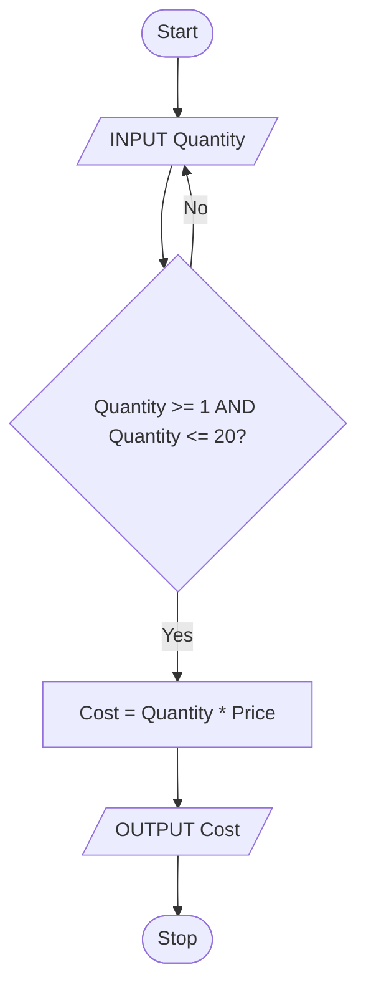

# AS 9618 Chapter 9: Algorithm Design and Problem-Solving

<div class="chapter-meta"><strong>AS 9618 · Paper 2</strong><span>9618 · 2027–2029 · Version 2</span></div>

## Official Syllabus Checklist

Revise: abstraction and decomposition; identifiers; algorithm constructs and representations; stepwise refinement.

> The checklist paraphrases the syllabus for revision. Use the official syllabus as the final authority.

## Core Knowledge

Use the topic sections below to connect definitions, processes, comparisons and calculations.

> **Paper 2 focus:** model the essential problem, decompose it, document the algorithm precisely and refine it until it can be programmed.

---

## Syllabus Map

| Syllabus objective | Where it is covered |
|---|---|
| Explain and apply abstraction | Abstraction |
| Produce an abstract model containing essential details | Abstraction and Worked Example 1 |
| Describe and use decomposition | Decomposition |
| Understand an algorithm as a sequence of defined steps | Algorithms |
| Use suitable identifiers and identifier tables | Identifiers and Identifier Tables |
| Include input, process and output | Input, Process and Output |
| Use sequence, selection and iteration | The Three Basic Constructs |
| Document algorithms using structured English, flowcharts and pseudocode | Algorithm Representations |
| Convert between structured English, flowcharts and pseudocode | Algorithm Representations and Worked Example 2 |
| Use stepwise refinement | Stepwise Refinement and Worked Example 3 |
| Use logic statements to define an algorithm | The Three Basic Constructs; Stepwise Refinement |

---

## Abstraction

**Abstraction** removes irrelevant detail and retains only the information needed to solve the current problem.

For a bus-fare program, essential details may include:

- passenger age
- journey zone
- discount entitlement
- fare rules

Usually irrelevant:

- passenger eye colour
- bus paint colour
- driver's favourite route

### Why abstraction is useful

- reduces the amount of information being considered
- makes the model easier to understand
- exposes the data and rules that affect the output
- prevents implementation effort being wasted on irrelevant details

An abstract model is not merely “a simpler description”. It must preserve every detail that changes the result.

---

## Decomposition

**Decomposition** divides a problem into smaller sub-problems that can become program modules.

Example:

```text
Process event entries
├── Input entrant details
├── Validate category
├── Calculate fee
├── Store entry
└── Display confirmation
```

Good modules:

- have one clear purpose
- have meaningful names
- define what data enters and leaves
- can be designed and tested separately
- avoid repeating work already performed elsewhere

Decomposition improves:

- understanding
- independent development
- testing and debugging
- reuse
- maintenance

Do not confuse decomposition with writing every instruction. It identifies the parts before their internal algorithms are refined.

---

## Algorithms

An **algorithm** is a solution expressed as a finite sequence of defined, unambiguous steps.

A usable algorithm must:

- have a clear starting state
- state the order of operations
- handle every required condition
- terminate
- produce the required output

Weak:

> Work out the result.

Precise:

```text
Total <- 0
FOR Index <- 1 TO ItemCount
    Total <- Total + Price[Index]
NEXT Index
OUTPUT Total
```

---

## Identifiers and Identifier Tables

An **identifier** is the name used for a variable, constant, array, record or subroutine.

Use names that communicate purpose:

- `ItemCount`
- `TotalDistance`
- `IsValid`
- `MAX_ENTRIES`

Avoid names such as `x`, `temp1` or `data` unless their meaning is genuinely clear from a very small scope.

### Identifier table

An identifier table defines the data used by a solution before detailed pseudocode is written.

| Identifier | Data type | Purpose |
|---|---|---|
| `EntrantName` | STRING | stores the current entrant's name |
| `Age` | INTEGER | stores the current entrant's age |
| `Fee` | REAL | stores the calculated entry fee |
| `IsJunior` | BOOLEAN | records whether junior pricing applies |
| `MAX_ENTRIES` | INTEGER constant | stores the fixed entry limit |

If an array is needed, include its element type and bounds:

| Identifier | Data type | Purpose |
|---|---|---|
| `LapTime` | ARRAY[1:8] OF REAL | stores eight lap times |

---

## Input, Process and Output

Use an IPO table before writing the detailed algorithm.

| Input | Process | Output |
|---|---|---|
| item prices, quantities | validate quantities, multiply, total | final cost |
| test scores | total, count, calculate average | average and grade |
| requested code | compare with stored codes | found/not-found message |

Storage can also be identified when the problem requires data to persist or be reused.

Questions to ask:

1. What data is supplied?
2. What calculations, comparisons and repetitions are required?
3. What must be displayed, returned or stored?
4. What invalid or exceptional cases must be handled?

---

## The Three Basic Constructs

### Sequence

Statements execute in order.

```text
INPUT Width
INPUT Height
Area <- Width * Height
OUTPUT Area
```

### Selection

```text
IF StockLevel < ReorderLevel THEN
    OUTPUT "Reorder"
ELSE
    OUTPUT "Stock sufficient"
ENDIF
```

Logic statements define when a path is followed:

```text
IF Age >= 12 AND Age <= 17 THEN
    TicketType <- "Teen"
ENDIF
```

### Iteration

```text
FOR Index <- 1 TO 10
    INPUT Score[Index]
NEXT Index
```

Every loop needs:

- an initial state
- a continuation or stopping condition
- progress towards termination

---

## Algorithm Representations

### Structured English

Structured English uses restricted, indented statements without relying on exact pseudocode syntax.

```text
REPEAT
    read the quantity
UNTIL the quantity is between 1 and 20 inclusive
calculate price multiplied by quantity
display the result
```

It should still show decisions and repetition clearly.

### Flowchart

Standard flowchart shapes:

| Shape | Purpose |
|---|---|
| rounded start/end | terminator |
| parallelogram | input or output |
| rectangle | process |
| diamond | decision |
| arrow | control flow |



### Pseudocode

```text
REPEAT
    INPUT Quantity
UNTIL Quantity >= 1 AND Quantity <= 20

Cost <- Quantity * Price
OUTPUT Cost
```

### Conversion method

When converting:

1. identify each input/output
2. identify every process
3. translate each decision into an `IF` or `CASE`
4. translate every backward flow into a suitable loop
5. preserve the original order and conditions
6. test the converted version with a small example

Do not add behaviour that was absent from the source representation.

---

## Stepwise Refinement

**Stepwise refinement** repeatedly replaces a high-level task with more detailed steps until every step can be programmed.

Initial statement:

```text
Produce weekly sales report
```

First refinement:

```text
Input daily sales
Calculate weekly statistics
Display report
```

Second refinement:

```text
FOR Day <- 1 TO 7
    input and validate Sales[Day]
NEXT Day

calculate total
calculate average
find highest value
display total, average and highest value
```

Final refinement expands each remaining high-level phrase:

```text
Total <- 0
Highest <- Sales[1]

FOR Day <- 1 TO 7
    Total <- Total + Sales[Day]
    IF Sales[Day] > Highest THEN
        Highest <- Sales[Day]
    ENDIF
NEXT Day

Average <- Total / 7
OUTPUT Total, Average, Highest
```

Stop refining when the steps are precise enough to translate directly into code.

---

## Worked Example 1 — Abstract and Decompose a System

A repair workshop records jobs. A customer supplies a device code, fault description and priority. The system allocates a job number and displays an estimated completion category. The colour of the customer's bag and the technician's route to work are also mentioned in the scenario.

### Abstraction

Essential:

- device code
- fault description
- priority
- job number
- rule for completion category

Irrelevant:

- bag colour
- route to work

### Decomposition

```text
Process repair job
├── Input job details
├── Validate priority
├── Allocate job number
├── Determine completion category
├── Store job
└── Display confirmation
```

### IPO

| Input | Process | Output |
|---|---|---|
| device code, description, priority | validate, allocate number, select category | job number, completion category |

This model preserves every detail that affects the result and excludes descriptive noise.

---

## Worked Example 2 — Identifier Table to Pseudocode

A venue charges $12 per adult ticket and $7 per child ticket. A booking may contain from 1 to 8 tickets.

### Identifier table

| Identifier | Data type | Purpose |
|---|---|---|
| `TicketCount` | INTEGER | number of tickets requested |
| `TicketType` | CHAR | `'A'` for adult or `'C'` for child |
| `Price` | REAL | price of one ticket |
| `TotalCost` | REAL | total booking cost |
| `ADULT_PRICE` | REAL constant | fixed adult price |
| `CHILD_PRICE` | REAL constant | fixed child price |

### Logic

```text
CONSTANT ADULT_PRICE = 12.00
CONSTANT CHILD_PRICE = 7.00

REPEAT
    INPUT TicketCount
UNTIL TicketCount >= 1 AND TicketCount <= 8

REPEAT
    INPUT TicketType
UNTIL TicketType = 'A' OR TicketType = 'C'

IF TicketType = 'A' THEN
    Price <- ADULT_PRICE
ELSE
    Price <- CHILD_PRICE
ENDIF

TotalCost <- TicketCount * Price
OUTPUT TotalCost
```

Every identifier in the pseudocode has a defined role and suitable type.

---

## Worked Example 3 — Refine a Ranking Algorithm

Requirement:

> Input five positive scores and display the highest score and its position.

### First refinement

```text
Input valid scores
Find highest score
Display result
```

### Final algorithm

```text
FOR Index <- 1 TO 5
    REPEAT
        INPUT Score[Index]
    UNTIL Score[Index] > 0
NEXT Index

Highest <- Score[1]
HighestPosition <- 1

FOR Index <- 2 TO 5
    IF Score[Index] > Highest THEN
        Highest <- Score[Index]
        HighestPosition <- Index
    ENDIF
NEXT Index

OUTPUT Highest
OUTPUT HighestPosition
```

The refined version defines validation, bounds, initialisation, comparison and output. No high-level instruction remains ambiguous.

---

## Required Ideas and Exam Language

Use technical terms as part of a complete statement: identify the component or method, state what it does, then link its effect to the question context. A keyword without a correct relationship is not a complete marking point.

## Common Confusions

- [ ] I remove only irrelevant detail during abstraction.
- [ ] I decompose into modules with distinct purposes.
- [ ] I use meaningful identifiers and define them in a table.
- [ ] I identify input, process and output before coding.
- [ ] I preserve logic when converting between representations.
- [ ] I label both branches of a flowchart decision.
- [ ] I refine until every step is programmable.
- [ ] I initialise variables before using them.
- [ ] I ensure every loop can terminate.
- [ ] I do not move array algorithms or testing theory into the wrong syllabus section.

---

## Worked Examples

The worked calculations, process templates and scenario answers above model the chain of reasoning expected in examination responses. Rework each example before reading its answer.

## 10-Mark Quick Check

1. Define abstraction and state one benefit. **[2]**
2. Define decomposition and state one benefit. **[2]**
3. State the three columns normally required in an identifier table. **[3]**
4. Name the three basic programming constructs. **[3]**

**Total: 10 marks**

## Quick Check Answers

1. Abstraction removes irrelevant details while retaining essential details **[1]**; it reduces complexity or focuses the solution on required data/rules **[1]**. **[2]**
2. Decomposition divides a problem into smaller sub-problems/modules **[1]**; it improves independent design, testing, reuse or maintenance **[1]**. **[2]**
3. Identifier, data type and purpose. **[3]**
4. Sequence, selection and iteration/repetition. **[3]**

---

## 20-Mark Exam Practice

A cycling event system records a rider number, age category, distance completed and completion time. It displays an award category. A scenario description also gives the rider's shirt colour and preferred music.

1. Identify two essential details and two irrelevant details for calculating the award. **[4]**
2. Give four suitable modules for the system. **[4]**
3. Create four identifier-table rows for data used by the solution. Include identifier, data type and purpose. **[4]**
4. Write pseudocode to:
   - input a distance from 0.0 to 100.0 inclusive
   - input a positive completion time
   - output `"Gold"` if the full 100.0 km was completed in at most 240 minutes
   - otherwise output `"Finisher"` if at least 60.0 km was completed
   - otherwise output `"No award"`. **[8]**

**Total: 20 marks**

### 20 Marks Practice Mark Scheme

1. Essential: any two of distance, completion time, award rules, and age category if used by the rules **[2]**. Irrelevant: shirt colour and preferred music **[2]**. **[4]**
2. Any four clear modules, for example input rider data, validate values, calculate/select award, store result, display result. **[4]**
3. Award one mark for each complete, suitable row. Example:

   | Identifier | Data type | Purpose |
   |---|---|---|
   | `RiderNumber` | STRING | stores the rider identifier |
   | `Distance` | REAL | stores kilometres completed |
   | `CompletionTime` | INTEGER | stores elapsed minutes |
   | `Award` | STRING | stores the selected award category |

   **[4]**

4. Example:

   ```text
   REPEAT
       INPUT Distance
   UNTIL Distance >= 0.0 AND Distance <= 100.0

   REPEAT
       INPUT CompletionTime
   UNTIL CompletionTime > 0

   IF Distance = 100.0 AND CompletionTime <= 240 THEN
       OUTPUT "Gold"
   ELSE
       IF Distance >= 60.0 THEN
           OUTPUT "Finisher"
       ELSE
           OUTPUT "No award"
       ENDIF
   ENDIF
   ```

   Distance input loop and both limits **[2]**; positive-time loop **[1]**; full-distance condition **[1]**; time condition combined with `AND` **[1]**; finisher condition **[1]**; mutually exclusive outputs **[1]**; correct structure and termination **[1]**. **[8]**

---

## Final Revision Checklist

- [ ] I can build an abstract model from a noisy scenario.
- [ ] I can decompose a problem into useful modules.
- [ ] I can produce a complete identifier table.
- [ ] I can identify input, process and output.
- [ ] I can convert between structured English, flowcharts and pseudocode.
- [ ] I can use stepwise refinement until an algorithm is programmable.
- [ ] I completed both practice sets before checking the answers.
