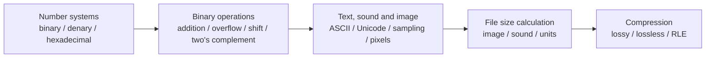
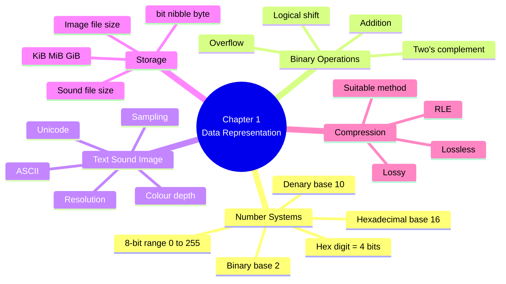

# IGCSE 0478 Computer Science — Chapter 1 Updated Notes
## Data Representation｜Syllabus-Aligned Paper 1 Revision Sheet
> **Version:** Syllabus-aligned revision; informed by recent Paper 1 patterns  
**Target:** Cambridge IGCSE Computer Science 0478  
**Main audience:** Students  
**Teacher Appendix:** optional; kept at the end for teachers  
**Style:** Chinese explanation + English mark scheme keywords  
>

---

# 0. How to Use This Sheet
本章不是“背很多定义”就能拿高分的章节。2025 的题目明显更喜欢考：

1. **conversion / calculation / working**  
2. **exact keyword definitions**  
3. **file size, colour depth, resolution, compression choice**  
4. **binary addition, overflow, logical shift, two's complement**

所以复习时请按下面顺序：



---

# 1. Recent Paper 1 Pattern Map
| Area | Recent exam pattern | What students must practise |
| --- | --- | --- |
| Binary / denary / hexadecimal | Very high frequency | Base 2 / base 10 / base 16, binary ↔ denary, hex ↔ binary, hex ↔ denary |
| Binary addition | High frequency | Show carries, add two 8-bit numbers, identify overflow |
| Logical shift | High frequency | Left shift = ×2 each shift, right shift = ÷2 each shift, lost bits, zeros shifted in |
| Two's complement | Medium-high | Convert negative denary ↔ 8-bit two's complement |
| Colour depth / resolution | High frequency | Define and explain effect on file size |
| Lossless compression / RLE | Very high frequency | "without permanently removing data", repeated pixels grouped and stored with count |
| Lossy vs lossless choice | High frequency | Choose based on file type and whether quality/data loss is acceptable |
| Sound file size | Medium | sample rate × sample resolution × duration × channels |
| ASCII / Unicode | Medium | Unicode supports more characters/languages/emojis but uses more bits |
| Very detailed lossy video/audio algorithms | Low | Know concept; avoid over-learning beyond syllabus |


---

# 2. Content Update Decision
## 2.1 Keep and Strengthen
| Kept content | Reason |
| --- | --- |
| binary / denary / hexadecimal conversions | Always examinable and frequently tested |
| binary addition and overflow | 2025 mark schemes reward working and overflow identification |
| logical shift | Tested as calculation + effect explanation |
| two's complement | Common short calculation topic |
| ASCII vs Unicode | Still syllabus and easy 1–3 mark area |
| sample rate / sample resolution / image resolution / colour depth | Core definitions and file size questions |
| KiB / MiB / GiB | Still important for calculation questions |
| lossy / lossless / RLE | High-frequency 2025 topic |


## 2.2 Downweight
| Downweighted content | Why |
| --- | --- |
| very detailed memory dump explanation | Usually only needs "hex is used for error codes / memory dumps" |
| too many decimal unit rows such as EB/PB | Students mainly need bit, nibble, byte, KiB, MiB, GiB |
| long lossy video compression details | Can confuse students; Paper 1 usually expects simple quality/file-size points |
| lookup table text compression details | Less central than RLE and lossless/lossy distinction |
| fixed claim: "Unicode is 16-bit" | Better answer: Unicode uses more bits than ASCII and represents more characters |


---

# 3. One-Page Mind Map


---

# 4. 1.1 Number Systems
## 4.1 Why computers use binary
### Mark scheme answer
> Computers use binary because computer circuits / transistors can only represent two states, such as on/off, high/low or 1/0. All data must be converted into binary so it can be processed and stored by the computer.
>

### Must-have keywords
+ **transistors**
+ **logic circuits**
+ **two states**
+ **on/off**
+ **1 and 0**
+ **processed / stored**

### Common weak answer
> Computers use binary because computers understand binary.
>

This is too vague. It does not explain **why**.

---

## 4.2 Number system definitions
| Number system | Base | Digits used | Key point |
| --- | ---: | --- | --- |
| Denary | 10 | 0–9 | normal human number system |
| Binary | 2 | 0 and 1 | used by computers |
| Hexadecimal | 16 | 0–9 and A–F | shorter representation of binary |


### Recent exam-style facts
+ 8-bit unsigned binary range: **0 to 255**
+ 1 hexadecimal digit = **4 bits**
+ A in hexadecimal = **10**
+ F in hexadecimal = **15**

---

## 4.3 Binary ↔ denary
### Binary to denary
Example:

```latex
Binary: 10110110

128 64 32 16 8 4 2 1
 1   0  1  1 0 1 1 0

= 128 + 32 + 16 + 4 + 2
= 182
```

### Denary to binary
Example: convert 53 to 8-bit binary.

```latex
53 = 32 + 16 + 4 + 1

128 64 32 16 8 4 2 1
 0   0  1  1 0 1 0 1

Answer = 00110101
```

### Common mistake
| Mistake | Correction |
| --- | --- |
| writing `110101` when question asks for 8-bit | write `00110101` |
| missing working | show place values or addition |
| treating binary as normal denary digits | binary place values are 128, 64, 32, 16... |


---

## 4.4 Hexadecimal ↔ binary
### Conversion table
| Binary | Hex | Denary | Binary | Hex | Denary |
| --- | --- | ---: | --- | --- | ---: |
| 0000 | 0 | 0 | 1000 | 8 | 8 |
| 0001 | 1 | 1 | 1001 | 9 | 9 |
| 0010 | 2 | 2 | 1010 | A | 10 |
| 0011 | 3 | 3 | 1011 | B | 11 |
| 0100 | 4 | 4 | 1100 | C | 12 |
| 0101 | 5 | 5 | 1101 | D | 13 |
| 0110 | 6 | 6 | 1110 | E | 14 |
| 0111 | 7 | 7 | 1111 | F | 15 |


### Binary to hexadecimal
Example:

```latex
Binary: 100010100001

Split into nibbles:
1000 1010 0001

Convert each nibble:
1000 = 8
1010 = A
0001 = 1

Answer = 8A1
```

### Hexadecimal to binary
Example:

```latex
Hex: 7B

7 = 0111
B = 1011

Answer = 01111011
```

### Common mistake
| Mistake | Why it loses marks |
| --- | --- |
| not grouping into 4 bits | hex conversion depends on nibbles |
| writing A as 11 | A = 10, B = 11 |
| dropping leading zeros in a required binary answer | one hex digit must become 4 bits |


---

## 4.5 Hexadecimal uses
| Use | Why hexadecimal is suitable |
| --- | --- |
| HTML colour codes | 6 hex digits represent RGB values, e.g. `#FF0000` |
| MAC addresses | shorter way to display a long binary address |
| IPv6 addresses | shorter and easier than binary |
| Error codes | easier for programmers to read |
| Memory dumps | compact way to display memory contents |
| Assembly / machine code | shorter representation of binary instructions |


### Mark scheme answer
> Hexadecimal is used because it is a shorter representation of binary, easier for humans / programmers to read, and easier to convert to binary than denary.
>

---

# 5. Binary Operations
## 5.1 Binary addition
### Rules
| Addition | Result |
| --- | --- |
| 0 + 0 | 0 |
| 0 + 1 | 1 |
| 1 + 0 | 1 |
| 1 + 1 | 10, write 0 carry 1 |
| 1 + 1 + 1 | 11, write 1 carry 1 |


### Example
```latex
   01100101
 + 01110000
 = 11010101
```

### 2025 mark scheme focus
Marks are often awarded for:

1. correct nibbles / final binary answer  
2. correct working / carries  
3. identifying overflow if result cannot fit in 8 bits

---

## 5.2 Overflow
### Definition
> Overflow occurs when the result is too large to be stored in the number of bits available.
>

### For 8-bit unsigned binary
+ Maximum value = **255**
+ If result is greater than 255, overflow occurs.
+ If a 9th bit is produced in an 8-bit register, overflow occurs.

### Mark scheme answer
> Overflow occurs because the result is greater than 255 / too large to be stored in 8 bits.
>

### Common mistake
> Overflow happens when there is a carry.
>

Not always enough. A carry inside the calculation is normal. You need to say **the final result cannot be stored in the available number of bits**.

---

## 5.3 Logical binary shift
### Rules
| Shift | Effect on positive binary integer |
| --- | --- |
| left shift 1 place | ×2 |
| left shift 2 places | ×4 |
| right shift 1 place | ÷2 |
| right shift 2 places | ÷4 |


### Important details
+ Bits shifted out of the register are **lost**.
+ Zeros are shifted in from the opposite side.
+ For right shifts, the result may be rounded down because lost bits are discarded.

### Example
```latex
Original: 01111000

Right shift 2 places:
00011110

Denary:
16 + 8 + 4 + 2 = 30
```

### Mark scheme answer structure
1. Show the binary number after the shift.  
2. Convert to denary if asked.  
3. Explain ×2 / ÷2 effect if asked.

---

## 5.4 Two's complement
## 8-bit two's complement range
| Bits | Range |
| --- | --- |
| 8-bit two's complement | -128 to +127 |


### Positive numbers
Positive numbers look like normal binary, but the leftmost bit is `0`.

Example:

```latex
+45 = 00101101
```

### Negative denary to 8-bit two's complement
Example: convert -38 to 8-bit two's complement.

Step 1: write +38 in binary.

```latex
+38 = 00100110
```

Step 2: flip all bits.

```latex
11011001
```

Step 3: add 1.

```latex
11011010
```

Answer:

```latex
-38 = 11011010
```

### Two's complement binary to denary
Example:

```latex
11101010
```

Because the leftmost bit is 1, it is negative.

Use column values:

```latex
-128 64 32 16 8 4 2 1
  1   1  1  0 1 0 1 0

= -128 + 64 + 32 + 8 + 2
= -22
```

### Common mistake
| Mistake | Correction |
| --- | --- |
| treating MSB as simply "negative sign" | MSB has value `-128` in 8-bit two's complement |
| forgetting to add 1 after flipping | negative conversion needs flip + add 1 |
| using unsigned range 0–255 for two's complement | two's complement 8-bit range is -128 to +127 |


---

# 6. 1.2 Text, Sound and Images
## 6.1 Text representation
### Character set
> A character set is a set of characters and the codes used to represent them.
>

### How text is stored
> Each character is given a unique binary code. The codes are stored in sequence.
>

Example: the word `RED`

```latex
R code stored first
E code stored second
D code stored third
```

---

## 6.2 ASCII vs Unicode
| Feature | ASCII | Unicode |
| --- | --- | --- |
| Character range | smaller | much larger |
| Languages | mainly English / limited characters | many languages |
| Symbols/emojis | limited | can represent symbols and emojis |
| Bits per character | fewer bits | more bits |
| File size | smaller | may be larger |


### Mark scheme answer
> Unicode can represent more characters, symbols, emojis and languages than ASCII, but it requires more bits per character.
>

### Common mistake
> Unicode is just another name for ASCII.
>

Wrong. Unicode has a much larger character set.

---

## 6.3 Sound representation
### Key terms
| Term | Meaning |
| --- | --- |
| Sample rate | number of samples taken per second |
| Sample resolution / sample depth | number of bits used to store each sample |
| Duration | length of the sound in seconds |
| Channels | mono = 1, stereo = 2 |


### How sound is sampled
Mark scheme style:

> The amplitude / height of the sound wave is measured at regular time intervals. Each sample is converted into a binary value. The sequence of binary values gives an approximation of the original sound wave.
>

### Effect of sample rate and sample resolution
| Increase in... | Effect |
| --- | --- |
| sample rate | more samples per second, more accurate recording, larger file size |
| sample resolution | more bits per sample, more accurate amplitude, larger file size |


### Common mistake
| Student writes | Why weak |
| --- | --- |
| "higher sample rate makes sound louder" | sample rate affects accuracy, not volume |
| "sample resolution is number of samples" | sample resolution is bits per sample |
| "sample rate and resolution reduce file size" | increasing them increases file size |


---

## 6.4 Image representation
### Key terms
| Term | Meaning |
| --- | --- |
| Pixel | smallest element / dot of an image |
| Image resolution | number of pixels in the image, often width × height |
| Colour depth | number of bits used to represent the colour of one pixel |


### Effect of resolution and colour depth
| Increase in... | Effect |
| --- | --- |
| resolution | more pixels, better detail, larger file size |
| colour depth | more colours available, larger file size |


### Mark scheme style
> The file size increases because more bits are needed to store the image.
>

---

# 7. 1.3 Data Storage and File Size
## 7.1 Units
### Binary units
| Unit | Size |
| --- | ---: |
| bit | smallest unit, 0 or 1 |
| nibble | 4 bits |
| byte | 8 bits |
| KiB | 1024 bytes |
| MiB | 1024 KiB |
| GiB | 1024 MiB |
| TiB | 1024 GiB |


### Exam warning
Cambridge often uses **KiB / MiB / GiB** for binary calculations.

Do not use 1000 unless the question specifically uses **KB / MB / GB**.

---

## 7.2 Image file size
### Formula
```latex
Image file size in bits = width × height × colour depth
```

If answer needs bytes:

```latex
bytes = bits ÷ 8
```

If answer needs KiB:

```latex
KiB = bytes ÷ 1024
```

If answer needs MiB:

```latex
MiB = KiB ÷ 1024
```

### Example
An image is 800 pixels wide and 600 pixels high. Colour depth is 16 bits.

```latex
File size = 800 × 600 × 16
          = 7 680 000 bits

Bytes = 7 680 000 ÷ 8
      = 960 000 bytes

KiB = 960 000 ÷ 1024
    = 937.5 KiB
```

---

## 7.3 Sound file size
### Formula
```latex
Sound file size in bits =
sample rate × sample resolution × duration × number of channels
```

### Example
A 10-second sound uses:

+ sample rate = 22 016 Hz
+ sample resolution = 8 bits
+ mono = 1 channel

```latex
File size = 22016 × 8 × 10 × 1
          = 1 761 280 bits

Bytes = 1 761 280 ÷ 8
      = 220 160 bytes

KiB = 220 160 ÷ 1024
    = 215 KiB
```

### Common mistake
| Mistake | Correction |
| --- | --- |
| forgetting to divide by 8 | bits must be converted to bytes |
| forgetting duration | sound size depends on length |
| forgetting stereo channels | stereo means ×2 |
| using 1000 instead of 1024 for KiB | KiB uses 1024 |


---

# 8. Compression
## 8.1 Why compression is needed
### Mark scheme answer
> Compression reduces file size, so less storage space is needed, less bandwidth is required, and the file can be transmitted / uploaded / downloaded faster.
>

### Keywords
+ **reduces file size**
+ **less storage**
+ **less bandwidth**
+ **faster transmission**
+ **faster upload/download**

---

## 8.2 Lossy vs lossless compression
| Feature | Lossless | Lossy |
| --- | --- | --- |
| Data removed? | No permanent data loss | Data permanently removed |
| Original can be restored? | Yes | No |
| File size reduction | usually smaller reduction | usually greater reduction |
| Suitable for | text, program code, important images | audio, video, photos where quality loss is acceptable |
| Example | RLE | JPEG / MP3 style compression |


### Mark scheme wording
**Lossless:**

> The file size is reduced without permanently removing any data.
>

**Lossy:**

> The file size is reduced by permanently removing data, so the original file cannot be fully reconstructed.
>

---

## 8.3 Run-length encoding (RLE)
### What it does
> RLE identifies repeated adjacent data and stores the value with the number of times it is repeated.
>

### Example
```latex
Original:
AAAAABBBCC

RLE:
5A 3B 2C
```

For images, this could mean:

```latex
5 red pixels, 3 blue pixels, 2 black pixels
```

### Mark scheme answer
> Repeating pixels / patterns are identified and grouped. The colour / value is stored with the number of times it is repeated.
>

---

## 8.4 Choosing compression method
| Scenario | Best choice | Why |
| --- | --- | --- |
| program code | lossless | code must be exactly restored or it may not run |
| text document | lossless | original text must not change |
| medical image | usually lossless | important details must not be lost |
| music streaming | lossy | smaller file, faster streaming, small quality loss acceptable |
| web photo | lossy | smaller file and faster download |
| artwork requiring exact detail | lossless | no part of the image should be lost |


<!-- 这是一个文本绘图，源码为：flowchart TD
A[Need to compress a file] --> B{Must the original be restored exactly?}
B -->|Yes| C[Use lossless compression]
B -->|No| D{Is small quality loss acceptable?}
D -->|Yes| E[Use lossy compression]
D -->|No| C
C --> F[Examples: RLE, lossless image/text compression]
E --> G[Examples: reducing colour depth, resolution, sample rate] -->


---

# 9. Mark Scheme Style Answer Templates
## 9.1 Why hexadecimal is used
> Hexadecimal is a shorter representation of binary. It is easier for humans / programmers to read and understand. It is also easy to convert between hexadecimal and binary because one hexadecimal digit represents four bits.
>

---

## 9.2 Explain overflow
> Overflow occurs when the result of a calculation is too large to be stored in the available number of bits. For an 8-bit unsigned register, any result greater than 255 cannot be stored.
>

---

## 9.3 Explain logical shift
> In a logical shift, bits are moved left or right. Bits shifted out of the register are lost and zeros are shifted in. A left shift multiplies a positive binary integer by 2 for each shift, while a right shift divides it by 2 for each shift.
>

---

## 9.4 Explain Unicode vs ASCII
> Unicode can represent more characters than ASCII, including different languages, symbols and emojis. Unicode usually requires more bits per character than ASCII, so files may require more storage.
>

---

## 9.5 Explain sampling sound
> The amplitude of the sound wave is measured at regular intervals. Each measurement is converted to a binary value. Increasing the sample rate or sample resolution improves the accuracy of the recording but increases the file size.
>

---

## 9.6 Explain image file size change
> The image file size increases because there are more pixels / more bits used to store each pixel. Increasing resolution increases the number of pixels, while increasing colour depth increases the number of bits used for each colour.
>

---

## 9.7 Explain lossless compression
> Lossless compression reduces the file size without permanently removing data. The original file can be restored after decompression. For example, RLE stores repeated data as a value and the number of repetitions.
>

---

# 10. Common Mistakes — Must Read
| Question type | Weak answer | Better answer |
| --- | --- | --- |
| Why binary? | "Computers understand binary" | "Transistors / logic circuits have two states, on/off or 1/0" |
| Hex benefit | "Hex is shorter" | "Shorter than binary, easier to read, one hex digit = four bits" |
| Overflow | "There is a carry" | "Result is greater than 255 / cannot be stored in 8 bits" |
| Logical shift | "Move bits" | "Bits shifted out are lost, zeros shifted in, left ×2, right ÷2" |
| Two's complement | "First bit is negative sign" | "MSB has value -128 in 8-bit two's complement" |
| Unicode | "Unicode is 16-bit" | "Unicode supports more characters/languages/emojis and uses more bits than ASCII" |
| Sample rate | "number of bits per sample" | "number of samples taken per second" |
| Sample resolution | "number of samples per second" | "number of bits used for each sample" |
| Colour depth | "number of pixels" | "number of bits used to represent each colour" |
| Resolution | "quality of image" | "number of pixels in the image" |
| KiB | divide by 1000 | divide by 1024 |
| Lossless | "makes file smaller" | "reduces file size without permanently removing data" |
| RLE | "removes repeated data" | "stores repeated data as value + count" |


---

# 11. Scenario Answer Bank
| Scenario | Answer direction |
| --- | --- |
| Artist wants image quality unchanged | use lossless; no data is permanently removed; original image can be restored |
| Website wants faster image loading | use lossy; smaller file; faster download; some quality loss acceptable |
| Program code compressed | use lossless; code must be exactly restored |
| Sound file too large for email | use compression; reduces file size; faster upload; may use lossy if quality loss acceptable |
| Image has many repeated colours | RLE suitable; repeated adjacent pixels can be grouped |
| A file must be transmitted quickly | compression reduces file size, uses less bandwidth, shorter transmission time |
| Increase colour depth | more colours available, more bits per pixel, larger file size |
| Increase sample rate | more samples per second, more accurate sound, larger file size |


---

# 12. 10 Marks Quick Check
## Questions
1. State the base of the binary number system. [1]  
2. State the largest denary value that can be stored in an unsigned 8-bit register. [1]  
3. Convert `10101110` to hexadecimal. [1]  
4. Convert `3F` to binary. [1]  
5. Explain why overflow occurs in 8-bit binary addition. [2]  
6. State the effect of a logical left shift by two places on a positive binary integer. [1]  
7. State one advantage of Unicode over ASCII. [1]  
8. State what is meant by colour depth. [1]  
9. Give one reason why compression is used. [1]

## Answers
1. Base 2  
2. 255  
3. AE  
4. 00111111  
5. The result is too large / greater than 255 / cannot be stored in 8 bits.  
6. It multiplies the value by 4.  
7. It can represent more characters / languages / symbols / emojis.  
8. Number of bits used to represent the colour of one pixel.  
9. Reduces file size / reduces storage / faster transmission / less bandwidth.

---

# 13. 20 Marks Exam-Style Practice
## Question 1: Number systems and operations [8]
(a) Convert the denary number 182 to 8-bit binary. [1]  
(b) Convert `10110110` to hexadecimal. [1]  
(c) Convert `9C` to binary. [1]  
(d) Add the two binary numbers. Show working. [3]

```latex
  11010101
+ 00101111
```

(e) State whether overflow has occurred. Give a reason. [2]

### Mark scheme
(a) `10110110` [1]  
(b) `B6` [1]  
(c) `10011100` [1]  
(d) Correct answer `1 00000100` / lower 8 bits `00000100`; method/carries shown [3]  
(e) Overflow occurred [1] because the result needs more than 8 bits / is greater than 255 [1]

---

## Question 2: Image and compression [6]
An image has a resolution of 1024 × 768 pixels and a colour depth of 16 bits.

(a) Calculate the file size in KiB. Show working. [3]  
(b) Explain the effect of increasing the colour depth. [2]  
(c) Name one lossless compression method. [1]

### Mark scheme
(a)

```latex
1024 × 768 × 16 = 12 582 912 bits
12 582 912 ÷ 8 = 1 572 864 bytes
1 572 864 ÷ 1024 = 1536 KiB
```

[3]

(b) More colours can be represented [1], file size increases because more bits are used per pixel [1]  
(c) Run-length encoding / RLE [1]

---

## Question 3: Sound and character sets [6]
(a) A sound file has sample rate 44 100 Hz, sample resolution 16 bits, duration 20 seconds and stereo sound. Calculate the file size in bytes. [3]  
(b) Explain why increasing the sample rate improves the accuracy of the recording. [2]  
(c) Give one difference between ASCII and Unicode. [1]

### Mark scheme
(a)

```latex
44100 × 16 × 20 × 2 = 28 224 000 bits
28 224 000 ÷ 8 = 3 528 000 bytes
```

Award up to [3] for correct formula, substitution and final bytes.

(b) More samples are taken each second [1], so the digital version is a closer approximation of the original sound wave [1].  
(c) Unicode represents more characters/languages/symbols/emojis than ASCII / Unicode uses more bits per character [1].

---

# 14. Teacher Appendix

> Optional teacher-facing planning notes. Students can skip this appendix during normal revision.
## 14.1 Suggested teaching order
1. Start with **binary/hex conversion drills** every lesson for 5 minutes.  
2. Teach **binary addition + overflow** together because 2025 mark schemes reward working and overflow reasoning.  
3. Teach **logical shift** as both a binary operation and denary effect.  
4. Teach **two's complement** with the `flip + add 1` method, then practise binary-to-denary using the `-128` column.  
5. Teach **image and sound file size** after students are confident with units.  
6. Finish with **compression decision questions**, because students often know definitions but fail to justify choices.

## 14.2 What to remove from old lesson focus
+ Do not spend too long on very detailed memory dumps.
+ Do not over-teach lossy video algorithms such as temporal redundancy.
+ Do not force students to memorise every storage unit up to EiB unless required by your own school material.
+ Avoid saying Unicode is always exactly 16 bits; teach it as a larger character set that requires more bits than ASCII.

## 14.3 High-value classroom activities
| Activity | Purpose |
| --- | --- |
| Daily 5 conversion drill | improve speed and reduce careless errors |
| Binary addition with carry boxes | prepare for 3–4 mark calculation questions |
| File size relay race | practise formula + unit conversion |
| Compression scenario sorting | help students justify lossy/lossless choices |
| Common mistakes correction task | train mark scheme language |


## 14.4 Marking guidance for students
Students should be trained to write:

+ not just **"larger file"**, but **"larger file because more bits are used"**
+ not just **"lossless keeps quality"**, but **"without permanently removing data; original can be restored"**
+ not just **"overflow because carry"**, but **"result cannot be stored in 8 bits / greater than 255"**
+ not just **"Unicode has more characters"**, but **"more languages, symbols and emojis; uses more bits per character"**

---

# 15. Final One-Page Exam Sheet
## Number systems
+ Binary = base 2, digits 0 and 1  
+ Denary = base 10, digits 0–9  
+ Hexadecimal = base 16, digits 0–9 and A–F  
+ 1 hex digit = 4 bits  
+ 8-bit unsigned range = 0–255

## Binary operations
+ `1 + 1 = 10`
+ Overflow = result too large for available bits
+ Left shift = ×2 each shift
+ Right shift = ÷2 each shift
+ Two's complement 8-bit range = -128 to +127

## Text
+ ASCII = smaller character set
+ Unicode = more characters/languages/symbols/emojis, more bits per character

## Sound
+ Sample rate = samples per second
+ Sample resolution = bits per sample
+ Higher sample rate/resolution = better accuracy + larger file size

## Image
+ Resolution = number of pixels
+ Colour depth = bits per pixel / colour
+ Higher resolution/colour depth = larger file size

## File size
```latex
Image bits = width × height × colour depth

Sound bits = sample rate × sample resolution × duration × channels

Bytes = bits ÷ 8
KiB = bytes ÷ 1024
MiB = KiB ÷ 1024
```

## Compression
+ Compression = reduces file size
+ Benefits = less storage, less bandwidth, faster transmission
+ Lossless = no permanent data loss, original restored
+ Lossy = permanent data loss, smaller file
+ RLE = stores repeated data as value + count

