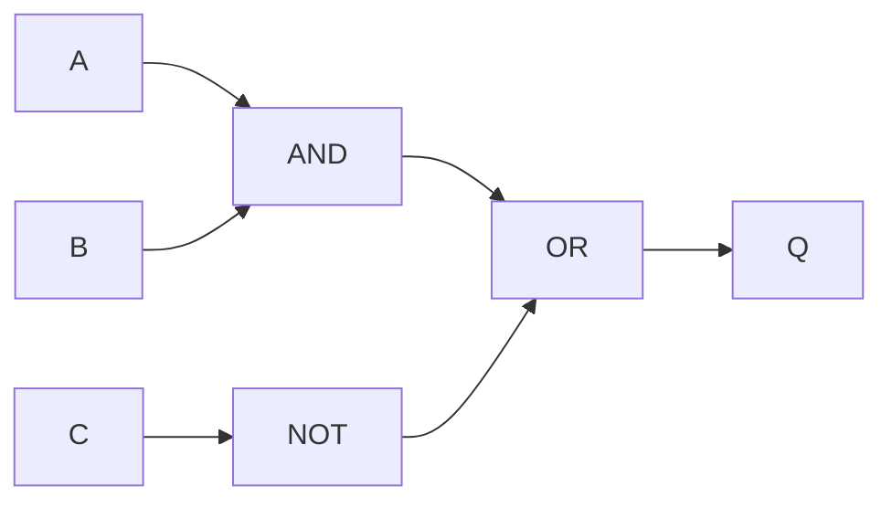
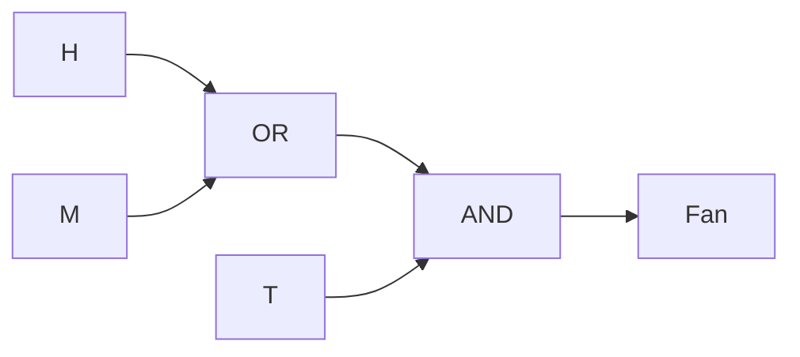

# Chapter 10: Boolean Logic

> **Paper 2 focus:** move accurately between a problem statement, logic-gate circuit, Boolean expression and truth table.

---

## 1. Syllabus Coverage

| Objective | Where it is covered |
|---|---|
| Recognise standard symbols for NOT, AND, OR, NAND, NOR and XOR/EOR | Section 2 |
| State the function of each gate | Sections 2–3 |
| Create a circuit from a problem, expression or truth table | Sections 5–6 |
| Complete a truth table from a problem, expression or circuit | Sections 4–6 |
| Write an expression from a problem, circuit or truth table | Sections 5–6 |
| Work with up to three inputs and one output | Worked Examples and practice sections |

---

## 2. Standard Logic Gates


Important symbol details:

- `NOT` is a triangle with a small inversion circle at the output.
- `NAND` is an `AND` gate with an inversion circle.
- `NOR` is an `OR` gate with an inversion circle.
- `XOR` or `EOR` looks like `OR` with one extra curved line at the input side.
- `NOT` has one input; each other required gate has two inputs.

In an exam, draw the standard shape rather than a rectangle containing the gate name.

---

## 3. Gate Functions and Truth Tables

### NOT

`NOT` reverses its input.

| A | NOT A |
|---:|---:|
| 0 | 1 |
| 1 | 0 |

### Two-input gates

| A | B | AND | OR | NAND | NOR | XOR/EOR |
|---:|---:|---:|---:|---:|---:|---:|
| 0 | 0 | 0 | 0 | 1 | 1 | 0 |
| 0 | 1 | 0 | 1 | 1 | 0 | 1 |
| 1 | 0 | 0 | 1 | 1 | 0 | 1 |
| 1 | 1 | 1 | 1 | 0 | 0 | 0 |

Meanings:

- `AND`: 1 only when both inputs are 1
- `OR`: 1 when at least one input is 1
- `NAND`: the inverse of `AND`
- `NOR`: the inverse of `OR`
- `XOR/EOR`: 1 when the two inputs are different

`OR` includes the case where both inputs are 1. `XOR` does not.

---

## 4. Building Truth Tables

For `n` inputs, a complete truth table contains `2^n` input combinations.

| Inputs | Rows |
|---:|---:|
| 1 | 2 |
| 2 | 4 |
| 3 | 8 |

For three inputs, use a systematic order:

| A | B | C |
|---:|---:|---:|
| 0 | 0 | 0 |
| 0 | 0 | 1 |
| 0 | 1 | 0 |
| 0 | 1 | 1 |
| 1 | 0 | 0 |
| 1 | 0 | 1 |
| 1 | 1 | 0 |
| 1 | 1 | 1 |

Add an intermediate column for every gate or sub-expression. This reduces mental errors and can earn method marks.

---

## 5. Moving Between Representations

### Expression to circuit

For:

```text
Q = (A AND B) OR (NOT C)
```

build it in the written order:

1. connect `A` and `B` to an `AND` gate
2. connect `C` to a `NOT` gate
3. connect both intermediate outputs to an `OR` gate
4. label the final output `Q`



The Mermaid diagram shows connectivity. In an exam response, replace the labelled boxes with the standard gate symbols from Section 2.

### Circuit to expression

Label intermediate outputs:

```text
X = A NAND B
Y = NOT C
Q = X OR Y
```

Then substitute only if needed:

```text
Q = (A NAND B) OR (NOT C)
```

### Problem statement to expression

Translate one condition at a time.

> A warning sounds when the door is open or the window is open, and the system is not in maintenance mode.

Let:

- `D = 1` when the door is open
- `W = 1` when the window is open
- `M = 1` when maintenance mode is active

Then:

```text
Q = (D OR W) AND (NOT M)
```

Brackets preserve the grouping in the problem.

### Truth table to circuit

First identify a familiar pattern:

- output 1 only for `11` suggests `AND`
- output 1 for every row except `00` suggests `OR`
- output 1 when inputs differ suggests `XOR`
- the inverse patterns suggest `NAND` or `NOR`

For a multi-gate table, use intermediate conditions rather than guessing from the final column.

---

## 6. Worked Example 1 — Expression to Truth Table

Complete the truth table for:

```text
Q = (A AND (NOT B)) OR C
```

Create columns in gate order:

| A | B | C | NOT B | A AND (NOT B) | Q |
|---:|---:|---:|---:|---:|---:|
| 0 | 0 | 0 | 1 | 0 | 0 |
| 0 | 0 | 1 | 1 | 0 | 1 |
| 0 | 1 | 0 | 0 | 0 | 0 |
| 0 | 1 | 1 | 0 | 0 | 1 |
| 1 | 0 | 0 | 1 | 1 | 1 |
| 1 | 0 | 1 | 1 | 1 | 1 |
| 1 | 1 | 0 | 0 | 0 | 0 |
| 1 | 1 | 1 | 0 | 0 | 1 |

Check:

- whenever `C = 1`, the final `OR` makes `Q = 1`
- when `C = 0`, `Q` is 1 only for `A = 1` and `B = 0`

---

## 7. Worked Example 2 — Scenario to Circuit

A greenhouse fan runs when:

- temperature is high, `T = 1`
- and either humidity is high, `H = 1`, or manual override is active, `M = 1`

Expression:

```text
Fan = T AND (H OR M)
```

Circuit construction:

1. connect `H` and `M` to an `OR` gate
2. connect that result and `T` to an `AND` gate
3. label the output `Fan`



Truth table:

| T | H | M | H OR M | Fan |
|---:|---:|---:|---:|---:|
| 0 | 0 | 0 | 0 | 0 |
| 0 | 0 | 1 | 1 | 0 |
| 0 | 1 | 0 | 1 | 0 |
| 0 | 1 | 1 | 1 | 0 |
| 1 | 0 | 0 | 0 | 0 |
| 1 | 0 | 1 | 1 | 1 |
| 1 | 1 | 0 | 1 | 1 |
| 1 | 1 | 1 | 1 | 1 |

The output cannot be 1 when `T = 0`, regardless of the other inputs.

---

## 8. Worked Example 3 — Trace a NAND/NOR Network

Given:

```text
X = A NAND B
Y = B NOR C
Q = X AND Y
```

For `A = 1`, `B = 0`, `C = 0`:

1. `A AND B = 0`, so `X = 1`
2. `B OR C = 0`, so `Y = 1`
3. `X AND Y = 1`, so `Q = 1`

Relevant rows:

| A | B | C | X = A NAND B | Y = B NOR C | Q |
|---:|---:|---:|---:|---:|---:|
| 0 | 0 | 0 | 1 | 1 | 1 |
| 0 | 0 | 1 | 1 | 0 | 0 |
| 1 | 0 | 0 | 1 | 1 | 1 |
| 1 | 1 | 0 | 0 | 0 | 0 |

Do not replace the given network with a simplified alternative when the task asks you to reproduce the stated circuit. Follow each gate exactly.

---

## 9. Common Mistakes Checklist

- [ ] I recognise the inversion circle on `NOT`, `NAND` and `NOR`.
- [ ] I recognise the extra input-side curve on `XOR/EOR`.
- [ ] I remember that `OR(1,1) = 1` but `XOR(1,1) = 0`.
- [ ] I include all 4 or 8 input combinations.
- [ ] I use intermediate columns in gate order.
- [ ] I label every input, intermediate output and final output.
- [ ] I use brackets to show grouping in expressions.
- [ ] I draw standard symbols rather than labelled rectangles in exam answers.
- [ ] I use no more than the stated inputs and one final output.
- [ ] I do not simplify a circuit when the task says not to.

---

## 10. 10 Marks Quick Check

1. State the output of an `AND` gate and a `NAND` gate when both inputs are 1. **[2]**
2. State the output of an `OR` gate and an `XOR` gate when both inputs are 1. **[2]**
3. State how the `NAND` symbol differs from the `AND` symbol, and how the `XOR` symbol differs from the `OR` symbol. **[2]**
4. State how many rows are needed for a truth table with three inputs. **[1]**
5. Write an expression for: “The lamp is on when switch A is on and switch B is not on.” **[2]**
6. State why intermediate columns are useful in a truth table. **[1]**

**Total: 10 marks**

### Quick Check Answers

1. `AND = 1`; `NAND = 0`. **[2]**
2. `OR = 1`; `XOR = 0`. **[2]**
3. `NAND` has an inversion circle at the output of an `AND` symbol; `XOR` has an extra curved line at the input side of an `OR` symbol. **[2]**
4. Eight rows. **[1]**
5. `Lamp = A AND (NOT B)`. **[2]**
6. They separate the result of each gate/sub-expression, making the process traceable and reducing errors. **[1]**

---

## 11. 20 Marks Practice

1. State the output condition for each gate: `NOT`, `AND`, `OR`, `NAND`, `NOR`, `XOR`. **[6]**
2. Complete the outputs:

   | A | B | A NAND B | A NOR B |
   |---:|---:|---:|---:|
   | 0 | 0 | ? | ? |
   | 0 | 1 | ? | ? |
   | 1 | 0 | ? | ? |
   | 1 | 1 | ? | ? |

   **[4]**
3. For `Q = (A NAND B) OR (NOT C)`, find `Q` for:
   - `A=0, B=0, C=1`
   - `A=0, B=1, C=1`
   - `A=1, B=1, C=0`
   - `A=1, B=1, C=1`

   **[4]**
4. A security light turns on when motion is detected, `M=1`, and it is either dark, `D=1`, or the test switch is active, `T=1`.
   - write the Boolean expression **[2]**
   - state the two gates required and their connection order **[2]**
   - find the output for `M=1, D=0, T=1` and for `M=0, D=1, T=1` **[2]**

**Total: 20 marks**

### 20 Marks Practice Mark Scheme

1.
   - `NOT`: output is the inverse of its one input
   - `AND`: 1 only when both inputs are 1
   - `OR`: 1 when at least one input is 1
   - `NAND`: inverse of `AND`
   - `NOR`: inverse of `OR`
   - `XOR`: 1 when the inputs are different

   One mark each. **[6]**

2.

   | A | B | A NAND B | A NOR B |
   |---:|---:|---:|---:|
   | 0 | 0 | 1 | 1 |
   | 0 | 1 | 1 | 0 |
   | 1 | 0 | 1 | 0 |
   | 1 | 1 | 0 | 0 |

   Award one mark per correct row. **[4]**

3.

   | A | B | C | A NAND B | NOT C | Q |
   |---:|---:|---:|---:|---:|---:|
   | 0 | 0 | 1 | 1 | 0 | 1 |
   | 0 | 1 | 1 | 1 | 0 | 1 |
   | 1 | 1 | 0 | 0 | 1 | 1 |
   | 1 | 1 | 1 | 0 | 0 | 0 |

   One mark per correct final output. **[4]**

4.
   - `Light = M AND (D OR T)`. **[2]**
   - Connect `D` and `T` to an `OR` gate, then connect its output and `M` to an `AND` gate. **[2]**
   - For `1,0,1`, output `1`; for `0,1,1`, output `0`. **[2]**

---

## 12. Final Self-Assessment

- [ ] I can draw and identify all six standard gate symbols.
- [ ] I can state every gate's output condition.
- [ ] I can build complete two-input and three-input truth tables.
- [ ] I can work from gate to gate using intermediate columns.
- [ ] I can translate a scenario into an expression and circuit.
- [ ] I can translate a circuit into an expression and truth table.
- [ ] I completed both practice sets without looking at the answers first.
