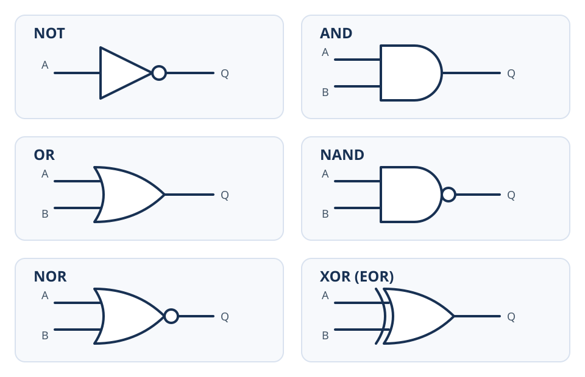
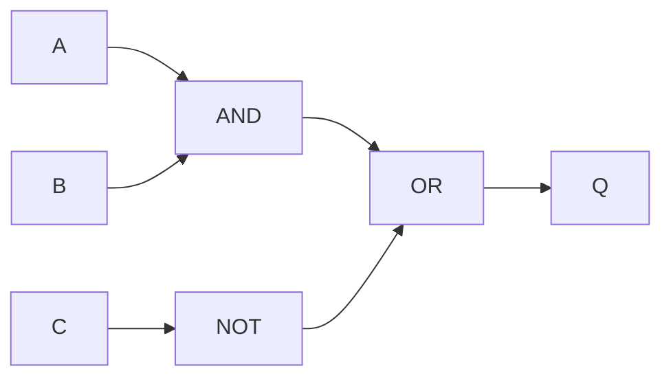
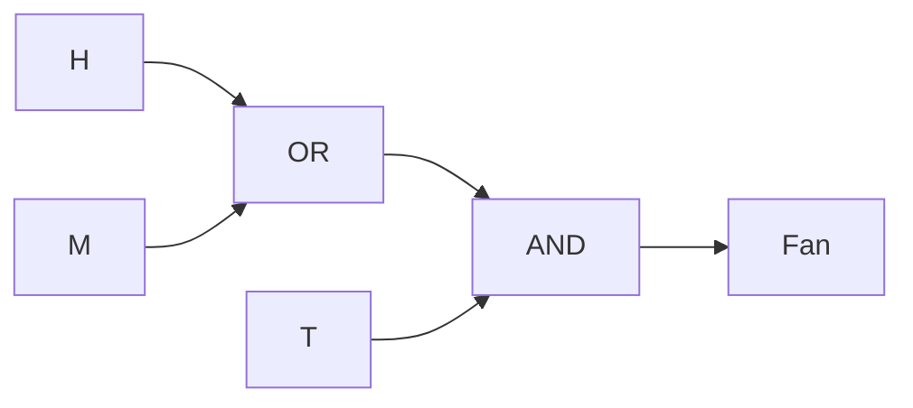
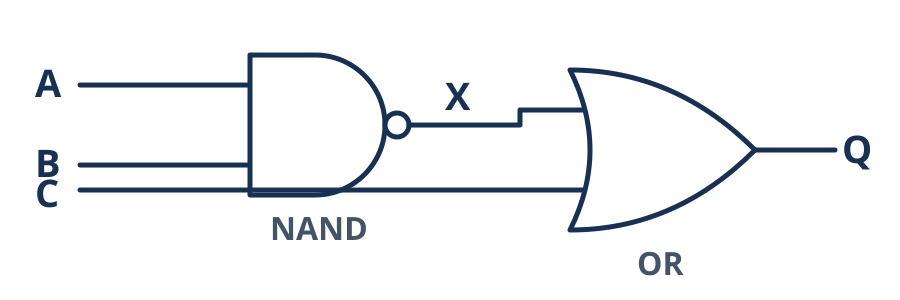

# IGCSE 0478 Chapter 10: Boolean Logic

<div class="chapter-meta"><strong>IGCSE 0478 · Paper 2</strong><span>0478 · 2026–2028 · Version 5</span></div>

## Official Syllabus Checklist

Revise: logic gates; Boolean expressions; truth tables; circuits and problem statements.

> The checklist paraphrases the syllabus for revision. Use the official syllabus as the final authority.

## Core Knowledge

Use the topic sections below to connect definitions, processes, comparisons and calculations.

> **Paper 2 focus:** move accurately between a problem statement, logic-gate circuit, Boolean expression and truth table.

---

## Syllabus Map

| Objective | Where it is covered |
|---|---|
| Recognise standard symbols for NOT, AND, OR, NAND, NOR and XOR/EOR | Standard Logic Gates |
| State the function of each gate | Standard Logic Gates; Gate Functions and Truth Tables |
| Create a circuit from a problem, expression or truth table | Moving Between Representations; Worked Example 1 — Expression to Truth Table |
| Complete a truth table from a problem, expression or circuit | Building Truth Tables; Moving Between Representations; Worked Example 1 — Expression to Truth Table |
| Write an expression from a problem, circuit or truth table | Moving Between Representations; Worked Example 1 — Expression to Truth Table |
| Work with up to three inputs and one output | Worked Examples and practice sections |

---

## Standard Logic Gates



Important symbol details:

- `NOT` is a triangle with a small inversion circle at the output.
- `NAND` is an `AND` gate with an inversion circle.
- `NOR` is an `OR` gate with an inversion circle.
- `XOR` or `EOR` looks like `OR` with one extra curved line at the input side.
- `NOT` has one input; each other required gate has two inputs.

In an exam, draw the standard shape rather than a rectangle containing the gate name.

---

## Gate Functions and Truth Tables

### NOT

`NOT` reverses its input.

| A | NOT A |
|---:|---:|
| 0 | 1 |
| 1 | 0 |

### Two-input gates

| A | B | AND | OR | NAND | NOR | XOR/EOR |
|---:|---:|---:|---:|---:|---:|---:|
| 0 | 0 | 0 | 0 | 1 | 1 | 0 |
| 0 | 1 | 0 | 1 | 1 | 0 | 1 |
| 1 | 0 | 0 | 1 | 1 | 0 | 1 |
| 1 | 1 | 1 | 1 | 0 | 0 | 0 |

Meanings:

- `AND`: 1 only when both inputs are 1
- `OR`: 1 when at least one input is 1
- `NAND`: the inverse of `AND`
- `NOR`: the inverse of `OR`
- `XOR/EOR`: 1 when the two inputs are different

`OR` includes the case where both inputs are 1. `XOR` does not.

---

## Building Truth Tables

For `n` inputs, a complete truth table contains `2^n` input combinations.

| Inputs | Rows |
|---:|---:|
| 1 | 2 |
| 2 | 4 |
| 3 | 8 |

For three inputs, use a systematic order:

| A | B | C |
|---:|---:|---:|
| 0 | 0 | 0 |
| 0 | 0 | 1 |
| 0 | 1 | 0 |
| 0 | 1 | 1 |
| 1 | 0 | 0 |
| 1 | 0 | 1 |
| 1 | 1 | 0 |
| 1 | 1 | 1 |

Add an intermediate column for every gate or sub-expression. This reduces mental errors and can earn method marks.

---

## Moving Between Representations

### Expression to circuit

For:

```text
Q = (A AND B) OR (NOT C)
```

build it in the written order:

1. connect `A` and `B` to an `AND` gate
2. connect `C` to a `NOT` gate
3. connect both intermediate outputs to an `OR` gate
4. label the final output `Q`



The Mermaid diagram shows connectivity. In an exam response, replace the labelled boxes with the standard gate symbols introduced under Standard Logic Gates.

### Circuit to expression

Label intermediate outputs:

```text
X = A NAND B
Y = NOT C
Q = X OR Y
```

Then substitute only if needed:

```text
Q = (A NAND B) OR (NOT C)
```

### Problem statement to expression

Translate one condition at a time.

> A warning sounds when the door is open or the window is open, and the system is not in maintenance mode.

Let:

- `D = 1` when the door is open
- `W = 1` when the window is open
- `M = 1` when maintenance mode is active

Then:

```text
Q = (D OR W) AND (NOT M)
```

Brackets preserve the grouping in the problem.

### Truth table to circuit

First identify a familiar pattern:

- output 1 only for `11` suggests `AND`
- output 1 for every row except `00` suggests `OR`
- output 1 when inputs differ suggests `XOR`
- the inverse patterns suggest `NAND` or `NOR`

For a multi-gate table, use intermediate conditions rather than guessing from the final column.

---

## Worked Example 1 — Expression to Truth Table

Complete the truth table for:

```text
Q = (A AND (NOT B)) OR C
```

Create columns in gate order:

| A | B | C | NOT B | A AND (NOT B) | Q |
|---:|---:|---:|---:|---:|---:|
| 0 | 0 | 0 | 1 | 0 | 0 |
| 0 | 0 | 1 | 1 | 0 | 1 |
| 0 | 1 | 0 | 0 | 0 | 0 |
| 0 | 1 | 1 | 0 | 0 | 1 |
| 1 | 0 | 0 | 1 | 1 | 1 |
| 1 | 0 | 1 | 1 | 1 | 1 |
| 1 | 1 | 0 | 0 | 0 | 0 |
| 1 | 1 | 1 | 0 | 0 | 1 |

Check:

- whenever `C = 1`, the final `OR` makes `Q = 1`
- when `C = 0`, `Q` is 1 only for `A = 1` and `B = 0`

---

## Worked Example 2 — Scenario to Circuit

A greenhouse fan runs when:

- temperature is high, `T = 1`
- and either humidity is high, `H = 1`, or manual override is active, `M = 1`

Expression:

```text
Fan = T AND (H OR M)
```

Circuit construction:

1. connect `H` and `M` to an `OR` gate
2. connect that result and `T` to an `AND` gate
3. label the output `Fan`



Truth table:

| T | H | M | H OR M | Fan |
|---:|---:|---:|---:|---:|
| 0 | 0 | 0 | 0 | 0 |
| 0 | 0 | 1 | 1 | 0 |
| 0 | 1 | 0 | 1 | 0 |
| 0 | 1 | 1 | 1 | 0 |
| 1 | 0 | 0 | 0 | 0 |
| 1 | 0 | 1 | 1 | 1 |
| 1 | 1 | 0 | 1 | 1 |
| 1 | 1 | 1 | 1 | 1 |

The output cannot be 1 when `T = 0`, regardless of the other inputs.

---

## Worked Example 3 — Circuit to a Complete Truth Table

Given:

```text
X = A NAND B
Y = B NOR C
Q = X AND Y
```

For `A = 1`, `B = 0`, `C = 0`:

1. `A AND B = 0`, so `X = 1`
2. `B OR C = 0`, so `Y = 1`
3. `X AND Y = 1`, so `Q = 1`

Complete every input combination rather than testing only convenient cases:

| A | B | C | X = A NAND B | Y = B NOR C | Q |
|---:|---:|---:|---:|---:|---:|
| 0 | 0 | 0 | 1 | 1 | 1 |
| 0 | 0 | 1 | 1 | 0 | 0 |
| 0 | 1 | 0 | 1 | 0 | 0 |
| 0 | 1 | 1 | 1 | 0 | 0 |
| 1 | 0 | 0 | 1 | 1 | 1 |
| 1 | 0 | 1 | 1 | 0 | 0 |
| 1 | 1 | 0 | 0 | 0 | 0 |
| 1 | 1 | 1 | 0 | 0 | 0 |

Do not replace the given network with a simplified alternative when the task asks you to reproduce the stated circuit. Follow each gate exactly.

---

## Worked Example 4 — Truth Table to Expression and Circuit

The output is 1 for exactly two input combinations:

| A | B | C | Q |
|---:|---:|---:|---:|
| 0 | 0 | 0 | 0 |
| 0 | 0 | 1 | 0 |
| 0 | 1 | 0 | 0 |
| 0 | 1 | 1 | 1 |
| 1 | 0 | 0 | 0 |
| 1 | 0 | 1 | 1 |
| 1 | 1 | 0 | 0 |
| 1 | 1 | 1 | 0 |

Write one condition for each row where `Q = 1`, then join the conditions with `OR`:

```text
Q = ((NOT A) AND B AND C) OR (A AND (NOT B) AND C)
```

To keep every required gate to two inputs, build each three-part condition in stages:

```text
X = (NOT A) AND B
P = X AND C
Y = A AND (NOT B)
R = Y AND C
Q = P OR R
```

The circuit therefore uses two `NOT` gates, four two-input `AND` gates and one two-input `OR` gate. This direct construction preserves the given truth table; do not simplify it unless the question asks you to.

---

## Required Ideas and Exam Language

Use technical terms as part of a complete statement: identify the component or method, state what it does, then link its effect to the question context. A keyword without a correct relationship is not a complete marking point.

## Common Confusions

- [ ] I recognise the inversion circle on `NOT`, `NAND` and `NOR`.
- [ ] I recognise the extra input-side curve on `XOR/EOR`.
- [ ] I remember that `OR(1,1) = 1` but `XOR(1,1) = 0`.
- [ ] I include all 4 or 8 input combinations.
- [ ] I use intermediate columns in gate order.
- [ ] I label every input, intermediate output and final output.
- [ ] I use brackets to show grouping in expressions.
- [ ] I draw standard symbols rather than labelled rectangles in exam answers.
- [ ] I use no more than the stated inputs and one final output.
- [ ] I do not simplify a circuit when the task says not to.

---

## Worked Examples

The worked calculations, process templates and scenario answers above model the chain of reasoning expected in examination responses. Rework each example before reading its answer.

## 10-Mark Quick Check

1. State the output of `NOT` when its input is 0, `AND` and `NAND` when both inputs are 1, and `NOR` when both inputs are 0. **[4]**
2. State the output of an `OR` gate and an `XOR` gate when both inputs are 1. **[2]**
3. State how the `NAND` symbol differs from the `AND` symbol, and how the `XOR` symbol differs from the `OR` symbol. **[2]**
4. Write an expression for: “The lamp is on when switch A is on and switch B is not on.” **[2]**

**Total: 10 marks**

## Quick Check Answers

1. `NOT(0) = 1`; `AND(1,1) = 1`; `NAND(1,1) = 0`; `NOR(0,0) = 1`. **[4]**
2. `OR = 1`; `XOR = 0`. **[2]**
3. `NAND` has an inversion circle at the output of an `AND` symbol; `XOR` has an extra curved line at the input side of an `OR` symbol. **[2]**
4. `Lamp = A AND (NOT B)`. **[2]**

---

## 20-Mark Exam Practice

1. The expression is `Q = (A OR B) AND (NOT C)`.
   - draw the circuit using standard gate symbols **[2]**
   - complete the final output column for all eight input combinations **[2]**

2. Use this circuit:

   

   - write the Boolean expression for `Q` **[1]**
   - complete the truth table, including the intermediate column `X` **[3]**

3. An alarm sounds when the door is open, `D = 1`, and either the system is armed, `A = 1`, or a manual test is active, `T = 1`.
   - write the Boolean expression **[1]**
   - draw the circuit using standard gate symbols **[2]**
   - complete the final output column for all eight input combinations **[3]**

4. Use the following truth table:

   | A | B | C | Q |
   |---:|---:|---:|---:|
   | 0 | 0 | 0 | 0 |
   | 0 | 0 | 1 | 0 |
   | 0 | 1 | 0 | 0 |
   | 0 | 1 | 1 | 1 |
   | 1 | 0 | 0 | 0 |
   | 1 | 0 | 1 | 1 |
   | 1 | 1 | 0 | 0 |
   | 1 | 1 | 1 | 0 |

   - write a Boolean expression that reproduces the table without simplification **[3]**
   - draw the corresponding circuit using only one-input `NOT` gates and two-input gates **[3]**

**Total: 20 marks**

### 20 Marks Practice Mark Scheme

1. Connect `A` and `B` to an `OR` gate; connect `C` to a `NOT` gate; connect both results to an `AND` gate **[2]**. In row order `000` to `111`, the output column is `0, 0, 1, 0, 1, 0, 1, 0`; award one mark for each correct half-column **[2]**. **[4]**

2. `Q = (A NAND B) OR C` **[1]**.

   | A | B | C | X = A NAND B | Q = X OR C |
   |---:|---:|---:|---:|---:|
   | 0 | 0 | 0 | 1 | 1 |
   | 0 | 0 | 1 | 1 | 1 |
   | 0 | 1 | 0 | 1 | 1 |
   | 0 | 1 | 1 | 1 | 1 |
   | 1 | 0 | 0 | 1 | 1 |
   | 1 | 0 | 1 | 1 | 1 |
   | 1 | 1 | 0 | 0 | 0 |
   | 1 | 1 | 1 | 0 | 1 |

   Correct `X` column **[1]**; correct first and second halves of `Q` **[2]**. **[4]**

3. `Alarm = D AND (A OR T)` **[1]**. Connect `A` and `T` to an `OR` gate, then connect its result and `D` to an `AND` gate **[2]**. In row order `DAT = 000` to `111`, the output column is `0, 0, 0, 0, 0, 1, 1, 1`; award one mark for rows with `D = 0` and two marks for the four rows with `D = 1` **[3]**. **[6]**

4. `Q = ((NOT A) AND B AND C) OR (A AND (NOT B) AND C)` **[3]**. Award one mark for each correct row-condition and one for joining them with `OR`. For the circuit: invert `A` and `B` **[1]**; build both three-part conditions using pairs of two-input `AND` gates **[1]**; join the two results with an `OR` gate **[1]**. **[6]**

---

## Final Revision Checklist

- [ ] I can draw and identify all six standard gate symbols.
- [ ] I can state every gate's output condition.
- [ ] I can build complete two-input and three-input truth tables.
- [ ] I can work from gate to gate using intermediate columns.
- [ ] I can translate a scenario into an expression and circuit.
- [ ] I can translate a circuit into an expression and truth table.
- [ ] I completed both practice sets without looking at the answers first.
