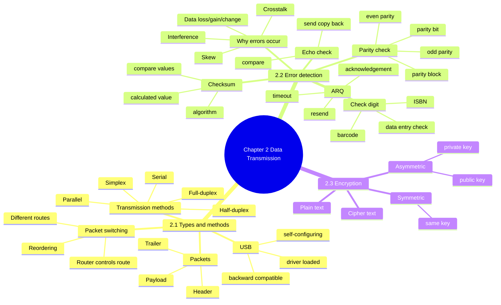
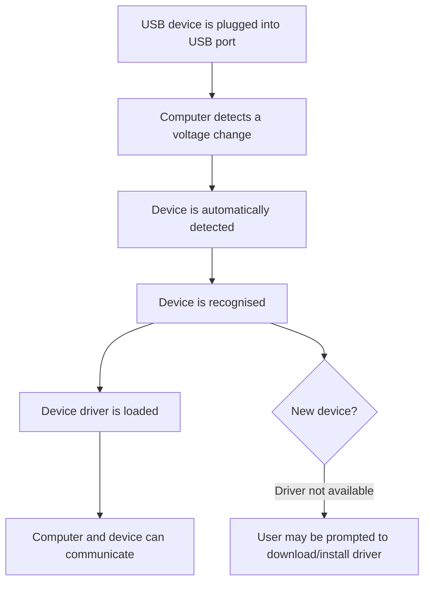
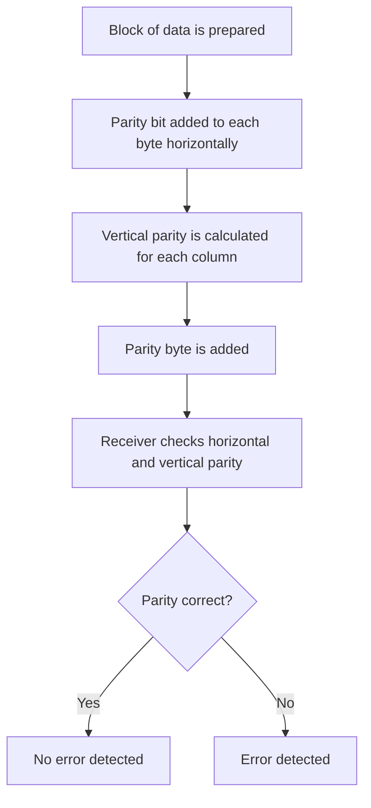
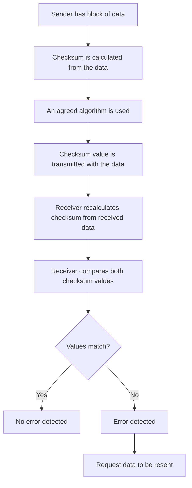
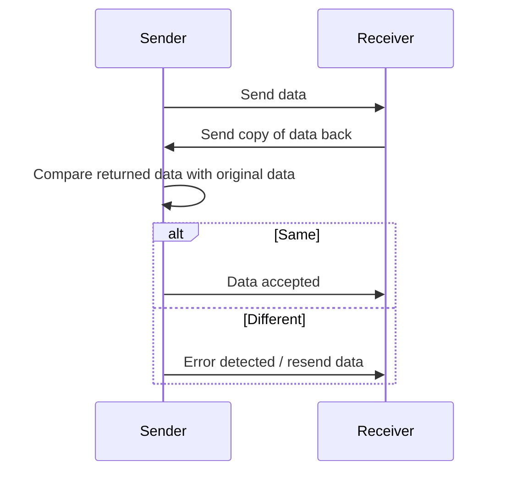
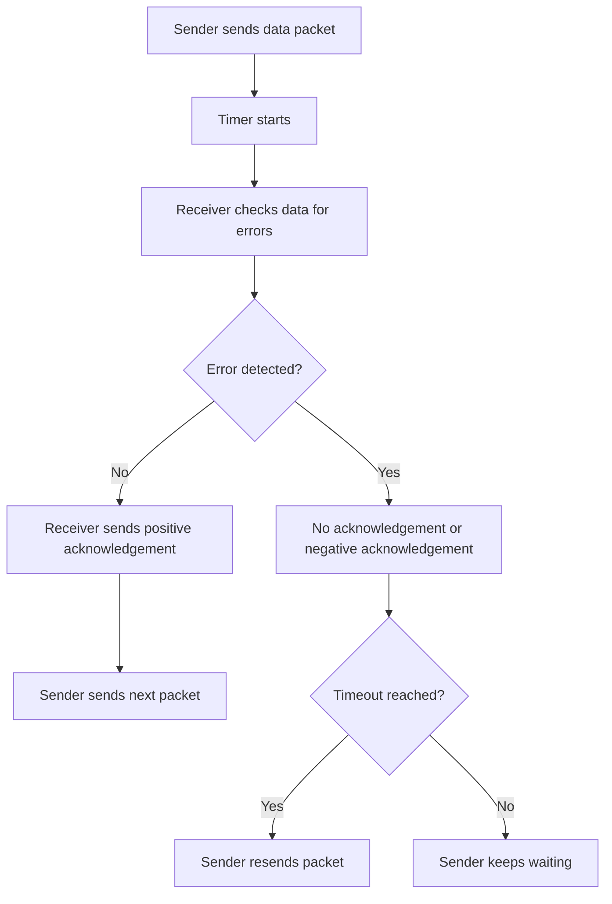
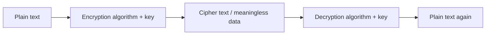
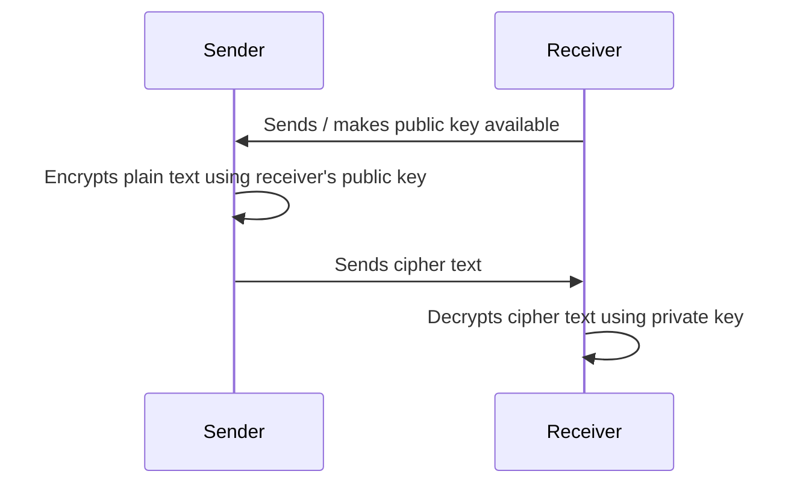

# IGCSE 0478 Computer Science — Chapter 2 Data Transmission
## 2025 Updated Student Revision Notes + Teacher Notes
> **Version:** Updated with 2025 Paper 1 trend  
**Use:** Student revision handout / teacher quick teaching guide  
**Style:** 中文解释 + English mark scheme keywords  
**Core aim:** 不是背大段定义，而是学会写出 **mark scheme 得分点**
>

---

## 0. Chapter 2 一页总览

---

## 1. 2025 出题趋势总结
| Priority | Topic | 2025 考法 | 学生必须会写的关键词 |
| --- | --- | --- | --- |
| ⭐⭐⭐⭐⭐ | Packet structure & packet switching | 描述 packet 分成什么；packet switching 流程 | **header / payload / trailer / router / different route / arrive out of order / reordered** |
| ⭐⭐⭐⭐⭐ | Serial / parallel + simplex / duplex suitability | 给场景选择并解释为什么适合 | **one bit at a time / single wire / multiple bits / skew / crosstalk / both directions** |
| ⭐⭐⭐⭐⭐ | Checksum | 5 marks 流程题 | **calculated using data / algorithm / transmitted with data / recalculated / compared / resend** |
| ⭐⭐⭐⭐⭐ | Parity check | 填空、流程、odd/even parity | **parity bit / each byte / count 1s / odd or even / error detected** |
| ⭐⭐⭐⭐ | Echo check + ARQ | 填空、定义、过程题 | **copy sent back / acknowledgement / timeout / resend** |
| ⭐⭐⭐⭐ | Error causes | 解释为什么数据可能出错 | **interference / crosstalk / data loss / data gain / data change / skew** |
| ⭐⭐⭐⭐ | Encryption | 2025 明显出现 asymmetric encryption | **plain text / cipher text / key / public key / private key / meaningless** |
| ⭐⭐⭐ | USB | 常考基础描述，但近年不是最高频长答 | **automatically detected / driver loaded / self-configuring / backward compatible** |
| ⭐⭐ | CRC / detailed USB cable length | 只保留为补充 | 不建议花太多课时 |

---

## 2. 内容取舍说明
### 重点保留并强化
+ Packet structure and packet switching  
+ Transmission method suitability：serial / parallel / simplex / half-duplex / full-duplex  
+ Error detection：parity, checksum, echo check, check digit, ARQ  
+ 2.3 Encryption：旧版 CH2 文件中不完整，但 syllabus 和 2025 Paper 1 都需要补回

### 降权处理
| Old content | 处理方式 | 原因 |
| --- | --- | --- |
| CRC 详细算法 | 降为 trailer/error checking example | 考试更常直接问 checksum / parity / ARQ |
| USB 优缺点长表 | 压缩成 mark scheme 关键词 | 学生只需能答 plug-in process + advantages/drawbacks |
| 过长 packet switching route selection 细节 | 保留“router controls route / different route / arrive out of order” | Cambridge 得分点更简洁 |
| 复杂 “hop number” 解释 | 放入 extension | 不是 2025 高频核心 |

---

# 2.1 Types and Methods of Data Transmission
---

## 2.1.1 Packet Structure
### 什么是 packet？
当数据通过网络传输时，整段数据通常不会一次性发送，而是被分成很多小的数据包，叫 **packets**。

A packet contains three main parts:

| Part | 中文理解 | Mark scheme keywords |
| --- | --- | --- |
| **Header** | 包头，告诉网络这个包从哪里来、到哪里去、顺序是多少 | **destination address, originator address, packet number** |
| **Payload** | 真正要传输的数据 | **actual data being carried** |
| **Trailer** | 包尾，表示 packet 结束，也可能包含错误检测信息 | **end of packet, error checking method** |

### Exam answer template
> A packet contains a **header**, **payload** and **trailer**.  
The header stores the **destination address**, **originator address** and **packet number**.  
The payload contains the **actual data**.  
The trailer identifies the **end of the packet** and may contain an **error checking method**.
>

---

## 2.1.2 Packet Switching
### 核心流程
<!-- 这是一个文本绘图，源码为：flowchart LR
    A[Original data/message] --> B[Data is split into packets]
    B --> C[Each packet has header, payload and trailer]
    C --> D{Routers choose routes}
    D --> E[Packet 1 takes route A]
    D --> F[Packet 2 takes route B]
    D --> G[Packet 3 takes route C]
    E --> H[Packets arrive at destination]
    F --> H
    G --> H
    H --> I[Packets may arrive out of order]
    I --> J[Packets are reordered using packet number]
    J --> K[Original message is reassembled] -->

### 必背流程
1. Data is split into packets.  
2. Each packet has a header, payload and trailer.  
3. Routers control/direct the route each packet takes.  
4. Each packet can take a different route.  
5. Packets may arrive out of order.  
6. Once all packets arrive, they are reordered/reassembled using packet numbers.  
7. If a packet is lost/corrupted, it can be requested again.

### Benefits of packet switching
| Benefit | Exam wording |
| --- | --- |
| 网络线路不被一个 message 独占 | No need to tie up a single communication line |
| 可以绕开故障线路 | Packets can be re-routed around failed/busy/faulty lines |
| 网络利用率更高 | More efficient use of network resources |
| 容易扩展 | Easier to expand network usage |

### Drawbacks of packet switching
| Drawback | Exam wording |
| --- | --- |
| packet 可能丢失 | Packets can be lost and need to be re-sent |
| packet 可能乱序到达 | Packets may arrive out of order |
| 目的地需要时间重组 | Delay while packets are reordered |
| real-time streaming 可能受影响 | Less suitable for real-time streaming |

---

## 2.1.3 Data Transmission Directions
| Type | 中文理解 | English definition | Example |
| --- | --- | --- | --- |
| **Simplex** | 单向传输 | Data is transmitted in one direction only | keyboard to computer, sensor to microprocessor |
| **Half-duplex** | 双向，但不能同时 | Data can be transmitted in both directions, but not at the same time | walkie-talkie |
| **Full-duplex** | 双向，同时 | Data can be transmitted in both directions at the same time | phone call, video call |

### 易考表达
+ **Simplex:** data only needs to be sent in one direction.  
+ **Half-duplex:** data needs to go both ways, but not simultaneously.  
+ **Full-duplex:** data needs to go both ways at the same time, for example to send data and receive error notifications.

---

## 2.1.4 Serial vs Parallel Transmission
| Feature | Serial transmission | Parallel transmission |
| --- | --- | --- |
| How data is sent | **one bit at a time** | **multiple bits at the same time** |
| Channel/wire | **single wire/channel** | **multiple wires/channels** |
| Distance | better for **long distance** | better for **short distance** |
| Speed | usually slower | usually faster |
| Reliability | less skew / less crosstalk | more likely to suffer skew/crosstalk over longer distance |
| Cost | cheaper | more expensive |

### Serial transmission — mark scheme points
+ Data is sent **one bit at a time**.  
+ Data is sent down a **single wire/channel**.  
+ Bits arrive **in sequence / in order**.  
+ There is **less chance of skew**.  
+ There is **less crosstalk/interference**.  
+ It is more reliable over **long distances**.

### Parallel transmission — mark scheme points
+ Multiple bits are sent **at the same time**.  
+ Multiple wires/channels are used.  
+ It can transmit data **faster**.  
+ Suitable for **short distances** because skew is less likely.  
+ Over longer distances, bits may arrive out of synchronisation.

---

## 2.1.5 How to answer “suitability” questions
### Question type
> Explain why serial full-duplex transmission is suitable in this scenario.
>

### Answer structure
**Step 1: Identify method**  
Serial transmission sends data **one bit at a time down a single wire**.

**Step 2: Link to scenario**  
This is suitable because the data may travel over a **long distance**, so it is less likely to suffer **skew/crosstalk**.

**Step 3: Identify direction**  
Full-duplex is suitable because data needs to travel **in both directions at the same time**.

**Step 4: Link to scenario**  
This allows the device to send data and receive **error notifications/acknowledgements** at the same time.

### High-scoring template
> Serial transmission is suitable because data is sent **one bit at a time down a single wire**, so bits are less likely to arrive **skewed** and there is less **crosstalk/interference**. It is also reliable over a **long distance**.  
Full-duplex is suitable because data can be sent **in both directions at the same time**, allowing the device to send data while also receiving **error messages/acknowledgements**.
>

---

## 2.1.6 USB Interface
### What happens when a USB device is plugged in?

### Benefits of USB
| Benefit | Exam wording |
| --- | --- |
| 自动配置 | self-configuring / automatically detected |
| 自动加载驱动 | device driver can be automatically loaded |
| 向后兼容 | backward compatible |
| 支持多种速度 | supports several transmission rates |
| 可供电 | cable can supply power |
| 可扩展 | USB hubs can add more ports |

### Drawbacks of USB
| Drawback | Exam wording |
| --- | --- |
| 线长有限 | standard USB has limited cable length |
| 速度可能不如其他连接 | transfer rate may be slower than some network connections |
| 端口数量有限 | limited number of ports unless a hub is used |

---

# 2.2 Methods of Error Detection
---

## 2.2.1 Why errors can occur
Data transmission errors may happen because of:

| Cause | Meaning |
| --- | --- |
| **Interference** | external signals affect data |
| **Crosstalk** | signals from nearby wires interfere |
| **Skew** | parallel bits arrive out of synchronisation |
| **Data loss** | bits/packets are missing |
| **Data gain** | extra bits/data are added |
| **Data change** | bits change from 0 to 1 or 1 to 0 |
| **Packets arrive in wrong order** | packet switching issue |
| **Packets time out / reach hop count** | packet does not reach destination in time |

### Exam template
> Errors can occur because of **interference** or **crosstalk**.  
This can cause data to be **lost**, **gained** or **changed**.  
In parallel transmission, bits may become **skewed**, meaning they arrive out of synchronisation.
>

---

## 2.2.2 Parity Check
### Basic idea
Parity check uses an extra bit called a **parity bit**.  
The parity bit is added to each byte before transmission.

There are two types:

| Type | Rule |
| --- | --- |
| **Even parity** | total number of 1s must be even |
| **Odd parity** | total number of 1s must be odd |

### Even parity example
| Data byte | Number of 1s | Parity bit needed | Final byte |
| --- | ---: | ---: | --- |
| 10110010 | 4 | 0 | 010110010 |
| 10110011 | 5 | 1 | 110110011 |

### Odd parity example
| Data byte | Number of 1s | Parity bit needed | Final byte |
| --- | ---: | ---: | --- |
| 10110010 | 4 | 1 | 110110010 |
| 10110011 | 5 | 0 | 010110011 |

### Parity process template
> A **parity bit** is added to each byte before transmission.  
It is added to make the number of 1s **odd/even**, depending on the parity rule.  
After transmission, the receiving device counts the number of 1s in each byte.  
If the number of 1s does not match the chosen parity rule, an **error is detected**.
>

### Limitation of parity check
Parity check may fail if:

+ an **even number of bits** change
+ two bits are interchanged, e.g. `1 → 0` and `0 → 1`
+ the total number of 1s still matches the parity rule

### Exam sentence
> A parity check may not detect an error if an **even number of bits** are changed, because the total number of 1s may still match the parity rule.
>

---

## 2.2.3 Parity Block / Parity Byte
### What is parity block?
A block of data is checked both:

+ horizontally across each byte
+ vertically down each bit position

A **parity byte** is added at the end for the vertical check.

### Why it matters
Parity block check can sometimes identify an error that a single parity byte check misses, because it checks both rows and columns.

---

## 2.2.4 Checksum
### What is checksum?
A checksum is a calculated value that is sent with the data.  
The receiver recalculates the value and compares it with the received checksum.

### Full mark process

### 5-mark answer template
> The checksum is **calculated from the data** using an **algorithm**.  
The checksum value is **transmitted with the data**.  
After transmission, the receiver **recalculates** the checksum from the received data using the same algorithm.  
The two checksum values are **compared**.  
If the values do not match, an **error is detected** and the data is **resent**.
>

---

## 2.2.5 Echo Check
### Basic idea
Echo check sends data to the receiver, then the receiver sends a copy back to the sender.

### Exam template
> A copy of the data is sent back to the sender by the receiver.  
The sender compares the returned data with the original data.  
If the data is different, an error has occurred.
>

---

## 2.2.6 Check Digit
### Important distinction
**Check digit is for data entry errors, not data transmission errors.**

A check digit is an extra digit added to the end of a number/code.

Used in:

+ barcodes
+ ISBN
+ identification numbers

### Errors detected by check digit
| Error type | Example |
| --- | --- |
| incorrect digit | 5327 instead of 5307 |
| transposition error | 5037 instead of 5307 |
| omitted digit | 537 instead of 5307 |
| extra digit | 53107 instead of 5307 |
| phonetic error | 13 instead of 30 |

### Process template
> A calculation is performed using the digits in the identification number.  
The result is added as the **check digit**.  
When the number is entered, the same calculation is repeated.  
The calculated check digit is compared with the entered check digit.  
If they match, the number is accepted; if not, an error is detected.
>

---

## 2.2.7 Automatic Repeat Query / Request (ARQ)
### What ARQ uses
ARQ uses:

+ **acknowledgement**
+ **timeout**
+ **resend / retransmission**

### Positive ARQ process

### Full mark ARQ template
> The sender sends the data and starts a **timer**.  
The receiver checks the data for errors.  
If no error is detected, the receiver sends a **positive acknowledgement**.  
The sender then sends the next packet.  
If an error is detected, a **negative acknowledgement** may be sent, or no acknowledgement is sent.  
If no acknowledgement is received before **timeout**, the sender automatically **resends** the data.
>

---

# 2.3 Encryption
> 旧版 CH2 文件没有完整覆盖 2.3，但 2025 Paper 1 已经明显考到 encryption，必须补回。
>

---

## 2.3.1 Why encryption is needed
Encryption is used to protect data during transmission.

### Key points
+ Data may be intercepted during transmission.
+ Encryption makes data **meaningless** to anyone without the decryption key.
+ It keeps sensitive/confidential data secure.

### Exam template
> Encryption is used to make data **meaningless** if it is intercepted.  
It helps keep transmitted data **secure/confidential** because only someone with the correct key can decrypt it.
>

---

## 2.3.2 Key terms
| Term | Meaning |
| --- | --- |
| **Plain text** | original readable data before encryption |
| **Cipher text** | encrypted data after encryption |
| **Encryption algorithm** | method used to scramble data |
| **Encryption key** | value used by the algorithm to encrypt/decrypt |
| **Decryption** | converting cipher text back into plain text |

---

## 2.3.3 Symmetric Encryption
### Meaning
Symmetric encryption uses the **same key** to encrypt and decrypt data.

### Advantages
+ Faster than asymmetric encryption.
+ Simpler process.

### Drawback
+ The key must be shared between sender and receiver.
+ If the key is intercepted, the data can be decrypted.

### Exam template
> Symmetric encryption uses the **same key** to encrypt and decrypt the data.  
The main issue is that the key must be shared, so if the key is intercepted, the data may be decrypted.
>

---

## 2.3.4 Asymmetric Encryption
### Meaning
Asymmetric encryption uses two keys:

| Key | Use |
| --- | --- |
| **Public key** | can be shared; used to encrypt data |
| **Private key** | kept secret; used to decrypt data |

### Process

### Exam template
> The data is encrypted using the receiver’s **public key**.  
The public key cannot decrypt the data.  
The data can only be decrypted using the receiver’s **private key**.  
This makes the data secure because only the receiver has the private key.
>

---

# 3. High-score Answer Templates
---

## Template 1 — Packet structure
> A packet contains a **header**, **payload** and **trailer**.  
The header contains the **destination address**, **originator address** and **packet number**.  
The payload contains the **actual data**.  
The trailer identifies the **end of the packet** and contains an **error checking method**.
>

---

## Template 2 — Packet switching
> The data is split into **packets**.  
Each packet can take a **different route** through the network.  
A **router** controls/directs the route each packet takes.  
Packets may arrive **out of order**.  
When the last packet arrives, the packets are **reordered** and the message is reassembled.
>

---

## Template 3 — Serial vs parallel
> Serial transmission sends data **one bit at a time** down a **single wire/channel**.  
It is more suitable over long distances because there is less **skew**, **crosstalk** and **interference**.  
Parallel transmission sends **multiple bits at the same time** using **multiple wires/channels**.  
It is faster over short distances, but more likely to suffer from skew over long distances.
>

---

## Template 4 — Checksum
> The checksum is calculated from the data using an algorithm.  
The checksum is transmitted with the data.  
The receiver recalculates the checksum using the received data.  
The two values are compared.  
If they do not match, an error is detected and the data is requested again.
>

---

## Template 5 — ARQ
> The sender sends data and starts a timer.  
The receiver checks the data for errors.  
If no error is found, a positive acknowledgement is sent.  
If an error is found, a negative acknowledgement may be sent or no acknowledgement is sent.  
If no acknowledgement is received before timeout, the sender resends the data.
>

---

## Template 6 — Asymmetric encryption
> Plain text is encrypted into cipher text using an algorithm and a key.  
The receiver’s public key is used to encrypt the data.  
The public key cannot decrypt the data.  
Only the receiver’s private key can decrypt the cipher text back into plain text.
>

---

# 4. Common Mistakes 易错点
| Mistake | Why it loses marks | Better answer |
| --- | --- | --- |
| “Packet has address.” | 太泛，没有结构 | packet has **header, payload and trailer** |
| “Header has address.” | 不完整 | **destination address, originator address, packet number** |
| “Packet switching means packet goes through internet.” | 没有流程 | data is split into packets; each can take different route; router controls route; reordered |
| “Serial is slower.” | 只有缺点，不解释适合性 | serial is reliable over long distance because bits arrive in order and less skew/crosstalk |
| “Parallel is better because faster.” | 没有限制条件 | parallel is faster over short distance because multiple bits are sent at the same time |
| “Full-duplex means two computers.” | 错误理解 | data can be sent **both directions at the same time** |
| “Parity checks if data is correct.” | 太泛 | parity bit is added; number of 1s is counted; odd/even rule checked |
| “Checksum is a number.” | 不够 | checksum is calculated from data using algorithm, sent with data, recalculated and compared |
| “Echo check sends data twice.” | 不准确 | receiver sends a copy back; sender compares returned data with original |
| “Check digit checks transmission errors.” | 错 | check digit detects **data entry errors**, e.g. barcode/ISBN |
| “ARQ checks errors.” | 不够 | ARQ uses **acknowledgement + timeout + resend** |
| “Encryption hides data.” | 太泛 | encryption turns plain text into cipher text, making it meaningless without key |
| “Public key decrypts data.” | 对 asymmetric 理解错误 | public key encrypts; private key decrypts |

---

# 5. Scenario Answer Bank 场景迁移表
| Scenario | Best points to use |
| --- | --- |
| Data sent over long distance | serial, less skew, less crosstalk, reliable |
| Data sent inside a device / very short cable | parallel, faster, multiple bits at same time |
| Printer needs to send error messages back | full-duplex or half-duplex, two-way communication |
| Sensor only sends readings to microprocessor | simplex, one-way only |
| Live streaming | packet switching can cause delay/reordering issues |
| Barcode / ISBN | check digit, data entry error |
| File transmitted over network | checksum / parity / ARQ |
| Sensitive data transmitted online | encryption, cipher text, key, meaningless if intercepted |
| Public/private key question | asymmetric encryption |

---

# 6. 10 Marks Quick Check
## Questions
1. State the three parts of a packet. `[3]`  
2. Give two items stored in a packet header. `[2]`  
3. State one reason why packets may arrive out of order. `[1]`  
4. State one difference between serial and parallel transmission. `[1]`  
5. What two things are used in ARQ? `[2]`  
6. State what is meant by cipher text. `[1]`

## Answers
1. Header, payload, trailer.  
2. Destination address, originator address, packet number.  
3. Each packet can take a different route.  
4. Serial sends one bit at a time; parallel sends multiple bits at the same time.  
5. Acknowledgement and timeout.  
6. Encrypted data / data made meaningless by encryption.

---

# 7. 20 Marks Exam-style Practice
---

## Question 1 — Packet switching `[5]`
A student sends a large video file to a friend over the internet.

Describe how packet switching is used to send the file.

### Mark scheme
Any five:

+ Data is split into packets.
+ Each packet has a header / payload / trailer.
+ The payload contains the actual data.
+ The header contains destination address / originator address / packet number.
+ A router directs each packet.
+ Each packet may take a different route.
+ Packets may arrive out of order.
+ Packets are reordered/reassembled at the destination.
+ Lost/corrupted packets can be requested again.

---

## Question 2 — Transmission method `[4]`
A sensor sends temperature readings to a microprocessor in an automated greenhouse. The microprocessor does not need to send data back to the sensor.

Explain why serial simplex transmission is suitable.

### Mark scheme
Any four:

+ Serial sends data one bit at a time.
+ Serial uses a single wire/channel.
+ Serial is sufficient because small amounts of data are being sent.
+ Serial has less chance of skew/crosstalk.
+ Simplex is suitable because data only needs to be sent in one direction.
+ The sensor only sends readings to the microprocessor.

---

## Question 3 — Checksum `[5]`
Describe how checksum is used to detect errors after data transmission.

### Mark scheme
+ Checksum is calculated from the data.
+ An algorithm is used.
+ Checksum value is transmitted with the data.
+ Receiver recalculates checksum from received data.
+ Two checksum values are compared.
+ If values do not match, error is detected.
+ Data is requested again / resent.

Max 5.

---

## Question 4 — Parity check `[4]`
A data transmission uses even parity.

Describe how parity check works.

### Mark scheme
+ A parity bit is added to each byte.
+ It makes the number of 1s even.
+ The receiver counts/checks the number of 1s in each byte.
+ If the number of 1s is odd, an error is detected.

---

## Question 5 — Encryption `[2]`
Explain why asymmetric encryption is secure.

### Mark scheme
Any two:

+ It uses a public key and a private key.
+ Data encrypted with the public key cannot be decrypted with the public key.
+ Only the receiver’s private key can decrypt the data.
+ The private key is not shared.

---

# 8. Teacher Notes
## Teaching priority
| Lesson focus | Suggested time | Reason |
| --- | ---: | --- |
| Packet structure + packet switching | 1 lesson | 2025 high frequency, good for flowchart-style answers |
| Serial / parallel / simplex / duplex suitability | 1 lesson | Students often know definitions but cannot link to scenario |
| Parity + checksum + echo check + ARQ | 2 lessons | Highest mark potential and highest mistake rate |
| Check digit | 0.5 lesson | Easy marks if distinction from checksum is clear |
| Encryption | 1 lesson | Must add because original CH2 notes were incomplete and 2025 tested it |
| USB | 0.5 lesson | Keep concise; not worth over-teaching |

## Suggested teaching sequence
1. Start with a real example: sending an image/video file.  
2. Draw packet = header + payload + trailer.  
3. Use string cards to show packets arriving out of order.  
4. Compare serial vs parallel using “one bridge vs many bridges”.  
5. Teach parity using quick counting of 1s.  
6. Teach checksum as “calculated value → sent → recalculated → compared”.  
7. Teach ARQ as “send → wait → acknowledge → timeout → resend”.  
8. Finish with encryption: plain text → cipher text → public/private key.

## Most important student correction
Students must stop writing vague answers such as:

+ “It checks if data is correct.”
+ “It makes data safe.”
+ “It sends data through the internet.”

They need to write **mechanism + keyword + scenario link**.

---

# 9. One-page Exam Sheet
## Packet
+ **Header:** destination address, originator address, packet number  
+ **Payload:** actual data  
+ **Trailer:** end of packet, error checking method

## Packet switching
+ Data split into packets  
+ Each packet may take different route  
+ Router controls route  
+ Packets may arrive out of order  
+ Reordered/reassembled at destination

## Transmission
+ **Serial:** one bit at a time, single wire, long distance, less skew  
+ **Parallel:** multiple bits at once, multiple wires, faster, short distance  
+ **Simplex:** one direction only  
+ **Half-duplex:** both directions, not at same time  
+ **Full-duplex:** both directions, same time

## Error causes
+ interference  
+ crosstalk  
+ skew  
+ data loss / data gain / data change  
+ packets arrive in wrong order

## Error detection
+ **Parity:** parity bit added, count 1s, odd/even rule  
+ **Checksum:** calculate → send → recalculate → compare → resend  
+ **Echo check:** receiver sends copy back, sender compares  
+ **Check digit:** data entry error, barcode/ISBN  
+ **ARQ:** acknowledgement + timeout + resend

## Encryption
+ **Plain text:** original readable data  
+ **Cipher text:** encrypted meaningless data  
+ **Symmetric:** same key encrypts/decrypts  
+ **Asymmetric:** public key encrypts, private key decrypts

---

