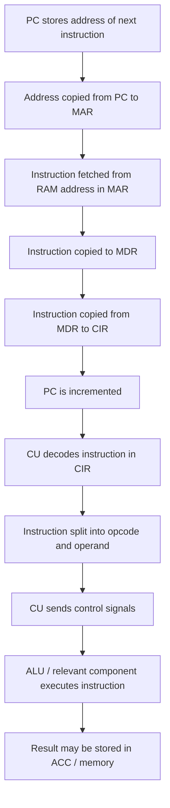
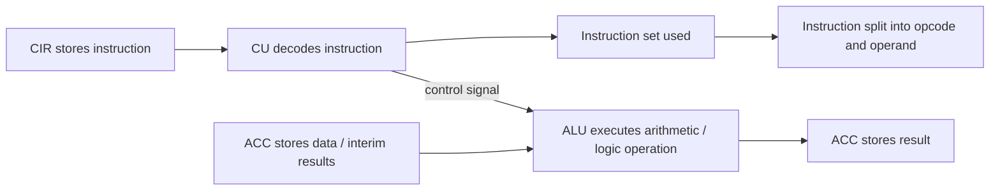
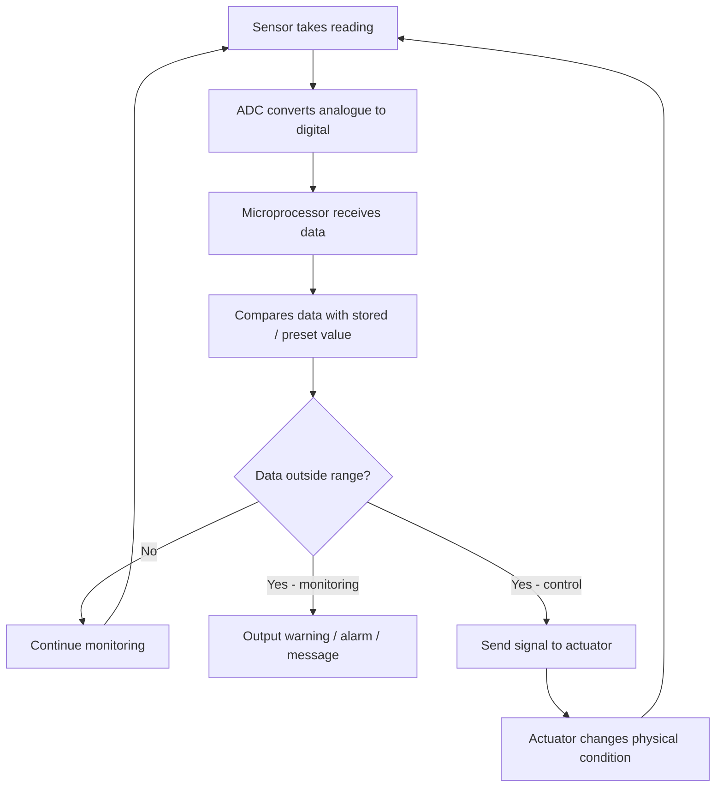
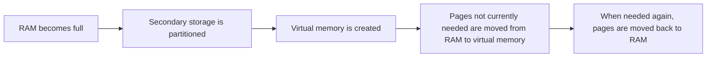

# IGCSE 0478 Chapter 3 Updated Checklist
## Hardware｜2025 Past Paper Focus Edition
> **适用范围**：Cambridge IGCSE Computer Science 0478  
**章节范围**：3.1 Computer Architecture｜3.2 Input and Output Devices｜3.3 Data Storage｜3.4 Network Hardware  
**更新依据**：2026–2028 syllabus + 全部 2025 Paper 1 / Mark Scheme 趋势 + 原 2023–2024 WHBC checklist  
**目标**：删掉低频/过细内容，把学生最容易拿分的 `State / Identify / Describe / Explain / Compare / Suggest` 得分句整理出来。  
**建议使用方式**：先背 **Core Exam Sentences**，再用 **Common Mistakes** 检查答案是否太泛。
>

---

## 0. 2025 更新结论：这一章现在怎么考？
| 考点 | 2025 出题趋势 | 学生最容易丢分的地方 | 更新处理 |
| --- | --- | --- | --- |
| **CPU components** | 高频：CU / ALU / cache / PC / MDR / clock / ACC 的功能匹配 | 只写缩写，不写 function；MDR/MAR 混淆 | 加入 “component + one-line function” 表格 |
| **Fetch–Decode–Execute cycle** | 高频：填空题、流程题、图示题；常考 PC → MAR → RAM → MDR → CIR → CU | 只写 fetch/decode/execute 三个词，没有寄存器流向 | 加入 6-mark FDE 模板和 Mermaid 流程图 |
| **CIR / CU / ALU / ACC diagram** | 2025 直接考图示：CIR built into CU, ACC built into ALU, CU decodes and sends signal to ALU | 忘记 instruction set / opcode and operand / ACC stores data | 单独强化 decode + execute 关系 |
| **Core / cache / clock** | 高频 comparison：如何提高 CPU performance | 只写 “more cores faster”，没有 expansion | 加入 “factor + effect + because” 模板 |
| **Instruction set** | 常以 1 mark definition 出现 | 写成 “set of instructions” 太泛，没提 machine code / processed by CPU | 保留精准句 |
| **Embedded systems** | 2025 反复考：dedicated function, dedicated hardware, microprocessor, hard to reprogram | 把 embedded system 写成 normal computer | 做成 4-point scoring template |
| **Input/output devices** | 常考 identify / choose suitable device | 写 brand name；把 touch screen 只写 input 或 output | 精简到 exam-useful device list |
| **Sensors + microprocessor** | 2025 高频 scenario：proximity / infrared / light / pressure / moisture / level | 忘记 ADC / stored value / continuous monitoring / actuator | 加入 monitoring & control answer templates |
| **Monitoring vs control** | 常考 scenario explain | 把 monitoring 写成 control；忘记 control system changes physical condition | 加入对比表 |
| **RAM / ROM / primary / secondary** | 高频：RAM purpose, ROM/cache example, RAM vs secondary storage | 只写 “stores data” 太泛 | 加入 exam sentences |
| **Virtual memory** | 2025 高频：partition secondary storage, transfer pages, when RAM full | 忘记 pages / secondary storage partition | 单独强化 3-mark template |
| **SSD / HDD / optical storage** | 高频：SSD operation, optical pits/lands, HDD vs SSD choice | 只写 “SSD faster”，没有 no moving parts / transistors / NAND/NOR | 加入 storage media decision table |
| **Cloud storage** | 常与 smart devices / limited storage结合 | 只写 “online storage”，没写 remote servers / third party / internet access | 保留精简版 |
| **NIC / MAC / IP / router** | 高频：NIC role, MAC structure, IPv6 features, router purpose | MAC/IP 混淆；router/switch 混淆 | 加入 network hardware one-page section |


---

## 1. 内容取舍：哪些内容要删？哪些保留？
### ✅ 必须保留并重点训练
| 内容 | 原因 |
| --- | --- |
| CPU role, microprocessor definition | syllabus 明确要求，常以 1 mark 出现 |
| CU / ALU / registers / buses | 2025 多次考 matching / diagram / FDE |
| FDE cycle with PC, MAR, MDR, CIR, CU | 2025 高频流程题 |
| Core / cache / clock impact | 2025 高频 explain performance |
| Instruction set, opcode, operand | 常以 short definition / diagram label 出现 |
| Embedded systems characteristics | 2025 反复出现 |
| Input/output devices identification | Paper 1 基础送分点 |
| Sensor + ADC + microprocessor + actuator template | 3.2 最常见 explain 题型 |
| Monitoring vs control | 学生容易混淆，场景题高频 |
| RAM / ROM / secondary storage | 每年稳定高频 |
| Magnetic / optical / solid-state working | 2025 考到 optical 和 SSD operation |
| Virtual memory | 2025 明确高频 |
| Cloud storage | 常结合智能设备 / storage limitation |
| NIC / MAC / IP / router | 2025 网络硬件高频 |


### ⚠️ 降权或删除
| 原内容 | 处理方式 | 原因 |
| --- | --- | --- |
| 过长 device examples | **压缩** | 考试更常考选择与作用，不考百科式清单 |
| CD / DVD / Blu-ray 过细参数 | **降权** | 容量和 laser wavelength 低频，保留 pits/lands 和 optical principle |
| Microcontroller / SoC 深入区别 | **降权** | syllabus 核心是 embedded system purpose/characteristics |
| Overclocking 长解释 | **删除主表** | 非核心，容易干扰 core/cache/clock 主考点 |
| Printer 复杂工作原理 | **压缩** | 主要考 inkjet vs laser benefits/drawbacks |
| DVD-RAM 等旧式细节 | **删除主背诵区** | 低频，保留 optical storage working principle 即可 |
| 过长 cloud types | **压缩** | public/private/hybrid 可了解，但不必大篇幅背诵 |


---

# 3.1 Computer Architecture
## 3.1.1 CPU and Microprocessor
**<font style="background-color:#f8fbff;">CPU</font>**<font style="background-color:#f8fbff;">  
</font><font style="background-color:#f8fbff;">Processes instructions and data that are input into the computer so that results can be output. </font>

**<font style="background-color:#fffaf2;">Microprocessor</font>**<font style="background-color:#fffaf2;">  
</font><font style="background-color:#fffaf2;">A type of integrated circuit on a single chip. </font>

### Core Exam Sentences
+ The CPU **processes instructions and data**.
+ The CPU performs the **fetch–decode–execute cycle**.
+ A microprocessor is **an integrated circuit on a single chip**.
+ A CPU contains the **control unit**, **arithmetic and logic unit**, **registers** and uses **buses**.

---

## 3.1.2 CPU Components｜CU, ALU, Registers and Buses
### CPU Units
| Component | Full name | Exam function |
| --- | --- | --- |
| **CU** | Control Unit | sends control signals and manages the flow of data through the CPU |
| **ALU** | Arithmetic and Logic Unit | performs arithmetic calculations and logic operations |
| **Clock** | System clock | controls the timing / number of FDE cycles performed per second |


### CPU Registers
| Register | Full name | Mark scheme style function |
| --- | --- | --- |
| **PC** | Program Counter | stores the address of the next instruction to be fetched |
| **MAR** | Memory Address Register | stores the address of the memory location currently being read from or written to |
| **MDR** | Memory Data Register | stores data immediately before it is written to RAM or immediately after it is read from RAM |
| **CIR** | Current Instruction Register | stores the current instruction being decoded / executed |
| **ACC** | Accumulator | stores interim results / data used by the ALU |


### Buses
| Bus | Function | Direction |
| --- | --- | --- |
| **Address bus** | carries memory addresses from CPU to memory / I/O devices | usually one-way |
| **Data bus** | carries data between CPU, memory and I/O devices | two-way |
| **Control bus** | carries control signals such as read/write signals | two-way |


> **Common trap**：MAR stores an **address**. MDR stores **data/instruction**. PC stores the **address of the next instruction**.
>

---

## 3.1.3 Fetch–Decode–Execute Cycle｜6-mark Core Template


### Fetch Stage
1. The **PC** stores the address of the next instruction.
2. The address is copied from **PC to MAR**.
3. The instruction is fetched from **RAM** at the address stored in MAR.
4. The instruction is copied into the **MDR**.
5. The instruction is copied from **MDR to CIR**.
6. The **PC is incremented** to point to the next instruction.

### Decode Stage
+ The **CU decodes** the instruction stored in the **CIR**.
+ The instruction is decoded using an **instruction set**.
+ The instruction may be separated into **opcode** and **operand**.

### Execute Stage
+ The CU sends control signals to the relevant CPU component.
+ The **ALU** performs arithmetic / logic operations if required.
+ The **ACC** stores data or interim results.
+ The result may be written back to memory.

### Core Exam Sentences
+ The instruction is retrieved from RAM and stored in the MDR.
+ The instruction is then sent to the CIR.
+ The CU decodes the instruction using the instruction set.
+ The instruction is separated into opcode and operand.
+ The ALU executes arithmetic or logical operations.
+ The ACC stores the result of interim calculations.

---

## 3.1.4 Decode + Execute Diagram Focus｜CIR / CU / ALU / ACC


### What the diagram should show
+ **CIR is built into / associated with the CU**.
+ **CIR stores the instruction**.
+ **CU decodes the instruction**.
+ Instruction is decoded using an **instruction set**.
+ Instruction may be separated into **opcode and operand**.
+ CU sends a signal to the **ALU** to execute.
+ **ACC is built into / associated with the ALU**.
+ ACC stores any data / interim result needed by the instruction.
+ ALU executes the instruction / performs mathematical or logical operation.

---

## 3.1.5 Core, Cache and Clock｜CPU Performance
| Factor | Definition | How it affects performance |
| --- | --- | --- |
| **Core** | independent processing unit in the CPU that can perform FDE cycle | more cores can process more instructions simultaneously |
| **Cache** | very fast memory storing frequently used data/instructions | larger cache means more frequently used data can be accessed faster than RAM |
| **Clock speed** | number of FDE cycles / clock pulses per second | higher clock speed means more instructions can be processed per second |


### Core Exam Template
> **Explain how the performance of a CPU can be improved.**
>

Use paired points:

+ Increase the **number of cores** → more instructions can be processed **simultaneously**.
+ Increase the **clock speed** → more FDE cycles / instructions can be processed **per second**.
+ Increase the **cache size** → more frequently used data/instructions can be stored and accessed faster than RAM.

> **Common trap**：不要只写 “more cores = faster”。必须补充 **more instructions can be processed simultaneously**。
>

---

## 3.1.6 Instruction Set, Opcode and Operand
| Term | Meaning |
| --- | --- |
| **Instruction set** | a list of all the machine code commands that can be processed by a CPU |
| **Opcode** | part of an instruction that tells the CPU what operation/action to perform |
| **Operand** | part of an instruction that tells the CPU what data / address to use |


### Core Exam Sentences
+ An instruction set is a **list of machine code commands** that can be processed by a CPU.
+ The **opcode** identifies the operation.
+ The **operand** identifies the data or address used by the instruction.

---

## 3.1.7 Embedded Systems
An **embedded system** is a computer system built into a larger device to perform a **dedicated / limited / single function**.

### Characteristics of Embedded Systems
| Scoring point | Mark scheme phrase |
| --- | --- |
| Function | has a single / limited / dedicated function |
| Hardware | has dedicated hardware |
| Processor | contains a microprocessor / microcontroller |
| Reprogramming | function is not easily changed / cannot be easily reprogrammed |
| Device relation | built into / part of a larger device |


### Examples
+ Washing machine
+ Vending machine
+ Security system
+ Street lighting system
+ Smart speaker
+ ATM
+ Car engine / ABS system

### Embedded System vs General Purpose Computer
| Embedded system | General purpose computer |
| --- | --- |
| performs one dedicated function | performs many different functions |
| often built into another device | usually a standalone device |
| uses dedicated hardware | hardware can be used for many tasks |
| software not easily changed | software can usually be installed / updated |
| often uses a microprocessor | has a CPU |


> **Common trap**：不要写 “embedded system is small” 作为唯一答案。考试更看重 **dedicated function / dedicated hardware / microprocessor / not easily reprogrammed**。
>

---

# 3.2 Input and Output Devices
## 3.2.1 Input and Output Devices
| Type | Meaning | Examples |
| --- | --- | --- |
| **Input device** | hardware used to enter data into a computer system | keyboard, microphone, camera, sensor, scanner, touchscreen |
| **Output device** | hardware used to output data from a computer system | screen, speaker, printer, actuator, projector, LED |


### High-frequency device notes
| Device | Typical use / exam point |
| --- | --- |
| **Keyboard** | enter text / data |
| **Microphone** | input sound / voice commands |
| **Digital camera** | input images / video |
| **Barcode scanner** | read barcode data for price / stock control |
| **QR code scanner** | read QR code to access website / data |
| **2D scanner** | convert hard-copy documents into digital images |
| **3D scanner** | captures shape / dimensions to create a digital model |
| **Touchscreen** | both input and output device |
| **Actuator** | output device that causes physical movement / action |


---

## 3.2.2 Sensors｜How to Choose the Correct Sensor
A **sensor** is an input device that measures physical properties from the environment.

| Sensor | Measures / detects | Common exam scenarios |
| --- | --- | --- |
| **Temperature** | temperature | greenhouse, central heating, fridge, engine monitoring |
| **Light** | light level / brightness | street lights, automatic headlights |
| **Infra-red / proximity** | movement / presence / distance | security alarm, automatic door, welcome screen |
| **Pressure** | pressure / force | weighing, mats in games, gas pressure |
| **Moisture** | water level in soil | plant watering, greenhouse |
| **Humidity** | water vapour in air | greenhouse, factory air control |
| **Gas** | specific gas level | pollution monitoring, greenhouse gas levels |
| **pH** | acidity / alkalinity | soil acidity, chemical process |
| **Accelerometer** | acceleration / movement | phone rotation, car airbag |
| **Flow** | flow rate of liquid/gas | pipes, medical breathing devices |
| **Level** | liquid / powder level | tank, water bowl, production process |


### Core Exam Sentence
+ A sensor **collects physical data** from the environment and sends it to the microprocessor.

---

## 3.2.3 Analogue Data, Digital Data, ADC and DAC
| Term | Meaning / use |
| --- | --- |
| **Analogue data** | continuously changing physical data, e.g. temperature or light level |
| **Digital data** | discrete binary data that a computer can process |
| **ADC** | analogue-to-digital converter; converts sensor readings into digital data for the microprocessor |
| **DAC** | digital-to-analogue converter; converts computer output into analogue signals for an actuator |


### Core Exam Sentences
+ Most sensor readings are **analogue** because physical properties vary continuously.
+ The microprocessor can only process **digital data**.
+ An **ADC** converts analogue sensor readings into digital data.
+ A **DAC** may be used when the microprocessor controls an actuator.

---

## 3.2.4 Monitoring Systems vs Control Systems
| System type | Meaning | Key difference |
| --- | --- | --- |
| **Monitoring system** | measures / records data and may output warning | does **not** change the physical condition directly |
| **Control system** | measures data and sends signals to actuators | **changes** the physical condition |




### Monitoring System Template
Use this for **hospital patient**, **pollution**, **car engine**, **burglar alarm**.

1. The sensor constantly measures the physical property.
2. The sensor sends data to the microprocessor.
3. Analogue data is converted to digital using an **ADC**.
4. The microprocessor compares the data with a **stored / preset value**.
5. If the value is outside the acceptable range, a warning / alarm / message is output.
6. If the value is within range, the system continues monitoring.
7. The process repeats continuously.

### Control System Template
Use this for **greenhouse**, **street light**, **air conditioning**, **water bowl**, **automatic door**.

1. The sensor constantly measures the physical property.
2. The sensor sends data to the microprocessor.
3. Analogue data is converted to digital using an **ADC**.
4. The microprocessor compares the data with a **stored / preset value**.
5. If the value is outside the required range, the microprocessor sends a signal to an **actuator**.
6. The actuator changes the physical condition, e.g. opens a window / turns on a motor / switches on a light.
7. The process repeats continuously.

---

## 3.2.5 Scenario Templates
### A. Proximity / Infra-red Sensor Welcome Screen
+ A proximity / infra-red sensor detects a person near the screen.
+ The sensor continually sends data to the microprocessor.
+ The microprocessor uses the sensor data to calculate distance.
+ The microprocessor compares the data with the stored value, e.g. 1 metre.
+ If the person is within range, the microprocessor sends a signal to display the welcome message.

### B. Street Lighting System
+ A light sensor measures the light level.
+ The analogue reading is converted to digital using an ADC.
+ The microprocessor compares the light level with the preset value.
+ If the light level is below the preset value, a signal is sent to switch the lamp on.
+ If the light level is above or equal to the preset value, a signal is sent to switch the lamp off.
+ The process repeats continuously.

### C. Greenhouse Temperature Control
+ A temperature sensor measures the temperature.
+ The data is converted using an ADC.
+ The microprocessor compares the data with the stored range.
+ If the temperature is above the upper limit, the microprocessor sends a signal to open the window / turn off heater.
+ If the temperature is below the lower limit, the microprocessor sends a signal to close the window / turn on heater.
+ Actuators operate the window / heater.
+ The process repeats continuously.

### D. Animal Water Bowl / Tank Level Control
+ A level / pressure / moisture sensor measures the water level.
+ Sensor data is sent to the microprocessor.
+ Data is converted to digital using an ADC.
+ The microprocessor compares the data with the stored value.
+ If the value is below the stored value, a signal is sent to an actuator / valve to release water.
+ The bowl is filled for a set time or to a set level.
+ The process repeats until turned off.

---

## 3.2.6 Output Devices｜Printers, Screens and Actuators
### Actuator
An **actuator** is an output device that receives a signal and causes a physical action.

Examples:

+ motor
+ valve
+ heater
+ buzzer
+ light
+ pump

### Inkjet vs Laser Printer
| Feature | Inkjet printer | Laser printer |
| --- | --- | --- |
| Best use | small number of high-quality colour prints / photos | high-volume document printing |
| Ink/toner | liquid ink | dry toner / powder |
| Speed | slower than laser for large jobs | faster, especially for many pages |
| Running cost | often higher per page | often lower per page |
| Initial cost | usually cheaper | usually more expensive |
| Drawback | ink can run out / smudge | toner cartridge expensive; larger footprint; warm-up time |


### Core Exam Sentences
+ A laser printer is suitable for high-volume printing because it prints quickly and one toner cartridge can print many pages.
+ An inkjet printer is suitable for one-off colour photographs because it can produce high quality colour prints.

---

# 3.3 Data Storage
## 3.3.1 Primary Storage vs Secondary Storage
| Storage type | Meaning | Examples |
| --- | --- | --- |
| **Primary storage** | directly accessible by the CPU | RAM, ROM, cache, registers |
| **Secondary storage** | not directly accessible by the CPU; usually non-volatile | HDD, SSD, optical disk, USB flash drive |


### RAM vs ROM
| RAM | ROM |
| --- | --- |
| volatile | non-volatile |
| temporary storage | permanent storage |
| stores data/instructions/software currently in use | stores BIOS / bootloader / firmware / start-up instructions |
| can be read from and written to | usually read-only |
| directly accessed by CPU | directly accessed during start-up / stores permanent instructions |


### RAM Purpose｜Core Exam Sentences
+ RAM stores data and instructions that are **currently in use**.
+ RAM stores software / programs that are **currently running**.
+ RAM is **volatile** and stores data temporarily.
+ RAM allows data to be accessed directly by the CPU.

### ROM Purpose｜Core Exam Sentences
+ ROM stores the **BIOS**.
+ ROM stores the **bootloader / bootstrap**.
+ ROM stores **start-up instructions**.
+ ROM stores **firmware**.
+ ROM is **non-volatile**.

> **Common trap**：RAM is not secondary storage. RAM is primary storage and is directly accessed by the CPU.
>

---

## 3.3.2 Magnetic, Optical and Solid-state Storage
### Magnetic Storage｜HDD
How it works:

+ The device has spinning **platters**.
+ Platters are divided into **tracks and sectors**.
+ A read/write head moves across the platter.
+ Data is read/written using **magnetic fields**.
+ Magnetic orientation represents binary values.

### Optical Storage｜CD / DVD / Blu-ray
How data is read/written:

+ The disk is spun.
+ A laser is shone onto the disk.
+ Data is represented by **pits and lands**.
+ Pits and lands reflect light differently.
+ The optical drive detects the reflected light and determines binary values.
+ When writing data, pits are burnt into a spiral track.

### Solid-state Storage｜SSD / flash memory
How it works:

+ Solid-state storage has **no moving parts**.
+ It uses **semiconductor chips**.
+ It can use **NAND / NOR / flash memory** technology.
+ It uses cells and transistors laid out in a grid.
+ It uses **control gates and floating gates**.
+ Data is stored as electrical charges / by controlling the flow of electrons.

---

## 3.3.3 HDD vs SSD｜Choosing Suitable Storage
| HDD | SSD |
| --- | --- |
| magnetic storage | flash / solid-state storage |
| has moving parts | no moving parts |
| slower access speed | faster access speed |
| produces more heat/noise | cooler and quieter |
| higher power consumption | lower power consumption |
| cheaper per unit of storage | more expensive per unit of storage |
| can have very high capacity | high capacity, but often more costly |
| can have more read/write cycles | may have limited write cycles |


### Choose SSD when...
+ device needs to be portable / light
+ low power consumption is important
+ fast access speed is needed
+ reliability is important because there are no moving parts
+ less heat/noise is desired

### Choose HDD when...
+ very large capacity is needed at lower cost
+ the device is not portable, e.g. server / desktop storage
+ many read/write cycles are expected
+ cost per unit of storage matters more than speed

> **Common trap**：Do not always say SSD is best. In a server needing huge cheap storage and many read/write cycles, HDD can still be justified.
>

---

## 3.3.4 Virtual Memory
Virtual memory is an area of **secondary storage** used as an extension of RAM when RAM is full.



### Core Exam Template
> **Describe how virtual memory is created and used.**
>

+ The secondary storage device is partitioned to create virtual memory.
+ Virtual memory acts as an extension to RAM.
+ When RAM is full, pages of data not currently required are moved from RAM to virtual memory.
+ When the data is needed again, the pages are transferred back to RAM.
+ It allows programs to run even when there is not enough physical RAM.

### Why virtual memory is needed
+ To extend the capacity of RAM.
+ To allow large programs to run.
+ To stop software from freezing / crashing when physical RAM is full.
+ To allow the computer to process large amounts of data.

> **Common trap**：Virtual memory is not extra physical RAM. It is part of secondary storage used as if it were RAM.
>

---

## 3.3.5 Cloud Storage
Cloud storage is storage where data is stored on **remote servers** and accessed using a network, often the internet.

### Benefits
+ Files can be accessed from any device with internet access.
+ No need to carry an external storage device.
+ Data can be backed up remotely.
+ Data can still be recovered if the local device is lost or damaged.
+ Storage capacity can be increased easily.
+ The user may not need to maintain storage hardware.

### Drawbacks
+ Internet connection is required.
+ Slow / unstable internet can make access difficult.
+ Large storage capacity may cost money.
+ Data security depends on the cloud provider.
+ If the cloud provider fails, data may become unavailable.

### Core Exam Sentence
+ Cloud storage uses remote servers that are usually accessed through the internet.

---

# 3.4 Network Hardware
## 3.4.1 Network Interface Card｜NIC / WNIC
A **network interface card / controller (NIC)** allows a device to connect to a network.

### Core Exam Sentences
+ A NIC allows a device to send data to and receive data from a network.
+ It allows a physical / wireless connection to a network.
+ It converts data from the computer into a form suitable for transmission over the network.
+ It converts network data into a form the computer can understand.
+ A NIC contains / is assigned a **MAC address**.

---

## 3.4.2 MAC Address
A **MAC address** is a unique hardware address assigned to a network interface card at manufacture.

### Characteristics
+ It is usually represented in **hexadecimal**.
+ It is normally **48 bits** / 12 hexadecimal digits.
+ It is often written in **six groups** of two hexadecimal digits.
+ Groups are separated by **hyphens** or **colons**.
+ It contains a **manufacturer ID** and a **unique device serial number**.
+ It is usually static / does not normally change.

### Example format
```latex
00-1C-B3-4F-25-FE
00:1C:B3:4F:25:FE
```

---

## 3.4.3 IP Address
An **IP address** identifies where a device is connected on a network / internet.

### IPv4 vs IPv6
| IPv4 | IPv6 |
| --- | --- |
| 32-bit address | 128-bit address |
| four groups of denary values | eight groups of hexadecimal values |
| groups separated by full stops | groups separated by colons |
| each value usually 0–255 | consecutive groups of 0s can be replaced by `::` once |


### Static vs Dynamic IP Address
| Static IP address | Dynamic IP address |
| --- | --- |
| does not change | can change each time device connects |
| useful for servers | gives greater privacy |
| assigned manually / by ISP | assigned automatically by DHCP |
| consistent location | temporary address |


### MAC vs IP Address
| MAC address | IP address |
| --- | --- |
| identifies the physical network interface | identifies the location of a device on a network |
| assigned by manufacturer | assigned by network / ISP / DHCP |
| normally does not change | can be static or dynamic |
| hexadecimal, often 48-bit | IPv4 32-bit or IPv6 128-bit |
| used for local network delivery | used for routing over networks / internet |


> **Common trap**：MAC address identifies the **device/NIC**. IP address identifies the **network location**.
>

---

## 3.4.4 Router
A **router** sends data packets between different networks and directs packets to their destination using IP addresses.

### Core Exam Sentences
+ A router connects a local network to another network / the internet.
+ A router sends data packets towards their destination.
+ A router uses the IP address to decide where to send packets.
+ A router can assign IP addresses to devices.
+ A router can choose the most suitable route for a packet.


---

# 4. Mark Scheme Style Answer Templates
## Template 1｜Describe the FDE cycle
+ The PC stores the address of the next instruction.
+ The address is copied to the MAR.
+ The instruction is fetched from RAM and stored in the MDR.
+ The instruction is copied to the CIR.
+ The PC is incremented.
+ The CU decodes the instruction using the instruction set.
+ The instruction is split into opcode and operand.
+ The relevant component / ALU executes the instruction.

## Template 2｜Explain how CPU performance can be improved
+ Increase the number of cores so more instructions can be processed simultaneously.
+ Increase the clock speed so more FDE cycles can be performed per second.
+ Increase the cache size so more frequently used data/instructions can be accessed faster than RAM.

## Template 3｜Describe how sensors are used in a control system
+ Sensor takes readings from the environment.
+ Analogue readings are converted to digital using an ADC.
+ The microprocessor compares the readings with stored / preset values.
+ If the reading is outside the required range, the microprocessor sends a signal to an actuator.
+ The actuator changes the physical condition.
+ The process repeats continuously.

## Template 4｜Describe how virtual memory is used
+ Secondary storage is partitioned to create virtual memory.
+ Virtual memory acts as an extension to RAM.
+ When RAM is full, pages not currently needed are transferred from RAM to virtual memory.
+ When needed again, pages are transferred back to RAM.

## Template 5｜Describe how an SSD stores data
+ It has no moving parts.
+ It uses semiconductor chips / flash memory.
+ It uses NAND/NOR technology.
+ It uses cells and transistors in a grid.
+ It uses control gates and floating gates.
+ Data is stored as electrical charges / by controlling the flow of electrons.

## Template 6｜Describe the role of a NIC
+ It allows a device to connect to a network.
+ It sends data to and receives data from the network.
+ It converts computer data into a format suitable for network transmission.
+ It converts network data into a format the computer can understand.
+ It contains / is assigned a MAC address.

---

# 5. Common Mistakes｜学生最容易丢分的答案
| Question type | Weak answer | Why it loses marks | Better answer |
| --- | --- | --- | --- |
| CPU role | “CPU runs the computer” | too vague | CPU processes instructions and data and performs the FDE cycle |
| MAR vs MDR | “MAR stores data” | wrong register | MAR stores address; MDR stores data/instruction |
| PC | “PC stores current instruction” | confused with CIR | PC stores address of next instruction |
| CIR | “CIR stores data” | too vague | CIR stores current instruction being decoded/executed |
| CU | “CU controls computer” | vague | CU sends control signals and manages data flow through CPU |
| ALU | “ALU calculates” | partly correct but incomplete | ALU performs arithmetic and logic operations |
| FDE | “fetch, decode, execute” only | no process detail | mention PC, MAR, RAM, MDR, CIR, CU, instruction set |
| Core/cache/clock | “more = faster” | no expansion | explain simultaneous instructions / per second / faster than RAM |
| Instruction set | “set of instructions” | incomplete | list of machine code commands processed by CPU |
| Embedded system | “small computer” | not the key point | built into a larger device to perform a dedicated function |
| Sensor system | “sensor sends data and actuator works” | missing ADC / compare / preset value | sensor → ADC → microprocessor → compare stored value → actuator/output |
| Monitoring vs control | “monitoring controls the system” | wrong | monitoring records / warns; control changes physical condition |
| ADC/DAC | “ADC changes data” | too vague | ADC converts analogue sensor data into digital data |
| RAM | “stores data” | too generic | stores data/instructions/software currently in use; volatile; directly accessed by CPU |
| ROM | “stores data permanently” | too generic | stores BIOS / bootloader / firmware / start-up instructions; non-volatile |
| Virtual memory | “extra RAM” | inaccurate | part of secondary storage used as extension to RAM |
| SSD | “faster storage” | not enough | no moving parts; flash memory; transistors; NAND/NOR; control/floating gates |
| Optical storage | “uses laser” | incomplete | laser reads pits and lands that represent binary values |
| Cloud storage | “stored online” | too vague | stored on remote servers and accessed through a network / internet |
| MAC vs IP | “both identify device” | not precise | MAC identifies NIC/device; IP identifies network location |
| Router | “connects devices” | closer to switch | router forwards packets between networks using IP addresses |


---

# 6. Quick Check｜10 marks
1. State the purpose of the **program counter**. `[1]`  
2. State the purpose of the **memory data register**. `[1]`  
3. Define **instruction set**. `[1]`  
4. Give two characteristics of an embedded system. `[2]`  
5. State the device used to convert analogue sensor readings into digital data. `[1]`  
6. Give one difference between RAM and secondary storage. `[1]`  
7. Give one feature of an SSD. `[1]`  
8. State the purpose of a NIC. `[1]`  
9. State one characteristic of an IPv6 address. `[1]`

## Quick Check Answers
1. Stores the address of the next instruction to be fetched.  
2. Stores data immediately before it is written to RAM or immediately after it is read from RAM.  
3. A list of machine code commands that can be processed by a CPU.  
4. Any two: dedicated/single function; dedicated hardware; contains a microprocessor; not easily reprogrammed; built into larger device.  
5. ADC / analogue-to-digital converter.  
6. RAM is directly accessed by the CPU / volatile; secondary storage is not directly accessed by CPU / non-volatile.  
7. Any one: no moving parts; uses flash memory; uses semiconductor chips; uses NAND/NOR; uses transistors.  
8. Allows a device to connect to a network / send and receive network data.  
9. Any one: 128 bits; hexadecimal; separated by colons; eight groups; `::` can represent groups of zeros once.

---

# 7. Exam-style Practice｜20 marks
## Question 1｜CPU and FDE `[6]`
A CPU uses a Von Neumann architecture. Describe how the CPU fetches and decodes an instruction.

### Mark Scheme
Any six from:

+ PC stores the address of the next instruction.
+ Address is copied from PC to MAR.
+ Instruction is fetched from RAM address stored in MAR.
+ Instruction is stored in MDR.
+ Instruction is copied from MDR to CIR.
+ PC is incremented.
+ CU decodes the instruction in CIR.
+ Instruction is decoded using an instruction set.
+ Instruction is split into opcode and operand.

---

## Question 2｜CPU Performance `[4]`
Explain how increasing the number of cores and increasing the cache size can improve CPU performance.

### Mark Scheme
+ Increasing the number of cores can improve performance. `[1]`
+ More instructions can be processed simultaneously. `[1]`
+ Increasing cache size can improve performance. `[1]`
+ More frequently used data/instructions can be stored and accessed faster than RAM. `[1]`

---

## Question 3｜Control System `[5]`
A greenhouse uses a temperature sensor and a microprocessor to keep the temperature between 20°C and 28°C. Describe how this system works.

### Mark Scheme
Any five from:

+ Temperature sensor measures the temperature.
+ Sensor data is sent to the microprocessor.
+ Analogue data is converted to digital using ADC.
+ Microprocessor compares the data with stored values / range 20–28.
+ If temperature is above 28, signal sent to actuator to open window / turn cooling on / turn heater off.
+ If temperature is below 20, signal sent to actuator to close window / turn heater on.
+ If temperature is within range, no action is taken.
+ The process repeats continuously.

---

## Question 4｜Virtual Memory `[3]`
Describe how virtual memory is created and used.

### Mark Scheme
Any three from:

+ Secondary storage is partitioned to create virtual memory.
+ Virtual memory acts as an extension to RAM.
+ When RAM is full, pages not currently needed are transferred from RAM to virtual memory.
+ When needed again, pages are transferred back to RAM.

---

## Question 5｜Network Hardware `[2]`
Describe two features of a MAC address.

### Mark Scheme
Any two from:

+ It is represented in hexadecimal.
+ It is usually 48 bits / 12 hexadecimal digits.
+ It is written in six groups.
+ Groups are separated by colons / hyphens.
+ It contains manufacturer ID and unique device number.
+ It is static / cannot normally be changed.

---

# 8. One-page Exam Sheet｜考前最后一页
## CPU
+ CPU processes instructions and data.
+ CU sends control signals and manages data flow.
+ ALU performs arithmetic and logic operations.
+ PC → address of next instruction.
+ MAR → memory address.
+ MDR → data/instruction from/to memory.
+ CIR → current instruction being decoded/executed.
+ ACC → interim results.

## FDE
PC → MAR → RAM → MDR → CIR → PC+1 → CU decodes → opcode/operand → ALU executes → ACC stores result.

## CPU Performance
+ More cores → more instructions simultaneously.
+ Higher clock speed → more FDE cycles per second.
+ Larger cache → more frequently used data accessed faster than RAM.

## Sensors
Sensor → ADC → microprocessor → compare with stored value → output warning / actuator → repeat.

## Storage
+ RAM: volatile, current data/instructions/software, directly accessed by CPU.
+ ROM: non-volatile, BIOS/bootloader/firmware/start-up instructions.
+ SSD: no moving parts, flash memory, transistors, NAND/NOR, control/floating gates.
+ Optical: laser reads pits and lands.
+ Virtual memory: secondary storage used as extension to RAM.

## Network Hardware
+ NIC connects device to network.
+ MAC identifies NIC/device; usually 48-bit hexadecimal.
+ IP identifies network location; IPv4 = 32-bit, IPv6 = 128-bit.
+ Router forwards packets between networks using IP addresses.

---

# 9. Teacher Notes｜教学建议
## A. 推荐教学顺序
1. Start with **CPU component matching** because this supports FDE.  
2. Teach **FDE cycle** as a fixed flow: PC → MAR → RAM → MDR → CIR → CU.  
3. Then teach **performance factors** using paired explanation: factor + effect.  
4. Move to **sensor systems**, using one fixed answer skeleton for all scenarios.  
5. Teach **storage** through comparison tables and selection questions.  
6. Finish with **network hardware** because it overlaps with Chapter 2 and Chapter 5.

## B. Must-drill answer patterns
| Pattern | Why it matters |
| --- | --- |
| “stores the address of…” vs “stores data…” | prevents MAR/MDR/PC mistakes |
| “compares with stored / preset value” | sensor questions often award this point |
| “process repeats continuously” | control/monitoring systems often need this |
| “no moving parts” | SSD scoring point |
| “partitioned secondary storage” | virtual memory scoring point |
| “uses IP address to route packets” | router scoring point |


## C. Suggested mini lesson activities
+ **5-minute register quiz**：give function, students write PC/MAR/MDR/CIR/ACC.  
+ **FDE card sorting**：students arrange FDE steps in order.  
+ **Sensor scenario swap**：same answer skeleton, change only sensor + action.  
+ **Storage decision task**：choose HDD/SSD/cloud for smartwatch, server, laptop, archive.  
+ **MAC vs IP correction**：show weak answers and ask students to fix them with keywords.

## D. What to reduce in class
+ Do not spend too much time on CD/DVD/Blu-ray capacity details.
+ Do not overteach microcontroller vs SoC unless students already understand embedded systems.
+ Do not make students memorise every input/output device paragraph.
+ Focus on **selection + justification** rather than encyclopedia-style definitions.

---

# 10. Chapter 3 Mind Map
<!-- 这是一个文本绘图，源码为：mindmap
  root((Chapter 3 Hardware))
    Computer Architecture
      CPU
        CU
        ALU
        Registers
          PC
          MAR
          MDR
          CIR
          ACC
        Buses
          Address
          Data
          Control
      FDE Cycle
        Fetch
        Decode
        Execute
      Performance
        Cores
        Cache
        Clock Speed
      Embedded Systems
        Dedicated function
        Microprocessor
        Dedicated hardware
    Input and Output
      Input Devices
        Keyboard
        Microphone
        Camera
        Scanner
        Touchscreen
      Output Devices
        Screen
        Printer
        Actuator
      Sensors
        Temperature
        Light
        Infra-red
        Pressure
        Moisture
        Proximity
      Systems
        Monitoring
        Control
        ADC
        DAC
    Data Storage
      Primary
        RAM
        ROM
        Cache
      Secondary
        HDD
        SSD
        Optical
      Virtual Memory
      Cloud Storage
    Network Hardware
      NIC
      MAC Address
      IP Address
        IPv4
        IPv6
        Static
        Dynamic
      Router -->


