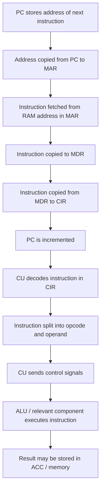
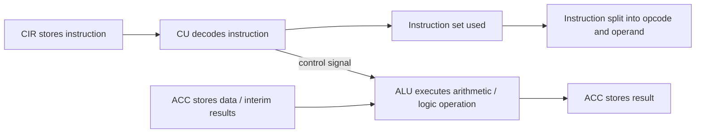
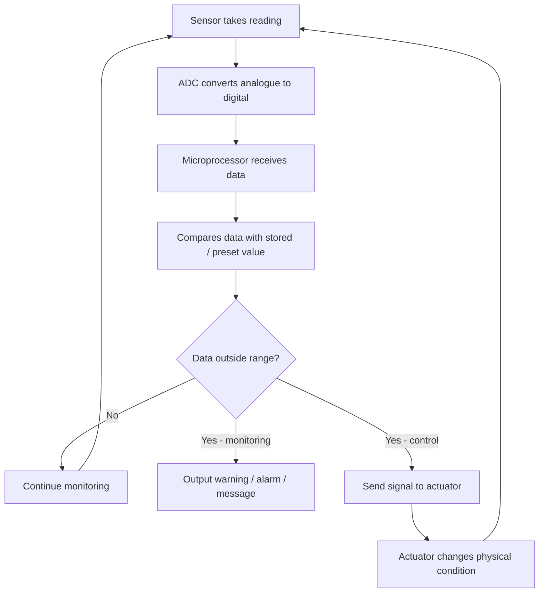
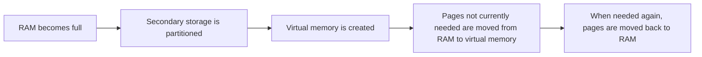

# IGCSE 0478 Chapter 3: Hardware

<div class="chapter-meta"><strong>IGCSE 0478 · Paper 1</strong><span>0478 · 2026–2028 · Version 5</span></div>

## Official Syllabus Checklist

Revise: computer architecture; input, output and sensors; storage media; network hardware.

> The checklist paraphrases the syllabus for revision. Use the official syllabus as the final authority.

## Core Knowledge

Use the topic sections below to connect definitions, processes, comparisons and calculations.


## 3.1 Computer Architecture
### 3.1.1 CPU and Microprocessor
**CPU**
Processes instructions and data that are input into the computer so that results can be output.

**Microprocessor**
A type of integrated circuit on a single chip.

#### Core Exam Sentences
+ The CPU **processes instructions and data**.
+ The CPU performs the **fetch–decode–execute cycle**.
+ A microprocessor is **an integrated circuit on a single chip**.
+ A CPU contains the **control unit**, **arithmetic and logic unit**, **registers** and uses **buses**.

---

### 3.1.2 CPU Components｜CU, ALU, Registers and Buses
#### CPU Units
| Component | Full name | Exam function |
| --- | --- | --- |
| **CU** | Control Unit | sends control signals and manages the flow of data through the CPU |
| **ALU** | Arithmetic and Logic Unit | performs arithmetic calculations and logic operations |
| **Clock** | System clock | controls the timing / number of FDE cycles performed per second |


#### CPU Registers
| Register | Full name | Mark scheme style function |
| --- | --- | --- |
| **PC** | Program Counter | stores the address of the next instruction to be fetched |
| **MAR** | Memory Address Register | stores the address of the memory location currently being read from or written to |
| **MDR** | Memory Data Register | stores data immediately before it is written to RAM or immediately after it is read from RAM |
| **CIR** | Current Instruction Register | stores the current instruction being decoded / executed |
| **ACC** | Accumulator | stores interim results / data used by the ALU |


#### Buses
| Bus | Function | Direction |
| --- | --- | --- |
| **Address bus** | carries memory addresses from CPU to memory / I/O devices | usually one-way |
| **Data bus** | carries data between CPU, memory and I/O devices | two-way |
| **Control bus** | carries control signals such as read/write signals | two-way |


> **Common trap**：MAR stores an **address**. MDR stores **data/instruction**. PC stores the **address of the next instruction**.
>

---

### 3.1.3 Fetch–Decode–Execute Cycle｜6-mark Core Template

```mermaid
flowchart TD
A[PC stores address of next instruction] --> B[Address copied from PC to MAR]
B --> C[Instruction fetched from RAM address in MAR]
C --> D[Instruction copied to MDR]
D --> E[Instruction copied from MDR to CIR]
E --> F[PC is incremented]
F --> G[CU decodes instruction in CIR]
G --> H[Instruction split into opcode and operand]
H --> I[CU sends control signals]
I --> J[ALU / relevant component executes instruction]
J --> K[Result may be stored in ACC / memory]
```

#### Fetch Stage
1. The **PC** stores the address of the next instruction.
2. The address is copied from **PC to MAR**.
3. The instruction is fetched from **RAM** at the address stored in MAR.
4. The instruction is copied into the **MDR**.
5. The instruction is copied from **MDR to CIR**.
6. The **PC is incremented** to point to the next instruction.

#### Decode Stage
+ The **CU decodes** the instruction stored in the **CIR**.
+ The instruction is decoded using an **instruction set**.
+ The instruction may be separated into **opcode** and **operand**.

#### Execute Stage
+ The CU sends control signals to the relevant CPU component.
+ The **ALU** performs arithmetic / logic operations if required.
+ The **ACC** stores data or interim results.
+ The result may be written back to memory.

#### Core Exam Sentences
+ The instruction is retrieved from RAM and stored in the MDR.
+ The instruction is then sent to the CIR.
+ The CU decodes the instruction using the instruction set.
+ The instruction is separated into opcode and operand.
+ The ALU executes arithmetic or logical operations.
+ The ACC stores the result of interim calculations.

---

### 3.1.4 Decode + Execute Diagram Focus｜CIR / CU / ALU / ACC

```mermaid
flowchart LR
CIR[CIR stores instruction] --> CU[CU decodes instruction]
CU --> IS[Instruction set used]
IS --> OP[Instruction split into opcode and operand]
CU -->|control signal| ALU[ALU executes arithmetic / logic operation]
ACC[ACC stores data / interim results] --> ALU
ALU --> ACC2[ACC stores result]
```

#### What the diagram should show
+ **CIR is built into / associated with the CU**.
+ **CIR stores the instruction**.
+ **CU decodes the instruction**.
+ Instruction is decoded using an **instruction set**.
+ Instruction may be separated into **opcode and operand**.
+ CU sends a signal to the **ALU** to execute.
+ **ACC is built into / associated with the ALU**.
+ ACC stores any data / interim result needed by the instruction.
+ ALU executes the instruction / performs mathematical or logical operation.

---

### 3.1.5 Core, Cache and Clock｜CPU Performance
| Factor | Definition | How it affects performance |
| --- | --- | --- |
| **Core** | independent processing unit in the CPU that can perform FDE cycle | more cores can process more instructions simultaneously |
| **Cache** | very fast memory storing frequently used data/instructions | larger cache means more frequently used data can be accessed faster than RAM |
| **Clock speed** | number of FDE cycles / clock pulses per second | higher clock speed means more instructions can be processed per second |


#### Core Exam Template
> **Explain how the performance of a CPU can be improved.**
>

Use paired points:

+ Increase the **number of cores** → more instructions can be processed **simultaneously**.
+ Increase the **clock speed** → more FDE cycles / instructions can be processed **per second**.
+ Increase the **cache size** → more frequently used data/instructions can be stored and accessed faster than RAM.

> **Common trap**：<span lang="zh-CN">不要只写</span> “more cores = faster”。<span lang="zh-CN">必须补充</span> **more instructions can be processed simultaneously**。
>

---

### 3.1.6 Instruction Set, Opcode and Operand
| Term | Meaning |
| --- | --- |
| **Instruction set** | a list of all the machine code commands that can be processed by a CPU |
| **Opcode** | part of an instruction that tells the CPU what operation/action to perform |
| **Operand** | part of an instruction that tells the CPU what data / address to use |


#### Core Exam Sentences
+ An instruction set is a **list of machine code commands** that can be processed by a CPU.
+ The **opcode** identifies the operation.
+ The **operand** identifies the data or address used by the instruction.

---

### 3.1.7 Embedded Systems
An **embedded system** is a computer system built into a larger device to perform a **dedicated / limited / single function**.

#### Characteristics of Embedded Systems
| Scoring point | Mark scheme phrase |
| --- | --- |
| Function | has a single / limited / dedicated function |
| Hardware | has dedicated hardware |
| Processor | contains a microprocessor / microcontroller |
| Reprogramming | function is not easily changed / cannot be easily reprogrammed |
| Device relation | built into / part of a larger device |


#### Examples
+ Washing machine
+ Vending machine
+ Security system
+ Street lighting system
+ Smart speaker
+ ATM
+ Car engine / ABS system

#### Embedded System vs General Purpose Computer
| Embedded system | General purpose computer |
| --- | --- |
| performs one dedicated function | performs many different functions |
| often built into another device | usually a standalone device |
| uses dedicated hardware | hardware can be used for many tasks |
| software not easily changed | software can usually be installed / updated |
| often uses a microprocessor | has a CPU |


> **Common trap**：<span lang="zh-CN">不要写</span> “embedded system is small” <span lang="zh-CN">作为唯一答案</span>。<span lang="zh-CN">考试更看重</span> **dedicated function / dedicated hardware / microprocessor / not easily reprogrammed**。
>

---

## 3.2 Input and Output Devices
### 3.2.1 Input and Output Devices
| Type | Meaning | Examples |
| --- | --- | --- |
| **Input device** | hardware used to enter data into a computer system | keyboard, microphone, camera, sensor, scanner, touchscreen |
| **Output device** | hardware used to output data from a computer system | screen, speaker, printer, actuator, projector, LED |


#### High-frequency device notes
| Device | Typical use / exam point |
| --- | --- |
| **Keyboard** | enter text / data |
| **Microphone** | input sound / voice commands |
| **Digital camera** | input images / video |
| **Optical mouse** | detect movement using reflected light and control a pointer |
| **Barcode scanner** | read barcode data for price / stock control |
| **QR code scanner** | read QR code to access website / data |
| **2D scanner** | convert hard-copy documents into digital images |
| **3D scanner** | captures shape / dimensions to create a digital model |
| **Touchscreen** | both input and output device |
| **Actuator** | output device that causes physical movement / action |

#### Touchscreen types

| Type | How the touch is detected | Suitable feature / context |
| --- | --- | --- |
| **Resistive** | pressure brings two conductive layers into contact | works with a finger, glove or stylus; useful where physical pressure is acceptable |
| **Capacitive** | a conductive finger changes the screen's electric field / capacitance | supports a clear, responsive multi-touch interface |
| **Infra-red** | the touch interrupts a grid of infra-red beams across the screen | detects touch without pressing flexible screen layers |


---

### 3.2.2 Sensors｜How to Choose the Correct Sensor
A **sensor** is an input device that measures physical properties from the environment.

| Sensor | Measures / detects | Common exam scenarios |
| --- | --- | --- |
| **Temperature** | temperature | greenhouse, central heating, fridge, engine monitoring |
| **Light** | light level / brightness | street lights, automatic headlights |
| **Acoustic** | sound level / sound energy | noise monitoring, security system |
| **Infra-red** | infra-red radiation / interruption of an infra-red beam | security alarm, automatic door |
| **Proximity** | presence / distance of a nearby object | parking sensor, welcome screen |
| **Pressure** | pressure / force | weighing, mats in games, gas pressure |
| **Moisture** | water level in soil | plant watering, greenhouse |
| **Humidity** | water vapour in air | greenhouse, factory air control |
| **Gas** | specific gas level | pollution monitoring, greenhouse gas levels |
| **pH** | acidity / alkalinity | soil acidity, chemical process |
| **Accelerometer** | acceleration / movement | phone rotation, car airbag |
| **Flow** | flow rate of liquid/gas | pipes, medical breathing devices |
| **Level** | liquid / powder level | tank, water bowl, production process |
| **Magnetic field** | strength / presence of a magnetic field | door position, wheel rotation, compass system |


#### Core Exam Sentence
+ A sensor **collects physical data** from the environment and sends it to the microprocessor.

---

### 3.2.3 Analogue Data, Digital Data, ADC and DAC
| Term | Meaning / use |
| --- | --- |
| **Analogue data** | continuously changing physical data, e.g. temperature or light level |
| **Digital data** | discrete binary data that a computer can process |
| **ADC** | analogue-to-digital converter; converts sensor readings into digital data for the microprocessor |
| **DAC** | digital-to-analogue converter; converts computer output into analogue signals for an actuator |


#### Core Exam Sentences
+ Most sensor readings are **analogue** because physical properties vary continuously.
+ The microprocessor can only process **digital data**.
+ An **ADC** converts analogue sensor readings into digital data.
+ A **DAC** may be used when the microprocessor controls an actuator.

---

### 3.2.4 Monitoring Systems vs Control Systems
| System type | Meaning | Key difference |
| --- | --- | --- |
| **Monitoring system** | measures / records data and may output warning | does **not** change the physical condition directly |
| **Control system** | measures data and sends signals to actuators | **changes** the physical condition |



```mermaid
flowchart TD
A[Sensor takes reading] --> B[ADC converts analogue to digital]
B --> C[Microprocessor receives data]
C --> D[Compares data with stored / preset value]
D --> E{Data outside range?}
E -->|No| F[Continue monitoring]
E -->|Yes - monitoring| G[Output warning / alarm / message]
E -->|Yes - control| H[Send signal to actuator]
H --> I[Actuator changes physical condition]
I --> A
F --> A
```

#### Monitoring System Template
Use this for **hospital patient**, **pollution**, **car engine**, **burglar alarm**.

1. The sensor constantly measures the physical property.
2. The sensor sends data to the microprocessor.
3. Analogue data is converted to digital using an **ADC**.
4. The microprocessor compares the data with a **stored / preset value**.
5. If the value is outside the acceptable range, a warning / alarm / message is output.
6. If the value is within range, the system continues monitoring.
7. The process repeats continuously.

#### Control System Template
Use this for **greenhouse**, **street light**, **air conditioning**, **water bowl**, **automatic door**.

1. The sensor constantly measures the physical property.
2. The sensor sends data to the microprocessor.
3. Analogue data is converted to digital using an **ADC**.
4. The microprocessor compares the data with a **stored / preset value**.
5. If the value is outside the required range, the microprocessor sends a signal to an **actuator**.
6. The actuator changes the physical condition, e.g. opens a window / turns on a motor / switches on a light.
7. The process repeats continuously.

---

### 3.2.5 Scenario Templates
#### A. Proximity / Infra-red Sensor Welcome Screen
+ A proximity / infra-red sensor detects a person near the screen.
+ The sensor continually sends data to the microprocessor.
+ The microprocessor uses the sensor data to calculate distance.
+ The microprocessor compares the data with the stored value, e.g. 1 metre.
+ If the person is within range, the microprocessor sends a signal to display the welcome message.

#### B. Street Lighting System
+ A light sensor measures the light level.
+ The analogue reading is converted to digital using an ADC.
+ The microprocessor compares the light level with the preset value.
+ If the light level is below the preset value, a signal is sent to switch the lamp on.
+ If the light level is above or equal to the preset value, a signal is sent to switch the lamp off.
+ The process repeats continuously.

#### C. Greenhouse Temperature Control
+ A temperature sensor measures the temperature.
+ The data is converted using an ADC.
+ The microprocessor compares the data with the stored range.
+ If the temperature is above the upper limit, the microprocessor sends a signal to open the window / turn off heater.
+ If the temperature is below the lower limit, the microprocessor sends a signal to close the window / turn on heater.
+ Actuators operate the window / heater.
+ The process repeats continuously.

#### D. Animal Water Bowl / Tank Level Control
+ A level / pressure / moisture sensor measures the water level.
+ Sensor data is sent to the microprocessor.
+ Data is converted to digital using an ADC.
+ The microprocessor compares the data with the stored value.
+ If the value is below the stored value, a signal is sent to an actuator / valve to release water.
+ The bowl is filled for a set time or to a set level.
+ The process repeats until turned off.

---

### 3.2.6 Output Devices｜Printers, Screens and Actuators
#### Actuator
An **actuator** is an output device that receives a signal and causes a physical action.

Examples:

+ motor
+ valve
+ heater
+ buzzer
+ light
+ pump

#### Inkjet vs Laser Printer
| Feature | Inkjet printer | Laser printer |
| --- | --- | --- |
| Best use | small number of high-quality colour prints / photos | high-volume document printing |
| Ink/toner | liquid ink | dry toner / powder |
| Speed | slower than laser for large jobs | faster, especially for many pages |
| Running cost | often higher per page | often lower per page |
| Initial cost | usually cheaper | usually more expensive |
| Drawback | ink can run out / smudge | toner cartridge expensive; larger footprint; warm-up time |

#### Other required output devices

| Device | Output / operation | Suitable use |
| --- | --- | --- |
| **DLP projector** | reflects light using many microscopic mirrors to project an image | large bright presentation image |
| **LCD projector** | passes light through liquid-crystal panels to project an image | classroom or meeting-room display |
| **LCD screen** | controls light through liquid-crystal pixels | low-power monitor or portable display |
| **LED screen** | uses light-emitting diodes, often as an LCD backlight or direct display pixels | bright, efficient visual display |
| **Speaker** | converts an electrical signal into sound waves | music, speech, alarms |
| **3D printer** | produces a physical object by adding material layer by layer | prototype, model or customised component |

#### Device selection drill

1. A desktop pointer must detect movement without a rolling ball: choose an **optical mouse** because it measures reflected light from the surface.
2. A public kiosk must detect a gloved user's selection: choose a **resistive touchscreen** because pressure can be applied through the glove.
3. A phone needs responsive multi-touch gestures: choose a **capacitive touchscreen** because a conductive finger changes capacitance.
4. A large information display must detect touches without pressure: choose an **infra-red touchscreen** because a touch interrupts the beam grid.
5. A cinema needs a bright projected image: choose a **DLP projector** because microscopic mirrors can produce a bright large image.
6. A classroom needs a conventional projected computer image: choose an **LCD projector** because liquid-crystal panels form the projected image.
7. A portable monitor needs a low-power flat panel: choose an **LCD screen**; a bright, efficient sign can use an **LED screen**.
8. A warehouse needs a physical prototype from a digital model: choose a **3D printer** because it builds the object layer by layer.
9. A factory must detect whether a magnetic safety guard is closed: choose a **magnetic-field sensor**.
10. A library must measure noise without storing intelligible speech: choose an **acoustic sensor** to measure sound level rather than a microphone to capture sound data.


#### Core Exam Sentences
+ A laser printer is suitable for high-volume printing because it prints quickly and one toner cartridge can print many pages.
+ An inkjet printer is suitable for one-off colour photographs because it can produce high quality colour prints.

---

## 3.3 Data Storage
### 3.3.1 Primary Storage vs Secondary Storage
| Storage type | Meaning | Examples |
| --- | --- | --- |
| **Primary storage** | directly accessible by the CPU | RAM, ROM, cache, registers |
| **Secondary storage** | not directly accessible by the CPU; usually non-volatile | HDD, SSD, optical disk, USB flash drive |


#### RAM vs ROM
| RAM | ROM |
| --- | --- |
| volatile | non-volatile |
| temporary storage | permanent storage |
| stores data/instructions/software currently in use | stores BIOS / bootloader / firmware / start-up instructions |
| can be read from and written to | usually read-only |
| directly accessed by CPU | directly accessed during start-up / stores permanent instructions |


#### RAM Purpose｜Core Exam Sentences
+ RAM stores data and instructions that are **currently in use**.
+ RAM stores software / programs that are **currently running**.
+ RAM is **volatile** and stores data temporarily.
+ RAM allows data to be accessed directly by the CPU.

#### ROM Purpose｜Core Exam Sentences
+ ROM stores the **BIOS**.
+ ROM stores the **bootloader / bootstrap**.
+ ROM stores **start-up instructions**.
+ ROM stores **firmware**.
+ ROM is **non-volatile**.

> **Common trap**：RAM is not secondary storage. RAM is primary storage and is directly accessed by the CPU.
>

---

### 3.3.2 Magnetic, Optical and Solid-state Storage
#### Magnetic Storage｜HDD
How it works:

+ The device has spinning **platters**.
+ Platters are divided into **tracks and sectors**.
+ A read/write head moves across the platter.
+ Data is read/written using **magnetic fields**.
+ Magnetic orientation represents binary values.

#### Optical Storage｜CD / DVD / Blu-ray
How data is read/written:

+ The disk is spun.
+ A laser is shone onto the disk.
+ Data is represented by **pits and lands**.
+ Pits and lands reflect light differently.
+ The optical drive detects the reflected light and determines binary values.
+ When writing data, pits are burnt into a spiral track.

#### Solid-state Storage｜SSD / flash memory
How it works:

+ Solid-state storage has **no moving parts**.
+ It uses **semiconductor chips**.
+ It can use **NAND / NOR / flash memory** technology.
+ It uses cells and transistors laid out in a grid.
+ It uses **control gates and floating gates**.
+ Data is stored as electrical charges / by controlling the flow of electrons.

---

### 3.3.3 HDD vs SSD｜Choosing Suitable Storage
| HDD | SSD |
| --- | --- |
| magnetic storage | flash / solid-state storage |
| has moving parts | no moving parts |
| slower access speed | faster access speed |
| produces more heat/noise | cooler and quieter |
| higher power consumption | lower power consumption |
| cheaper per unit of storage | more expensive per unit of storage |
| can have very high capacity | high capacity, but often more costly |
| can have more read/write cycles | may have limited write cycles |


#### Choose SSD when...
+ device needs to be portable / light
+ low power consumption is important
+ fast access speed is needed
+ reliability is important because there are no moving parts
+ less heat/noise is desired

#### Choose HDD when...
+ very large capacity is needed at lower cost
+ the device is not portable, e.g. server / desktop storage
+ many read/write cycles are expected
+ cost per unit of storage matters more than speed

> **Common trap**：Do not always say SSD is best. In a server needing huge cheap storage and many read/write cycles, HDD can still be justified.
>

---

### 3.3.4 Virtual Memory
Virtual memory is an area of **secondary storage** used as an extension of RAM when RAM is full.


```mermaid
flowchart LR
A[RAM becomes full] --> B[Secondary storage is partitioned]
B --> C[Virtual memory is created]
C --> D[Pages not currently needed are moved from RAM to virtual memory]
D --> E[When needed again, pages are moved back to RAM]
```

#### Core Exam Template
> **Describe how virtual memory is created and used.**
>

+ The secondary storage device is partitioned to create virtual memory.
+ Virtual memory acts as an extension to RAM.
+ When RAM is full, pages of data not currently required are moved from RAM to virtual memory.
+ When the data is needed again, the pages are transferred back to RAM.
+ It allows programs to run even when there is not enough physical RAM.

#### Why virtual memory is needed
+ To extend the capacity of RAM.
+ To allow large programs to run.
+ To stop software from freezing / crashing when physical RAM is full.
+ To allow the computer to process large amounts of data.

> **Common trap**：Virtual memory is not extra physical RAM. It is part of secondary storage used as if it were RAM.
>

---

### 3.3.5 Cloud Storage
Cloud storage is storage where data is stored on **remote servers** and accessed using a network, often the internet.

#### Benefits
+ Files can be accessed from any device with internet access.
+ No need to carry an external storage device.
+ Data can be backed up remotely.
+ Data can still be recovered if the local device is lost or damaged.
+ Storage capacity can be increased easily.
+ The user may not need to maintain storage hardware.

#### Drawbacks
+ Internet connection is required.
+ Slow / unstable internet can make access difficult.
+ Large storage capacity may cost money.
+ Data security depends on the cloud provider.
+ If the cloud provider fails, data may become unavailable.

#### Core Exam Sentence
+ Cloud storage uses remote servers that are usually accessed through the internet.

---

## 3.4 Network Hardware
### 3.4.1 Network Interface Card｜NIC / WNIC
A **network interface card / controller (NIC)** allows a device to connect to a network.

#### Core Exam Sentences
+ A NIC allows a device to send data to and receive data from a network.
+ It allows a physical / wireless connection to a network.
+ It converts data from the computer into a form suitable for transmission over the network.
+ It converts network data into a form the computer can understand.
+ A NIC contains / is assigned a **MAC address**.

---

### 3.4.2 MAC Address
A **MAC address** is a unique hardware address assigned to a network interface card at manufacture.

#### Characteristics
+ It is usually represented in **hexadecimal**.
+ It is normally **48 bits** / 12 hexadecimal digits.
+ It is often written in **six groups** of two hexadecimal digits.
+ Groups are separated by **hyphens** or **colons**.
+ It contains a **manufacturer ID** and a **unique device serial number**.
+ It is usually static / does not normally change.

#### Example format
```latex
00-1C-B3-4F-25-FE
00:1C:B3:4F:25:FE
```

---

### 3.4.3 IP Address
An **IP address** identifies where a device is connected on a network / internet.

#### IPv4 vs IPv6
| IPv4 | IPv6 |
| --- | --- |
| 32-bit address | 128-bit address |
| four groups of denary values | eight groups of hexadecimal values |
| groups separated by full stops | groups separated by colons |
| each value usually 0–255 | consecutive groups of 0s can be replaced by `::` once |


#### Static vs Dynamic IP Address
| Static IP address | Dynamic IP address |
| --- | --- |
| does not change | can change each time device connects |
| useful for servers | gives greater privacy |
| assigned manually / by ISP | assigned automatically by DHCP |
| consistent location | temporary address |


#### MAC vs IP Address
| MAC address | IP address |
| --- | --- |
| identifies the physical network interface | identifies the location of a device on a network |
| assigned by manufacturer | assigned by network / ISP / DHCP |
| normally does not change | can be static or dynamic |
| hexadecimal, often 48-bit | IPv4 32-bit or IPv6 128-bit |
| used for local network delivery | used for routing over networks / internet |


> **Common trap**：MAC address identifies the **device/NIC**. IP address identifies the **network location**.
>

---

### 3.4.4 Router
A **router** sends data packets between different networks and directs packets to their destination using IP addresses.

#### Core Exam Sentences
+ A router connects a local network to another network / the internet.
+ A router sends data packets towards their destination.
+ A router uses the IP address to decide where to send packets.
+ A router can assign IP addresses to devices.
+ A router can choose the most suitable route for a packet.


```mermaid
flowchart LR
A[Device on LAN] --> B[Switch / local network]
B --> C[Router]
C --> D[Internet / WAN]
D --> E[Destination network]
```

---

## Mark Scheme Style Answer Templates
### Template 1｜Describe the FDE cycle
+ The PC stores the address of the next instruction.
+ The address is copied to the MAR.
+ The instruction is fetched from RAM and stored in the MDR.
+ The instruction is copied to the CIR.
+ The PC is incremented.
+ The CU decodes the instruction using the instruction set.
+ The instruction is split into opcode and operand.
+ The relevant component / ALU executes the instruction.

### Template 2｜Explain how CPU performance can be improved
+ Increase the number of cores so more instructions can be processed simultaneously.
+ Increase the clock speed so more FDE cycles can be performed per second.
+ Increase the cache size so more frequently used data/instructions can be accessed faster than RAM.

### Template 3｜Describe how sensors are used in a control system
+ Sensor takes readings from the environment.
+ Analogue readings are converted to digital using an ADC.
+ The microprocessor compares the readings with stored / preset values.
+ If the reading is outside the required range, the microprocessor sends a signal to an actuator.
+ The actuator changes the physical condition.
+ The process repeats continuously.

### Template 4｜Describe how virtual memory is used
+ Secondary storage is partitioned to create virtual memory.
+ Virtual memory acts as an extension to RAM.
+ When RAM is full, pages not currently needed are transferred from RAM to virtual memory.
+ When needed again, pages are transferred back to RAM.

### Template 5｜Describe how an SSD stores data
+ It has no moving parts.
+ It uses semiconductor chips / flash memory.
+ It uses NAND/NOR technology.
+ It uses cells and transistors in a grid.
+ It uses control gates and floating gates.
+ Data is stored as electrical charges / by controlling the flow of electrons.

### Template 6｜Describe the role of a NIC
+ It allows a device to connect to a network.
+ It sends data to and receives data from the network.
+ It converts computer data into a format suitable for network transmission.
+ It converts network data into a format the computer can understand.
+ It contains / is assigned a MAC address.

---

## Topic-Specific Common Confusions
| Question type | Weak answer | Why it loses marks | Better answer |
| --- | --- | --- | --- |
| CPU role | “CPU runs the computer” | too vague | CPU processes instructions and data and performs the FDE cycle |
| MAR vs MDR | “MAR stores data” | wrong register | MAR stores address; MDR stores data/instruction |
| PC | “PC stores current instruction” | confused with CIR | PC stores address of next instruction |
| CIR | “CIR stores data” | too vague | CIR stores current instruction being decoded/executed |
| CU | “CU controls computer” | vague | CU sends control signals and manages data flow through CPU |
| ALU | “ALU calculates” | partly correct but incomplete | ALU performs arithmetic and logic operations |
| FDE | “fetch, decode, execute” only | no process detail | mention PC, MAR, RAM, MDR, CIR, CU, instruction set |
| Core/cache/clock | “more = faster” | no expansion | explain simultaneous instructions / per second / faster than RAM |
| Instruction set | “set of instructions” | incomplete | list of machine code commands processed by CPU |
| Embedded system | “small computer” | not the key point | built into a larger device to perform a dedicated function |
| Sensor system | “sensor sends data and actuator works” | missing ADC / compare / preset value | sensor → ADC → microprocessor → compare stored value → actuator/output |
| Monitoring vs control | “monitoring controls the system” | wrong | monitoring records / warns; control changes physical condition |
| ADC/DAC | “ADC changes data” | too vague | ADC converts analogue sensor data into digital data |
| RAM | “stores data” | too generic | stores data/instructions/software currently in use; volatile; directly accessed by CPU |
| ROM | “stores data permanently” | too generic | stores BIOS / bootloader / firmware / start-up instructions; non-volatile |
| Virtual memory | “extra RAM” | inaccurate | part of secondary storage used as extension to RAM |
| SSD | “faster storage” | not enough | no moving parts; flash memory; transistors; NAND/NOR; control/floating gates |
| Optical storage | “uses laser” | incomplete | laser reads pits and lands that represent binary values |
| Cloud storage | “stored online” | too vague | stored on remote servers and accessed through a network / internet |
| MAC vs IP | “both identify device” | not precise | MAC identifies NIC/device; IP identifies network location |
| Router | “connects devices” | closer to switch | router forwards packets between networks using IP addresses |


---

## Required Ideas and Exam Language

Use technical terms as part of a complete statement: identify the component or method, state what it does, then link its effect to the question context. A keyword without a correct relationship is not a complete marking point.

## Common Confusions

- Do not substitute a related term for the process named in the question.
- Do not list advantages or definitions without linking them to the stated context.

## Worked Examples

The worked calculations, process templates and scenario answers above model the chain of reasoning expected in examination responses. Rework each example before reading its answer.

## 10-Mark Quick Check

**Total: 10 marks**
1. State the purpose of the **program counter**. `[1]`
2. State the purpose of the **memory data register**. `[1]`
3. Define **instruction set**. `[1]`
4. Give two characteristics of an embedded system. `[2]`
5. State the device used to convert analogue sensor readings into digital data. `[1]`
6. Give one difference between RAM and secondary storage. `[1]`
7. Give one feature of an SSD. `[1]`
8. State the purpose of a NIC. `[1]`
9. State one characteristic of an IPv6 address. `[1]`

## Quick Check Answers
1. Stores the address of the next instruction to be fetched.
2. Stores data immediately before it is written to RAM or immediately after it is read from RAM.
3. A list of machine code commands that can be processed by a CPU.
4. Any two: dedicated/single function; dedicated hardware; contains a microprocessor; not easily reprogrammed; built into larger device.
5. ADC / analogue-to-digital converter.
6. RAM is directly accessed by the CPU / volatile; secondary storage is not directly accessed by CPU / non-volatile.
7. Any one: no moving parts; uses flash memory; uses semiconductor chips; uses NAND/NOR; uses transistors.
8. Allows a device to connect to a network / send and receive network data.
9. Any one: 128 bits; hexadecimal; separated by colons; eight groups; `::` can represent groups of zeros once.

---

## 20-Mark Exam Practice

**Total: 20 marks**
### Question 1｜CPU and FDE `[6]`
A CPU uses a Von Neumann architecture. Describe how the CPU fetches and decodes an instruction.

#### Mark Scheme
Any six from:

+ PC stores the address of the next instruction.
+ Address is copied from PC to MAR.
+ Instruction is fetched from RAM address stored in MAR.
+ Instruction is stored in MDR.
+ Instruction is copied from MDR to CIR.
+ PC is incremented.
+ CU decodes the instruction in CIR.
+ Instruction is decoded using an instruction set.
+ Instruction is split into opcode and operand.

---

### Question 2｜CPU Performance `[4]`
Explain how increasing the number of cores and increasing the cache size can improve CPU performance.

#### Mark Scheme
+ Increasing the number of cores can improve performance. `[1]`
+ More instructions can be processed simultaneously. `[1]`
+ Increasing cache size can improve performance. `[1]`
+ More frequently used data/instructions can be stored and accessed faster than RAM. `[1]`

---

### Question 3｜Control System `[5]`
A greenhouse uses a temperature sensor and a microprocessor to keep the temperature between 20°C and 28°C. Describe how this system works.

#### Mark Scheme
Any five from:

+ Temperature sensor measures the temperature.
+ Sensor data is sent to the microprocessor.
+ Analogue data is converted to digital using ADC.
+ Microprocessor compares the data with stored values / range 20–28.
+ If temperature is above 28, signal sent to actuator to open window / turn cooling on / turn heater off.
+ If temperature is below 20, signal sent to actuator to close window / turn heater on.
+ If temperature is within range, no action is taken.
+ The process repeats continuously.

---

### Question 4｜Virtual Memory `[3]`
Describe how virtual memory is created and used.

#### Mark Scheme
Any three from:

+ Secondary storage is partitioned to create virtual memory.
+ Virtual memory acts as an extension to RAM.
+ When RAM is full, pages not currently needed are transferred from RAM to virtual memory.
+ When needed again, pages are transferred back to RAM.

---

### Question 5｜Network Hardware `[2]`
Describe two features of a MAC address.

#### Mark Scheme
Any two from:

+ It is represented in hexadecimal.
+ It is usually 48 bits / 12 hexadecimal digits.
+ It is written in six groups.
+ Groups are separated by colons / hyphens.
+ It contains manufacturer ID and unique device number.
+ It is static / cannot normally be changed.

---

## Topic Review Checklist
### CPU
+ CPU processes instructions and data.
+ CU sends control signals and manages data flow.
+ ALU performs arithmetic and logic operations.
+ PC → address of next instruction.
+ MAR → memory address.
+ MDR → data/instruction from/to memory.
+ CIR → current instruction being decoded/executed.
+ ACC → interim results.

### FDE
PC → MAR → RAM → MDR → CIR → PC+1 → CU decodes → opcode/operand → ALU executes → ACC stores result.

### CPU Performance
+ More cores → more instructions simultaneously.
+ Higher clock speed → more FDE cycles per second.
+ Larger cache → more frequently used data accessed faster than RAM.

### Sensors
Sensor → ADC → microprocessor → compare with stored value → output warning / actuator → repeat.

+ Acoustic sensor → measures sound level; microphone → captures sound data.
+ Magnetic-field sensor → detects the presence or strength of a magnetic field.
+ Touchscreens may be resistive, capacitive or infra-red.

### Required input and output devices
+ Optical mouse → reflected light detects movement.
+ Resistive / capacitive / infra-red touchscreen → pressure contact / capacitance change / interrupted beam grid.
+ DLP / LCD projector → microscopic mirrors / liquid-crystal panels form a large projected image.
+ LCD / LED screen → liquid crystals control light / light-emitting diodes provide the display light.
+ 3D printer → adds material layer by layer to create a physical object.

### Storage
+ RAM: volatile, current data/instructions/software, directly accessed by CPU.
+ ROM: non-volatile, BIOS/bootloader/firmware/start-up instructions.
+ SSD: no moving parts, flash memory, transistors, NAND/NOR, control/floating gates.
+ Optical: laser reads pits and lands.
+ Virtual memory: secondary storage used as extension to RAM.

### Network Hardware
+ NIC connects device to network.
+ MAC identifies NIC/device; usually 48-bit hexadecimal.
+ IP identifies network location; IPv4 = 32-bit, IPv6 = 128-bit.
+ Router forwards packets between networks using IP addresses.

---

## Final Revision Checklist

- I can define the required terms precisely.
- I can explain each process in the correct order.
- I can apply the ideas to an unfamiliar scenario.
- I can complete the 10-mark check without notes.
- I can complete and self-mark the 20-mark practice.
