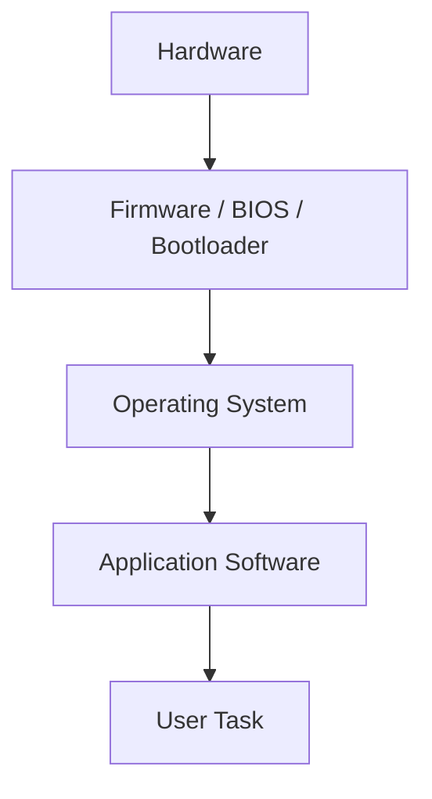
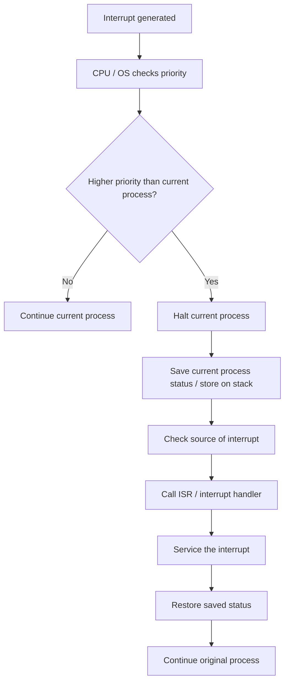
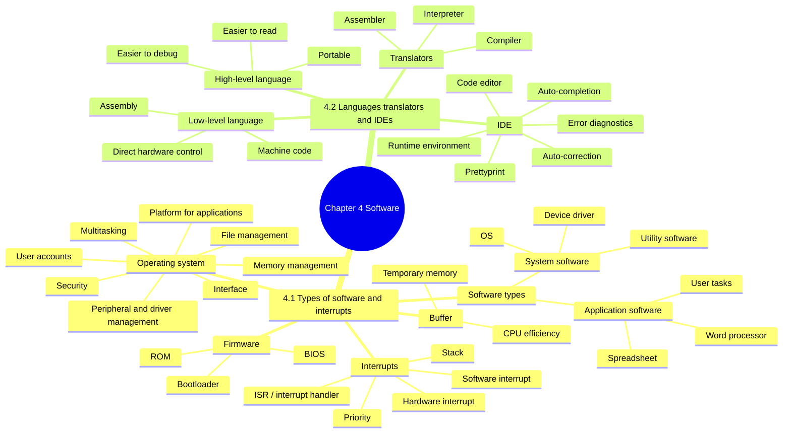

# IGCSE 0478 Chapter 4 Updated Checklist
## Software｜Syllabus-Aligned Revision Edition
> **适用范围**：Cambridge IGCSE Computer Science 0478  
**章节范围**：4.1 Types of Software and Interrupts｜4.2 Programming Languages, Translators and IDEs  
**更新依据**：2026–2028 syllabus + 全部 2025 Paper 1 / Mark Scheme 趋势 + 原 2023–2024 WHBC checklist  
**目标**：删掉低频/过细内容，把学生最容易拿分的 `State / Identify / Describe / Explain / Compare / Suggest` 得分句整理出来。  
**建议使用方式**：先背 **Core Exam Sentences**，再用 **Common Mistakes** 检查答案是否太泛。
>

---

## 0. Syllabus 更新结论：这一章现在怎么考？
| 考点 | 近期出题方向 | 学生最容易丢分的地方 | 更新处理 |
| --- | --- | --- | --- |
| **System vs application software** | 常以 1–4 marks 出现，要求区别 + example | 只写 “software used by computer/user”，没有写 **services computer requires / services user requires** | 保留核心定义，减少过长例子 |
| **Utility software** | 常作为 system software example 出现 | 把 utility software 写成 application software | 明确：utility software is system software |
| **Operating system functions** | 2025 明显高频：memory management, interrupts, user accounts, platform, interface | 只列名称，不描述 role；或把 bootstrap 当 OS function | 加入 “function + role” 表格 |
| **Memory management** | 2025 直接考 3 marks：allocates/deallocates memory, checks enough memory, moves data, avoids same location conflict, virtual memory | 只写 “manages memory” 太泛 | 单独强化 memory management 模板 |
| **Firmware / BIOS / bootloader** | 2025 常和 embedded system / robot / OS running process 联系 | 把 firmware 写成 hardware；忘记 ROM | 保留“stored in ROM / programmed into hardware / provides platform” |
| **Interrupt handling** | 2025 高频：hardware/software interrupt, priority, stack, ISR / interrupt handler, queue | 只写 “CPU stops” 不够；忘记 ISR 和 priority | 加入 interrupt full process flow |
| **Hardware vs software interrupts** | 2025 直接问例子 | 把 key press 写成 software interrupt；把 divide by zero 写成 hardware interrupt | 加入对比表和例子 |
| **High-level vs low-level languages** | 常考 advantages of HLL and features of LLL | 只写 “HLL easier” 太泛；忘记 portable / machine independent | 加入 HLL / LLL mark scheme keywords |
| **Assembly language + assembler** | 2025 反复考：assembly is low-level, uses mnemonics, assembler translates to machine code | 把 assembler / compiler / interpreter 混淆 | 单独做“三译者对比” |
| **Compiler vs interpreter** | 2025 高频 cloze / compare：whole code vs line-by-line, error report vs stops at error, executable file | 只写 “compiler faster” 不够稳 | 以 mark scheme 句子为主 |
| **IDE functions** | 2025 高频：code editor, run-time environment, error diagnostics, auto-completion, auto-correction, prettyprint | 只列功能名，没有解释 role | 做“function + role” 表 |
| **Buffer** | 不是 2025 核心高频，但仍可作为 interrupt/context support | 写太长，和 RAM 混在一起 | 降权，只保留 one-sentence version |


---

## 1. 内容取舍：哪些内容要删？哪些保留？
### ✅ 必须保留并重点训练
| 内容 | 原因 |
| --- | --- |
| System software vs application software | syllabus 明确要求；2024–2025 多次出现 |
| Utility software as system software | 常作为 system software example |
| OS functions | 2025 直接考 operating system role/function |
| Memory management | 2025 明确高频，容易丢分 |
| Firmware / BIOS / bootloader | 和 hardware / OS / application running chain 相关 |
| Interrupt types and handling process | 2025 明显高频 |
| Hardware interrupt vs software interrupt | 2025 直接考 example |
| High-level vs low-level language | 经典高频 comparison |
| Assembly language and assembler | 2025 反复出现 |
| Compiler vs interpreter | 2025 高频填空 / compare |
| IDE functions with descriptions | 2025 直接考 function + role |


### ⚠️ 降权或删除
| 原内容 | 处理方式 | 原因 |
| --- | --- | --- |
| 过长 application software examples | **压缩** | 考试一般只要 example，不需要背长描述 |
| Linker / link editor | **降权** | 不在 Chapter 4 的高频考查主线，容易干扰 compiler / assembler |
| Screensaver as utility software | **删除主表** | 低频且容易让学生误判重点 |
| “compiler is system software” 长解释 | **压缩** | 考试更常把 compiler 放在 translator 部分考 |
| 过长 GUI / HCI 解释 | **压缩** | OS interface 只需会写 role |
| Buffer 长段落 | **降权** | 保留概念即可，不作为主背诵内容 |
| 品牌软件例子 | **删除** | Cambridge mark scheme 不给 brand name 分 |


---

# 4.1 Types of Software and Interrupts
## 4.1.1 Software Types｜System Software vs Application Software
**<font style="background-color:#f8fbff;">System Software</font>**<font style="background-color:#f8fbff;">  
</font><font style="background-color:#f8fbff;">Software that provides the services that the computer requires.  
  
</font>**<font style="background-color:#f8fbff;">Key idea:</font>**<font style="background-color:#f8fbff;"> manages / maintains hardware and software. </font>

**<font style="background-color:#fffaf2;">Application Software</font>**<font style="background-color:#fffaf2;">  
</font><font style="background-color:#fffaf2;">Software that provides the services that the user requires.  
  
</font>**<font style="background-color:#fffaf2;">Key idea:</font>**<font style="background-color:#fffaf2;"> allows the user to perform tasks. </font>

### Core Exam Sentences
+ **System software** provides the services that the computer requires.
+ System software **manages / maintains hardware and software**.
+ Examples: **operating system**, **utility software**, **device driver**.
+ **Application software** provides the services that the user requires.
+ Application software allows the user to **perform specific tasks**.
+ Examples: word processor, spreadsheet, database, web browser, image editor, video editor.

> **Common trap**：考试如果问 system software example，最稳答案是 **operating system** 或 **utility software**。不要写 brand name。
>

---

## 4.1.2 Utility Software｜Utility Programs
**Utility software** is software designed to **manage, maintain or protect** a computer system.

| Utility software | What it does |
| --- | --- |
| **Anti-virus / anti-malware** | scans, detects, quarantines or removes malware |
| **Backup software** | creates copies of files for recovery |
| **File compression software** | reduces file size |
| **Disk repair / analysis** | checks and repairs storage problems |
| **File management software** | helps organise, copy, move and delete files |
| **Defragmentation software** | reorganises fragmented files on magnetic storage |
| **Security software** | helps protect the system from unauthorised access |


### Core Exam Sentences
+ Utility software helps to **manage, maintain and control computer resources**.
+ Utility software is a type of **system software**.
+ Anti-virus software is utility software because it helps protect the computer system.

> **注意**：defragmentation 主要适用于 **magnetic storage / HDD**，不要把它当作 SSD 的主功能来写。
>

---

## 4.1.3 Operating System｜Role and Basic Functions
An **operating system (OS)** is system software that manages the main functions of a computer.

### OS Function Table
| Function | Mark scheme style role description |
| --- | --- |
| **Managing files** | allows users to create, store, delete, move, copy and organise files |
| **Handling interrupts** | assigns priority to interrupts and uses an ISR / interrupt handler to process them |
| **Providing an interface** | allows the user to interact with the computer, e.g. GUI / CLI |
| **Managing peripherals and drivers** | allows hardware devices to communicate with the OS and applications |
| **Managing memory** | allocates / deallocates memory to processes and checks enough memory is available |
| **Managing multitasking** | switches between processes and allocates processor time/resources |
| **Platform for applications** | allows application software to run and communicate with hardware |
| **System security** | manages usernames, passwords, access rights, updates and security software |
| **Managing user accounts** | allows multiple users to log in and have separate settings/access rights |


### OS Memory Management｜2025 高频模板
> **Describe the role of the OS in managing memory.**
>

Use these points:

+ It makes sure memory is used efficiently.
+ It **allocates memory** to processes.
+ It **deallocates memory** when a process is finished.
+ It checks that processes have enough memory available.
+ It makes sure two processes do not try to access the same memory location.
+ It moves data between **RAM and secondary storage / virtual memory**.
+ It may create / manage **virtual memory** when RAM is full.

### Core Exam Sentences
+ The OS provides a **platform for running application software**.
+ The OS manages **memory, files, peripherals, security, user accounts and multitasking**.
+ The OS handles interrupts by assigning priority and calling the **interrupt service routine**.

> **Common trap**：`loading the bootstrap` 不是 OS 的 function。Bootstrap / bootloader is firmware used to start the operating system.
>

---

## 4.1.4 Hardware, Firmware and OS｜How Applications Run
### Golden Chain


### Explanation
| Layer | Role |
| --- | --- |
| **Hardware** | physical components of the computer |
| **Firmware** | permanent instructions stored in ROM / programmed into hardware |
| **BIOS / Bootloader** | starts the computer and loads the OS |
| **Operating system** | provides a platform for applications to run |
| **Application software** | allows the user to perform tasks |


### Firmware Core Sentences
+ Firmware is **software / instructions programmed into a hardware device**.
+ Firmware is usually stored in **ROM**.
+ Firmware can allow hardware to be **controlled / managed**.
+ Firmware provides the operating system with a **platform to run on**.
+ Examples: **BIOS**, bootloader, firmware in printer / router / SSD / robot controller.

> **Common trap**：Firmware is not the same as normal application software. It is more permanent and is closely linked to hardware.
>

---

## 4.1.5 Interrupts｜Definition and Purpose
An **interrupt** is a signal sent from hardware or software to the processor to request attention.

### Why Interrupts Are Needed
+ To show that the CPU’s attention is required.
+ To stop / pause the current process if something more urgent happens.
+ To allow **multitasking**.
+ To allow time-sensitive requests to be handled.
+ To improve efficiency because the CPU does not need to constantly poll devices.

### Hardware vs Software Interrupts
| Type | Definition | Examples |
| --- | --- | --- |
| **Hardware interrupt** | generated by a hardware device | key press, mouse click, printer out of paper/ink, peripheral connected/disconnected |
| **Software interrupt** | generated by software or a software error | division by zero, two processes trying to access the same memory location, program error |


> **Exam-safe examples**：  
Hardware interrupt = **key press on keyboard** / mouse click / printer out of ink.  
Software interrupt = **division by zero** / two processes trying to access same memory location.
>

---

## 4.1.6 How Interrupts Are Handled｜High Mark Template
> **Describe how the OS / CPU handles an interrupt.**
>



### Full Mark Sentences
+ The CPU / OS checks the **priority** of the interrupt.
+ If the interrupt has higher priority, the current process is halted.
+ The status of the current process is saved, often on a **stack**.
+ The source of the interrupt is checked.
+ The **interrupt service routine (ISR)** / interrupt handler is called.
+ The interrupt is serviced.
+ The saved status is restored.
+ The original process continues from where it stopped.

### One-Minute Version
> The OS checks the priority of the interrupt. If it has higher priority, the current process is halted and its status is saved. The OS then calls the interrupt service routine to service the interrupt. Once complete, the saved status is restored and the original process continues.
>

---

## 4.1.7 Buffer｜Low Priority but Useful
A **buffer** is a temporary memory area used to store data while it is being transferred.

### Why Buffers Are Needed
+ Devices often work at a slower speed than the CPU.
+ A buffer allows the CPU to continue with other tasks instead of waiting.
+ Buffers can help smooth playback when streaming.

> **Exam-safe sentence**：A buffer temporarily stores data so that the CPU does not have to wait for a slower input/output device.
>

---

# 4.2 Programming Languages, Translators and IDEs
## 4.2.1 High-Level Language vs Low-Level Language
| Feature | High-Level Language | Low-Level Language |
| --- | --- | --- |
| Human readability | easier to read / write / understand | harder to read / write / understand |
| Debugging | easier to debug | more error-prone |
| Portability | machine independent / portable | machine dependent |
| Hardware control | less direct control of hardware | can directly manipulate memory / registers / hardware |
| Memory efficiency | may use more memory after translation | can be memory efficient |
| Examples | Python, Java, C# | machine code, assembly language |
| Translator | compiler or interpreter | assembler for assembly language |


### Why Use a High-Level Language?
+ Easier for programmers to read, write and understand.
+ Easier to debug and maintain.
+ Less likely to make errors.
+ Machine independent / portable.
+ Does not require direct knowledge of memory locations or registers.
+ Can use an IDE.

### Why Use a Low-Level Language?
+ Can directly access / manipulate memory locations and registers.
+ Can communicate directly with hardware.
+ Can be more memory efficient.
+ Can execute faster after translation.
+ Useful for embedded systems or hardware-specific programming.

> **Common trap**：不要只写 “high-level is easier”。要补出 **easier to debug / portable / machine independent / does not need hardware knowledge**。
>

---

## 4.2.2 Assembly Language and Assembler
**Assembly language** is a low-level language that uses **mnemonics**.

### Core Exam Sentences
+ Assembly language is a **low-level language**.
+ It uses **mnemonics**.
+ It is used to communicate directly with the computer hardware.
+ It is machine dependent.
+ An **assembler** translates assembly language into machine code.

### Example Concept
```latex
Assembly language  --assembler-->  Machine code
```

> **Common trap**：Assembler translates **assembly language**, not high-level language. Compiler / interpreter translate high-level language.
>

---

## 4.2.3 Translators｜Compiler, Interpreter and Assembler
| Translator | Source language | How it works | Output | Common use |
| --- | --- | --- | --- | --- |
| **Compiler** | high-level language | translates the whole code at once before execution | executable file / machine code file | final program / distribution |
| **Interpreter** | high-level language | translates and executes line by line | no separate executable file | development / debugging |
| **Assembler** | assembly language | translates assembly language into machine code | machine code | low-level programs |


---

## 4.2.4 Compiler vs Interpreter｜High Frequency
### Compiler
+ Translates the **whole code** at once.
+ Translation happens **before execution**.
+ Produces an **executable file**.
+ Reports **all errors** in an error report if errors are found.
+ Once compiled, the compiler is not needed to run the program.
+ Useful for distributing the final program without source code.

### Interpreter
+ Translates and executes code **line by line**.
+ Stops when an error is found.
+ The error can be corrected immediately.
+ Program can continue once the error is corrected.
+ Easier to debug during development.
+ No separate executable file is produced.
+ The interpreter is needed each time the program runs.

### Compiler vs Interpreter Quick Table
| Question type | Best answer |
| --- | --- |
| During development | **Interpreter**, because it stops when an error is found and helps debug line by line |
| Final program distribution | **Compiler**, because it creates an executable file and source code is not needed |
| Error reporting | Compiler reports all errors; interpreter stops at the first error |
| Running after translation | Compiled program can run without compiler; interpreted program needs interpreter |


### Core Exam Template
> A programmer may use an interpreter during development because it translates and executes code line by line, stops when an error is found, and helps debug the program. The programmer may use a compiler for the final program because it translates the whole program and creates an executable file, so the program can be distributed without the source code.
>

---

## 4.2.5 IDE｜Integrated Development Environment
An **IDE** is a suite of programs used to write, run, test and debug program code.

### IDE Functions and Roles
| IDE function | Mark scheme style role description |
| --- | --- |
| **Code editor** | allows the programmer to write / change program code |
| **Run-time environment** | allows the programmer to run the code and see the output |
| **Translator** | converts source code into machine code / low-level code |
| **Error diagnostics** | helps find errors in the code |
| **Auto-completion** | suggests the rest of a command word while the programmer is typing |
| **Auto-correction** | corrects misspelled command words |
| **Prettyprint / syntax highlighting** | uses colours / formatting to make code easier to read |
| **Collapse / expand blocks** | hides or shows sections of code to improve readability |
| **Auto-documentation** | can generate documentation / comments for the code |


### Core Exam Sentences
+ An IDE provides tools to help programmers write and test code.
+ A code editor allows the programmer to write or change program code.
+ A run-time environment allows the programmer to run the code and view output.
+ Error diagnostics help find errors in the code.
+ Auto-completion suggests possible command words.
+ Auto-correction corrects misspelled command words.
+ Prettyprint / syntax highlighting colours command words and identifiers to make code easier to read.

> **Common trap**：如果题目要求 “function and description”，只写 `auto-completion` 不够，要写它如何帮助 programmer。
>

---

# 2. Chapter 4 Overall Mind Map


---

# 3. Mark Scheme Style Answer Templates
## Template A｜Difference between system software and application software
> System software provides the services that the computer requires and manages / maintains the hardware and software. An example is an operating system or utility software. Application software provides the services that the user requires and allows the user to perform tasks. An example is a word processor or spreadsheet.
>

---

## Template B｜Operating system memory management
> The operating system allocates memory to processes and deallocates memory when processes are finished. It checks that processes have enough memory available and makes sure two processes do not try to access the same memory location. It can also move data between RAM and virtual memory.
>

---

## Template C｜Firmware
> Firmware is permanent software / instructions programmed into a hardware device and usually stored in ROM. It can control hardware and provide a platform for the operating system to run on. An example is BIOS or a bootloader.
>

---

## Template D｜Interrupt handling
> The OS checks the priority of the interrupt. If it has a higher priority, the current process is halted and its status is saved, for example on a stack. The OS checks the source of the interrupt and calls the interrupt service routine / interrupt handler. Once the interrupt has been serviced, the saved status is restored and the original process continues.
>

---

## Template E｜Compiler vs interpreter
> A compiler translates the whole program before execution and produces an executable file. It reports all errors in the code. An interpreter translates and executes the code line by line and stops when an error is found. This makes an interpreter useful during development, while a compiler is useful for the final program.
>

---

## Template F｜Why use high-level language?
> A high-level language is easier for the programmer to read, write and understand. It is easier to debug and maintain. It is machine independent / portable, so the same program can be used on different types of computer after translation.
>

---

## Template G｜IDE functions
> A code editor allows the programmer to write and change code. A run-time environment allows the code to be run and the output to be seen. Error diagnostics help find errors in the code. Auto-completion suggests command words while the programmer is typing, and prettyprint colours / formats code to make it easier to read.
>

---

# 4. Common Mistakes｜超级重要易错点
| Topic | Weak answer | Why it loses marks | Better answer |
| --- | --- | --- | --- |
| System software | “It is software for computer.” | Too vague | “It provides services the computer requires and manages hardware/software.” |
| Application software | “Software on computer.” | Too vague | “It provides services the user requires and allows the user to perform tasks.” |
| Utility software | “It is an app.” | Utility is system software | “Utility software manages, maintains or protects the computer system.” |
| OS function | “OS controls computer.” | Too general | Give a named function + role, e.g. “manages memory by allocating memory to processes.” |
| Memory management | “Stores data.” | Not OS role enough | “Allocates/deallocates memory and prevents two processes accessing the same location.” |
| Firmware | “It is hardware.” | Firmware is software/instructions | “Firmware is software programmed into hardware and usually stored in ROM.” |
| Bootloader | “It is OS.” | Bootloader is firmware | “The bootloader loads/starts the operating system.” |
| Interrupt | “CPU stops.” | Missing process | “CPU checks priority, saves current status, calls ISR, restores status.” |
| Hardware interrupt | “Division by zero.” | That is software interrupt | “Key press / mouse click / printer out of ink.” |
| Software interrupt | “Keyboard press.” | That is hardware interrupt | “Division by zero / two processes accessing same memory location.” |
| ISR | “A program runs.” | Need name and role | “Interrupt service routine / interrupt handler services the interrupt.” |
| High-level language | “It is English.” | Too informal | “Easier to read/write/debug and machine independent.” |
| Low-level language | “It is hard.” | Too vague | “Machine dependent and can directly access memory/registers/hardware.” |
| Assembly language | “It is machine code.” | Assembly is not exactly machine code | “Assembly is low-level and uses mnemonics.” |
| Assembler | “Translates high-level language.” | Wrong translator | “Assembler translates assembly language into machine code.” |
| Compiler | “Runs code line by line.” | That is interpreter | “Compiler translates the whole code before execution.” |
| Interpreter | “Creates executable file.” | Compiler creates executable file | “Interpreter translates and executes line by line; no separate executable file.” |
| IDE | “It writes code.” | Need specific function | “Code editor allows programmer to write/change code.” |
| Auto-completion | “Fixes errors.” | Confused with diagnostics / auto-correction | “Suggests command words while typing.” |
| Prettyprint | “Prints code.” | Misread term | “Colours/formats code to make it easier to read.” |


---

# 5. Fast Revision Tables
## 5.1 Must-know Definitions
| Term | Definition |
| --- | --- |
| **System software** | software that provides services required by the computer |
| **Application software** | software that provides services required by the user |
| **Utility software** | system software used to manage, maintain or protect the computer |
| **Operating system** | system software that manages main functions of the computer |
| **Firmware** | software/instructions programmed into hardware, often stored in ROM |
| **Interrupt** | a signal sent to the processor to request attention |
| **ISR / interrupt handler** | program/routine that services an interrupt |
| **Buffer** | temporary memory area used to store data during transfer |
| **High-level language** | language closer to human language and easier to read/write/debug |
| **Low-level language** | language closer to machine code and hardware |
| **Assembly language** | low-level language that uses mnemonics |
| **Compiler** | translator that translates the whole high-level program before execution |
| **Interpreter** | translator that translates and executes high-level code line by line |
| **Assembler** | translator that translates assembly language into machine code |
| **IDE** | software suite used to write, run, test and debug programs |


---

## 5.2 “Choose the best translator” Table
| Scenario | Best translator | Reason |
| --- | --- | --- |
| Debugging during development | Interpreter | stops at the line where an error is found |
| Testing sections of incomplete code | Interpreter | can test without complete program code |
| Final program distribution | Compiler | creates executable file |
| Protecting source code | Compiler | executable can be distributed without source code |
| Assembly language program | Assembler | translates assembly into machine code |
| High-level language program | Compiler / Interpreter | both translate high-level code |


---

# 6. 10 Marks Quick Check
Answer these in exam style.

1. State one example of system software. **[1]**  
2. State one example of application software. **[1]**  
3. Give one function of an operating system. **[1]**  
4. State what is meant by firmware. **[1]**  
5. Give one example of a hardware interrupt. **[1]**  
6. Give one example of a software interrupt. **[1]**  
7. Give the name of the translator used for assembly language. **[1]**  
8. State one advantage of using a high-level language. **[1]**  
9. State one function of an IDE. **[1]**  
10. State what is meant by a buffer. **[1]**

## Quick Check Answers
1. Operating system / utility software / device driver.  
2. Word processor / spreadsheet / database / web browser / image editor.  
3. Managing files / handling interrupts / managing memory / managing multitasking / providing interface / etc.  
4. Software/instructions programmed into hardware, usually stored in ROM.  
5. Key press / mouse click / printer out of paper / printer out of ink.  
6. Division by zero / two processes trying to access same memory location.  
7. Assembler.  
8. Easier to read/write/debug / portable / machine independent.  
9. Code editor / run-time environment / error diagnostics / auto-completion / auto-correction / prettyprint.  
10. A temporary memory area used to store data during transfer.

---

# 7. 20 Marks Exam-style Practice with Mark Scheme
## Question 1｜Software Types **[4]**
A student uses a computer to complete homework.  
Describe the difference between system software and application software. Give one example of each.

### Mark Scheme
Any four from:

+ System software provides the services the computer requires.
+ System software manages / maintains hardware and software.
+ Example: operating system / utility software / device driver.
+ Application software provides the services the user requires.
+ Application software allows the user to perform tasks.
+ Example: word processor / spreadsheet / database / web browser / image editor.

---

## Question 2｜Operating System Memory Management **[3]**
Describe the role of the operating system in managing memory.

### Mark Scheme
Any three from:

+ Allocates memory to processes.
+ Deallocates memory when processes are finished.
+ Checks that processes have enough memory available.
+ Makes sure memory is used efficiently.
+ Moves data between memory and storage / RAM and virtual memory.
+ Makes sure two processes do not access the same memory location.
+ Creates / manages virtual memory.

---

## Question 3｜Interrupts **[5]**
A key is pressed on a keyboard while a computer is running another process.

(a) Give the type of interrupt generated. **[1]**  
(b) Give the name of the program/routine used to service the interrupt. **[1]**  
(c) Describe how the interrupt is handled. **[3]**

### Mark Scheme
(a) Hardware interrupt.  
(b) Interrupt service routine / interrupt handler.  
(c) Any three from:

+ CPU / OS checks priority of the interrupt.
+ Current process is halted if the interrupt has higher priority.
+ Status of current process is saved / stored on stack.
+ Source of interrupt is checked.
+ ISR / interrupt handler is called.
+ Interrupt is serviced.
+ Saved status is restored.
+ Original process continues.

---

## Question 4｜Compiler and Interpreter **[4]**
Explain why a programmer may use an interpreter during development but a compiler for the final program.

### Mark Scheme
Any four from:

+ Interpreter translates and executes code line by line.
+ Interpreter stops when an error is found.
+ This helps debug the program.
+ The program can continue once the error is corrected.
+ Compiler translates the whole program before execution.
+ Compiler creates an executable file.
+ The compiler is not needed to run the final program.
+ The source code does not need to be distributed.

---

## Question 5｜IDE Functions **[4]**
A programmer uses an IDE to create a program.  
Describe two functions of an IDE and explain how each helps the programmer.

### Mark Scheme
One mark for function + one mark for matching role description, max four:

+ Code editor: allows the programmer to write/change code.
+ Run-time environment: allows the programmer to run code and see output.
+ Error diagnostics: helps find errors in the code.
+ Auto-completion: suggests command words while typing.
+ Auto-correction: corrects misspelled command words.
+ Prettyprint / syntax highlighting: colours / formats code to make it easier to read.
+ Translator: translates code into machine code / low-level language.

---

# 8. Teacher Appendix｜教学建议

> Optional teacher-facing planning notes. Students can skip this appendix during normal revision.
## 8.1 本章教学重点排序
| Priority | Topic | Teaching advice |
| --- | --- | --- |
| ⭐⭐⭐⭐⭐ | Interrupt handling | 一定要让学生背完整流程：priority → halt → save status → ISR → restore → continue |
| ⭐⭐⭐⭐⭐ | Compiler vs interpreter | 用 development vs final distribution 场景讲，学生最容易理解 |
| ⭐⭐⭐⭐⭐ | OS functions | 不要只背 function 名称，要会写 role description |
| ⭐⭐⭐⭐ | Memory management | 2025 明显高频，建议作为独立小题训练 |
| ⭐⭐⭐⭐ | IDE functions | 训练 “function + how it helps” 双点答案 |
| ⭐⭐⭐⭐ | High-level vs low-level | 要求学生写出 portable / machine independent 和 direct hardware control |
| ⭐⭐⭐ | Firmware | 保留 ROM / BIOS / bootloader / platform for OS |
| ⭐⭐ | Buffer | 只做辅助概念，不建议花太多课时 |
| ⭐ | Linker / screensaver | 不建议作为主背诵内容 |


## 8.2 课堂训练建议
1. **Interrupt flow dictation**：让学生闭卷写出 interrupt handling 6 步。  
2. **Translator scenario sorting**：给 development / distribution / assembly / debugging 场景，让学生选 interpreter / compiler / assembler。  
3. **OS function expansion**：只给 function 名称，让学生补 role description。  
4. **Common mistake correction**：把 “OS controls computer” 改成可得分答案。  
5. **IDE matching exercise**：function 和 description 配对。

## 8.3 Recent exam-style Teaching Reminder
+ 现在题目越来越喜欢考 **specific role description**，不是只考定义。
+ 学生必须学会写 **named function + effect / purpose**。
+ 对比题不要只写一边，要写 “whereas / while”。
+ 不要让学生背品牌软件名；Cambridge 不给品牌分。
+ 第 4 章很适合做 “短句背诵 + 场景迁移”，不适合纯长段落背诵。

---

# 9. Final One-page Exam Sheet
## Must Remember
+ **System software** = services computer requires; manages hardware/software.
+ **Application software** = services user requires; lets user perform tasks.
+ **Utility software** = manages, maintains, protects system.
+ **OS functions** = files, interrupts, interface, peripherals/drivers, memory, multitasking, applications platform, security, user accounts.
+ **Firmware** = software/instructions programmed into hardware, often stored in ROM.
+ **Application running chain** = hardware → firmware/bootloader → operating system → application software.
+ **Interrupt** = signal requesting CPU attention.
+ **Hardware interrupt** = key press / mouse click / printer out of ink.
+ **Software interrupt** = division by zero / two processes accessing same memory location.
+ **Interrupt handling** = priority → halt current process → save status → check source → call ISR → service interrupt → restore status → continue.
+ **High-level language** = easier to read/write/debug, portable.
+ **Low-level language** = machine dependent, direct hardware/register/memory access.
+ **Assembly** = low-level language using mnemonics.
+ **Assembler** = assembly → machine code.
+ **Compiler** = whole code before execution, executable file, all errors.
+ **Interpreter** = line by line, stops at error, good for debugging.
+ **IDE** = code editor, run-time environment, translator, error diagnostics, auto-completion, auto-correction, prettyprint.

