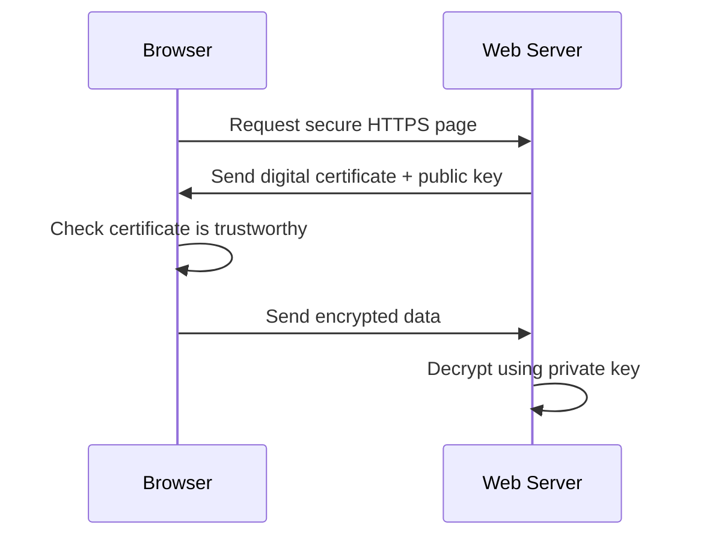
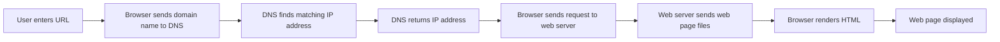
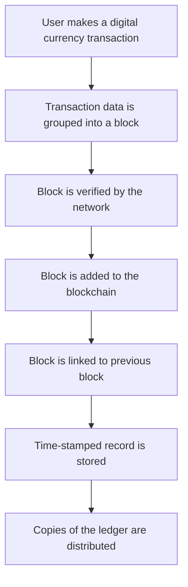
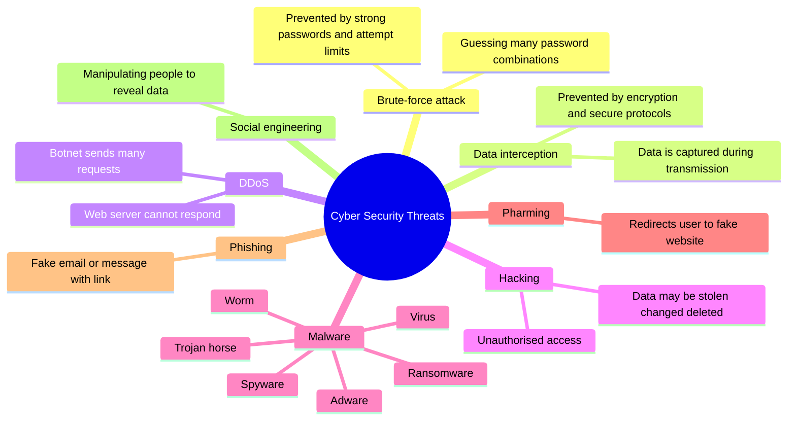
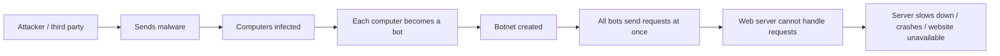
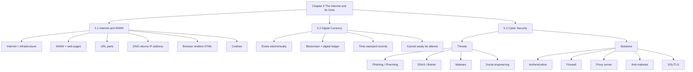

# IGCSE 0478 Chapter 5 Updated Checklist
## The Internet and Its Uses｜Syllabus-Aligned Revision Edition
> **适用范围**：Cambridge IGCSE Computer Science 0478  
**章节范围**：5.1 The Internet and the World Wide Web｜5.2 Digital Currency｜5.3 Cyber Security  
**更新依据**：2026–2028 syllabus + 2025 Paper 1 mark scheme trend + 原 2023–2024 WHBC checklist  
**目标**：删掉低频/过细内容，保留最容易出现在 `State / Identify / Describe / Explain / Compare / Suggest` 题里的得分点。  
**建议使用方式**：先背 **Core Exam Sentences**，再用 **Common Mistakes** 检查自己的答案是否太泛。
>

---

## 0. Syllabus 更新结论：这一章现在怎么考？
| 考点 | 近期出题方向 | 学生最容易丢分的地方 | 更新处理 |
| --- | --- | --- | --- |
| **URL / HTTP / HTTPS / SSL/TLS** | 常考 URL 部分、HTML/DNS/IP/SSL/TLS/Browser 定义；HTTPS 要写出安全机制 | 只写 “HTTPS is secure”，没有写 **SSL/TLS / encryption / digital certificate / public-private key** | 加入 HTTPS 高分模板和 URL 拆分图 |
| **DNS + webpage retrieval** | 重点考 DNS 的作用、浏览器如何定位并显示网页 | 忘记写 **DNS returns IP address**；把 DNS 写成 “finds website” 太泛 | 固定为 `URL → DNS → IP → web server → HTML → browser renders` |
| **Web browser functions** | 常以定义表、填空、2 marks list 出现 | 只写 “search the internet”，混淆 search engine 和 browser | 单独列出可得分功能，并强调 browser ≠ search engine |
| **Cookies** | 2025 高频：session / persistent 对比、用途、由 browser stored/managed | 把 cookies 写成 “virus / spyware”；或只写 “stores data” | 加入 session vs persistent 对比表和常见用途模板 |
| **Proxy server** | 2025 明显高频：DDoS 防护、caching、hide IP、limit requests、block certain IP | 把 proxy 和 firewall 完全混为一谈 | 加入 proxy vs firewall 对比，以及 proxy 的 2025 答题句 |
| **DDoS / Botnet** | 2025 考过 diagram-style answer：malware → bot → botnet → many requests → server crashes | 只写 “many requests” 不写 bots / botnet / web server cannot handle | 加入 DDoS 流程图模板 |
| **Security solutions** | 常要求 “solution + explanation”，不是只列名称 | 只写 “use firewall / password” 没解释如何防护 | 建立 “solution → how it works → what threat it prevents” 表 |
| **Social engineering** | 2025 直接考定义与例子 | 只写 “hacking people” 太口语、不够精确 | 改成 mark scheme 语言：**manipulating/deceiving people to obtain confidential data** |
| **Digital currency / blockchain** | 2025 Paper 1 出现较少，但仍在 syllabus；应保留核心流程 | 讲太深：mining, proof-of-work, wallet 等超出 IGCSE 主线 | 缩成 “digital ledger + time-stamped records + cannot be altered” |


---

## 1. 内容取舍：哪些内容要删？哪些保留？
### ✅ 必须保留并重点训练
| 内容 | 原因 |
| --- | --- |
| Internet vs World Wide Web | syllabus 明确要求，常以 1–2 marks 出现 |
| URL parts: protocol, domain name, web page/file name | 2025 直接考 URL label |
| HTTP vs HTTPS + SSL/TLS | 2025 高频，HTTPS 要能解释加密和证书 |
| Web browser functions | 2025 高频填空/表格题 |
| DNS role and webpage retrieval process | 2025 继续考 DNS role |
| Session cookies and persistent cookies | 2025 高频对比题 |
| Digital currency and blockchain basics | syllabus 明确要求，保留核心定义即可 |
| Cyber security threats | syllabus 明确列出：brute-force, data interception, DDoS, hacking, malware, pharming, phishing, social engineering |
| Security solutions | 2025 强调 “措施 + 解释”，特别是 password, 2FA, biometrics, firewall, anti-spyware, proxy |


### ⚠️ 降权或删除
| 原内容 | 处理方式 | 原因 |
| --- | --- | --- |
| 过长的 biometric 优缺点表 | **压缩** | 2025 更常考 biometric 为什么安全，而不是四种技术长表 |
| SSL 应用场景长列表 | **删除主表** | 考试更重视 SSL/TLS 如何保护数据，不重视背应用清单 |
| WEP 作为 data interception 防护 | **降权** | 不建议作为主答案，直接写 encryption / SSL/TLS / secure protocol 更稳 |
| pharming/phishing 过细防范清单 | **压缩成对比表** | 高频是 “process / difference / similarity”，不是长防范清单 |
| malware 每类超长描述 | **改成一行定义 + 关键 effect** | 更贴近 mark scheme 的短答形式 |
| digital currency vs cryptocurrency 过度扩展 | **只保留基础区别** | syllabus 核心是 digital currency 和 blockchain，不要求深入 crypto 机制 |
| “protects the computer” 这类泛泛表达 | **替换成 mark scheme keywords** | 太泛容易 0 分或低分 |


---

# 5.1 The Internet and the World Wide Web
## 5.1.1 Internet vs World Wide Web
**<font style="background-color:#f8fbff;">Internet</font>**<font style="background-color:#f8fbff;">  
</font><font style="background-color:#f8fbff;">A worldwide collection of interconnected networks.  
  
</font>**<font style="background-color:#f8fbff;">Key idea:</font>**<font style="background-color:#f8fbff;"> infrastructure / network of networks. </font>

**<font style="background-color:#fffaf2;">World Wide Web</font>**<font style="background-color:#fffaf2;">  
</font><font style="background-color:#fffaf2;">A collection of websites and web pages accessed using the internet.  
  
</font>**<font style="background-color:#fffaf2;">Key idea:</font>**<font style="background-color:#fffaf2;"> one service that uses the internet. </font>

### Core Exam Sentences
+ The **internet** is the physical / network infrastructure.
+ The **World Wide Web** is a collection of websites and web pages.
+ The WWW is accessed using a **web browser**.
+ The WWW uses protocols such as **HTTP / HTTPS**.
+ Email, file transfer and video streaming also use the internet, but they are not the same as the WWW.

> **Common trap**：不要写 “the internet is the websites”。更准确：**the WWW contains websites; the internet is the infrastructure used to access them.**
>

---

## 5.1.2 URL｜Uniform Resource Locator
A **URL** is a **text-based address for a web page**. It can contain:

| Part | Meaning | Example |
| --- | --- | --- |
| **Protocol** | Rules used to transfer data | `https://` |
| **Domain name** | Human-readable website address | `example.com` |
| **Path / area** | Folder or section in the website | `/shop/` |
| **Web page / file name** | Exact page or file requested | `index.html` |


```latex
https://www.example.com/shop/index.html
│       │               │    │
│       │               │    └── web page / file name
│       │               └────── path / area within website
│       └────────────────────── domain name
└────────────────────────────── protocol
```

### Core Exam Sentences
+ A URL is a **text-based address** used to locate a web page.
+ The **domain name** identifies the website.
+ The **web page name / file name** identifies the specific page or file.
+ The **protocol** tells the browser which rules to use, for example HTTP or HTTPS.

---

## 5.1.3 HTTP vs HTTPS
| Feature | HTTP | HTTPS |
| --- | --- | --- |
| Full name | Hypertext Transfer Protocol | Hypertext Transfer Protocol Secure |
| Purpose | Transfers web page data | Transfers web page data securely |
| Security | Not encrypted by default | Uses **SSL/TLS** |
| Data protection | Data may be readable if intercepted | Data is encrypted, so intercepted data is meaningless |
| Typical clue | `http://` | `https://`, padlock / certificate |


### HTTPS / SSL / TLS 高分模板
> **Explain how HTTPS helps keep data secure.**
>

Use this structure:

1. HTTPS uses **SSL/TLS**.
2. Data is **encrypted** before it is transmitted.
3. If the data is intercepted, it cannot be understood without the key.
4. A **digital certificate** can be used to authenticate the web server.
5. The browser can use the server’s **public key** to encrypt data.
6. The server uses its **private key** to decrypt the data.



> **Exam-safe sentence**：HTTPS uses SSL/TLS to encrypt data, so if the data is intercepted it cannot be understood.
>

---

## 5.1.4 Web Browser
A **web browser** is software used to **retrieve, render and display web pages**.

### Main Purpose
> The main purpose of a web browser is to **render HTML** and **display web pages**.
>

### Functions of a Web Browser
| Function | Mark scheme wording |
| --- | --- |
| Display web pages | renders HTML and displays web pages |
| Send requests | sends a request to the web server / IP address |
| DNS communication | sends URL to DNS / requests matching IP address |
| Navigation | allows back, forward, refresh, home page |
| Address bar | allows user to enter a URL |
| Bookmarks/favourites | stores saved websites |
| History | records pages visited |
| Tabs | allows multiple web pages to be open |
| Cookies | stores and manages cookies |
| Downloads | allows files to be downloaded from websites |
| Protocol management | manages HTTP/HTTPS |


> **Common trap**：Browser ≠ Search Engine.  
A browser displays web pages. A search engine finds web pages based on keywords.
>

---

## 5.1.5 How a Web Page Is Located, Retrieved and Displayed
### Golden Process Template
1. User enters a **URL** into the web browser.
2. The browser sends the URL / domain name to a **DNS**.
3. The DNS searches for the matching **IP address**.
4. The DNS returns the IP address to the browser.
5. The browser sends a request to the **web server** at that IP address.
6. The web server sends the web page files back to the browser.
7. The browser renders **HTML** and displays the web page.
8. If HTTPS is used, SSL/TLS certificates may be checked and the data is encrypted.



### DNS Role in One Sentence
> A DNS stores domain names / URLs and their matching IP addresses, then returns the matching IP address to the web browser.
>

---

## 5.1.6 Cookies
A **cookie** is a small text file / piece of data that is sent by a web server and stored / managed by the web browser.

### What Cookies Are Used For
| Use | Exam wording |
| --- | --- |
| Login details | stores a user’s login details |
| Payment details | stores payment details |
| Preferences | stores user preferences, such as language/theme |
| Shopping cart | stores items in an online shopping cart |
| Targeted advertising | stores pages visited / selected items for targeted adverts |
| Personal details | stores personal details such as address |


### Session Cookies vs Persistent Cookies
| Feature | Session Cookie | Persistent Cookie |
| --- | --- | --- |
| Storage time | temporary | permanent until deleted / expires |
| Deleted when | browser is closed | user deletes it or it reaches expiry date |
| Storage location | temporary memory / RAM | secondary storage |
| Common use | shopping cart during one visit | remember login details / preferences |


### Core Exam Sentences
+ Cookies are **stored and managed by the web browser**.
+ Session cookies are **temporary** and are deleted when the browser is closed.
+ Persistent cookies remain after the browser is closed and are deleted by the user or after they expire.

> **Common trap**：Cookies are not programs. They do not run operations by themselves. They store data.
>

---

# 5.2 Digital Currency and Blockchain
## 5.2.1 Digital Currency
A **digital currency** is a currency that **only exists electronically**.

### Core Exam Sentences
+ It does not exist as physical coins or notes.
+ It is stored and transferred electronically.
+ It can be used for online payments or electronic transactions.

### Digital Currency vs Cryptocurrency
| Digital Currency | Cryptocurrency |
| --- | --- |
| Exists electronically | Exists electronically |
| May be controlled by a central organisation / bank | Usually decentralised |
| Does not always use blockchain | Often uses blockchain |
| Transactions may not be public | Transactions can be recorded on a public ledger |


> **Keep it simple**：IGCSE 不需要深入解释 mining / proof-of-work / wallet seed phrase。核心是 digital currency 和 blockchain ledger。
>

---

## 5.2.2 Blockchain
A **blockchain** is a digital ledger: a time-stamped series of records that cannot easily be altered.

### Blockchain Transaction Process


### Core Exam Sentences
+ Blockchain acts as a **digital ledger**.
+ It records transactions in **blocks**.
+ Each record is **time-stamped**.
+ Blocks are linked to previous blocks.
+ Records cannot easily be altered once added.
+ The ledger can be distributed across many computers, making it difficult to change fraudulently.

---

# 5.3 Cyber Security
## 5.3.1 Threat Overview Mind Map


---

## 5.3.2 Threats：Process + Aim + Effects
| Threat | Process / How it works | Aim / Effect | High-value keywords |
| --- | --- | --- | --- |
| **Brute-force attack** | Tries many password combinations systematically | Finds password / gains access | repeated guesses, combinations, password, lockout |
| **Data interception** | Data is captured while being transmitted over a wired/wireless link | Steals confidential data | intercepted, transmission, encryption |
| **DDoS attack** | Many devices send requests to a server at the same time | Server slows, fails, times out, website unavailable | botnet, many requests, web server cannot handle |
| **Hacking** | Gains unauthorised access to a system | Data can be stolen, changed, deleted or corrupted | unauthorised access |
| **Virus** | Malware that replicates when run with an active host | Deletes/corrupts files, slows system, uses storage | replicates, active host |
| **Worm** | Malware that replicates over a network without user action | Uses bandwidth/storage, slows network | replicates, network, no active host |
| **Trojan horse** | Malware disguised as legitimate software | Installs malware when user downloads/runs it | disguised, authentic-looking |
| **Spyware / keylogger** | Monitors user activity or key presses | Sends personal data/passwords to attacker | key presses, monitoring, sends data |
| **Adware** | Displays unwanted adverts or redirects browser | Slows device / fake sites / pop-ups | unwanted adverts, redirects |
| **Ransomware** | Encrypts user data and demands payment | User cannot access files unless ransom is paid | encrypts data, payment, decryption key |
| **Pharming** | Malicious code redirects user to a fake website | Steals personal/bank data | redirect, fake website, malicious code |
| **Phishing** | Fake email/message contains link to fake website | User enters personal data | legitimate-looking email, link, fake website |
| **Social engineering** | Manipulates/deceives people | Obtains confidential/personal/valuable data | deceive, manipulate, confidential data |


---

## 5.3.3 DDoS / Botnet Diagram Template
> **Describe / draw how a DDoS attack is carried out.**
>



### Core Exam Sentences
+ A third party sends malware to many computers.
+ The malware turns the computers into **bots**.
+ The bots form a **botnet**.
+ The attacker instructs the botnet to send requests to a web server at the same time.
+ The web server cannot respond to all requests and crashes / times out.

---

## 5.3.4 Phishing vs Pharming
| Feature | Phishing | Pharming |
| --- | --- | --- |
| Main method | Fake email / message | Malicious code / DNS redirection |
| User action | User clicks link / opens attachment | User may type correct URL but is redirected |
| Destination | Fake website | Fake website |
| Aim | Steal personal data | Steal personal data |
| Common exam phrase | legitimate-looking email, fake link | redirects user without consent |


### Similarities
+ Both are designed to steal personal data.
+ Both can use fake websites.
+ Both may pretend to be a real company or trusted organisation.

---

## 5.3.5 Social Engineering
### Definition
> Social engineering involves **manipulating or deceiving people** with the aim of obtaining **confidential / personal / valuable data**.
>

### Common examples
| Example | How it works |
| --- | --- |
| Phishing | fake email/message tricks user into entering details |
| Baiting | user is tempted to open a malicious file or use infected media |
| Shoulder surfing | attacker watches user enter a password/PIN |
| Scam phone call | attacker pretends to be official support/bank/staff |
| Scareware | pop-up claims device is infected and tricks user into installing fake software |


> **Exam-safe sentence**：The attacker deceives the user into revealing confidential data, such as a password or bank details.
>

---

# 5.3.6 Keeping Data Safe｜Security Solutions
## Solution Overview
| Solution | What it does | Good exam expansion |
| --- | --- | --- |
| **Access levels** | Controls which users can access specific data | Users only access data needed for their role |
| **Strong password** | Makes password difficult to guess | Use letters, numbers and symbols |
| **Limit login attempts** | Stops repeated password guesses | Helps prevent brute-force attacks |
| **Biometrics** | Uses unique physical data | Difficult to fake / replicate |
| **Two-step verification / 2FA** | Requires a second method of authentication | Hacker also needs user’s registered device/account |
| **Anti-virus** | Detects/removes viruses | scans files, compares with known virus database, quarantines threats |
| **Anti-spyware** | Detects/removes spyware | prevents spyware collecting passwords/key presses |
| **Automatic updates** | Installs security patches | fixes known vulnerabilities |
| **Check spelling/tone** | Helps identify scam emails | suspicious tone/spelling may indicate phishing |
| **Check URL links** | Confirms domain is correct | avoids fake websites / pharming/phishing |
| **Firewall** | Filters incoming/outgoing traffic | blocks traffic that does not meet criteria |
| **Proxy server** | Sits between user and web server | caches pages, hides IP, filters requests, helps reduce DDoS impact |
| **Privacy settings** | Controls who can see personal data | limits public access to personal profile/data |
| **SSL/TLS** | Encrypts transmitted data | intercepted data cannot be understood |


---

## 5.3.7 Authentication
Authentication means proving that a user is who they claim to be.

| Type | Example | Strength |
| --- | --- | --- |
| Something you know | password / PIN | easy to use but can be guessed/stolen |
| Something you have | phone / token / email account | useful for two-step verification |
| Something you are | fingerprint / face / voice / retina | unique to the person, difficult to fake |


### Password Exam Points
A strong password should:

+ contain uppercase and lowercase letters
+ contain numbers
+ contain symbols
+ be difficult to guess
+ be changed when compromised

### Two-step Verification Template
+ The user first enters a username and password.
+ A code / extra data is sent to the user’s registered device/account.
+ The user must enter this code into the system.
+ A hacker would need both the password and the registered device/account.

### Biometric Template
+ A biometric device captures a physical feature, such as a fingerprint or face.
+ The captured data is compared with stored biometric data.
+ If the data matches, access is allowed.
+ If it does not match, access is denied.
+ Biometric data is difficult to fake because it is unique to the user.

---

## 5.3.8 Anti-malware
### Anti-virus
| Function | Mark scheme wording |
| --- | --- |
| Scans files/system | scans the computer system for viruses |
| Known virus database | compares files with known virus signatures |
| Quarantine/remove | removes or quarantines infected files |
| Checks downloads | checks data before it is downloaded |
| Needs updates | must be kept up to date to detect new threats |


### Anti-spyware
| Function | Mark scheme wording |
| --- | --- |
| Detects spyware | scans the system for spyware |
| Removes/quarantines | removes or quarantines spyware found |
| Prevents downloads | can prevent spyware being downloaded |
| Protects passwords | stops keyloggers collecting key presses/passwords |


---

## 5.3.9 Firewall vs Proxy Server
### Firewall
A **firewall** is hardware and/or software that monitors traffic entering and leaving a system or network.

#### Firewall Core Sentences
+ It examines incoming and outgoing traffic.
+ It checks traffic against a set of rules / criteria.
+ It can use a blacklist or whitelist.
+ It blocks traffic that does not meet the criteria.
+ It can warn the user / network manager.
+ It can block specific IP addresses, ports or applications.

### Proxy Server
A **proxy server** sits between the user/client and the web server.

#### Proxy Server Core Sentences
+ It examines each request / incoming transmission.
+ It can limit the number/rate of requests sent to a server.
+ It can stop requests from certain IP addresses.
+ It can use **caching** to respond to requests instead of forwarding them to the web server.
+ It can hide the user’s public IP address.
+ It can reduce the impact of a DDoS attack because requests hit the proxy server instead of the web server.

### Firewall vs Proxy Server Comparison
| Point | Firewall | Proxy Server |
| --- | --- | --- |
| Main role | filters traffic based on rules | acts as an intermediary between client and server |
| Protects | computer/network | often protects web server / hides client IP |
| Blocking | blocks unauthorised traffic/IP/ports | can block certain requests or IP addresses |
| Caching | not a core function | can cache web pages/data |
| DDoS defence | can restrict traffic | can absorb/filter/limit requests before web server |


> **Common trap**：Proxy server 可以像 firewall 一样过滤 traffic，但不要只写 “it protects the website”。要写 **examines requests, filters invalid traffic, caches data, hides IP, limits requests**。
>

---

## 5.3.10 Checking Emails and URLs
### Before clicking a link / opening an attachment, check:
| Check | Why it matters |
| --- | --- |
| Sender email address | fake addresses may imitate real companies |
| Spelling mistakes | phishing emails often contain spelling errors |
| Tone of message | urgent/threatening tone may be social engineering |
| Domain name in URL | fake domains may look similar to real ones |
| Suspicious attachments | may contain malware / spyware |
| HTTPS / padlock | indicates secure connection, but does not guarantee the website is legitimate |


> **Important**：A padlock only means the connection is encrypted. It does not automatically prove the business is honest.
>

---

# 6. Common Mistakes｜最容易丢分的答案
| Topic | Weak answer | Why it loses marks | Better answer |
| --- | --- | --- | --- |
| Internet vs WWW | “They are the same.” | 完全错误 | The internet is the infrastructure; the WWW is a collection of web pages accessed using the internet. |
| Browser | “It searches websites.” | 混淆 browser 和 search engine | A web browser renders HTML and displays web pages. |
| DNS | “DNS finds the website.” | 太泛 | DNS stores domain names and matching IP addresses, then returns the IP address to the browser. |
| HTTPS | “It is secure.” | 太泛，没有得分关键词 | HTTPS uses SSL/TLS to encrypt data so intercepted data cannot be understood. |
| SSL certificate | “It makes website safe.” | 不具体 | A digital certificate authenticates the web server and contains the server’s public key. |
| Cookies | “Cookies are viruses.” | 错误 | Cookies are small text files stored/managed by the browser to store login details, preferences or shopping cart items. |
| Session cookie | “Temporary cookie.” | 可以得 1 分但不完整 | Session cookies are deleted when the browser is closed and are stored temporarily / in RAM. |
| Persistent cookie | “Permanent cookie.” | 不完整 | Persistent cookies remain after the browser is closed and are deleted by the user or when they expire. |
| DDoS | “Many requests attack server.” | 少了 botnet 过程 | Malware turns computers into bots; a botnet sends many requests at once, so the server cannot respond and crashes. |
| Firewall | “Protects computer.” | 太泛 | It monitors incoming/outgoing traffic and blocks traffic that does not meet rules/criteria. |
| Proxy server | “Same as firewall.” | 混淆概念 | A proxy sits between user and web server, examines requests, can cache responses, hide IP, and block/limit requests. |
| Brute-force | “Hacker guesses password.” | 不够系统 | The attacker systematically tries many combinations until the password is found. |
| Phishing | “Fake website.” | 少了 email/link 过程 | A legitimate-looking email contains a link to a fake website where the user enters personal details. |
| Pharming | “Fake email.” | 和 phishing 混了 | Malicious code redirects the user to a fake website, even if the user did not click a fake email link. |
| Social engineering | “Hacking people.” | 太口语 | It manipulates/deceives people to obtain confidential or personal data. |
| 2FA | “More secure.” | 太泛 | A code is sent to the user’s registered device, so the hacker needs both password and device/account. |
| Biometrics | “Uses fingerprint.” | 缺少 why secure | Biometric data is unique to the user and difficult to fake or replicate. |
| Anti-spyware | “Stops viruses.” | 工具对象错 | Anti-spyware detects/removes spyware and prevents keyloggers collecting passwords. |
| Blockchain | “Bitcoin system.” | 太窄 | Blockchain is a digital ledger of time-stamped records that cannot easily be altered. |


---

# 7. Command Word Strategy
| Command word | What to do | Example answer style |
| --- | --- | --- |
| **State / Give / Identify** | 短答案，给名称即可 | `Proxy server`, `persistent cookie`, `DNS` |
| **Describe** | 写 “what happens” 的步骤 | The browser sends the URL to DNS; DNS returns the IP address. |
| **Explain** | 写原因 / 机制 / 结果 | HTTPS encrypts data, so intercepted data cannot be understood. |
| **Compare** | 两边都要写 | Session cookies are deleted when the browser closes, whereas persistent cookies remain until deleted/expired. |
| **Suggest** | 结合场景给合理措施 | Use two-step verification because the attacker would also need the registered device. |


---

# 8. Mark Scheme Style Templates
## Template A｜Webpage retrieval
> When a user enters a URL, the browser sends the domain name to a DNS. The DNS searches for the matching IP address and returns it to the browser. The browser sends a request to the web server at that IP address. The web server sends the web page files back. The browser renders the HTML and displays the web page.
>

## Template B｜HTTPS / SSL/TLS
> HTTPS uses SSL/TLS to encrypt data before transmission. If the data is intercepted, it cannot be understood. A digital certificate can authenticate the web server. The browser can use the web server’s public key to encrypt data, and the web server uses its private key to decrypt it.
>

## Template C｜DDoS attack
> The attacker sends malware to many computers. These computers become bots and form a botnet. The attacker instructs the botnet to send many requests to a web server at the same time. The server cannot respond to all the requests and may slow down, time out or crash.
>

## Template D｜Firewall
> A firewall monitors incoming and outgoing traffic. It checks the traffic against rules or criteria. Traffic that does not meet the criteria can be blocked, and the user or network manager may be warned.
>

## Template E｜Proxy server
> A proxy server sits between the user and the web server. It examines requests and can block requests from certain IP addresses. It can use caching to respond to requests without forwarding them to the web server. It can also hide the user’s public IP address and reduce the impact of DDoS attacks.
>

## Template F｜Phishing
> A legitimate-looking email or message is sent to the user. It contains a link to a fake website. The user clicks the link and enters personal details. These details are sent to the attacker.
>

## Template G｜Two-step verification
> The user enters a username and password. A code is sent to the user’s registered device or account. The user must enter this code into the system. This makes unauthorised access harder because the hacker also needs the registered device/account.
>

---

# 9. Quick Check｜10 Marks
## Questions
1. State one difference between the internet and the World Wide Web. `[1]`  
2. Identify two parts of a URL. `[2]`  
3. Give one function of a web browser. `[1]`  
4. State what DNS returns to the web browser. `[1]`  
5. Give one use of cookies. `[1]`  
6. State one difference between session cookies and persistent cookies. `[1]`  
7. State what is meant by social engineering. `[2]`  
8. Give one benefit of a proxy server. `[1]`

## Mark Scheme
1. Internet is the infrastructure; WWW is a collection of web pages accessed using the internet.  
2. Protocol / domain name / path / web page name / file name.  
3. Renders HTML / displays web pages / stores bookmarks / records history / manages cookies / provides address bar.  
4. The matching IP address.  
5. Stores login details / preferences / payment details / shopping cart / targeted advertising.  
6. Session cookies are deleted when the browser is closed; persistent cookies remain until deleted or expired.  
7. Manipulating/deceiving people to obtain confidential/personal/valuable data.  
8. Caching / hiding IP address / blocking requests / limiting requests / protecting web server from DDoS.

---

# 10. Exam-style Practice｜20 Marks
## Question 1｜Webpage retrieval `[5]`
A user enters a URL into a web browser to visit a website.

Describe how the web page is located, retrieved and displayed on the user’s device.

### Mark Scheme
Any five from:

+ Browser sends URL/domain name to DNS.
+ DNS searches for matching IP address.
+ DNS returns IP address to browser.
+ Browser sends request to web server at the IP address.
+ Web server sends web page files / HTML back to browser.
+ Browser renders HTML.
+ Web page is displayed.
+ If HTTPS is used, SSL/TLS certificate may be checked / data is encrypted.

---

## Question 2｜Cookies `[4]`
A shopping website uses both session cookies and persistent cookies.

Explain how these two types of cookies may be used.

### Mark Scheme
Any four from:

+ Session cookies can store items in a shopping cart during one visit.
+ Session cookies are temporary.
+ Session cookies are deleted when the browser is closed.
+ Persistent cookies can store login details / preferences / payment details.
+ Persistent cookies remain after the browser is closed.
+ Persistent cookies are deleted by the user or when they expire.

---

## Question 3｜Cyber security solutions `[6]`
A school wants to protect student records from unauthorised access.

Suggest three security solutions and explain how each one helps protect the records.

### Mark Scheme
One mark for solution + one mark for matching explanation, up to 6:

+ Strong password: uses letters/numbers/symbols, making it difficult to guess.
+ Limit login attempts: stops repeated guesses / brute-force attacks.
+ Two-step verification: hacker also needs the user’s registered device/account.
+ Biometrics: requires unique physical data that is difficult to fake.
+ Firewall: monitors traffic and blocks traffic that does not meet criteria.
+ Access levels: users can only access data needed for their role.
+ Anti-spyware: removes spyware so passwords/key presses cannot be collected.
+ Automatic updates: installs patches to fix known vulnerabilities.

---

## Question 4｜DDoS attack `[5]`
Describe how a DDoS attack can cause a web server to fail.

### Mark Scheme
Any five from:

+ Attacker sends malware to many computers.
+ Infected computers become bots.
+ Bots form a botnet.
+ Attacker instructs botnet to send requests to the web server.
+ Requests are sent at the same time.
+ Web server cannot respond to all requests.
+ Server slows down / times out / crashes.
+ Users cannot access the website.

---

# 11. Teacher Appendix｜教学建议

> Optional teacher-facing planning notes. Students can skip this appendix during normal revision.
## 11.1 Priority Ranking
| Priority | Content | Teaching action |
| --- | --- | --- |
| ⭐⭐⭐⭐⭐ | DNS + webpage retrieval | 必须让学生背流程模板，并练 5 marks 描述题 |
| ⭐⭐⭐⭐⭐ | HTTPS / SSL/TLS | 必须要求学生写 encryption + intercepted data meaningless + certificate/public/private key |
| ⭐⭐⭐⭐⭐ | Cookies | 重点训练 session vs persistent 对比 |
| ⭐⭐⭐⭐⭐ | Firewall / Proxy / DDoS | 重点训练 “不是只写 protect”，必须写 mechanism |
| ⭐⭐⭐⭐ | Security solutions | 用 “措施 + 解释” 训练 suggest/explain |
| ⭐⭐⭐⭐ | Phishing / pharming / social engineering | 训练相似点和不同点 |
| ⭐⭐⭐ | Digital currency / blockchain | 保留核心定义和流程，避免讲过深 |
| ⭐⭐ | biometric detailed pros/cons | 只作为拓展，不作为主线背诵 |


## 11.2 建议课时安排
| Lesson | Focus | Output |
| --- | --- | --- |
| 1 | Internet, WWW, URL, DNS, browser | 学生完成 webpage retrieval 流程图 |
| 2 | HTTP/HTTPS, SSL/TLS, cookies | 学生完成 HTTPS + cookies 对比表 |
| 3 | Digital currency and blockchain | 学生画 blockchain transaction flow |
| 4 | Cyber threats | 学生完成 threat-process-effect 表 |
| 5 | Security solutions | 学生练 “solution + explanation” 题 |
| 6 | Past paper style practice | 20 marks timed quiz + mark scheme correction |


## 11.3 Recent exam-style 提醒
+ 2025 试卷更喜欢 **context-based short structured answers**，不是纯背定义。
+ 学生必须学会把知识点写成 **具体动作 + 结果**。
+ 对 security solution，必须要求学生写：

```latex
Name the solution → describe how it works → link it to the threat/scenario
```

Example:

```latex
Use two-step verification. A code is sent to the user's registered device. This means the attacker also needs the user's device/account, so unauthorised access is harder.
```

## 11.4 建议删除旧版中的这些课堂重点
| 旧重点 | 原因 |
| --- | --- |
| WEP 详细解释 | 不是 2025 mark scheme 主线，学生容易背偏 |
| SSL 应用清单 | 低收益，考试更问 SSL/TLS 的作用机制 |
| biometric 四类长优缺点 | 只需知道 examples + why secure |
| malware 每类长段落 | 直接改成 definition + effect 更适合短答 |
| digital currency 过深扩展 | syllabus 只要求 concept and blockchain tracking |


---

# 12. One-page Final Revision Map


---

## Source Basis
+ Cambridge IGCSE Computer Science 0478 syllabus for 2026–2028.
+ Original WHBC Chapter 5 checklist uploaded by user.
+ 2025 Paper 1 mark schemes reviewed: February/March 0478/12, May/June 0478/11, 0478/12, 0478/13, October/November 0478/11, 0478/12, 0478/13.
+ Main 2025 trend evidence: HTTPS/SSL/TLS, DNS, DDoS/botnet, proxy server, cookies, browser functions, security solutions, social engineering.

