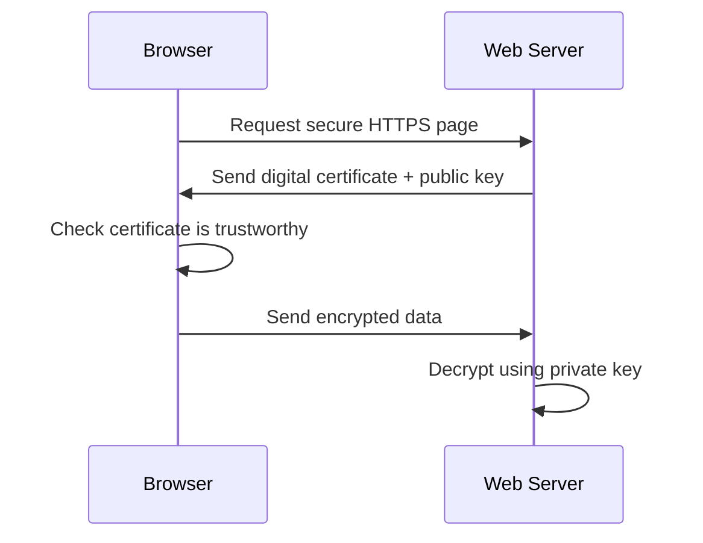
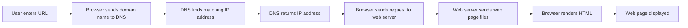
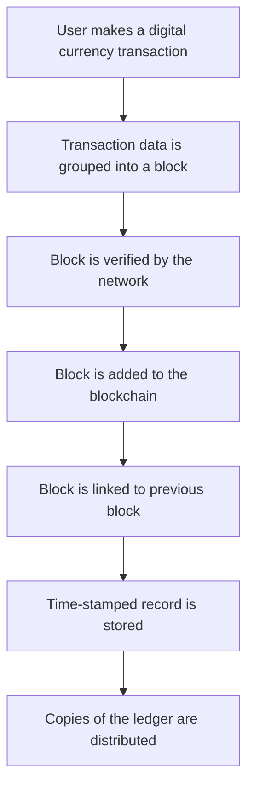
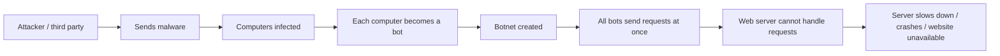

# IGCSE 0478 Chapter 5: The Internet and Its Uses

<div class="chapter-meta"><strong>IGCSE 0478 · Paper 1</strong><span>0478 · 2026–2028 · Version 5</span></div>

## Official Syllabus Checklist

Revise: internet and World Wide Web; URLs, browsers and cookies; digital currency; cyber-security threats and protection.

> The checklist paraphrases the syllabus for revision. Use the official syllabus as the final authority.

## Core Knowledge

Use the topic sections below to connect definitions, processes, comparisons and calculations.

<span id="_chapter-5-at-a-glance" class="legacy-anchor" aria-hidden="true"></span>

## Chapter at a Glance

Use this overview to retrieve web resources, explain digital transactions and defend systems.

### Trace a web request

<span lang="zh-CN">区分互联网基础设施和万维网服务。</span>

- Interpret a URL into protocol, domain and resource path.
- Explain DNS resolution, browser request and web-server response.
- Explain cookie storage and legitimate session/personalisation uses.

**Exam cue:** write the request sequence from typed URL to returned page.

### Secure web use

<span lang="zh-CN">把加密、身份验证和访问控制放在正确位置。</span>

- Explain how HTTPS/TLS protects data in transit.
- Use strong authentication and access controls for accounts.
- State the remaining human or endpoint risk after encryption.

**Exam cue:** never claim that one control prevents every attack.

### Explain digital currency

<span lang="zh-CN">说明电子交易记录如何建立信任。</span>

- Identify digital-currency characteristics and electronic transfer.
- Explain linked blocks, hashes and distributed copies.
- Evaluate benefits and risks in the stated payment context.

**Exam cue:** connect tamper evidence to changed hashes and shared validation.

### Match threats to controls

<span lang="zh-CN">先从行为识别威胁，再选择针对性防护。</span>

- Distinguish malware, phishing, pharming, social engineering and denial of service.
- Match prevention, detection and recovery controls to the attack route.
- Explain why layered controls address different failure points.

**Exam cue:** name the threat, describe its mechanism, then justify each control.

---

## 5.1 The Internet and the World Wide Web
### 5.1.1 Internet vs World Wide Web
**Internet**
A worldwide collection of interconnected networks.

**Key idea:** infrastructure / network of networks.

**World Wide Web**
A collection of websites and web pages accessed using the internet.

**Key idea:** one service that uses the internet.

#### Core Exam Sentences
+ The **internet** is the physical / network infrastructure.
+ The **World Wide Web** is a collection of websites and web pages.
+ The WWW is accessed using a **web browser**.
+ The WWW uses protocols such as **HTTP / HTTPS**.
+ Email, file transfer and video streaming also use the internet, but they are not the same as the WWW.

> **Common trap**：<span lang="zh-CN">不要写</span> “the internet is the websites”。<span lang="zh-CN">更准确</span>：**the WWW contains websites; the internet is the infrastructure used to access them.**
>

---

### 5.1.2 URL｜Uniform Resource Locator
A **URL** is a **text-based address for a web page**. It can contain:

| Part | Meaning | Example |
| --- | --- | --- |
| **Protocol** | Rules used to transfer data | `https://` |
| **Domain name** | Human-readable website address | `example.com` |
| **Path / area** | Folder or section in the website | `/shop/` |
| **Web page / file name** | Exact page or file requested | `index.html` |


```latex
https://www.example.com/shop/index.html
│       │               │    │
│       │               │    └── web page / file name
│       │               └────── path / area within website
│       └────────────────────── domain name
└────────────────────────────── protocol
```

#### Core Exam Sentences
+ A URL is a **text-based address** used to locate a web page.
+ The **domain name** identifies the website.
+ The **web page name / file name** identifies the specific page or file.
+ The **protocol** tells the browser which rules to use, for example HTTP or HTTPS.

---

### 5.1.3 HTTP vs HTTPS
| Feature | HTTP | HTTPS |
| --- | --- | --- |
| Full name | Hypertext Transfer Protocol | Hypertext Transfer Protocol Secure |
| Purpose | Transfers web page data | Transfers web page data securely |
| Security | Not encrypted by default | Uses **SSL/TLS** |
| Data protection | Data may be readable if intercepted | Data is encrypted, so intercepted data is meaningless |
| Typical clue | `http://` | `https://`, padlock / certificate |


#### HTTPS / SSL / TLS Answer Structure
> **Explain how HTTPS helps keep data secure.**
>

Use this structure:

1. HTTPS uses **SSL/TLS**.
2. Data is **encrypted** before it is transmitted.
3. If the data is intercepted, it cannot be understood without the key.
4. A **digital certificate** can be used to authenticate the web server.
5. The browser can use the server’s **public key** to encrypt data.
6. The server uses its **private key** to decrypt the data.


```mermaid
sequenceDiagram
    participant B as Browser
    participant S as Web Server
    B->>S: Request secure HTTPS page
    S->>B: Send digital certificate + public key
    B->>B: Check certificate is trustworthy
    B->>S: Send encrypted data
    S->>S: Decrypt using private key
```

> **Exam-safe sentence**：HTTPS uses SSL/TLS to encrypt data, so if the data is intercepted it cannot be understood.
>

---

### 5.1.4 Web Browser
A **web browser** is software used to **retrieve, render and display web pages**.

#### Main Purpose
> The main purpose of a web browser is to **render HTML** and **display web pages**.
>

#### Functions of a Web Browser
| Function | Mark scheme wording |
| --- | --- |
| Display web pages | renders HTML and displays web pages |
| Send requests | sends a request to the web server / IP address |
| DNS communication | sends URL to DNS / requests matching IP address |
| Navigation | allows back, forward, refresh, home page |
| Address bar | allows user to enter a URL |
| Bookmarks/favourites | stores saved websites |
| History | records pages visited |
| Tabs | allows multiple web pages to be open |
| Cookies | stores and manages cookies |
| Downloads | allows files to be downloaded from websites |
| Protocol management | manages HTTP/HTTPS |


> **Common trap**：Browser ≠ Search Engine.
A browser displays web pages. A search engine finds web pages based on keywords.
>

---

### 5.1.5 How a Web Page Is Located, Retrieved and Displayed
#### Golden Process Template
1. User enters a **URL** into the web browser.
2. The browser sends the URL / domain name to a **DNS**.
3. The DNS searches for the matching **IP address**.
4. The DNS returns the IP address to the browser.
5. The browser sends a request to the **web server** at that IP address.
6. The web server sends the web page files back to the browser.
7. The browser renders **HTML** and displays the web page.
8. If HTTPS is used, SSL/TLS certificates may be checked and the data is encrypted.


```mermaid
flowchart LR
A[User enters URL] --> B[Browser sends domain name to DNS]
B --> C[DNS finds matching IP address]
C --> D[DNS returns IP address]
D --> E[Browser sends request to web server]
E --> F[Web server sends web page files]
F --> G[Browser renders HTML]
G --> H[Web page displayed]
```

#### DNS Role in One Sentence
> A DNS stores domain names / URLs and their matching IP addresses, then returns the matching IP address to the web browser.
>

---

### 5.1.6 Cookies
A **cookie** is a small text file / piece of data that is sent by a web server and stored / managed by the web browser.

#### What Cookies Are Used For
| Use | Exam wording |
| --- | --- |
| Login details | stores a user’s login details |
| Payment details | stores payment details |
| Preferences | stores user preferences, such as language/theme |
| Shopping cart | stores items in an online shopping cart |
| Targeted advertising | stores pages visited / selected items for targeted adverts |
| Personal details | stores personal details such as address |


#### Session Cookies vs Persistent Cookies
| Feature | Session Cookie | Persistent Cookie |
| --- | --- | --- |
| Storage time | temporary | permanent until deleted / expires |
| Deleted when | browser is closed | user deletes it or it reaches expiry date |
| Storage location | temporary memory / RAM | secondary storage |
| Common use | shopping cart during one visit | remember login details / preferences |


#### Core Exam Sentences
+ Cookies are **stored and managed by the web browser**.
+ Session cookies are **temporary** and are deleted when the browser is closed.
+ Persistent cookies remain after the browser is closed and are deleted by the user or after they expire.

> **Common trap**：Cookies are not programs. They do not run operations by themselves. They store data.
>

---

## 5.2 Digital Currency and Blockchain
### 5.2.1 Digital Currency
A **digital currency** is a currency that **only exists electronically**.

#### Core Exam Sentences
+ It does not exist as physical coins or notes.
+ It is stored and transferred electronically.
+ It can be used for online payments or electronic transactions.

#### Digital Currency vs Cryptocurrency
| Digital Currency | Cryptocurrency |
| --- | --- |
| Exists electronically | Exists electronically |
| May be controlled by a central organisation / bank | Usually decentralised |
| Does not always use blockchain | Often uses blockchain |
| Transactions may not be public | Transactions can be recorded on a public ledger |


> **Keep it simple**：IGCSE <span lang="zh-CN">不需要深入解释</span> mining / proof-of-work / wallet seed phrase。<span lang="zh-CN">核心是</span> digital currency <span lang="zh-CN">和</span> blockchain ledger。
>

---

### 5.2.2 Blockchain
A **blockchain** is a digital ledger: a time-stamped series of records that cannot easily be altered.

#### Blockchain Transaction Process

```mermaid
flowchart TD
A[User makes a digital currency transaction] --> B[Transaction data is grouped into a block]
B --> C[Block is verified by the network]
C --> D[Block is added to the blockchain]
D --> E[Block is linked to previous block]
E --> F[Time-stamped record is stored]
F --> G[Copies of the ledger are distributed]
```

#### Core Exam Sentences
+ Blockchain acts as a **digital ledger**.
+ It records transactions in **blocks**.
+ Each record is **time-stamped**.
+ Blocks are linked to previous blocks.
+ Records cannot easily be altered once added.
+ The ledger can be distributed across many computers, making it difficult to change fraudulently.

---

## 5.3 Cyber Security
<span id="_531-threat-overview-mind-map" class="legacy-anchor" aria-hidden="true"></span>

### 5.3.1 Threats at a Glance

Use this overview to identify an attack, recognise evidence, choose protection and separate similar threats.

#### Identify the attack

<span lang="zh-CN">根据攻击过程判断威胁，不要只看造成的结果。</span>

- Brute force repeatedly guesses credentials, while hacking means gaining unauthorised access.
- DDoS uses many devices to send simultaneous requests that overwhelm a server.
- Malware includes viruses, worms, Trojan horses, spyware, adware and ransomware.

**Exam cue:** Describe how the attack works before stating its effect.

#### Recognise the evidence

<span lang="zh-CN">把题目中的线索对应到传输、用户行为或恶意软件。</span>

- Captured data during transmission indicates data interception.
- A legitimate-looking message and fake link indicate phishing.
- Redirection despite entering the correct address indicates pharming.

**Exam cue:** Quote the scenario evidence that distinguishes the threat.

#### Choose protection

<span lang="zh-CN">防护措施必须直接阻断题目描述的攻击过程。</span>

- Strong passwords and attempt limits reduce successful brute-force attacks.
- Encryption and secure protocols protect intercepted data from being understood.
- Firewalls, anti-malware tools and user training address different attack routes.

**Exam cue:** Name the control and explain exactly how it reduces the stated risk.

#### Avoid threat confusion

<span lang="zh-CN">比较相似概念时，写出触发方式和用户是否需要操作。</span>

- Phishing relies on a deceptive message; pharming redirects the user through malicious code or DNS changes.
- A virus needs an active host, while a worm can replicate across a network independently.
- Social engineering manipulates people rather than directly exploiting software.

**Exam cue:** State one precise difference instead of giving two unrelated definitions.

---

### 5.3.2 Threats：Process + Aim + Effects
| Threat | Process / How it works | Aim / Effect | High-value keywords |
| --- | --- | --- | --- |
| **Brute-force attack** | Tries many password combinations systematically | Finds password / gains access | repeated guesses, combinations, password, lockout |
| **Data interception** | Data is captured while being transmitted over a wired/wireless link | Steals confidential data | intercepted, transmission, encryption |
| **DDoS attack** | Many devices send requests to a server at the same time | Server slows, fails, times out, website unavailable | botnet, many requests, web server cannot handle |
| **Hacking** | Gains unauthorised access to a system | Data can be stolen, changed, deleted or corrupted | unauthorised access |
| **Virus** | Malware that replicates when run with an active host | Deletes/corrupts files, slows system, uses storage | replicates, active host |
| **Worm** | Malware that replicates over a network without user action | Uses bandwidth/storage, slows network | replicates, network, no active host |
| **Trojan horse** | Malware disguised as legitimate software | Installs malware when user downloads/runs it | disguised, authentic-looking |
| **Spyware / keylogger** | Monitors user activity or key presses | Sends personal data/passwords to attacker | key presses, monitoring, sends data |
| **Adware** | Displays unwanted adverts or redirects browser | Slows device / fake sites / pop-ups | unwanted adverts, redirects |
| **Ransomware** | Encrypts user data and demands payment | User cannot access files unless ransom is paid | encrypts data, payment, decryption key |
| **Pharming** | Malicious code redirects user to a fake website | Steals personal/bank data | redirect, fake website, malicious code |
| **Phishing** | Fake email/message contains link to fake website | User enters personal data | legitimate-looking email, link, fake website |
| **Social engineering** | Manipulates/deceives people | Obtains confidential/personal/valuable data | deceive, manipulate, confidential data |


---

### 5.3.3 DDoS / Botnet Diagram Template
> **Describe / draw how a DDoS attack is carried out.**
>


```mermaid
flowchart LR
A[Attacker / third party] --> B[Sends malware]
B --> C[Computers infected]
C --> D[Each computer becomes a bot]
D --> E[Botnet created]
E --> F[All bots send requests at once]
F --> G[Web server cannot handle requests]
G --> H[Server slows down / crashes / website unavailable]
```

#### Core Exam Sentences
+ A third party sends malware to many computers.
+ The malware turns the computers into **bots**.
+ The bots form a **botnet**.
+ The attacker instructs the botnet to send requests to a web server at the same time.
+ The web server cannot respond to all requests and crashes / times out.

---

### 5.3.4 Phishing vs Pharming
| Feature | Phishing | Pharming |
| --- | --- | --- |
| Main method | Fake email / message | Malicious code / DNS redirection |
| User action | User clicks link / opens attachment | User may type correct URL but is redirected |
| Destination | Fake website | Fake website |
| Aim | Steal personal data | Steal personal data |
| Common exam phrase | legitimate-looking email, fake link | redirects user without consent |


#### Similarities
+ Both are designed to steal personal data.
+ Both can use fake websites.
+ Both may pretend to be a real company or trusted organisation.

---

### 5.3.5 Social Engineering
#### Definition
> Social engineering involves **manipulating or deceiving people** with the aim of obtaining **confidential / personal / valuable data**.
>

#### Common examples
| Example | How it works |
| --- | --- |
| Phishing | fake email/message tricks user into entering details |
| Baiting | user is tempted to open a malicious file or use infected media |
| Shoulder surfing | attacker watches user enter a password/PIN |
| Scam phone call | attacker pretends to be official support/bank/staff |
| Scareware | pop-up claims device is infected and tricks user into installing fake software |


> **Exam-safe sentence**：The attacker deceives the user into revealing confidential data, such as a password or bank details.
>

---

### 5.3.6 Keeping Data Safe｜Security Solutions
#### Solution Overview
| Solution | What it does | Good exam expansion |
| --- | --- | --- |
| **Access levels** | Controls which users can access specific data | Users only access data needed for their role |
| **Strong password** | Makes password difficult to guess | Use letters, numbers and symbols |
| **Limit login attempts** | Stops repeated password guesses | Helps prevent brute-force attacks |
| **Biometrics** | Uses unique physical data | Difficult to fake / replicate |
| **Two-step verification / 2FA** | Requires a second method of authentication | Hacker also needs user’s registered device/account |
| **Anti-virus** | Detects/removes viruses | scans files, compares with known virus database, quarantines threats |
| **Anti-spyware** | Detects/removes spyware | prevents spyware collecting passwords/key presses |
| **Automatic updates** | Installs security patches | fixes known vulnerabilities |
| **Check spelling/tone** | Helps identify scam emails | suspicious tone/spelling may indicate phishing |
| **Check URL links** | Confirms domain is correct | avoids fake websites / pharming/phishing |
| **Firewall** | Filters incoming/outgoing traffic | blocks traffic that does not meet criteria |
| **Proxy server** | Sits between user and web server | caches pages, hides IP, filters requests, helps reduce DDoS impact |
| **Privacy settings** | Controls who can see personal data | limits public access to personal profile/data |
| **SSL/TLS** | Encrypts transmitted data | intercepted data cannot be understood |


---

### 5.3.7 Authentication
Authentication means proving that a user is who they claim to be.

| Type | Example | Strength |
| --- | --- | --- |
| Something you know | password / PIN | easy to use but can be guessed/stolen |
| Something you have | phone / token / email account | useful for two-step verification |
| Something you are | fingerprint / face / voice / retina | unique to the person, difficult to fake |


#### Password Exam Points
A strong password should:

+ contain uppercase and lowercase letters
+ contain numbers
+ contain symbols
+ be difficult to guess
+ be changed when compromised

#### Two-step Verification Template
+ The user first enters a username and password.
+ A code / extra data is sent to the user’s registered device/account.
+ The user must enter this code into the system.
+ A hacker would need both the password and the registered device/account.

#### Biometric Template
+ A biometric device captures a physical feature, such as a fingerprint or face.
+ The captured data is compared with stored biometric data.
+ If the data matches, access is allowed.
+ If it does not match, access is denied.
+ Biometric data is difficult to fake because it is unique to the user.

---

### 5.3.8 Anti-malware
#### Anti-virus
| Function | Mark scheme wording |
| --- | --- |
| Scans files/system | scans the computer system for viruses |
| Known virus database | compares files with known virus signatures |
| Quarantine/remove | removes or quarantines infected files |
| Checks downloads | checks data before it is downloaded |
| Needs updates | must be kept up to date to detect new threats |


#### Anti-spyware
| Function | Mark scheme wording |
| --- | --- |
| Detects spyware | scans the system for spyware |
| Removes/quarantines | removes or quarantines spyware found |
| Prevents downloads | can prevent spyware being downloaded |
| Protects passwords | stops keyloggers collecting key presses/passwords |


---

### 5.3.9 Firewall vs Proxy Server
#### Firewall
A **firewall** is hardware and/or software that monitors traffic entering and leaving a system or network.

##### Firewall Core Sentences
+ It examines incoming and outgoing traffic.
+ It checks traffic against a set of rules / criteria.
+ It can use a blacklist or whitelist.
+ It blocks traffic that does not meet the criteria.
+ It can warn the user / network manager.
+ It can block specific IP addresses, ports or applications.

#### Proxy Server
A **proxy server** sits between the user/client and the web server.

##### Proxy Server Core Sentences
+ It examines each request / incoming transmission.
+ It can limit the number/rate of requests sent to a server.
+ It can stop requests from certain IP addresses.
+ It can use **caching** to respond to requests instead of forwarding them to the web server.
+ It can hide the user’s public IP address.
+ It can reduce the impact of a DDoS attack because requests hit the proxy server instead of the web server.

#### Firewall vs Proxy Server Comparison
| Point | Firewall | Proxy Server |
| --- | --- | --- |
| Main role | filters traffic based on rules | acts as an intermediary between client and server |
| Protects | computer/network | often protects web server / hides client IP |
| Blocking | blocks unauthorised traffic/IP/ports | can block certain requests or IP addresses |
| Caching | not a core function | can cache web pages/data |
| DDoS defence | can restrict traffic | can absorb/filter/limit requests before web server |


> **Common trap**：Proxy server <span lang="zh-CN">可以像</span> firewall <span lang="zh-CN">一样过滤</span> traffic，<span lang="zh-CN">但不要只写</span> “it protects the website”。<span lang="zh-CN">要写</span> **examines requests, filters invalid traffic, caches data, hides IP, limits requests**。
>

---

### 5.3.10 Checking Emails and URLs
#### Before clicking a link / opening an attachment, check:
| Check | Why it matters |
| --- | --- |
| Sender email address | fake addresses may imitate real companies |
| Spelling mistakes | phishing emails often contain spelling errors |
| Tone of message | urgent/threatening tone may be social engineering |
| Domain name in URL | fake domains may look similar to real ones |
| Suspicious attachments | may contain malware / spyware |
| HTTPS / padlock | indicates secure connection, but does not guarantee the website is legitimate |


> **Important**：A padlock only means the connection is encrypted. It does not automatically prove the business is honest.
>

---

## Topic-Specific Common Confusions
| Topic | Weak answer | Why it loses marks | Better answer |
| --- | --- | --- | --- |
| Internet vs WWW | “They are the same.” | <span lang="zh-CN">完全错误</span> | The internet is the infrastructure; the WWW is a collection of web pages accessed using the internet. |
| Browser | “It searches websites.” | <span lang="zh-CN">混淆</span> browser <span lang="zh-CN">和</span> search engine | A web browser renders HTML and displays web pages. |
| DNS | “DNS finds the website.” | <span lang="zh-CN">太泛</span> | DNS stores domain names and matching IP addresses, then returns the IP address to the browser. |
| HTTPS | “It is secure.” | <span lang="zh-CN">太泛</span>，<span lang="zh-CN">没有得分关键词</span> | HTTPS uses SSL/TLS to encrypt data so intercepted data cannot be understood. |
| SSL certificate | “It makes website safe.” | <span lang="zh-CN">不具体</span> | A digital certificate authenticates the web server and contains the server’s public key. |
| Cookies | “Cookies are viruses.” | <span lang="zh-CN">错误</span> | Cookies are small text files stored/managed by the browser to store login details, preferences or shopping cart items. |
| Session cookie | “Temporary cookie.” | <span lang="zh-CN">可以得</span> 1 <span lang="zh-CN">分但不完整</span> | Session cookies are deleted when the browser is closed and are stored temporarily / in RAM. |
| Persistent cookie | “Permanent cookie.” | <span lang="zh-CN">不完整</span> | Persistent cookies remain after the browser is closed and are deleted by the user or when they expire. |
| DDoS | “Many requests attack server.” | <span lang="zh-CN">少了</span> botnet <span lang="zh-CN">过程</span> | Malware turns computers into bots; a botnet sends many requests at once, so the server cannot respond and crashes. |
| Firewall | “Protects computer.” | <span lang="zh-CN">太泛</span> | It monitors incoming/outgoing traffic and blocks traffic that does not meet rules/criteria. |
| Proxy server | “Same as firewall.” | <span lang="zh-CN">混淆概念</span> | A proxy sits between user and web server, examines requests, can cache responses, hide IP, and block/limit requests. |
| Brute-force | “Hacker guesses password.” | <span lang="zh-CN">不够系统</span> | The attacker systematically tries many combinations until the password is found. |
| Phishing | “Fake website.” | <span lang="zh-CN">少了</span> email/link <span lang="zh-CN">过程</span> | A legitimate-looking email contains a link to a fake website where the user enters personal details. |
| Pharming | “Fake email.” | <span lang="zh-CN">和</span> phishing <span lang="zh-CN">混了</span> | Malicious code redirects the user to a fake website, even if the user did not click a fake email link. |
| Social engineering | “Hacking people.” | <span lang="zh-CN">太口语</span> | It manipulates/deceives people to obtain confidential or personal data. |
| 2FA | “More secure.” | <span lang="zh-CN">太泛</span> | A code is sent to the user’s registered device, so the hacker needs both password and device/account. |
| Biometrics | “Uses fingerprint.” | <span lang="zh-CN">缺少</span> why secure | Biometric data is unique to the user and difficult to fake or replicate. |
| Anti-spyware | “Stops viruses.” | <span lang="zh-CN">工具对象错</span> | Anti-spyware detects/removes spyware and prevents keyloggers collecting passwords. |
| Blockchain | “Bitcoin system.” | <span lang="zh-CN">太窄</span> | Blockchain is a digital ledger of time-stamped records that cannot easily be altered. |


---

## Command Word Strategy
| Command word | What to do | Example answer style |
| --- | --- | --- |
| **State / Give / Identify** | <span lang="zh-CN">短答案</span>，<span lang="zh-CN">给名称即可</span> | `Proxy server`, `persistent cookie`, `DNS` |
| **Describe** | <span lang="zh-CN">写</span> “what happens” <span lang="zh-CN">的步骤</span> | The browser sends the URL to DNS; DNS returns the IP address. |
| **Explain** | <span lang="zh-CN">写原因</span> / <span lang="zh-CN">机制</span> / <span lang="zh-CN">结果</span> | HTTPS encrypts data, so intercepted data cannot be understood. |
| **Compare** | <span lang="zh-CN">两边都要写</span> | Session cookies are deleted when the browser closes, whereas persistent cookies remain until deleted/expired. |
| **Suggest** | <span lang="zh-CN">结合场景给合理措施</span> | Use two-step verification because the attacker would also need the registered device. |


---

## Mark Scheme Style Templates
### Template A｜Webpage retrieval
> When a user enters a URL, the browser sends the domain name to a DNS. The DNS searches for the matching IP address and returns it to the browser. The browser sends a request to the web server at that IP address. The web server sends the web page files back. The browser renders the HTML and displays the web page.
>

### Template B｜HTTPS / SSL/TLS
> HTTPS uses SSL/TLS to encrypt data before transmission. If the data is intercepted, it cannot be understood. A digital certificate can authenticate the web server. The browser can use the web server’s public key to encrypt data, and the web server uses its private key to decrypt it.
>

### Template C｜DDoS attack
> The attacker sends malware to many computers. These computers become bots and form a botnet. The attacker instructs the botnet to send many requests to a web server at the same time. The server cannot respond to all the requests and may slow down, time out or crash.
>

### Template D｜Firewall
> A firewall monitors incoming and outgoing traffic. It checks the traffic against rules or criteria. Traffic that does not meet the criteria can be blocked, and the user or network manager may be warned.
>

### Template E｜Proxy server
> A proxy server sits between the user and the web server. It examines requests and can block requests from certain IP addresses. It can use caching to respond to requests without forwarding them to the web server. It can also hide the user’s public IP address and reduce the impact of DDoS attacks.
>

### Template F｜Phishing
> A legitimate-looking email or message is sent to the user. It contains a link to a fake website. The user clicks the link and enters personal details. These details are sent to the attacker.
>

### Template G｜Two-step verification
> The user enters a username and password. A code is sent to the user’s registered device or account. The user must enter this code into the system. This makes unauthorised access harder because the hacker also needs the registered device/account.
>

---

## Required Ideas and Exam Language

Use technical terms as part of a complete statement: identify the component or method, state what it does, then link its effect to the question context. A keyword without a correct relationship is not a complete marking point.

## Common Confusions

- Do not substitute a related term for the process named in the question.
- Do not list advantages or definitions without linking them to the stated context.

## Worked Examples

The worked calculations, process templates and scenario answers above model the chain of reasoning expected in examination responses. Rework each example before reading its answer.

## 10-Mark Quick Check

**Total: 10 marks**
### Questions
1. State one difference between the internet and the World Wide Web. `[1]`
2. Identify two parts of a URL. `[2]`
3. Give one function of a web browser. `[1]`
4. State what DNS returns to the web browser. `[1]`
5. Give one use of cookies. `[1]`
6. State one difference between session cookies and persistent cookies. `[1]`
7. State what is meant by social engineering. `[2]`
8. Give one benefit of a proxy server. `[1]`

## Quick Check Answers
1. Internet is the infrastructure; WWW is a collection of web pages accessed using the internet.
2. Protocol / domain name / path / web page name / file name.
3. Renders HTML / displays web pages / stores bookmarks / records history / manages cookies / provides address bar.
4. The matching IP address.
5. Stores login details / preferences / payment details / shopping cart / targeted advertising.
6. Session cookies are deleted when the browser is closed; persistent cookies remain until deleted or expired.
7. Manipulating/deceiving people to obtain confidential/personal/valuable data.
8. Caching / hiding IP address / blocking requests / limiting requests / protecting web server from DDoS.

---

## 20-Mark Exam Practice

**Total: 20 marks**
### Question 1｜Webpage retrieval `[5]`
A user enters a URL into a web browser to visit a website.

Describe how the web page is located, retrieved and displayed on the user’s device.

#### Mark Scheme
Any five from:

+ Browser sends URL/domain name to DNS.
+ DNS searches for matching IP address.
+ DNS returns IP address to browser.
+ Browser sends request to web server at the IP address.
+ Web server sends web page files / HTML back to browser.
+ Browser renders HTML.
+ Web page is displayed.
+ If HTTPS is used, SSL/TLS certificate may be checked / data is encrypted.

---

### Question 2｜Cookies `[4]`
A shopping website uses both session cookies and persistent cookies.

Explain how these two types of cookies may be used.

#### Mark Scheme
Any four from:

+ Session cookies can store items in a shopping cart during one visit.
+ Session cookies are temporary.
+ Session cookies are deleted when the browser is closed.
+ Persistent cookies can store login details / preferences / payment details.
+ Persistent cookies remain after the browser is closed.
+ Persistent cookies are deleted by the user or when they expire.

---

### Question 3｜Cyber security solutions `[6]`
A school wants to protect student records from unauthorised access.

Suggest three security solutions and explain how each one helps protect the records.

#### Mark Scheme
One mark for solution + one mark for matching explanation, up to 6:

+ Strong password: uses letters/numbers/symbols, making it difficult to guess.
+ Limit login attempts: stops repeated guesses / brute-force attacks.
+ Two-step verification: hacker also needs the user’s registered device/account.
+ Biometrics: requires unique physical data that is difficult to fake.
+ Firewall: monitors traffic and blocks traffic that does not meet criteria.
+ Access levels: users can only access data needed for their role.
+ Anti-spyware: removes spyware so passwords/key presses cannot be collected.
+ Automatic updates: installs patches to fix known vulnerabilities.

---

### Question 4｜DDoS attack `[5]`
Describe how a DDoS attack can cause a web server to fail.

#### Mark Scheme
Any five from:

+ Attacker sends malware to many computers.
+ Infected computers become bots.
+ Bots form a botnet.
+ Attacker instructs botnet to send requests to the web server.
+ Requests are sent at the same time.
+ Web server cannot respond to all requests.
+ Server slows down / times out / crashes.
+ Users cannot access the website.

---

## Final Revision Checklist

- [ ] I can trace URL, DNS, browser and web-server interaction.
- [ ] I can explain cookies, HTTPS and account controls without overclaiming.
- [ ] I can explain digital currency and blockchain transaction records.
- [ ] I can identify threats from behaviour and justify layered controls.
- [ ] I can complete and self-mark both chapter practices.
