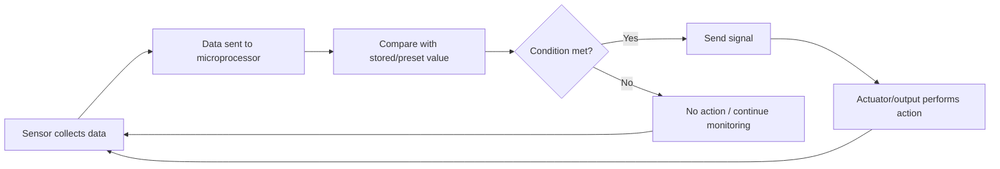
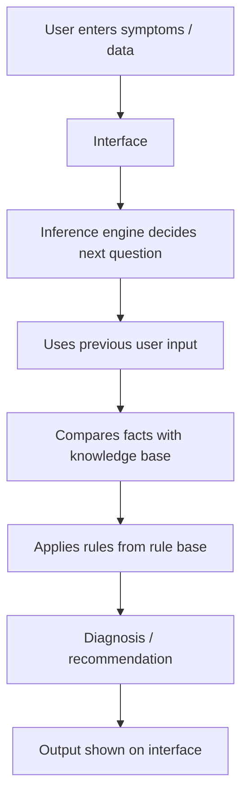
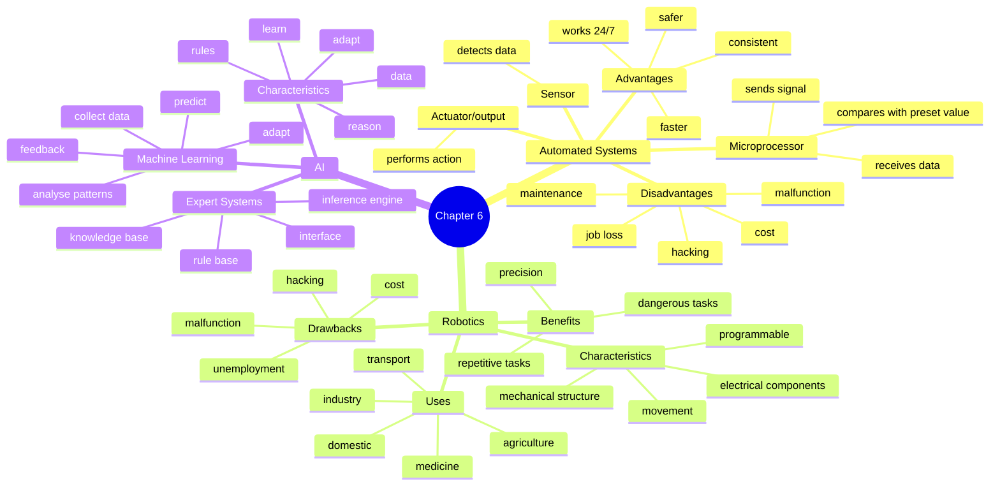

# IGCSE 0478 Chapter 6 Updated Checklist
## Automated Systems and Emerging Technologies｜2025 Past Paper Focus Edition
> **适用范围**：Cambridge IGCSE Computer Science 0478  
**更新依据**：2026–2028 syllabus + 2025 Paper 1 mark scheme trend  
**目标**：删掉低频/过时内容，保留最容易出现在 `State / Describe / Explain / Suggest` 题里的得分点。  
**建议使用方式**：先背“核心模板”，再用“场景迁移表”练习把知识点套进不同题干。
>

---

## 0. 2025 更新结论：这一章现在怎么考？
| 考点 | 2025 出题趋势 | 学生最容易丢分的地方 | 更新处理 |
| --- | --- | --- | --- |
| **Automated systems** | 不再只问定义，常放进具体场景：ATM 欢迎屏、天气报警系统、农业/工厂系统 | 只写“sensor collects data”，没有写 **microprocessor compares with stored/preset value** | 增加“传感器 → 微处理器 → 比较 → 输出/执行器”的固定模板 |
| **Robotics** | 重点转向“是否是 robot”“robot 的特征”“场景优缺点” | 把所有智能设备都说成 robot；忽略 **mechanical structure / actuator / movement** | 删除过多 independent/dependent 分类，突出 robot 判断标准 |
| **AI** | 高频问 AI characteristics、expert system、machine learning 场景应用 | 把 AI 写成“very smart computer”，没有 data/rules/reason/adapt | 改成 mark scheme 语言：**data + rules + reasoning + learning/adapting** |
| **Expert system** | 常考填空/描述运行流程，尤其 doctor diagnosis | 组件混淆：knowledge base / rule base / inference engine / interface | 用流程图和组件表重建 |
| **Machine learning** | 高频放进 smart speaker、game enemy、weather prediction、delivery robot | 只写“it learns”，没有写从什么数据学、怎样改变结果 | 增加“collect → analyse pattern → feedback → adapt → predict”的万能句式 |

---

## 1. 内容取舍：哪些内容要删？哪些保留？
### ✅ 必须保留并重点训练
| 内容 | 原因 |
| --- | --- |
| sensors, microprocessors and actuators collaboration | syllabus 明确要求；2025 直接考过多次 |
| advantages / disadvantages in a given scenario | 每年常见，必须和题干对象绑定 |
| characteristics of a robot | 2025 直接考“为什么是/不是 robot” |
| robot use in industry, medicine, agriculture, transport, domestic settings | syllabus 场景范围，容易出 explain/suggest |
| AI characteristics | 2025 高频 |
| expert system components and operation | 2025 继续考诊断类 expert system |
| machine learning meaning and improvement | 2025 高频场景题 |

### ⚠️ 降权或删除
| 原内容 | 处理方式 | 原因 |
| --- | --- | --- |
| Narrow AI / General AI / Strong AI 三分类 | **删除主表，只可作为拓展** | 新 syllabus 明确把 AI 限定在 expert systems 和 machine learning，三分类不是核心得分点 |
| Independent robots / dependent robots 分类 | **降权** | 可以帮助理解 autonomous/dependent，但不是新卷的主要答题关键词 |
| 大段 autonomous vehicles 优缺点 | **改成场景模板** | 新题更喜欢 specific scenario，如 surgery robot / delivery robot / weather system |
| Expert system advantages/disadvantages 长表 | **缩短** | 2025 更重视 operation/components，不再建议学生死背长表 |
| Deep learning / neural networks | **不作为 IGCSE 必背** | 超出核心考纲。题目接受 supervised/unsupervised 作为 machine learning 例子，但不要求解释细节 |

---

# 6.1 Automated Systems
## 6.1.1 Core Definition
An **automated system** is a system that can perform actions **without human intervention**, usually by using:

**1. Sensor**  
Collects data from the environment. 

**2. Microprocessor**  
Processes sensor data and makes decisions. 

**3. Actuator / Output**  
Carries out the action or gives an alert. 

---

## 6.1.2 The Golden Answer Template
> **Describe how sensors, microprocessors and actuators are used in an automated system.**
>

Use this structure almost every time:

1. The **sensor** detects / measures data from the environment.  
2. The sensor data is sent to the **microprocessor**.  
3. The microprocessor compares the data with a **stored value / preset value / acceptable range**.  
4. If the condition is met, the microprocessor sends a **signal**.  
5. The signal triggers an **actuator** or output device.  
6. The process repeats continuously.

---

## 6.1.3 Mark Scheme Style Sentences
### Example A: Automatic weather alert system
> **Describe how the system uses a sensor and microprocessor to trigger an alert.**
>

High-scoring answer:

+ A sensor, such as a **temperature / humidity / light / level sensor**, collects environmental data.
+ The data is sent to the **microprocessor**.
+ The microprocessor compares the data with a **preset value**, for example 40.
+ If the value is greater than 40, the microprocessor sends a signal to **trigger the alert**.

### Example B: Automatic welcome message on an ATM
+ An **infra-red / proximity sensor** detects that a person is nearby.
+ The sensor sends data continuously to the microprocessor.
+ The microprocessor calculates / checks the distance.
+ If the person is within the preset distance, the microprocessor sends a signal to display a welcome message.

---

## 6.1.4 Advantages and Disadvantages of Automated Systems
### General Advantages
| Advantage | Mark scheme expansion |
| --- | --- |
| Faster response | The system can react more quickly than a human. |
| Works continuously | It can work 24/7 without breaks. |
| Safer for humans | Humans do not need to enter dangerous environments. |
| More consistent | It performs repetitive tasks in the same way each time. |
| More accurate | It reduces human error in measurement or control. |
| Long-term cost saving | Fewer workers may be needed after setup. |

### General Disadvantages
| Disadvantage | Mark scheme expansion |
| --- | --- |
| Expensive setup | Sensors, microprocessors, actuators and software cost money. |
| Maintenance cost | The system needs checking, repairs and updates. |
| Job loss / deskilling | Human workers may be replaced or lose practical skills. |
| Cybersecurity risk | The system could be hacked or controlled maliciously. |
| Malfunction risk | Hardware or software errors may cause wrong actions. |
| Unexpected cases | The system may fail when a situation was not considered during design. |

---

## 6.1.5 Scenario Transfer Table
| Scenario | Possible sensor | Action / actuator | Strong answer idea |
| --- | --- | --- | --- |
| **Agriculture irrigation** | moisture sensor | valve / water pump | If soil moisture is below preset value, pump turns on. |
| **Weather alert** | temperature / humidity / light / level sensor | alarm / screen alert | If reading passes threshold, alert is triggered. |
| **Lighting system** | light sensor / infra-red sensor | lamp switched on/off | If light level is low or movement detected, lights switch on. |
| **Factory production** | pressure / temperature / proximity sensor | robotic arm / motor | If object is detected, actuator moves the part. |
| **Transport** | proximity / speed sensor | brake / steering actuator | If obstacle detected, system sends signal to slow or stop. |
| **Gaming** | controller / motion sensor | in-game output | Sensor input changes game actions automatically. |
| **Science lab** | pH / temperature sensor | heater / warning output | If value outside safe range, system adjusts equipment or warns user. |

---

# 6.2 Robotics
## 6.2.1 Definition
**Robotics** is a branch of computer science that includes the **design, construction and operation of robots**.

---

## 6.2.2 What Makes Something a Robot?
A robot should usually have several of these features:

| Robot characteristic | How to write it in exam |
| --- | --- |
| Mechanical structure / framework | It has a physical body or structure. |
| Electrical components | It contains sensors, microprocessors and/or actuators. |
| Programmable | It can be programmed to perform tasks. |
| Ability to move | It can move itself or move part of itself. |
| Can sense surroundings | It uses sensors to detect data from the environment. |

> **Important exam trap**  
A device can be “smart” but still **not** be a robot if it has no mechanical structure, no actuator and cannot move itself.  
Example: a smart speaker can use AI, but it is normally not a robot.
>

---

## 6.2.3 Common Robot Roles
| Area | Example | What the robot does |
| --- | --- | --- |
| Industry | factory robot arm | lifts, welds, assembles or moves parts |
| Transport | autonomous vehicle / delivery robot | navigates routes and avoids obstacles |
| Agriculture | self-driving tractor | ploughs, plants seeds, avoids obstacles |
| Medicine | remote surgery robot | allows precise surgery using robotic tools |
| Domestic settings | robot vacuum cleaner | cleans floors automatically |
| Entertainment | game / toy robot | moves or interacts with users |

---

## 6.2.4 Robot Advantages by Scenario
### Industry / Factory
| Benefit | Expansion |
| --- | --- |
| Safer for workers | Workers do not need to lift heavy machinery or work in dangerous areas. |
| More consistent | Robots can repeat the same action accurately. |
| Works continuously | Robots can work overnight or 24/7. |
| Maintenance jobs created | Some workers may be trained to repair and maintain the robots. |

### Remote Surgery Robot
| Benefit | Expansion |
| --- | --- |
| Specialist can operate remotely | A doctor does not need to travel to the hospital. |
| Shorter waiting time | Surgery can happen sooner without waiting for travel. |
| Higher precision | Robotic tools can make smaller and more accurate movements. |
| Smaller incision | Smaller tools can enter the body, which may reduce recovery time. |
| Safer / more hygienic | The doctor may not need to be near an infectious patient. |

### Delivery Robot for Elderly Customers
| Benefit | Expansion |
| --- | --- |
| Supermarket gains more customers | Elderly people who cannot visit the store can still shop. |
| More efficient delivery | Multiple orders can be delivered without one worker for each customer. |
| Supports independence | Customers can receive goods without travelling. |

---

## 6.2.5 Robot Disadvantages by Scenario
| Drawback | Expansion |
| --- | --- |
| Expensive to buy and maintain | The cost may be too high for smaller organisations. |
| Hardware may malfunction | The robot may stop working or perform a wrong action. |
| Internet connection may fail | Remote robots may stop receiving commands. |
| Hacking risk | A malicious user could control or disrupt the robot. |
| Data corruption | Transmitted instructions could be changed or lost. |
| Job replacement | Human workers may lose jobs or become deskilled. |
| Difficult non-standard tasks | Robots may struggle with unusual situations. |

---

## 6.2.6 Exam Templates for Robotics
### Q1. Give one reason why a self-driving tractor is a robot.
Good answers:

+ It has **electrical components**, such as sensors and actuators.
+ It is **programmable**.
+ It can **move**.
+ It can sense its surroundings.

### Q2. Explain why a smart speaker may not be a robot.
Good answer:

+ It does not have a **mechanical structure**.
+ It does not have **actuators**.
+ It cannot **move itself**.

### Q3. Explain one benefit of using robots in a factory.
Good answer:

+ Workers do not need to lift heavy machinery, so they are less likely to injure themselves.
+ Robots can perform repetitive tasks, so workers can focus on higher-skilled jobs.

---

# 6.3 Artificial Intelligence
## 6.3.1 Definition
**Artificial intelligence (AI)** is the simulation of intelligent behaviour by computers.

In IGCSE 0478, AI is mainly limited to:

**Expert systems**  
Use expert knowledge, rules and inference to suggest decisions. 

**Machine learning**  
Allows a program to automatically adapt its own processes and/or data. 

---

## 6.3.2 Main Characteristics of AI
A strong answer should include any of these:

| Characteristic | Exam wording |
| --- | --- |
| Collection of data | AI uses stored data. |
| Rules for using data | AI uses rules to process and apply the data. |
| Ability to reason | AI can make decisions based on data and rules. |
| Ability to learn | AI can improve from feedback or previous examples. |
| Ability to adapt | AI can change its own processes or data. |
| Analyse patterns | AI can identify patterns and make predictions. |

### 3-mark AI definition template
> AI is the simulation of intelligent behaviour by computers.  
It uses a collection of data and rules for using that data.  
It can reason or make decisions, and may learn/adapt from previous results.
>

---

# 6.3.3 Expert Systems
## Core idea
An **expert system** is a form of AI that mimics the knowledge and decision-making of a human expert in a specific area.

Common scenarios:

+ medical diagnosis
+ car fault diagnosis
+ plant disease diagnosis
+ financial advice
+ technical support

---

## Expert System Components
| Component | Role |
| --- | --- |
| **User interface / interface** | Allows the user to enter data and receive output. |
| **Knowledge base** | Stores expert facts and knowledge about the topic. |
| **Rule base** | Stores rules / logic that link facts to conclusions. |
| **Inference engine** | Applies the rule base to the knowledge base and user input to reach a conclusion. |

> **Do not overfocus on “explanation system”**  
It may appear in textbooks, but the core IGCSE syllabus components are:  
**interface, knowledge base, rule base, inference engine**.
>

---

## Expert System Operation Flow

### Mark Scheme Style Answer: Doctor diagnosis
> The doctor enters data about the patient’s symptoms into the **interface**.  
The **inference engine** decides which questions to ask based on the previous answers.  
It compares the symptoms with facts in the **knowledge base**.  
It applies the **rule base** to decide a diagnosis.  
The diagnosis is output through the **interface**.
>

---

# 6.3.4 Machine Learning
## Definition
**Machine learning** is when a program can automatically adapt its own processes and/or data.

A simple exam-friendly explanation:

> The system learns from previous data or feedback, identifies patterns, and changes its rules, data or processes to improve future decisions.
>

---

## Machine Learning Universal Flow

---

## Machine Learning Answer Bank
### 1. Weather prediction AI
Use these points:

+ It collects weather data over time.
+ It analyses the data for **patterns / trends**.
+ It predicts future weather based on these patterns.
+ Feedback is given on whether the prediction was correct.
+ It changes future predictions based on this feedback.
+ It can learn what weather occurs at certain times of year.

### 2. Game enemy / gaming AI
Use these points:

+ It collects data about the player’s actions.
+ It analyses patterns in the player’s movements.
+ It learns how the player moves.
+ It predicts the player’s next movement.
+ It adapts its own movements / processes to match the player.
+ It stores successful and unsuccessful moves.
+ It learns the most efficient / optimal movement against the player.

### 3. Smart speaker voice recognition
Use these points:

+ It gathers data from many different voices.
+ It analyses patterns in a user’s voice.
+ It learns different pronunciations or accents.
+ It stores successful and unsuccessful voice commands.
+ It learns different ways of making the same request.
+ It learns to ignore background noise.

### 4. Delivery robot / farming robot
Use these points:

+ It collects route / field / obstacle data.
+ It identifies patterns in the route or field.
+ It remembers successful routes.
+ It remembers obstacles to avoid.
+ It adapts its route to become more efficient.
+ It makes fewer mistakes in future.

---

## 6.3.5 Expert System vs Machine Learning
| Feature | Expert system | Machine learning |
| --- | --- | --- |
| Main basis | Human expert knowledge | Data and training examples |
| Uses rules? | Yes, rule base is central | May create/adapt rules from data |
| Learns automatically? | Usually no, unless ML is added | Yes |
| Best for | Clear decision problems with expert rules | Pattern recognition and prediction |
| Example | Medical diagnosis expert system | Weather prediction AI / smart speaker voice recognition |

---

# 7. High-Frequency Exam Command Words
| Command word | What students should do | Example |
| --- | --- | --- |
| **State / Give / Identify** | One short point only | “Microprocessor.” |
| **Describe** | Give features or steps | “The sensor sends data to the microprocessor.” |
| **Explain** | Point + reason / effect | “The robot can work 24/7, so production can continue overnight.” |
| **Suggest** | Apply knowledge to the given scenario | “A humidity sensor could be used because it measures water vapour in the air.” |
| **Compare** | Similarity/difference on both sides | “Expert systems use fixed rules, whereas machine learning can adapt its own processes.” |

---

# 8. 2025-Style Mini Question Bank
## Q1. Automated weather alert system [3]
A weather station sends an alert when a sensor value is greater than 40.  
Describe how the sensor and microprocessor are used.

Answer

 - A sensor collects environmental data. - The sensor sends the data to the microprocessor. - The microprocessor compares the data with the preset value of 40. - If the data is greater than 40, the microprocessor sends a signal to trigger the alert. 

---

## Q2. Robot judgement [3]
Explain why a smart speaker is not normally considered a robot.

Answer

 - It does not have a mechanical structure. - It does not have actuators. - It cannot move itself. 

---

## Q3. Medical expert system [4]
Describe how an expert system can help a doctor diagnose an illness.

Answer

 - The doctor enters symptoms into the interface. - The inference engine decides which questions to ask based on previous answers. - The inference engine compares symptoms with facts in the knowledge base. - It applies rules from the rule base. - A diagnosis is output through the interface. 

---

## Q4. Machine learning in gaming [3]
Explain how machine learning can improve the movement of a game enemy.

Answer

 - It collects data about the player’s actions. - It analyses patterns in the player’s movements. - It predicts the player’s next movement. - It adapts its own movements to match the player. - It stores successful and unsuccessful moves. 

---

## Q5. Remote surgery robot [4]
Explain two benefits of using a robot for remote surgery.

Answer

 - A specialist doctor does not need to travel, so surgery can happen sooner. - The robot can improve precision, so smaller incisions can be made. - Smaller incisions may reduce recovery time. - The doctor may not need to be near an infectious patient, so the surgery can be safer or more hygienic. 

---

# 9. Final One-Page Revision Map

---

# 10. Ultra-Short Student Checklist
Before the exam, students should be able to answer:

- [ ] Can I describe the sensor → microprocessor → actuator cycle?
- [ ] Can I explain why a system is automated?
- [ ] Can I give scenario-specific advantages and disadvantages?
- [ ] Can I list robot characteristics without calling every smart device a robot?
- [ ] Can I explain why a smart speaker is not usually a robot?
- [ ] Can I explain remote surgery robot benefits and risks?
- [ ] Can I define AI using data, rules, reason, learn and adapt?
- [ ] Can I explain expert system components?
- [ ] Can I describe how an expert system diagnoses a problem?
- [ ] Can I explain machine learning using collect data → analyse patterns → adapt?
- [ ] Can I apply machine learning to weather, gaming, voice recognition and robot navigation?

---

## Teacher Note
This version is deliberately more exam-focused than textbook-focused.  
The main change is moving away from broad memorisation lists and towards **mark scheme wording + scenario transfer**, because recent questions reward applying the same core concept to new situations.

