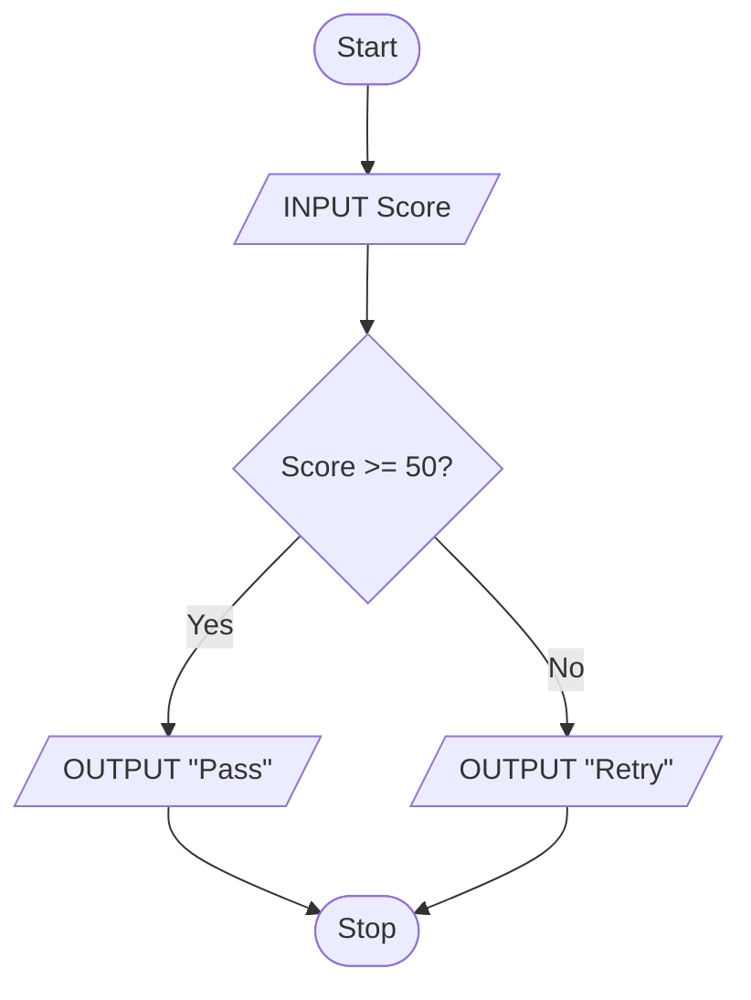

# IGCSE 0478 Chapter 7: Algorithm Design and Problem-Solving

<div class="chapter-meta"><strong>IGCSE 0478 · Paper 2</strong><span>0478 · 2026–2028 · Version 5</span></div>

## Official Syllabus Checklist

Revise: program development; algorithm design; standard methods; validation, testing and trace tables.

> The checklist paraphrases the syllabus for revision. Use the official syllabus as the final authority.

## Core Knowledge

Use the topic sections below to connect definitions, processes, comparisons and calculations.

> **Paper 2 focus:** turn a problem into a precise algorithm, test it systematically, trace it accurately, and correct errors.

---

## Syllabus Map

Use this chapter to check every Topic 7 objective.

| Objective | Where it is covered |
|---|---|
| Program development life cycle | Program Development Life Cycle |
| Decomposition, abstraction and subsystem design | Program Development Life Cycle; Describing an Algorithm |
| Structure diagrams, flowcharts and pseudocode | Describing an Algorithm |
| Algorithm purpose and input-process-output-storage | Describing an Algorithm |
| Linear search, bubble sort, totalling, counting, maximum, minimum and average | Standard Algorithm Methods |
| Validation and verification | Validation and Verification |
| Normal, abnormal, extreme and boundary test data | Test Data |
| Trace tables | Trace Tables |
| Find and correct algorithm errors | Finding and Correcting Errors |
| Write and amend algorithms | Worked Examples and practice sections |

---

## Program Development Life Cycle

A reliable program is developed in four broad stages.

| Stage | Main questions | Typical evidence |
|---|---|---|
| Analysis | What problem must be solved? What are the inputs, outputs and constraints? | Requirements, input/output list, validation rules |
| Design | How will the solution work? How can it be divided into smaller parts? | Structure diagram, flowchart, pseudocode, data design |
| Coding | How is the design translated into a programming language and checked as it is built? | Source code with meaningful identifiers, comments and iterative tests |
| Testing | Does every part work for valid and invalid cases? | Test plan, expected results, actual results, corrections |

### Decomposition

**Decomposition** breaks a complex problem into smaller subsystems. Each subsystem should have one clear purpose and defined inputs and outputs.

For a school event booking system, possible subsystems are:

- enter attendee details
- validate ticket quantity
- calculate price
- save booking
- display confirmation

This makes the design easier to understand, code and test.

### Abstraction

**Abstraction** keeps the details needed to solve the problem and removes details that do not affect the solution.

For the event-booking system, the algorithm needs the ticket type, quantity and price. It does not need the attendee's favourite colour or the colour of the payment card. Removing irrelevant details makes the inputs, rules and data structures easier to identify.

Abstraction and decomposition solve different design problems:

| Method | Question answered | Event-booking example |
|---|---|---|
| Decomposition | What smaller subsystems are needed? | input, validation, price calculation, saving and output |
| Abstraction | Which details matter inside those subsystems? | keep ticket type and quantity; ignore unrelated personal preferences |

**Exam cue:** when asked how abstraction helps, name an irrelevant detail that is removed and explain how this simplifies the model or algorithm.

---

## Describing an Algorithm

An **algorithm** is a finite sequence of unambiguous steps that solves a problem.

Before writing pseudocode, identify:

| Element | Question |
|---|---|
| Input | What data enters the system? |
| Process | What calculations, decisions or repetitions occur? |
| Output | What information is produced? |
| Storage | What data must be kept for later use? |

### Structure diagrams

A structure diagram shows how a problem is decomposed.

```text
Event booking
├── Enter booking
├── Validate quantity
├── Calculate total
├── Save booking
└── Display confirmation
```

It shows the parts of a solution, not the detailed order of every instruction.

### Flowchart symbols

| Symbol shape | Purpose |
|---|---|
| Oval / rounded rectangle | Start or stop |
| Parallelogram | Input or output |
| Rectangle | Process or assignment |
| Diamond | Decision with labelled branches |
| Arrow | Direction of control flow |



### Pseudocode essentials

```text
INPUT Age
NextAge <- Age + 1

IF NextAge >= 18
THEN
    OUTPUT "Adult"
ELSE
    OUTPUT "Under 18"
ENDIF
```

Use indentation to make the logic visible. Every selection and loop must have a clear ending.

The same algorithm can be expressed as program code. For example, in Python:

```python
age = int(input())
next_age = age + 1

if next_age >= 18:
    print("Adult")
else:
    print("Under 18")
```

When changing representation, preserve the inputs, calculation, condition and both outputs; language punctuation may change, but behaviour must not.

When explaining a supplied algorithm, separate two ideas:

- **purpose:** state the overall result that the algorithm achieves
- **processes:** describe the important inputs, calculations, decisions, repetitions, storage changes and outputs that produce that result

Do not answer a purpose question by copying one instruction. Do not answer a process question with only a general purpose.

---

## Standard Algorithm Methods

### Linear search

Check each element in order until the target is found or the array ends.

```text
Found <- FALSE
Index <- 1

WHILE Index <= 6 AND Found = FALSE DO
    IF Names[Index] = Target
    THEN
        Found <- TRUE
    ELSE
        Index <- Index + 1
    ENDIF
ENDWHILE
```

### Bubble sort

Compare adjacent elements and swap them when they are in the wrong order. Repeat passes until the array is sorted.

```text
FOR Pass <- 1 TO 5
    FOR Index <- 1 TO 6 - Pass
        IF Scores[Index] > Scores[Index + 1]
        THEN
            Temp <- Scores[Index]
            Scores[Index] <- Scores[Index + 1]
            Scores[Index + 1] <- Temp
        ENDIF
    NEXT Index
NEXT Pass
```

The largest unsorted value moves to the right after each ascending pass.

### Totalling, counting and average

```text
Total <- 0
Count <- 0

FOR Index <- 1 TO 8
    Total <- Total + Values[Index]
    IF Values[Index] >= 50
    THEN
        Count <- Count + 1
    ENDIF
NEXT Index

Average <- Total / 8
```

### Maximum and minimum

Initialise from the first real data item, not from an assumed value such as zero.

```text
Maximum <- Values[1]
Minimum <- Values[1]

FOR Index <- 2 TO 8
    IF Values[Index] > Maximum
    THEN
        Maximum <- Values[Index]
    ENDIF
    IF Values[Index] < Minimum
    THEN
        Minimum <- Values[Index]
    ENDIF
NEXT Index
```

This still works when all values are negative.

---

## Validation and Verification

**Validation** checks whether input is sensible and follows rules. It does not prove that the value is factually correct.

| Validation check | Example |
|---|---|
| Range | Mark must be from 0 to 100 inclusive |
| Length | Product code must contain 8 characters |
| Type check | Quantity must be an integer |
| Presence | Name must not be empty |
| Format | Date must follow DD/MM/YYYY |
| Check digit | Recalculate and compare the final digit of an identification code |

**Verification** checks that data has been copied or entered accurately.

- **visual check:** the user compares the entered value with the source
- **double entry:** the same data is entered twice and the two versions are compared

### A robust validation loop

```text
REPEAT
    INPUT Mark
UNTIL Mark >= 0 AND Mark <= 100
```

The condition after `UNTIL` describes valid data because the loop stops when that condition is true.

---

## Test Data

| Test type | Meaning | Example for valid range 1–120 |
|---|---|---|
| Normal | Valid, ordinary value away from limits | 45 |
| Abnormal | Invalid value that should be rejected | 0, 121 or "ten" |
| Extreme | Valid value at the lowest or highest permitted limit | 1 or 120 |
| Boundary | Values on and immediately around a limit | 0, 1, 2 and 119, 120, 121 |

The key distinction is:

- extreme values are valid endpoints
- boundary testing includes endpoints and nearby values on both sides

A useful test plan states the input, test type, expected outcome, actual outcome and pass/fail result.

---

## Trace Tables

A trace table records how variables and outputs change after each relevant instruction.

For the algorithm:

```text
Total <- 0
FOR Index <- 1 TO 4
    OUTPUT "Value ", Index, ":"
    INPUT Numbers[Index]
    Total <- Total + Numbers[Index]
    IF MOD(Numbers[Index], 2) = 0
    THEN
        OUTPUT Numbers[Index]
    ENDIF
NEXT Index
OUTPUT Total
```

and the inputs `5, 2, 7, 4`:

| Index | Prompt | Numbers[Index] | Total | Output |
|---:|---|---:|---:|---:|
| 1 | `Value 1:` | 5 | 5 | |
| 2 | `Value 2:` | 2 | 7 | 2 |
| 3 | `Value 3:` | 7 | 14 | |
| 4 | `Value 4:` | 4 | 18 | 4 |
| after loop | | | 18 | 18 |

Write a new row only when a relevant value changes or output occurs. A prompt is output too, so give it its own column when the trace must show all output.

---

## Finding and Correcting Errors

Three useful error categories are:

- **syntax error:** an instruction breaks the language rules
- **logic error:** the algorithm runs but produces the wrong result
- **runtime error:** execution fails, for example because an array index is outside its bounds

Use this correction method:

1. state the intended result
2. trace a small input
3. identify the first row where actual state differs from expected state
4. change only the faulty instruction
5. retest normal, boundary and abnormal cases where relevant

Example error:

```text
Maximum <- 0
```

If all readings are negative, the reported maximum is incorrectly zero. Correct it by using the first reading:

```text
Maximum <- Readings[1]
```

---

## Worked Example 1 — From Requirements to Design

A cinema sells up to six tickets in one booking. Each ticket costs $8. A booking code and ticket quantity are entered. The quantity must be from 1 to 6. The system displays the total and stores the booking.

### Analysis

- input: booking code, ticket quantity
- process: validate quantity; multiply by 8
- output: total charge
- storage: booking code, quantity and total

### Decomposition

```text
Cinema booking
├── Input booking data
├── Validate ticket quantity
├── Calculate total
├── Store booking
└── Display total
```

### Pseudocode design

Assume `BookingCount` and three matching booking arrays have already been declared.

```text
INPUT BookingCode

REPEAT
    INPUT Quantity
UNTIL Quantity >= 1 AND Quantity <= 6

Total <- Quantity * 8
BookingCount <- BookingCount + 1
BookingCodes[BookingCount] <- BookingCode
TicketQuantities[BookingCount] <- Quantity
BookingTotals[BookingCount] <- Total
OUTPUT Total
```

### Test selection

| Input quantity | Type | Expected result |
|---:|---|---|
| 3 | normal | accepted; total 24 |
| 1 | extreme and boundary | accepted; total 8 |
| 0 | boundary and abnormal | rejected |
| 6 | extreme and boundary | accepted; total 48 |
| 7 | boundary and abnormal | rejected |

---

## Worked Example 2 — Trace a Search and Total

`Codes = ["B4", "A2", "C7", "D1"]` and `Prices = [12, 9, 15, 6]`. The target is `"C7"`.

```text
Index <- 1
Found <- FALSE
Total <- 0

WHILE Index <= 4 AND Found = FALSE DO
    Total <- Total + Prices[Index]
    IF Codes[Index] = "C7"
    THEN
        Found <- TRUE
    ELSE
        Index <- Index + 1
    ENDIF
ENDWHILE
```

| Index | Codes[Index] | Total | Found |
|---:|---|---:|---|
| 1 | B4 | 12 | FALSE |
| 2 | A2 | 21 | FALSE |
| 3 | C7 | 36 | TRUE |

Final state: `Index = 3`, `Total = 36`, `Found = TRUE`. The total includes only the prices inspected before the search stops.

---

## Worked Example 3 — One Bubble-Sort Pass

Sort `[7, 3, 5, 2]` into ascending order. One pass compares positions 1–2, 2–3 and 3–4.

| Comparison | Action | Array after action |
|---|---|---|
| 7 and 3 | swap | [3, 7, 5, 2] |
| 7 and 5 | swap | [3, 5, 7, 2] |
| 7 and 2 | swap | [3, 5, 2, 7] |

After one pass, the largest value is in its final position. The array is not fully sorted, so more passes are required.

A common faulty swap is:

```text
Values[Index] <- Values[Index + 1]
Values[Index + 1] <- Values[Index]
```

The original first value is lost. A temporary variable is necessary.

---

## Targeted Syllabus Drill

These short tasks separate syllabus actions that are easy to merge accidentally.

1. For each development stage, state one required action or product:
   - analysis
   - design
   - coding
   - testing. **[4]**
2. A library system is divided into `Loans` and `Members`; `Loans` is further divided into `IssueBook` and `ReturnBook`.
   - state what this hierarchy demonstrates **[1]**
   - list one input, one process, one output and one item of storage for `IssueBook` **[4]**
   - name the representation best suited to showing the hierarchy and one representation best suited to showing the detailed control flow **[2]**.
3. A supplied algorithm inputs six temperatures, totals them and outputs the average. State its purpose, then describe its main processes. **[2]**
4. Select or complete the required standard method:
   - find a target in an unsorted list **[1]**
   - arrange values by repeated adjacent comparisons **[1]**
   - write one totalling statement and one conditional counting statement **[2]**
   - write pseudocode that finds the maximum, minimum and average of `Values[1:Count]`, where `Count > 0` **[4]**.
5. State why validation is needed, then name the validation check used by each rule: value from 1 to 20; exactly eight characters; integer only; must not be blank; `LL999` pattern; recalculated final digit. **[7]**
6. State why verification is needed, then state when a visual check is used and when double entry is used. **[3]**
7. A faulty flowchart inputs `Mark`, sends a valid value back to the input and sends an invalid value to output. Draw the corrected flowchart so it repeatedly inputs until `0 <= Mark <= 100`, then outputs `Mark`. Include labelled decision branches. **[2]**
8. Amend this Python condition so that it accepts both endpoints of the valid range 0 to 100. **[2]**

   ```python
   if mark > 0 and mark < 100:
       print("Accepted")
   ```

**Total: 28 marks**

### Targeted Syllabus Drill Answers

1. Analysis identifies the problem and requirements, using decomposition and abstraction where needed **[1]**; design decomposes the solution and produces a structure diagram, flowchart or pseudocode **[1]**; coding translates the design into program code and tests it iteratively **[1]**; testing applies planned test data and compares actual with expected results **[1]**. **[4]**
2. The system has been decomposed into subsystems and then further subsystems **[1]**. Suitable `IssueBook` answers include member/book identifiers as input, checking eligibility and updating loan status as processes, confirmation as output, and the loan record as storage **[4]**. A structure diagram shows the hierarchy **[1]**; a flowchart or pseudocode shows detailed control flow **[1]**. **[7]**
3. Purpose: calculate and display the average of six temperatures **[1]**. Processes: input six values, accumulate a total, divide by six and output the result **[1]**. **[2]**
4. Linear search **[1]**; bubble sort **[1]**; for example `Total <- Total + Value` and `IF condition THEN Count <- Count + 1` **[2]**. For the final part, award initialising `Maximum`, `Minimum` and `Total` from real data/zero as appropriate **[1]**, processing every remaining item **[1]**, updating both extrema correctly **[1]**, and calculating `Average <- Total / Count` **[1]**. **[8]**
5. Validation rejects data that does not satisfy the stated rules before it is processed **[1]**; range; length; type check; presence; format; check digit **[6]**. **[7]**
6. Verification is needed to detect inaccurate copying or entry **[1]**; a visual check compares entered data with its source **[1]**; double entry inputs the same data twice and compares the two entries **[1]**. **[3]**
7. Award for an input followed by a decision that loops on the labelled `No` branch **[1]**, and an output reached on the labelled `Yes` branch **[1]**. **[2]**
8. `if mark >= 0 and mark <= 100:` **[1]**, with the existing output kept in the selection **[1]**. **[2]**

---

## Required Ideas and Exam Language

Use technical terms as part of a complete statement: identify the component or method, state what it does, then link its effect to the question context. A keyword without a correct relationship is not a complete marking point.

## Common Confusions

- [ ] I do not confuse validation with verification.
- [ ] I distinguish extreme data from the wider set of boundary data.
- [ ] I initialise totals and counters before a loop.
- [ ] I initialise maximum and minimum from real data.
- [ ] I update the loop control variable when using a `WHILE` loop.
- [ ] I use a temporary variable when swapping.
- [ ] I check array bounds and use one indexing convention consistently.
- [ ] I label flowchart decision branches.
- [ ] I trace prompts and outputs as well as variables when required.
- [ ] I answer the actual scenario instead of reproducing a memorised algorithm.

---

## Worked Examples

The worked calculations, process templates and scenario answers above model the chain of reasoning expected in examination responses. Rework each example before reading its answer.

## 10-Mark Quick Check

1. Name the four stages of the program development life cycle. **[4]**
2. State one difference between decomposition and abstraction. **[2]**
3. State one difference between validation and verification. **[2]**
4. State the purpose of a linear search and the purpose of a bubble sort. **[2]**

**Total: 10 marks**

## Quick Check Answers

1. Analysis, design, coding and testing. Award one mark for each. **[4]**
2. Decomposition divides the problem into smaller subsystems **[1]**; abstraction removes irrelevant detail while keeping the features needed by the solution **[1]**. **[2]**
3. Validation checks that data is sensible or follows rules; verification checks that data was entered/copied accurately. **[2]**
4. Linear search finds a target by checking items in sequence; bubble sort repeatedly compares and swaps adjacent items to place data in order. **[2]**

---

## 20-Mark Exam Practice

A running club records eight lap times in seconds in the array `LapTime[1:8]`. Every time must be from 30 to 180 inclusive.

1. Identify one input, one process and one output for this system, then name one detail that can be removed by abstraction. **[4]**
2. Give one normal value, both extreme values and one abnormal value for testing a lap-time input. **[4]**
3. Explain why double entry is verification rather than validation. **[2]**
4. The following algorithm is intended to find the fastest time:

   ```text
   Fastest <- 0
   FOR Index <- 1 TO 8
       IF LapTime[Index] > Fastest
       THEN
           Fastest <- LapTime[Index]
       ENDIF
   NEXT Index
   ```

   Identify two logic errors and state a correction for each. **[4]**
5. Write pseudocode to:
   - input and validate eight lap times
   - calculate their total and average
   - count how many are below 60 seconds
   - output the average and count. **[6]**

**Total: 20 marks**

### 20 Marks Practice Mark Scheme

1. Any suitable input such as a lap time; process such as calculate average/count values below 60; output such as the average or count **[3]**; one irrelevant detail that can be removed, such as the runner's favourite colour **[1]**. **[4]**
2. Normal: any integer clearly within the range, such as 75; extremes: 30 and 180; abnormal: any value outside the range or wrong type, such as 181. **[4]**
3. Double entry compares two versions to check accurate entry **[1]**; it does not check whether the value satisfies a sensible rule **[1]**. **[2]**
4. `Fastest` should be initialised to `LapTime[1]`, not zero **[2]**; a faster time is smaller, so the comparison should use `<`, not `>` **[2]**. **[4]**
5. Example solution:

   ```text
   Total <- 0
   Under60 <- 0

   FOR Index <- 1 TO 8
       REPEAT
           INPUT LapTime[Index]
       UNTIL LapTime[Index] >= 30 AND LapTime[Index] <= 180

       Total <- Total + LapTime[Index]
       IF LapTime[Index] < 60
       THEN
           Under60 <- Under60 + 1
       ENDIF
   NEXT Index

   Average <- Total / 8
   OUTPUT Average
   OUTPUT Under60
   ```

   Award for: initialising total and counter **[1]**; correct eight-item loop **[1]**; valid range loop and storing each input **[1]**; correct total **[1]**; correct conditional count **[1]**; correct average and both outputs **[1]**. **[6]**

---

## Final Revision Checklist

- [ ] I can move from requirements to input-process-output-storage.
- [ ] I can decompose a solution before coding.
- [ ] I can read and write structure diagrams, flowcharts and pseudocode.
- [ ] I can apply all seven standard algorithm methods.
- [ ] I can choose validation, verification and test data precisely.
- [ ] I can complete trace tables without skipping state changes.
- [ ] I can identify, explain and correct algorithm errors.
- [ ] I completed both practice sets without looking at the answers first.
